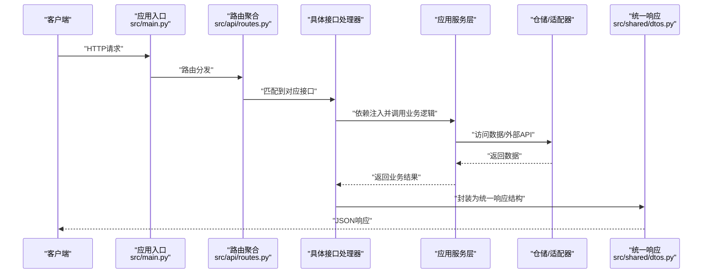

# API接口文档

<cite>
**本文档引用的文件**
- [src/main.py](file://src/main.py)
- [src/api/routes.py](file://src/api/routes.py)
- [src/api/health.py](file://src/api/health.py)
- [src/api/middlewares/error_handler.py](file://src/api/middlewares/error_handler.py)
- [src/shared/dtos.py](file://src/shared/dtos.py)
- [src/modules/data_engineering/presentation/rest/stock_routes.py](file://src/modules/data_engineering/presentation/rest/stock_routes.py)
- [src/modules/data_engineering/presentation/rest/scheduler_routes.py](file://src/modules/data_engineering/presentation/rest/scheduler_routes.py)
- [src/modules/research/presentation/rest/financial_auditor_routes.py](file://src/modules/research/presentation/rest/financial_auditor_routes.py)
- [src/modules/research/presentation/rest/technical_analyst_routes.py](file://src/modules/research/presentation/rest/technical_analyst_routes.py)
- [src/modules/research/presentation/rest/valuation_modeler_routes.py](file://src/modules/research/presentation/rest/valuation_modeler_routes.py)
- [src/modules/llm_platform/presentation/rest/chat_routes.py](file://src/modules/llm_platform/presentation/rest/chat_routes.py)
- [src/modules/llm_platform/presentation/rest/config_routes.py](file://src/modules/llm_platform/presentation/rest/config_routes.py)
- [src/modules/llm_platform/presentation/rest/search_routes.py](file://src/modules/llm_platform/presentation/rest/search_routes.py)
- [src/modules/judge/presentation/rest/judge_router.py](file://src/modules/judge/presentation/rest/judge_router.py)
- [src/modules/judge/presentation/rest/judge_schemas.py](file://src/modules/judge/presentation/rest/judge_schemas.py)
- [src/modules/judge/application/dtos/verdict_dto.py](file://src/modules/judge/application/dtos/verdict_dto.py)
- [src/modules/judge/application/services/judge_service.py](file://src/modules/judge/application/services/judge_service.py)
- [src/modules/judge/domain/dtos/judge_input.py](file://src/modules/judge/domain/dtos/judge_input.py)
- [src/modules/judge/domain/dtos/verdict_result.py](file://src/modules/judge/domain/dtos/verdict_result.py)
- [src/modules/judge/domain/ports/judge_verdict_agent.py](file://src/modules/judge/domain/ports/judge_verdict_agent.py)
- [src/modules/judge/infrastructure/adapters/judge_verdict_agent_adapter.py](file://src/modules/judge/infrastructure/adapters/judge_verdict_agent_adapter.py)
- [src/modules/judge/container.py](file://src/modules/judge/container.py)
- [README.md](file://README.md)
</cite>

## 目录
1. [简介](#简介)
2. [项目结构](#项目结构)
3. [核心组件](#核心组件)
4. [架构总览](#架构总览)
5. [详细组件分析](#详细组件分析)
6. [依赖关系分析](#依赖关系分析)
7. [性能考虑](#性能考虑)
8. [故障排除指南](#故障排除指南)
9. [结论](#结论)
10. [附录](#附录)

## 简介
本文件为"股票助手"项目的完整API接口文档，覆盖健康检查、股票数据接口、研究分析接口、裁决接口与LLM平台接口的RESTful规范。文档详细说明了各接口的HTTP方法、URL模式、请求参数、响应格式、参数验证规则、数据类型要求、业务约束条件、错误处理策略与状态码含义，并提供请求/响应示例与客户端集成建议。

## 项目结构
- 应用入口与路由聚合
  - 应用程序在主入口中初始化FastAPI、CORS、全局异常中间件，并注册统一的API路由。
  - API路由聚合器将健康检查、数据工程、研究分析、裁决、LLM平台等模块的路由整合。
- 统一响应与错误处理
  - 统一响应结构封装于共享模块，错误处理中间件负责捕获异常并返回标准化错误体。
- 版本与文档
  - 应用通过配置项设置OpenAPI与文档路径，便于本地调试与联调。

```mermaid
graph TB
A["应用入口<br/>src/main.py"] --> B["路由聚合<br/>src/api/routes.py"]
B --> C["健康检查<br/>src/api/health.py"]
B --> D["数据工程-股票接口<br/>src/modules/data_engineering/presentation/rest/stock_routes.py"]
B --> E["数据工程-调度器接口<br/>src/modules/data_engineering/presentation/rest/scheduler_routes.py"]
B --> F["研究-财务审计接口<br/>src/modules/research/presentation/rest/financial_auditor_routes.py"]
B --> G["研究-技术分析接口<br/>src/modules/research/presentation/rest/technical_analyst_routes.py"]
B --> H["研究-估值建模接口<br/>src/modules/research/presentation/rest/valuation_modeler_routes.py"]
B --> I["裁决接口<br/>src/modules/judge/presentation/rest/judge_router.py"]
B --> J["LLM-聊天接口<br/>src/modules/llm_platform/presentation/rest/chat_routes.py"]
B --> K["LLM-配置接口<br/>src/modules/llm_platform/presentation/rest/config_routes.py"]
B --> L["LLM-搜索接口<br/>src/modules/llm_platform/presentation/rest/search_routes.py"]
A --> M["全局异常中间件<br/>src/api/middlewares/error_handler.py"]
A --> N["统一响应结构<br/>src/shared/dtos.py"]
```

图表来源
- [src/main.py](file://src/main.py#L1-L75)
- [src/api/routes.py](file://src/api/routes.py#L1-L19)
- [src/api/health.py](file://src/api/health.py#L1-L24)
- [src/api/middlewares/error_handler.py](file://src/api/middlewares/error_handler.py#L1-L46)
- [src/shared/dtos.py](file://src/shared/dtos.py#L1-L33)

章节来源
- [src/main.py](file://src/main.py#L1-L75)
- [src/api/routes.py](file://src/api/routes.py#L1-L19)

## 核心组件
- 统一响应结构
  - 成功响应：包含success、message、data字段，泛型承载具体业务数据。
  - 错误响应：包含success=False、code、message，必要时包含details。
- 全局异常处理
  - 捕获自定义应用异常与未捕获异常，统一返回标准错误体。
- CORS与启动/关闭事件
  - 支持跨域配置；启动时初始化调度器与LLM平台；关闭时优雅停机。

章节来源
- [src/shared/dtos.py](file://src/shared/dtos.py#L1-L33)
- [src/api/middlewares/error_handler.py](file://src/api/middlewares/error_handler.py#L1-L46)
- [src/main.py](file://src/main.py#L1-L75)

## 架构总览
以下序列图展示典型请求从客户端到服务端的调用链路，包括路由分发、依赖注入、业务处理与响应返回。

图表来源
- [src/main.py](file://src/main.py#L61-L66)
- [src/api/routes.py](file://src/api/routes.py#L7-L16)
- [src/shared/dtos.py](file://src/shared/dtos.py#L7-L19)

## 详细组件分析

### 健康检查接口
- 端点
  - 方法：GET
  - URL：/api/v1/health
  - 功能：检查应用状态及数据库连接
- 请求参数
  - 无
- 响应
  - 成功：{"status": "ok", "database": "connected"}
  - 失败：{"status": "error", "database": "disconnected", "details": "<错误信息>"}
- 示例
  - 成功：{"status":"ok","database":"connected"}
  - 失败：{"status":"error","database":"disconnected","details":"<异常信息>"}

章节来源
- [src/api/health.py](file://src/api/health.py#L10-L24)
- [src/main.py](file://src/main.py#L19-L19)

### 数据工程接口

#### 同步股票基础列表
- 端点
  - 方法：POST
  - URL：/api/v1/stocks/sync
  - 功能：同步股票基础列表
- 请求参数
  - 无
- 响应
  - data.synced_count: 同步数量
  - data.message: 描述信息
- 示例
  - {"success":true,"code":"SYNC_SUCCESS","message":"Stock sync success","data":{"synced_count":100,"message":"同步完成"}}

章节来源
- [src/modules/data_engineering/presentation/rest/stock_routes.py](file://src/modules/data_engineering/presentation/rest/stock_routes.py#L57-L78)

#### 同步股票日线历史数据
- 端点
  - 方法：POST
  - URL：/api/v1/stocks/sync/daily
  - 功能：同步股票日线历史数据
- 请求参数
  - limit: 整数，缺省10
  - offset: 整数，缺省0
- 响应
  - data.synced_stocks: 影响股票数
  - data.total_rows: 同步行数
  - data.message: 描述信息
- 示例
  - {"success":true,"code":"SYNC_DAILY_SUCCESS","message":"股票日线数据同步成功","data":{"synced_stocks":50,"total_rows":1000,"message":"同步完成"}}

章节来源
- [src/modules/data_engineering/presentation/rest/stock_routes.py](file://src/modules/data_engineering/presentation/rest/stock_routes.py#L79-L106)

#### 调度器状态与任务控制
- 端点
  - GET /api/v1/scheduler/status
    - 功能：获取调度器状态与已注册任务列表
    - 响应：is_running、jobs（含id、name、next_run_time、trigger、kwargs）、available_jobs
  - POST /api/v1/scheduler/jobs/{job_id}/start
    - 功能：以间隔模式启动任务（每X分钟执行）
    - 请求体：interval_minutes（整数，分钟）
  - POST /api/v1/scheduler/jobs/{job_id}/schedule
    - 功能：以Cron模式启动任务（每天固定时间）
    - 请求体：hour（0-23）、minute（0-59）
  - POST /api/v1/scheduler/jobs/{job_id}/trigger
    - 功能：立即触发一次任务
    - 请求体：params（可选字典）
  - POST /api/v1/scheduler/jobs/{job_id}/stop
    - 功能：停止指定任务
- 响应
  - 统一响应结构，data为字符串或对象
- 示例
  - 状态：{"success":true,"code":"SCHEDULER_STATUS","message":"获取状态成功","data":{"is_running":true,"jobs":[{"id":"sync_daily_history","name":"历史数据同步","next_run_time":"2025-01-01T12:00:00","trigger":"interval","kwargs":{}}],"available_jobs":["sync_daily_history","sync_daily_by_date","sync_history_finance","sync_incremental_finance"]}}
  - 启动：{"success":true,"code":"JOB_STARTED","message":"已启动任务 'sync_daily_history'，每 60 分钟执行一次","data":"started"}

章节来源
- [src/modules/data_engineering/presentation/rest/scheduler_routes.py](file://src/modules/data_engineering/presentation/rest/scheduler_routes.py#L45-L233)

### 研究分析接口

#### 财务审计接口
- 端点
  - 方法：GET
  - URL：/api/v1/research/financial-audit
  - 功能：对指定股票进行财务审计
- 查询参数
  - symbol: 股票代码（必填）
  - limit: 最近期数，默认5，范围[1,20]
- 响应
  - financial_score: 整数
  - signal: STRONG_BULLISH/BULLISH/NEUTRAL/BEARISH/STRONG_BEARISH
  - confidence: 浮点数
  - summary_reasoning: 字符串
  - dimension_analyses: 列表
  - key_risks: 列表
  - risk_warning: 字符串
  - input: 用户prompt（由代码注入）
  - financial_indicators: 财务指标快照（由代码注入）
  - output: 大模型原始返回（由代码注入）
- 示例
  - {"financial_score":80,"signal":"BULLISH","confidence":0.9,"summary_reasoning":"基于财务指标的综合分析...","dimension_analyses":[{...}],"key_risks":["流动性风险"],"risk_warning":"需关注短期偿债能力变化","input":"用户prompt内容...","financial_indicators":{...},"output":"模型原始输出..."}

章节来源
- [src/modules/research/presentation/rest/financial_auditor_routes.py](file://src/modules/research/presentation/rest/financial_auditor_routes.py#L56-L81)

#### 技术分析接口
- 端点
  - 方法：GET
  - URL：/api/v1/research/technical-analysis
  - 功能：对指定股票进行技术分析
- 查询参数
  - ticker: 股票代码（必填）
  - analysis_date: 分析基准日（YYYY-MM-DD，可选，默认当天）
- 响应
  - signal: BULLISH/BEARISH/NEUTRAL
  - confidence: 浮点数
  - summary_reasoning: 字符串
  - key_technical_levels: 支撑/阻力等关键位置
  - risk_warning: 字符串
  - input: 用户prompt（由代码注入）
  - technical_indicators: 技术指标快照（由代码注入）
  - output: 大模型原始返回（由代码注入）
- 示例
  - {"signal":"NEUTRAL","confidence":0.75,"summary_reasoning":"当日价格处于震荡区间...","key_technical_levels":{"support":100.5,"resistance":110.2},"risk_warning":"成交量不足可能影响突破有效性","input":"用户prompt内容...","technical_indicators":{...},"output":"模型原始输出..."}

章节来源
- [src/modules/research/presentation/rest/technical_analyst_routes.py](file://src/modules/research/presentation/rest/technical_analyst_routes.py#L50-L79)

#### 估值建模接口
- 端点
  - 方法：GET
  - URL：/api/v1/research/valuation-model
  - 功能：对指定股票进行估值建模
- 查询参数
  - symbol: 股票代码（必填）
- 响应
  - valuation_verdict: Undervalued (低估)/Fair (合理)/Overvalued (高估)
  - confidence_score: 0~1浮点数
  - estimated_intrinsic_value_range: {lower_bound, upper_bound}
  - key_evidence: 列表（非空）
  - risk_factors: 列表（非空）
  - reasoning_summary: 字符串
  - input: 用户prompt（由代码注入）
  - valuation_indicators: 估值指标快照（由代码注入）
  - output: 大模型原始返回（由代码注入）
- 示例
  - {"valuation_verdict":"Fair (合理)","confidence_score":0.8,"estimated_intrinsic_value_range":{"lower_bound":"保守模型推导下界","upper_bound":"乐观模型推导上界"},"key_evidence":["现金流折现模型","可比公司法"],"risk_factors":["行业周期性波动"],"reasoning_summary":"基于多模型综合评估...","input":"用户prompt内容...","valuation_indicators":{...},"output":"模型原始输出..."}

章节来源
- [src/modules/research/presentation/rest/valuation_modeler_routes.py](file://src/modules/research/presentation/rest/valuation_modeler_routes.py#L58-L82)

### 裁决接口

#### 执行裁决接口
- 端点
  - 方法：POST
  - URL：/api/v1/judge/verdict
  - 功能：根据标的与辩论结果执行综合裁决，返回可执行操作指令
- 请求体
  - symbol: 字符串（必填，标的代码）
  - debate_outcome: 对象（必填，辩论结果）
    - direction: 字符串（必填，BULLISH/BEARISH/NEUTRAL）
    - confidence: 浮点数（必填，0.0-1.0）
    - bull_case: 对象（必填，多头核心论点）
      - core_thesis: 字符串（必填）
    - bear_case: 对象（必填，空头核心论点）
      - core_thesis: 字符串（必填）
    - risk_matrix: 数组（必填，风险因子列表）
    - key_disagreements: 数组（必填，核心分歧点列表）
    - conflict_resolution: 字符串（必填，冲突消解结论）
- 响应
  - symbol: 字符串（标的代码）
  - action: 字符串（操作方向：BUY/SELL/HOLD）
  - position_percent: 浮点数（建议仓位比例，0.0-1.0）
  - confidence: 浮点数（裁决置信度，0.0-1.0）
  - entry_strategy: 字符串（入场策略描述）
  - stop_loss: 字符串（止损策略）
  - take_profit: 字符串（止盈策略）
  - time_horizon: 字符串（持有周期建议）
  - risk_warnings: 数组（关键风控约束）
  - reasoning: 字符串（裁决理由摘要）
- 参数验证规则
  - symbol必须存在且非空
  - debate_outcome必须为非空对象
  - direction必须为BULLISH/BEARISH/NEUTRAL之一
  - position_percent/confidence/conflict_resolution必须在0.0-1.0范围内
- 错误处理
  - 400：参数验证失败（symbol为空或debate_outcome无效）
  - 500：LLM输出解析失败或系统内部错误
- 示例
  - 请求：{"symbol":"000001.SZ","debate_outcome":{"direction":"BULLISH","confidence":0.7,"bull_case":{"core_thesis":"估值偏低"},"bear_case":{"core_thesis":"景气度下行"},"risk_matrix":[{"risk":"政策"}],"key_disagreements":["估值分歧"],"conflict_resolution":"综合偏多"}}
  - 响应：{"symbol":"000001.SZ","action":"BUY","position_percent":0.3,"confidence":0.72,"entry_strategy":"分批建仓","stop_loss":"-5%","take_profit":"+15%","time_horizon":"3-6个月","risk_warnings":["流动性风险"],"reasoning":"综合偏多"}

章节来源
- [src/modules/judge/presentation/rest/judge_router.py](file://src/modules/judge/presentation/rest/judge_router.py#L50-L91)
- [src/modules/judge/presentation/rest/judge_schemas.py](file://src/modules/judge/presentation/rest/judge_schemas.py#L9-L32)
- [src/modules/judge/application/dtos/verdict_dto.py](file://src/modules/judge/application/dtos/verdict_dto.py#L9-L22)
- [src/modules/judge/application/services/judge_service.py](file://src/modules/judge/application/services/judge_service.py#L17-L35)
- [src/modules/judge/domain/dtos/judge_input.py](file://src/modules/judge/domain/dtos/judge_input.py#L9-L23)
- [src/modules/judge/domain/dtos/verdict_result.py](file://src/modules/judge/domain/dtos/verdict_result.py#L9-L21)
- [src/modules/judge/domain/ports/judge_verdict_agent.py](file://src/modules/judge/domain/ports/judge_verdict_agent.py#L12-L19)
- [src/modules/judge/infrastructure/adapters/judge_verdict_agent_adapter.py](file://src/modules/judge/infrastructure/adapters/judge_verdict_agent_adapter.py#L36-L56)
- [src/modules/judge/container.py](file://src/modules/judge/container.py#L19-L31)

### LLM平台接口

#### 聊天生成接口
- 端点
  - 方法：POST
  - URL：/api/v1/llm-platform/chat/generate
  - 功能：调用大模型生成文本
- 请求体
  - prompt: 字符串（必填）
  - system_message: 字符串（可选）
  - alias: 字符串（可选，指定模型别名）
  - tags: 字符串数组（可选，按标签筛选）
  - temperature: 浮点数[0.0,2.0]，默认0.7
- 响应
  - response: 生成的文本
- 示例
  - 请求：{"prompt":"请分析某股票","alias":"gpt-4","temperature":0.7}
  - 响应：{"response":"模型生成的分析内容..."}

章节来源
- [src/modules/llm_platform/presentation/rest/chat_routes.py](file://src/modules/llm_platform/presentation/rest/chat_routes.py#L34-L69)

#### 配置管理接口
- 端点
  - GET /api/v1/llm-platform/configs
    - 功能：获取所有大模型配置
  - GET /api/v1/llm-platform/configs/{alias}
    - 功能：按别名获取配置详情
  - POST /api/v1/llm-platform/configs
    - 功能：创建新配置
  - PATCH /api/v1/llm-platform/configs/{alias}
    - 功能：更新现有配置
  - DELETE /api/v1/llm-platform/configs/{alias}
    - 功能：删除配置
  - POST /api/v1/llm-platform/configs/refresh
    - 功能：手动刷新注册表
- 请求体（创建/更新）
  - alias、vendor、provider_type、api_key、base_url、model_name、description、priority、tags、is_active
  - 注意：响应中api_key会进行脱敏显示
- 响应
  - 统一响应结构
- 示例
  - 创建：{"success":true,"code":"CREATED","message":"创建成功","data":{"id":1,"alias":"gpt-4","api_key":"***...***","is_active":true,...}}

章节来源
- [src/modules/llm_platform/presentation/rest/config_routes.py](file://src/modules/llm_platform/presentation/rest/config_routes.py#L62-L145)

#### Web搜索接口
- 端点
  - 方法：POST
  - URL：/api/v1/llm-platform/web-search/
  - 功能：调用博查AI Web Search进行搜索
- 请求体
  - query: 字符串（必填）
  - freshness: oneDay/oneWeek/oneMonth/oneYear/noLimit（可选）
  - summary: 布尔，默认true
  - count: 整数[1,50]，默认10
- 响应
  - query、total_matches（可选）、results（包含title、url、snippet、summary、site_name、published_date）
- 示例
  - 请求：{"query":"某股票最新资讯","count":10}
  - 响应：{"query":"某股票最新资讯","results":[{"title":"新闻标题","url":"https://...","snippet":"摘要","summary":"AI摘要","site_name":"站点名","published_date":"2025-01-01"}]}

章节来源
- [src/modules/llm_platform/presentation/rest/search_routes.py](file://src/modules/llm_platform/presentation/rest/search_routes.py#L80-L158)

## 依赖关系分析
- 路由聚合
  - 主入口include统一router，health与各模块router均通过include方式接入。
- 统一响应与错误处理
  - 所有接口遵循统一响应结构；全局中间件捕获异常并标准化输出。
- 依赖注入
  - 各接口通过依赖函数注入仓储、服务与外部适配器，保证解耦与可测试性。

```mermaid
graph TB
R["路由聚合<br/>src/api/routes.py"] --> H["健康检查<br/>src/api/health.py"]
R --> S["股票接口<br/>src/modules/data_engineering/presentation/rest/stock_routes.py"]
R --> SCH["调度器接口<br/>src/modules/data_engineering/presentation/rest/scheduler_routes.py"]
R --> FA["财务审计接口<br/>src/modules/research/presentation/rest/financial_auditor_routes.py"]
R --> TA["技术分析接口<br/>src/modules/research/presentation/rest/technical_analyst_routes.py"]
R --> VM["估值建模接口<br/>src/modules/research/presentation/rest/valuation_modeler_routes.py"]
R --> JUDGE["裁决接口<br/>src/modules/judge/presentation/rest/judge_router.py"]
R --> CHAT["聊天接口<br/>src/modules/llm_platform/presentation/rest/chat_routes.py"]
R --> CFG["配置接口<br/>src/modules/llm_platform/presentation/rest/config_routes.py"]
R --> WS["搜索接口<br/>src/modules/llm_platform/presentation/rest/search_routes.py"]
EH["全局异常中间件<br/>src/api/middlewares/error_handler.py"] --> R
DR["统一响应结构<br/>src/shared/dtos.py"] --> R
```

图表来源
- [src/api/routes.py](file://src/api/routes.py#L7-L16)
- [src/api/middlewares/error_handler.py](file://src/api/middlewares/error_handler.py#L8-L46)
- [src/shared/dtos.py](file://src/shared/dtos.py#L7-L19)

章节来源
- [src/api/routes.py](file://src/api/routes.py#L1-L19)
- [src/api/middlewares/error_handler.py](file://src/api/middlewares/error_handler.py#L1-L46)
- [src/shared/dtos.py](file://src/shared/dtos.py#L1-L33)

## 性能考虑
- 异步依赖与数据库会话
  - 接口广泛使用异步数据库会话，减少阻塞，提升并发吞吐。
- 限流与速率限制
  - 当前未发现内置速率限制中间件；建议在网关或反向代理层实施限流策略，避免上游API限流或被风控。
- 缓存与批处理
  - 日线数据同步支持limit/offset分页，建议客户端按批次拉取，降低单次负载。
- 调度器与后台任务
  - 调度器采用APScheduler，支持间隔与Cron两种模式；建议合理设置任务间隔，避免重复执行与资源争用。
- 裁决接口优化
  - LLM调用温度设置为0.2，提高输出稳定性；建议在生产环境配置合适的超时和重试机制。

## 故障排除指南
- 常见HTTP状态码
  - 200：成功（统一响应success=true）
  - 400：请求参数非法（如查询参数越界、symbol为空、debate_outcome无效）
  - 404：资源不存在（如任务ID或配置别名不存在）
  - 409：冲突（如创建重复配置）
  - 422：数据验证失败（如LLM输出解析失败）
  - 500：服务器内部错误
  - 502：上游搜索API错误
  - 503：服务不可用（如配置缺失或网络连接失败）
- 错误响应结构
  - {"success":false,"code":"<错误码>","message":"<友好提示>","details":"<可选细节>"}
- 定位问题建议
  - 查看应用日志（启动/关闭事件与接口日志）
  - 确认数据库连接与迁移状态
  - 检查LLM配置是否正确加载与可用
  - 对研究分析接口，确认日线数据已同步且模型配置有效
  - 对裁决接口，确认debate_outcome格式正确且包含必需字段

章节来源
- [src/api/middlewares/error_handler.py](file://src/api/middlewares/error_handler.py#L17-L45)
- [src/modules/llm_platform/presentation/rest/search_routes.py](file://src/modules/llm_platform/presentation/rest/search_routes.py#L139-L157)
- [src/modules/research/presentation/rest/financial_auditor_routes.py](file://src/modules/research/presentation/rest/financial_auditor_routes.py#L73-L78)
- [src/modules/research/presentation/rest/technical_analyst_routes.py](file://src/modules/research/presentation/rest/technical_analyst_routes.py#L71-L76)
- [src/modules/research/presentation/rest/valuation_modeler_routes.py](file://src/modules/research/presentation/rest/valuation_modeler_routes.py#L74-L79)
- [src/modules/judge/presentation/rest/judge_router.py](file://src/modules/judge/presentation/rest/judge_router.py#L83-L91)

## 结论
本API文档覆盖了健康检查、股票数据同步、研究分析、裁决与LLM平台的核心接口，明确了请求/响应规范、参数验证与错误处理策略。建议在生产环境中结合网关层实施速率限制与鉴权策略，并持续维护配置与接口一致性，确保文档与代码同步更新。

## 附录

### API版本管理
- 版本前缀
  - 所有接口均位于 /api/v1 前缀下，便于未来版本演进与兼容性管理。
- OpenAPI与文档
  - OpenAPI JSON与交互式文档可通过 /api/v1/openapi.json 与 /api/v1/docs 访问。

章节来源
- [src/main.py](file://src/main.py#L14-L18)
- [README.md](file://README.md#L19-L22)

### 安全与认证
- CORS
  - 已配置CORS中间件，允许跨域访问；请根据部署环境调整允许的源。
- 认证授权
  - 当前未发现内置认证/授权中间件；建议在网关或应用层增加鉴权策略（如API Key、JWT等）。
- 密钥与敏感信息
  - 配置接口返回的api_key会进行脱敏显示，避免泄露。
  - 裁决接口涉及敏感交易决策，建议在网关层增加访问控制与审计日志。

章节来源
- [src/main.py](file://src/main.py#L50-L60)
- [src/modules/llm_platform/presentation/rest/config_routes.py](file://src/modules/llm_platform/presentation/rest/config_routes.py#L46-L53)

### 客户端集成指南
- 快速开始
  - 健康检查：GET /api/v1/health
  - 技术分析示例：GET /api/v1/research/technical-analysis?ticker=000001.SZ&analysis_date=2024-01-15
  - 裁决示例：POST /api/v1/judge/verdict（参考测试用例中的请求格式）
- SDK与最佳实践
  - 建议封装统一的HTTP客户端，复用统一响应解析与错误处理逻辑。
  - 对长耗时任务（如数据同步、研究分析），采用轮询或回调机制获取结果。
  - 对LLM接口，合理设置temperature与alias/tags，确保稳定性与成本可控。
  - 对裁决接口，确保debate_outcome包含完整的必需字段，避免400错误。
- 参考示例
  - README提供了技术分析接口的curl示例与参数说明。
  - 测试文件展示了裁决接口的完整请求/响应示例。

章节来源
- [README.md](file://README.md#L25-L42)
- [tests/judge/presentation/test_judge_routes.py](file://tests/judge/presentation/test_judge_routes.py#L38-L72)
- [tests/judge/application/test_judge_service.py](file://tests/judge/application/test_judge_service.py#L45-L59)