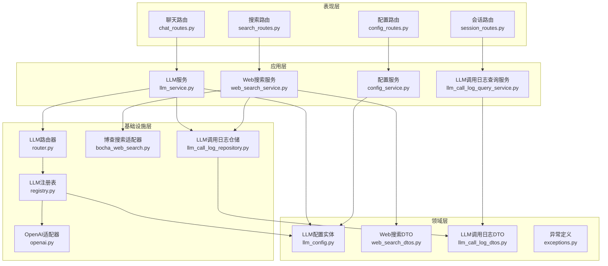
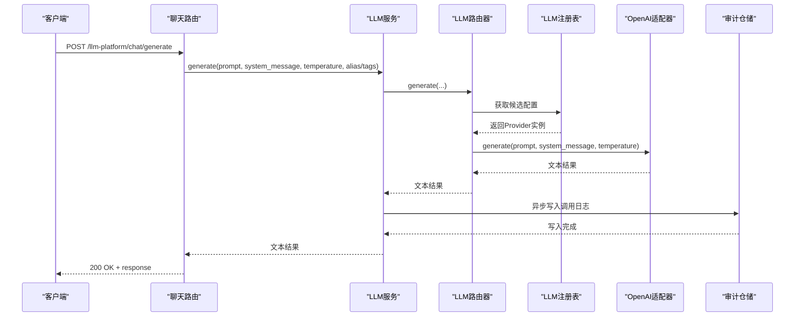
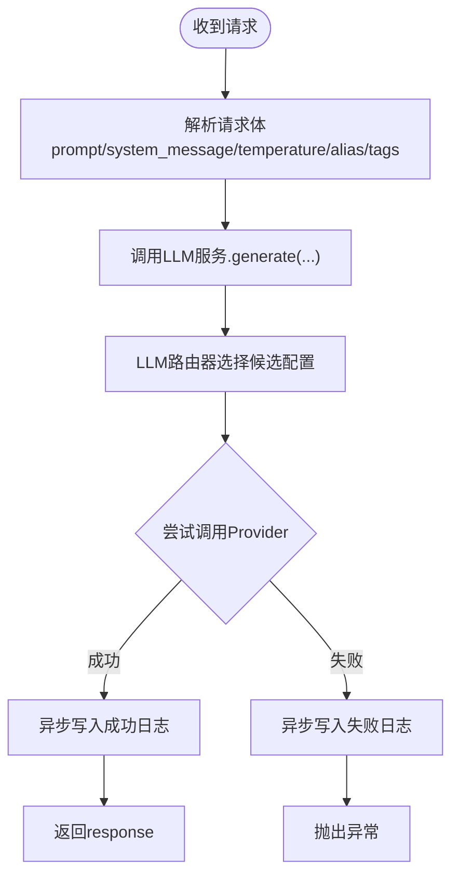
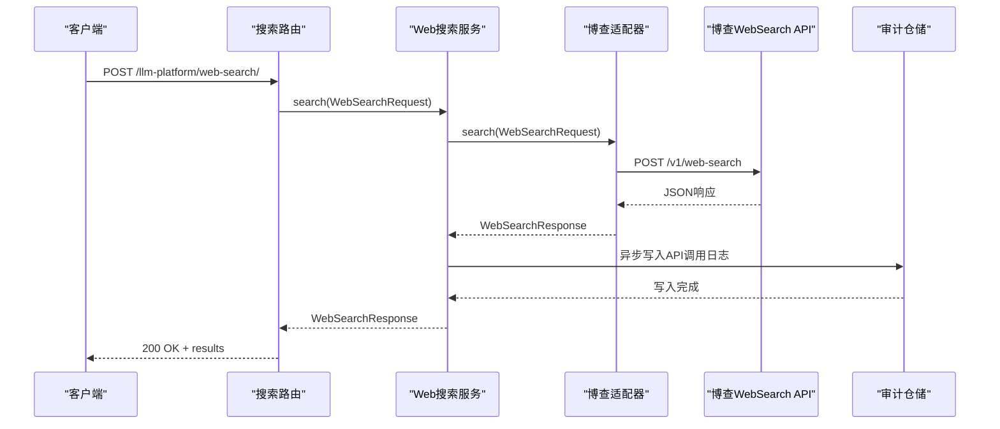
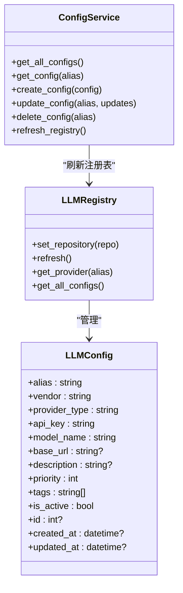
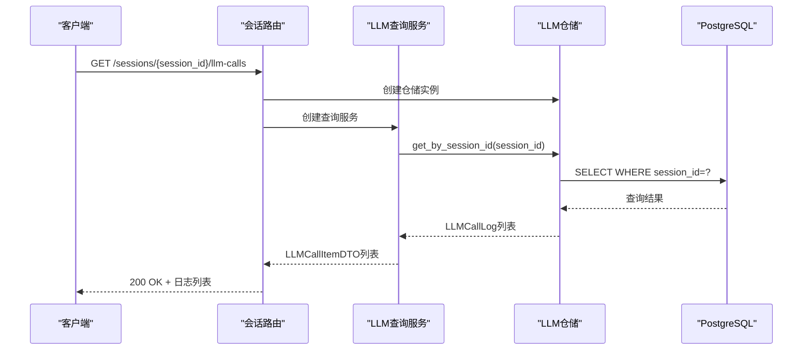
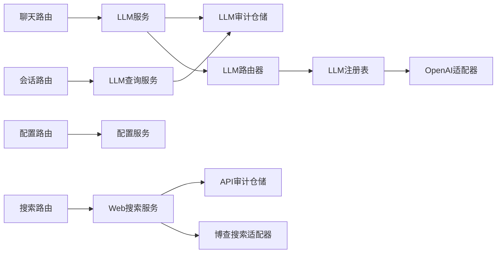

# LLM平台API

<cite>
**本文引用的文件**
- [chat_routes.py](file://src/modules/llm_platform/presentation/rest/chat_routes.py)
- [search_routes.py](file://src/modules/llm_platform/presentation/rest/search_routes.py)
- [config_routes.py](file://src/modules/llm_platform/presentation/rest/config_routes.py)
- [llm_service.py](file://src/modules/llm_platform/application/services/llm_service.py)
- [web_search_service.py](file://src/modules/llm_platform/application/services/web_search_service.py)
- [config_service.py](file://src/modules/llm_platform/application/services/config_service.py)
- [llm_call_log_query_service.py](file://src/modules/llm_platform/application/queries/llm_call_log_query_service.py)
- [llm_call_log_dtos.py](file://src/modules/llm_platform/domain/dtos/llm_call_log_dtos.py)
- [llm_call_log_repository.py](file://src/modules/llm_platform/domain/ports/llm_call_log_repository.py)
- [llm_call_log_model.py](file://src/modules/llm_platform/infrastructure/persistence/models/llm_call_log_model.py)
- [llm_call_log_repository.py](file://src/modules/llm_platform/infrastructure/persistence/repositories/llm_call_log_repository.py)
- [session_routes.py](file://src/modules/coordinator/presentation/rest/session_routes.py)
- [session_dtos.py](file://src/modules/coordinator/application/dtos/session_dtos.py)
- [container.py](file://src/modules/llm_platform/container.py)
- [llm_config.py](file://src/modules/llm_platform/domain/entities/llm_config.py)
- [router.py](file://src/modules/llm_platform/infrastructure/router.py)
- [registry.py](file://src/modules/llm_platform/infrastructure/registry.py)
- [openai.py](file://src/modules/llm_platform/infrastructure/adapters/openai.py)
- [bocha_web_search.py](file://src/modules/llm_platform/infrastructure/adapters/bocha_web_search.py)
- [web_search_dtos.py](file://src/modules/llm_platform/domain/web_search_dtos.py)
- [config.py](file://src/modules/llm_platform/infrastructure/config.py)
- [exceptions.py](file://src/modules/llm_platform/domain/exceptions.py)
- [test_chat_api.py](file://scripts/test_chat_api.py)
- [test_web_search.py](file://tests/llm_platform/test_web_search.py)
- [test_web_search_routes.py](file://tests/llm_platform/test_web_search_routes.py)
- [test_llm_service_audit.py](file://tests/llm_platform/application/services/test_llm_service_audit.py)
</cite>

## 目录
1. [简介](#简介)
2. [项目结构](#项目结构)
3. [核心组件](#核心组件)
4. [架构总览](#架构总览)
5. [详细组件分析](#详细组件分析)
6. [审计与历史查询功能](#审计与历史查询功能)
7. [依赖关系分析](#依赖关系分析)
8. [性能考量](#性能考量)
9. [故障排查指南](#故障排查指南)
10. [结论](#结论)
11. [附录](#附录)

## 简介
本文件为LLM平台模块的API接口文档，涵盖以下能力：
- 聊天接口：支持通过别名或标签动态路由至不同大语言模型，提供温度参数等调优选项。
- Web搜索接口：对接博查AI Web Search API，支持时效过滤、摘要生成与结果数量控制。
- 配置管理接口：提供LLM模型配置的增删改查、激活/停用、优先级与标签管理，以及注册表热更新。
- 审计与历史查询：新增LLM调用日志审计功能，支持按会话ID查询历史调用记录，便于调试与合规审计。

文档同时说明多模态输入处理现状、上下文管理与对话状态维护的实现要点，并给出安全防护、速率限制与成本控制建议。

## 项目结构
LLM平台模块采用分层架构，围绕"领域驱动设计"组织代码：
- 领域层：定义实体、DTO与异常，确保业务规则与数据结构清晰。
- 应用层：封装业务用例，协调仓储与注册表，屏蔽基础设施细节。
- 基础设施层：提供适配器（模型与搜索）、路由与注册表实现。
- 表现层：FastAPI路由，定义REST接口与请求/响应DTO。

**图表来源**
- [chat_routes.py](file://src/modules/llm_platform/presentation/rest/chat_routes.py#L1-L69)
- [search_routes.py](file://src/modules/llm_platform/presentation/rest/search_routes.py#L1-L158)
- [config_routes.py](file://src/modules/llm_platform/presentation/rest/config_routes.py#L1-L145)
- [session_routes.py](file://src/modules/coordinator/presentation/rest/session_routes.py#L1-L149)
- [llm_service.py](file://src/modules/llm_platform/application/services/llm_service.py#L1-L150)
- [web_search_service.py](file://src/modules/llm_platform/application/services/web_search_service.py#L1-L57)
- [config_service.py](file://src/modules/llm_platform/application/services/config_service.py#L1-L117)
- [llm_call_log_query_service.py](file://src/modules/llm_platform/application/queries/llm_call_log_query_service.py#L1-L21)
- [router.py](file://src/modules/llm_platform/infrastructure/router.py#L1-L68)
- [registry.py](file://src/modules/llm_platform/infrastructure/registry.py#L1-L104)
- [openai.py](file://src/modules/llm_platform/infrastructure/adapters/openai.py#L1-L65)
- [bocha_web_search.py](file://src/modules/llm_platform/infrastructure/adapters/bocha_web_search.py#L1-L190)
- [llm_call_log_repository.py](file://src/modules/llm_platform/infrastructure/persistence/repositories/llm_call_log_repository.py#L1-L76)
- [llm_config.py](file://src/modules/llm_platform/domain/entities/llm_config.py#L1-L54)
- [web_search_dtos.py](file://src/modules/llm_platform/domain/web_search_dtos.py#L1-L77)
- [llm_call_log_dtos.py](file://src/modules/llm_platform/domain/dtos/llm_call_log_dtos.py#L1-L30)

**章节来源**
- [chat_routes.py](file://src/modules/llm_platform/presentation/rest/chat_routes.py#L1-L69)
- [search_routes.py](file://src/modules/llm_platform/presentation/rest/search_routes.py#L1-L158)
- [config_routes.py](file://src/modules/llm_platform/presentation/rest/config_routes.py#L1-L145)
- [session_routes.py](file://src/modules/coordinator/presentation/rest/session_routes.py#L1-L149)

## 核心组件
- 聊天接口：接收prompt、system_message、temperature、alias或tags，调用LLM服务生成文本。
- Web搜索接口：接收query、freshness、summary、count，调用WebSearch服务，最终返回标准化结果。
- 配置管理接口：提供LLM配置的CRUD与注册表刷新，支持按别名检索与按标签筛选。
- 审计日志接口：提供LLM调用日志的查询能力，支持按会话ID获取完整的调用历史。

**章节来源**
- [llm_service.py](file://src/modules/llm_platform/application/services/llm_service.py#L1-L150)
- [web_search_service.py](file://src/modules/llm_platform/application/services/web_search_service.py#L1-L57)
- [config_service.py](file://src/modules/llm_platform/application/services/config_service.py#L1-L117)
- [llm_call_log_query_service.py](file://src/modules/llm_platform/application/queries/llm_call_log_query_service.py#L1-L21)

## 架构总览
LLM平台采用"服务门面 + 路由 + 注册表 + 适配器"的组合模式：
- 服务门面（LLMService、WebSearchService）对外暴露统一接口，隐藏底层实现。
- 路由器（LLMRouter）负责根据别名或标签选择候选配置，并进行故障转移。
- 注册表（LLMRegistry）从仓储加载配置，实例化Provider并缓存。
- 适配器（OpenAIProvider、BochaWebSearchAdapter）对接外部服务，统一异常语义。
- 审计日志（LLMCallLogRepository）异步持久化调用信息，不影响主流程性能。

**图表来源**
- [chat_routes.py](file://src/modules/llm_platform/presentation/rest/chat_routes.py#L34-L68)
- [llm_service.py](file://src/modules/llm_platform/application/services/llm_service.py#L38-L109)
- [router.py](file://src/modules/llm_platform/infrastructure/router.py#L35-L67)
- [registry.py](file://src/modules/llm_platform/infrastructure/registry.py#L93-L103)
- [openai.py](file://src/modules/llm_platform/infrastructure/adapters/openai.py#L22-L64)
- [llm_call_log_repository.py](file://src/modules/llm_platform/infrastructure/persistence/repositories/llm_call_log_repository.py#L63-L66)

## 详细组件分析

### 聊天接口（LLM生成）
- 接口路径：/llm-platform/chat/generate
- 方法：POST
- 请求体字段
  - prompt: 必填，用户输入的提示词
  - system_message: 可选，系统预设消息
  - alias: 可选，指定使用的大模型别名
  - tags: 可选，通过标签筛选大模型
  - temperature: 0.0–2.0之间，采样温度
  - caller_module: 可选，调用方模块名（用于审计日志）
  - caller_agent: 可选，调用方Agent标识（用于审计日志）
- 响应体字段
  - response: 大模型生成的文本
- 调用链路
  - 路由层接收请求，注入LLMService
  - LLMService委托LLMRouter进行模型选择与调用
  - LLMRouter从LLMRegistry获取Provider并调用
  - OpenAIProvider通过异步客户端调用模型
  - 异步写入LLM调用日志（成功/失败状态）
- 多模态输入处理
  - 当前实现仅支持文本消息；若需多模态，可在消息结构扩展role/content以支持图片/音频等。
- 上下文与状态
  - 当前实现不维护历史对话上下文；如需上下文，应在调用侧拼接system_message与历史消息。
- 审计功能
  - 自动生成调用日志，包含调用方模块、Agent、模型信息、耗时、状态等。
  - 支持异常情况的日志记录，便于问题追踪。

**图表来源**
- [chat_routes.py](file://src/modules/llm_platform/presentation/rest/chat_routes.py#L34-L68)
- [llm_service.py](file://src/modules/llm_platform/application/services/llm_service.py#L38-L109)
- [router.py](file://src/modules/llm_platform/infrastructure/router.py#L15-L67)
- [openai.py](file://src/modules/llm_platform/infrastructure/adapters/openai.py#L22-L64)

**章节来源**
- [chat_routes.py](file://src/modules/llm_platform/presentation/rest/chat_routes.py#L11-L68)
- [llm_service.py](file://src/modules/llm_platform/application/services/llm_service.py#L21-L150)
- [router.py](file://src/modules/llm_platform/infrastructure/router.py#L11-L67)
- [registry.py](file://src/modules/llm_platform/infrastructure/registry.py#L64-L91)
- [openai.py](file://src/modules/llm_platform/infrastructure/adapters/openai.py#L10-L64)
- [test_chat_api.py](file://scripts/test_chat_api.py#L6-L36)

### Web搜索接口
- 接口路径：/llm-platform/web-search/
- 方法：POST
- 请求体字段
  - query: 必填，搜索关键词
  - freshness: 可选，时效过滤（oneDay/oneWeek/oneMonth/oneYear/noLimit）
  - summary: 可选，是否生成AI摘要，默认true
  - count: 可选，返回结果条数，默认10，范围1–50
- 响应体字段
  - query: 原始查询词
  - total_matches: 匹配总数（可选）
  - results: 搜索结果列表，每项包含title/url/snippet/summary/site_name/published_date
- 调用链路
  - 路由层接收请求，注入WebSearchService
  - WebSearchService委托BochaWebSearchAdapter执行搜索
  - 适配器将外部响应映射为标准DTO
  - 异步写入外部API调用日志（成功/失败状态）
- 上下文与状态
  - WebSearchResponse提供to_prompt_context方法，将结果格式化为LLM友好的上下文字符串，便于拼接到prompt中。
- 审计功能
  - 自动生成外部API调用日志，包含服务名、操作、状态码、耗时、状态等。
  - 支持异常情况的日志记录，便于问题追踪。

**图表来源**
- [search_routes.py](file://src/modules/llm_platform/presentation/rest/search_routes.py#L80-L137)
- [web_search_service.py](file://src/modules/llm_platform/application/services/web_search_service.py#L32-L56)
- [bocha_web_search.py](file://src/modules/llm_platform/infrastructure/adapters/bocha_web_search.py#L51-L119)
- [web_search_dtos.py](file://src/modules/llm_platform/domain/web_search_dtos.py#L54-L76)

**章节来源**
- [search_routes.py](file://src/modules/llm_platform/presentation/rest/search_routes.py#L29-L157)
- [web_search_service.py](file://src/modules/llm_platform/application/services/web_search_service.py#L12-L56)
- [bocha_web_search.py](file://src/modules/llm_platform/infrastructure/adapters/bocha_web_search.py#L20-L189)
- [web_search_dtos.py](file://src/modules/llm_platform/domain/web_search_dtos.py#L5-L76)
- [test_web_search.py](file://tests/llm_platform/test_web_search.py#L35-L194)
- [test_web_search_routes.py](file://tests/llm_platform/test_web_search_routes.py#L28-L134)

### 配置管理接口
- 接口路径：/llm-platform/configs
- 方法与端点
  - GET /: 获取所有配置
  - GET /{alias}: 根据别名获取配置
  - POST /: 创建配置（返回201）
  - PATCH /{alias}: 更新配置
  - DELETE /{alias}: 删除配置（204）
  - POST /refresh: 手动刷新注册表
- 请求体字段（创建/更新）
  - alias、vendor、provider_type、api_key、base_url、model_name、description、priority、tags、is_active
- 响应体字段
  - id、其余字段与创建相同；api_key在响应中进行脱敏显示
- 调用链路
  - 路由层注入ConfigService
  - ConfigService协调仓储与注册表，保存后自动刷新注册表
- 安全与合规
  - api_key在响应中脱敏显示；仓储层负责持久化与去重校验。

**图表来源**
- [llm_config.py](file://src/modules/llm_platform/domain/entities/llm_config.py#L6-L38)
- [config_service.py](file://src/modules/llm_platform/application/services/config_service.py#L8-L116)
- [registry.py](file://src/modules/llm_platform/infrastructure/registry.py#L11-L103)
- [config_routes.py](file://src/modules/llm_platform/presentation/rest/config_routes.py#L16-L144)

**章节来源**
- [config_routes.py](file://src/modules/llm_platform/presentation/rest/config_routes.py#L16-L144)
- [config_service.py](file://src/modules/llm_platform/application/services/config_service.py#L8-L116)
- [llm_config.py](file://src/modules/llm_platform/domain/entities/llm_config.py#L5-L53)
- [registry.py](file://src/modules/llm_platform/infrastructure/registry.py#L27-L103)

## 审计与历史查询功能

### LLM调用日志审计
LLM平台现已集成完整的调用审计功能，支持对所有LLM调用进行跟踪和记录：

- **审计字段**
  - id: 唯一标识符
  - session_id: 关联的研究会话ID（无上下文时为null）
  - caller_module: 调用方模块名
  - caller_agent: 调用方Agent标识
  - model_name: 模型名称
  - vendor: 供应商
  - prompt_text: 完整用户提示词
  - system_message: 系统提示词
  - completion_text: LLM完整输出
  - prompt_tokens: prompt token数
  - completion_tokens: completion token数
  - total_tokens: 总token数
  - temperature: 温度参数
  - latency_ms: 调用耗时（毫秒）
  - status: success/failure
  - error_message: 错误信息
  - created_at: 记录时间

- **写入机制**
  - 异步写入，不影响主流程性能
  - 成功调用：status=success，completion_text包含结果
  - 失败调用：status=failed，error_message包含异常信息
  - 写入失败仅记录warning，不阻塞主流程

- **数据持久化**
  - 使用PostgreSQL存储，表名为llm_call_logs
  - 在(session_id, created_at)上建立复合索引优化查询性能
  - 支持按会话ID和时间范围的高效查询

### 历史查询API
新增的会话历史查询API允许用户按会话ID获取完整的LLM调用历史：

- **接口路径**: /api/v1/coordinator/research/sessions/{session_id}/llm-calls
- **方法**: GET
- **响应**: LLM调用日志列表（简要信息，不含完整prompt/completion）
- **用途**: 协助调试、合规审计、成本分析

**图表来源**
- [session_routes.py](file://src/modules/coordinator/presentation/rest/session_routes.py#L91-L120)
- [llm_call_log_query_service.py](file://src/modules/llm_platform/application/queries/llm_call_log_query_service.py#L18-L20)
- [llm_call_log_repository.py](file://src/modules/llm_platform/infrastructure/persistence/repositories/llm_call_log_repository.py#L68-L75)

### 审计功能的DI容器集成
审计功能通过依赖注入容器自动启用：

- **LLMService**: 当提供AsyncSession时，自动注入PgLLMCallLogRepository
- **WebSearchService**: 当提供AsyncSession时，自动注入PgExternalAPICallLogRepository
- **会话路由**: 通过LLMCallLogQueryService提供历史查询能力

**章节来源**
- [llm_service.py](file://src/modules/llm_platform/application/services/llm_service.py#L110-L150)
- [llm_call_log_dtos.py](file://src/modules/llm_platform/domain/dtos/llm_call_log_dtos.py#L10-L29)
- [llm_call_log_model.py](file://src/modules/llm_platform/infrastructure/persistence/models/llm_call_log_model.py#L11-L32)
- [llm_call_log_repository.py](file://src/modules/llm_platform/infrastructure/persistence/repositories/llm_call_log_repository.py#L59-L76)
- [session_routes.py](file://src/modules/coordinator/presentation/rest/session_routes.py#L91-L120)
- [llm_call_log_query_service.py](file://src/modules/llm_platform/application/queries/llm_call_log_query_service.py#L12-L20)
- [container.py](file://src/modules/llm_platform/container.py#L40-L51)
- [container.py](file://src/modules/llm_platform/container.py#L62-L77)

## 依赖关系分析
- 组件耦合
  - 路由层仅依赖应用服务接口，降低对具体实现的耦合。
  - 应用服务依赖领域Port抽象，便于替换Provider与仓储。
  - 注册表集中管理Provider实例，避免重复初始化。
  - 审计仓储通过异步写入机制，不影响主流程性能。
- 外部依赖
  - OpenAI异步客户端用于模型调用。
  - httpx用于博查WebSearch API调用。
  - SQLAlchemy用于审计日志的持久化存储。
- 循环依赖
  - 通过Port抽象解耦，未发现循环依赖迹象。

**图表来源**
- [chat_routes.py](file://src/modules/llm_platform/presentation/rest/chat_routes.py#L31-L32)
- [search_routes.py](file://src/modules/llm_platform/presentation/rest/search_routes.py#L66-L77)
- [config_routes.py](file://src/modules/llm_platform/presentation/rest/config_routes.py#L56-L60)
- [session_routes.py](file://src/modules/coordinator/presentation/rest/session_routes.py#L97-L120)
- [llm_service.py](file://src/modules/llm_platform/application/services/llm_service.py#L15-L23)
- [router.py](file://src/modules/llm_platform/infrastructure/router.py#L12-L13)
- [registry.py](file://src/modules/llm_platform/infrastructure/registry.py#L27-L34)
- [openai.py](file://src/modules/llm_platform/infrastructure/adapters/openai.py#L15-L20)
- [bocha_web_search.py](file://src/modules/llm_platform/infrastructure/adapters/bocha_web_search.py#L33-L49)
- [llm_call_log_repository.py](file://src/modules/llm_platform/infrastructure/persistence/repositories/llm_call_log_repository.py#L6-L8)

**章节来源**
- [chat_routes.py](file://src/modules/llm_platform/presentation/rest/chat_routes.py#L1-L69)
- [search_routes.py](file://src/modules/llm_platform/presentation/rest/search_routes.py#L1-L158)
- [config_routes.py](file://src/modules/llm_platform/presentation/rest/config_routes.py#L1-L145)
- [session_routes.py](file://src/modules/coordinator/presentation/rest/session_routes.py#L1-L149)
- [llm_service.py](file://src/modules/llm_platform/application/services/llm_service.py#L1-L150)
- [web_search_service.py](file://src/modules/llm_platform/application/services/web_search_service.py#L1-L57)
- [config_service.py](file://src/modules/llm_platform/application/services/config_service.py#L1-L117)
- [llm_call_log_query_service.py](file://src/modules/llm_platform/application/queries/llm_call_log_query_service.py#L1-L21)

## 性能考量
- 路由与注册表
  - LLMRouter按优先级排序候选配置，减少无效尝试。
  - LLMRegistry全量刷新时重建Provider实例，建议在配置变更后手动触发刷新，避免频繁全量刷新。
- 搜索性能
  - 博查适配器默认超时30秒，可根据网络环境调整。
  - 结果数量受count限制，建议结合业务场景合理设置。
- 资源与成本
  - 通过配置管理接口控制模型与参数，避免高成本模型被滥用。
  - 在路由层实现"默认优先级"策略，优先使用低成本模型。
- 审计性能
  - 审计日志采用异步写入，使用try/except包裹，写入失败不影响主流程。
  - 数据库层面在(session_id, created_at)上建立索引，优化查询性能。
  - 审计日志表使用UUID作为主键，支持分布式环境下的唯一性保证。

## 故障排查指南
- 常见错误与处理
  - Web搜索配置错误（503）：检查博查API Key是否配置。
  - Web搜索连接错误（503）：检查网络连通性与超时设置。
  - Web搜索上游错误（502）：检查博查API返回状态与响应格式。
  - LLM无可用模型（503）：确认至少有一个激活配置，或检查别名/标签筛选条件。
  - LLM连接/速率限制（503）：检查模型服务商状态与配额。
  - 审计日志写入失败（500）：检查数据库连接和权限，但不会影响主流程。
- 日志与监控
  - 各层均记录关键信息，便于定位问题。
  - 建议在网关或中间件层增加统一的错误统计与告警。
  - 审计日志可用于合规审计和问题追踪。

**章节来源**
- [exceptions.py](file://src/modules/llm_platform/domain/exceptions.py#L64-L94)
- [search_routes.py](file://src/modules/llm_platform/presentation/rest/search_routes.py#L139-L157)
- [router.py](file://src/modules/llm_platform/infrastructure/router.py#L45-L67)
- [openai.py](file://src/modules/llm_platform/infrastructure/adapters/openai.py#L56-L64)
- [llm_service.py](file://src/modules/llm_platform/application/services/llm_service.py#L146-L150)

## 结论
本LLM平台API提供了统一的模型调用、Web搜索与配置管理能力，具备良好的扩展性与可维护性。通过路由与注册表机制，实现了模型的灵活选择与故障转移；通过DTO与异常体系，保证了接口的一致性与健壮性。新增的审计功能进一步增强了系统的可观测性和合规性，支持历史查询和调试需求。建议在生产环境中配合安全防护、速率限制与成本控制策略，确保系统的稳定性与经济性。

## 附录

### API调用示例
- 聊天接口
  - 使用别名调用：参考脚本示例
  - 使用标签调用：参考脚本示例
  - 默认路由：参考脚本示例
  - 审计日志：参考测试用例
- Web搜索接口
  - 正常搜索：参考端到端测试
  - 参数传递：参考单元测试
  - 错误处理：参考端到端测试
  - 审计日志：参考测试用例
- 历史查询接口
  - 会话LLM调用日志：参考会话路由实现

**章节来源**
- [test_chat_api.py](file://scripts/test_chat_api.py#L6-L36)
- [test_web_search.py](file://tests/llm_platform/test_web_search.py#L35-L194)
- [test_web_search_routes.py](file://tests/llm_platform/test_web_search_routes.py#L36-L134)
- [test_llm_service_audit.py](file://tests/llm_platform/application/services/test_llm_service_audit.py#L37-L93)

### 安全防护、速率限制与成本控制
- 安全防护
  - API Key脱敏：配置响应中对api_key进行脱敏显示。
  - 认证授权：建议在路由层或网关层增加鉴权中间件。
  - 审计日志：完整的调用记录可用于安全审计和合规检查。
- 速率限制
  - 建议在网关或中间件层实施基于IP/Key的限流策略。
  - LLM平台支持通过配置管理接口控制模型选择，避免高成本模型被滥用。
- 成本控制
  - 通过配置管理接口控制模型与参数，优先使用低成本模型。
  - 在路由层实现"默认优先级"策略，避免高成本模型被滥用。
  - 审计日志可用于成本分析和优化。

**章节来源**
- [config_routes.py](file://src/modules/llm_platform/presentation/rest/config_routes.py#L46-L50)
- [config_service.py](file://src/modules/llm_platform/application/services/config_service.py#L53-L88)
- [llm_service.py](file://src/modules/llm_platform/application/services/llm_service.py#L26-L27)
- [web_search_service.py](file://src/modules/llm_platform/application/services/web_search_service.py#L1-L57)

### 审计日志表结构
LLM调用日志使用PostgreSQL存储，表结构如下：

| 字段名 | 类型 | 说明 |
|--------|------|------|
| id | UUID, 主键 | 记录唯一标识 |
| session_id | UUID, nullable | 关联研究会话ID |
| caller_module | VARCHAR(50) | 调用方模块名 |
| caller_agent | VARCHAR(50), nullable | 调用方Agent标识 |
| model_name | VARCHAR(100) | 模型名称 |
| vendor | VARCHAR(50) | 供应商 |
| prompt_text | TEXT | 完整用户提示词 |
| system_message | TEXT, nullable | 系统提示词 |
| completion_text | TEXT, nullable | LLM完整输出 |
| prompt_tokens | INTEGER, nullable | prompt token数 |
| completion_tokens | INTEGER, nullable | completion token数 |
| total_tokens | INTEGER, nullable | 总token数 |
| temperature | FLOAT | 温度参数 |
| latency_ms | INTEGER | 调用耗时（毫秒） |
| status | VARCHAR(20) | success/failure |
| error_message | TEXT, nullable | 错误信息 |
| created_at | TIMESTAMP | 记录时间 |

**索引策略**：在(session_id, created_at)上建立复合索引，优化按会话查询的性能。

**章节来源**
- [llm_call_log_model.py](file://src/modules/llm_platform/infrastructure/persistence/models/llm_call_log_model.py#L11-L32)
- [llm_call_log_repository.py](file://src/modules/llm_platform/infrastructure/persistence/repositories/llm_call_log_repository.py#L68-L75)
- [alembic/versions/c0ff00000003_execution_tracking_and_reports.py](file://alembic/versions/c0ff00000003_execution_tracking_and_reports.py#L62-L89)