# LLM配置管理接口

<cite>
**本文档引用的文件**
- [config_routes.py](file://src/modules/llm_platform/presentation/rest/config_routes.py)
- [config_service.py](file://src/modules/llm_platform/application/services/config_service.py)
- [llm_config.py](file://src/modules/llm_platform/domain/entities/llm_config.py)
- [llm_config_model.py](file://src/modules/llm_platform/infrastructure/persistence/models/llm_config_model.py)
- [pg_config_repo.py](file://src/modules/llm_platform/infrastructure/persistence/repositories/pg_config_repo.py)
- [registry.py](file://src/modules/llm_platform/infrastructure/registry.py)
- [config_repo.py](file://src/modules/llm_platform/domain/ports/repositories/config_repo.py)
- [container.py](file://src/modules/llm_platform/container.py)
- [startup.py](file://src/modules/llm_platform/application/services/startup.py)
- [main.py](file://src/main.py)
- [routes.py](file://src/api/routes.py)
- [add_llm_config_template.py](file://scripts/add_llm_config_template.py)
- [config.py](file://src/modules/llm_platform/infrastructure/config.py)
- [config.yaml](file://openspec/config.yaml)
</cite>

## 目录
1. [简介](#简介)
2. [项目结构](#项目结构)
3. [核心组件](#核心组件)
4. [架构概览](#架构概览)
5. [详细组件分析](#详细组件分析)
6. [依赖关系分析](#依赖关系分析)
7. [性能考虑](#性能考虑)
8. [故障排除指南](#故障排除指南)
9. [结论](#结论)
10. [附录](#附录)

## 简介

LLM配置管理接口是Stock Helper系统中LLM平台模块的核心功能，负责管理大语言模型的配置信息。该接口提供了完整的增删改查操作，支持配置的存储、检索和动态更新机制。系统采用领域驱动设计（DDD）架构，实现了配置验证、默认值设置和动态加载机制。

该接口主要服务于研究分析模块，为AI虚拟投资团队提供多供应商、可配置的大语言模型能力。通过统一的配置管理，系统能够灵活地切换和组合不同的模型供应商，实现最优的性能和成本平衡。

## 项目结构

LLM配置管理接口位于`src/modules/llm_platform`模块中，遵循清晰的分层架构：


**图表来源**
- [config_routes.py](file://src/modules/llm_platform/presentation/rest/config_routes.py#L1-L145)
- [config_service.py](file://src/modules/llm_platform/application/services/config_service.py#L1-L117)
- [llm_config.py](file://src/modules/llm_platform/domain/entities/llm_config.py#L1-L54)

**章节来源**
- [config_routes.py](file://src/modules/llm_platform/presentation/rest/config_routes.py#L1-L145)
- [config_service.py](file://src/modules/llm_platform/application/services/config_service.py#L1-L117)
- [llm_config.py](file://src/modules/llm_platform/domain/entities/llm_config.py#L1-L54)

## 核心组件

### 配置实体 (LLMConfig)

LLMConfig是领域层的核心实体，定义了连接和使用大语言模型所需的所有属性：

| 字段名 | 类型 | 必填 | 默认值 | 描述 |
|--------|------|------|--------|------|
| alias | string | 是 | 无 | 配置别名，唯一标识符（如 'deepseek-v3'） |
| vendor | string | 是 | 无 | 模型厂商（如 'SiliconFlow', 'OpenAI'） |
| provider_type | string | 是 | 无 | 适配器类型（如 'openai', 'anthropic'） |
| api_key | string | 是 | 无 | API密钥，敏感信息 |
| model_name | string | 是 | 无 | 实际调用的模型名称 |
| description | string | 否 | null | 配置描述信息 |
| base_url | string | 否 | null | API基础地址 |
| priority | integer | 否 | 1 | 优先级，数值越大优先级越高 |
| tags | array[string] | 否 | [] | 标签列表，用于特性筛选 |
| is_active | boolean | 否 | true | 是否启用该配置 |
| id | integer | 否 | null | 数据库主键ID |
| created_at | datetime | 否 | null | 创建时间 |
| updated_at | datetime | 否 | null | 更新时间 |

### 配置服务 (ConfigService)

ConfigService是应用层的核心服务，负责协调配置的增删改查操作：


**图表来源**
- [config_service.py](file://src/modules/llm_platform/application/services/config_service.py#L8-L117)
- [config_repo.py](file://src/modules/llm_platform/domain/ports/repositories/config_repo.py#L5-L68)
- [registry.py](file://src/modules/llm_platform/infrastructure/registry.py#L11-L104)

**章节来源**
- [config_service.py](file://src/modules/llm_platform/application/services/config_service.py#L1-L117)
- [config_repo.py](file://src/modules/llm_platform/domain/ports/repositories/config_repo.py#L1-L68)
- [registry.py](file://src/modules/llm_platform/infrastructure/registry.py#L1-L104)

## 架构概览

LLM配置管理接口采用分层架构设计，确保关注点分离和可维护性：

```mermaid
graph TB
subgraph "外部接口"
API[FastAPI路由]
CLIENT[客户端应用]
end
subgraph "应用层"
SERVICE[ConfigService]
STARTUP[LLMPlatformStartup]
end
subgraph "领域层"
ENTITY[LLMConfig实体]
EXCEPTION[异常处理]
end
subgraph "基础设施层"
REPO[PgLLMConfigRepository]
REGISTRY[LLMRegistry]
DB[(PostgreSQL数据库)]
end
subgraph "配置层"
CONTAINER[LLMPlatformContainer]
CONFIG[LLMPlatformConfig]
end
CLIENT --> API
API --> SERVICE
SERVICE --> REPO
SERVICE --> REGISTRY
REPO --> DB
REGISTRY --> REPO
STARTUP --> REGISTRY
CONTAINER --> SERVICE
CONTAINER --> REGISTRY
CONFIG --> CONTAINER
```



**图表来源**
- [config_routes.py](file://src/modules/llm_platform/presentation/rest/config_routes.py#L14-L145)
- [config_service.py](file://src/modules/llm_platform/application/services/config_service.py#L8-L117)
- [pg_config_repo.py](file://src/modules/llm_platform/infrastructure/persistence/repositories/pg_config_repo.py#L11-L119)
- [registry.py](file://src/modules/llm_platform/infrastructure/registry.py#L11-L104)
- [container.py](file://src/modules/llm_platform/container.py#L24-L68)

## 详细组件分析

### 配置管理API

#### GET /llm-platform/configs
获取所有大模型配置的详细流程：


**图表来源**
- [config_routes.py](file://src/modules/llm_platform/presentation/rest/config_routes.py#L62-L68)
- [config_service.py](file://src/modules/llm_platform/application/services/config_service.py#L17-L24)
- [pg_config_repo.py](file://src/modules/llm_platform/infrastructure/persistence/repositories/pg_config_repo.py#L24-L34)

#### POST /llm-platform/configs
创建新配置的完整流程：


**图表来源**
- [config_routes.py](file://src/modules/llm_platform/presentation/rest/config_routes.py#L85-L99)
- [config_service.py](file://src/modules/llm_platform/application/services/config_service.py#L43-L62)
- [pg_config_repo.py](file://src/modules/llm_platform/infrastructure/persistence/repositories/pg_config_repo.py#L61-L104)
- [registry.py](file://src/modules/llm_platform/infrastructure/registry.py#L36-L63)

#### PATCH /llm-platform/configs/{alias}
更新现有配置的流程：


**图表来源**
- [config_routes.py](file://src/modules/llm_platform/presentation/rest/config_routes.py#L103-L119)
- [config_service.py](file://src/modules/llm_platform/application/services/config_service.py#L64-L89)

#### DELETE /llm-platform/configs/{alias}
删除配置的流程：


**图表来源**
- [config_routes.py](file://src/modules/llm_platform/presentation/rest/config_routes.py#L121-L135)
- [config_service.py](file://src/modules/llm_platform/application/services/config_service.py#L91-L109)

### 配置验证机制

系统实现了多层次的配置验证：

1. **Pydantic DTO验证**：在API层进行输入验证
2. **业务规则验证**：在应用层检查重复别名等业务约束
3. **数据库约束**：通过唯一索引保证数据完整性


**图表来源**
- [config_routes.py](file://src/modules/llm_platform/presentation/rest/config_routes.py#L17-L50)
- [config_service.py](file://src/modules/llm_platform/application/services/config_service.py#L53-L57)
- [pg_config_repo.py](file://src/modules/llm_platform/infrastructure/persistence/repositories/pg_config_repo.py#L79-L95)

### 动态加载机制

系统支持配置的动态加载和热更新：


**图表来源**
- [registry.py](file://src/modules/llm_platform/infrastructure/registry.py#L36-L63)
- [startup.py](file://src/modules/llm_platform/application/services/startup.py#L14-L28)

**章节来源**
- [config_routes.py](file://src/modules/llm_platform/presentation/rest/config_routes.py#L1-L145)
- [config_service.py](file://src/modules/llm_platform/application/services/config_service.py#L1-L117)
- [registry.py](file://src/modules/llm_platform/infrastructure/registry.py#L1-L104)

## 依赖关系分析

### 数据流图


**图表来源**
- [routes.py](file://src/api/routes.py#L1-L13)
- [config_routes.py](file://src/modules/llm_platform/presentation/rest/config_routes.py#L1-L145)
- [container.py](file://src/modules/llm_platform/container.py#L24-L68)

### 组件耦合度分析

系统的耦合度设计遵循以下原则：

1. **低耦合高内聚**：每个模块职责单一，接口清晰
2. **依赖倒置**：应用层依赖抽象接口而非具体实现
3. **单向依赖**：数据流向自上而下，控制流自下而上

**章节来源**
- [container.py](file://src/modules/llm_platform/container.py#L1-L68)
- [config_repo.py](file://src/modules/llm_platform/domain/ports/repositories/config_repo.py#L1-L68)
- [pg_config_repo.py](file://src/modules/llm_platform/infrastructure/persistence/repositories/pg_config_repo.py#L1-L119)

## 性能考虑

### 查询优化

1. **索引策略**：在`alias`字段上建立唯一索引，支持快速查找
2. **批量操作**：注册表刷新时采用批量注册机制
3. **缓存策略**：注册表作为内存缓存，减少数据库访问

### 并发处理

1. **异步操作**：所有数据库操作采用异步模式
2. **连接池**：使用SQLAlchemy异步连接池管理数据库连接
3. **事务管理**：确保数据一致性和操作原子性

### 扩展性设计

1. **插件化架构**：支持新增不同类型的Provider适配器
2. **配置隔离**：每个模块拥有独立的配置命名空间
3. **环境适配**：支持不同环境下的配置差异化

## 故障排除指南

### 常见错误及解决方案

| 错误类型 | HTTP状态码 | 错误原因 | 解决方案 |
|----------|------------|----------|----------|
| 配置不存在 | 404 Not Found | 查询的配置别名不存在 | 检查配置别名是否正确 |
| 重复配置 | 409 Conflict | 配置别名已存在 | 修改别名或删除现有配置 |
| 输入验证失败 | 422 Unprocessable Entity | 请求参数不符合要求 | 检查必填字段和数据格式 |
| 数据库错误 | 500 Internal Server Error | 数据库操作失败 | 检查数据库连接和权限 |
| 注册表错误 | 503 Service Unavailable | Provider实例化失败 | 检查API密钥和网络连接 |

### 调试建议

1. **启用详细日志**：检查`loguru`输出的详细信息
2. **数据库检查**：验证`llm_configs`表的数据完整性
3. **网络诊断**：确认API端点可达性和认证信息正确
4. **内存监控**：观察注册表中Provider实例的数量变化

**章节来源**
- [config_routes.py](file://src/modules/llm_platform/presentation/rest/config_routes.py#L81-L83)
- [config_service.py](file://src/modules/llm_platform/application/services/config_service.py#L39-L40)
- [registry.py](file://src/modules/llm_platform/infrastructure/registry.py#L59-L62)

## 结论

LLM配置管理接口通过清晰的分层架构和完善的错误处理机制，为Stock Helper系统提供了强大而灵活的配置管理能力。系统支持完整的CRUD操作，具备动态加载和热更新特性，能够满足复杂场景下的配置需求。

关键优势包括：
- **安全性**：API密钥自动脱敏显示，敏感信息保护
- **可扩展性**：支持多种模型供应商和自定义适配器
- **可靠性**：完善的异常处理和回滚机制
- **易用性**：RESTful API设计，易于集成和使用

## 附录

### API使用示例

#### 添加新的大语言模型配置

使用提供的配置模板脚本：

```bash
python scripts/add_llm_config_template.py
```

或者手动发送HTTP请求：

```bash
curl -X POST "http://localhost:8000/api/v1/llm-platform/configs" \
  -H "Content-Type: application/json" \
  -d '{
    "alias": "deepseek-v3",
    "vendor": "SiliconFlow",
    "provider_type": "openai",
    "api_key": "sk-xxxxxxxxxxxxxxxxxxxxxxxx",
    "base_url": "https://api.siliconflow.cn/v1",
    "model_name": "deepseek-ai/DeepSeek-V3",
    "description": "高性能通用大模型",
    "priority": 10,
    "tags": ["fast", "economy", "general"],
    "is_active": true
  }'
```

#### 修改现有配置

```bash
curl -X PATCH "http://localhost:8000/api/v1/llm-platform/configs/deepseek-v3" \
  -H "Content-Type: application/json" \
  -d '{
    "priority": 15,
    "is_active": false
  }'
```

#### 删除不再使用的配置

```bash
curl -X DELETE "http://localhost:8000/api/v1/llm-platform/configs/deepseek-v3"
```

### 配置最佳实践

1. **安全存储**：使用环境变量存储敏感配置
2. **版本控制**：将配置文件纳入版本控制系统
3. **最小权限**：为不同环境配置不同的访问权限
4. **定期审计**：定期检查配置的有效性和安全性
5. **备份策略**：定期备份配置数据，防止意外丢失

### 环境配置

系统支持通过`.env`文件进行环境配置，主要配置项包括：

| 配置项 | 类型 | 默认值 | 描述 |
|--------|------|--------|------|
| LLM_PROVIDER | string | "openai" | 默认模型供应商 |
| LLM_API_KEY | string | "your_llm_api_key_here" | 默认API密钥 |
| LLM_BASE_URL | string | "https://api.openai.com/v1" | 默认API基础URL |
| LLM_MODEL | string | "gpt-3.5-turbo" | 默认模型名称 |
| BOCHA_API_KEY | string | "" | 博查搜索API密钥 |
| BOCHA_BASE_URL | string | "https://api.bochaai.com" | 博查搜索基础URL |

**章节来源**
- [add_llm_config_template.py](file://scripts/add_llm_config_template.py#L1-L72)
- [config.py](file://src/modules/llm_platform/infrastructure/config.py#L10-L27)
- [config.yaml](file://openspec/config.yaml#L1-L27)