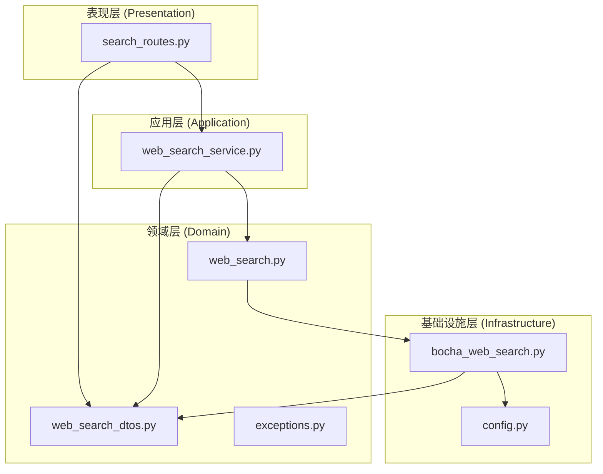
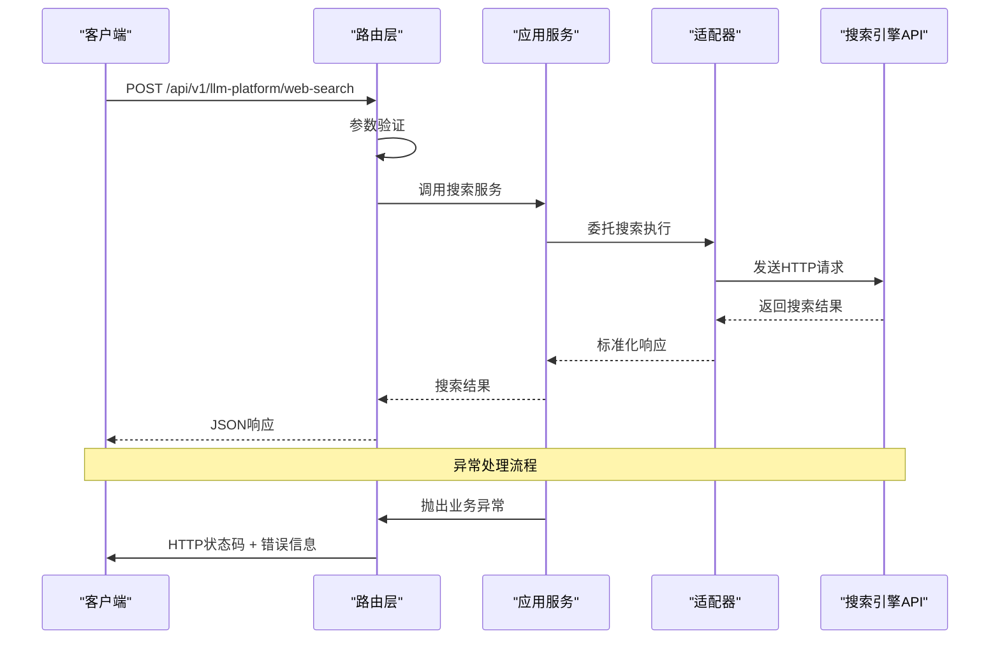
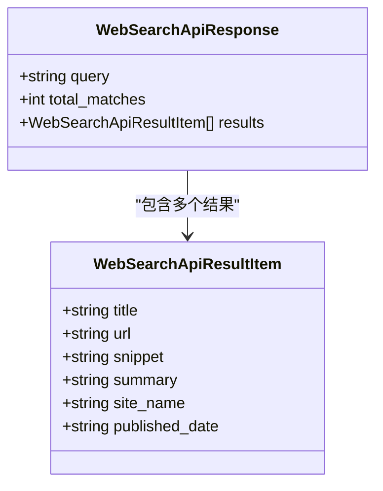
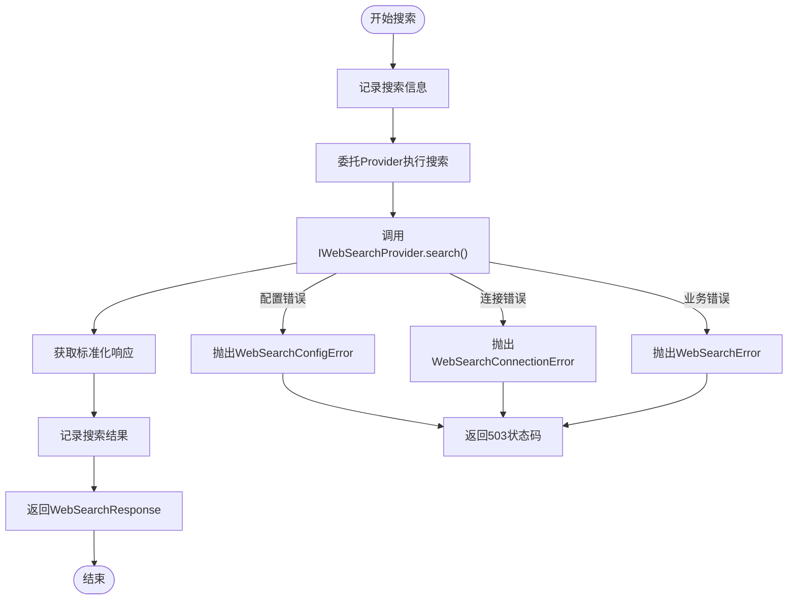
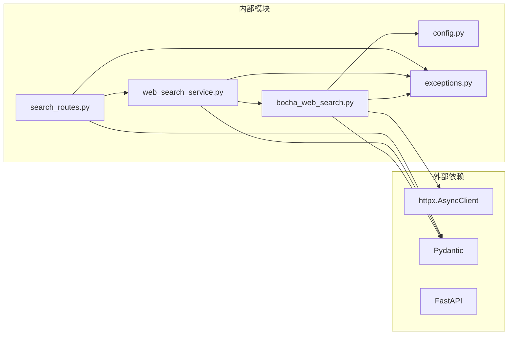
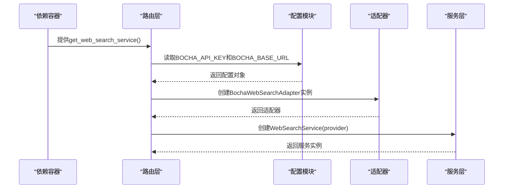

# Web搜索接口

<cite>
**本文档引用的文件**
- [search_routes.py](file://src/modules/llm_platform/presentation/rest/search_routes.py)
- [web_search_service.py](file://src/modules/llm_platform/application/services/web_search_service.py)
- [web_search.py](file://src/modules/llm_platform/domain/ports/web_search.py)
- [web_search_dtos.py](file://src/modules/llm_platform/domain/web_search_dtos.py)
- [bocha_web_search.py](file://src/modules/llm_platform/infrastructure/adapters/bocha_web_search.py)
- [config.py](file://src/modules/llm_platform/infrastructure/config.py)
- [exceptions.py](file://src/modules/llm_platform/domain/exceptions.py)
- [test_web_search.py](file://tests/llm_platform/test_web_search.py)
- [test_web_search_routes.py](file://tests/llm_platform/test_web_search_routes.py)
- [main.py](file://src/main.py)
- [README.md](file://README.md)
</cite>

## 目录
1. [简介](#简介)
2. [项目结构](#项目结构)
3. [核心组件](#核心组件)
4. [架构概览](#架构概览)
5. [详细组件分析](#详细组件分析)
6. [依赖关系分析](#依赖关系分析)
7. [性能考虑](#性能考虑)
8. [故障排除指南](#故障排除指南)
9. [结论](#结论)
10. [附录](#附录)

## 简介

Web搜索接口是Stock Helper系统中的一个关键功能模块，基于LLM平台构建，提供强大的网络搜索能力。该接口通过统一的REST API为上层应用提供标准化的Web搜索服务，支持关键词搜索、结果过滤、AI摘要生成等功能。

本接口的核心特性包括：
- **标准化API设计**：提供清晰的请求/响应结构
- **多搜索引擎适配**：当前集成博查AI Web Search API
- **灵活的结果处理**：支持摘要生成和结果聚合
- **完善的错误处理**：针对不同类型的错误提供明确的状态码
- **配置驱动**：通过环境变量进行灵活配置

## 项目结构

Web搜索接口在项目中的组织结构遵循Clean Architecture原则，采用分层架构设计：



**图表来源**
- [search_routes.py](file://src/modules/llm_platform/presentation/rest/search_routes.py#L1-L158)
- [web_search_service.py](file://src/modules/llm_platform/application/services/web_search_service.py#L1-L57)
- [web_search.py](file://src/modules/llm_platform/domain/ports/web_search.py#L1-L33)
- [web_search_dtos.py](file://src/modules/llm_platform/domain/web_search_dtos.py#L1-L77)
- [bocha_web_search.py](file://src/modules/llm_platform/infrastructure/adapters/bocha_web_search.py#L1-L190)
- [config.py](file://src/modules/llm_platform/infrastructure/config.py#L1-L27)

**章节来源**
- [search_routes.py](file://src/modules/llm_platform/presentation/rest/search_routes.py#L1-L158)
- [web_search_service.py](file://src/modules/llm_platform/application/services/web_search_service.py#L1-L57)
- [web_search.py](file://src/modules/llm_platform/domain/ports/web_search.py#L1-L33)
- [web_search_dtos.py](file://src/modules/llm_platform/domain/web_search_dtos.py#L1-L77)
- [bocha_web_search.py](file://src/modules/llm_platform/infrastructure/adapters/bocha_web_search.py#L1-L190)
- [config.py](file://src/modules/llm_platform/infrastructure/config.py#L1-L27)

## 核心组件

### API路由层
负责HTTP请求处理和响应格式化，提供RESTful接口。

### 应用服务层
作为业务逻辑的协调者，负责调用底层搜索提供程序并处理业务规则。

### 领域模型层
定义搜索相关的数据传输对象(DTO)和异常类型，确保业务逻辑的稳定性。

### 基础设施适配层
实现具体的搜索引擎集成，当前支持博查AI Web Search API。

**章节来源**
- [search_routes.py](file://src/modules/llm_platform/presentation/rest/search_routes.py#L25-L158)
- [web_search_service.py](file://src/modules/llm_platform/application/services/web_search_service.py#L12-L57)
- [web_search_dtos.py](file://src/modules/llm_platform/domain/web_search_dtos.py#L5-L77)

## 架构概览

Web搜索接口采用经典的Clean Architecture设计模式，实现了关注点分离和依赖倒置原则：



**图表来源**
- [search_routes.py](file://src/modules/llm_platform/presentation/rest/search_routes.py#L80-L158)
- [web_search_service.py](file://src/modules/llm_platform/application/services/web_search_service.py#L32-L56)
- [bocha_web_search.py](file://src/modules/llm_platform/infrastructure/adapters/bocha_web_search.py#L51-L119)

## 详细组件分析

### API路由组件

#### 路由定义
- **路径**: `/api/v1/llm-platform/web-search/`
- **方法**: POST
- **标签**: LLM Platform - Web Search
- **认证**: 无（基于API密钥的HTTP头认证）

#### 请求参数规范

| 参数名 | 类型 | 必填 | 默认值 | 说明 |
|--------|------|------|--------|------|
| query | string | 是 | - | 搜索关键词 |
| freshness | string | 否 | null | 时效过滤: oneDay / oneWeek / oneMonth / oneYear / noLimit |
| summary | boolean | 否 | true | 是否生成AI摘要 |
| count | integer | 否 | 10 | 返回结果条数 (1-50) |

#### 响应数据结构



**图表来源**
- [search_routes.py](file://src/modules/llm_platform/presentation/rest/search_routes.py#L55-L63)
- [search_routes.py](file://src/modules/llm_platform/presentation/rest/search_routes.py#L42-L53)

#### 错误处理机制

| HTTP状态码 | 异常类型 | 用途 |
|------------|----------|------|
| 200 | 成功响应 | 搜索成功 |
| 422 | Pydantic验证错误 | 请求参数无效 |
| 500 | 未知错误 | 服务器内部错误 |
| 502 | WebSearchError | 上游搜索API错误 |
| 503 | WebSearchConnectionError/WebSearchConfigError | 服务不可用/配置错误 |

**章节来源**
- [search_routes.py](file://src/modules/llm_platform/presentation/rest/search_routes.py#L29-L63)
- [search_routes.py](file://src/modules/llm_platform/presentation/rest/search_routes.py#L139-L157)

### 应用服务组件

#### WebSearchService职责
- 作为应用层入口，协调搜索流程
- 通过依赖注入接收IWebSearchProvider实现
- 记录搜索日志和性能指标
- 统一异常处理和转换

#### 核心方法流程



**图表来源**
- [web_search_service.py](file://src/modules/llm_platform/application/services/web_search_service.py#L32-L56)
- [exceptions.py](file://src/modules/llm_platform/domain/exceptions.py#L64-L94)

**章节来源**
- [web_search_service.py](file://src/modules/llm_platform/application/services/web_search_service.py#L12-L57)

### 领域模型组件

#### 数据传输对象(DTO)

##### WebSearchRequest
- **query**: 搜索查询词（必填）
- **freshness**: 时效过滤参数（可选）
- **summary**: 是否生成AI摘要（默认true）
- **count**: 结果数量限制（默认10）

##### WebSearchResultItem
- **title**: 搜索结果标题
- **url**: 完整URL链接
- **snippet**: 摘要片段内容
- **summary**: AI生成的摘要（可选）
- **site_name**: 网站名称（可选）
- **published_date**: 发布日期（可选）

##### WebSearchResponse
- **query**: 原始查询词
- **total_matches**: 匹配总数（可选）
- **results**: 结果列表

#### Prompt上下文转换
提供了将搜索结果转换为LLM友好的上下文格式的方法，支持AI辅助分析。

**章节来源**
- [web_search_dtos.py](file://src/modules/llm_platform/domain/web_search_dtos.py#L5-L77)

### 基础设施组件

#### BochaWebSearchAdapter实现

##### 配置参数
- **api_key**: 博查API密钥（必需）
- **base_url**: API基础URL，默认`https://api.bochaai.com`
- **timeout**: 请求超时时间，默认30秒

##### 请求映射
将标准WebSearchRequest映射到博查API的请求格式：
```json
{
  "query": "搜索关键词",
  "summary": true,
  "count": 10,
  "freshness": "oneWeek"
}
```

##### 响应映射
将博查API响应转换为标准格式：
- 原始响应结构: `{code, data: {webPages: {...}}}`
- 映射字段: name→title, url→url, snippet→snippet, summary→summary
- 可选字段: siteName→site_name, datePublished→published_date

**章节来源**
- [bocha_web_search.py](file://src/modules/llm_platform/infrastructure/adapters/bocha_web_search.py#L20-L190)

## 依赖关系分析



**图表来源**
- [search_routes.py](file://src/modules/llm_platform/presentation/rest/search_routes.py#L1-L21)
- [web_search_service.py](file://src/modules/llm_platform/application/services/web_search_service.py#L1-L9)
- [bocha_web_search.py](file://src/modules/llm_platform/infrastructure/adapters/bocha_web_search.py#L1-L16)

### 依赖注入机制



**图表来源**
- [search_routes.py](file://src/modules/llm_platform/presentation/rest/search_routes.py#L66-L77)
- [config.py](file://src/modules/llm_platform/infrastructure/config.py#L10-L27)

**章节来源**
- [search_routes.py](file://src/modules/llm_platform/presentation/rest/search_routes.py#L66-L77)
- [config.py](file://src/modules/llm_platform/infrastructure/config.py#L10-L27)

## 性能考虑

### 异步处理优势
- 使用`async/await`模式提高并发性能
- 基于httpx的异步HTTP客户端
- 非阻塞的搜索引擎API调用

### 超时和重试策略
- 默认30秒请求超时
- 自动重试机制（适配器层）
- 连接池复用

### 缓存和优化建议
- **结果缓存**: 对热门查询结果进行缓存
- **批量处理**: 支持批量搜索请求
- **结果去重**: 避免重复内容
- **分页加载**: 大量结果时支持分页

### 监控和日志
- 详细的搜索日志记录
- 性能指标监控
- 错误率统计

## 故障排除指南

### 常见问题及解决方案

#### 1. API Key配置错误
**症状**: 返回503状态码，错误信息包含"API Key未配置"
**解决**: 
- 检查`.env`文件中的`BOCHA_API_KEY`配置
- 确认API密钥有效且未过期
- 验证网络连接正常

#### 2. 网络连接超时
**症状**: 返回503状态码，包含超时信息
**解决**:
- 检查网络连接状态
- 调整超时时间配置
- 验证目标服务器可达性

#### 3. 上游API错误
**症状**: 返回502状态码，包含上游错误详情
**解决**:
- 检查搜索引擎API状态
- 验证请求格式正确
- 查看API限流情况

#### 4. 请求参数验证失败
**症状**: 返回422状态码，参数验证错误
**解决**:
- 检查必需参数是否提供
- 验证参数类型和范围
- 确认freshness参数值有效

**章节来源**
- [search_routes.py](file://src/modules/llm_platform/presentation/rest/search_routes.py#L139-L157)
- [bocha_web_search.py](file://src/modules/llm_platform/infrastructure/adapters/bocha_web_search.py#L66-L119)

### 调试技巧

#### 启用详细日志
```python
# 在.env文件中设置
LOG_LEVEL=DEBUG
```

#### 使用测试工具验证
```bash
# 基本搜索测试
curl -X POST "http://localhost:8000/api/v1/llm-platform/web-search/" \
  -H "Content-Type: application/json" \
  -d '{"query": "股票市场分析", "count": 5}'
```

## 结论

Web搜索接口通过清晰的分层架构设计，实现了高度模块化的搜索引擎集成。其主要优势包括：

1. **标准化接口**: 统一的API设计便于集成和扩展
2. **灵活适配**: 支持多种搜索引擎提供商
3. **健壮错误处理**: 完善的异常处理机制
4. **配置驱动**: 基于环境变量的灵活配置
5. **性能优化**: 异步处理和缓存策略

该接口为Stock Helper系统提供了强大的信息检索能力，支持后续的AI分析和决策制定。

## 附录

### API使用示例

#### 基本搜索
```json
{
  "query": "人工智能发展趋势",
  "count": 10,
  "summary": true
}
```

#### 高级搜索（带时效过滤）
```json
{
  "query": "区块链技术应用",
  "freshness": "oneMonth",
  "count": 20,
  "summary": false
}
```

#### 响应示例
```json
{
  "query": "人工智能发展趋势",
  "total_matches": 1500,
  "results": [
    {
      "title": "人工智能技术发展报告",
      "url": "https://example.com/report",
      "snippet": "人工智能技术正在快速发展...",
      "summary": "根据最新研究，人工智能技术在2024年呈现快速增长态势...",
      "site_name": "科技新闻网",
      "published_date": "2024-01-15"
    }
  ]
}
```

### 配置选项

| 配置项 | 默认值 | 说明 |
|--------|--------|------|
| BOCHA_API_KEY | "" | 博查API密钥 |
| BOCHA_BASE_URL | "https://api.bochaai.com" | API基础URL |
| LLM_PROVIDER | "openai" | LLM提供商 |
| LLM_API_KEY | "your_llm_api_key_here" | LLM API密钥 |
| LLM_BASE_URL | "https://api.openai.com/v1" | LLM API基础URL |
| LLM_MODEL | "gpt-3.5-turbo" | 默认模型 |

### 最佳实践

1. **参数验证**: 始终验证输入参数的有效性
2. **错误处理**: 实现完整的异常捕获和处理
3. **日志记录**: 详细记录搜索过程和性能指标
4. **安全考虑**: 验证API密钥和请求来源
5. **性能监控**: 监控响应时间和错误率