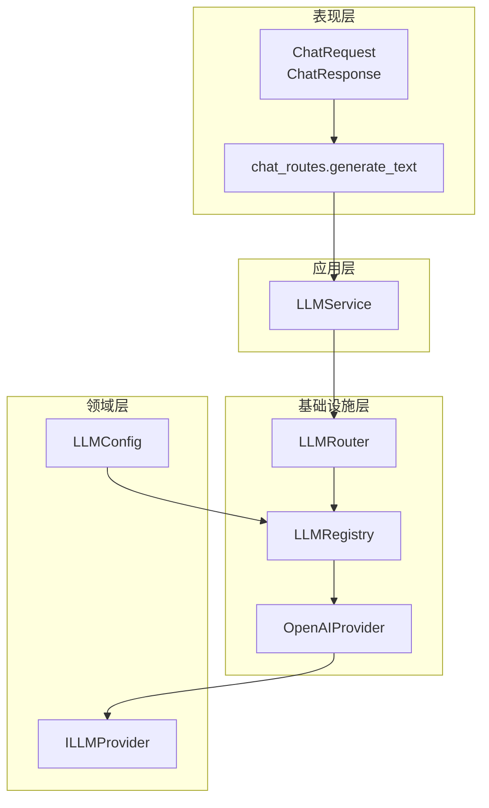
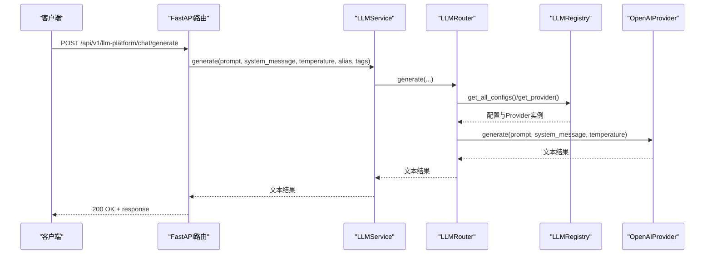
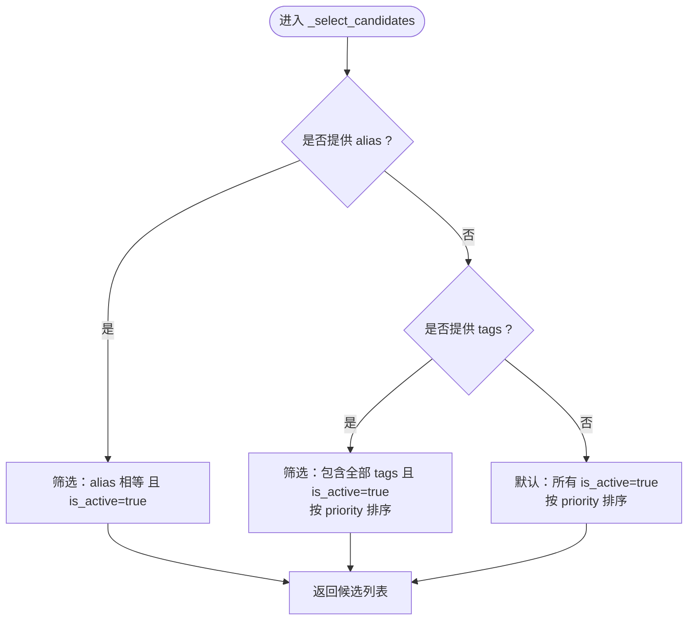
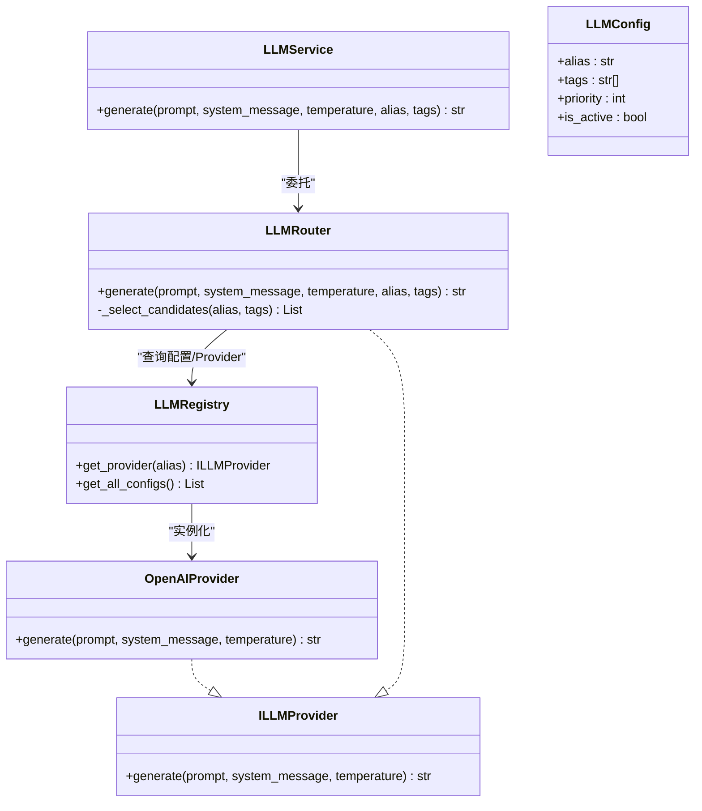

# 聊天生成接口

<cite>
**本文档引用的文件**
- [chat_routes.py](file://src/modules/llm_platform/presentation/rest/chat_routes.py)
- [llm_service.py](file://src/modules/llm_platform/application/services/llm_service.py)
- [router.py](file://src/modules/llm_platform/infrastructure/router.py)
- [registry.py](file://src/modules/llm_platform/infrastructure/registry.py)
- [llm.py](file://src/modules/llm_platform/domain/ports/llm.py)
- [llm_config.py](file://src/modules/llm_platform/domain/entities/llm_config.py)
- [openai.py](file://src/modules/llm_platform/infrastructure/adapters/openai.py)
- [exceptions.py](file://src/modules/llm_platform/domain/exceptions.py)
- [routes.py](file://src/api/routes.py)
- [test_chat_api.py](file://scripts/test_chat_api.py)
- [base.py](file://src/modules/llm_platform/infrastructure/adapters/base.py)
</cite>

## 目录
1. [简介](#简介)
2. [项目结构](#项目结构)
3. [核心组件](#核心组件)
4. [架构总览](#架构总览)
5. [详细组件分析](#详细组件分析)
6. [依赖关系分析](#依赖关系分析)
7. [性能考量](#性能考量)
8. [故障排除指南](#故障排除指南)
9. [结论](#结论)
10. [附录](#附录)

## 简介
本文件为聊天生成接口的完整API文档，聚焦于POST /api/v1/llm-platform/chat/generate端点。文档涵盖：
- 请求参数与响应格式
- 大语言模型选择机制（按别名与标签筛选）
- 系统消息在对话中的作用机制
- 温度参数的作用与调优建议
- 异常处理与错误响应格式
- 完整的请求/响应示例与使用场景

## 项目结构
该接口位于LLM平台模块的REST层，采用分层架构：
- 表现层：FastAPI路由与DTO定义
- 应用层：LLMService门面服务
- 基础设施层：LLMRouter路由、LLMRegistry注册表、Provider适配器
- 领域层：LLMConfig配置实体、ILLMProvider抽象

图表来源
- [chat_routes.py](file://src/modules/llm_platform/presentation/rest/chat_routes.py#L12-L34)
- [llm_service.py](file://src/modules/llm_platform/application/services/llm_service.py#L9-L24)
- [router.py](file://src/modules/llm_platform/infrastructure/router.py#L11-L13)
- [registry.py](file://src/modules/llm_platform/infrastructure/registry.py#L11-L20)
- [llm.py](file://src/modules/llm_platform/domain/ports/llm.py#L5-L12)
- [llm_config.py](file://src/modules/llm_platform/domain/entities/llm_config.py#L6-L25)
- [openai.py](file://src/modules/llm_platform/infrastructure/adapters/openai.py#L10-L17)

章节来源
- [chat_routes.py](file://src/modules/llm_platform/presentation/rest/chat_routes.py#L1-L69)
- [routes.py](file://src/api/routes.py#L1-L13)

## 核心组件
- ChatRequest：定义请求体字段与约束
- ChatResponse：定义响应体字段
- LLMService：应用服务门面，封装路由与异常处理
- LLMRouter：模型选择与调用路由
- LLMRegistry：Provider注册与配置管理
- OpenAIProvider：具体Provider实现
- ILLMProvider：Provider抽象接口
- LLMConfig：模型配置实体

章节来源
- [chat_routes.py](file://src/modules/llm_platform/presentation/rest/chat_routes.py#L12-L34)
- [llm_service.py](file://src/modules/llm_platform/application/services/llm_service.py#L9-L63)
- [router.py](file://src/modules/llm_platform/infrastructure/router.py#L11-L68)
- [registry.py](file://src/modules/llm_platform/infrastructure/registry.py#L11-L104)
- [openai.py](file://src/modules/llm_platform/infrastructure/adapters/openai.py#L10-L65)
- [llm.py](file://src/modules/llm_platform/domain/ports/llm.py#L5-L38)
- [llm_config.py](file://src/modules/llm_platform/domain/entities/llm_config.py#L6-L54)

## 架构总览
下图展示了从HTTP请求到模型调用的完整链路。

图表来源
- [chat_routes.py](file://src/modules/llm_platform/presentation/rest/chat_routes.py#L34-L68)
- [llm_service.py](file://src/modules/llm_platform/application/services/llm_service.py#L25-L62)
- [router.py](file://src/modules/llm_platform/infrastructure/router.py#L35-L67)
- [registry.py](file://src/modules/llm_platform/infrastructure/registry.py#L93-L103)
- [openai.py](file://src/modules/llm_platform/infrastructure/adapters/openai.py#L22-L64)

## 详细组件分析

### API端点规范
- 方法与路径：POST /api/v1/llm-platform/chat/generate
- 认证与授权：未在路由中定义，默认遵循全局中间件策略
- 请求体：ChatRequest
- 响应体：ChatResponse
- 错误码：500（内部服务错误）

请求体字段
- prompt: 字符串，必填，用户输入的提示词
- system_message: 字符串，可选，系统预设消息
- alias: 字符串，可选，指定使用的大模型别名
- tags: 字符串数组，可选，通过标签筛选大模型
- temperature: 浮点数，范围[0.0, 2.0]，默认0.7，采样温度

响应体字段
- response: 字符串，大模型生成的文本

章节来源
- [chat_routes.py](file://src/modules/llm_platform/presentation/rest/chat_routes.py#L12-L34)
- [chat_routes.py](file://src/modules/llm_platform/presentation/rest/chat_routes.py#L22-L29)

### 大语言模型选择机制
模型选择遵循以下优先级与规则：
- 若提供alias：仅匹配该别名且处于激活状态的配置
- 若提供tags：匹配同时具备全部所请求标签且处于激活状态的配置，并按priority降序排序
- 若两者均未提供：默认选择所有激活配置，并按priority降序排序
- 路由器遍历候选配置，尝试调用对应的Provider；若某Provider调用失败，记录错误并继续下一个候选，直至成功或全部失败

图表来源
- [router.py](file://src/modules/llm_platform/infrastructure/router.py#L15-L33)

章节来源
- [router.py](file://src/modules/llm_platform/infrastructure/router.py#L15-L33)

### 系统消息在对话中的作用机制
- system_message会被封装为{"role": "system", "content": system_message}的消息对象
- prompt会被封装为{"role": "user", "content": prompt}的消息对象
- 两个消息按顺序组成消息列表传入模型调用
- 该机制适用于兼容OpenAI协议的模型（如SiliconFlow等）

章节来源
- [openai.py](file://src/modules/llm_platform/infrastructure/adapters/openai.py#L31-L35)

### 温度参数的作用与调优建议
- 作用：控制输出的随机性与创造性。较低温度使输出更稳定、确定；较高温度使输出更具多样性、创造性
- 范围：0.0 - 2.0（接口约束）
- 调优建议：
  - 任务导向、事实性回答：0.3 - 0.5
  - 创意写作、头脑风暴：0.7 - 1.0
  - 高风险场景（需谨慎）：≤0.5
  - 低风险场景（可多样化）：0.7 - 1.2

章节来源
- [llm_service.py](file://src/modules/llm_platform/application/services/llm_service.py#L39-L41)
- [openai.py](file://src/modules/llm_platform/infrastructure/adapters/openai.py#L44-L45)

### 异常处理与错误响应
- 路由层捕获异常并统一转换为HTTP 500错误
- LLMRouter在无可用模型或所有候选Provider调用失败时抛出NoAvailableModelError
- OpenAIProvider在连接/速率限制/API错误等情况下抛出LLMConnectionError
- 异常类定义包含错误码与状态码，便于前端统一处理

图表来源
- [llm.py](file://src/modules/llm_platform/domain/ports/llm.py#L5-L38)
- [llm_service.py](file://src/modules/llm_platform/application/services/llm_service.py#L9-L24)
- [router.py](file://src/modules/llm_platform/infrastructure/router.py#L11-L13)
- [registry.py](file://src/modules/llm_platform/infrastructure/registry.py#L11-L20)
- [openai.py](file://src/modules/llm_platform/infrastructure/adapters/openai.py#L10-L17)
- [llm_config.py](file://src/modules/llm_platform/domain/entities/llm_config.py#L6-L38)

章节来源
- [chat_routes.py](file://src/modules/llm_platform/presentation/rest/chat_routes.py#L65-L68)
- [router.py](file://src/modules/llm_platform/infrastructure/router.py#L45-L67)
- [openai.py](file://src/modules/llm_platform/infrastructure/adapters/openai.py#L56-L64)
- [exceptions.py](file://src/modules/llm_platform/domain/exceptions.py#L31-L61)

### 请求/响应示例与使用场景
以下示例基于测试脚本与接口定义，展示不同参数组合的典型用法：

- 示例1：指定模型别名
  - 请求：包含prompt与alias字段
  - 作用：直接路由到指定别名的模型配置
  - 参考：[test_chat_api.py](file://scripts/test_chat_api.py#L29-L30)

- 示例2：按标签筛选
  - 请求：包含prompt与tags字段（如["qwen"]）
  - 作用：在匹配标签的模型中按优先级选择
  - 参考：[test_chat_api.py](file://scripts/test_chat_api.py#L32-L33)

- 示例3：默认路由
  - 请求：仅包含prompt
  - 作用：使用所有激活配置并按优先级排序
  - 参考：[test_chat_api.py](file://scripts/test_chat_api.py#L35-L36)

- 示例4：包含系统消息与温度
  - 请求：包含prompt、system_message、temperature
  - 作用：为模型注入系统角色与采样策略
  - 参考：[chat_routes.py](file://src/modules/llm_platform/presentation/rest/chat_routes.py#L16-L20)

章节来源
- [test_chat_api.py](file://scripts/test_chat_api.py#L6-L36)
- [chat_routes.py](file://src/modules/llm_platform/presentation/rest/chat_routes.py#L16-L20)

## 依赖关系分析
- 组件耦合
  - 路由层依赖应用服务
  - 应用服务依赖路由器
  - 路由器依赖注册表
  - 注册表依赖仓储与Provider实现
  - Provider实现依赖领域接口
- 关键依赖链
  - chat_routes.generate_text → LLMService.generate → LLMRouter.generate → LLMRegistry.get_provider → OpenAIProvider.generate

图表来源
- [chat_routes.py](file://src/modules/llm_platform/presentation/rest/chat_routes.py#L34-L68)
- [llm_service.py](file://src/modules/llm_platform/application/services/llm_service.py#L25-L62)
- [router.py](file://src/modules/llm_platform/infrastructure/router.py#L35-L67)
- [registry.py](file://src/modules/llm_platform/infrastructure/registry.py#L93-L97)
- [openai.py](file://src/modules/llm_platform/infrastructure/adapters/openai.py#L22-L64)

章节来源
- [chat_routes.py](file://src/modules/llm_platform/presentation/rest/chat_routes.py#L1-L69)
- [llm_service.py](file://src/modules/llm_platform/application/services/llm_service.py#L1-L63)
- [router.py](file://src/modules/llm_platform/infrastructure/router.py#L1-L68)
- [registry.py](file://src/modules/llm_platform/infrastructure/registry.py#L1-L104)
- [openai.py](file://src/modules/llm_platform/infrastructure/adapters/openai.py#L1-L65)

## 性能考量
- 模型选择复杂度
  - 无参数：O(n)遍历激活配置并排序
  - 按别名：O(n)过滤并常数时间查找
  - 按标签：O(n)过滤与排序
- 调用失败重试
  - 路由器对候选Provider进行顺序尝试，失败即切换下一个，提高可用性
- 日志与可观测性
  - 关键流程记录DEBUG/INFO/WARNING/ERROR级别日志，便于定位问题

## 故障排除指南
- 无可用模型
  - 现象：HTTP 500，错误信息包含“未找到匹配的LLM模型”
  - 排查：确认alias存在且is_active为true；或确认tags集合满足“包含全部标签”且配置处于激活状态
  - 参考：[router.py](file://src/modules/llm_platform/infrastructure/router.py#L45-L46)

- Provider调用失败
  - 现象：HTTP 500，错误信息包含底层API错误或连接错误
  - 排查：检查API密钥、基础URL、网络连通性；查看Provider日志
  - 参考：[openai.py](file://src/modules/llm_platform/infrastructure/adapters/openai.py#L56-L64)

- 温度过高导致输出不稳定
  - 现象：输出多样性过大，难以复现
  - 建议：降低temperature至0.3-0.7区间

- 系统消息未生效
  - 现象：system_message未影响输出
  - 排查：确认system_message非空；确认Provider支持system消息（OpenAI协议兼容）

章节来源
- [router.py](file://src/modules/llm_platform/infrastructure/router.py#L45-L67)
- [openai.py](file://src/modules/llm_platform/infrastructure/adapters/openai.py#L56-L64)
- [exceptions.py](file://src/modules/llm_platform/domain/exceptions.py#L31-L61)

## 结论
POST /api/v1/llm-platform/chat/generate提供了统一的聊天生成入口，具备灵活的模型选择能力与完善的异常处理机制。通过alias与tags可实现精确或智能路由，结合system_message与temperature可满足多样化的业务需求。建议在生产环境中配合监控与日志体系，持续优化模型配置与调参策略。

## 附录

### API定义总览
- 方法：POST
- 路径：/api/v1/llm-platform/chat/generate
- 请求体：ChatRequest
- 响应体：ChatResponse
- 错误码：500（内部服务错误）

章节来源
- [chat_routes.py](file://src/modules/llm_platform/presentation/rest/chat_routes.py#L34-L68)