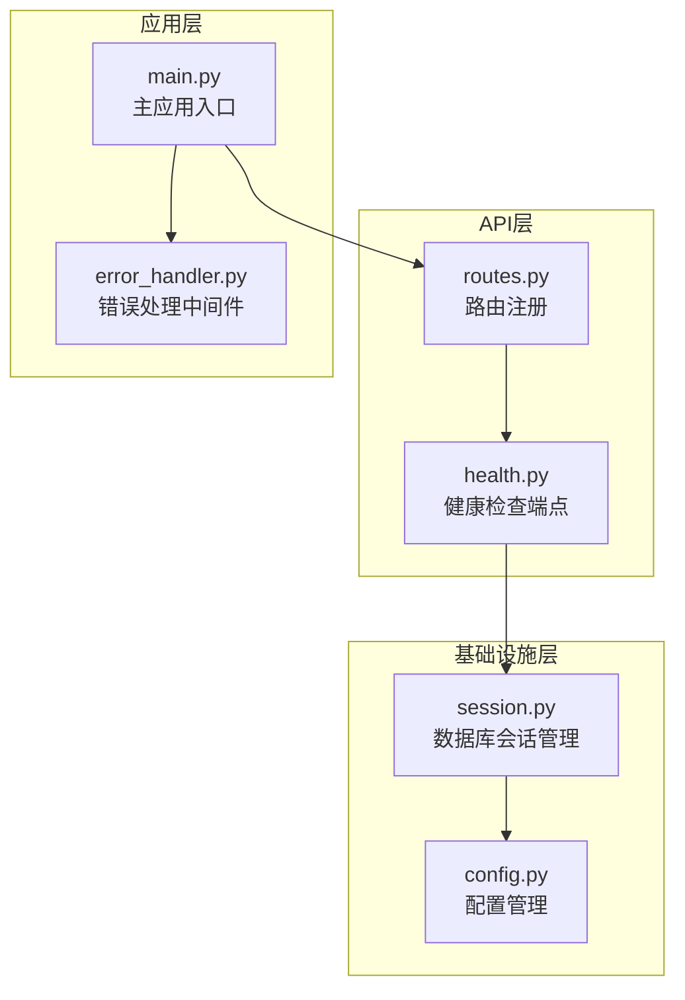
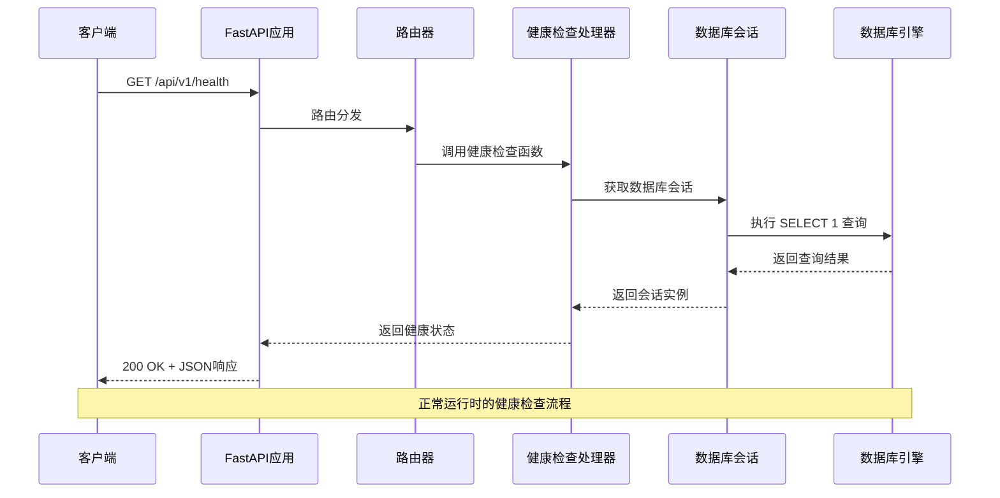
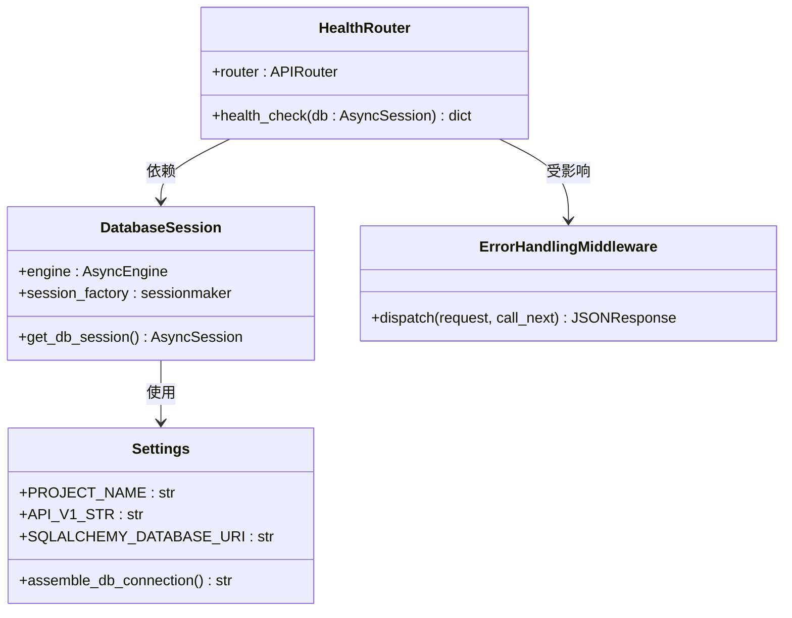
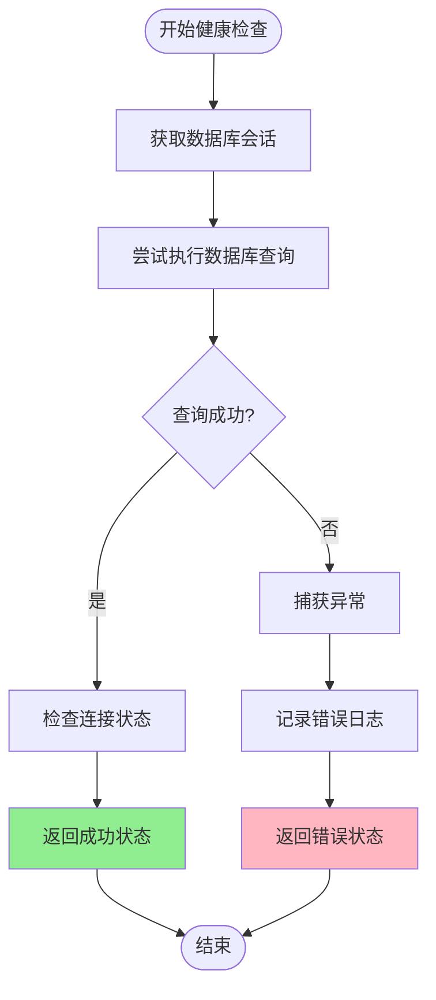
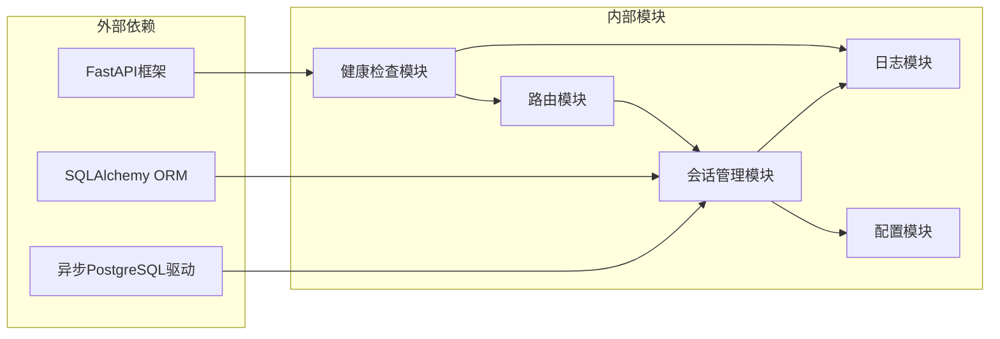

# 健康检查接口

<cite>
**本文档引用的文件**
- [health.py](file://src/api/health.py)
- [routes.py](file://src/api/routes.py)
- [session.py](file://src/shared/infrastructure/db/session.py)
- [config.py](file://src/shared/config.py)
- [main.py](file://src/main.py)
- [error_handler.py](file://src/api/middlewares/error_handler.py)
- [Dockerfile](file://Dockerfile)
- [docker-compose.yml](file://docker-compose.yml)
- [test_health.py](file://tests/test_health.py)
</cite>

## 目录
1. [简介](#简介)
2. [项目结构](#项目结构)
3. [核心组件](#核心组件)
4. [架构概览](#架构概览)
5. [详细组件分析](#详细组件分析)
6. [依赖关系分析](#依赖关系分析)
7. [性能考虑](#性能考虑)
8. [故障排除指南](#故障排除指南)
9. [结论](#结论)

## 简介

健康检查接口是现代微服务架构中的关键基础设施组件，用于监控应用程序的运行状态和可用性。本文档详细介绍了Stock Helper项目中的健康检查实现，包括数据库连接状态检查、外部API可用性检查和系统资源监控的实现原理。

健康检查接口提供了以下核心功能：
- 实时监控数据库连接状态
- 快速服务可用性检测
- 异常状态的详细诊断信息
- 容器化部署的集成支持

## 项目结构

健康检查功能在项目中的组织结构如下：

**图表来源**
- [routes.py](file://src/api/routes.py#L1-L13)
- [health.py](file://src/api/health.py#L1-L24)
- [session.py](file://src/shared/infrastructure/db/session.py#L1-L64)
- [config.py](file://src/shared/config.py#L1-L68)
- [main.py](file://src/main.py#L1-L75)

**章节来源**
- [routes.py](file://src/api/routes.py#L1-L13)
- [health.py](file://src/api/health.py#L1-L24)
- [session.py](file://src/shared/infrastructure/db/session.py#L1-L64)

## 核心组件

### 健康检查端点

健康检查端点位于`/api/v1/health`路径，是一个简单的GET请求端点，专门用于监控应用程序的健康状态。

**端点规范**
- **HTTP方法**: GET
- **路径**: `/api/v1/health`
- **认证**: 无需认证
- **内容类型**: application/json

### 数据库连接检查

健康检查的核心功能是验证数据库连接的有效性。系统通过执行一个简单的SQL查询来确认数据库连接状态。

**检查机制**
- 执行`SELECT 1`查询
- 验证连接池的可用性
- 检查连接超时和网络问题

### 错误处理机制

健康检查实现了完善的错误处理策略，确保即使在异常情况下也能返回有意义的状态信息。

**错误处理特性**
- 捕获所有数据库连接异常
- 返回详细的错误信息
- 统一的JSON响应格式

**章节来源**
- [health.py](file://src/api/health.py#L10-L24)

## 架构概览

健康检查接口在整个系统架构中的位置和交互关系如下：

**图表来源**
- [health.py](file://src/api/health.py#L10-L24)
- [session.py](file://src/shared/infrastructure/db/session.py#L24-L64)
- [routes.py](file://src/api/routes.py#L8-L12)

## 详细组件分析

### 健康检查实现类图

**图表来源**
- [health.py](file://src/api/health.py#L1-L24)
- [session.py](file://src/shared/infrastructure/db/session.py#L1-L64)
- [config.py](file://src/shared/config.py#L8-L68)
- [error_handler.py](file://src/api/middlewares/error_handler.py#L8-L46)

### 健康检查流程图

**图表来源**
- [health.py](file://src/api/health.py#L18-L23)

### 数据库连接管理

数据库连接管理通过依赖注入模式实现，确保了连接的安全管理和生命周期控制。

**连接管理特性**
- 异步连接池管理
- 自动连接回收
- 异常自动回滚
- 日志记录和监控

**章节来源**
- [session.py](file://src/shared/infrastructure/db/session.py#L24-L64)

### 配置管理

系统使用Pydantic的BaseSettings类来管理配置，支持环境变量和配置文件的灵活组合。

**配置管理特点**
- 环境变量优先级
- 类型安全验证
- 动态配置组装
- 模块化配置扩展

**章节来源**
- [config.py](file://src/shared/config.py#L8-L68)

## 依赖关系分析

健康检查接口的依赖关系展示了系统的模块化设计和清晰的职责分离。

**图表来源**
- [health.py](file://src/api/health.py#L1-L5)
- [session.py](file://src/shared/infrastructure/db/session.py#L1-L3)
- [routes.py](file://src/api/routes.py#L1-L6)

**章节来源**
- [health.py](file://src/api/health.py#L1-L5)
- [session.py](file://src/shared/infrastructure/db/session.py#L1-L3)
- [routes.py](file://src/api/routes.py#L1-L6)

## 性能考虑

健康检查接口在设计时充分考虑了性能优化和资源使用效率。

### 性能优化策略

1. **轻量级查询**: 使用`SELECT 1`进行最小化的数据库检查
2. **异步处理**: 完全异步的数据库操作避免阻塞
3. **连接池复用**: 利用连接池减少连接建立开销
4. **快速失败**: 异常情况下的快速响应机制

### 资源使用监控

健康检查接口本身对系统资源的影响极小，主要消耗包括：
- 内存占用: 几十KB的临时对象
- CPU时间: 微秒级的数据库查询
- 网络带宽: 几字节的响应数据

## 故障排除指南

### 常见问题及解决方案

#### 数据库连接失败

**症状**: 健康检查返回错误状态，包含详细的错误信息

**可能原因**:
- 数据库服务器不可达
- 认证凭据错误
- 网络连接问题
- 连接池耗尽

**解决步骤**:
1. 检查数据库服务器状态
2. 验证连接字符串配置
3. 确认网络连通性
4. 查看数据库日志

#### 权限不足

**症状**: 数据库查询被拒绝

**解决方法**:
1. 更新数据库用户权限
2. 检查防火墙设置
3. 验证SSL证书配置

#### 超时问题

**症状**: 健康检查响应缓慢或超时

**解决方法**:
1. 增加数据库连接超时设置
2. 优化数据库查询性能
3. 检查服务器负载情况

### 监控和调试

#### 日志分析

健康检查相关的日志信息包括：
- 连接建立和关闭事件
- 查询执行时间和结果
- 异常捕获和处理信息
- 性能统计和指标

#### 性能基准测试

建议定期进行健康检查的性能基准测试：
- 测试不同负载下的响应时间
- 监控连接池使用率
- 分析异常情况的恢复时间

**章节来源**
- [error_handler.py](file://src/api/middlewares/error_handler.py#L13-L46)
- [session.py](file://src/shared/infrastructure/db/session.py#L36-L64)

## 结论

健康检查接口作为现代微服务架构的重要组成部分，在Stock Helper项目中实现了以下目标：

### 设计优势

1. **简单可靠**: 通过最小化的数据库查询实现可靠的健康状态检测
2. **异步高效**: 完全异步的设计确保了高性能的响应能力
3. **错误友好**: 提供详细的错误信息帮助快速定位问题
4. **易于集成**: 标准化的API接口便于各种监控和编排系统的集成

### 最佳实践建议

1. **合理配置检查间隔**: 根据服务重要性和资源限制设置合适的检查频率
2. **监控关键指标**: 关注连接池使用率、响应时间和错误率等关键指标
3. **日志记录**: 确保健康检查的日志记录有助于问题诊断
4. **容错设计**: 考虑网络分区和数据库故障等极端情况的处理

### 未来改进方向

1. **扩展检查范围**: 可以考虑添加外部API可用性检查和系统资源监控
2. **智能告警**: 实现基于历史数据的智能告警阈值调整
3. **分布式追踪**: 集成分布式追踪系统以便更好地理解健康检查的性能特征

健康检查接口为整个系统的稳定运行提供了重要的保障机制，是构建可靠微服务架构不可或缺的基础组件。