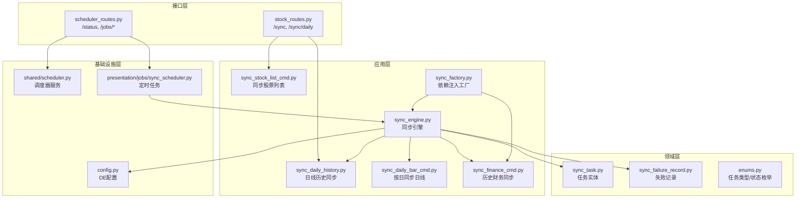
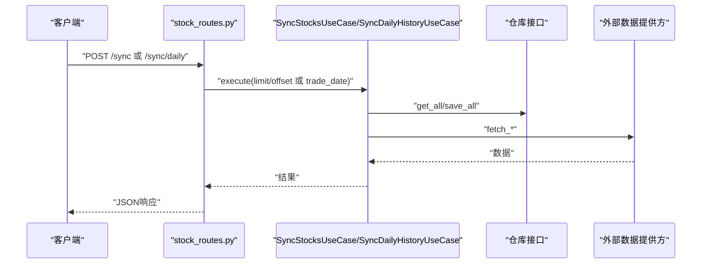
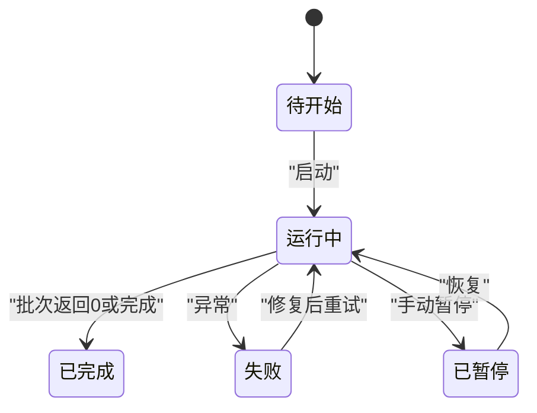
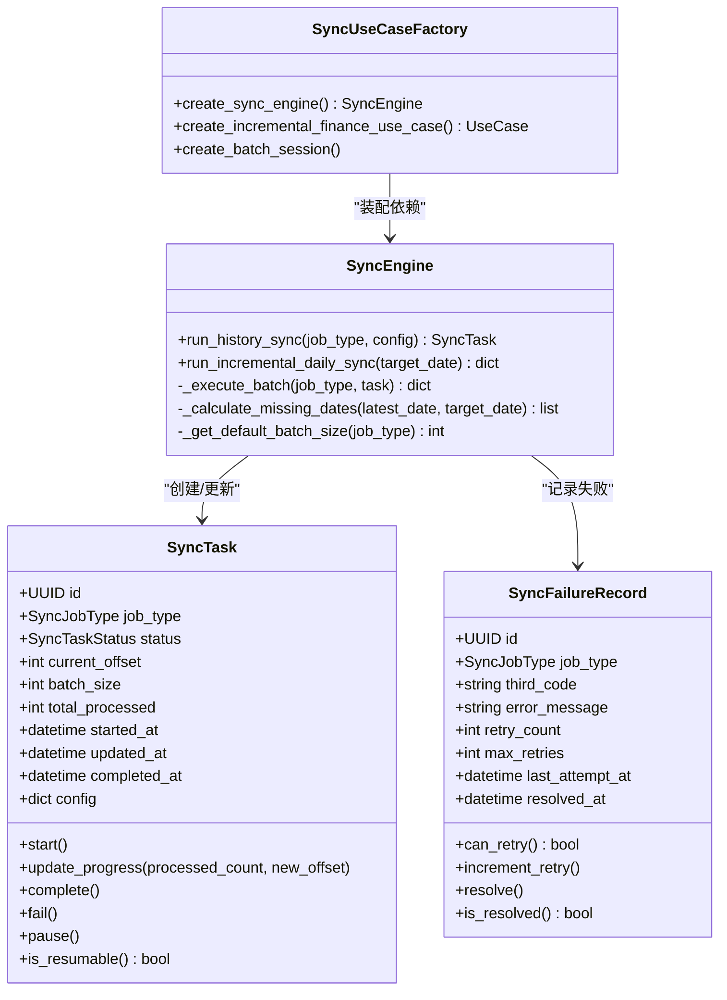

# 数据同步API

<cite>
**本文引用的文件**
- [src/modules/data_engineering/presentation/rest/stock_routes.py](file://src/modules/data_engineering/presentation/rest/stock_routes.py)
- [src/modules/data_engineering/presentation/rest/scheduler_routes.py](file://src/modules/data_engineering/presentation/rest/scheduler_routes.py)
- [src/modules/data_engineering/application/commands/sync_stock_list_cmd.py](file://src/modules/data_engineering/application/commands/sync_stock_list_cmd.py)
- [src/modules/data_engineering/application/commands/sync_daily_history.py](file://src/modules/data_engineering/application/commands/sync_daily_history.py)
- [src/modules/data_engineering/application/commands/sync_daily_bar_cmd.py](file://src/modules/data_engineering/application/commands/sync_daily_bar_cmd.py)
- [src/modules/data_engineering/application/commands/sync_finance_cmd.py](file://src/modules/data_engineering/application/commands/sync_finance_cmd.py)
- [src/modules/data_engineering/application/commands/sync_engine.py](file://src/modules/data_engineering/application/commands/sync_engine.py)
- [src/modules/data_engineering/application/factories/sync_factory.py](file://src/modules/data_engineering/application/factories/sync_factory.py)
- [src/modules/data_engineering/presentation/jobs/sync_scheduler.py](file://src/modules/data_engineering/presentation/jobs/sync_scheduler.py)
- [src/modules/data_engineering/domain/model/sync_task.py](file://src/modules/data_engineering/domain/model/sync_task.py)
- [src/modules/data_engineering/domain/model/sync_failure_record.py](file://src/modules/data_engineering/domain/model/sync_failure_record.py)
- [src/modules/data_engineering/domain/model/enums.py](file://src/modules/data_engineering/domain/model/enums.py)
- [src/modules/data_engineering/infrastructure/config.py](file://src/modules/data_engineering/infrastructure/config.py)
- [src/shared/infrastructure/scheduler.py](file://src/shared/infrastructure/scheduler.py)
</cite>

## 目录
1. [简介](#简介)
2. [项目结构](#项目结构)
3. [核心组件](#核心组件)
4. [架构总览](#架构总览)
5. [详细组件分析](#详细组件分析)
6. [依赖关系分析](#依赖关系分析)
7. [性能考量](#性能考量)
8. [故障排查指南](#故障排查指南)
9. [结论](#结论)
10. [附录](#附录)

## 简介
本文件为“数据同步API”的完整接口文档，覆盖股票列表同步、日线数据同步、财务数据同步等任务的接口定义、启动方式、进度跟踪与状态查询、参数配置、生命周期管理（启动/暂停/恢复/取消）、错误处理与重试、数据一致性保障及性能优化建议。系统采用分层架构，Presentation层提供REST接口与调度器；Application层封装用例与同步引擎；Domain层定义任务与失败记录模型；Infrastructure层负责外部API适配与数据库持久化。

## 项目结构
- 接口层（REST）：提供同步任务的HTTP接口与调度器管理接口
- 应用层（Use Cases/Engine）：封装具体同步逻辑、批处理与断点续跑
- 领域层（Models/Enums）：任务状态、任务类型、失败记录等
- 基础设施层（Config/DB/External APIs）：配置、数据库仓库、Tushare客户端

图表来源
- [src/modules/data_engineering/presentation/rest/stock_routes.py](file://src/modules/data_engineering/presentation/rest/stock_routes.py#L57-L106)
- [src/modules/data_engineering/presentation/rest/scheduler_routes.py](file://src/modules/data_engineering/presentation/rest/scheduler_routes.py#L45-L233)
- [src/modules/data_engineering/application/commands/sync_stock_list_cmd.py](file://src/modules/data_engineering/application/commands/sync_stock_list_cmd.py#L15-L49)
- [src/modules/data_engineering/application/commands/sync_daily_history.py](file://src/modules/data_engineering/application/commands/sync_daily_history.py#L8-L73)
- [src/modules/data_engineering/application/commands/sync_daily_bar_cmd.py](file://src/modules/data_engineering/application/commands/sync_daily_bar_cmd.py#L7-L33)
- [src/modules/data_engineering/application/commands/sync_finance_cmd.py](file://src/modules/data_engineering/application/commands/sync_finance_cmd.py#L9-L56)
- [src/modules/data_engineering/application/commands/sync_engine.py](file://src/modules/data_engineering/application/commands/sync_engine.py#L20-L280)
- [src/modules/data_engineering/application/factories/sync_factory.py](file://src/modules/data_engineering/application/factories/sync_factory.py#L14-L115)
- [src/modules/data_engineering/domain/model/sync_task.py](file://src/modules/data_engineering/domain/model/sync_task.py#L9-L64)
- [src/modules/data_engineering/domain/model/sync_failure_record.py](file://src/modules/data_engineering/domain/model/sync_failure_record.py#L9-L42)
- [src/modules/data_engineering/domain/model/enums.py](file://src/modules/data_engineering/domain/model/enums.py#L26-L40)
- [src/modules/data_engineering/infrastructure/config.py](file://src/modules/data_engineering/infrastructure/config.py#L10-L28)
- [src/shared/infrastructure/scheduler.py](file://src/shared/infrastructure/scheduler.py#L4-L60)
- [src/modules/data_engineering/presentation/jobs/sync_scheduler.py](file://src/modules/data_engineering/presentation/jobs/sync_scheduler.py#L9-L128)

章节来源
- [src/modules/data_engineering/presentation/rest/stock_routes.py](file://src/modules/data_engineering/presentation/rest/stock_routes.py#L1-L106)
- [src/modules/data_engineering/presentation/rest/scheduler_routes.py](file://src/modules/data_engineering/presentation/rest/scheduler_routes.py#L1-L233)

## 核心组件
- REST接口
  - 股票列表同步：POST /sync
  - 日线历史同步：POST /sync/daily（支持limit/offset分页）
- 调度器接口
  - GET /scheduler/status：查询调度器状态与可用任务
  - POST /scheduler/jobs/{job_id}/start：以间隔模式启动任务
  - POST /scheduler/jobs/{job_id}/schedule：以Cron模式调度任务
  - POST /scheduler/jobs/{job_id}/trigger：立即触发一次任务
  - POST /scheduler/jobs/{job_id}/stop：停止指定任务
- 应用用例
  - 同步股票列表：SyncStocksUseCase
  - 日线历史同步：SyncDailyHistoryUseCase
  - 按日同步日线：SyncDailyByDateUseCase
  - 历史财务同步：SyncFinanceHistoryUseCase
- 同步引擎
  - SyncEngine：统一编排历史全量与增量同步，支持断点续跑、互斥与批处理
- 任务与失败记录
  - SyncTask：任务生命周期、进度与状态
  - SyncFailureRecord：单股票失败记录与重试控制
- 配置
  - DataEngineeringConfig：Tushare令牌、最小请求间隔、批大小、重试次数等

章节来源
- [src/modules/data_engineering/presentation/rest/stock_routes.py](file://src/modules/data_engineering/presentation/rest/stock_routes.py#L57-L106)
- [src/modules/data_engineering/presentation/rest/scheduler_routes.py](file://src/modules/data_engineering/presentation/rest/scheduler_routes.py#L45-L233)
- [src/modules/data_engineering/application/commands/sync_stock_list_cmd.py](file://src/modules/data_engineering/application/commands/sync_stock_list_cmd.py#L15-L49)
- [src/modules/data_engineering/application/commands/sync_daily_history.py](file://src/modules/data_engineering/application/commands/sync_daily_history.py#L8-L73)
- [src/modules/data_engineering/application/commands/sync_daily_bar_cmd.py](file://src/modules/data_engineering/application/commands/sync_daily_bar_cmd.py#L7-L33)
- [src/modules/data_engineering/application/commands/sync_finance_cmd.py](file://src/modules/data_engineering/application/commands/sync_finance_cmd.py#L9-L56)
- [src/modules/data_engineering/application/commands/sync_engine.py](file://src/modules/data_engineering/application/commands/sync_engine.py#L20-L280)
- [src/modules/data_engineering/domain/model/sync_task.py](file://src/modules/data_engineering/domain/model/sync_task.py#L9-L64)
- [src/modules/data_engineering/domain/model/sync_failure_record.py](file://src/modules/data_engineering/domain/model/sync_failure_record.py#L9-L42)
- [src/modules/data_engineering/infrastructure/config.py](file://src/modules/data_engineering/infrastructure/config.py#L10-L28)

## 架构总览
系统通过REST接口触发同步任务，调度器支持定时与手动触发；应用层用例与同步引擎负责业务编排与批处理；领域模型管理任务状态与失败记录；基础设施层提供配置、数据库仓库与外部API客户端。

图表来源
- [src/modules/data_engineering/presentation/rest/stock_routes.py](file://src/modules/data_engineering/presentation/rest/stock_routes.py#L57-L106)
- [src/modules/data_engineering/application/commands/sync_stock_list_cmd.py](file://src/modules/data_engineering/application/commands/sync_stock_list_cmd.py#L24-L48)
- [src/modules/data_engineering/application/commands/sync_daily_history.py](file://src/modules/data_engineering/application/commands/sync_daily_history.py#L22-L72)

## 详细组件分析

### REST接口定义
- 股票列表同步
  - 方法与路径：POST /sync
  - 请求体：无
  - 响应：包含同步数量与消息
- 日线历史同步
  - 方法与路径：POST /sync/daily
  - 查询参数：limit（默认10）、offset（默认0）
  - 响应：包含同步股票数、总行数与消息
- 调度器状态与任务管理
  - GET /scheduler/status：返回调度器运行状态、已注册任务与可用任务列表
  - POST /scheduler/jobs/{job_id}/start：以间隔模式启动任务（interval_minutes）
  - POST /scheduler/jobs/{job_id}/schedule：以Cron模式调度任务（hour, minute）
  - POST /scheduler/jobs/{job_id}/trigger：立即触发一次任务（可选params）
  - POST /scheduler/jobs/{job_id}/stop：停止指定任务

章节来源
- [src/modules/data_engineering/presentation/rest/stock_routes.py](file://src/modules/data_engineering/presentation/rest/stock_routes.py#L57-L106)
- [src/modules/data_engineering/presentation/rest/scheduler_routes.py](file://src/modules/data_engineering/presentation/rest/scheduler_routes.py#L45-L233)

### 同步任务生命周期与状态
- 任务类型：日线历史、财务历史、日线增量、财务增量
- 任务状态：待开始、运行中、已完成、失败、已暂停
- 生命周期管理：创建任务、启动、断点续跑、完成或失败、暂停/恢复（通过任务状态）

图表来源
- [src/modules/data_engineering/domain/model/sync_task.py](file://src/modules/data_engineering/domain/model/sync_task.py#L27-L63)
- [src/modules/data_engineering/domain/model/enums.py](file://src/modules/data_engineering/domain/model/enums.py#L33-L40)

章节来源
- [src/modules/data_engineering/domain/model/sync_task.py](file://src/modules/data_engineering/domain/model/sync_task.py#L9-L64)
- [src/modules/data_engineering/domain/model/enums.py](file://src/modules/data_engineering/domain/model/enums.py#L26-L40)

### 同步参数配置
- Tushare令牌与最小请求间隔
- 历史日线批大小
- 历史财务批大小与起始日期
- 增量缺失补偿上限
- 失败最大重试次数

章节来源
- [src/modules/data_engineering/infrastructure/config.py](file://src/modules/data_engineering/infrastructure/config.py#L10-L28)

### 同步任务启动方式
- 手动接口
  - /sync：同步股票列表
  - /sync/daily：按limit/offset同步日线历史
- 调度器
  - /scheduler/status：查看状态
  - /scheduler/jobs/{job_id}/start：间隔模式
  - /scheduler/jobs/{job_id}/schedule：Cron模式
  - /scheduler/jobs/{job_id}/trigger：立即触发
  - /scheduler/jobs/{job_id}/stop：停止任务

章节来源
- [src/modules/data_engineering/presentation/rest/stock_routes.py](file://src/modules/data_engineering/presentation/rest/stock_routes.py#L57-L106)
- [src/modules/data_engineering/presentation/rest/scheduler_routes.py](file://src/modules/data_engineering/presentation/rest/scheduler_routes.py#L45-L233)
- [src/modules/data_engineering/presentation/jobs/sync_scheduler.py](file://src/modules/data_engineering/presentation/jobs/sync_scheduler.py#L9-L128)

### 进度跟踪与状态查询
- 历史全量同步通过SyncEngine循环分批，每次更新任务进度（已处理总数、当前偏移、更新时间）
- 任务状态可通过调度器接口查询，包含任务ID、名称、下次运行时间、触发器描述与参数

章节来源
- [src/modules/data_engineering/application/commands/sync_engine.py](file://src/modules/data_engineering/application/commands/sync_engine.py#L47-L128)
- [src/modules/data_engineering/presentation/rest/scheduler_routes.py](file://src/modules/data_engineering/presentation/rest/scheduler_routes.py#L45-L78)

### 错误处理、失败重试与数据一致性
- 单股票失败不中断整批，继续处理下一只股票
- 失败记录实体支持最大重试次数与解决状态
- 增量日线同步在检测到遗漏日期时逐日补偿，单日失败不影响其他日期
- 任务互斥：同类型任务同时只有一个RUNNING任务

章节来源
- [src/modules/data_engineering/application/commands/sync_daily_history.py](file://src/modules/data_engineering/application/commands/sync_daily_history.py#L63-L66)
- [src/modules/data_engineering/domain/model/sync_failure_record.py](file://src/modules/data_engineering/domain/model/sync_failure_record.py#L26-L42)
- [src/modules/data_engineering/application/commands/sync_engine.py](file://src/modules/data_engineering/application/commands/sync_engine.py#L165-L252)

### 同步过程中的数据一致性保证
- 通过任务实体记录进度与状态，支持断点续跑
- 增量同步在无数据时仅同步目标日期，并给出提示
- 历史同步按批处理，每批独立提交，减少长事务风险

章节来源
- [src/modules/data_engineering/domain/model/sync_task.py](file://src/modules/data_engineering/domain/model/sync_task.py#L33-L49)
- [src/modules/data_engineering/application/commands/sync_engine.py](file://src/modules/data_engineering/application/commands/sync_engine.py#L182-L204)

### 性能监控与优化建议
- 限速与批大小：由配置控制，避免超过外部API速率限制
- 批处理：历史同步按批进行，降低内存与网络压力
- 增量补偿：自动检测遗漏日期并补偿，减少人工干预
- 调度器：统一管理任务生命周期，支持间隔与Cron两种模式

章节来源
- [src/modules/data_engineering/infrastructure/config.py](file://src/modules/data_engineering/infrastructure/config.py#L13-L19)
- [src/modules/data_engineering/application/commands/sync_engine.py](file://src/modules/data_engineering/application/commands/sync_engine.py#L254-L270)
- [src/shared/infrastructure/scheduler.py](file://src/shared/infrastructure/scheduler.py#L14-L60)

## 依赖关系分析

图表来源
- [src/modules/data_engineering/domain/model/sync_task.py](file://src/modules/data_engineering/domain/model/sync_task.py#L9-L64)
- [src/modules/data_engineering/domain/model/sync_failure_record.py](file://src/modules/data_engineering/domain/model/sync_failure_record.py#L9-L42)
- [src/modules/data_engineering/application/commands/sync_engine.py](file://src/modules/data_engineering/application/commands/sync_engine.py#L20-L280)
- [src/modules/data_engineering/application/factories/sync_factory.py](file://src/modules/data_engineering/application/factories/sync_factory.py#L14-L115)

## 性能考量
- 批大小与限速：通过配置项控制，避免触发外部API频率限制
- 增量补偿：仅在检测到遗漏时补偿，减少无效调用
- 互斥与断点续跑：避免重复工作，提升整体吞吐
- 任务拆分：历史与增量分离，便于独立优化与扩展

## 故障排查指南
- 调度器状态
  - 使用GET /scheduler/status检查调度器是否运行、任务列表与可用任务
- 任务启动/停止
  - 使用POST /scheduler/jobs/{job_id}/start或/schedule启动；使用/stop停止
  - 使用/trigger立即触发一次任务，便于快速验证
- 常见问题
  - 任务互斥：若已有RUNNING任务，拒绝新建任务
  - 失败重试：检查失败记录的最大重试次数与解决状态
  - 增量补偿：若数据库无数据，仅同步目标日期

章节来源
- [src/modules/data_engineering/presentation/rest/scheduler_routes.py](file://src/modules/data_engineering/presentation/rest/scheduler_routes.py#L45-L233)
- [src/modules/data_engineering/application/commands/sync_engine.py](file://src/modules/data_engineering/application/commands/sync_engine.py#L65-L69)
- [src/modules/data_engineering/domain/model/sync_failure_record.py](file://src/modules/data_engineering/domain/model/sync_failure_record.py#L26-L42)

## 结论
该数据同步API提供了完善的股票列表、日线与财务数据同步能力，支持手动与定时两种启动方式，具备断点续跑、互斥控制、失败重试与增量补偿等特性，满足生产环境下的稳定性与可维护性要求。通过合理的批大小与限速配置，可在保证合规的前提下最大化吞吐。

## 附录

### 接口一览（摘要）
- 股票列表同步
  - 方法：POST
  - 路径：/sync
  - 参数：无
  - 响应：同步数量与消息
- 日线历史同步
  - 方法：POST
  - 路径：/sync/daily
  - 参数：limit（默认10）、offset（默认0）
  - 响应：同步股票数、总行数与消息
- 调度器状态与任务管理
  - GET /scheduler/status
  - POST /scheduler/jobs/{job_id}/start（interval_minutes）
  - POST /scheduler/jobs/{job_id}/schedule（hour, minute）
  - POST /scheduler/jobs/{job_id}/trigger（可选params）
  - POST /scheduler/jobs/{job_id}/stop

章节来源
- [src/modules/data_engineering/presentation/rest/stock_routes.py](file://src/modules/data_engineering/presentation/rest/stock_routes.py#L57-L106)
- [src/modules/data_engineering/presentation/rest/scheduler_routes.py](file://src/modules/data_engineering/presentation/rest/scheduler_routes.py#L45-L233)