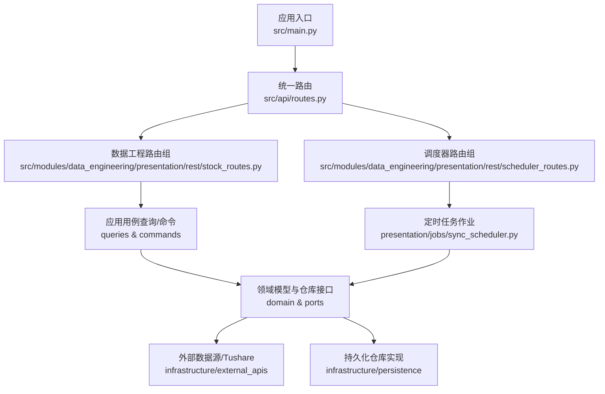
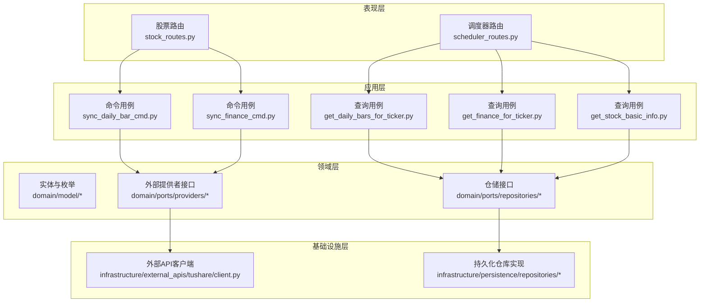
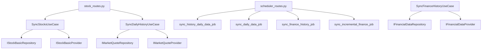

# 数据工程API

<cite>
**本文档引用的文件**
- [src/api/routes.py](file://src/api/routes.py)
- [src/modules/data_engineering/presentation/rest/stock_routes.py](file://src/modules/data_engineering/presentation/rest/stock_routes.py)
- [src/modules/data_engineering/presentation/rest/scheduler_routes.py](file://src/modules/data_engineering/presentation/rest/scheduler_routes.py)
- [src/modules/data_engineering/presentation/jobs/sync_scheduler.py](file://src/modules/data_engineering/presentation/jobs/sync_scheduler.py)
- [src/modules/data_engineering/application/queries/get_daily_bars_for_ticker.py](file://src/modules/data_engineering/application/queries/get_daily_bars_for_ticker.py)
- [src/modules/data_engineering/application/queries/get_finance_for_ticker.py](file://src/modules/data_engineering/application/queries/get_finance_for_ticker.py)
- [src/modules/data_engineering/application/queries/get_stock_basic_info.py](file://src/modules/data_engineering/application/queries/get_stock_basic_info.py)
- [src/modules/data_engineering/application/commands/sync_daily_bar_cmd.py](file://src/modules/data_engineering/application/commands/sync_daily_bar_cmd.py)
- [src/modules/data_engineering/application/commands/sync_finance_cmd.py](file://src/modules/data_engineering/application/commands/sync_finance_cmd.py)
- [src/shared/dtos.py](file://src/shared/dtos.py)
- [src/api/middlewares/error_handler.py](file://src/api/middlewares/error_handler.py)
- [src/modules/data_engineering/infrastructure/config.py](file://src/modules/data_engineering/infrastructure/config.py)
- [src/main.py](file://src/main.py)
</cite>

## 目录
1. [简介](#简介)
2. [项目结构](#项目结构)
3. [核心组件](#核心组件)
4. [架构总览](#架构总览)
5. [详细组件分析](#详细组件分析)
6. [依赖关系分析](#依赖关系分析)
7. [性能考虑](#性能考虑)
8. [故障排除指南](#故障排除指南)
9. [结论](#结论)
10. [附录](#附录)

## 简介
本文件为“数据工程模块”的完整API接口文档，覆盖股票数据相关接口，包括：
- 日线数据获取（按标的与日期区间）
- 财务数据查询（最近N期财务指标）
- 股票基本信息管理（基础信息与最新行情聚合）
- 数据同步任务的启动、暂停与状态查询（调度器接口）

文档详细说明每个接口的HTTP方法、URL模式、请求参数、响应格式、数据验证规则、分页与过滤条件，并提供成功与错误场景的示例。同时给出性能优化建议与批量操作指南。

## 项目结构
数据工程API位于FastAPI应用中，通过统一路由注册到根路径下。数据工程子模块提供REST路由与调度器接口，应用层用例负责业务编排，基础设施层对接外部数据源与持久化。

图表来源
- [src/main.py](file://src/main.py#L64-L65)
- [src/api/routes.py](file://src/api/routes.py#L8-L12)
- [src/modules/data_engineering/presentation/rest/stock_routes.py](file://src/modules/data_engineering/presentation/rest/stock_routes.py#L23-L23)
- [src/modules/data_engineering/presentation/rest/scheduler_routes.py](file://src/modules/data_engineering/presentation/rest/scheduler_routes.py#L17-L17)
- [src/modules/data_engineering/presentation/jobs/sync_scheduler.py](file://src/modules/data_engineering/presentation/jobs/sync_scheduler.py#L1-L128)

章节来源
- [src/api/routes.py](file://src/api/routes.py#L1-L13)
- [src/main.py](file://src/main.py#L64-L74)

## 核心组件
- 统一响应结构：所有API返回标准结构，包含success、message、data等字段，便于前后端一致处理。
- 错误处理中间件：捕获应用异常与未处理异常，统一返回JSON错误响应。
- 数据工程路由组：提供股票同步、日线/财务查询、基础信息查询等接口。
- 调度器路由组：提供任务状态查询、启动（Interval/Cron）、触发一次执行、停止任务等接口。
- 用例层：封装业务逻辑，屏蔽底层依赖，支持批量与分页策略。
- 配置层：集中管理Tushare令牌、同步批大小、重试次数等参数。

章节来源
- [src/shared/dtos.py](file://src/shared/dtos.py#L7-L33)
- [src/api/middlewares/error_handler.py](file://src/api/middlewares/error_handler.py#L8-L46)
- [src/modules/data_engineering/infrastructure/config.py](file://src/modules/data_engineering/infrastructure/config.py#L10-L28)

## 架构总览
数据工程API采用分层架构：Presentation（路由与DTO）、Application（用例）、Domain（实体与端口）、Infrastructure（外部API与持久化）。路由层通过依赖注入获取仓储与提供者，调用应用用例执行业务逻辑，最终访问外部数据源与数据库。

图表来源
- [src/modules/data_engineering/presentation/rest/stock_routes.py](file://src/modules/data_engineering/presentation/rest/stock_routes.py#L1-L106)
- [src/modules/data_engineering/presentation/rest/scheduler_routes.py](file://src/modules/data_engineering/presentation/rest/scheduler_routes.py#L1-L233)
- [src/modules/data_engineering/application/queries/get_daily_bars_for_ticker.py](file://src/modules/data_engineering/application/queries/get_daily_bars_for_ticker.py#L1-L68)
- [src/modules/data_engineering/application/queries/get_finance_for_ticker.py](file://src/modules/data_engineering/application/queries/get_finance_for_ticker.py#L1-L111)
- [src/modules/data_engineering/application/queries/get_stock_basic_info.py](file://src/modules/data_engineering/application/queries/get_stock_basic_info.py#L1-L43)
- [src/modules/data_engineering/application/commands/sync_daily_bar_cmd.py](file://src/modules/data_engineering/application/commands/sync_daily_bar_cmd.py#L1-L33)
- [src/modules/data_engineering/application/commands/sync_finance_cmd.py](file://src/modules/data_engineering/application/commands/sync_finance_cmd.py#L1-L56)

## 详细组件分析

### 股票数据查询接口

#### GET /basic-info
- 功能：获取股票基础信息与最新行情（聚合）
- 方法：GET
- URL：/api/v1/data-engineering/basic-info
- 请求参数：
  - symbol: string（必填；支持股票代码或第三方代码）
- 响应数据：
  - info: StockInfo（基础信息）
  - daily: StockDaily | null（最新行情）
- 示例：
  - 成功响应：包含info与daily字段
  - 未找到：返回null
- 数据验证与过滤：
  - 若symbol包含“.”，按第三方代码查询；否则按股票代码查询
  - 未找到时返回None

章节来源
- [src/modules/data_engineering/application/queries/get_stock_basic_info.py](file://src/modules/data_engineering/application/queries/get_stock_basic_info.py#L12-L43)

#### GET /daily-bars
- 功能：按标的与日期区间返回日线数据（分析所需字段）
- 方法：GET
- URL：/api/v1/data-engineering/daily-bars
- 请求参数：
  - ticker: string（必填；第三方代码，如000001.SZ）
  - start_date: date（必填；开始日期）
  - end_date: date（必填；结束日期）
- 响应数据：
  - 列表项：DailyBarDTO（包含交易日期、开盘、最高、最低、收盘、成交量、成交额、涨跌幅）
- 示例：
  - 成功响应：按trade_date升序的日线列表
- 数据验证与过滤：
  - 参数必填；返回按日期升序排序

章节来源
- [src/modules/data_engineering/application/queries/get_daily_bars_for_ticker.py](file://src/modules/data_engineering/application/queries/get_daily_bars_for_ticker.py#L31-L68)

#### GET /finance-indicators
- 功能：按标的返回最近N期财务指标（研究消费字段）
- 方法：GET
- URL：/api/v1/data-engineering/finance-indicators
- 请求参数：
  - ticker: string（必填；第三方代码）
  - limit: integer（可选；默认5；返回期数）
- 响应数据：
  - 列表项：FinanceIndicatorDTO（盈利能力、每股指标、资产负债与流动性、运营效率等字段）
- 示例：
  - 成功响应：按end_date降序的财务指标列表（最新期在前）
- 数据验证与过滤：
  - limit默认5，可控制返回期数

章节来源
- [src/modules/data_engineering/application/queries/get_finance_for_ticker.py](file://src/modules/data_engineering/application/queries/get_finance_for_ticker.py#L88-L111)

### 数据同步与任务调度接口

#### POST /sync
- 功能：同步股票基础列表
- 方法：POST
- URL：/api/v1/data-engineering/sync
- 请求参数：无
- 响应数据：
  - synced_count: integer（同步数量）
  - message: string（描述信息）
- 示例：
  - 成功响应：包含同步数量与描述
- 错误场景：
  - 外部数据源异常、数据库写入失败等

章节来源
- [src/modules/data_engineering/presentation/rest/stock_routes.py](file://src/modules/data_engineering/presentation/rest/stock_routes.py#L57-L78)

#### POST /sync/daily
- 功能：同步股票日线历史数据（支持分页）
- 方法：POST
- URL：/api/v1/data-engineering/sync/daily
- 请求参数：
  - limit: integer（可选；默认10；每批数量）
  - offset: integer（可选；默认0；跳过数量）
- 响应数据：
  - synced_stocks: integer（同步涉及的股票数）
  - total_rows: integer（同步的总行数）
  - message: string（描述信息）
- 示例：
  - 成功响应：包含同步股票数、总行数与描述
- 错误场景：
  - 外部数据源异常、数据库写入失败等

章节来源
- [src/modules/data_engineering/presentation/rest/stock_routes.py](file://src/modules/data_engineering/presentation/rest/stock_routes.py#L79-L106)

#### POST /sync/daily/by-date
- 功能：同步指定日期的所有股票日线数据
- 方法：POST
- URL：/api/v1/data-engineering/sync/daily/by-date
- 请求参数：
  - trade_date: string（必填；格式YYYYMMDD）
- 响应数据：
  - status: string（success）
  - count: integer（保存条数）
  - message: string（描述信息）
- 示例：
  - 成功响应：包含保存条数与描述
- 错误场景：
  - 外部数据源无数据或异常

章节来源
- [src/modules/data_engineering/application/commands/sync_daily_bar_cmd.py](file://src/modules/data_engineering/application/commands/sync_daily_bar_cmd.py#L19-L33)

#### POST /sync/finance/history
- 功能：同步历史财务数据（分批，避免限流）
- 方法：POST
- URL：/api/v1/data-engineering/sync/finance/history
- 请求参数：
  - start_date: string（必填；格式YYYYMMDD）
  - end_date: string（必填；格式YYYYMMDD）
  - offset: integer（可选；默认0；跳过数量）
  - limit: integer（可选；默认100；每批数量）
- 响应数据：
  - status: string（success）
  - count: integer（同步总条数）
  - batch_size: integer（本批股票数量）
- 示例：
  - 成功响应：包含同步总数与本批股票数
- 错误场景：
  - 外部数据源异常、数据库写入失败等

章节来源
- [src/modules/data_engineering/application/commands/sync_finance_cmd.py](file://src/modules/data_engineering/application/commands/sync_finance_cmd.py#L23-L56)

### 调度器接口

#### GET /scheduler/status
- 功能：获取调度器状态与已注册任务列表
- 方法：GET
- URL：/api/v1/data-engineering/scheduler/status
- 请求参数：无
- 响应数据：
  - is_running: boolean（调度器是否运行中）
  - jobs: 列表（任务详情：id、name、next_run_time、trigger、kwargs）
  - available_jobs: 列表（可用任务ID集合）
- 示例：
  - 成功响应：包含运行状态、任务列表与可用任务

章节来源
- [src/modules/data_engineering/presentation/rest/scheduler_routes.py](file://src/modules/data_engineering/presentation/rest/scheduler_routes.py#L45-L78)

#### POST /scheduler/jobs/{job_id}/start
- 功能：启动指定定时任务（Interval模式）
- 方法：POST
- URL：/api/v1/data-engineering/scheduler/jobs/{job_id}/start
- 请求参数：
  - job_id: string（必填；任务ID，见可用任务列表）
  - interval_minutes: integer（必填；执行间隔，分钟）
- 响应数据：通用成功响应
- 示例：
  - 成功响应：包含启动提示与状态

章节来源
- [src/modules/data_engineering/presentation/rest/scheduler_routes.py](file://src/modules/data_engineering/presentation/rest/scheduler_routes.py#L80-L126)

#### POST /scheduler/jobs/{job_id}/schedule
- 功能：启动指定定时任务（Cron模式）
- 方法：POST
- URL：/api/v1/data-engineering/scheduler/jobs/{job_id}/schedule
- 请求参数：
  - job_id: string（必填；任务ID）
  - hour: integer（必填；0-23）
  - minute: integer（必填；0-59）
- 响应数据：通用成功响应
- 示例：
  - 成功响应：包含调度提示与状态

章节来源
- [src/modules/data_engineering/presentation/rest/scheduler_routes.py](file://src/modules/data_engineering/presentation/rest/scheduler_routes.py#L127-L171)

#### POST /scheduler/jobs/{job_id}/trigger
- 功能：立即触发一次任务（异步执行）
- 方法：POST
- URL：/api/v1/data-engineering/scheduler/jobs/{job_id}/trigger
- 请求参数：
  - job_id: string（必填；任务ID）
  - params: object（可选；任务参数）
- 响应数据：通用成功响应
- 示例：
  - 成功响应：包含触发提示与状态

章节来源
- [src/modules/data_engineering/presentation/rest/scheduler_routes.py](file://src/modules/data_engineering/presentation/rest/scheduler_routes.py#L172-L211)

#### POST /scheduler/jobs/{job_id}/stop
- 功能：停止指定定时任务
- 方法：POST
- URL：/api/v1/data-engineering/scheduler/jobs/{job_id}/stop
- 请求参数：无
- 响应数据：通用成功响应
- 示例：
  - 成功响应：包含停止提示与状态

章节来源
- [src/modules/data_engineering/presentation/rest/scheduler_routes.py](file://src/modules/data_engineering/presentation/rest/scheduler_routes.py#L212-L233)

### 定时任务作业（调度器内部）
- 历史日线全量同步：按配置批大小，自动分批跑完全量，支持断点续跑
- 日线增量同步：按目标日期（默认当天）同步当日日线
- 历史财务全量同步：按起始与结束日期、批大小同步财务指标
- 财务增量同步：按目标日期同步财务指标

章节来源
- [src/modules/data_engineering/presentation/jobs/sync_scheduler.py](file://src/modules/data_engineering/presentation/jobs/sync_scheduler.py#L9-L128)

## 依赖关系分析

图表来源
- [src/modules/data_engineering/presentation/rest/stock_routes.py](file://src/modules/data_engineering/presentation/rest/stock_routes.py#L44-L55)
- [src/modules/data_engineering/presentation/rest/scheduler_routes.py](file://src/modules/data_engineering/presentation/rest/scheduler_routes.py#L19-L25)
- [src/modules/data_engineering/application/commands/sync_finance_cmd.py](file://src/modules/data_engineering/application/commands/sync_finance_cmd.py#L9-L22)

## 性能考虑
- 批量与分页：
  - 财务历史同步默认批大小为100，日线历史默认批大小为50，避免外部API限流。
  - 日线/财务接口支持limit与offset，便于分页与断点续传。
- 并发与限流：
  - 外部API调用遵循最小间隔配置，避免超过服务商频率限制。
- I/O优化：
  - 使用异步仓储与提供者，减少阻塞。
- 调度器：
  - 使用Interval/Cron模式控制任务频率，避免重复执行与资源浪费。
- 建议：
  - 根据数据源限流策略调整批大小与间隔。
  - 对高频查询使用缓存（如最近行情）降低数据库压力。
  - 对批量任务设置最大重试次数与失败告警。

章节来源
- [src/modules/data_engineering/infrastructure/config.py](file://src/modules/data_engineering/infrastructure/config.py#L13-L19)
- [src/modules/data_engineering/application/commands/sync_finance_cmd.py](file://src/modules/data_engineering/application/commands/sync_finance_cmd.py#L31-L33)

## 故障排除指南
- 统一错误响应：
  - 所有异常通过中间件转换为统一JSON结构，包含success、code、message等字段。
- 常见错误场景：
  - 参数缺失或格式错误：返回400/422错误，message描述问题。
  - 未找到任务或任务ID无效：返回404错误。
  - 服务器内部错误：返回500错误。
- 建议排查步骤：
  - 查看日志中的异常栈信息与请求路径。
  - 确认任务ID是否在可用任务列表中。
  - 检查外部数据源令牌与网络连通性。
  - 核对批大小与限流配置是否合理。

章节来源
- [src/api/middlewares/error_handler.py](file://src/api/middlewares/error_handler.py#L17-L45)
- [src/modules/data_engineering/presentation/rest/scheduler_routes.py](file://src/modules/data_engineering/presentation/rest/scheduler_routes.py#L96-L101)

## 结论
本API文档覆盖了数据工程模块的核心功能：股票基础信息、日线与财务指标查询，以及数据同步与任务调度接口。通过统一响应结构、严格的参数校验与分页/批处理策略，系统具备良好的可维护性与扩展性。建议在生产环境中结合限流配置与监控告警，确保稳定高效运行。

## 附录

### 请求与响应示例

- GET /basic-info
  - 请求：symbol=000001 或 symbol=000001.SZ
  - 成功响应：包含info与daily字段
  - 未找到：返回null

- GET /daily-bars
  - 请求：ticker=000001.SZ&start_date=2024-01-01&end_date=2024-12-31
  - 成功响应：按trade_date升序的日线列表

- GET /finance-indicators
  - 请求：ticker=000001.SZ&limit=5
  - 成功响应：按end_date降序的财务指标列表

- POST /sync
  - 请求：无
  - 成功响应：包含synced_count与message

- POST /sync/daily
  - 请求：limit=10&offset=0
  - 成功响应：包含synced_stocks、total_rows与message

- POST /sync/daily/by-date
  - 请求：trade_date=20241231
  - 成功响应：包含count与message

- POST /sync/finance/history
  - 请求：start_date=20200101&end_date=20241231&limit=100&offset=0
  - 成功响应：包含count与batch_size

- GET /scheduler/status
  - 请求：无
  - 成功响应：包含is_running、jobs与available_jobs

- POST /scheduler/jobs/{job_id}/start
  - 请求：interval_minutes=60
  - 成功响应：包含启动提示

- POST /scheduler/jobs/{job_id}/schedule
  - 请求：hour=9&minute=0
  - 成功响应：包含调度提示

- POST /scheduler/jobs/{job_id}/trigger
  - 请求：params={"key":"value"}
  - 成功响应：包含触发提示

- POST /scheduler/jobs/{job_id}/stop
  - 请求：无
  - 成功响应：包含停止提示

### 数据验证规则与分页机制
- 参数必填与类型：
  - ticker、start_date、end_date、trade_date等均为必填，需满足格式要求。
- 分页与过滤：
  - limit与offset控制分页；按日期范围过滤日线与财务数据。
- DTO字段冻结：
  - 查询用例返回的DTO为冻结模型，确保不可变性与一致性。

章节来源
- [src/modules/data_engineering/application/queries/get_daily_bars_for_ticker.py](file://src/modules/data_engineering/application/queries/get_daily_bars_for_ticker.py#L16-L28)
- [src/modules/data_engineering/application/queries/get_finance_for_ticker.py](file://src/modules/data_engineering/application/queries/get_finance_for_ticker.py#L16-L56)
- [src/modules/data_engineering/application/queries/get_stock_basic_info.py](file://src/modules/data_engineering/application/queries/get_stock_basic_info.py#L8-L11)