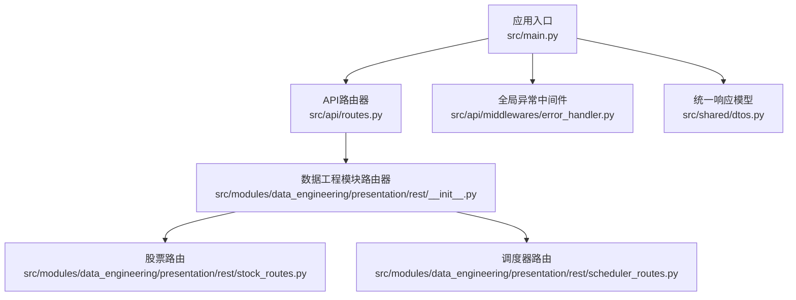
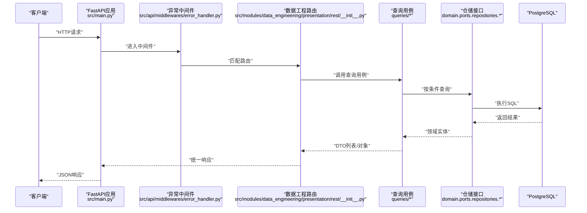
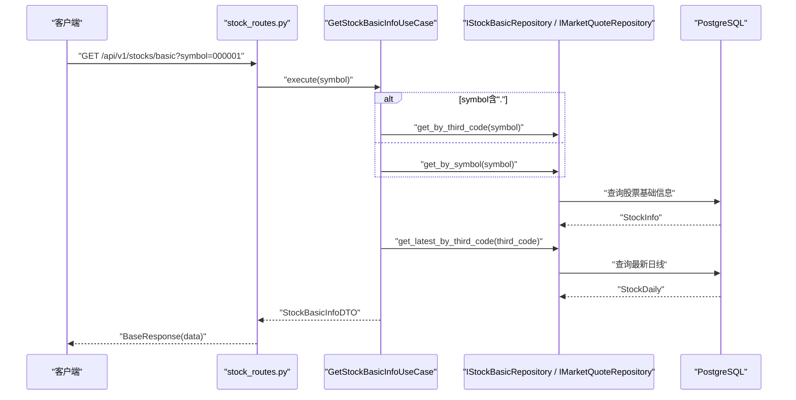
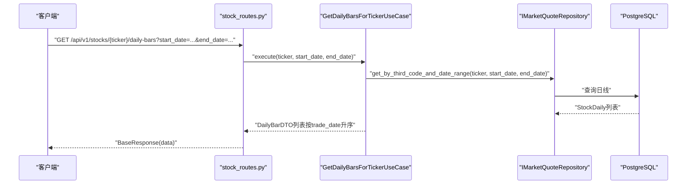
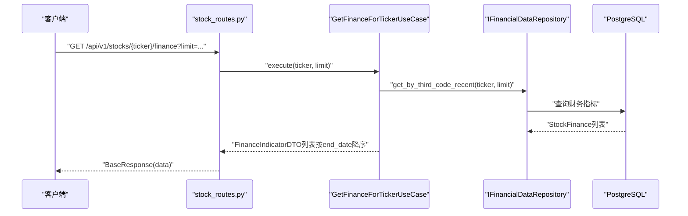
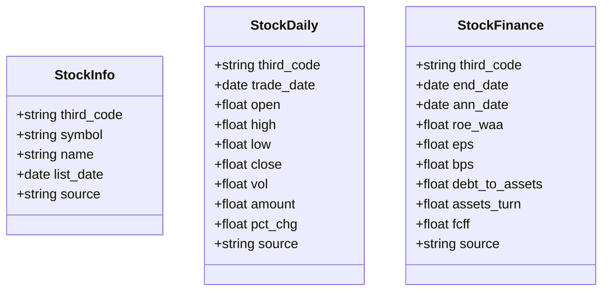
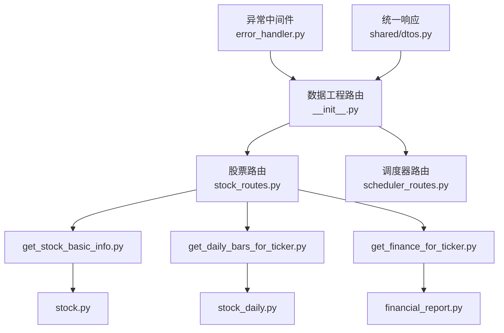

# 股票数据查询API

<cite>
**本文引用的文件**
- [src/main.py](file://src/main.py)
- [src/api/routes.py](file://src/api/routes.py)
- [src/modules/data_engineering/presentation/rest/__init__.py](file://src/modules/data_engineering/presentation/rest/__init__.py)
- [src/modules/data_engineering/presentation/rest/stock_routes.py](file://src/modules/data_engineering/presentation/rest/stock_routes.py)
- [src/modules/data_engineering/presentation/rest/scheduler_routes.py](file://src/modules/data_engineering/presentation/rest/scheduler_routes.py)
- [src/api/middlewares/error_handler.py](file://src/api/middlewares/error_handler.py)
- [src/shared/dtos.py](file://src/shared/dtos.py)
- [src/modules/data_engineering/application/queries/get_stock_basic_info.py](file://src/modules/data_engineering/application/queries/get_stock_basic_info.py)
- [src/modules/data_engineering/application/queries/get_daily_bars_for_ticker.py](file://src/modules/data_engineering/application/queries/get_daily_bars_for_ticker.py)
- [src/modules/data_engineering/application/queries/get_finance_for_ticker.py](file://src/modules/data_engineering/application/queries/get_finance_for_ticker.py)
- [src/modules/data_engineering/domain/model/stock.py](file://src/modules/data_engineering/domain/model/stock.py)
- [src/modules/data_engineering/domain/model/stock_daily.py](file://src/modules/data_engineering/domain/model/stock_daily.py)
- [src/modules/data_engineering/domain/model/financial_report.py](file://src/modules/data_engineering/domain/model/financial_report.py)
- [src/shared/config.py](file://src/shared/config.py)
</cite>

## 目录
1. [简介](#简介)
2. [项目结构](#项目结构)
3. [核心组件](#核心组件)
4. [架构总览](#架构总览)
5. [详细组件分析](#详细组件分析)
6. [依赖关系分析](#依赖关系分析)
7. [性能考虑](#性能考虑)
8. [故障排除指南](#故障排除指南)
9. [结论](#结论)
10. [附录](#附录)

## 简介
本文件为“股票数据查询API”的权威接口文档，覆盖以下核心能力：
- 股票基本信息查询：支持通过标准代码或第三方代码获取股票基础信息，并可关联最新日线行情。
- 日线数据获取：按标的与日期区间查询日线行情，返回标准化字段集合。
- 财务数据查询：按标的获取最近N期财务指标，返回精简字段集，便于研究分析。

同时，文档说明了HTTP方法、URL路径、请求参数、响应格式、查询条件过滤、排序选项、数据验证规则、异常处理、缓存策略、性能优化与批量查询最佳实践。

## 项目结构
系统采用FastAPI + DDD分层架构，数据工程模块对外暴露REST路由，统一挂载于根路由下。核心路由包括：
- 股票相关：/api/v1/stocks
- 调度器相关：/api/v1/scheduler
- 健康检查：/api/v1/health

图表来源
- [src/main.py](file://src/main.py#L1-L75)
- [src/api/routes.py](file://src/api/routes.py#L1-L13)
- [src/modules/data_engineering/presentation/rest/__init__.py](file://src/modules/data_engineering/presentation/rest/__init__.py#L1-L8)
- [src/modules/data_engineering/presentation/rest/stock_routes.py](file://src/modules/data_engineering/presentation/rest/stock_routes.py#L1-L106)
- [src/modules/data_engineering/presentation/rest/scheduler_routes.py](file://src/modules/data_engineering/presentation/rest/scheduler_routes.py#L1-L233)
- [src/api/middlewares/error_handler.py](file://src/api/middlewares/error_handler.py#L1-L46)
- [src/shared/dtos.py](file://src/shared/dtos.py#L1-L33)

章节来源
- [src/main.py](file://src/main.py#L1-L75)
- [src/api/routes.py](file://src/api/routes.py#L1-L13)
- [src/modules/data_engineering/presentation/rest/__init__.py](file://src/modules/data_engineering/presentation/rest/__init__.py#L1-L8)

## 核心组件
- 统一响应模型：提供success、message、data的标准响应结构，确保前后端一致的交互体验。
- 全局异常中间件：捕获应用异常与系统异常，输出统一错误响应。
- 查询用例：封装只读查询逻辑，屏蔽底层仓储细节，面向上层模块提供稳定接口。
- 领域模型：对股票基础信息、日线行情、财务指标进行建模，约束字段与默认值。

章节来源
- [src/shared/dtos.py](file://src/shared/dtos.py#L1-L33)
- [src/api/middlewares/error_handler.py](file://src/api/middlewares/error_handler.py#L1-L46)
- [src/modules/data_engineering/application/queries/get_stock_basic_info.py](file://src/modules/data_engineering/application/queries/get_stock_basic_info.py#L1-L43)
- [src/modules/data_engineering/application/queries/get_daily_bars_for_ticker.py](file://src/modules/data_engineering/application/queries/get_daily_bars_for_ticker.py#L1-L68)
- [src/modules/data_engineering/application/queries/get_finance_for_ticker.py](file://src/modules/data_engineering/application/queries/get_finance_for_ticker.py#L1-L111)
- [src/modules/data_engineering/domain/model/stock.py](file://src/modules/data_engineering/domain/model/stock.py#L1-L63)
- [src/modules/data_engineering/domain/model/stock_daily.py](file://src/modules/data_engineering/domain/model/stock_daily.py#L1-L42)
- [src/modules/data_engineering/domain/model/financial_report.py](file://src/modules/data_engineering/domain/model/financial_report.py#L1-L117)

## 架构总览
下图展示API调用链路：客户端请求经全局中间件处理，进入数据工程模块路由，由对应用例执行查询，最终以统一响应返回。

图表来源
- [src/main.py](file://src/main.py#L1-L75)
- [src/api/middlewares/error_handler.py](file://src/api/middlewares/error_handler.py#L1-L46)
- [src/modules/data_engineering/presentation/rest/__init__.py](file://src/modules/data_engineering/presentation/rest/__init__.py#L1-L8)
- [src/modules/data_engineering/application/queries/get_stock_basic_info.py](file://src/modules/data_engineering/application/queries/get_stock_basic_info.py#L1-L43)
- [src/modules/data_engineering/application/queries/get_daily_bars_for_ticker.py](file://src/modules/data_engineering/application/queries/get_daily_bars_for_ticker.py#L1-L68)
- [src/modules/data_engineering/application/queries/get_finance_for_ticker.py](file://src/modules/data_engineering/application/queries/get_finance_for_ticker.py#L1-L111)

## 详细组件分析

### 股票基本信息查询
- 功能概述：根据股票代码（支持标准代码或第三方代码）查询基础信息，并关联最新日线行情。
- HTTP方法与路径
  - 方法：GET
  - 路径：/api/v1/stocks/basic
  - 参数：
    - symbol: 股票代码（如 000001 或 000001.SZ）
- 响应格式
  - data.info：股票基础信息（见“股票基础信息模型”）
  - data.daily：最新日线行情（可选）
- 查询条件与过滤
  - 若symbol包含“.”则按第三方代码查询；否则按标准代码查询。
  - 未找到股票时返回空。
- 排序与默认行为
  - 无排序需求；若存在日线，返回最新一条。
- 数据验证规则
  - symbol必填；第三方代码需符合“数字+市场后缀”的格式。
- 请求示例
  - GET /api/v1/stocks/basic?symbol=000001
- 响应示例
  - 成功：data.info包含股票基础信息；data.daily可选存在
  - 未找到：data为null
- 异常处理
  - 应用异常：统一错误响应
  - 服务器异常：统一错误响应

图表来源
- [src/modules/data_engineering/presentation/rest/stock_routes.py](file://src/modules/data_engineering/presentation/rest/stock_routes.py#L1-L106)
- [src/modules/data_engineering/application/queries/get_stock_basic_info.py](file://src/modules/data_engineering/application/queries/get_stock_basic_info.py#L1-L43)

章节来源
- [src/modules/data_engineering/application/queries/get_stock_basic_info.py](file://src/modules/data_engineering/application/queries/get_stock_basic_info.py#L1-L43)
- [src/modules/data_engineering/domain/model/stock.py](file://src/modules/data_engineering/domain/model/stock.py#L1-L63)
- [src/modules/data_engineering/domain/model/stock_daily.py](file://src/modules/data_engineering/domain/model/stock_daily.py#L1-L42)

### 日线数据获取
- 功能概述：按标的与日期区间查询日线行情，返回标准化字段集合。
- HTTP方法与路径
  - 方法：GET
  - 路径：/api/v1/stocks/{ticker}/daily-bars
  - 路由参数：
    - ticker: 第三方代码（如 000001.SZ）
  - 查询参数：
    - start_date: 开始日期（YYYY-MM-DD）
    - end_date: 结束日期（YYYY-MM-DD）
- 响应格式
  - data: DailyBarDTO数组，按trade_date升序排列
- 字段说明（DailyBarDTO）
  - trade_date: 交易日期
  - open: 开盘价
  - high: 最高价
  - low: 最低价
  - close: 收盘价
  - vol: 成交量
  - amount: 成交额
  - pct_chg: 涨跌幅（%）
- 查询条件与过滤
  - 必须提供start_date与end_date，且end_date >= start_date。
  - ticker必须为有效的第三方代码。
- 排序选项
  - 默认按trade_date升序。
- 数据验证规则
  - 日期格式严格；数值字段需为有效浮点数。
- 请求示例
  - GET /api/v1/stocks/000001.SZ/daily-bars?start_date=2025-01-01&end_date=2025-01-31
- 响应示例
  - 成功：返回按日期排序的日线数组
  - 无数据：返回空数组
- 异常处理
  - 应用异常：统一错误响应
  - 服务器异常：统一错误响应

图表来源
- [src/modules/data_engineering/presentation/rest/stock_routes.py](file://src/modules/data_engineering/presentation/rest/stock_routes.py#L1-L106)
- [src/modules/data_engineering/application/queries/get_daily_bars_for_ticker.py](file://src/modules/data_engineering/application/queries/get_daily_bars_for_ticker.py#L1-L68)

章节来源
- [src/modules/data_engineering/application/queries/get_daily_bars_for_ticker.py](file://src/modules/data_engineering/application/queries/get_daily_bars_for_ticker.py#L1-L68)
- [src/modules/data_engineering/domain/model/stock_daily.py](file://src/modules/data_engineering/domain/model/stock_daily.py#L1-L42)

### 财务数据查询
- 功能概述：按标的获取最近N期财务指标，返回精简字段集，便于研究分析。
- HTTP方法与路径
  - 方法：GET
  - 路径：/api/v1/stocks/{ticker}/finance
  - 路由参数：
    - ticker: 第三方代码（如 000001.SZ）
  - 查询参数：
    - limit: 返回期数上限（默认5）
- 响应格式
  - data: FinanceIndicatorDTO数组，按end_date降序排列（最新期在前）
- 字段说明（FinanceIndicatorDTO）
  - end_date: 报告期
  - ann_date: 公告日期
  - third_code: 第三方代码
  - source: 数据来源（默认tushare）
  - 盈利能力：gross_margin, netprofit_margin, roe_waa, roic
  - 每股指标：eps, bps, profit_dedt, ocfps, fcff_ps
  - 资产负债与流动性：current_ratio, quick_ratio, debt_to_assets, interestdebt, netdebt
  - 运营效率：invturn_days, arturn_days, assets_turn
  - 其他：total_revenue_ps, fcff
- 查询条件与过滤
  - ticker必须为有效的第三方代码。
  - limit限制返回期数。
- 排序选项
  - 默认按end_date降序。
- 数据验证规则
  - limit为正整数；日期字段为有效日期。
- 请求示例
  - GET /api/v1/stocks/000001.SZ/finance?limit=10
- 响应示例
  - 成功：返回按报告期倒序的财务指标数组
  - 无数据：返回空数组
- 异常处理
  - 应用异常：统一错误响应
  - 服务器异常：统一错误响应

图表来源
- [src/modules/data_engineering/presentation/rest/stock_routes.py](file://src/modules/data_engineering/presentation/rest/stock_routes.py#L1-L106)
- [src/modules/data_engineering/application/queries/get_finance_for_ticker.py](file://src/modules/data_engineering/application/queries/get_finance_for_ticker.py#L1-L111)

章节来源
- [src/modules/data_engineering/application/queries/get_finance_for_ticker.py](file://src/modules/data_engineering/application/queries/get_finance_for_ticker.py#L1-L111)
- [src/modules/data_engineering/domain/model/financial_report.py](file://src/modules/data_engineering/domain/model/financial_report.py#L1-L117)

### 数据模型与字段映射
- 股票基础信息模型（StockInfo）
  - 关键字段：third_code、symbol、name、area、industry、market、list_date、fullname、enname、cnspell、exchange、curr_type、list_status、delist_date、is_hs、source、last_finance_sync_date
- 日线行情模型（StockDaily）
  - 关键字段：third_code、trade_date、open、high、low、close、pre_close、change、pct_chg、vol、amount、adj_factor、turnover_rate、turnover_rate_f、volume_ratio、pe、pe_ttm、pb、ps、ps_ttm、dv_ratio、dv_ttm、total_share、float_share、free_share、total_mv、circ_mv、source
- 财务指标模型（StockFinance）
  - 关键字段：third_code、ann_date、end_date、eps、dt_eps、total_revenue_ps、revenue_ps、capital_rese_ps、surplus_rese_ps、undist_profit_ps、extra_item、profit_dedt、gross_margin、current_ratio、quick_ratio、cash_ratio、inv_turn、ar_turn、ca_turn、fa_turn、assets_turn、invturn_days、arturn_days、op_income、valuechange_income、interst_income、daa、ebit、ebitda、fcff、fcfe、current_exint、noncurrent_exint、interestdebt、netdebt、tangible_asset、working_capital、networking_capital、invest_capital、retained_earnings、diluted2_eps、bps、ocfps、retainedps、cfps、ebit_ps、fcff_ps、fcfe_ps、netprofit_margin、grossprofit_margin、cogs_of_sales、expense_of_sales、profit_to_gr、saleexp_to_gr、adminexp_of_gr、finaexp_of_gr、impai_ttm、gc_of_gr、op_of_gr、ebit_of_gr、roe、roe_waa、roe_dt、roa、npta、roic、roe_yearly、roa2_yearly、roe_avg、opincome_of_ebt、investincome_of_ebt、n_op_profit_of_ebt、tax_to_ebt、dtprofit_to_profit、salescash_to_or、ocf_to_or、ocf_to_opincome、capitalized_to_da、debt_to_assets、assets_to_eqt、dp_assets_to_eqt、ca_to_assets、nca_to_assets、tbassets_to_totalassets、int_to_talcap、eqt_to_talcapital、currentdebt_to_debt、longdeb_to_debt、ocf_to_shortdebt、debt_to_eqt、source

图表来源
- [src/modules/data_engineering/domain/model/stock.py](file://src/modules/data_engineering/domain/model/stock.py#L1-L63)
- [src/modules/data_engineering/domain/model/stock_daily.py](file://src/modules/data_engineering/domain/model/stock_daily.py#L1-L42)
- [src/modules/data_engineering/domain/model/financial_report.py](file://src/modules/data_engineering/domain/model/financial_report.py#L1-L117)

章节来源
- [src/modules/data_engineering/domain/model/stock.py](file://src/modules/data_engineering/domain/model/stock.py#L1-L63)
- [src/modules/data_engineering/domain/model/stock_daily.py](file://src/modules/data_engineering/domain/model/stock_daily.py#L1-L42)
- [src/modules/data_engineering/domain/model/financial_report.py](file://src/modules/data_engineering/domain/model/financial_report.py#L1-L117)

## 依赖关系分析
- 路由聚合
  - 数据工程模块将股票与调度器子路由统一挂载，便于扩展与维护。
- 用例与仓储
  - 查询用例仅依赖仓储接口，保证领域逻辑与基础设施解耦。
- 统一响应与异常处理
  - 所有接口遵循统一响应结构；全局异常中间件集中处理错误。

图表来源
- [src/modules/data_engineering/presentation/rest/__init__.py](file://src/modules/data_engineering/presentation/rest/__init__.py#L1-L8)
- [src/modules/data_engineering/presentation/rest/stock_routes.py](file://src/modules/data_engineering/presentation/rest/stock_routes.py#L1-L106)
- [src/modules/data_engineering/presentation/rest/scheduler_routes.py](file://src/modules/data_engineering/presentation/rest/scheduler_routes.py#L1-L233)
- [src/modules/data_engineering/application/queries/get_stock_basic_info.py](file://src/modules/data_engineering/application/queries/get_stock_basic_info.py#L1-L43)
- [src/modules/data_engineering/application/queries/get_daily_bars_for_ticker.py](file://src/modules/data_engineering/application/queries/get_daily_bars_for_ticker.py#L1-L68)
- [src/modules/data_engineering/application/queries/get_finance_for_ticker.py](file://src/modules/data_engineering/application/queries/get_finance_for_ticker.py#L1-L111)
- [src/modules/data_engineering/domain/model/stock.py](file://src/modules/data_engineering/domain/model/stock.py#L1-L63)
- [src/modules/data_engineering/domain/model/stock_daily.py](file://src/modules/data_engineering/domain/model/stock_daily.py#L1-L42)
- [src/modules/data_engineering/domain/model/financial_report.py](file://src/modules/data_engineering/domain/model/financial_report.py#L1-L117)
- [src/api/middlewares/error_handler.py](file://src/api/middlewares/error_handler.py#L1-L46)
- [src/shared/dtos.py](file://src/shared/dtos.py#L1-L33)

章节来源
- [src/modules/data_engineering/presentation/rest/__init__.py](file://src/modules/data_engineering/presentation/rest/__init__.py#L1-L8)
- [src/modules/data_engineering/presentation/rest/stock_routes.py](file://src/modules/data_engineering/presentation/rest/stock_routes.py#L1-L106)
- [src/modules/data_engineering/presentation/rest/scheduler_routes.py](file://src/modules/data_engineering/presentation/rest/scheduler_routes.py#L1-L233)
- [src/api/middlewares/error_handler.py](file://src/api/middlewares/error_handler.py#L1-L46)
- [src/shared/dtos.py](file://src/shared/dtos.py#L1-L33)

## 性能考虑
- 查询优化
  - 在仓储层为常用查询字段建立索引（如third_code、trade_date、end_date）。
  - 对日期范围查询使用覆盖索引，减少回表。
- 缓存策略
  - 对高频查询（如最新日线）可在应用层引入短期缓存（如Redis），设置合理TTL。
  - 财务指标可按标的+报告期维度缓存，结合last_finance_sync_date进行失效控制。
- 分页与批量
  - 日线与财务查询支持limit参数，建议前端分批拉取并本地拼接。
  - 批量查询时优先使用第三方代码作为唯一标识，减少转换成本。
- 并发与限流
  - 对外部数据源（如Tushare）调用增加超时与重试机制，避免阻塞。
  - 在网关或中间件层实施请求限流，防止雪崩效应。

## 故障排除指南
- 常见错误与定位
  - 404：路由不存在或ticker无效；检查URL路径与第三方代码格式。
  - 422：参数校验失败；核对日期格式、数值范围与必填项。
  - 500：服务器内部错误；查看日志中的异常堆栈。
- 统一错误响应
  - 所有异常均返回统一结构：success=false、code、message；应用异常包含details。
- 排查步骤
  - 确认环境变量与数据库连接配置正确。
  - 检查仓储层SQL执行计划与索引使用情况。
  - 验证外部API调用状态与配额限制。

章节来源
- [src/api/middlewares/error_handler.py](file://src/api/middlewares/error_handler.py#L1-L46)
- [src/shared/dtos.py](file://src/shared/dtos.py#L1-L33)
- [src/shared/config.py](file://src/shared/config.py#L1-L68)

## 结论
本文档系统性地梳理了股票数据查询API的核心接口与实现要点，明确了HTTP方法、路径、参数、响应格式与异常处理规范。通过统一响应模型与全局异常中间件，保障了接口的一致性与稳定性；通过查询用例与仓储接口分离，实现了领域逻辑与基础设施的解耦。建议在生产环境中配合缓存、索引与限流策略，进一步提升性能与可靠性。

## 附录
- 响应通用结构
  - success: 布尔值，业务处理是否成功
  - code: 字符串，业务编码
  - message: 字符串，友好提示
  - data: 泛型数据体，具体接口定义见各节
- 错误响应结构
  - success: false
  - code: 内部错误码
  - message: 错误描述
  - details: 可选，错误详情