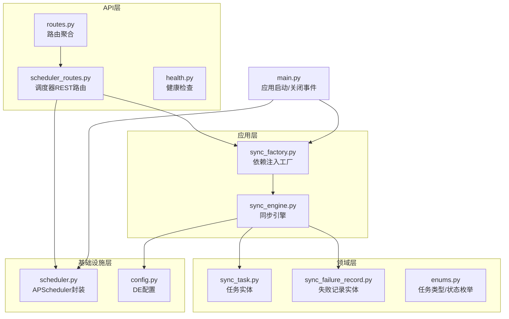
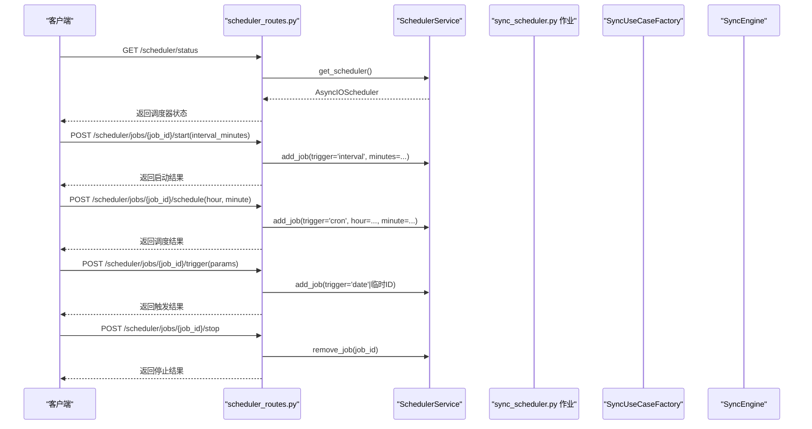
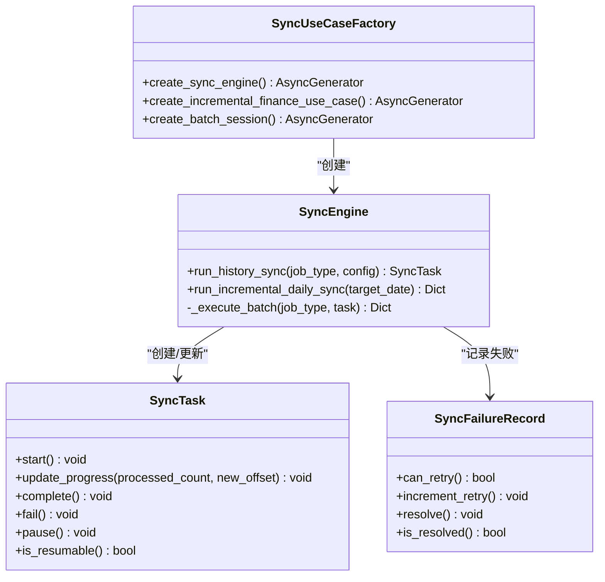
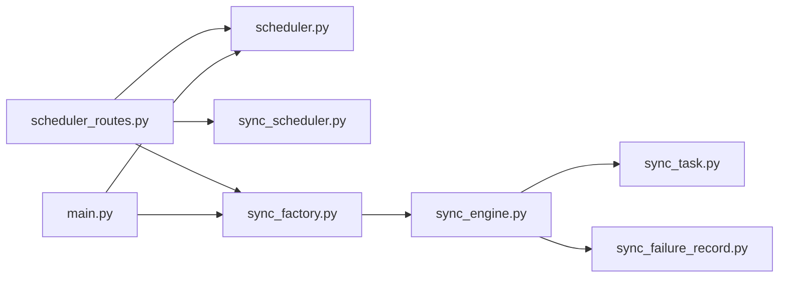

# 调度器API

<cite>
**本文引用的文件**
- [src/modules/data_engineering/presentation/rest/scheduler_routes.py](file://src/modules/data_engineering/presentation/rest/scheduler_routes.py)
- [src/modules/data_engineering/presentation/jobs/sync_scheduler.py](file://src/modules/data_engineering/presentation/jobs/sync_scheduler.py)
- [src/shared/infrastructure/scheduler.py](file://src/shared/infrastructure/scheduler.py)
- [src/modules/data_engineering/application/factories/sync_factory.py](file://src/modules/data_engineering/application/factories/sync_factory.py)
- [src/modules/data_engineering/domain/model/sync_task.py](file://src/modules/data_engineering/domain/model/sync_task.py)
- [src/modules/data_engineering/domain/model/sync_failure_record.py](file://src/modules/data_engineering/domain/model/sync_failure_record.py)
- [src/modules/data_engineering/domain/model/enums.py](file://src/modules/data_engineering/domain/model/enums.py)
- [src/modules/data_engineering/infrastructure/config.py](file://src/modules/data_engineering/infrastructure/config.py)
- [src/modules/data_engineering/application/commands/sync_engine.py](file://src/modules/data_engineering/application/commands/sync_engine.py)
- [src/api/routes.py](file://src/api/routes.py)
- [src/main.py](file://src/main.py)
- [src/shared/dtos.py](file://src/shared/dtos.py)
- [src/api/health.py](file://src/api/health.py)
</cite>

## 目录
1. [简介](#简介)
2. [项目结构](#项目结构)
3. [核心组件](#核心组件)
4. [架构总览](#架构总览)
5. [详细组件分析](#详细组件分析)
6. [依赖关系分析](#依赖关系分析)
7. [性能考量](#性能考量)
8. [故障排查指南](#故障排查指南)
9. [结论](#结论)
10. [附录](#附录)

## 简介
本文件为数据工程调度器API的详细接口文档，覆盖定时任务的创建、修改、删除与状态查询，调度器配置参数（执行周期、触发条件、执行策略），任务队列管理与资源限制，监控与统计接口，以及高可用与故障转移的配置建议。同时说明与外部调度系统的集成方式与事件通知机制。

## 项目结构
调度器API位于数据工程模块的REST层，通过FastAPI路由暴露，底层基于APScheduler进行任务调度，并通过工厂模式注入依赖，保证Presentation层与Infrastructure层解耦。

**图示来源**
- [src/modules/data_engineering/presentation/rest/scheduler_routes.py](file://src/modules/data_engineering/presentation/rest/scheduler_routes.py#L1-L233)
- [src/modules/data_engineering/presentation/jobs/sync_scheduler.py](file://src/modules/data_engineering/presentation/jobs/sync_scheduler.py#L1-L128)
- [src/shared/infrastructure/scheduler.py](file://src/shared/infrastructure/scheduler.py#L1-L60)
- [src/modules/data_engineering/application/factories/sync_factory.py](file://src/modules/data_engineering/application/factories/sync_factory.py#L1-L115)
- [src/modules/data_engineering/application/commands/sync_engine.py](file://src/modules/data_engineering/application/commands/sync_engine.py#L1-L200)
- [src/modules/data_engineering/domain/model/sync_task.py](file://src/modules/data_engineering/domain/model/sync_task.py#L1-L64)
- [src/modules/data_engineering/domain/model/sync_failure_record.py](file://src/modules/data_engineering/domain/model/sync_failure_record.py#L1-L42)
- [src/modules/data_engineering/domain/model/enums.py](file://src/modules/data_engineering/domain/model/enums.py#L1-L40)
- [src/modules/data_engineering/infrastructure/config.py](file://src/modules/data_engineering/infrastructure/config.py#L1-L28)
- [src/api/routes.py](file://src/api/routes.py#L1-L13)
- [src/main.py](file://src/main.py#L1-L75)

**章节来源**
- [src/api/routes.py](file://src/api/routes.py#L1-L13)
- [src/main.py](file://src/main.py#L1-L75)

## 核心组件
- 调度器服务：封装APScheduler，提供单例获取、启动与优雅关闭。
- REST路由：提供调度器状态查询、任务启动（Interval/Cron）、手动触发、停止等接口。
- 作业注册表：将任务ID映射到具体作业函数，便于统一管理。
- 依赖注入工厂：在Presentation层通过工厂创建装配好的用例/引擎，避免直接依赖Infrastructure。
- 任务实体与失败记录：用于追踪任务生命周期、断点续跑与失败重试。
- 配置中心：集中管理Tushare令牌、最小调用间隔、批大小、历史起始日期、失败重试上限等参数。

**章节来源**
- [src/shared/infrastructure/scheduler.py](file://src/shared/infrastructure/scheduler.py#L1-L60)
- [src/modules/data_engineering/presentation/rest/scheduler_routes.py](file://src/modules/data_engineering/presentation/rest/scheduler_routes.py#L1-L233)
- [src/modules/data_engineering/presentation/jobs/sync_scheduler.py](file://src/modules/data_engineering/presentation/jobs/sync_scheduler.py#L1-L128)
- [src/modules/data_engineering/application/factories/sync_factory.py](file://src/modules/data_engineering/application/factories/sync_factory.py#L1-L115)
- [src/modules/data_engineering/domain/model/sync_task.py](file://src/modules/data_engineering/domain/model/sync_task.py#L1-L64)
- [src/modules/data_engineering/domain/model/sync_failure_record.py](file://src/modules/data_engineering/domain/model/sync_failure_record.py#L1-L42)
- [src/modules/data_engineering/infrastructure/config.py](file://src/modules/data_engineering/infrastructure/config.py#L1-L28)

## 架构总览
调度器API采用分层架构：API层负责请求接入与响应封装；应用层通过工厂注入依赖，编排任务执行；领域层定义任务与失败记录实体；基础设施层提供调度器与配置；主程序在启动/关闭事件中管理调度器生命周期。

**图示来源**
- [src/modules/data_engineering/presentation/rest/scheduler_routes.py](file://src/modules/data_engineering/presentation/rest/scheduler_routes.py#L45-L233)
- [src/shared/infrastructure/scheduler.py](file://src/shared/infrastructure/scheduler.py#L1-L60)
- [src/modules/data_engineering/presentation/jobs/sync_scheduler.py](file://src/modules/data_engineering/presentation/jobs/sync_scheduler.py#L1-L128)
- [src/modules/data_engineering/application/factories/sync_factory.py](file://src/modules/data_engineering/application/factories/sync_factory.py#L1-L115)
- [src/modules/data_engineering/application/commands/sync_engine.py](file://src/modules/data_engineering/application/commands/sync_engine.py#L1-L200)

## 详细组件分析

### 调度器状态查询接口
- 路径：GET /scheduler/status
- 功能：返回调度器运行状态、当前已注册任务列表与可用任务ID清单。
- 响应模型：包含调度器运行标志、任务列表（含任务ID、名称、下次运行时间、触发器描述、参数）与可用任务ID列表。
- 实现要点：通过SchedulerService获取APScheduler实例，遍历任务并序列化为响应模型。

**章节来源**
- [src/modules/data_engineering/presentation/rest/scheduler_routes.py](file://src/modules/data_engineering/presentation/rest/scheduler_routes.py#L45-L78)
- [src/shared/infrastructure/scheduler.py](file://src/shared/infrastructure/scheduler.py#L1-L60)

### 任务启动接口（Interval模式）
- 路径：POST /scheduler/jobs/{job_id}/start
- 参数：
  - job_id：任务ID（必须在可用任务列表内）
  - interval_minutes：执行间隔（分钟）
- 行为：若同名任务已存在则先移除，再以Interval模式添加新任务，replace_existing=True确保幂等。
- 触发器：'interval'，单位分钟。
- 返回：标准响应结构，包含操作码与消息。

**章节来源**
- [src/modules/data_engineering/presentation/rest/scheduler_routes.py](file://src/modules/data_engineering/presentation/rest/scheduler_routes.py#L80-L126)

### 任务调度接口（Cron模式）
- 路径：POST /scheduler/jobs/{job_id}/schedule
- 参数：
  - job_id：任务ID（必须在可用任务列表内）
  - hour：小时（0-23）
  - minute：分钟（0-59）
- 行为：以Cron模式添加每日固定时间执行的任务，同名任务先移除。
- 触发器：'cron'，按日执行。
- 返回：标准响应结构。

**章节来源**
- [src/modules/data_engineering/presentation/rest/scheduler_routes.py](file://src/modules/data_engineering/presentation/rest/scheduler_routes.py#L127-L171)

### 立即触发接口
- 路径：POST /scheduler/jobs/{job_id}/trigger
- 参数：
  - job_id：任务ID
  - params：任务参数（可选）
- 行为：异步提交一次任务执行，使用临时任务ID避免冲突，misfire_grace_time用于容错。
- 返回：标准响应结构。

**章节来源**
- [src/modules/data_engineering/presentation/rest/scheduler_routes.py](file://src/modules/data_engineering/presentation/rest/scheduler_routes.py#L172-L211)

### 停止任务接口
- 路径：POST /scheduler/jobs/{job_id}/stop
- 行为：若任务存在则移除，否则返回未运行提示。
- 返回：标准响应结构。

**章节来源**
- [src/modules/data_engineering/presentation/rest/scheduler_routes.py](file://src/modules/data_engineering/presentation/rest/scheduler_routes.py#L212-L233)

### 作业注册表与可用任务
- JOB_REGISTRY：将任务ID映射到具体作业函数，当前支持：
  - sync_daily_history
  - sync_daily_by_date
  - sync_history_finance
  - sync_incremental_finance
- 用途：统一管理可注册任务，供启动/调度/触发接口使用。

**章节来源**
- [src/modules/data_engineering/presentation/rest/scheduler_routes.py](file://src/modules/data_engineering/presentation/rest/scheduler_routes.py#L19-L25)
- [src/modules/data_engineering/presentation/jobs/sync_scheduler.py](file://src/modules/data_engineering/presentation/jobs/sync_scheduler.py#L1-L128)

### 依赖注入与任务执行
- 工厂模式：Presentation层通过SyncUseCaseFactory创建SyncEngine或增量财务用例，自动装配仓储与提供者，并管理会话生命周期。
- 任务执行：各作业函数内部通过工厂创建引擎/用例，读取配置参数，执行历史/增量同步，并记录任务状态与失败记录。

**图示来源**
- [src/modules/data_engineering/application/factories/sync_factory.py](file://src/modules/data_engineering/application/factories/sync_factory.py#L1-L115)
- [src/modules/data_engineering/application/commands/sync_engine.py](file://src/modules/data_engineering/application/commands/sync_engine.py#L1-L200)
- [src/modules/data_engineering/domain/model/sync_task.py](file://src/modules/data_engineering/domain/model/sync_task.py#L1-L64)
- [src/modules/data_engineering/domain/model/sync_failure_record.py](file://src/modules/data_engineering/domain/model/sync_failure_record.py#L1-L42)

**章节来源**
- [src/modules/data_engineering/application/factories/sync_factory.py](file://src/modules/data_engineering/application/factories/sync_factory.py#L1-L115)
- [src/modules/data_engineering/application/commands/sync_engine.py](file://src/modules/data_engineering/application/commands/sync_engine.py#L1-L200)
- [src/modules/data_engineering/domain/model/sync_task.py](file://src/modules/data_engineering/domain/model/sync_task.py#L1-L64)
- [src/modules/data_engineering/domain/model/sync_failure_record.py](file://src/modules/data_engineering/domain/model/sync_failure_record.py#L1-L42)

### 配置参数与执行策略
- 调度器配置：
  - 执行周期：Interval模式以分钟为单位；Cron模式以每日固定时间点为单位。
  - 触发条件：支持任务存在性检查与替换策略（replace_existing）。
  - 执行策略：APScheduler默认策略，支持misfire容错。
- 数据工程配置（DE配置）：
  - TUSHARE_TOKEN：Tushare访问令牌
  - TUSHARE_MIN_INTERVAL：最小调用间隔（秒）
  - SYNC_DAILY_HISTORY_BATCH_SIZE：历史日线批大小
  - SYNC_FINANCE_HISTORY_BATCH_SIZE：历史财务批大小
  - SYNC_FINANCE_HISTORY_START_DATE：历史财务起始日期
  - SYNC_INCREMENTAL_MISSING_LIMIT：日线增量遗漏检测上限
  - SYNC_FAILURE_MAX_RETRIES：失败最大重试次数
- 任务执行策略：
  - 历史全量同步：一次触发、自动分批、断点续跑，同类型任务互斥。
  - 增量同步：日线按日期补偿，财务失败记录自动重试至上限。

**章节来源**
- [src/modules/data_engineering/infrastructure/config.py](file://src/modules/data_engineering/infrastructure/config.py#L1-L28)
- [src/modules/data_engineering/application/commands/sync_engine.py](file://src/modules/data_engineering/application/commands/sync_engine.py#L47-L129)
- [src/modules/data_engineering/domain/model/enums.py](file://src/modules/data_engineering/domain/model/enums.py#L26-L40)

### 任务队列管理与资源限制
- 任务队列管理：
  - 通过APScheduler维护任务集合，支持查询、添加、移除。
  - 作业注册表统一管理可用任务ID与函数映射。
- 资源限制：
  - Tushare限速：通过TushareClient统一限速，最小间隔来自DE配置。
  - 批大小：历史同步按批处理，避免长事务与内存压力。
  - 失败重试：失败记录实体包含最大重试次数，超过上限需人工介入。

**章节来源**
- [src/shared/infrastructure/scheduler.py](file://src/shared/infrastructure/scheduler.py#L1-L60)
- [src/modules/data_engineering/presentation/rest/scheduler_routes.py](file://src/modules/data_engineering/presentation/rest/scheduler_routes.py#L19-L25)
- [src/modules/data_engineering/infrastructure/config.py](file://src/modules/data_engineering/infrastructure/config.py#L13-L20)
- [src/modules/data_engineering/application/commands/sync_engine.py](file://src/modules/data_engineering/application/commands/sync_engine.py#L47-L129)
- [src/modules/data_engineering/domain/model/sync_failure_record.py](file://src/modules/data_engineering/domain/model/sync_failure_record.py#L1-L42)

### 监控与统计接口
- 健康检查：GET /health，检查数据库连接。
- 调度器状态：GET /scheduler/status，返回运行状态与任务列表。
- 任务执行历史与成功率统计：
  - 通过任务实体与失败记录实体持久化任务生命周期与失败情况，可在上层扩展统计接口（例如按任务类型、日期范围查询任务汇总、失败率、平均耗时等）。
- 性能指标：
  - 可结合任务实体的启动/完成时间、总处理量、批大小等计算吞吐量与延迟。

**章节来源**
- [src/api/health.py](file://src/api/health.py#L1-L24)
- [src/modules/data_engineering/presentation/rest/scheduler_routes.py](file://src/modules/data_engineering/presentation/rest/scheduler_routes.py#L45-L78)
- [src/modules/data_engineering/domain/model/sync_task.py](file://src/modules/data_engineering/domain/model/sync_task.py#L1-L64)
- [src/modules/data_engineering/domain/model/sync_failure_record.py](file://src/modules/data_engineering/domain/model/sync_failure_record.py#L1-L42)

### 故障转移与高可用配置
- 调度器生命周期：应用启动时初始化并启动调度器，关闭时优雅关闭，避免任务丢失。
- 任务互斥与断点续跑：同类型任务互斥，支持从RUNNING/PAUSED状态恢复，提升可靠性。
- 失败重试：失败记录支持自动重试至上限，超过上限需人工介入，降低单点失败影响。
- 建议：
  - 多实例部署时，建议使用共享数据库与分布式锁（如Redis）实现任务互斥与状态一致性。
  - 对关键任务启用监控告警与自动重启策略。

**章节来源**
- [src/main.py](file://src/main.py#L21-L48)
- [src/modules/data_engineering/application/commands/sync_engine.py](file://src/modules/data_engineering/application/commands/sync_engine.py#L65-L92)
- [src/modules/data_engineering/domain/model/sync_failure_record.py](file://src/modules/data_engineering/domain/model/sync_failure_record.py#L26-L42)

### 与外部调度系统的集成与事件通知
- 集成方式：
  - REST API：通过HTTP接口进行任务管理与状态查询。
  - 事件通知：可在作业执行前后扩展事件发布（如消息队列/Webhook），用于外部系统联动。
- 建议：
  - 在任务状态变化（启动、完成、失败）时推送事件，携带任务ID、类型、参数与结果摘要。

**章节来源**
- [src/modules/data_engineering/presentation/rest/scheduler_routes.py](file://src/modules/data_engineering/presentation/rest/scheduler_routes.py#L1-L233)

## 依赖关系分析

**图示来源**
- [src/modules/data_engineering/presentation/rest/scheduler_routes.py](file://src/modules/data_engineering/presentation/rest/scheduler_routes.py#L1-L233)
- [src/shared/infrastructure/scheduler.py](file://src/shared/infrastructure/scheduler.py#L1-L60)
- [src/modules/data_engineering/presentation/jobs/sync_scheduler.py](file://src/modules/data_engineering/presentation/jobs/sync_scheduler.py#L1-L128)
- [src/modules/data_engineering/application/factories/sync_factory.py](file://src/modules/data_engineering/application/factories/sync_factory.py#L1-L115)
- [src/modules/data_engineering/application/commands/sync_engine.py](file://src/modules/data_engineering/application/commands/sync_engine.py#L1-L200)
- [src/modules/data_engineering/domain/model/sync_task.py](file://src/modules/data_engineering/domain/model/sync_task.py#L1-L64)
- [src/modules/data_engineering/domain/model/sync_failure_record.py](file://src/modules/data_engineering/domain/model/sync_failure_record.py#L1-L42)
- [src/main.py](file://src/main.py#L1-L75)

**章节来源**
- [src/modules/data_engineering/presentation/rest/scheduler_routes.py](file://src/modules/data_engineering/presentation/rest/scheduler_routes.py#L1-L233)
- [src/shared/infrastructure/scheduler.py](file://src/shared/infrastructure/scheduler.py#L1-L60)
- [src/modules/data_engineering/application/factories/sync_factory.py](file://src/modules/data_engineering/application/factories/sync_factory.py#L1-L115)
- [src/modules/data_engineering/application/commands/sync_engine.py](file://src/modules/data_engineering/application/commands/sync_engine.py#L1-L200)
- [src/modules/data_engineering/domain/model/sync_task.py](file://src/modules/data_engineering/domain/model/sync_task.py#L1-L64)
- [src/modules/data_engineering/domain/model/sync_failure_record.py](file://src/modules/data_engineering/domain/model/sync_failure_record.py#L1-L42)
- [src/main.py](file://src/main.py#L1-L75)

## 性能考量
- 限速策略：统一在基础设施层通过TushareClient限速，避免业务层分散控制，便于调参与维护。
- 批处理：历史同步按批处理，减少单次调用压力与内存占用。
- 任务互斥：同类型任务互斥，避免重复工作与资源竞争。
- 日志与可观测性：接口与作业均记录详细日志，便于定位性能瓶颈。

**章节来源**
- [src/modules/data_engineering/infrastructure/config.py](file://src/modules/data_engineering/infrastructure/config.py#L13-L20)
- [src/modules/data_engineering/application/commands/sync_engine.py](file://src/modules/data_engineering/application/commands/sync_engine.py#L47-L129)
- [src/modules/data_engineering/presentation/jobs/sync_scheduler.py](file://src/modules/data_engineering/presentation/jobs/sync_scheduler.py#L1-L128)

## 故障排查指南
- 常见问题：
  - 任务ID不存在：检查可用任务列表与拼写。
  - 任务已存在：确认是否需要替换旧任务（Interval/Cron均支持replace_existing）。
  - 调度器未运行：确认应用启动事件已执行，调度器已启动。
  - 外部API限速：检查TUSHARE_MIN_INTERVAL配置与网络状况。
- 建议流程：
  - 通过GET /scheduler/status确认任务状态。
  - 查看日志定位异常作业。
  - 检查失败记录表，确认是否达到最大重试次数。
  - 必要时手动触发一次任务验证环境。

**章节来源**
- [src/modules/data_engineering/presentation/rest/scheduler_routes.py](file://src/modules/data_engineering/presentation/rest/scheduler_routes.py#L94-L101)
- [src/modules/data_engineering/infrastructure/config.py](file://src/modules/data_engineering/infrastructure/config.py#L13-L20)
- [src/modules/data_engineering/domain/model/sync_failure_record.py](file://src/modules/data_engineering/domain/model/sync_failure_record.py#L26-L42)

## 结论
本调度器API通过清晰的分层设计与工厂注入，提供了稳定可靠的定时任务管理能力。配合统一的限速策略、批处理与断点续跑机制，能够高效、安全地完成数据工程任务。建议在生产环境中结合监控与事件通知机制，进一步提升可观测性与可维护性。

## 附录

### 接口一览（按功能分组）
- 状态查询
  - GET /scheduler/status
- 任务管理
  - POST /scheduler/jobs/{job_id}/start
  - POST /scheduler/jobs/{job_id}/schedule
  - POST /scheduler/jobs/{job_id}/trigger
  - POST /scheduler/jobs/{job_id}/stop
- 健康检查
  - GET /health

**章节来源**
- [src/modules/data_engineering/presentation/rest/scheduler_routes.py](file://src/modules/data_engineering/presentation/rest/scheduler_routes.py#L45-L233)
- [src/api/health.py](file://src/api/health.py#L1-L24)