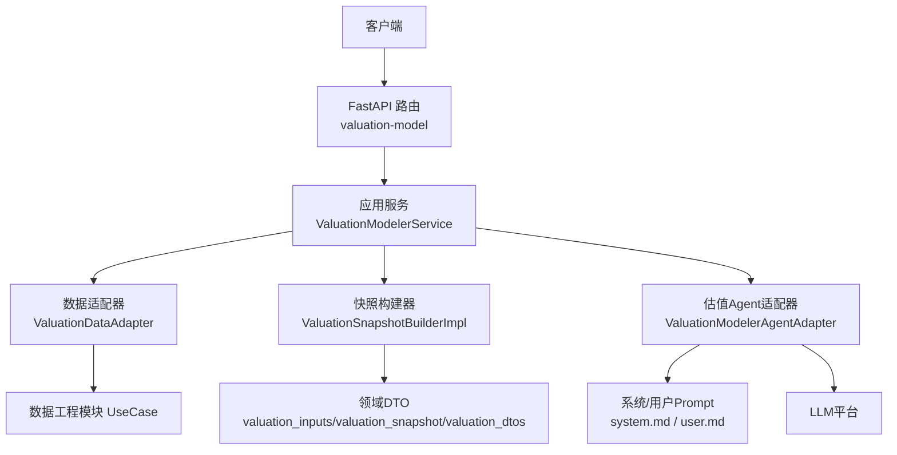
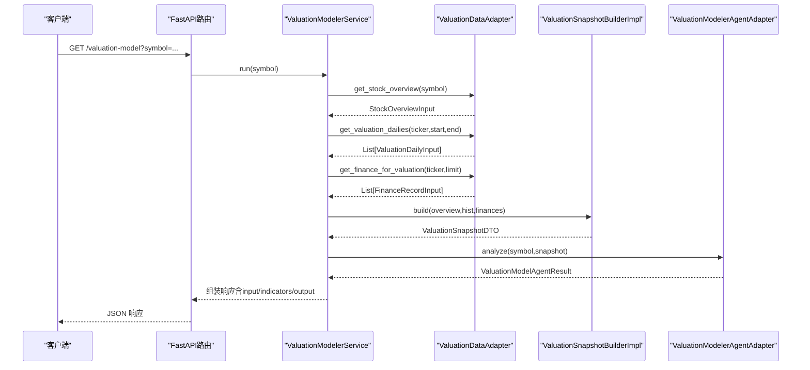
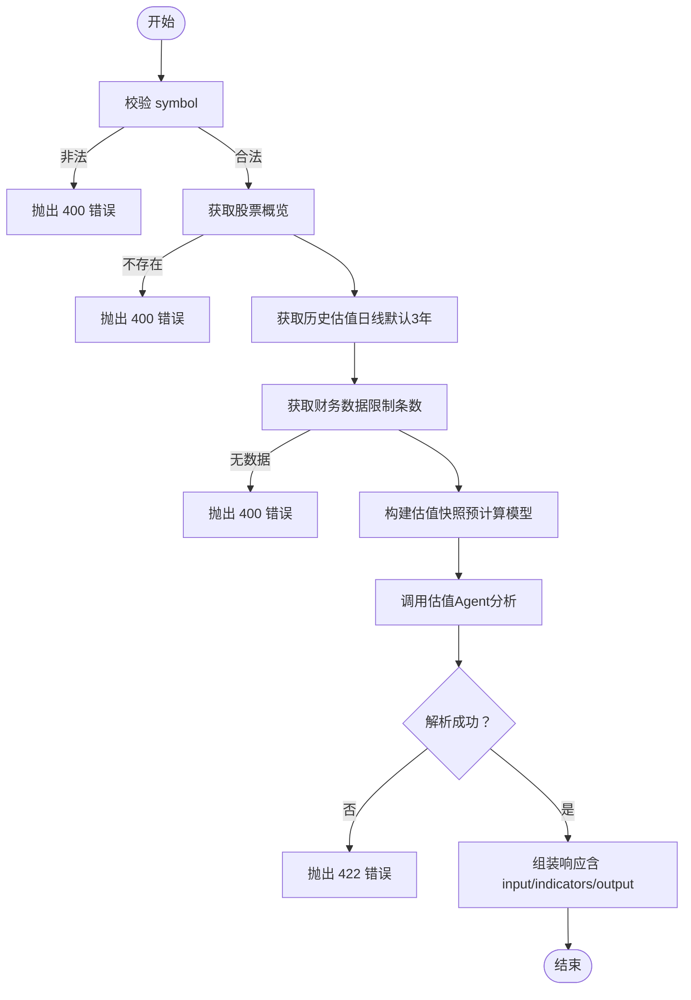
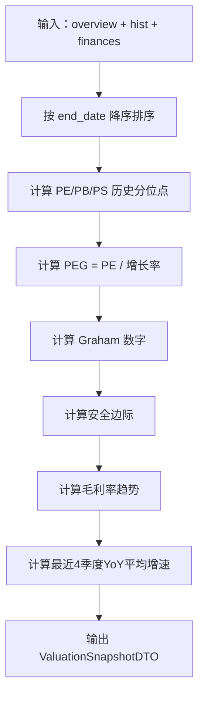
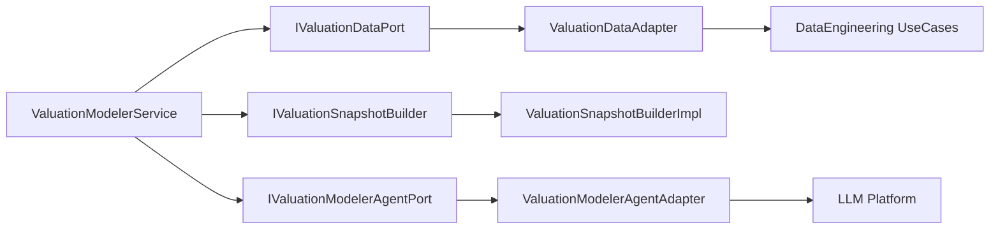

# 估值建模师API

<cite>
**本文档引用的文件**
- [src/main.py](file://src/main.py)
- [src/api/routes.py](file://src/api/routes.py)
- [src/modules/research/presentation/rest/valuation_modeler_routes.py](file://src/modules/research/presentation/rest/valuation_modeler_routes.py)
- [src/modules/research/application/valuation_modeler_service.py](file://src/modules/research/application/valuation_modeler_service.py)
- [src/modules/research/domain/dtos/valuation_dtos.py](file://src/modules/research/domain/dtos/valuation_dtos.py)
- [src/modules/research/domain/dtos/valuation_inputs.py](file://src/modules/research/domain/dtos/valuation_inputs.py)
- [src/modules/research/domain/dtos/valuation_snapshot.py](file://src/modules/research/domain/dtos/valuation_snapshot.py)
- [src/modules/research/domain/ports/valuation_snapshot_builder.py](file://src/modules/research/domain/ports/valuation_snapshot_builder.py)
- [src/modules/research/domain/ports/valuation_modeler_agent.py](file://src/modules/research/domain/ports/valuation_modeler_agent.py)
- [src/modules/research/infrastructure/valuation_snapshot/snapshot_builder.py](file://src/modules/research/infrastructure/valuation_snapshot/snapshot_builder.py)
- [src/modules/research/infrastructure/adapters/valuation_data_adapter.py](file://src/modules/research/infrastructure/adapters/valuation_data_adapter.py)
- [src/modules/research/infrastructure/agents/valuation_modeler/prompts/system.md](file://src/modules/research/infrastructure/agents/valuation_modeler/prompts/system.md)
- [src/modules/research/infrastructure/agents/valuation_modeler/prompts/user.md](file://src/modules/research/infrastructure/agents/valuation_modeler/prompts/user.md)
- [src/modules/research/container.py](file://src/modules/research/container.py)
- [tests/research/application/test_valuation_modeler_service.py](file://tests/research/application/test_valuation_modeler_service.py)
</cite>

## 目录
1. [简介](#简介)
2. [项目结构](#项目结构)
3. [核心组件](#核心组件)
4. [架构总览](#架构总览)
5. [详细组件分析](#详细组件分析)
6. [依赖关系分析](#依赖关系分析)
7. [性能考量](#性能考量)
8. [故障排查指南](#故障排查指南)
9. [结论](#结论)
10. [附录](#附录)

## 简介
本接口面向“估值建模师”能力，提供对指定股票的内在价值区间估计、安全边际分析与置信度评分，并输出关键证据与风险因素，帮助用户剥离市场噪音，基于模型与财务指标做出理性判断。接口支持多模型融合：历史分位点（PE/PB/PS）、PEG 成长匹配度、格雷厄姆保守估值与安全边际。响应体包含解析后的结论与输入/输出上下文，便于审计与复核。

## 项目结构
围绕估值建模师API，后端采用分层与端口适配模式：
- 表现层：FastAPI 路由，负责参数校验、异常转换与响应封装
- 应用层：ValuationModelerService，编排数据获取、快照构建与Agent分析
- 领域层：DTO与端口契约，定义输入、输出与行为边界
- 基础设施层：适配器与实现，对接数据工程模块与大模型平台，完成数据转换与模型预计算

图表来源
- [src/modules/research/presentation/rest/valuation_modeler_routes.py](file://src/modules/research/presentation/rest/valuation_modeler_routes.py#L56-L80)
- [src/modules/research/application/valuation_modeler_service.py](file://src/modules/research/application/valuation_modeler_service.py#L37-L94)
- [src/modules/research/infrastructure/adapters/valuation_data_adapter.py](file://src/modules/research/infrastructure/adapters/valuation_data_adapter.py#L94-L135)
- [src/modules/research/infrastructure/valuation_snapshot/snapshot_builder.py](file://src/modules/research/infrastructure/valuation_snapshot/snapshot_builder.py#L167-L281)
- [src/modules/research/infrastructure/agents/valuation_modeler/prompts/system.md](file://src/modules/research/infrastructure/agents/valuation_modeler/prompts/system.md#L1-L44)
- [src/modules/research/infrastructure/agents/valuation_modeler/prompts/user.md](file://src/modules/research/infrastructure/agents/valuation_modeler/prompts/user.md#L1-L52)

章节来源
- [src/main.py](file://src/main.py#L64-L66)
- [src/api/routes.py](file://src/api/routes.py)

## 核心组件
- REST 接口
  - 路径：GET /valuation-model
  - 查询参数：symbol（股票代码，如 000001.SZ）
  - 响应：包含估值判断、置信度、内在价值区间、关键证据、风险因素、推理摘要，以及 input、valuation_indicators、output（由代码填入）

- 应用服务
  - 校验 symbol，获取股票概览与历史估值日线（默认3年），获取财务数据（限制条数），构建估值快照，调用Agent分析，组装完整响应

- 领域DTO
  - ValuationResultDTO：估值结论（判断、置信度、内在价值区间、证据、风险、摘要）
  - IntrinsicValueRangeDTO：内在价值区间（下限、上限，含推导依据）
  - ValuationSnapshotDTO：估值快照（市场相对估值、基本面质量、预计算模型指标）

- 端口与适配器
  - IValuationDataPort：获取股票概览、历史估值日线、财务指标
  - IValuationSnapshotBuilder：构建估值快照（预计算历史分位点、PEG、格雷厄姆数字、安全边际、毛利率趋势）
  - IValuationModelerAgentPort：加载Prompt、调用LLM、解析结果

章节来源
- [src/modules/research/presentation/rest/valuation_modeler_routes.py](file://src/modules/research/presentation/rest/valuation_modeler_routes.py#L31-L53)
- [src/modules/research/application/valuation_modeler_service.py](file://src/modules/research/application/valuation_modeler_service.py#L20-L94)
- [src/modules/research/domain/dtos/valuation_dtos.py](file://src/modules/research/domain/dtos/valuation_dtos.py#L16-L64)
- [src/modules/research/domain/dtos/valuation_snapshot.py](file://src/modules/research/domain/dtos/valuation_snapshot.py#L10-L41)
- [src/modules/research/domain/ports/valuation_snapshot_builder.py](file://src/modules/research/domain/ports/valuation_snapshot_builder.py#L16-L34)
- [src/modules/research/domain/ports/valuation_modeler_agent.py](file://src/modules/research/domain/ports/valuation_modeler_agent.py#L11-L28)

## 架构总览
接口请求流程序列图如下：

图表来源
- [src/modules/research/presentation/rest/valuation_modeler_routes.py](file://src/modules/research/presentation/rest/valuation_modeler_routes.py#L62-L80)
- [src/modules/research/application/valuation_modeler_service.py](file://src/modules/research/application/valuation_modeler_service.py#L37-L94)
- [src/modules/research/infrastructure/adapters/valuation_data_adapter.py](file://src/modules/research/infrastructure/adapters/valuation_data_adapter.py#L110-L135)
- [src/modules/research/infrastructure/valuation_snapshot/snapshot_builder.py](file://src/modules/research/infrastructure/valuation_snapshot/snapshot_builder.py#L170-L281)
- [src/modules/research/infrastructure/agents/valuation_modeler/prompts/system.md](file://src/modules/research/infrastructure/agents/valuation_modeler/prompts/system.md#L27-L44)

## 详细组件分析

### REST 接口定义
- 方法与路径：GET /valuation-model
- 查询参数
  - symbol：股票代码（必填）
- 响应体字段
  - valuation_verdict：估值判断（Undervalued/Fair/Overvalued）
  - confidence_score：置信度（0~1）
  - estimated_intrinsic_value_range：内在价值区间（下限、上限，含推导依据）
  - key_evidence：关键证据列表（引用输入数据中的具体数值）
  - risk_factors：风险因素列表
  - reasoning_summary：专业精炼总结（明确机会/陷阱）
  - input：送入大模型的 user prompt（由代码填入）
  - valuation_indicators：估值指标快照（用于填充 prompt，由代码填入）
  - output：大模型原始返回字符串（由代码填入）

章节来源
- [src/modules/research/presentation/rest/valuation_modeler_routes.py](file://src/modules/research/presentation/rest/valuation_modeler_routes.py#L31-L53)
- [src/modules/research/presentation/rest/valuation_modeler_routes.py](file://src/modules/research/presentation/rest/valuation_modeler_routes.py#L56-L80)

### 应用服务编排流程
- 输入校验：symbol 必填且非空白
- 数据获取：
  - 股票概览：若为空则报错（标的不存在）
  - 历史估值日线：默认近3年
  - 财务数据：限制条数，若为空则报错（无财务数据）
- 快照构建：预计算历史分位点、PEG、格雷厄姆数字、安全边际、毛利率趋势
- Agent分析：加载系统/用户Prompt，调用LLM，解析为DTO
- 响应组装：将DTO与input/valuation_indicators/output组合返回

图表来源
- [src/modules/research/application/valuation_modeler_service.py](file://src/modules/research/application/valuation_modeler_service.py#L37-L94)
- [src/modules/research/presentation/rest/valuation_modeler_routes.py](file://src/modules/research/presentation/rest/valuation_modeler_routes.py#L69-L80)

章节来源
- [src/modules/research/application/valuation_modeler_service.py](file://src/modules/research/application/valuation_modeler_service.py#L37-L94)

### 领域DTO与数据契约
- ValuationResultDTO：统一对外输出契约，包含判断、置信度、内在价值区间、证据、风险、摘要
- IntrinsicValueRangeDTO：区间下限/上限，带推导依据（如模型来源）
- ValuationSnapshotDTO：与Prompt模板占位符一一对应，包含市场相对估值、基本面质量、预计算模型指标

章节来源
- [src/modules/research/domain/dtos/valuation_dtos.py](file://src/modules/research/domain/dtos/valuation_dtos.py#L16-L64)
- [src/modules/research/domain/dtos/valuation_snapshot.py](file://src/modules/research/domain/dtos/valuation_snapshot.py#L10-L41)

### 快照构建与预计算逻辑
- 输入类型：StockOverviewInput、ValuationDailyInput、FinanceRecordInput
- 预计算指标
  - 历史分位点：PE、PB、PS（至少60个交易日）
  - PEG：PE/平均利润增长率（增长率>0且PE>0）
  - 格雷厄姆数字：sqrt(22.5 × EPS × BPS)，安全边际：(格雷厄姆-价格)/价格×100
  - 毛利率趋势：同比变化描述
  - 平均利润增速：最近4个可比季度YoY的均值
- 输出：ValuationSnapshotDTO（与Prompt占位符一一对应）

图表来源
- [src/modules/research/infrastructure/valuation_snapshot/snapshot_builder.py](file://src/modules/research/infrastructure/valuation_snapshot/snapshot_builder.py#L25-L165)
- [src/modules/research/infrastructure/valuation_snapshot/snapshot_builder.py](file://src/modules/research/infrastructure/valuation_snapshot/snapshot_builder.py#L170-L281)

章节来源
- [src/modules/research/infrastructure/valuation_snapshot/snapshot_builder.py](file://src/modules/research/infrastructure/valuation_snapshot/snapshot_builder.py#L167-L281)
- [src/modules/research/domain/ports/valuation_snapshot_builder.py](file://src/modules/research/domain/ports/valuation_snapshot_builder.py#L16-L34)

### 数据适配器与Agent端口
- ValuationDataAdapter：将数据工程模块的UseCase返回转换为Research内部DTO，屏蔽底层仓储细节
- IValuationModelerAgentPort：抽象Agent分析行为，约束加载Prompt、调用LLM与解析结果
- IValuationSnapshotBuilder：抽象快照构建行为，实现位于基础设施层

章节来源
- [src/modules/research/infrastructure/adapters/valuation_data_adapter.py](file://src/modules/research/infrastructure/adapters/valuation_data_adapter.py#L94-L135)
- [src/modules/research/domain/ports/valuation_modeler_agent.py](file://src/modules/research/domain/ports/valuation_modeler_agent.py#L11-L28)
- [src/modules/research/domain/ports/valuation_snapshot_builder.py](file://src/modules/research/domain/ports/valuation_snapshot_builder.py#L16-L34)

### Prompt与分析框架
- 系统Prompt强调：不进行数学计算、禁止联网、禁止幻觉、严格JSON输出
- 分析框架四步法：相对估值（历史分位）、成长匹配（PEG）、价值地板（格雷厄姆）、排雷（ROE/毛利率/负债率）
- 用户Prompt提供：市场相对估值、基本面质量、预计算模型三部分数据，要求Agent仅引用这些数据进行判断

章节来源
- [src/modules/research/infrastructure/agents/valuation_modeler/prompts/system.md](file://src/modules/research/infrastructure/agents/valuation_modeler/prompts/system.md#L1-L44)
- [src/modules/research/infrastructure/agents/valuation_modeler/prompts/user.md](file://src/modules/research/infrastructure/agents/valuation_modeler/prompts/user.md#L1-L52)

### 容器装配与依赖注入
- ResearchContainer：统一装配估值建模师所需组件（数据适配器、快照构建器、Agent适配器），通过数据工程与LLM平台容器获取依赖，避免跨模块直接依赖

章节来源
- [src/modules/research/container.py](file://src/modules/research/container.py#L94-L108)

## 依赖关系分析
- 组件耦合
  - 应用服务通过端口依赖（IValuationDataPort、IValuationSnapshotBuilder、IValuationModelerAgentPort），保持高层稳定
  - 基础设施实现与领域DTO解耦，便于替换与扩展
- 外部依赖
  - 数据工程模块：提供股票基础信息、历史估值日线、财务指标
  - LLM平台：提供大模型服务与Web搜索能力
- 可能的循环依赖
  - 通过延迟导入（在容器中）规避模块间相互引用

图表来源
- [src/modules/research/application/valuation_modeler_service.py](file://src/modules/research/application/valuation_modeler_service.py#L27-L36)
- [src/modules/research/container.py](file://src/modules/research/container.py#L94-L108)

章节来源
- [src/modules/research/application/valuation_modeler_service.py](file://src/modules/research/application/valuation_modeler_service.py#L27-L36)
- [src/modules/research/container.py](file://src/modules/research/container.py#L94-L108)

## 性能考量
- 数据获取范围控制
  - 历史估值日线默认3年，确保分位点计算稳定性与性能平衡
  - 财务数据限制条数，避免Agent输入过大导致解析成本上升
- 预计算前置
  - 快照构建阶段完成分位点、PEG、格雷厄姆数字、安全边际等计算，减少LLM负担
- 异常早发现
  - 在应用层尽早校验输入与数据可用性，避免无效调用LLM与下游处理

## 故障排查指南
- 常见HTTP错误
  - 400：symbol缺失或标的不存在、无财务数据
  - 422：LLM输出解析失败（输出格式不符合JSON结构或字段缺失）
  - 500：未捕获异常（服务内部错误）
- 排查步骤
  - 确认symbol格式正确且已同步基础数据
  - 检查财务数据是否已同步（至少存在若干条记录）
  - 查看响应中的input与output，定位Agent解析问题
  - 关注key_evidence与risk_factors，确认输入数据是否充足

章节来源
- [src/modules/research/presentation/rest/valuation_modeler_routes.py](file://src/modules/research/presentation/rest/valuation_modeler_routes.py#L69-L80)
- [src/modules/research/application/valuation_modeler_service.py](file://src/modules/research/application/valuation_modeler_service.py#L42-L67)
- [tests/research/application/test_valuation_modeler_service.py](file://tests/research/application/test_valuation_modeler_service.py#L58-L129)

## 结论
估值建模师API通过“数据+模型+LLM”的协同，提供严谨的内在价值区间估计与安全边际分析。其核心优势在于：
- 明确的多模型融合框架（历史分位、PEG、格雷厄姆）
- 预计算前置，降低LLM负担，提升稳定性
- 严格的输出约束与证据链要求，增强可审计性
建议在实际使用中：
- 确保财务数据及时同步，以获得更稳健的模型指标
- 结合行业与周期特征，审慎解读分位点与PEG阈值
- 将Agent输出作为“定性解读”的起点，结合更广泛的内外部信息进行综合判断

## 附录

### 接口规范摘要
- 方法与路径：GET /valuation-model
- 查询参数
  - symbol：股票代码（必填）
- 响应字段
  - valuation_verdict、confidence_score、estimated_intrinsic_value_range、key_evidence、risk_factors、reasoning_summary、input、valuation_indicators、output

章节来源
- [src/modules/research/presentation/rest/valuation_modeler_routes.py](file://src/modules/research/presentation/rest/valuation_modeler_routes.py#L56-L80)

### 估值模型与使用场景
- 历史分位点（PE/PB/PS）
  - 使用场景：判断当前估值是否处于历史低位/高位，识别极端情绪
  - 注意：需满足最少交易日门槛，否则返回N/A
- PEG（成长匹配度）
  - 使用场景：衡量股价相对于盈利增长的合理性；PEG<1通常视为低估
  - 注意：增长率与PE需为正值
- 格雷厄姆数字（保守内在价值）
  - 使用场景：提供安全地板；安全边际>0表示存在安全垫
  - 注意：EPS/BPS需为正值
- 毛利率趋势与财务质量
  - 使用场景：识别“价值陷阱”，低估值+弱基本面可能为陷阱

章节来源
- [src/modules/research/infrastructure/valuation_snapshot/snapshot_builder.py](file://src/modules/research/infrastructure/valuation_snapshot/snapshot_builder.py#L25-L120)
- [src/modules/research/infrastructure/agents/valuation_modeler/prompts/system.md](file://src/modules/research/infrastructure/agents/valuation_modeler/prompts/system.md#L15-L26)

### 输入数据要求
- 股票概览：包含名称、行业、第三方代码、当前价格、市值、PE/PB/PS、股息率等
- 历史估值日线：包含交易日、收盘价、PE/PB/PS
- 财务指标：包含EPS、BPS、ROE、ROIC、毛利率、净利率、资产负债率、现金流等

章节来源
- [src/modules/research/domain/dtos/valuation_inputs.py](file://src/modules/research/domain/dtos/valuation_inputs.py#L11-L39)
- [src/modules/research/infrastructure/adapters/valuation_data_adapter.py](file://src/modules/research/infrastructure/adapters/valuation_data_adapter.py#L31-L92)

### 输出结果说明
- 内在价值区间：包含保守与乐观模型推导依据
- 置信度：基于证据一致性打分（0~1）
- 关键证据：必须引用输入数据中的具体数值
- 风险因素：基于财务质量与估值指标的潜在风险
- 推理摘要：明确指出机会或陷阱

章节来源
- [src/modules/research/domain/dtos/valuation_dtos.py](file://src/modules/research/domain/dtos/valuation_dtos.py#L26-L51)
- [src/modules/research/presentation/rest/valuation_modeler_routes.py](file://src/modules/research/presentation/rest/valuation_modeler_routes.py#L39-L53)

### 示例与用例
- 典型用例：对某银行股进行估值，得到较低PE分位、PEG远小于1、格雷厄姆安全边际显著为正，最终判断为低估并给出区间与理由
- 测试用例覆盖：缺失symbol、标的不存在、无财务数据、完整流程返回等场景

章节来源
- [tests/research/application/test_valuation_modeler_service.py](file://tests/research/application/test_valuation_modeler_service.py#L58-L200)