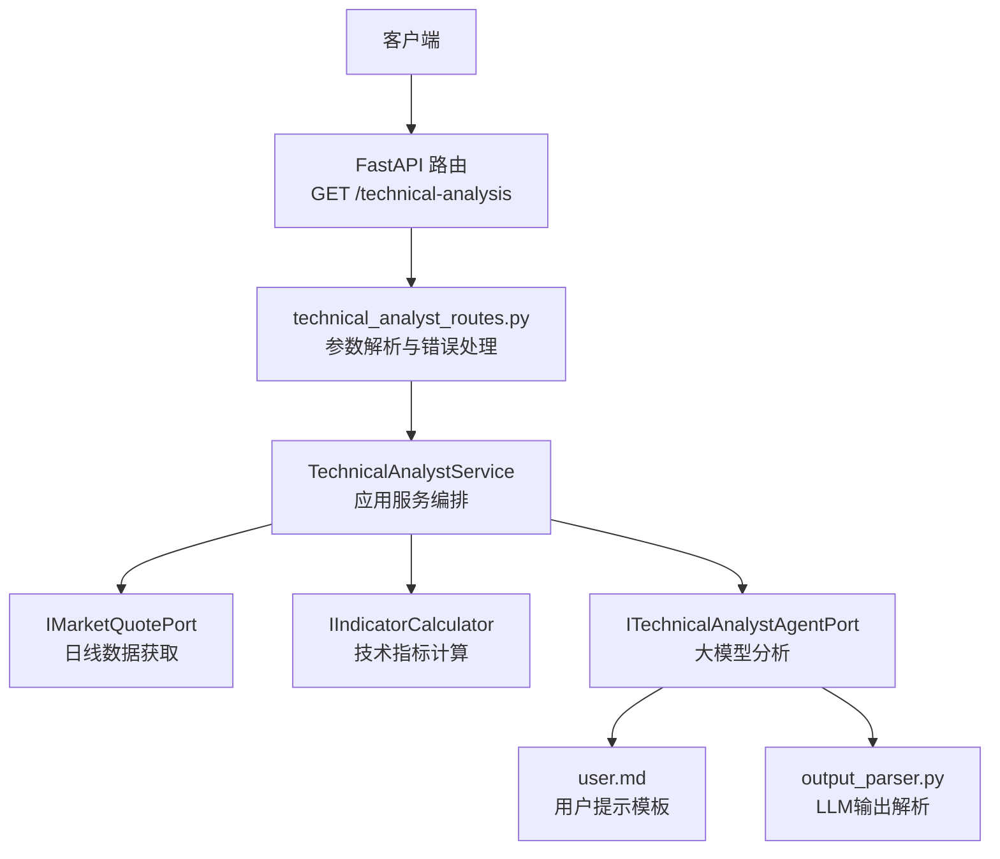
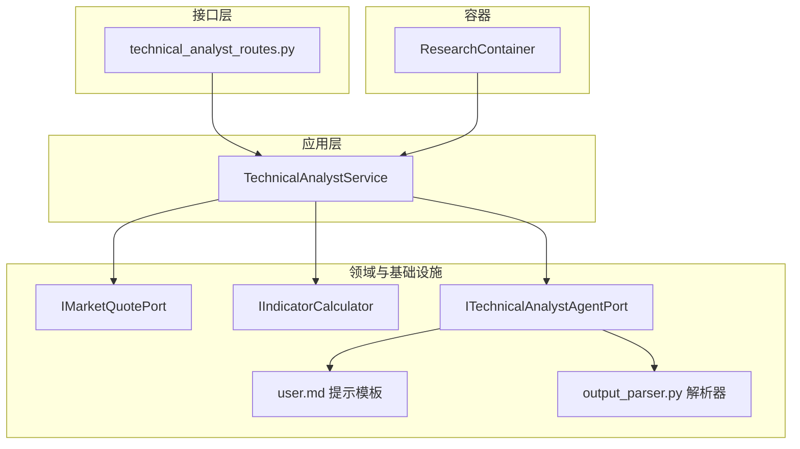
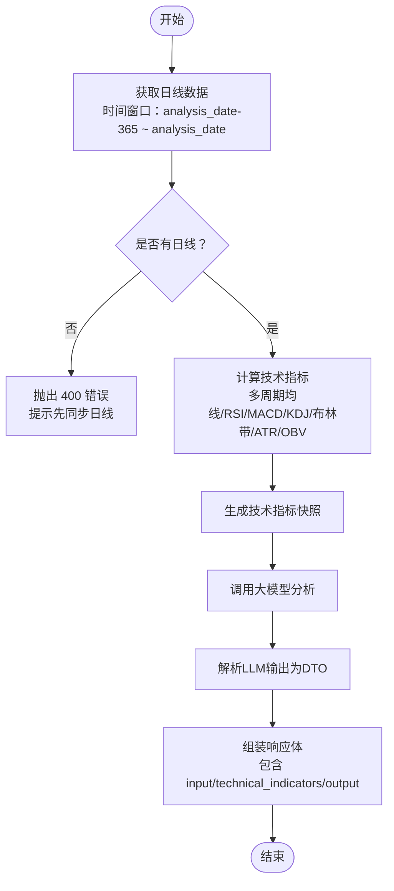
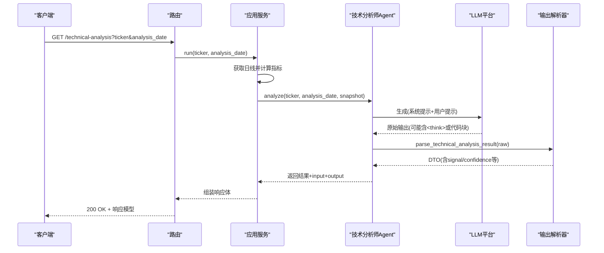
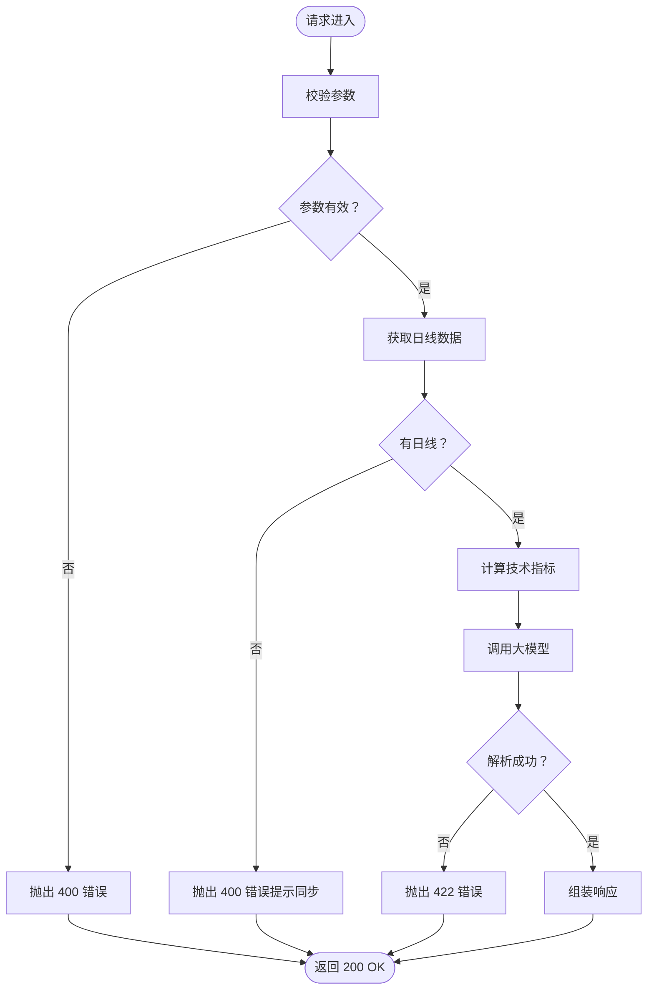
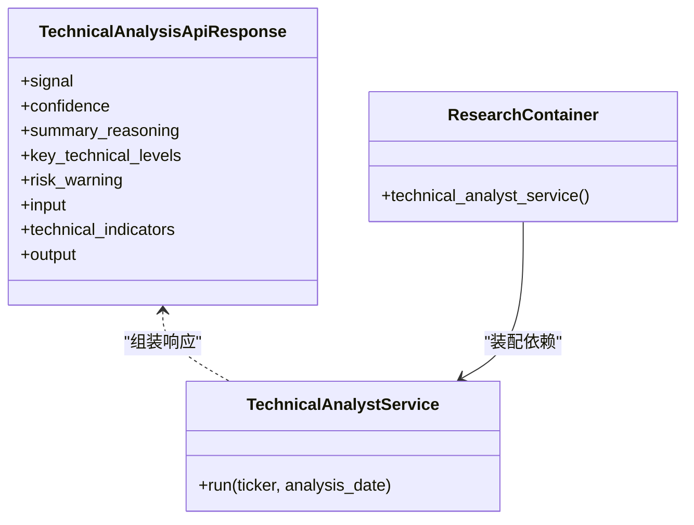

# 技术分析师API

<cite>
**本文档引用的文件**
- [src/api/routes.py](file://src/api/routes.py)
- [src/modules/research/presentation/rest/technical_analyst_routes.py](file://src/modules/research/presentation/rest/technical_analyst_routes.py)
- [src/modules/research/application/technical_analyst_service.py](file://src/modules/research/application/technical_analyst_service.py)
- [src/modules/research/container.py](file://src/modules/research/container.py)
- [src/modules/research/domain/dtos/technical_analysis_dtos.py](file://src/modules/research/domain/dtos/technical_analysis_dtos.py)
- [src/modules/research/infrastructure/indicators/calculator.py](file://src/modules/research/infrastructure/indicators/calculator.py)
- [src/modules/research/infrastructure/agents/technical_analyst/prompts/user.md](file://src/modules/research/infrastructure/agents/technical_analyst/prompts/user.md)
- [src/modules/research/infrastructure/agents/technical_analyst/output_parser.py](file://src/modules/research/infrastructure/agents/technical_analyst/output_parser.py)
- [tests/research/application/test_technical_analyst_service.py](file://tests/research/application/test_technical_analyst_service.py)
- [tests/research/agents/technical_analyst/test_output_parser.py](file://tests/research/agents/technical_analyst/test_output_parser.py)
- [openspec/specs/research-technical-analyst/spec.md](file://openspec/specs/research-technical-analyst/spec.md)
</cite>

## 目录
1. [简介](#简介)
2. [项目结构](#项目结构)
3. [核心组件](#核心组件)
4. [架构概览](#架构概览)
5. [详细组件分析](#详细组件分析)
6. [依赖关系分析](#依赖关系分析)
7. [性能考虑](#性能考虑)
8. [故障排除指南](#故障排除指南)
9. [结论](#结论)
10. [附录](#附录)

## 简介
本文件为技术分析师API的详细接口文档，面向使用者与技术分析师，重点说明GET /technical-analysis端点的功能、输入参数、技术指标计算过程、输出格式以及错误处理机制。该接口基于证据驱动的CMT标准流程，结合日线数据与技术指标，通过大模型生成客观、可追溯的技术面观点。

## 项目结构
技术分析师API位于研究模块的REST层，通过FastAPI路由暴露，依赖研究模块的Application Service与基础设施适配器完成数据获取、指标计算与大模型分析。

**图表来源**
- [src/modules/research/presentation/rest/technical_analyst_routes.py](file://src/modules/research/presentation/rest/technical_analyst_routes.py#L48-L76)
- [src/modules/research/application/technical_analyst_service.py](file://src/modules/research/application/technical_analyst_service.py#L30-L72)
- [src/modules/research/container.py](file://src/modules/research/container.py#L66-L78)
- [src/modules/research/infrastructure/agents/technical_analyst/prompts/user.md](file://src/modules/research/infrastructure/agents/technical_analyst/prompts/user.md#L1-L49)
- [src/modules/research/infrastructure/agents/technical_analyst/output_parser.py](file://src/modules/research/infrastructure/agents/technical_analyst/output_parser.py#L64-L116)

**章节来源**
- [src/api/routes.py](file://src/api/routes.py#L1-L13)
- [src/modules/research/presentation/rest/technical_analyst_routes.py](file://src/modules/research/presentation/rest/technical_analyst_routes.py#L1-L77)

## 核心组件
- FastAPI路由与响应模型：定义查询参数、响应体结构与错误映射。
- 应用服务：编排日线获取、指标计算、大模型分析，组装最终响应。
- 技术指标计算：基于日线序列计算多周期均线、RSI、MACD、KDJ、布林带、ATR、OBV趋势等。
- 大模型分析与输出解析：加载提示模板，调用LLM，解析JSON并校验契约。
- 依赖注入容器：统一装配各端口与适配器。

**章节来源**
- [src/modules/research/presentation/rest/technical_analyst_routes.py](file://src/modules/research/presentation/rest/technical_analyst_routes.py#L30-L76)
- [src/modules/research/application/technical_analyst_service.py](file://src/modules/research/application/technical_analyst_service.py#L14-L72)
- [src/modules/research/infrastructure/indicators/calculator.py](file://src/modules/research/infrastructure/indicators/calculator.py#L210-L308)
- [src/modules/research/infrastructure/agents/technical_analyst/output_parser.py](file://src/modules/research/infrastructure/agents/technical_analyst/output_parser.py#L64-L116)
- [src/modules/research/container.py](file://src/modules/research/container.py#L66-L78)

## 架构概览
技术分析师API采用分层架构：路由层负责参数与错误处理，应用层编排业务流程，基础设施层提供数据与模型能力。容器负责依赖装配，确保模块间解耦。

**图表来源**
- [src/modules/research/presentation/rest/technical_analyst_routes.py](file://src/modules/research/presentation/rest/technical_analyst_routes.py#L48-L76)
- [src/modules/research/application/technical_analyst_service.py](file://src/modules/research/application/technical_analyst_service.py#L30-L72)
- [src/modules/research/container.py](file://src/modules/research/container.py#L66-L78)
- [src/modules/research/infrastructure/agents/technical_analyst/output_parser.py](file://src/modules/research/infrastructure/agents/technical_analyst/output_parser.py#L64-L116)

## 详细组件分析

### 接口定义与参数
- 端点：GET /technical-analysis
- 查询参数：
  - ticker：股票代码，必填
  - analysis_date：分析基准日，YYYY-MM-DD；不传则使用当前日期
- 响应模型字段：
  - signal：信号类型，枚举值 BULLISH/BEARISH/NEUTRAL
  - confidence：置信度，范围 0~1
  - summary_reasoning：简练分析摘要，必须引用输入指标数值
  - key_technical_levels：关键支撑/阻力位，包含 support 与 resistance
  - risk_warning：风险预警，说明观点失效条件
  - input：送入大模型的用户提示内容
  - technical_indicators：技术指标快照（用于填充提示）
  - output：大模型原始返回字符串

请求与响应示例（路径参考）：
- 请求示例：GET /technical-analysis?ticker=000001.SZ&analysis_date=2025-06-01
- 成功响应示例：见测试用例中的响应结构断言
  - [tests/research/application/test_technical_analyst_service.py](file://tests/research/application/test_technical_analyst_service.py#L75-L82)
- 错误响应示例：400/422/500（见“错误处理机制”）

**章节来源**
- [src/modules/research/presentation/rest/technical_analyst_routes.py](file://src/modules/research/presentation/rest/technical_analyst_routes.py#L48-L76)
- [src/modules/research/domain/dtos/technical_analysis_dtos.py](file://src/modules/research/domain/dtos/technical_analysis_dtos.py#L20-L42)

### 技术指标计算过程
应用服务在执行分析前会获取过去一年的日线数据，并计算如下指标：
- 均线系统：MA5、MA10、MA20、MA30、MA60、MA120、MA200
- 动量指标：RSI(14)、MACD(12,26,9)、KDJ(9,3,3)
- 波动率与通道：布林带(20,2)、ATR(14)
- 量能与资金：量比(Vol/MA5)、OBV 5日趋势
- 关键价位：近期支撑/阻力位、检测到的K线形态（空列表，待扩展）

计算实现与输出快照：
- 计算函数：基于日线序列实现多周期均线、RSI、MACD、KDJ、布林带、ATR、OBV趋势等
- 快照DTO：TechnicalIndicatorsSnapshot，包含上述指标的原始数值

**图表来源**
- [src/modules/research/application/technical_analyst_service.py](file://src/modules/research/application/technical_analyst_service.py#L44-L60)
- [src/modules/research/infrastructure/indicators/calculator.py](file://src/modules/research/infrastructure/indicators/calculator.py#L210-L308)
- [src/modules/research/infrastructure/agents/technical_analyst/output_parser.py](file://src/modules/research/infrastructure/agents/technical_analyst/output_parser.py#L64-L116)

**章节来源**
- [src/modules/research/application/technical_analyst_service.py](file://src/modules/research/application/technical_analyst_service.py#L30-L72)
- [src/modules/research/infrastructure/indicators/calculator.py](file://src/modules/research/infrastructure/indicators/calculator.py#L210-L308)

### 大模型分析与提示模板
- 提示模板：user.md，包含目标资产信息、硬数据事实（价格与趋势、动量、波动率与通道、量能与资金、关键价位）与分析任务要求。
- 输出约束：要求输出JSON，包含 signal、confidence、summary_reasoning、key_technical_levels、risk_warning。
- 输出解析：output_parser.py负责剥离<think>标签、Markdown代码块、解析JSON并校验Pydantic DTO。

**图表来源**
- [src/modules/research/presentation/rest/technical_analyst_routes.py](file://src/modules/research/presentation/rest/technical_analyst_routes.py#L65-L68)
- [src/modules/research/application/technical_analyst_service.py](file://src/modules/research/application/technical_analyst_service.py#L56-L72)
- [src/modules/research/infrastructure/agents/technical_analyst/prompts/user.md](file://src/modules/research/infrastructure/agents/technical_analyst/prompts/user.md#L1-L49)
- [src/modules/research/infrastructure/agents/technical_analyst/output_parser.py](file://src/modules/research/infrastructure/agents/technical_analyst/output_parser.py#L64-L116)

**章节来源**
- [src/modules/research/infrastructure/agents/technical_analyst/prompts/user.md](file://src/modules/research/infrastructure/agents/technical_analyst/prompts/user.md#L32-L49)
- [src/modules/research/infrastructure/agents/technical_analyst/output_parser.py](file://src/modules/research/infrastructure/agents/technical_analyst/output_parser.py#L64-L116)

### 输出字段语义说明
- signal（信号类型）：BULLISH（看多）、BEARISH（看空）、NEUTRAL（中性）
- confidence（置信度）：0~1之间的数值，冲突或背离时会相应降低
- summary_reasoning（技术分析摘要）：必须引用输入指标的具体数值作为证据
- key_technical_levels（关键支撑阻力位）：包含support与resistance两个数值
- risk_warning（风险警告）：说明观点失效的条件（如跌破某支撑或突破某阻力）
- input（用户提示）：送入大模型的提示内容（由代码填入）
- technical_indicators（技术指标快照）：指标原始数值（由代码填入）
- output（大模型原始输出）：LLM返回的字符串（由代码填入）

**章节来源**
- [src/modules/research/domain/dtos/technical_analysis_dtos.py](file://src/modules/research/domain/dtos/technical_analysis_dtos.py#L20-L42)
- [openspec/specs/research-technical-analyst/spec.md](file://openspec/specs/research-technical-analyst/spec.md#L75-L98)

### 错误处理机制
- 400 错误（参数错误）：
  - ticker或analysis_date缺失时抛出BadRequestException
  - 当指定区间无日线数据时抛出BadRequestException，提示先同步日线
- 422 错误（LLM解析失败）：
  - LLM输出非合法JSON、根节点非对象、字段校验失败时抛出LLMOutputParseError
  - 路由层捕获并返回422，detail包含错误摘要
- 500 错误（系统异常）：
  - 其他未预期异常记录日志并返回500

**图表来源**
- [src/modules/research/presentation/rest/technical_analyst_routes.py](file://src/modules/research/presentation/rest/technical_analyst_routes.py#L65-L76)
- [src/modules/research/application/technical_analyst_service.py](file://src/modules/research/application/technical_analyst_service.py#L39-L54)
- [src/modules/research/infrastructure/agents/technical_analyst/output_parser.py](file://src/modules/research/infrastructure/agents/technical_analyst/output_parser.py#L70-L115)

**章节来源**
- [src/modules/research/presentation/rest/technical_analyst_routes.py](file://src/modules/research/presentation/rest/technical_analyst_routes.py#L69-L76)
- [src/modules/research/application/technical_analyst_service.py](file://src/modules/research/application/technical_analyst_service.py#L48-L54)
- [src/modules/research/infrastructure/agents/technical_analyst/output_parser.py](file://src/modules/research/infrastructure/agents/technical_analyst/output_parser.py#L70-L115)

## 依赖关系分析
- 路由层依赖应用服务工厂方法，通过容器装配具体实现。
- 应用服务依赖三个端口：日线数据获取、指标计算、技术分析Agent。
- 容器负责将基础设施适配器注入应用服务，避免模块间直接依赖。

**图表来源**
- [src/modules/research/presentation/rest/technical_analyst_routes.py](file://src/modules/research/presentation/rest/technical_analyst_routes.py#L31-L44)
- [src/modules/research/application/technical_analyst_service.py](file://src/modules/research/application/technical_analyst_service.py#L14-L28)
- [src/modules/research/container.py](file://src/modules/research/container.py#L66-L78)

**章节来源**
- [src/modules/research/container.py](file://src/modules/research/container.py#L66-L78)

## 性能考虑
- 时间窗口：默认向前取365个交易日，确保指标稳定性与可比性。
- 指标计算复杂度：主要为线性扫描与滑动窗口，整体O(N)。
- I/O优化：日线数据获取与指标计算在应用层一次性完成，减少重复调用。
- 大模型调用：温度设置较低以提升确定性，避免不必要的重试。

[本节为通用性能讨论，无需列出具体文件来源]

## 故障排除指南
- 参数错误（400）：
  - 检查ticker与analysis_date是否提供且格式正确
  - 若提示“无日线数据”，先通过日线同步接口同步该标的日线
- LLM解析失败（422）：
  - 查看日志中“LLM原始输出”片段，确认输出是否为合法JSON
  - 确认输出包含signal/confidence/summary_reasoning/key_technical_levels/risk_warning
- 系统异常（500）：
  - 查看服务端异常日志，定位具体异常栈

**章节来源**
- [src/modules/research/presentation/rest/technical_analyst_routes.py](file://src/modules/research/presentation/rest/technical_analyst_routes.py#L69-L76)
- [src/modules/research/infrastructure/agents/technical_analyst/output_parser.py](file://src/modules/research/infrastructure/agents/technical_analyst/output_parser.py#L70-L115)

## 结论
技术分析师API通过清晰的输入契约、严谨的指标计算与可追溯的大模型分析，提供证据驱动的技术面观点。其响应体包含解析结果与辅助字段，便于进一步加工与可视化。错误处理覆盖参数、解析与系统异常场景，保障接口稳定性与可观测性。

[本节为总结性内容，无需列出具体文件来源]

## 附录

### 请求与响应示例（路径参考）
- 成功响应结构断言示例：
  - [tests/research/application/test_technical_analyst_service.py](file://tests/research/application/test_technical_analyst_service.py#L75-L82)
- 合法JSON解析测试：
  - [tests/research/agents/technical_analyst/test_output_parser.py](file://tests/research/agents/technical_analyst/test_output_parser.py#L15-L31)

### 输入契约与输出契约要点
- 输入契约（目标资产与预计算硬数据）：
  - 必填字段：ticker、analysis_date、current_price
  - 硬数据：趋势与均线、动量与震荡、量能、形态识别结果
- 输出契约（技术分析结果DTO）：
  - signal、confidence、summary_reasoning、key_technical_levels、risk_warning

**章节来源**
- [openspec/specs/research-technical-analyst/spec.md](file://openspec/specs/research-technical-analyst/spec.md#L27-L42)
- [openspec/specs/research-technical-analyst/spec.md](file://openspec/specs/research-technical-analyst/spec.md#L75-L98)
- [src/modules/research/domain/dtos/technical_analysis_dtos.py](file://src/modules/research/domain/dtos/technical_analysis_dtos.py#L20-L42)