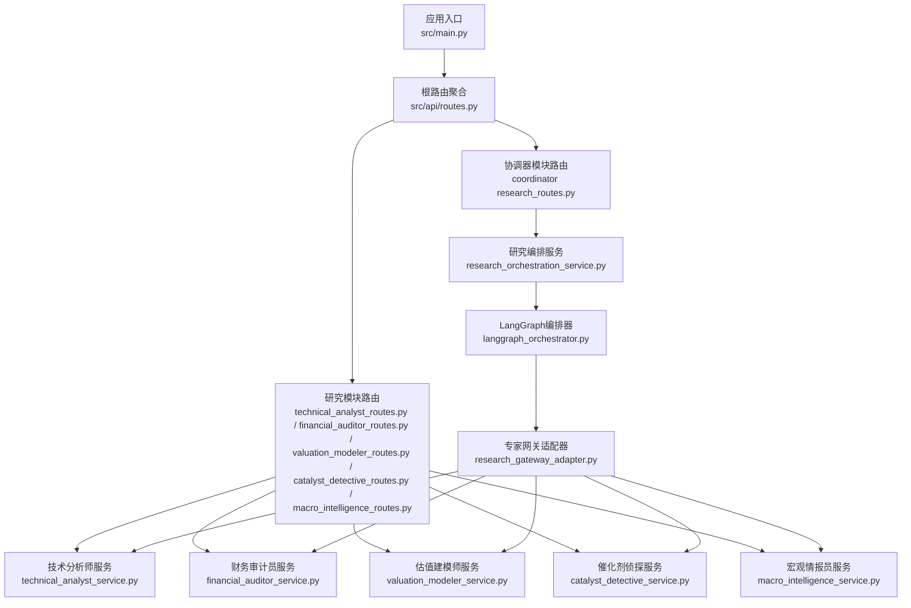
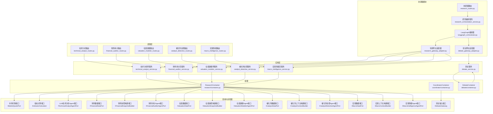
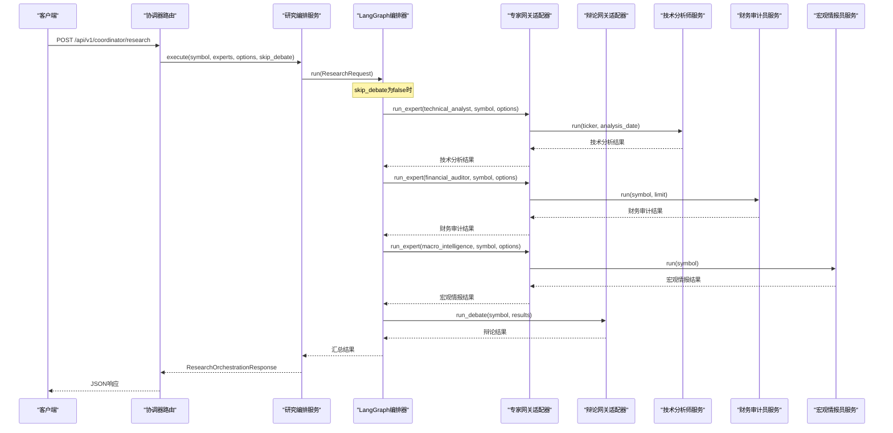
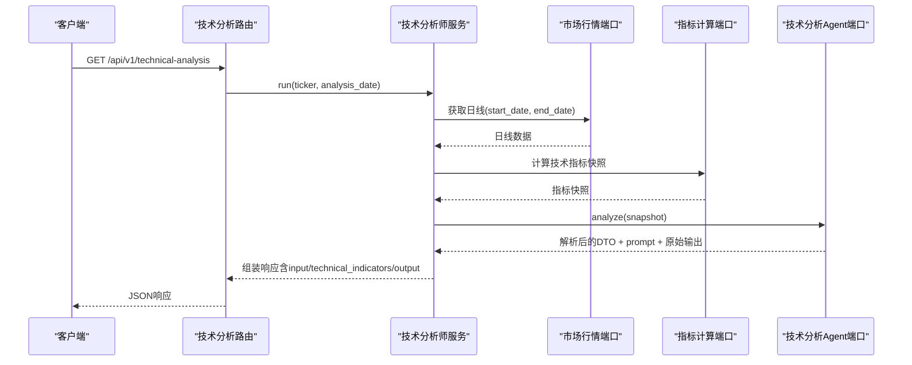
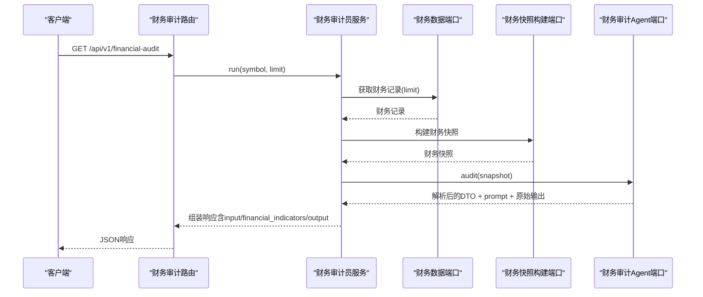
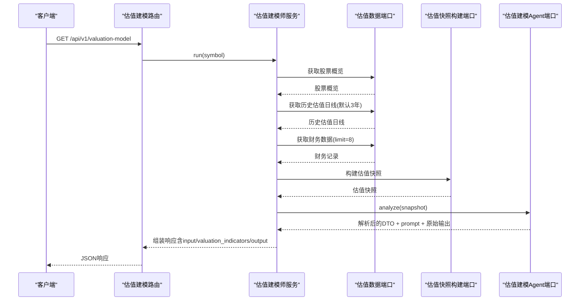
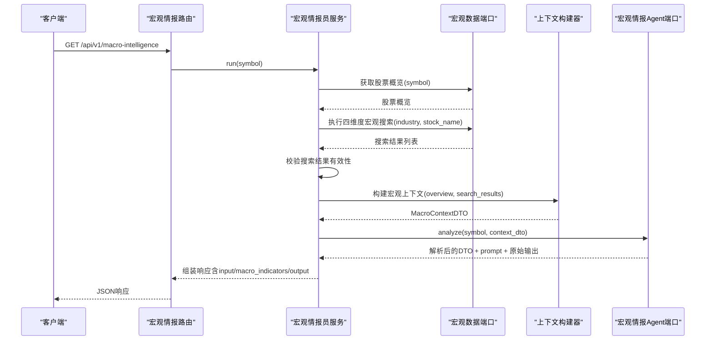
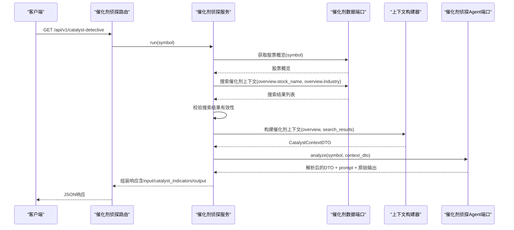
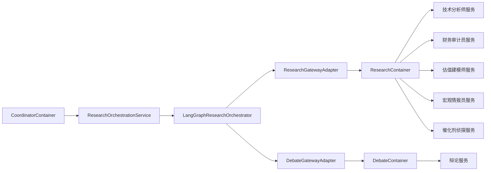

# 研究分析API

<cite>
**本文档引用的文件**
- [src/main.py](file://src/main.py)
- [src/api/routes.py](file://src/api/routes.py)
- [src/modules/coordinator/presentation/rest/research_routes.py](file://src/modules/coordinator/presentation/rest/research_routes.py)
- [src/modules/coordinator/application/research_orchestration_service.py](file://src/modules/coordinator/application/research_orchestration_service.py)
- [src/modules/coordinator/infrastructure/orchestration/langgraph_orchestrator.py](file://src/modules/coordinator/infrastructure/orchestration/langgraph_orchestrator.py)
- [src/modules/coordinator/infrastructure/adapters/research_gateway_adapter.py](file://src/modules/coordinator/infrastructure/adapters/research_gateway_adapter.py)
- [src/modules/coordinator/infrastructure/orchestration/graph_builder.py](file://src/modules/coordinator/infrastructure/orchestration/graph_builder.py)
- [src/modules/coordinator/infrastructure/orchestration/graph_state.py](file://src/modules/coordinator/infrastructure/orchestration/graph_state.py)
- [src/modules/coordinator/domain/dtos/research_dtos.py](file://src/modules/coordinator/domain/dtos/research_dtos.py)
- [src/modules/coordinator/domain/model/enums.py](file://src/modules/coordinator/domain/model/enums.py)
- [src/modules/coordinator/container.py](file://src/modules/coordinator/container.py)
- [src/modules/research/presentation/rest/technical_analyst_routes.py](file://src/modules/research/presentation/rest/technical_analyst_routes.py)
- [src/modules/research/presentation/rest/financial_auditor_routes.py](file://src/modules/research/presentation/rest/financial_auditor_routes.py)
- [src/modules/research/presentation/rest/valuation_modeler_routes.py](file://src/modules/research/presentation/rest/valuation_modeler_routes.py)
- [src/modules/research/presentation/rest/catalyst_detective_routes.py](file://src/modules/research/presentation/rest/catalyst_detective_routes.py)
- [src/modules/research/presentation/rest/macro_intelligence_routes.py](file://src/modules/research/presentation/rest/macro_intelligence_routes.py)
- [src/modules/research/application/technical_analyst_service.py](file://src/modules/research/application/technical_analyst_service.py)
- [src/modules/research/application/financial_auditor_service.py](file://src/modules/research/application/financial_auditor_service.py)
- [src/modules/research/application/valuation_modeler_service.py](file://src/modules/research/application/valuation_modeler_service.py)
- [src/modules/research/application/catalyst_detective_service.py](file://src/modules/research/application/catalyst_detective_service.py)
- [src/modules/research/application/macro_intelligence_service.py](file://src/modules/research/application/macro_intelligence_service.py)
- [src/modules/research/domain/dtos/technical_analysis_dtos.py](file://src/modules/research/domain/dtos/technical_analysis_dtos.py)
- [src/modules/research/domain/dtos/financial_dtos.py](file://src/modules/research/domain/dtos/financial_dtos.py)
- [src/modules/research/domain/dtos/valuation_dtos.py](file://src/modules/research/domain/dtos/valuation_dtos.py)
- [src/modules/research/domain/dtos/catalyst_dtos.py](file://src/modules/research/domain/dtos/catalyst_dtos.py)
- [src/modules/research/domain/dtos/catalyst_inputs.py](file://src/modules/research/domain/dtos/catalyst_inputs.py)
- [src/modules/research/domain/dtos/catalyst_context.py](file://src/modules/research/domain/dtos/catalyst_context.py)
- [src/modules/research/container.py](file://src/modules/research/container.py)
- [src/modules/research/infrastructure/adapters/catalyst_detective_agent_adapter.py](file://src/modules/research/infrastructure/adapters/catalyst_detective_agent_adapter.py)
- [src/modules/research/infrastructure/agents/catalyst_detective/prompts/system.md](file://src/modules/research/infrastructure/agents/catalyst_detective/prompts/system.md)
- [src/modules/research/infrastructure/agents/catalyst_detective/prompts/user.md](file://src/modules/research/infrastructure/agents/catalyst_detective/prompts/user.md)
- [openspec/specs/research-technical-analyst/spec.md](file://openspec/specs/research-technical-analyst/spec.md)
- [openspec/specs/coordinator-research-orchestration/spec.md](file://openspec/specs/coordinator-research-orchestration/spec.md)
- [openspec/specs/debate-bull-bear-engine/spec.md](file://openspec/specs/debate-bull-bear-engine/spec.md)
- [tests/coordinator/test_debate_node_and_skip_debate.py](file://tests/coordinator/test_debate_node_and_skip_debate.py)
</cite>

## 目录
1. [简介](#简介)
2. [项目结构](#项目结构)
3. [核心组件](#核心组件)
4. [架构总览](#架构总览)
5. [详细组件分析](#详细组件分析)
6. [依赖关系分析](#依赖关系分析)
7. [性能与并发](#性能与并发)
8. [故障排除指南](#故障排除指南)
9. [结论](#结论)
10. [附录](#附录)

## 简介
本文件为"研究分析API"的权威接口文档，面向六类专家角色：技术分析师、财务审计员、估值建模师、宏观情报员、催化剂侦探和协调器模块。文档涵盖每个专家的输入参数、分析逻辑、输出格式、请求/响应示例、调用频率限制与并发处理能力、性能考量以及AI辅助分析的最佳实践与结果解释指南。API基于FastAPI实现，采用端到端的依赖注入与适配器模式，确保跨模块协作清晰、可测试、可扩展。

**更新** 新增协调器模块提供的统一研究编排接口，支持并行执行多个专家分析。新增skip_debate选项，允许用户控制是否启用辩论阶段，提供更灵活的研究流程配置。

## 项目结构
研究分析API位于FastAPI应用的路由树中，通过统一的根路由聚合各模块路由。研究模块提供五类专家的REST接口，协调器模块提供统一的研究编排接口，分别对应技术分析、财务审计、估值建模、宏观情报和催化剂侦探。



**图表来源**
- [src/main.py](file://src/main.py#L1-L75)
- [src/api/routes.py](file://src/api/routes.py#L1-L15)
- [src/modules/coordinator/presentation/rest/research_routes.py](file://src/modules/coordinator/presentation/rest/research_routes.py#L1-L124)
- [src/modules/coordinator/application/research_orchestration_service.py](file://src/modules/coordinator/application/research_orchestration_service.py#L1-L76)
- [src/modules/coordinator/infrastructure/orchestration/langgraph_orchestrator.py](file://src/modules/coordinator/infrastructure/orchestration/langgraph_orchestrator.py#L1-L101)
- [src/modules/coordinator/infrastructure/adapters/research_gateway_adapter.py](file://src/modules/coordinator/infrastructure/adapters/research_gateway_adapter.py#L1-L98)
- [src/modules/research/presentation/rest/technical_analyst_routes.py](file://src/modules/research/presentation/rest/technical_analyst_routes.py#L1-L77)
- [src/modules/research/presentation/rest/financial_auditor_routes.py](file://src/modules/research/presentation/rest/financial_auditor_routes.py#L1-L79)
- [src/modules/research/presentation/rest/valuation_modeler_routes.py](file://src/modules/research/presentation/rest/valuation_modeler_routes.py#L1-L80)
- [src/modules/research/presentation/rest/catalyst_detective_routes.py](file://src/modules/research/presentation/rest/catalyst_detective_routes.py#L1-L103)
- [src/modules/research/presentation/rest/macro_intelligence_routes.py](file://src/modules/research/presentation/rest/macro_intelligence_routes.py#L1-L114)

## 核心组件
- **协调器模块**：通过统一的POST /api/v1/coordinator/research接口接收研究请求，支持用户指定的专家列表（1-5个），基于LangGraph有向图按需并行调用对应的专家服务，汇总各专家结果后统一返回。新增skip_debate选项允许用户控制是否启用辩论阶段。
- **技术分析师服务**：接收股票代码与分析日期，拉取日线数据，计算技术指标快照，调用LLM生成证据驱动的技术面观点，并返回包含解析结果与prompt、指标快照、原始输出的完整响应。
- **财务审计员服务**：接收股票符号与期数上限，拉取财务记录，构建财务快照，调用LLM生成5D维度审计观点，并返回包含解析结果与prompt、财务指标快照、原始输出的完整响应。
- **估值建模师服务**：接收股票符号，获取股票概览、历史估值日线与财务数据，构建估值快照，调用LLM生成内在价值区间与判断，并返回包含解析结果与prompt、估值指标快照、原始输出的完整响应。
- **宏观情报员服务**：接收股票符号，获取股票概览与行业信息，执行四维度Web搜索，构建宏观上下文，调用LLM进行系统性扫描与评估，返回包含宏观环境判定、维度分析和置信度的完整响应。
- **催化剂侦探服务**：接收股票符号，获取股票概览与行业信息，执行多维度Web搜索，构建催化剂上下文，调用LLM进行系统性扫描与评估，返回包含正面/负面催化事件、维度分析和置信度的完整响应。

**章节来源**
- [src/modules/coordinator/presentation/rest/research_routes.py](file://src/modules/coordinator/presentation/rest/research_routes.py#L1-L124)
- [src/modules/coordinator/application/research_orchestration_service.py](file://src/modules/coordinator/application/research_orchestration_service.py#L1-L76)
- [src/modules/research/application/technical_analyst_service.py](file://src/modules/research/application/technical_analyst_service.py#L1-L73)
- [src/modules/research/application/financial_auditor_service.py](file://src/modules/research/application/financial_auditor_service.py#L1-L67)
- [src/modules/research/application/valuation_modeler_service.py](file://src/modules/research/application/valuation_modeler_service.py#L1-L94)
- [src/modules/research/application/macro_intelligence_service.py](file://src/modules/research/application/macro_intelligence_service.py#L1-L128)
- [src/modules/research/application/catalyst_detective_service.py](file://src/modules/research/application/catalyst_detective_service.py#L1-L88)

## 架构总览
研究分析API遵循Clean Architecture与依赖倒置原则，通过Domain Ports隔离业务编排与基础设施实现。协调器模块通过LangGraph实现专家的并行编排，研究模块提供独立的专家接口，容器负责装配跨模块依赖（数据工程模块与LLM平台），服务层仅依赖抽象端口，保证可替换性与可测试性。



**图表来源**
- [src/modules/coordinator/presentation/rest/research_routes.py](file://src/modules/coordinator/presentation/rest/research_routes.py#L1-L124)
- [src/modules/coordinator/application/research_orchestration_service.py](file://src/modules/coordinator/application/research_orchestration_service.py#L1-L76)
- [src/modules/coordinator/infrastructure/orchestration/langgraph_orchestrator.py](file://src/modules/coordinator/infrastructure/orchestration/langgraph_orchestrator.py#L1-L101)
- [src/modules/coordinator/infrastructure/adapters/research_gateway_adapter.py](file://src/modules/coordinator/infrastructure/adapters/research_gateway_adapter.py#L1-L98)
- [src/modules/coordinator/infrastructure/adapters/debate_gateway_adapter.py](file://src/modules/coordinator/infrastructure/adapters/debate_gateway_adapter.py#L1-L98)
- [src/modules/research/presentation/rest/technical_analyst_routes.py](file://src/modules/research/presentation/rest/technical_analyst_routes.py#L1-L77)
- [src/modules/research/presentation/rest/financial_auditor_routes.py](file://src/modules/research/presentation/rest/financial_auditor_routes.py#L1-L79)
- [src/modules/research/presentation/rest/valuation_modeler_routes.py](file://src/modules/research/presentation/rest/valuation_modeler_routes.py#L1-L80)
- [src/modules/research/presentation/rest/catalyst_detective_routes.py](file://src/modules/research/presentation/rest/catalyst_detective_routes.py#L1-L103)
- [src/modules/research/presentation/rest/macro_intelligence_routes.py](file://src/modules/research/presentation/rest/macro_intelligence_routes.py#L1-L114)

## 详细组件分析

### 协调器模块 - 统一研究编排API
- **接口路径**：POST /api/v1/coordinator/research
- **功能概述**：通过单一REST端点接收研究请求（标的+用户指定的专家列表+可选参数），基于LangGraph有向图按需并行调用研究模块对应的专家Application服务，汇总各专家结果后统一返回。支持skip_debate选项控制是否启用辩论阶段。
- **输入参数**
  - symbol: 股票代码，必填
  - experts: 专家类型列表，必填（支持1-5个专家）
  - options: 各专家可选参数，可选
  - skip_debate: 布尔值，可选，默认false。为true时跳过辩论阶段
- **专家类型**
  - technical_analyst: 技术分析师
  - financial_auditor: 财务审计员
  - valuation_modeler: 估值建模师
  - macro_intelligence: 宏观情报员
  - catalyst_detective: 催化剂侦探
- **输出字段**
  - symbol: 股票代码
  - overall_status: 整体状态（completed/partial/failed）
  - expert_results: 按专家类型分组的结果字典
  - debate_outcome: 辩论结果，skip_debate为true或辩论失败时为null
  - verdict: 裁决结果，skip_debate、辩论失败或裁决失败时为null

**更新** 新增skip_debate选项，允许用户控制是否启用辩论阶段。当skip_debate为true时，编排图将跳过辩论节点，直接返回专家分析结果。

请求示例
- POST /api/v1/coordinator/research
- 请求体：
```json
{
  "symbol": "000001.SZ",
  "experts": ["technical_analyst", "financial_auditor", "macro_intelligence"],
  "options": {
    "technical_analyst": {"analysis_date": "2025-04-01"},
    "financial_auditor": {"limit": 5}
  },
  "skip_debate": false
}
```

响应示例
```json
{
  "symbol": "000001.SZ",
  "overall_status": "completed",
  "expert_results": {
    "technical_analyst": {
      "status": "success",
      "data": {
        "signal": "BULLISH",
        "confidence": 0.85,
        "summary_reasoning": "RSI处于中性偏强区域，MACD形成金叉，短期均线向上排列，成交量温和放大。",
        "key_technical_levels": {"support": 15.2, "resistance": 17.8},
        "input": "用户提示模板（已填充）...",
        "technical_indicators": {"rsi": 62.3, "macd": 0.012, "ma": {"ma5": 16.8, "ma10": 16.5}},
        "output": "LLM原始输出..."
      },
      "error": null
    },
    "financial_auditor": {
      "status": "success",
      "data": {
        "financial_score": 78,
        "signal": "BULLISH",
        "confidence": 0.72,
        "summary_reasoning": "营收与净利润保持稳定增长，现金流状况良好，负债率处于合理区间。",
        "dimension_analyses": [
          {"dimension": "盈利能力", "score": 82, "assessment": "稳健", "key_findings": ["ROE稳步提升", "毛利率维持高位"]}
        ],
        "input": "用户提示模板（已填充）...",
        "financial_indicators": {"revenue_yoy": 0.08, "net_profit_yoy": 0.06, "roe": 0.15},
        "output": "LLM原始输出..."
      },
      "error": null
    },
    "macro_intelligence": {
      "status": "success",
      "data": {
        "macro_environment": "Favorable (有利)",
        "confidence_score": 0.85,
        "macro_summary": "当前货币政策宽松，产业政策支持银行发展，经济复苏预期增强。",
        "dimension_analyses": [
          {"dimension": "货币政策", "opportunities": ["降准降息预期"], "risks": []},
          {"dimension": "产业政策", "opportunities": ["金融支持实体经济"], "risks": []}
        ],
        "input": "用户提示模板（已填充）...",
        "macro_indicators": {"policy_environment": "...", "economic_indicators": "..."},
        "output": "LLM原始输出..."
      },
      "error": null
    }
  },
  "debate_outcome": {
    "direction": "BULLISH",
    "confidence": 0.88,
    "bull_case": {
      "core_thesis": "技术面与基本面共振，市场情绪改善",
      "supporting_arguments": ["技术指标走强", "财务状况稳健"],
      "acknowledged_risks": []
    },
    "bear_case": {
      "core_thesis": "宏观经济不确定性存在",
      "supporting_arguments": ["政策风险", "行业竞争"],
      "acknowledged_strengths": []
    },
    "risk_matrix": [],
    "key_disagreements": [],
    "conflict_resolution": "综合评估认为多头占优"
  },
  "verdict": {
    "final_direction": "BULLISH",
    "confidence": 0.88,
    "rationale": "技术面与基本面共振，风险可控"
  }
}
```

错误处理
- 400：缺少symbol或experts为空或含非法类型
- 500：全部专家执行失败
- 500：其他未预期异常



**图表来源**
- [src/modules/coordinator/presentation/rest/research_routes.py](file://src/modules/coordinator/presentation/rest/research_routes.py#L80-L124)
- [src/modules/coordinator/application/research_orchestration_service.py](file://src/modules/coordinator/application/research_orchestration_service.py#L21-L76)
- [src/modules/coordinator/infrastructure/orchestration/langgraph_orchestrator.py](file://src/modules/coordinator/infrastructure/orchestration/langgraph_orchestrator.py#L37-L101)
- [src/modules/coordinator/infrastructure/adapters/research_gateway_adapter.py](file://src/modules/coordinator/infrastructure/adapters/research_gateway_adapter.py#L56-L98)
- [src/modules/coordinator/infrastructure/adapters/debate_gateway_adapter.py](file://src/modules/coordinator/infrastructure/adapters/debate_gateway_adapter.py#L1-L98)

**章节来源**
- [src/modules/coordinator/presentation/rest/research_routes.py](file://src/modules/coordinator/presentation/rest/research_routes.py#L1-L124)
- [src/modules/coordinator/application/research_orchestration_service.py](file://src/modules/coordinator/application/research_orchestration_service.py#L1-L76)
- [src/modules/coordinator/infrastructure/orchestration/langgraph_orchestrator.py](file://src/modules/coordinator/infrastructure/orchestration/langgraph_orchestrator.py#L1-L101)
- [src/modules/coordinator/infrastructure/adapters/research_gateway_adapter.py](file://src/modules/coordinator/infrastructure/adapters/research_gateway_adapter.py#L1-L98)
- [src/modules/coordinator/domain/dtos/research_dtos.py](file://src/modules/coordinator/domain/dtos/research_dtos.py#L1-L40)
- [src/modules/coordinator/domain/model/enums.py](file://src/modules/coordinator/domain/model/enums.py#L1-L17)
- [openspec/specs/coordinator-research-orchestration/spec.md](file://openspec/specs/coordinator-research-orchestration/spec.md#L1-L439)

### 技术分析师API
- **接口路径**：GET /api/v1/technical-analysis
- **功能概述**：基于日线数据计算技术指标，调用LLM生成证据驱动的技术面观点，返回信号、置信度、关键价位与风险提示等。
- **输入参数**
  - ticker: 股票代码，必填
  - analysis_date: 分析基准日，YYYY-MM-DD；为空则使用当前日期
- **输出字段**
  - signal: 信号（BULLISH/BEARISH/NEUTRAL）
  - confidence: 置信度（0.0–1.0）
  - summary_reasoning: 简练分析逻辑（必须引用输入指标）
  - key_technical_levels: 支撑/阻力关键价位
  - risk_warning: 观点被证伪的关键点位描述
  - input: 送入LLM的user prompt（代码侧填充）
  - technical_indicators: 技术指标快照（代码侧填充）
  - output: LLM原始返回字符串（代码侧填充）

请求示例
- GET /api/v1/technical-analysis?ticker=000001.SZ&analysis_date=2025-04-01

响应示例
```json
{
  "signal": "BULLISH",
  "confidence": 0.85,
  "summary_reasoning": "RSI处于中性偏强区域，MACD形成金叉，短期均线向上排列，成交量温和放大。",
  "key_technical_levels": {
    "support": 15.2,
    "resistance": 17.8
  },
  "risk_warning": "若跌破14.8或RSI进入超卖区，视为转弱信号。",
  "input": "用户提示模板（已填充）...",
  "technical_indicators": {
    "rsi": 62.3,
    "macd": 0.012,
    "kdj": [82, 78],
    "obv": 12000000,
    "ma": {"ma5": 16.8, "ma10": 16.5, "ma20": 16.2},
    "adx": 24.1
  },
  "output": "LLM原始输出..."
}
```

错误处理
- 400：缺少ticker或analysis_date，或无日线数据
- 422：LLM输出解析失败
- 500：未知异常



**图表来源**
- [src/modules/research/presentation/rest/technical_analyst_routes.py](file://src/modules/research/presentation/rest/technical_analyst_routes.py#L48-L77)
- [src/modules/research/application/technical_analyst_service.py](file://src/modules/research/application/technical_analyst_service.py#L30-L73)

**章节来源**
- [src/modules/research/presentation/rest/technical_analyst_routes.py](file://src/modules/research/presentation/rest/technical_analyst_routes.py#L1-L77)
- [src/modules/research/application/technical_analyst_service.py](file://src/modules/research/application/technical_analyst_service.py#L1-L73)
- [src/modules/research/domain/dtos/technical_analysis_dtos.py](file://src/modules/research/domain/dtos/technical_analysis_dtos.py#L1-L42)

### 财务审计员API
- **接口路径**：GET /api/v1/financial-audit
- **功能概述**：基于财务指标数据构建快照，调用LLM生成证据驱动的5D维度审计观点。
- **输入参数**
  - symbol: 股票代码，必填
  - limit: 最近期数上限（1–20，默认5）
- **输出字段**
  - financial_score: 整体财务健康评分（0–100）
  - signal: 信号（STRONG_BULLISH/BULLISH/NEUTRAL/BEARISH/STRONG_BEARISH）
  - confidence: 置信度（0.0–1.0）
  - summary_reasoning: 审计逻辑摘要（必须引用输入财务指标）
  - dimension_analyses: 5D维度分析结果列表
  - key_risks: 主要风险标记
  - risk_warning: 评估被证伪的关键条件描述
  - input: 送入LLM的user prompt（代码侧填充）
  - financial_indicators: 财务指标快照（代码侧填充）
  - output: LLM原始返回字符串（代码侧填充）

请求示例
- GET /api/v1/financial-audit?symbol=000001.SZ&limit=5

响应示例
```json
{
  "financial_score": 78,
  "signal": "BULLISH",
  "confidence": 0.72,
  "summary_reasoning": "营收与净利润保持稳定增长，现金流状况良好，负债率处于合理区间。",
  "dimension_analyses": [
    {"dimension": "盈利能力", "score": 82, "assessment": "稳健", "key_findings": ["ROE稳步提升", "毛利率维持高位"]},
    {"dimension": "运营效率", "score": 75, "assessment": "良好", "key_findings": ["应收账款周转天数下降"]},
    {"dimension": "偿债能力", "score": 88, "assessment": "稳健", "key_findings": ["流动比率高于行业均值"]},
    {"dimension": "成长潜力", "score": 70, "assessment": "一般", "key_findings": ["营收增速放缓"]},
    {"dimension": "现金流状况", "score": 85, "assessment": "良好", "key_findings": ["自由现金流为正"]},
  ],
  "key_risks": ["行业政策变化风险", "原材料价格波动"],
  "risk_warning": "若连续两季度营收负增长或流动比率跌破1.0，视为转弱信号。",
  "input": "用户提示模板（已填充）...",
  "financial_indicators": {
    "revenue_yoy": 0.08,
    "net_profit_yoy": 0.06,
    "roe": 0.15,
    "debt_to_asset": 0.35,
    "operating_cash_flow": 1200000000
  },
  "output": "LLM原始输出..."
}
```

错误处理
- 400：缺少symbol或无财务数据
- 422：LLM输出解析失败
- 500：未知异常



**图表来源**
- [src/modules/research/presentation/rest/financial_auditor_routes.py](file://src/modules/research/presentation/rest/financial_auditor_routes.py#L54-L79)
- [src/modules/research/application/financial_auditor_service.py](file://src/modules/research/application/financial_auditor_service.py#L33-L67)

**章节来源**
- [src/modules/research/presentation/rest/financial_auditor_routes.py](file://src/modules/research/presentation/rest/financial_auditor_routes.py#L1-L79)
- [src/modules/research/application/financial_auditor_service.py](file://src/modules/research/application/financial_auditor_service.py#L1-L67)
- [src/modules/research/domain/dtos/financial_dtos.py](file://src/modules/research/domain/dtos/financial_dtos.py#L1-L62)

### 估值建模师API
- **接口路径**：GET /api/v1/valuation-model
- **功能概述**：基于股票概览、历史估值日线与财务数据，构建估值快照，调用LLM生成内在价值区间与判断。
- **输入参数**
  - symbol: 股票代码，必填
- **输出字段**
  - valuation_verdict: 估值判断（Undervalued/Fair/Overvalued）
  - confidence_score: 置信度（0.0–1.0）
  - estimated_intrinsic_value_range: 内在价值区间（含保守与乐观上下界及推导依据）
  - key_evidence: 证据列表（必须引用输入数据中的具体数值）
  - risk_factors: 风险列表
  - reasoning_summary: 专业精炼总结（明确指出是机会还是陷阱）
  - input: 送入LLM的user prompt（代码侧填充）
  - valuation_indicators: 估值指标快照（代码侧填充）
  - output: LLM原始返回字符串（代码侧填充）

请求示例
- GET /api/v1/valuation-model?symbol=000001.SZ

响应示例
```json
{
  "valuation_verdict": "Undervalued (低估)",
  "confidence_score": 0.88,
  "estimated_intrinsic_value_range": {
    "lower_bound": "基于Graham模型推导的18.5元（历史平均回报率与当前盈利预期）",
    "upper_bound": "基于DCF模型推导的24.3元（WACC与永续增长率假设）"
  },
  "key_evidence": [
    "当前PE为12倍，历史均值为18倍",
    "ROE稳定在15%以上，显著高于WACC",
    "自由现金流折现值合计为18.2亿元"
  ],
  "risk_factors": [
    "宏观经济不确定性",
    "行业竞争加剧",
    "管理层治理风险"
  ],
  "reasoning_summary": "综合模型显示当前股价显著低于内在价值，具备安全边际，但需关注宏观经济与行业风险。",
  "input": "用户提示模板（已填充）...",
  "valuation_indicators": {
    "pe": 12.1,
    "pcf": 1.8,
    "ps": 1.2,
    "roe": 0.15,
    "wacc": 0.09,
    "free_cash_flow": 1200000000
  },
  "output": "LLM原始输出..."
}
```

错误处理
- 400：缺少symbol或无数据
- 422：LLM输出解析失败
- 500：未知异常



**图表来源**
- [src/modules/research/presentation/rest/valuation_modeler_routes.py](file://src/modules/research/presentation/rest/valuation_modeler_routes.py#L56-L80)
- [src/modules/research/application/valuation_modeler_service.py](file://src/modules/research/application/valuation_modeler_service.py#L37-L94)

**章节来源**
- [src/modules/research/presentation/rest/valuation_modeler_routes.py](file://src/modules/research/presentation/rest/valuation_modeler_routes.py#L1-L80)
- [src/modules/research/application/valuation_modeler_service.py](file://src/modules/research/application/valuation_modeler_service.py#L1-L94)
- [src/modules/research/domain/dtos/valuation_dtos.py](file://src/modules/research/domain/dtos/valuation_dtos.py#L1-L64)

### 宏观情报员API
- **接口路径**：GET /api/v1/macro-intelligence
- **功能概述**：基于股票所属行业，通过Web搜索获取四维度宏观情报（货币政策、产业政策、宏观经济、行业景气），调用LLM生成证据驱动的宏观环境评估。
- **输入参数**
  - symbol: 股票代码，必填
- **输出字段**
  - macro_environment: 宏观环境综合判定（Favorable/Neutral/Unfavorable）
  - confidence_score: 置信度（0.0–1.0）
  - macro_summary: 宏观环境综合判断
  - dimension_analyses: 四维分析列表
  - key_opportunities: 宏观机会列表
  - key_risks: 宏观风险列表
  - information_sources: 信息来源URL列表
  - input: 送入LLM的user prompt（代码侧填充）
  - macro_indicators: 宏观上下文快照（代码侧填充）
  - output: LLM原始返回字符串（代码侧填充）

请求示例
- GET /api/v1/macro-intelligence?symbol=000001.SZ

响应示例
```json
{
  "macro_environment": "Favorable (有利)",
  "confidence_score": 0.85,
  "macro_summary": "当前货币政策宽松，产业政策支持银行发展，经济复苏预期增强。",
  "dimension_analyses": [
    {
      "dimension": "货币政策",
      "opportunities": ["降准降息预期"],
      "risks": []
    },
    {
      "dimension": "产业政策",
      "opportunities": ["金融支持实体经济"],
      "risks": []
    },
    {
      "dimension": "宏观经济",
      "opportunities": ["PMI回升", "通胀温和"],
      "risks": ["地缘政治风险"]
    },
    {
      "dimension": "行业景气",
      "opportunities": ["银行业绩改善预期"],
      "risks": ["监管政策变化"]
    }
  ],
  "key_opportunities": ["降准降息预期", "金融支持实体经济", "银行业绩改善预期"],
  "key_risks": ["地缘政治风险", "监管政策变化"],
  "information_sources": ["https://www.example.com/policy/20250401", "https://www.example.com/economy/20250401"],
  "input": "用户提示模板（已填充）...",
  "macro_indicators": {
    "policy_environment": "当前货币政策宽松，流动性充裕",
    "economic_indicators": "PMI 52.1，通胀温和",
    "industry_conditions": "银行业绩改善预期"
  },
  "output": "LLM原始输出..."
}
```

错误处理
- 400：缺少symbol或标的不存在，或宏观搜索全部失败
- 422：LLM输出解析失败
- 500：未知异常



**图表来源**
- [src/modules/research/presentation/rest/macro_intelligence_routes.py](file://src/modules/research/presentation/rest/macro_intelligence_routes.py#L81-L114)
- [src/modules/research/application/macro_intelligence_service.py](file://src/modules/research/application/macro_intelligence_service.py#L50-L128)

**章节来源**
- [src/modules/research/presentation/rest/macro_intelligence_routes.py](file://src/modules/research/presentation/rest/macro_intelligence_routes.py#L1-L114)
- [src/modules/research/application/macro_intelligence_service.py](file://src/modules/research/application/macro_intelligence_service.py#L1-L128)

### 催化剂侦探API
- **接口路径**：GET /api/v1/catalyst-detective
- **功能概述**：基于多维度Web搜索结果，对目标个股进行全面的催化剂扫描与评估，识别正面和负面催化事件，提供系统性分析报告。
- **输入参数**
  - symbol: 股票代码，必填
- **输出字段**
  - stock_name: 股票名称
  - symbol: 股票代码
  - catalyst_assessment: 综合评估（Positive (正面催化)/Neutral (中性)/Negative (负面催化)）
  - confidence_score: 置信度（0.0–1.0）
  - catalyst_summary: 催化剂综合评估摘要
  - dimension_analyses: 四维分析结果列表
  - positive_catalysts: 正面催化事件列表
  - negative_catalysts: 负面催化事件列表
  - information_sources: 信息来源URL列表
  - input: 用户提示模板（调试用）
  - output: LLM原始返回字符串（调试用）
  - catalyst_indicators: 催化剂上下文（调试用）

请求示例
- GET /api/v1/catalyst-detective?symbol=000001.SZ

响应示例
```json
{
  "stock_name": "平安银行",
  "symbol": "000001.SZ",
  "catalyst_assessment": "Positive (正面催化)",
  "confidence_score": 0.85,
  "catalyst_summary": "公司近期获得监管批准的重大资产重组方案，行业政策支持叠加市场情绪改善，预计将推动股价上行。",
  "dimension_analyses": [
    {
      "dimension": "公司重大事件与动态",
      "score": 85,
      "assessment": "积极",
      "key_findings": ["获得监管批准的重大资产重组方案", "管理层变动带来新的发展思路"]
    },
    {
      "dimension": "行业催化与竞争格局",
      "score": 70,
      "assessment": "中性偏积极",
      "key_findings": ["行业政策支持银行发展", "主要竞争对手出现经营问题"]
    },
    {
      "dimension": "市场情绪与机构动向",
      "score": 75,
      "assessment": "积极",
      "key_findings": ["机构评级普遍上调", "北向资金持续流入"]
    },
    {
      "dimension": "财报预期与业绩催化",
      "score": 80,
      "assessment": "积极",
      "key_findings": ["分析师上调盈利预期", "业绩预告显示利润增长"]
    }
  ],
  "positive_catalysts": [
    {
      "event": "获得监管批准的重大资产重组方案",
      "expected_impact": "显著利好，预计推动股价上行",
      "timeframe": "近期(1个月内)",
      "probability": "高"
    },
    {
      "event": "机构评级普遍上调",
      "expected_impact": "积极影响，吸引增量资金",
      "timeframe": "近期(1个月内)",
      "probability": "中"
    }
  ],
  "negative_catalysts": [
    {
      "event": "宏观经济不确定性",
      "expected_impact": "潜在下行压力",
      "timeframe": "中期(1-3个月)",
      "probability": "中"
    },
    {
      "event": "行业竞争加剧",
      "expected_impact": "可能影响利润率",
      "timeframe": "远期(3个月以上)",
      "probability": "低"
    }
  ],
  "information_sources": [
    "https://www.example.com/news/20250401",
    "https://www.example.com/report/20250401"
  ],
  "input": "用户提示模板（已填充）...",
  "output": "LLM原始输出...",
  "catalyst_indicators": "{\"stock_name\":\"平安银行\",\"third_code\":\"000001.SZ\",...}"
}
```

错误处理
- 400：缺少symbol或参数无效
- 404：股票不存在
- 422：LLM输出解析失败
- 500：未知异常



**图表来源**
- [src/modules/research/presentation/rest/catalyst_detective_routes.py](file://src/modules/research/presentation/rest/catalyst_detective_routes.py#L56-L103)
- [src/modules/research/application/catalyst_detective_service.py](file://src/modules/research/application/catalyst_detective_service.py#L40-L88)

**章节来源**
- [src/modules/research/presentation/rest/catalyst_detective_routes.py](file://src/modules/research/presentation/rest/catalyst_detective_routes.py#L1-L103)
- [src/modules/research/application/catalyst_detective_service.py](file://src/modules/research/application/catalyst_detective_service.py#L1-L88)
- [src/modules/research/domain/dtos/catalyst_dtos.py](file://src/modules/research/domain/dtos/catalyst_dtos.py#L1-L54)
- [src/modules/research/domain/dtos/catalyst_inputs.py](file://src/modules/research/domain/dtos/catalyst_inputs.py#L1-L36)
- [src/modules/research/domain/dtos/catalyst_context.py](file://src/modules/research/domain/dtos/catalyst_context.py#L1-L19)
- [src/modules/research/infrastructure/adapters/catalyst_detective_agent_adapter.py](file://src/modules/research/infrastructure/adapters/catalyst_detective_agent_adapter.py#L1-L81)
- [src/modules/research/infrastructure/agents/catalyst_detective/prompts/system.md](file://src/modules/research/infrastructure/agents/catalyst_detective/prompts/system.md#L1-L98)
- [src/modules/research/infrastructure/agents/catalyst_detective/prompts/user.md](file://src/modules/research/infrastructure/agents/catalyst_detective/prompts/user.md#L1-L49)

## 依赖关系分析
- **协调器模块**：通过CoordinatorContainer统一装配依赖，包括ResearchGatewayAdapter、DebateGatewayAdapter、LangGraphResearchOrchestrator和ResearchOrchestrationService。新增DebateGatewayAdapter用于处理辩论阶段。
- **专家网关适配器**：通过ResearchContainer调用研究模块的专家服务，支持独立的AsyncSession以满足LangGraph并行执行的会话隔离要求。
- **依赖注入容器**：研究模块和协调器模块分别维护独立的容器，确保模块间的解耦和可测试性。
- **服务层仅依赖Domain端口**：协调器模块通过IResearchExpertGateway Port调用研究模块的专家服务，不直接依赖研究模块的具体实现。

**更新** 新增DebateGatewayAdapter，通过DebateContainer获取DebateService，实现辩论阶段的独立编排。



**图表来源**
- [src/modules/coordinator/container.py](file://src/modules/coordinator/container.py#L20-L49)
- [src/modules/coordinator/application/research_orchestration_service.py](file://src/modules/coordinator/application/research_orchestration_service.py#L18-L20)
- [src/modules/coordinator/infrastructure/orchestration/langgraph_orchestrator.py](file://src/modules/coordinator/infrastructure/orchestration/langgraph_orchestrator.py#L24-L26)
- [src/modules/coordinator/infrastructure/adapters/research_gateway_adapter.py](file://src/modules/coordinator/infrastructure/adapters/research_gateway_adapter.py#L25-L32)
- [src/modules/coordinator/infrastructure/adapters/debate_gateway_adapter.py](file://src/modules/coordinator/infrastructure/adapters/debate_gateway_adapter.py#L25-L32)
- [src/modules/research/container.py](file://src/modules/research/container.py#L1-L167)
- [src/modules/debate/container.py](file://src/modules/debate/container.py#L1-L167)

**章节来源**
- [src/modules/coordinator/container.py](file://src/modules/coordinator/container.py#L1-L49)
- [src/modules/coordinator/application/research_orchestration_service.py](file://src/modules/coordinator/application/research_orchestration_service.py#L1-L76)
- [src/modules/coordinator/infrastructure/adapters/research_gateway_adapter.py](file://src/modules/coordinator/infrastructure/adapters/research_gateway_adapter.py#L1-L98)
- [src/modules/coordinator/infrastructure/adapters/debate_gateway_adapter.py](file://src/modules/coordinator/infrastructure/adapters/debate_gateway_adapter.py#L1-L98)
- [src/modules/research/container.py](file://src/modules/research/container.py#L1-L167)
- [src/modules/debate/container.py](file://src/modules/debate/container.py#L1-L167)

## 性能与并发
- **协调器模块的并行执行**
  - 通过LangGraph的Send API实现动态fan-out，所有选定专家并行执行，互不阻塞。
  - 单个专家失败不会影响其他专家的执行，实现失败隔离与优雅降级。
  - 整体耗时接近最慢专家的耗时，而非各专家耗时之和。
- **skip_debate选项的性能优势**
  - 当skip_debate为true时，编排图跳过辩论节点，减少一次LLM调用和数据转换开销。
  - 适用于快速分析场景，用户不需要多空论证和冲突消解时可选择此选项。
- **调用频率限制**
  - 当前实现未内置速率限制策略。建议在网关或中间件层引入限流（如基于令牌桶或漏桶算法），针对协调器接口设置独立QPS阈值与配额周期，防止突发流量冲击LLM与下游数据源。
- **并发处理能力**
  - 协调器模块通过独立AsyncSession解决SQLAlchemy并发问题，每个专家调用使用独立会话。
  - 服务层方法均为异步实现，适合高并发场景；建议结合连接池与异步会话管理，控制数据库与外部API并发度，避免阻塞。
- **性能优化建议**
  - 指标计算与快照构建尽量复用缓存，减少重复计算。
  - LLM调用前严格校验输入，避免无效请求。
  - 对大体量响应（如技术/财务/估值指标快照）可按需裁剪字段，降低序列化开销。
  - 引入链路追踪与指标监控，定位慢查询与热点接口。

**更新** 新增skip_debate选项的性能考量，说明其在跳过辩论阶段时的性能优势。

## 故障排除指南
- **协调器模块错误**
  - 400：symbol为空、experts为空或含非法类型
  - 500：全部专家执行失败
  - 500：其他未预期异常
- **专家模块错误**
  - 400：技术分析师：ticker或analysis_date为空，或指定区间无日线数据；财务审计员：symbol为空，或无财务数据；估值建模师：symbol为空或不存在，或无财务数据；宏观情报员：symbol为空或标的不存在，或宏观搜索全部失败；催化剂侦探：symbol为空或参数无效。
  - 404：股票不存在：财务审计员和估值建模师在获取数据失败时抛出StockNotFoundError。
  - 422：LLM输出解析失败：Agent层抛出解析异常，系统记录原始输出并返回明确错误。
  - 500：未知异常：统一异常处理中间件捕获并记录日志，返回服务器错误。
- **skip_debate相关问题**
  - 当skip_debate为true时，debate_outcome和verdict字段应为null，这是预期行为。
  - 若skip_debate为false但返回null，检查辩论网关适配器是否正确装配。
- **建议排查步骤**
  - 确认输入参数格式与范围（日期、期数上限、股票代码）。
  - 检查数据工程模块是否已完成相应数据同步。
  - 查看日志中"LLM原始输出"以便复核Agent解析逻辑。
  - 对高频调用增加重试与退避策略，避免瞬时峰值。

**更新** 新增skip_debate相关故障排除指导。

**章节来源**
- [src/modules/coordinator/presentation/rest/research_routes.py](file://src/modules/coordinator/presentation/rest/research_routes.py#L105-L124)
- [src/modules/research/presentation/rest/technical_analyst_routes.py](file://src/modules/research/presentation/rest/technical_analyst_routes.py#L65-L77)
- [src/modules/research/presentation/rest/financial_auditor_routes.py](file://src/modules/research/presentation/rest/financial_auditor_routes.py#L68-L79)
- [src/modules/research/presentation/rest/valuation_modeler_routes.py](file://src/modules/research/presentation/rest/valuation_modeler_routes.py#L69-L80)
- [src/modules/research/presentation/rest/macro_intelligence_routes.py](file://src/modules/research/presentation/rest/macro_intelligence_routes.py#L105-L114)
- [src/modules/research/presentation/rest/catalyst_detective_routes.py](file://src/modules/research/presentation/rest/catalyst_detective_routes.py#L86-L103)

## 结论
研究分析API以Clean Architecture为核心，通过端口与适配器解耦业务与实现，确保六类专家接口的独立性与可维护性。新增的协调器模块通过统一的/研究接口提供并行专家执行能力，支持1-5个专家的任意组合，基于LangGraph实现动态fan-out并行执行，显著提升了分析效率。新增的skip_debate选项允许用户灵活控制是否启用辩论阶段，skip_debate为true时可跳过辩论节点，减少开销并加快响应速度。协调器模块的失败隔离机制确保单个专家失败不会影响整体执行，实现了优雅降级。接口设计强调证据驱动与可解释性，统一返回包含解析结果与prompt、指标快照、原始输出的响应体，便于审计与复盘。建议在生产环境中补充速率限制、缓存与可观测性方案，以保障稳定性与性能。

**更新** 新增skip_debate选项的功能说明，强调其在性能优化和用户体验方面的价值。

## 附录

### AI辅助分析最佳实践
- **Prompt内聚与占位符填充**：Prompt模板存放于资源文件，运行时以占位符形式注入输入数据，避免硬编码。
- **输出结构化**：统一使用Pydantic DTO进行解析与校验，解析失败时保留原始输出日志，便于回溯。
- **证据驱动**：分析结论必须引用输入中的具体数值，避免臆测；当指标冲突时明确指出并下调置信度。
- **结果解释指南**
  - 技术分析：关注信号、关键价位与风险提示，结合趋势与动量指标解读市场情绪。
  - 财务审计：关注5D维度评分与关键发现，识别潜在风险与改善空间。
  - 估值建模：关注内在价值区间与推导依据，结合安全边际判断投资机会。
  - 宏观情报：关注四维分析框架与政策环境，理解宏观经济对行业的整体影响。
  - 催化剂侦探：关注四维分析框架与具体事件，区分正面/负面催化因素及其概率和时间线。
  - 协调器编排：关注overall_status与各专家的独立结果，理解并行执行的优势与失败隔离机制。
  - **skip_debate选项**：根据分析需求选择是否启用辩论阶段，快速分析场景可选择跳过辩论以提升性能。

**更新** 新增skip_debate选项的最佳实践指导。

**章节来源**
- [openspec/specs/coordinator-research-orchestration/spec.md](file://openspec/specs/coordinator-research-orchestration/spec.md#L1-L439)
- [openspec/specs/debate-bull-bear-engine/spec.md](file://openspec/specs/debate-bull-bear-engine/spec.md#L1-L300)
- [src/modules/research/domain/dtos/technical_analysis_dtos.py](file://src/modules/research/domain/dtos/technical_analysis_dtos.py#L20-L42)
- [src/modules/research/domain/dtos/financial_dtos.py](file://src/modules/research/domain/dtos/financial_dtos.py#L25-L62)
- [src/modules/research/domain/dtos/valuation_dtos.py](file://src/modules/research/domain/dtos/valuation_dtos.py#L26-L64)
- [src/modules/research/domain/dtos/catalyst_dtos.py](file://src/modules/research/domain/dtos/catalyst_dtos.py#L29-L54)
- [src/modules/research/infrastructure/agents/catalyst_detective/prompts/system.md](file://src/modules/research/infrastructure/agents/catalyst_detective/prompts/system.md#L68-L98)