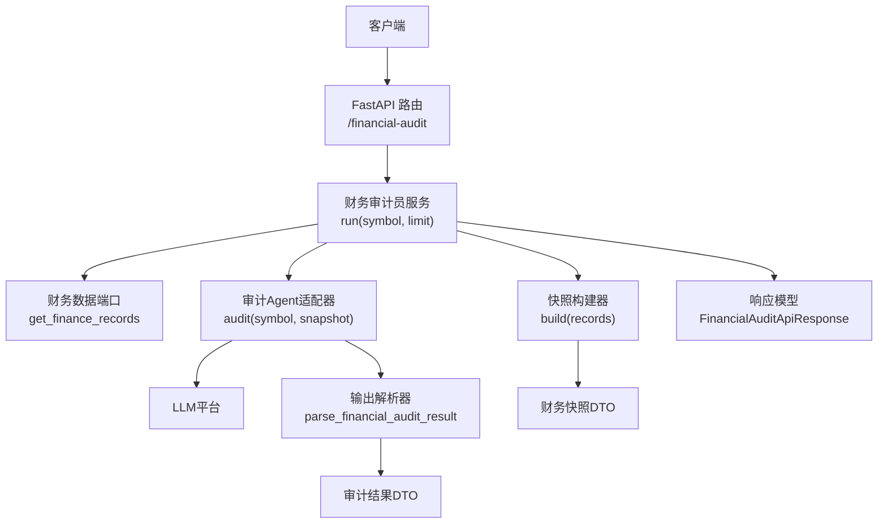
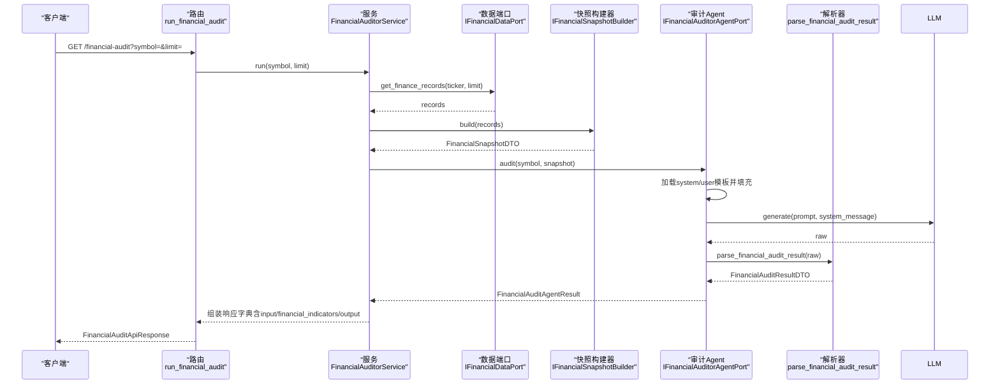
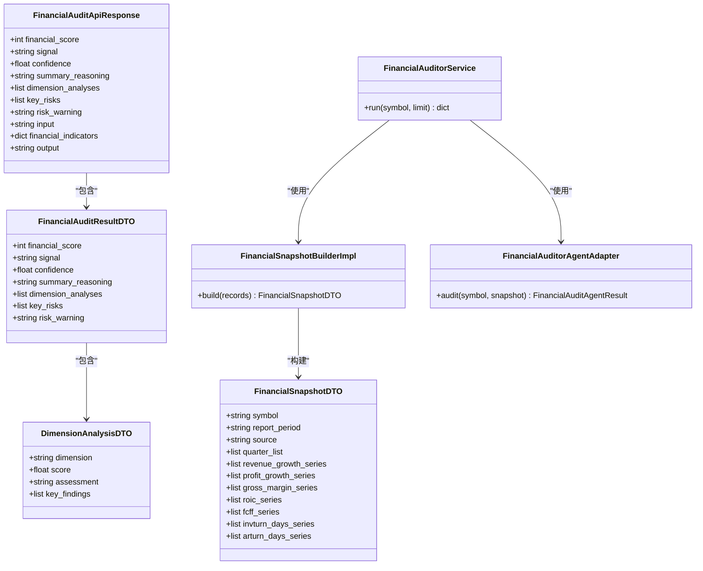
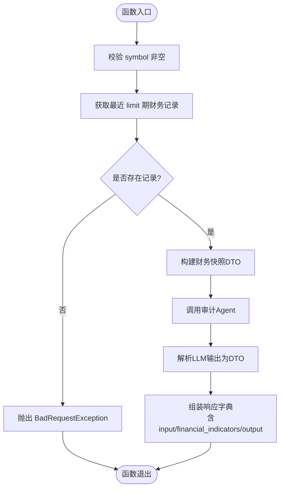

# 财务审计员API

<cite>
**本文档引用的文件**
- [src/modules/research/presentation/rest/financial_auditor_routes.py](file://src/modules/research/presentation/rest/financial_auditor_routes.py)
- [src/modules/research/application/financial_auditor_service.py](file://src/modules/research/application/financial_auditor_service.py)
- [src/modules/research/domain/dtos/financial_dtos.py](file://src/modules/research/domain/dtos/financial_dtos.py)
- [src/modules/research/domain/dtos/financial_snapshot.py](file://src/modules/research/domain/dtos/financial_snapshot.py)
- [src/modules/research/infrastructure/financial_snapshot/snapshot_builder.py](file://src/modules/research/infrastructure/financial_snapshot/snapshot_builder.py)
- [src/modules/research/infrastructure/adapters/financial_auditor_agent_adapter.py](file://src/modules/research/infrastructure/adapters/financial_auditor_agent_adapter.py)
- [src/modules/research/infrastructure/agents/financial_auditor/prompts/system.md](file://src/modules/research/infrastructure/agents/financial_auditor/prompts/system.md)
- [src/modules/research/infrastructure/agents/financial_auditor/prompts/user.md](file://src/modules/research/infrastructure/agents/financial_auditor/prompts/user.md)
- [src/modules/research/infrastructure/agents/financial_auditor/output_parser.py](file://src/modules/research/infrastructure/agents/financial_auditor/output_parser.py)
- [src/modules/research/container.py](file://src/modules/research/container.py)
- [src/modules/data_engineering/domain/model/financial_report.py](file://src/modules/data_engineering/domain/model/financial_report.py)
- [src/api/routes.py](file://src/api/routes.py)
- [src/main.py](file://src/main.py)
- [tests/research/application/test_financial_auditor_service.py](file://tests/research/application/test_financial_auditor_service.py)
- [tests/research/domain/test_financial_audit_dto.py](file://tests/research/domain/test_financial_audit_dto.py)
</cite>

## 目录
1. [简介](#简介)
2. [项目结构](#项目结构)
3. [核心组件](#核心组件)
4. [架构总览](#架构总览)
5. [详细组件分析](#详细组件分析)
6. [依赖关系分析](#依赖关系分析)
7. [性能考量](#性能考量)
8. [故障排查指南](#故障排查指南)
9. [结论](#结论)
10. [附录](#附录)

## 简介
本文件为“财务审计员API”的全面接口文档，面向财务审计员与数据消费方，定义了基于财务指标数据的HTTP接口规范，涵盖审计目标、数据来源、分析流程、指标计算、合规性检查、报告输出结构与质量保障机制。接口通过REST方式提供，支持对指定股票进行证据驱动的5D财务审计，输出包含整体评分、信号、维度分析、关键风险与风险预警，并附带输入prompt、财务指标快照与大模型原始输出，便于复核与溯源。

## 项目结构
财务审计相关能力位于“research”研究模块，采用分层与端口适配模式：
- 表现层：FastAPI路由，定义HTTP接口与响应模型
- 应用层：服务编排器，负责参数校验、数据获取、快照构建、调用审计Agent与组装响应
- 领域层：DTO与契约，约束输出结构与字段范围
- 基础设施层：快照构建器、审计Agent适配器、提示词加载与解析器
- 数据工程层：财务指标领域实体与查询端口，提供审计所需的历史与当期财务数据

图表来源
- [src/modules/research/presentation/rest/financial_auditor_routes.py](file://src/modules/research/presentation/rest/financial_auditor_routes.py#L54-L78)
- [src/modules/research/application/financial_auditor_service.py](file://src/modules/research/application/financial_auditor_service.py#L33-L66)
- [src/modules/research/infrastructure/financial_snapshot/snapshot_builder.py](file://src/modules/research/infrastructure/financial_snapshot/snapshot_builder.py#L65-L175)
- [src/modules/research/infrastructure/adapters/financial_auditor_agent_adapter.py](file://src/modules/research/infrastructure/adapters/financial_auditor_agent_adapter.py#L28-L56)
- [src/modules/research/infrastructure/agents/financial_auditor/output_parser.py](file://src/modules/research/infrastructure/agents/financial_auditor/output_parser.py#L106-L129)

章节来源
- [src/modules/research/presentation/rest/financial_auditor_routes.py](file://src/modules/research/presentation/rest/financial_auditor_routes.py#L1-L79)
- [src/modules/research/application/financial_auditor_service.py](file://src/modules/research/application/financial_auditor_service.py#L1-L67)
- [src/modules/research/container.py](file://src/modules/research/container.py#L80-L92)

## 核心组件
- 财务审计接口
  - 方法：GET
  - 路径：/financial-audit
  - 查询参数：
    - symbol：股票代码，必填，如 000001.SZ
    - limit：取最近几期财务数据，默认5，范围[1,20]
  - 响应模型：FinancialAuditApiResponse，包含整体评分、信号、置信度、摘要推理、5D维度分析、关键风险、风险预警，以及input、financial_indicators、output三字段（由代码侧填充）

- 财务审计员服务
  - 职责：校验参数、获取财务记录、构建快照、调用审计Agent、组装响应
  - 异常：参数为空或无财务数据时抛出BadRequestException；LLM解析失败抛出LLMOutputParseError

- 快照构建器
  - 输入：多期FinanceRecordInput（按结束日期降序）
  - 输出：FinancialSnapshotDTO，包含当期关键指标与历史趋势序列，并计算派生指标与同比增速（不足时以N/A表示）

- 审计Agent适配器
  - 加载系统提示词与用户模板，填充快照为用户prompt，调用LLM生成，解析为审计结果DTO

- DTO与契约
  - FinancialAuditResultDTO：约束字段类型、范围与数量（5个维度分析、评分0-100、置信度0-1）
  - FinancialSnapshotDTO：与提示词模板占位符一一对应
  - FinancialAuditAgentResult：封装解析结果、原始输出与用户prompt

章节来源
- [src/modules/research/presentation/rest/financial_auditor_routes.py](file://src/modules/research/presentation/rest/financial_auditor_routes.py#L31-L78)
- [src/modules/research/application/financial_auditor_service.py](file://src/modules/research/application/financial_auditor_service.py#L17-L66)
- [src/modules/research/domain/dtos/financial_dtos.py](file://src/modules/research/domain/dtos/financial_dtos.py#L25-L61)
- [src/modules/research/domain/dtos/financial_snapshot.py](file://src/modules/research/domain/dtos/financial_snapshot.py#L10-L49)
- [src/modules/research/infrastructure/financial_snapshot/snapshot_builder.py](file://src/modules/research/infrastructure/financial_snapshot/snapshot_builder.py#L65-L175)
- [src/modules/research/infrastructure/adapters/financial_auditor_agent_adapter.py](file://src/modules/research/infrastructure/adapters/financial_auditor_agent_adapter.py#L28-L56)

## 架构总览
财务审计流程自上而下分为四层：表现层接收请求，应用层编排业务，基础设施层完成数据与模型交互，领域层约束输出契约。

图表来源
- [src/modules/research/presentation/rest/financial_auditor_routes.py](file://src/modules/research/presentation/rest/financial_auditor_routes.py#L60-L78)
- [src/modules/research/application/financial_auditor_service.py](file://src/modules/research/application/financial_auditor_service.py#L33-L66)
- [src/modules/research/infrastructure/adapters/financial_auditor_agent_adapter.py](file://src/modules/research/infrastructure/adapters/financial_auditor_agent_adapter.py#L35-L56)
- [src/modules/research/infrastructure/agents/financial_auditor/output_parser.py](file://src/modules/research/infrastructure/agents/financial_auditor/output_parser.py#L106-L129)

## 详细组件分析

### 接口定义与请求响应
- 接口路径：/financial-audit
- 方法：GET
- 查询参数：
  - symbol：股票代码，必填
  - limit：最近期数，默认5，范围[1,20]
- 响应字段（均来自服务组装，非LLM直接拼接）：
  - financial_score：整体财务健康评分，整数，范围[0,100]
  - signal：STRONG_BULLISH/BULLISH/NEUTRAL/BEARISH/STRONG_BEARISH
  - confidence：置信度，浮点数，范围[0.0,1.0]
  - summary_reasoning：摘要推理，需引用输入中的财务指标读数
  - dimension_analyses：5个维度分析，每个包含维度名、评分、简评、关键发现
  - key_risks：主要风险标记列表
  - risk_warning：评估被证伪的关键条件描述
  - input：送入大模型的用户prompt（代码侧填充）
  - financial_indicators：财务指标快照（代码侧填充）
  - output：大模型原始返回字符串（代码侧填充）

章节来源
- [src/modules/research/presentation/rest/financial_auditor_routes.py](file://src/modules/research/presentation/rest/financial_auditor_routes.py#L31-L78)
- [src/modules/research/domain/dtos/financial_dtos.py](file://src/modules/research/domain/dtos/financial_dtos.py#L25-L61)

### 数据来源与输入格式
- 数据来源：财务指标领域实体，来源于数据工程模块同步（如Tushare），实体包含盈利能力、营运能力、偿债能力、现金流、财务比率等丰富字段
- 输入格式要求：
  - symbol：非空字符串，建议使用标准市场代码（如 000001.SZ）
  - limit：正整数，建议[1,20]，用于控制分析的历史长度
- 快照构建：
  - 当期指标：取结束日期最新的记录
  - 历史序列：按结束日期降序排列，计算季度标签与同比增速（YOY），不足时以N/A填充
  - 派生指标：quality_ratio = OCFPS / EPS（EPS为0或None时为N/A）

章节来源
- [src/modules/data_engineering/domain/model/financial_report.py](file://src/modules/data_engineering/domain/model/financial_report.py#L6-L117)
- [src/modules/research/infrastructure/financial_snapshot/snapshot_builder.py](file://src/modules/research/infrastructure/financial_snapshot/snapshot_builder.py#L65-L175)
- [src/modules/research/domain/dtos/financial_snapshot.py](file://src/modules/research/domain/dtos/financial_snapshot.py#L10-L49)

### 分析流程与合规性检查
- 5D审计模型（必须严格遵循）：
  - 盈利含金量（Quality of Earnings）：Cash Test（OCFPS/EPS）、Core Profit Test（扣非净利）
  - 运营效率与造假侦测（Efficiency & Manipulation）：Choking Effect（存货周转天数）、Channel Stuffing（应收账款周转天数）
  - 资本回报与护城河（Returns & Moat）：ROIC引擎、毛利率趋势
  - 偿债与生存能力（Solvency & Liquidity）：FCF状态、债务墙（净债务、流动比率）
  - 成长加速度（Growth Momentum）：运营杠杆（利润增速快于营收）、营收质量（双位数增长）
- 评分协议（0-100）：
  - 90-100：超级复合增长者（强烈看多）
  - 75-89：高质量增长（看多）
  - 50-74：平庸（观望）
  - 30-49：高风险（谨慎/减仓）
  - 0-29：毒性/欺诈（强烈看空/做空）
- 合规性检查：
  - DTO字段范围与数量约束（评分0-100、置信度0-1、5个维度分析）
  - LLM输出必须为纯JSON对象，根节点为对象，字段齐全且符合契约
  - 解析失败抛出统一异常，便于前端与监控告警

章节来源
- [src/modules/research/infrastructure/agents/financial_auditor/prompts/system.md](file://src/modules/research/infrastructure/agents/financial_auditor/prompts/system.md#L11-L80)
- [src/modules/research/domain/dtos/financial_dtos.py](file://src/modules/research/domain/dtos/financial_dtos.py#L25-L61)
- [src/modules/research/infrastructure/agents/financial_auditor/output_parser.py](file://src/modules/research/infrastructure/agents/financial_auditor/output_parser.py#L106-L129)

### 报告输出结构与解读
- 整体财务健康评分与信号：用于快速判断投资倾向
- 摘要推理：必须引用输入中的具体指标数值，体现证据驱动
- 5D维度分析：每个维度包含评分、简评与关键发现，便于深入拆解
- 关键风险与风险预警：量化风险与触发条件，便于风控与回撤管理
- 附加字段（由代码填充）：
  - input：便于复核prompt与上下文
  - financial_indicators：便于二次加工与可视化
  - output：便于审计与合规审查

章节来源
- [src/modules/research/presentation/rest/financial_auditor_routes.py](file://src/modules/research/presentation/rest/financial_auditor_routes.py#L31-L51)
- [src/modules/research/domain/dtos/financial_dtos.py](file://src/modules/research/domain/dtos/financial_dtos.py#L51-L61)

### 请求与响应示例（路径指引）
- 示例A：成功响应（字段齐全）
  - 请求：GET /financial-audit?symbol=000001.SZ&limit=5
  - 响应：包含financial_score、signal、confidence、summary_reasoning、dimension_analyses、key_risks、risk_warning，以及input、financial_indicators、output
  - 参考路径：[示例响应字段定义](file://src/modules/research/presentation/rest/financial_auditor_routes.py#L31-L51)
- 示例B：无财务数据
  - 请求：GET /financial-audit?symbol=不存在.SZ&limit=5
  - 响应：HTTP 400，错误消息提示无财务数据，请先同步
  - 参考路径：[服务异常处理](file://src/modules/research/application/financial_auditor_service.py#L44-L49)
- 示例C：LLM解析失败
  - 请求：GET /financial-audit?symbol=000001.SZ&limit=5
  - 响应：HTTP 422，提示LLM输出解析失败
  - 参考路径：[路由异常映射](file://src/modules/research/presentation/rest/financial_auditor_routes.py#L71-L78)

### 财务数据验证规则与异常处理
- 参数验证：
  - symbol为空或仅空白字符：BadRequestException
  - 无财务记录：BadRequestException（提示先同步数据）
- DTO验证：
  - financial_score ∈ [0,100]，confidence ∈ [0.0,1.0]
  - dimension_analyses长度为5，每个维度score ∈ [0,100]
- LLM输出解析：
  - 根节点必须为对象；字段齐全且类型正确；否则抛出LLMOutputParseError
- 异常映射到HTTP状态码：
  - 400：参数/数据无效
  - 422：LLM输出解析失败
  - 500：未知异常

章节来源
- [tests/research/application/test_financial_auditor_service.py](file://tests/research/application/test_financial_auditor_service.py#L26-L65)
- [tests/research/domain/test_financial_audit_dto.py](file://tests/research/domain/test_financial_audit_dto.py#L63-L88)
- [src/modules/research/presentation/rest/financial_auditor_routes.py](file://src/modules/research/presentation/rest/financial_auditor_routes.py#L71-L78)
- [src/modules/research/infrastructure/agents/financial_auditor/output_parser.py](file://src/modules/research/infrastructure/agents/financial_auditor/output_parser.py#L106-L129)

### 审计质量保证措施
- 契约驱动：通过Pydantic DTO约束输出，确保字段完整性与范围
- 提示词标准化：系统提示词与用户模板固定，保证分析框架一致性
- 解析器健壮性：统一的JSON解析与错误汇总，便于定位问题
- 容器装配：通过ResearchContainer集中装配，避免跨模块直接依赖，提升可测试性与可维护性
- 测试覆盖：应用层与领域层均有单元测试，覆盖边界与异常场景

章节来源
- [src/modules/research/domain/dtos/financial_dtos.py](file://src/modules/research/domain/dtos/financial_dtos.py#L25-L61)
- [src/modules/research/infrastructure/agents/financial_auditor/prompts/system.md](file://src/modules/research/infrastructure/agents/financial_auditor/prompts/system.md#L51-L80)
- [src/modules/research/infrastructure/agents/financial_auditor/output_parser.py](file://src/modules/research/infrastructure/agents/financial_auditor/output_parser.py#L106-L129)
- [src/modules/research/container.py](file://src/modules/research/container.py#L80-L92)

## 依赖关系分析

图表来源
- [src/modules/research/presentation/rest/financial_auditor_routes.py](file://src/modules/research/presentation/rest/financial_auditor_routes.py#L31-L51)
- [src/modules/research/domain/dtos/financial_dtos.py](file://src/modules/research/domain/dtos/financial_dtos.py#L25-L61)
- [src/modules/research/domain/dtos/financial_snapshot.py](file://src/modules/research/domain/dtos/financial_snapshot.py#L10-L49)
- [src/modules/research/application/financial_auditor_service.py](file://src/modules/research/application/financial_auditor_service.py#L17-L32)
- [src/modules/research/infrastructure/financial_snapshot/snapshot_builder.py](file://src/modules/research/infrastructure/financial_snapshot/snapshot_builder.py#L65-L175)
- [src/modules/research/infrastructure/adapters/financial_auditor_agent_adapter.py](file://src/modules/research/infrastructure/adapters/financial_auditor_agent_adapter.py#L28-L56)

## 性能考量
- I/O瓶颈：财务数据查询与LLM调用为主要耗时点，建议：
  - 合理设置limit，避免过长历史导致提示词过长与解析开销增大
  - 使用缓存策略存储常用快照与解析结果（需在上层业务层实现）
- 批量与并发：接口为单标的查询，适合异步并发调用；注意LLM平台限流与重试
- 日志与可观测性：异常路径已记录详细日志，建议结合追踪ID定位问题

## 故障排查指南
- HTTP 400：检查symbol是否为空或格式错误；确认目标股票已完成财务数据同步
  - 参考：[参数校验与无数据拒绝](file://tests/research/application/test_financial_auditor_service.py#L26-L65)
- HTTP 422：LLM输出不符合JSON契约或字段校验失败
  - 参考：[输出解析与字段校验](file://src/modules/research/infrastructure/agents/financial_auditor/output_parser.py#L106-L129)
- HTTP 500：服务内部异常，查看后端日志
  - 参考：[路由异常映射](file://src/modules/research/presentation/rest/financial_auditor_routes.py#L76-L78)
- 响应字段缺失：确认服务版本与提示词模板未被修改；检查容器装配是否正确
  - 参考：[容器装配](file://src/modules/research/container.py#L80-L92)

章节来源
- [tests/research/application/test_financial_auditor_service.py](file://tests/research/application/test_financial_auditor_service.py#L26-L65)
- [src/modules/research/presentation/rest/financial_auditor_routes.py](file://src/modules/research/presentation/rest/financial_auditor_routes.py#L71-L78)
- [src/modules/research/infrastructure/agents/financial_auditor/output_parser.py](file://src/modules/research/infrastructure/agents/financial_auditor/output_parser.py#L106-L129)

## 结论
财务审计员API以证据驱动的5D模型为核心，结合快照构建与LLM解析，提供可复核、可追溯的财务健康评估。通过严格的DTO契约、提示词标准化与统一异常处理，确保输出质量与稳定性。建议在生产环境中配合缓存、限流与可观测性方案，持续优化响应时间与准确性。

## 附录

### API定义（路径指引）
- 路由注册：[路由聚合](file://src/api/routes.py#L8-L12)
- 主应用：[应用初始化与中间件](file://src/main.py#L14-L65)
- 接口定义：[GET /financial-audit](file://src/modules/research/presentation/rest/financial_auditor_routes.py#L54-L78)

### 关键流程图（算法实现）

图表来源
- [src/modules/research/application/financial_auditor_service.py](file://src/modules/research/application/financial_auditor_service.py#L33-L66)
- [src/modules/research/infrastructure/financial_snapshot/snapshot_builder.py](file://src/modules/research/infrastructure/financial_snapshot/snapshot_builder.py#L65-L175)
- [src/modules/research/infrastructure/adapters/financial_auditor_agent_adapter.py](file://src/modules/research/infrastructure/adapters/financial_auditor_agent_adapter.py#L35-L56)
- [src/modules/research/infrastructure/agents/financial_auditor/output_parser.py](file://src/modules/research/infrastructure/agents/financial_auditor/output_parser.py#L106-L129)