# 辩论REST API

<cite>
**本文档引用的文件**
- [README.md](file://README.md)
- [src/main.py](file://src/main.py)
- [src/api/routes.py](file://src/api/routes.py)
- [src/api/health.py](file://src/api/health.py)
- [src/api/middlewares/error_handler.py](file://src/api/middlewares/error_handler.py)
- [src/shared/config.py](file://src/shared/config.py)
- [src/modules/debate/presentation/rest/debate_router.py](file://src/modules/debate/presentation/rest/debate_router.py)
- [src/modules/debate/presentation/rest/debate_schemas.py](file://src/modules/debate/presentation/rest/debate_schemas.py)
- [src/modules/debate/application/services/debate_service.py](file://src/modules/debate/application/services/debate_service.py)
- [src/modules/debate/domain/dtos/debate_input.py](file://src/modules/debate/domain/dtos/debate_input.py)
- [src/modules/debate/container.py](file://src/modules/debate/container.py)
- [src/modules/judge/presentation/rest/judge_router.py](file://src/modules/judge/presentation/rest/judge_router.py)
- [src/modules/judge/presentation/rest/judge_schemas.py](file://src/modules/judge/presentation/rest/judge_schemas.py)
- [src/modules/judge/application/services/judge_service.py](file://src/modules/judge/application/services/judge_service.py)
- [src/modules/judge/application/dtos/verdict_dto.py](file://src/modules/judge/application/dtos/verdict_dto.py)
- [src/modules/judge/domain/dtos/judge_input.py](file://src/modules/judge/domain/dtos/judge_input.py)
- [src/modules/judge/domain/dtos/verdict_result.py](file://src/modules/judge/domain/dtos/verdict_result.py)
- [src/modules/judge/domain/ports/judge_verdict_agent.py](file://src/modules/judge/domain/ports/judge_verdict_agent.py)
- [src/modules/judge/infrastructure/adapters/judge_verdict_agent_adapter.py](file://src/modules/judge/infrastructure/adapters/judge_verdict_agent_adapter.py)
- [src/modules/judge/container.py](file://src/modules/judge/container.py)
- [src/modules/coordinator/presentation/rest/research_routes.py](file://src/modules/coordinator/presentation/rest/research_routes.py)
- [src/modules/coordinator/application/research_orchestration_service.py](file://src/modules/coordinator/application/research_orchestration_service.py)
- [src/modules/coordinator/infrastructure/adapters/judge_gateway_adapter.py](file://src/modules/coordinator/infrastructure/adapters/judge_gateway_adapter.py)
- [src/modules/coordinator/container.py](file://src/modules/coordinator/container.py)
</cite>

## 更新摘要
**变更内容**
- 新增裁决模块的完整API接口说明，包括/judge/verdict端点的详细使用方法
- 增加裁决响应结构的详细说明，包含完整的字段定义和约束
- 添加与研究编排模块的集成示例，展示端到端的工作流程
- 更新架构图以反映裁决模块在整个系统中的作用
- 增加实际的API调用示例和错误处理说明

## 目录
1. [简介](#简介)
2. [项目结构](#项目结构)
3. [核心组件](#核心组件)
4. [架构概览](#架构概览)
5. [详细组件分析](#详细组件分析)
6. [裁决模块API规范](#裁决模块api规范)
7. [端到端工作流程](#端到端工作流程)
8. [依赖关系分析](#依赖关系分析)
9. [性能考虑](#性能考虑)
10. [故障排除指南](#故障排除指南)
11. [结论](#结论)

## 简介

这是一个基于FastAPI构建的股票研究分析平台，专注于提供多专家协同的辩论和裁决能力。该系统通过REST API提供完整的投资决策支持，包括技术分析、宏观情报、财务审计等多个专业领域的专家分析，并通过智能辩论引擎整合不同观点，最终由裁决系统给出可执行的投资建议。

系统采用模块化设计，主要包含以下核心功能模块：
- **研究编排模块**：协调多个专家的并行分析工作
- **辩论模块**：实现多空观点的智能辩论和冲突解决
- **裁决模块**：基于辩论结果生成最终的投资决策
- **LLM平台模块**：提供大语言模型服务支持

## 项目结构

该项目采用清晰的分层架构设计，按照功能模块进行组织：

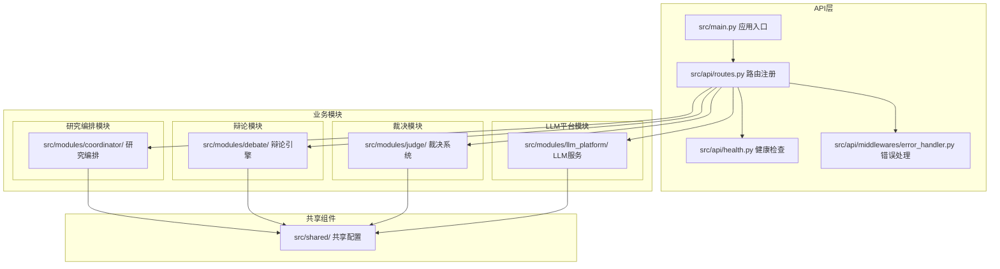

**图表来源**
- [src/main.py](file://src/main.py#L1-L75)
- [src/api/routes.py](file://src/api/routes.py#L1-L19)

**章节来源**
- [src/main.py](file://src/main.py#L1-L75)
- [src/api/routes.py](file://src/api/routes.py#L1-L19)

## 核心组件

### 应用入口与配置

应用使用FastAPI框架构建，具备完善的配置管理和中间件支持：

- **应用初始化**：设置项目名称、API版本、OpenAPI文档路径
- **CORS配置**：支持跨域资源共享，可配置允许的源
- **全局异常处理**：统一的错误响应格式
- **启动事件**：初始化调度器和LLM平台

### REST API路由结构

系统采用模块化的路由设计，每个功能模块都有独立的路由前缀：

```mermaid
graph LR
A[/api/v1/] --> B[健康检查]
A --> C[研究编排]
A --> D[辩论]
A --> E[裁决]
A --> F[LLM平台]
A --> G[数据工程]
C --> C1[/research]
D --> D1[/run]
E --> E1[/verdict]
F --> F1[/chat]
F --> F2[/config]
F --> F3[/search]
```

**图表来源**
- [src/api/routes.py](file://src/api/routes.py#L1-L19)

**章节来源**
- [src/shared/config.py](file://src/shared/config.py#L1-L68)
- [src/api/middlewares/error_handler.py](file://src/api/middlewares/error_handler.py#L1-L46)

## 架构概览

系统采用Clean Architecture设计模式，实现了清晰的分层分离：

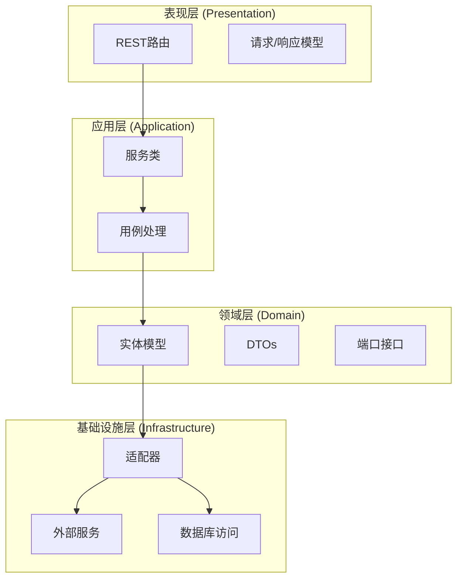

**图表来源**
- [src/modules/debate/application/services/debate_service.py](file://src/modules/debate/application/services/debate_service.py#L1-L67)
- [src/modules/judge/application/services/judge_service.py](file://src/modules/judge/application/services/judge_service.py#L1-L35)

## 详细组件分析

### 辩论模块

辩论模块是系统的核心组件，负责协调多空观点的智能辩论过程：

#### 核心流程

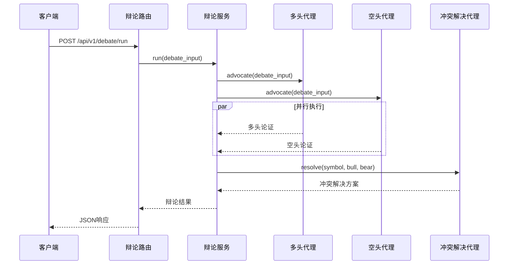

**图表来源**
- [src/modules/debate/presentation/rest/debate_router.py](file://src/modules/debate/presentation/rest/debate_router.py#L85-L124)
- [src/modules/debate/application/services/debate_service.py](file://src/modules/debate/application/services/debate_service.py#L35-L67)

#### 数据传输对象

辩论模块使用标准化的数据传输对象确保不同专家输出的一致性：

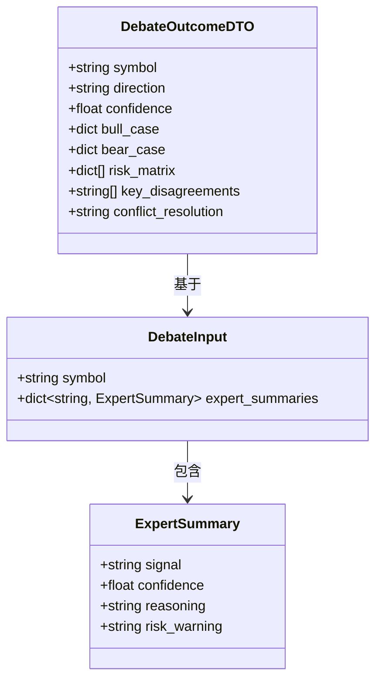

**图表来源**
- [src/modules/debate/domain/dtos/debate_input.py](file://src/modules/debate/domain/dtos/debate_input.py#L9-L28)
- [src/modules/debate/presentation/rest/debate_schemas.py](file://src/modules/debate/presentation/rest/debate_schemas.py#L19-L30)

**章节来源**
- [src/modules/debate/presentation/rest/debate_router.py](file://src/modules/debate/presentation/rest/debate_router.py#L1-L124)
- [src/modules/debate/application/services/debate_service.py](file://src/modules/debate/application/services/debate_service.py#L1-L67)
- [src/modules/debate/domain/dtos/debate_input.py](file://src/modules/debate/domain/dtos/debate_input.py#L1-L28)

### 研究编排模块

研究编排模块协调多个专家的并行分析工作：

#### 编排服务

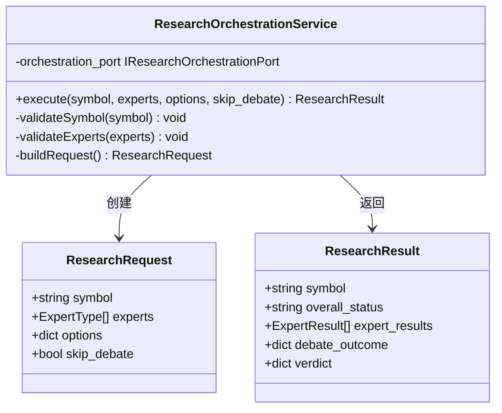

**图表来源**
- [src/modules/coordinator/application/research_orchestration_service.py](file://src/modules/coordinator/application/research_orchestration_service.py#L11-L76)

**章节来源**
- [src/modules/coordinator/presentation/rest/research_routes.py](file://src/modules/coordinator/presentation/rest/research_routes.py#L1-L124)
- [src/modules/coordinator/application/research_orchestration_service.py](file://src/modules/coordinator/application/research_orchestration_service.py#L1-L76)

### 依赖注入容器

系统使用容器模式管理复杂的依赖关系：

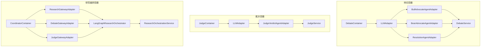

**图表来源**
- [src/modules/debate/container.py](file://src/modules/debate/container.py#L25-L43)
- [src/modules/judge/container.py](file://src/modules/judge/container.py#L19-L31)
- [src/modules/coordinator/container.py](file://src/modules/coordinator/container.py#L27-L49)

**章节来源**
- [src/modules/debate/container.py](file://src/modules/debate/container.py#L1-L43)
- [src/modules/judge/container.py](file://src/modules/judge/container.py#L1-L31)
- [src/modules/coordinator/container.py](file://src/modules/coordinator/container.py#L1-L49)

## 裁决模块API规范

### /judge/verdict 端点

裁决模块提供专门的REST API端点，用于根据辩论结果生成最终的投资决策。

#### 端点详情

- **HTTP方法**: POST
- **路径**: `/api/v1/judge/verdict`
- **标签**: judge
- **描述**: 根据标的与辩论结果执行综合裁决，返回可执行操作指令

#### 请求体结构

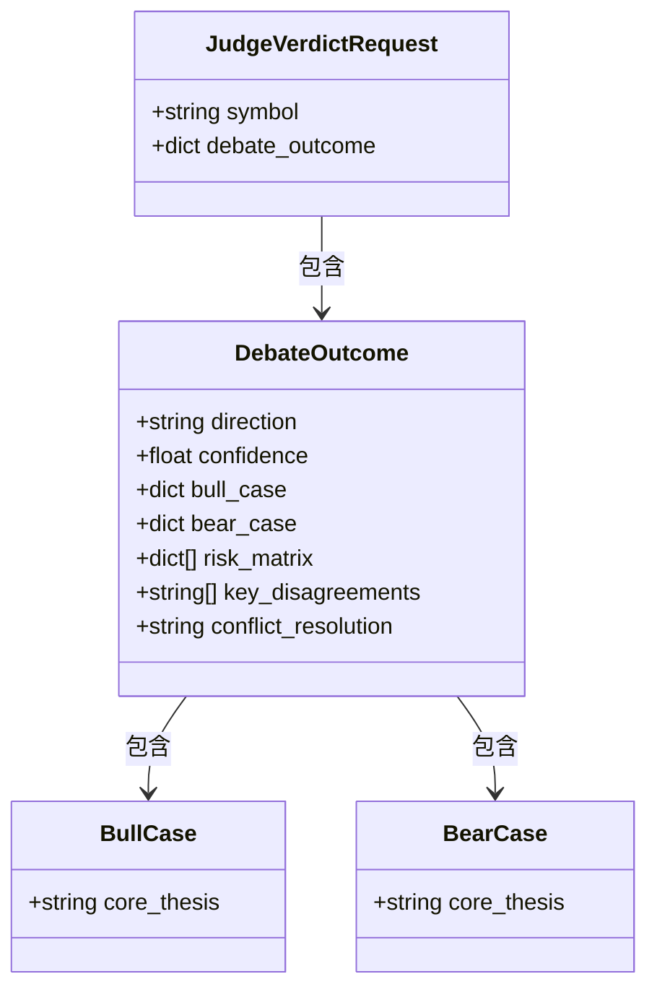

**图表来源**
- [src/modules/judge/presentation/rest/judge_schemas.py](file://src/modules/judge/presentation/rest/judge_schemas.py#L9-L16)

#### 响应体结构

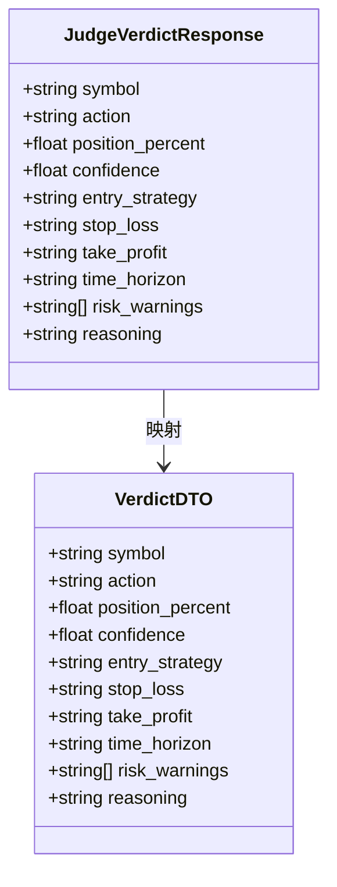

**图表来源**
- [src/modules/judge/presentation/rest/judge_schemas.py](file://src/modules/judge/presentation/rest/judge_schemas.py#L19-L31)
- [src/modules/judge/application/dtos/verdict_dto.py](file://src/modules/judge/application/dtos/verdict_dto.py#L9-L21)

#### 字段详细说明

**请求体字段**:
- `symbol`: 标的代码（必填）
- `debate_outcome`: 辩论结果字典（必填，非空对象）

**响应体字段**:
- `symbol`: 标的代码
- `action`: 操作方向（BUY | SELL | HOLD）
- `position_percent`: 建议仓位比例（0.0-1.0）
- `confidence`: 裁决置信度（0.0-1.0）
- `entry_strategy`: 入场策略描述
- `stop_loss`: 止损策略
- `take_profit`: 止盈策略
- `time_horizon`: 持有周期建议
- `risk_warnings`: 关键风控约束列表
- `reasoning`: 裁决理由摘要

#### 错误处理

- **400 Bad Request**: 当symbol缺失或debate_outcome为空时返回
- **500 Internal Server Error**: 当LLM解析失败或应用异常时返回

**章节来源**
- [src/modules/judge/presentation/rest/judge_router.py](file://src/modules/judge/presentation/rest/judge_router.py#L1-L91)
- [src/modules/judge/presentation/rest/judge_schemas.py](file://src/modules/judge/presentation/rest/judge_schemas.py#L1-L32)

### 裁决服务流程

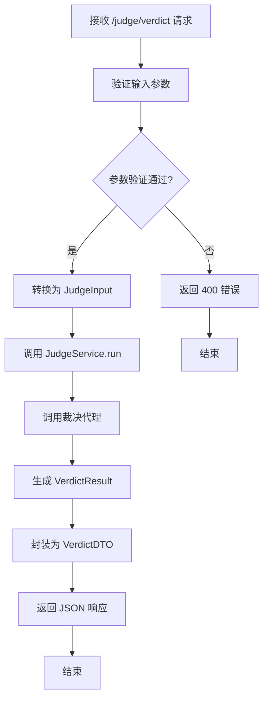

**图表来源**
- [src/modules/judge/application/services/judge_service.py](file://src/modules/judge/application/services/judge_service.py#L17-L34)
- [src/modules/judge/domain/ports/judge_verdict_agent.py](file://src/modules/judge/domain/ports/judge_verdict_agent.py#L12-L18)

**章节来源**
- [src/modules/judge/application/services/judge_service.py](file://src/modules/judge/application/services/judge_service.py#L1-L35)
- [src/modules/judge/domain/ports/judge_verdict_agent.py](file://src/modules/judge/domain/ports/judge_verdict_agent.py#L1-L19)

## 端到端工作流程

### 完整的分析决策流程

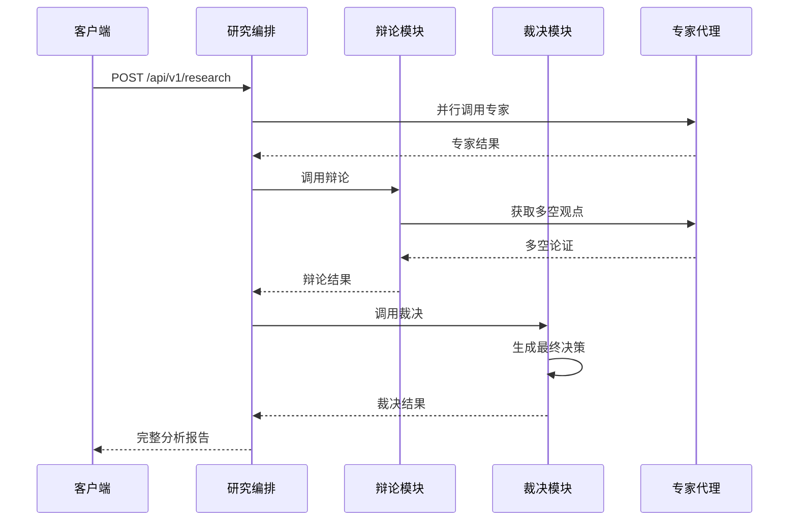

**图表来源**
- [src/modules/coordinator/presentation/rest/research_routes.py](file://src/modules/coordinator/presentation/rest/research_routes.py#L80-L116)
- [src/modules/coordinator/infrastructure/adapters/judge_gateway_adapter.py](file://src/modules/coordinator/infrastructure/adapters/judge_gateway_adapter.py#L52-L62)

### 实际API调用示例

**请求示例**:
```json
{
  "symbol": "000001.SZ",
  "debate_outcome": {
    "direction": "BULLISH",
    "confidence": 0.7,
    "bull_case": {
      "core_thesis": "估值偏低"
    },
    "bear_case": {
      "core_thesis": "景气度下行"
    },
    "risk_matrix": [
      {"risk": "政策"}
    ],
    "key_disagreements": ["估值分歧"],
    "conflict_resolution": "综合偏多"
  }
}
```

**响应示例**:
```json
{
  "symbol": "000001.SZ",
  "action": "BUY",
  "position_percent": 0.3,
  "confidence": 0.72,
  "entry_strategy": "分批建仓",
  "stop_loss": "-5%",
  "take_profit": "+15%",
  "time_horizon": "3-6个月",
  "risk_warnings": ["流动性风险"],
  "reasoning": "综合偏多"
}
```

**章节来源**
- [tests/judge/presentation/test_judge_routes.py](file://tests/judge/presentation/test_judge_routes.py#L38-L71)

## 依赖关系分析

系统采用松耦合的设计，通过接口隔离具体实现：

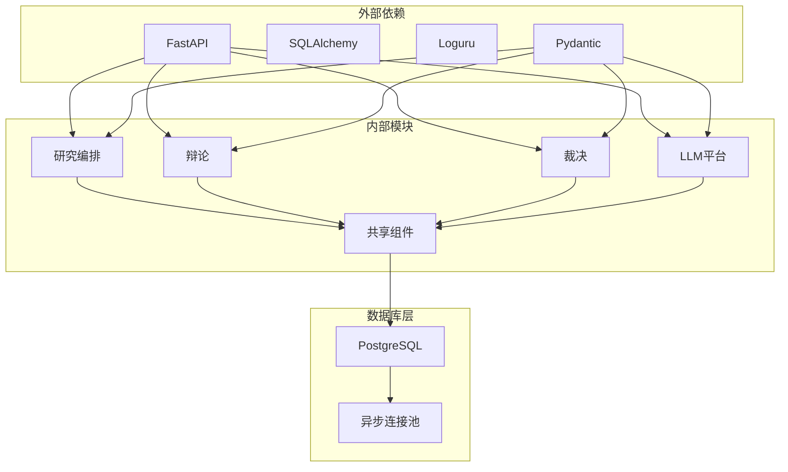

**图表来源**
- [src/shared/config.py](file://src/shared/config.py#L40-L58)
- [src/api/middlewares/error_handler.py](file://src/api/middlewares/error_handler.py#L1-L46)

**章节来源**
- [src/shared/config.py](file://src/shared/config.py#L1-L68)

## 性能考虑

系统在设计时充分考虑了性能优化：

### 异步处理
- 所有数据库操作使用异步连接池
- 辩论阶段采用并行执行模式
- LLM调用支持异步处理

### 缓存策略
- LLM配置通过注册表缓存
- 调度器服务保持常驻状态
- 数据库连接池复用连接

### 错误处理
- 统一的异常处理中间件
- 详细的日志记录
- 友好的错误响应格式

## 故障排除指南

### 常见问题诊断

#### API调用失败
1. **检查健康状态**：访问 `/api/v1/health` 确认服务正常
2. **验证认证**：确认请求头包含必要的认证信息
3. **检查参数**：验证请求体格式和必需字段

#### 数据库连接问题
1. **检查连接字符串**：确认数据库配置正确
2. **验证网络连接**：确保数据库服务器可达
3. **查看连接池状态**：监控连接使用情况

#### LLM服务异常
1. **检查模型配置**：确认LLM平台配置正确
2. **验证API密钥**：确保认证凭据有效
3. **监控调用频率**：避免超出API限制

#### 裁决模块特定问题
1. **检查辩论结果完整性**：确认debate_outcome包含所有必需字段
2. **验证符号格式**：确保symbol符合预期格式
3. **查看LLM输出**：检查裁决代理的LLM调用是否成功

**章节来源**
- [src/api/health.py](file://src/api/health.py#L1-L24)
- [src/api/middlewares/error_handler.py](file://src/api/middlewares/error_handler.py#L1-L46)

## 结论

该辩论REST API系统展现了现代企业级应用的最佳实践，通过模块化设计、Clean Architecture原则和依赖注入模式，实现了高度可维护和可扩展的代码结构。

### 主要优势

1. **清晰的架构分离**：每层职责明确，便于维护和测试
2. **强大的扩展性**：模块化设计支持新功能的快速集成
3. **完善的错误处理**：统一的异常处理机制提升用户体验
4. **高性能设计**：异步处理和连接池优化系统性能
5. **完整的决策链路**：从专家分析到最终裁决的端到端流程

### 技术亮点

- **多专家协同**：支持技术分析、财务审计、宏观情报等多领域专家
- **智能辩论**：通过LLM实现多空观点的深度辩论和冲突解决
- **可执行决策**：最终输出包含具体的投资行动建议和风险管理策略
- **灵活的编排**：支持动态配置专家组合和分析参数
- **标准化接口**：裁决模块提供标准化的API接口，便于集成

该系统为金融分析领域提供了一个强大而灵活的技术平台，能够满足复杂的投资决策需求。通过研究编排模块的协调，系统实现了从数据收集、专家分析、智能辩论到最终决策的完整工作流程，为用户提供了一站式的投资决策支持服务。