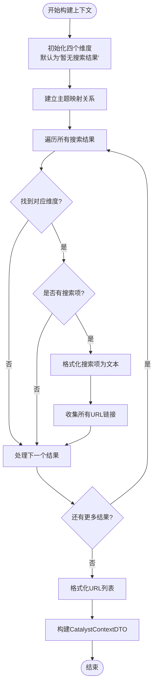

# Catalyst Detective

<cite>
**本文档引用的文件**
- [src/modules/research/application/catalyst_detective_service.py](file://src/modules/research/application/catalyst_detective_service.py)
- [src/modules/research/domain/ports/catalyst_detective_agent.py](file://src/modules/research/domain/ports/catalyst_detective_agent.py)
- [src/modules/research/infrastructure/adapters/catalyst_detective_agent_adapter.py](file://src/modules/research/infrastructure/adapters/catalyst_detective_agent_adapter.py)
- [src/modules/research/domain/dtos/catalyst_dtos.py](file://src/modules/research/domain/dtos/catalyst_dtos.py)
- [src/modules/research/domain/dtos/catalyst_inputs.py](file://src/modules/research/domain/dtos/catalyst_inputs.py)
- [src/modules/research/domain/dtos/catalyst_context.py](file://src/modules/research/domain/dtos/catalyst_context.py)
- [src/modules/research/domain/ports/catalyst_data.py](file://src/modules/research/domain/ports/catalyst_data.py)
- [src/modules/research/domain/ports/catalyst_context_builder.py](file://src/modules/research/domain/ports/catalyst_context_builder.py)
- [src/modules/research/infrastructure/adapters/catalyst_data_adapter.py](file://src/modules/research/infrastructure/adapters/catalyst_data_adapter.py)
- [src/modules/research/infrastructure/catalyst_context/context_builder.py](file://src/modules/research/infrastructure/catalyst_context/context_builder.py)
- [src/modules/research/infrastructure/agents/catalyst_detective/output_parser.py](file://src/modules/research/infrastructure/agents/catalyst_detective/output_parser.py)
- [src/modules/research/container.py](file://src/modules/research/container.py)
- [src/main.py](file://src/main.py)
</cite>

## 目录
1. [简介](#简介)
2. [项目结构](#项目结构)
3. [核心组件](#核心组件)
4. [架构概览](#架构概览)
5. [详细组件分析](#详细组件分析)
6. [依赖关系分析](#依赖关系分析)
7. [性能考虑](#性能考虑)
8. [故障排除指南](#故障排除指南)
9. [结论](#结论)

## 简介

Catalyst Detective（催化剂侦探）是Stock Helper项目中的一个智能分析模块，专门负责识别和评估影响特定股票价格的潜在催化剂事件。该模块通过整合多维度信息源，包括公司重大事件、行业催化、市场情绪和财报预期等，为投资决策提供全面的催化剂分析。

该模块采用领域驱动设计（DDD）原则，实现了清晰的分层架构，包括应用层、领域层、基础设施层和展示层。通过端口适配器模式，确保了系统的可扩展性和可测试性。

## 项目结构

Catalyst Detective模块位于研究（research）子系统中，遵循标准的三层架构模式：

**图表来源**
- [src/modules/research/application/catalyst_detective_service.py](file://src/modules/research/application/catalyst_detective_service.py#L24-L84)
- [src/modules/research/container.py](file://src/modules/research/container.py#L144-L166)

**章节来源**
- [src/modules/research/container.py](file://src/modules/research/container.py#L1-L167)

## 核心组件

Catalyst Detective模块的核心组件包括以下关键组件：

### 1. 应用服务层
- **CatalystDetectiveService**: 主要的应用服务，协调整个催化剂分析流程
- **CatalystDetectiveAgentResult**: Agent调用的完整返回结果封装

### 2. 领域层接口
- **ICatalystDataPort**: 催化剂数据访问端口
- **ICatalystContextBuilder**: 催化剂上下文构建器端口
- **ICatalystDetectiveAgentPort**: 催化剂侦探Agent端口

### 3. 数据传输对象
- **CatalystContextDTO**: 催化剂上下文数据传输对象
- **CatalystDetectiveResultDTO**: 催化剂侦探分析结果DTO
- **CatalystStockOverview**: 股票基础概览信息DTO

### 4. 基础设施层实现
- **CatalystDataAdapter**: 催化剂数据适配器
- **CatalystContextBuilderImpl**: 上下文构建器实现
- **CatalystDetectiveAgentAdapter**: Agent适配器实现
- **CatalystOutputParser**: 结果解析器

**章节来源**
- [src/modules/research/application/catalyst_detective_service.py](file://src/modules/research/application/catalyst_detective_service.py#L24-L84)
- [src/modules/research/domain/dtos/catalyst_dtos.py](file://src/modules/research/domain/dtos/catalyst_dtos.py#L7-L55)

## 架构概览

Catalyst Detective采用经典的六边形架构（端口适配器模式），实现了业务逻辑与技术实现的分离：

**图表来源**
- [src/modules/research/application/catalyst_detective_service.py](file://src/modules/research/application/catalyst_detective_service.py#L24-L84)
- [src/modules/research/container.py](file://src/modules/research/container.py#L144-L166)

## 详细组件分析

### CatalystDetectiveService 分析

CatalystDetectiveService是整个模块的核心协调者，负责执行完整的催化剂分析流程：

**图表来源**
- [src/modules/research/application/catalyst_detective_service.py](file://src/modules/research/application/catalyst_detective_service.py#L35-L84)

#### 核心处理流程

1. **参数验证**: 确保股票符号不为空
2. **数据获取**: 通过数据端口获取股票基础信息
3. **搜索执行**: 在四个维度上执行网络搜索
4. **结果验证**: 检查所有搜索结果是否为空
5. **上下文构建**: 将搜索结果格式化为LLM提示上下文
6. **AI分析**: 调用Agent进行深度分析
7. **结果标准化**: 返回统一格式的结果

**章节来源**
- [src/modules/research/application/catalyst_detective_service.py](file://src/modules/research/application/catalyst_detective_service.py#L35-L84)

### CatalystDataAdapter 分析

CatalystDataAdapter实现了ICatalystDataPort接口，负责与外部系统交互：

**图表来源**
- [src/modules/research/domain/ports/catalyst_data.py](file://src/modules/research/domain/ports/catalyst_data.py#L10-L26)
- [src/modules/research/infrastructure/adapters/catalyst_data_adapter.py](file://src/modules/research/infrastructure/adapters/catalyst_data_adapter.py#L27-L138)

#### 四维度搜索策略

模块实现了四个关键的搜索维度：

| 维度 | 查询模板 | 关键关键词 |
|------|----------|------------|
| 公司重大事件与动态 | `{stock_name} 重大事件 并购重组 管理层变动 战略合作 {year}年` | 重大事件、并购重组、管理层变动 |
| 行业催化与竞争格局 | `{stock_name} {industry} 竞争格局 技术突破 政策催化 {year}年` | 行业竞争、技术突破、政策影响 |
| 市场情绪与机构动向 | `{stock_name} 机构评级 分析师 调研 资金流向 {year}年` | 机构评级、分析师观点、资金流向 |
| 财报预期与业绩催化 | `{stock_name} 业绩预告 财报 盈利预测 订单合同 {year}年` | 业绩预告、财务报表、盈利预测 |

**章节来源**
- [src/modules/research/infrastructure/adapters/catalyst_data_adapter.py](file://src/modules/research/infrastructure/adapters/catalyst_data_adapter.py#L76-L127)

### CatalystContextBuilderImpl 分析

CatalystContextBuilderImpl负责将原始搜索结果转换为LLM可用的结构化上下文：

**图表来源**
- [src/modules/research/infrastructure/catalyst_context/context_builder.py](file://src/modules/research/infrastructure/catalyst_context/context_builder.py#L15-L86)

#### 上下文格式化规则

构建器将搜索结果格式化为易于LLM理解的结构化文本：

1. **标题格式**: `[序号] 标题 - 来源: 网站名 (发布日期)`
2. **摘要内容**: 缩进显示的摘要或片段内容
3. **URL收集**: 自动提取并去重所有引用链接
4. **默认值处理**: 为每个维度提供适当的默认占位符

**章节来源**
- [src/modules/research/infrastructure/catalyst_context/context_builder.py](file://src/modules/research/infrastructure/catalyst_context/context_builder.py#L75-L86)

### CatalystDetectiveAgentAdapter 分析

Agent适配器负责与LLM集成，执行实际的AI分析：

**图表来源**
- [src/modules/research/domain/ports/catalyst_detective_agent.py](file://src/modules/research/domain/ports/catalyst_detective_agent.py#L7-L16)
- [src/modules/research/infrastructure/adapters/catalyst_detective_agent_adapter.py](file://src/modules/research/infrastructure/adapters/catalyst_detective_agent_adapter.py#L19-L81)

#### Prompt管理机制

Agent适配器采用模块化的Prompt管理策略：

1. **系统提示**: 提供分析任务的指导原则和约束条件
2. **用户模板**: 包含占位符的分析框架
3. **上下文填充**: 将结构化上下文动态插入到模板中
4. **温度控制**: 使用较低的温度值（0.3）确保分析稳定性

**章节来源**
- [src/modules/research/infrastructure/adapters/catalyst_detective_agent_adapter.py](file://src/modules/research/infrastructure/adapters/catalyst_detective_agent_adapter.py#L37-L81)

### 结果解析器分析

输出解析器负责将LLM的非结构化输出转换为强类型的DTO对象：

**图表来源**
- [src/modules/research/infrastructure/agents/catalyst_detective/output_parser.py](file://src/modules/research/infrastructure/agents/catalyst_detective/output_parser.py#L35-L101)

#### 解析策略特点

1. **多格式兼容**: 支持带标记和不带标记的JSON格式
2. **容错处理**: 对于推理模型的思考标签进行自动清理
3. **严格验证**: 使用Pydantic进行字段级别的类型验证
4. **详细错误**: 提供详细的错误信息便于调试

**章节来源**
- [src/modules/research/infrastructure/agents/catalyst_detective/output_parser.py](file://src/modules/research/infrastructure/agents/catalyst_detective/output_parser.py#L35-L101)

## 依赖关系分析

Catalyst Detective模块的依赖关系体现了清晰的分层架构：

**图表来源**
- [src/modules/research/container.py](file://src/modules/research/container.py#L144-L166)

### 关键依赖注入点

1. **数据工程容器**: 提供股票基本信息查询和财务数据访问
2. **LLM平台容器**: 提供Web搜索服务和LLM调用能力
3. **数据库会话**: 支持审计日志和外部API调用记录

**章节来源**
- [src/modules/research/container.py](file://src/modules/research/container.py#L56-L64)

## 性能考虑

### 异步处理优化

Catalyst Detective模块充分利用异步编程模式来提升性能：

1. **并发搜索**: 四个维度的搜索可以并行执行
2. **异步IO**: 数据库查询和网络请求使用异步方式
3. **流式处理**: 大量数据的处理采用流式模式

### 缓存策略

1. **搜索结果缓存**: 对常用的搜索查询结果进行缓存
2. **上下文预处理**: 避免重复的文本格式化操作
3. **LLM调用优化**: 合理设置温度参数平衡准确性和速度

### 错误处理机制

1. **优雅降级**: 单个维度的搜索失败不影响整体分析
2. **超时控制**: 为外部服务调用设置合理的超时时间
3. **重试机制**: 关键操作具备自动重试能力

## 故障排除指南

### 常见问题及解决方案

#### 1. 股票符号无效
**症状**: 抛出BadRequestException，消息为"symbol 为必填"
**解决**: 确保传入有效的股票代码，支持A股代码格式

#### 2. 无法获取股票概览
**症状**: 抛出BadRequestException，消息包含"标的不存在或无法获取概览"
**解决**: 
- 检查股票代码是否正确
- 验证数据工程模块的数据库连接
- 确认股票基本信息是否已同步

#### 3. 搜索结果全部为空
**症状**: 抛出BadRequestException，消息为"关于该标的的催化剂搜索全部失败或无结果"
**解决**:
- 检查网络连接和搜索引擎可用性
- 验证Web搜索服务配置
- 调整搜索关键词和范围

#### 4. LLM输出解析失败
**症状**: 抛出LLMOutputParseError异常
**解决**:
- 检查Prompt模板是否正确加载
- 验证LLM响应格式是否符合预期
- 查看详细的错误日志信息

### 调试建议

1. **启用详细日志**: 在开发环境中增加日志级别
2. **监控外部依赖**: 定期检查数据工程和LLM平台的状态
3. **性能基准测试**: 定期评估各组件的响应时间
4. **错误率统计**: 监控解析失败和调用失败的频率

**章节来源**
- [src/modules/research/application/catalyst_detective_service.py](file://src/modules/research/application/catalyst_detective_service.py#L43-L65)
- [src/modules/research/infrastructure/agents/catalyst_detective/output_parser.py](file://src/modules/research/infrastructure/agents/catalyst_detective/output_parser.py#L40-L93)

## 结论

Catalyst Detective模块是一个设计精良的智能分析系统，具有以下显著特点：

### 架构优势
- **清晰的分层设计**: 严格的职责分离确保了代码的可维护性
- **端口适配器模式**: 实现了业务逻辑与技术实现的完全解耦
- **依赖注入**: 通过容器统一管理依赖关系，便于测试和扩展

### 功能特性
- **多维度分析**: 同时考虑公司事件、行业趋势、市场情绪和财务预期
- **异步处理**: 充分利用现代Python的异步特性提升性能
- **容错设计**: 具备优雅降级和错误恢复机制

### 扩展潜力
- **模块化结构**: 易于添加新的分析维度和数据源
- **插件化架构**: 支持不同的LLM提供商和搜索服务
- **标准化接口**: 为其他专家模块提供一致的集成体验

该模块为Stock Helper项目提供了强大的催化剂识别能力，为投资者决策提供了可靠的数据支持和技术保障。