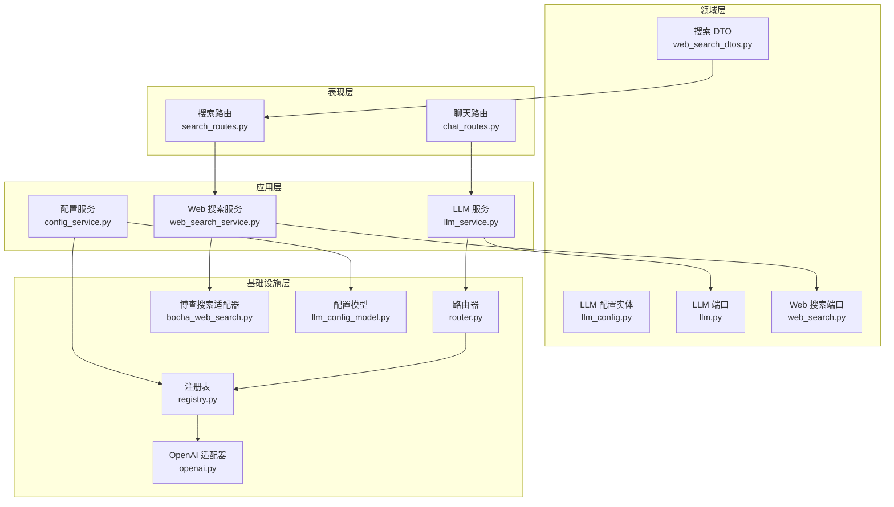
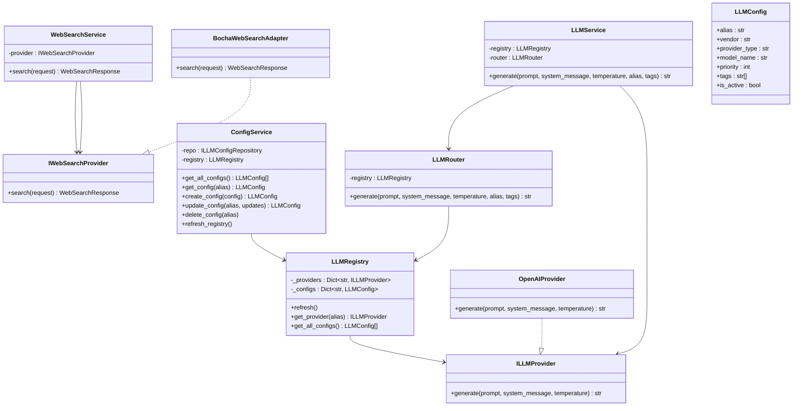
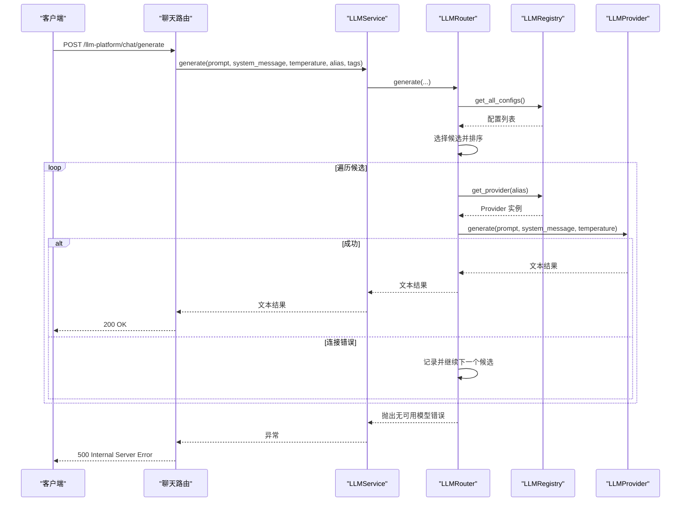
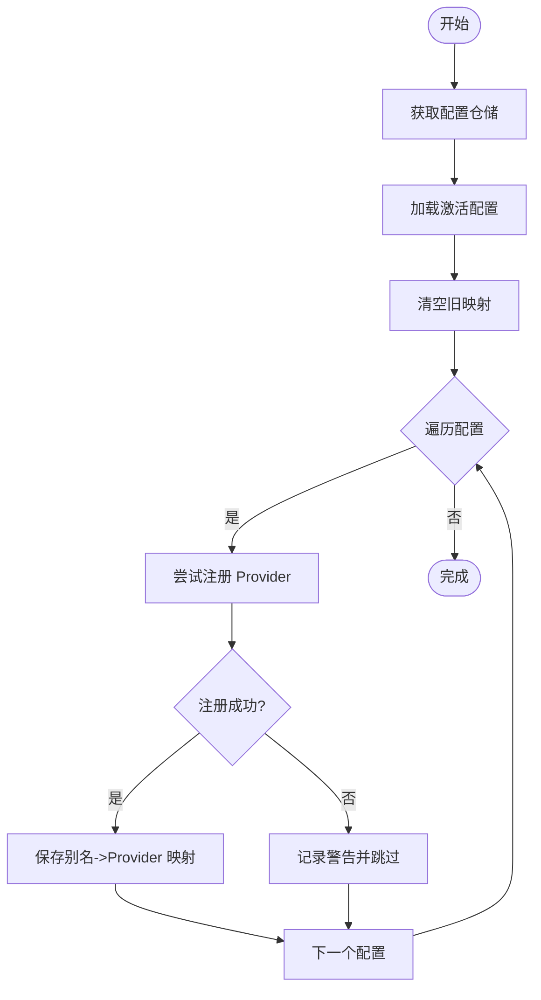
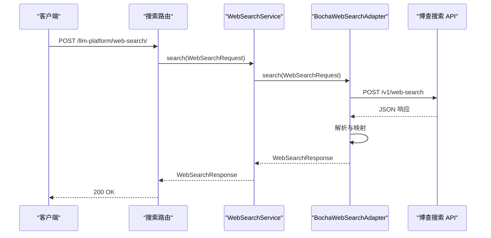
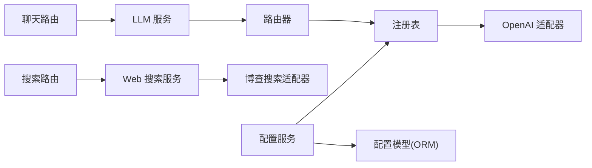

# LLM平台模块

<cite>
**本文档引用的文件**
- [src/modules/llm_platform/container.py](file://src/modules/llm_platform/container.py)
- [src/modules/llm_platform/domain/entities/llm_config.py](file://src/modules/llm_platform/domain/entities/llm_config.py)
- [src/modules/llm_platform/infrastructure/registry.py](file://src/modules/llm_platform/infrastructure/registry.py)
- [src/modules/llm_platform/application/services/llm_service.py](file://src/modules/llm_platform/application/services/llm_service.py)
- [src/modules/llm_platform/application/services/config_service.py](file://src/modules/llm_platform/application/services/config_service.py)
- [src/modules/llm_platform/application/services/web_search_service.py](file://src/modules/llm_platform/application/services/web_search_service.py)
- [src/modules/llm_platform/infrastructure/router.py](file://src/modules/llm_platform/infrastructure/router.py)
- [src/modules/llm_platform/domain/ports/llm.py](file://src/modules/llm_platform/domain/ports/llm.py)
- [src/modules/llm_platform/domain/ports/web_search.py](file://src/modules/llm_platform/domain/ports/web_search.py)
- [src/modules/llm_platform/infrastructure/adapters/openai.py](file://src/modules/llm_platform/infrastructure/adapters/openai.py)
- [src/modules/llm_platform/infrastructure/adapters/bocha_web_search.py](file://src/modules/llm_platform/infrastructure/adapters/bocha_web_search.py)
- [src/modules/llm_platform/domain/web_search_dtos.py](file://src/modules/llm_platform/domain/web_search_dtos.py)
- [src/modules/llm_platform/infrastructure/persistence/models/llm_config_model.py](file://src/modules/llm_platform/infrastructure/persistence/models/llm_config_model.py)
- [src/modules/llm_platform/presentation/rest/chat_routes.py](file://src/modules/llm_platform/presentation/rest/chat_routes.py)
- [src/modules/llm_platform/presentation/rest/search_routes.py](file://src/modules/llm_platform/presentation/rest/search_routes.py)
</cite>

## 目录
1. [简介](#简介)
2. [项目结构](#项目结构)
3. [核心组件](#核心组件)
4. [架构总览](#架构总览)
5. [详细组件分析](#详细组件分析)
6. [依赖关系分析](#依赖关系分析)
7. [性能考虑](#性能考虑)
8. [故障排查指南](#故障排查指南)
9. [结论](#结论)
10. [附录](#附录)

## 简介
本文件为 LLM 平台模块的技术文档，面向希望理解与扩展该模块的开发者。文档覆盖以下主题：
- 大语言模型管理平台的设计架构：模型配置管理、路由策略与负载均衡机制
- LLM 服务核心功能：模型选择、参数配置与响应处理流程
- Web 搜索服务实现：搜索引擎适配器设计、结果聚合与过滤机制
- 模型适配器注册表模式：OpenAI、Bocha 等不同供应商的适配器实现
- 配置持久化：数据库存储、缓存策略与配置验证
- 扩展开发指南：新增模型适配器与自定义搜索服务的实现步骤
- 性能监控、错误处理与安全防护最佳实践

## 项目结构
LLM 平台模块采用分层架构与端口-实现（Port-Adapter）模式，清晰分离应用层、领域层、基础设施层与表现层。

图表来源
- [src/modules/llm_platform/presentation/rest/chat_routes.py](file://src/modules/llm_platform/presentation/rest/chat_routes.py#L1-L69)
- [src/modules/llm_platform/presentation/rest/search_routes.py](file://src/modules/llm_platform/presentation/rest/search_routes.py#L1-L158)
- [src/modules/llm_platform/application/services/llm_service.py](file://src/modules/llm_platform/application/services/llm_service.py#L1-L63)
- [src/modules/llm_platform/application/services/config_service.py](file://src/modules/llm_platform/application/services/config_service.py#L1-L117)
- [src/modules/llm_platform/application/services/web_search_service.py](file://src/modules/llm_platform/application/services/web_search_service.py#L1-L57)
- [src/modules/llm_platform/infrastructure/router.py](file://src/modules/llm_platform/infrastructure/router.py#L1-L68)
- [src/modules/llm_platform/infrastructure/registry.py](file://src/modules/llm_platform/infrastructure/registry.py#L1-L105)
- [src/modules/llm_platform/infrastructure/adapters/openai.py](file://src/modules/llm_platform/infrastructure/adapters/openai.py#L1-L65)
- [src/modules/llm_platform/infrastructure/adapters/bocha_web_search.py](file://src/modules/llm_platform/infrastructure/adapters/bocha_web_search.py#L1-L190)
- [src/modules/llm_platform/domain/entities/llm_config.py](file://src/modules/llm_platform/domain/entities/llm_config.py#L1-L54)
- [src/modules/llm_platform/domain/ports/llm.py](file://src/modules/llm_platform/domain/ports/llm.py#L1-L38)
- [src/modules/llm_platform/domain/ports/web_search.py](file://src/modules/llm_platform/domain/ports/web_search.py#L1-L33)
- [src/modules/llm_platform/domain/web_search_dtos.py](file://src/modules/llm_platform/domain/web_search_dtos.py#L1-L77)
- [src/modules/llm_platform/infrastructure/persistence/models/llm_config_model.py](file://src/modules/llm_platform/infrastructure/persistence/models/llm_config_model.py#L1-L59)

章节来源
- [src/modules/llm_platform/container.py](file://src/modules/llm_platform/container.py#L1-L78)
- [src/modules/llm_platform/presentation/rest/chat_routes.py](file://src/modules/llm_platform/presentation/rest/chat_routes.py#L1-L69)
- [src/modules/llm_platform/presentation/rest/search_routes.py](file://src/modules/llm_platform/presentation/rest/search_routes.py#L1-L158)

## 核心组件
- 应用服务
  - LLM 服务：对外提供统一的文本生成入口，封装路由与错误处理
  - 配置服务：负责配置的增删改查与注册表热更新
  - Web 搜索服务：对外提供统一的搜索入口，屏蔽具体搜索引擎实现
- 领域实体与端口
  - LLM 配置实体：描述模型别名、厂商、适配器类型、模型名、优先级、标签等
  - LLM 端口与 Web 搜索端口：定义抽象契约，隔离上层依赖具体实现
  - 搜索 DTO：标准化请求与响应结构，便于跨层传递
- 基础设施
  - 注册表：单例管理活跃 Provider，支持从数据库动态加载
  - 路由器：基于别名或标签选择候选模型，按优先级排序并实现故障转移
  - 适配器：OpenAI 适配器与博查搜索适配器，分别对接不同供应商
  - 持久化模型：LLM 配置的数据库映射

章节来源
- [src/modules/llm_platform/application/services/llm_service.py](file://src/modules/llm_platform/application/services/llm_service.py#L1-L63)
- [src/modules/llm_platform/application/services/config_service.py](file://src/modules/llm_platform/application/services/config_service.py#L1-L117)
- [src/modules/llm_platform/application/services/web_search_service.py](file://src/modules/llm_platform/application/services/web_search_service.py#L1-L57)
- [src/modules/llm_platform/domain/entities/llm_config.py](file://src/modules/llm_platform/domain/entities/llm_config.py#L1-L54)
- [src/modules/llm_platform/domain/ports/llm.py](file://src/modules/llm_platform/domain/ports/llm.py#L1-L38)
- [src/modules/llm_platform/domain/ports/web_search.py](file://src/modules/llm_platform/domain/ports/web_search.py#L1-L33)
- [src/modules/llm_platform/domain/web_search_dtos.py](file://src/modules/llm_platform/domain/web_search_dtos.py#L1-L77)
- [src/modules/llm_platform/infrastructure/registry.py](file://src/modules/llm_platform/infrastructure/registry.py#L1-L105)
- [src/modules/llm_platform/infrastructure/router.py](file://src/modules/llm_platform/infrastructure/router.py#L1-L68)
- [src/modules/llm_platform/infrastructure/adapters/openai.py](file://src/modules/llm_platform/infrastructure/adapters/openai.py#L1-L65)
- [src/modules/llm_platform/infrastructure/adapters/bocha_web_search.py](file://src/modules/llm_platform/infrastructure/adapters/bocha_web_search.py#L1-L190)
- [src/modules/llm_platform/infrastructure/persistence/models/llm_config_model.py](file://src/modules/llm_platform/infrastructure/persistence/models/llm_config_model.py#L1-L59)

## 架构总览
LLM 平台遵循“依赖倒置”原则：上层仅依赖抽象端口，具体实现由基础设施层提供；容器负责装配与依赖注入。

图表来源
- [src/modules/llm_platform/application/services/llm_service.py](file://src/modules/llm_platform/application/services/llm_service.py#L1-L63)
- [src/modules/llm_platform/application/services/config_service.py](file://src/modules/llm_platform/application/services/config_service.py#L1-L117)
- [src/modules/llm_platform/application/services/web_search_service.py](file://src/modules/llm_platform/application/services/web_search_service.py#L1-L57)
- [src/modules/llm_platform/infrastructure/registry.py](file://src/modules/llm_platform/infrastructure/registry.py#L1-L105)
- [src/modules/llm_platform/infrastructure/router.py](file://src/modules/llm_platform/infrastructure/router.py#L1-L68)
- [src/modules/llm_platform/infrastructure/adapters/openai.py](file://src/modules/llm_platform/infrastructure/adapters/openai.py#L1-L65)
- [src/modules/llm_platform/infrastructure/adapters/bocha_web_search.py](file://src/modules/llm_platform/infrastructure/adapters/bocha_web_search.py#L1-L190)
- [src/modules/llm_platform/domain/entities/llm_config.py](file://src/modules/llm_platform/domain/entities/llm_config.py#L1-L54)
- [src/modules/llm_platform/domain/ports/llm.py](file://src/modules/llm_platform/domain/ports/llm.py#L1-L38)
- [src/modules/llm_platform/domain/ports/web_search.py](file://src/modules/llm_platform/domain/ports/web_search.py#L1-L33)

## 详细组件分析

### LLM 服务与路由策略
- 统一入口：LLMService 作为门面，接收提示词、系统消息、温度与模型选择参数
- 路由决策：
  - 若提供别名：仅匹配该别名且启用的配置
  - 若提供标签：匹配同时包含全部标签且启用的配置
  - 默认：匹配所有启用配置，按优先级降序
- 故障转移：依次尝试候选模型，遇到连接类错误进行失败切换，最终若全部失败则抛出无可用模型错误

图表来源
- [src/modules/llm_platform/presentation/rest/chat_routes.py](file://src/modules/llm_platform/presentation/rest/chat_routes.py#L1-L69)
- [src/modules/llm_platform/application/services/llm_service.py](file://src/modules/llm_platform/application/services/llm_service.py#L1-L63)
- [src/modules/llm_platform/infrastructure/router.py](file://src/modules/llm_platform/infrastructure/router.py#L1-L68)
- [src/modules/llm_platform/infrastructure/registry.py](file://src/modules/llm_platform/infrastructure/registry.py#L1-L105)
- [src/modules/llm_platform/infrastructure/adapters/openai.py](file://src/modules/llm_platform/infrastructure/adapters/openai.py#L1-L65)

章节来源
- [src/modules/llm_platform/application/services/llm_service.py](file://src/modules/llm_platform/application/services/llm_service.py#L1-L63)
- [src/modules/llm_platform/infrastructure/router.py](file://src/modules/llm_platform/infrastructure/router.py#L1-L68)
- [src/modules/llm_platform/infrastructure/registry.py](file://src/modules/llm_platform/infrastructure/registry.py#L1-L105)

### 配置管理与持久化
- 配置实体：包含别名、厂商、适配器类型、模型名、基础地址、优先级、标签、启用状态等
- 应用服务：
  - 查询：获取全部配置与指定别名配置
  - 创建：校验别名唯一性，保存后触发注册表刷新
  - 更新：按需更新字段，保存后触发注册表刷新
  - 删除：按别名删除，保存后触发注册表刷新
- 注册表刷新：从仓储读取激活配置，实例化对应 Provider 并建立映射
- 持久化模型：ORM 映射至 PostgreSQL JSONB 存储标签数组，自动维护时间戳

图表来源
- [src/modules/llm_platform/application/services/config_service.py](file://src/modules/llm_platform/application/services/config_service.py#L1-L117)
- [src/modules/llm_platform/infrastructure/registry.py](file://src/modules/llm_platform/infrastructure/registry.py#L1-L105)
- [src/modules/llm_platform/infrastructure/persistence/models/llm_config_model.py](file://src/modules/llm_platform/infrastructure/persistence/models/llm_config_model.py#L1-L59)

章节来源
- [src/modules/llm_platform/domain/entities/llm_config.py](file://src/modules/llm_platform/domain/entities/llm_config.py#L1-L54)
- [src/modules/llm_platform/application/services/config_service.py](file://src/modules/llm_platform/application/services/config_service.py#L1-L117)
- [src/modules/llm_platform/infrastructure/registry.py](file://src/modules/llm_platform/infrastructure/registry.py#L1-L105)
- [src/modules/llm_platform/infrastructure/persistence/models/llm_config_model.py](file://src/modules/llm_platform/infrastructure/persistence/models/llm_config_model.py#L1-L59)

### Web 搜索服务与适配器
- 服务职责：接收请求 DTO，委托具体 Provider 执行搜索，记录日志并返回响应
- 博查适配器：
  - 参数构建：将请求 DTO 映射为博查 API 请求体（查询词、摘要开关、数量、时效过滤）
  - 调用上游：使用 HTTP 客户端发起 POST 请求，处理状态码与异常
  - 响应映射：解析响应结构，提取结果列表并转换为标准 DTO
- 路由层：搜索路由将 API 请求转换为领域 DTO，调用服务后回传给客户端

图表来源
- [src/modules/llm_platform/presentation/rest/search_routes.py](file://src/modules/llm_platform/presentation/rest/search_routes.py#L1-L158)
- [src/modules/llm_platform/application/services/web_search_service.py](file://src/modules/llm_platform/application/services/web_search_service.py#L1-L57)
- [src/modules/llm_platform/infrastructure/adapters/bocha_web_search.py](file://src/modules/llm_platform/infrastructure/adapters/bocha_web_search.py#L1-L190)
- [src/modules/llm_platform/domain/web_search_dtos.py](file://src/modules/llm_platform/domain/web_search_dtos.py#L1-L77)

章节来源
- [src/modules/llm_platform/application/services/web_search_service.py](file://src/modules/llm_platform/application/services/web_search_service.py#L1-L57)
- [src/modules/llm_platform/infrastructure/adapters/bocha_web_search.py](file://src/modules/llm_platform/infrastructure/adapters/bocha_web_search.py#L1-L190)
- [src/modules/llm_platform/domain/web_search_dtos.py](file://src/modules/llm_platform/domain/web_search_dtos.py#L1-L77)
- [src/modules/llm_platform/presentation/rest/search_routes.py](file://src/modules/llm_platform/presentation/rest/search_routes.py#L1-L158)

### 模型适配器注册表模式
- 注册表为单例，维护“别名 -> Provider 实例”与“别名 -> 配置”的映射
- 刷新流程：从仓储获取激活配置，按 provider_type 分派实例化（当前支持 OpenAI 类型）
- 路由器通过注册表获取 Provider 并执行生成，实现多供应商统一接入

章节来源
- [src/modules/llm_platform/infrastructure/registry.py](file://src/modules/llm_platform/infrastructure/registry.py#L1-L105)
- [src/modules/llm_platform/infrastructure/router.py](file://src/modules/llm_platform/infrastructure/router.py#L1-L68)
- [src/modules/llm_platform/infrastructure/adapters/openai.py](file://src/modules/llm_platform/infrastructure/adapters/openai.py#L1-L65)

### 表现层与依赖注入
- 容器：集中装配仓储、注册表与服务，供上层模块按需获取
- 路由：
  - 聊天路由：接收前端请求，调用 LLMService，返回生成文本
  - 搜索路由：接收前端请求，装配 WebSearchService（注入 Bocha 适配器），返回标准化结果

章节来源
- [src/modules/llm_platform/container.py](file://src/modules/llm_platform/container.py#L1-L78)
- [src/modules/llm_platform/presentation/rest/chat_routes.py](file://src/modules/llm_platform/presentation/rest/chat_routes.py#L1-L69)
- [src/modules/llm_platform/presentation/rest/search_routes.py](file://src/modules/llm_platform/presentation/rest/search_routes.py#L1-L158)

## 依赖关系分析
- 低耦合高内聚：应用层仅依赖端口，不关心具体实现
- 可替换性：通过注入不同 Provider 或 Adapter，即可切换供应商
- 可观测性：服务层与适配器均记录关键日志，便于追踪与排障

图表来源
- [src/modules/llm_platform/presentation/rest/chat_routes.py](file://src/modules/llm_platform/presentation/rest/chat_routes.py#L1-L69)
- [src/modules/llm_platform/presentation/rest/search_routes.py](file://src/modules/llm_platform/presentation/rest/search_routes.py#L1-L158)
- [src/modules/llm_platform/application/services/llm_service.py](file://src/modules/llm_platform/application/services/llm_service.py#L1-L63)
- [src/modules/llm_platform/application/services/web_search_service.py](file://src/modules/llm_platform/application/services/web_search_service.py#L1-L57)
- [src/modules/llm_platform/application/services/config_service.py](file://src/modules/llm_platform/application/services/config_service.py#L1-L117)
- [src/modules/llm_platform/infrastructure/router.py](file://src/modules/llm_platform/infrastructure/router.py#L1-L68)
- [src/modules/llm_platform/infrastructure/registry.py](file://src/modules/llm_platform/infrastructure/registry.py#L1-L105)
- [src/modules/llm_platform/infrastructure/adapters/openai.py](file://src/modules/llm_platform/infrastructure/adapters/openai.py#L1-L65)
- [src/modules/llm_platform/infrastructure/adapters/bocha_web_search.py](file://src/modules/llm_platform/infrastructure/adapters/bocha_web_search.py#L1-L190)
- [src/modules/llm_platform/infrastructure/persistence/models/llm_config_model.py](file://src/modules/llm_platform/infrastructure/persistence/models/llm_config_model.py#L1-L59)

## 性能考虑
- 路由与注册表
  - 建议在应用启动时初始化注册表并加载配置，避免运行时频繁刷新
  - 对于高频调用场景，可在进程内缓存注册表映射，减少重复查找
- 搜索服务
  - 合理设置超时时间，避免阻塞请求线程
  - 对上游 API 响应进行必要的限流与重试策略（当前适配器已处理常见异常）
- 日志与可观测性
  - 控制日志级别，避免在生产环境记录过多敏感信息
  - 对关键路径增加指标埋点（耗时、成功率、错误类型）

## 故障排查指南
- 无可用模型错误
  - 检查配置是否启用、标签是否匹配、别名是否存在
  - 查看注册表刷新日志，确认 Provider 实例化是否成功
- 连接与速率限制错误
  - 检查 API Key、基础 URL 与网络连通性
  - 关注上游服务状态，必要时降低并发或增加重试
- 搜索服务异常
  - 配置错误：检查 API Key 是否设置
  - 连接错误：检查超时与网络代理
  - 业务错误：查看上游返回的错误详情

章节来源
- [src/modules/llm_platform/infrastructure/router.py](file://src/modules/llm_platform/infrastructure/router.py#L1-L68)
- [src/modules/llm_platform/infrastructure/adapters/openai.py](file://src/modules/llm_platform/infrastructure/adapters/openai.py#L1-L65)
- [src/modules/llm_platform/infrastructure/adapters/bocha_web_search.py](file://src/modules/llm_platform/infrastructure/adapters/bocha_web_search.py#L1-L190)
- [src/modules/llm_platform/presentation/rest/search_routes.py](file://src/modules/llm_platform/presentation/rest/search_routes.py#L1-L158)

## 结论
LLM 平台模块通过清晰的分层与端口-实现模式，实现了模型配置管理、路由与负载均衡、Web 搜索能力的统一接入。其注册表与服务层设计使得扩展新供应商与适配器变得简单可控，同时具备良好的可观测性与可维护性。

## 附录

### 扩展开发指南

- 新增模型适配器
  1) 在基础设施层创建适配器类，实现 LLM 端口
     - 参考路径：[src/modules/llm_platform/infrastructure/adapters/openai.py](file://src/modules/llm_platform/infrastructure/adapters/openai.py#L1-L65)
  2) 在注册表中添加适配器类型分支
     - 参考路径：[src/modules/llm_platform/infrastructure/registry.py](file://src/modules/llm_platform/infrastructure/registry.py#L1-L105)
  3) 在配置实体中添加对应适配器类型
     - 参考路径：[src/modules/llm_platform/domain/entities/llm_config.py](file://src/modules/llm_platform/domain/entities/llm_config.py#L1-L54)
  4) 在应用服务层调用时，可通过别名或标签选择新适配器
     - 参考路径：[src/modules/llm_platform/application/services/llm_service.py](file://src/modules/llm_platform/application/services/llm_service.py#L1-L63)

- 自定义搜索服务
  1) 实现搜索端口
     - 参考路径：[src/modules/llm_platform/domain/ports/web_search.py](file://src/modules/llm_platform/domain/ports/web_search.py#L1-L33)
  2) 创建适配器类，实现请求构建、调用与响应映射
     - 参考路径：[src/modules/llm_platform/infrastructure/adapters/bocha_web_search.py](file://src/modules/llm_platform/infrastructure/adapters/bocha_web_search.py#L1-L190)
  3) 在路由中注入新适配器并提供 API
     - 参考路径：[src/modules/llm_platform/presentation/rest/search_routes.py](file://src/modules/llm_platform/presentation/rest/search_routes.py#L1-L158)

- 配置持久化与验证
  - 使用 ORM 模型存储配置，支持 JSONB 存储标签数组
    - 参考路径：[src/modules/llm_platform/infrastructure/persistence/models/llm_config_model.py](file://src/modules/llm_platform/infrastructure/persistence/models/llm_config_model.py#L1-L59)
  - 在应用服务中进行唯一性与存在性校验
    - 参考路径：[src/modules/llm_platform/application/services/config_service.py](file://src/modules/llm_platform/application/services/config_service.py#L1-L117)

- 最佳实践
  - 性能监控：在关键路径记录耗时与错误统计
  - 错误处理：区分业务错误与连接错误，返回语义化 HTTP 状态码
  - 安全防护：避免在日志中打印敏感信息，使用脱敏显示
  - 可靠性：对上游调用增加超时与重试，实现故障转移与降级策略