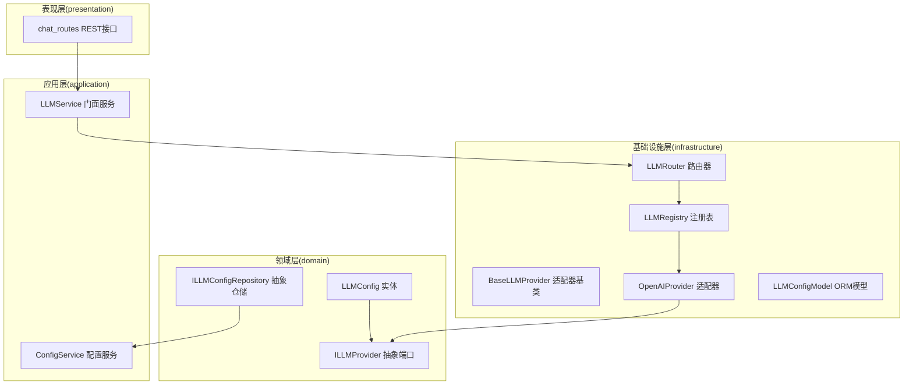
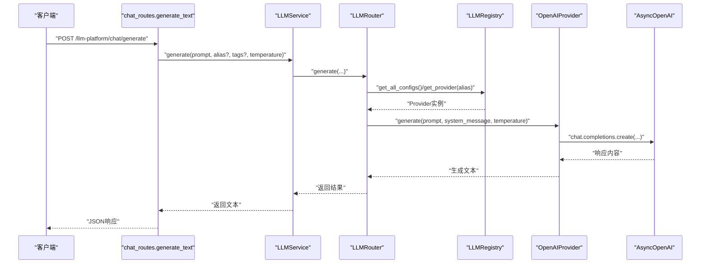
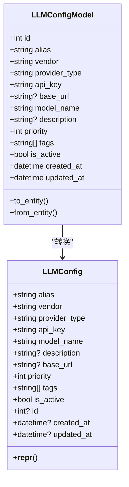
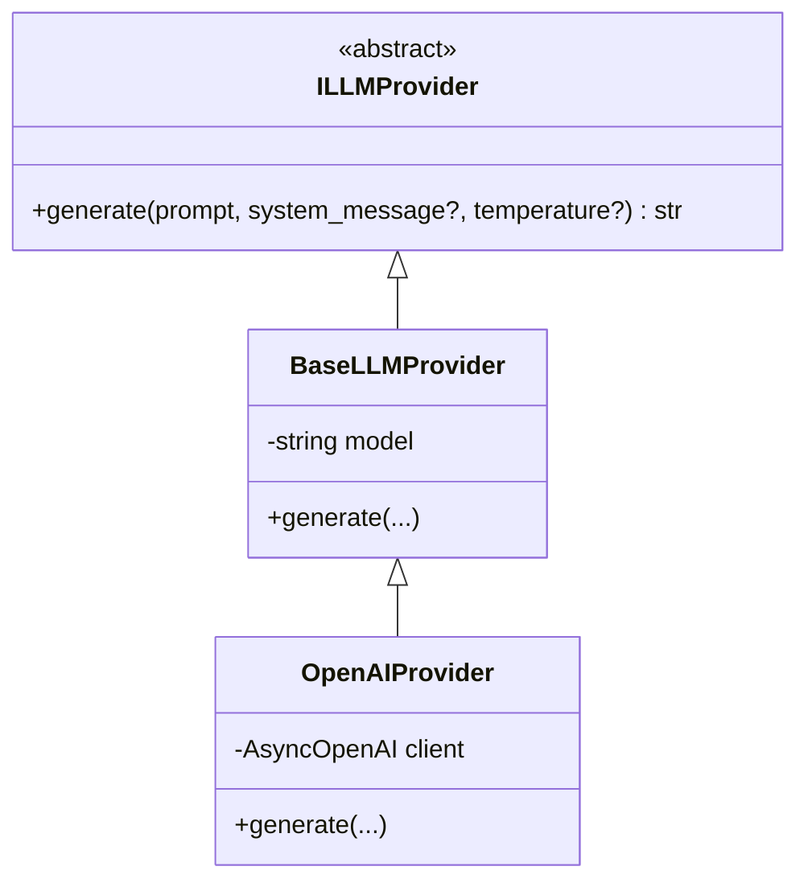
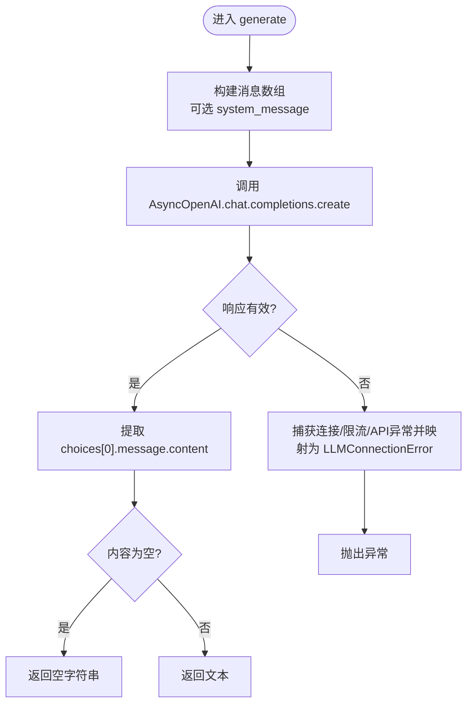
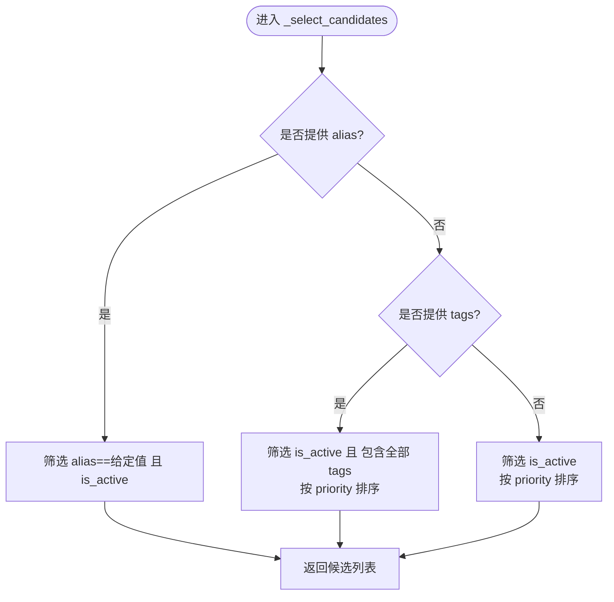
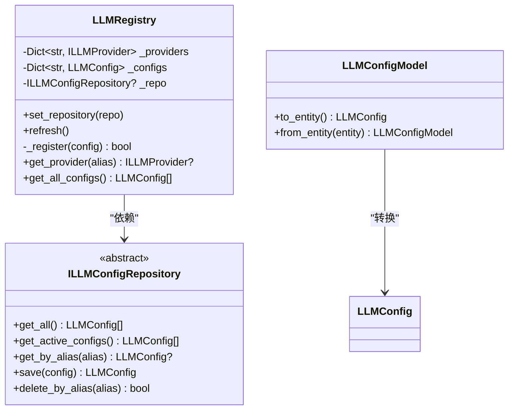
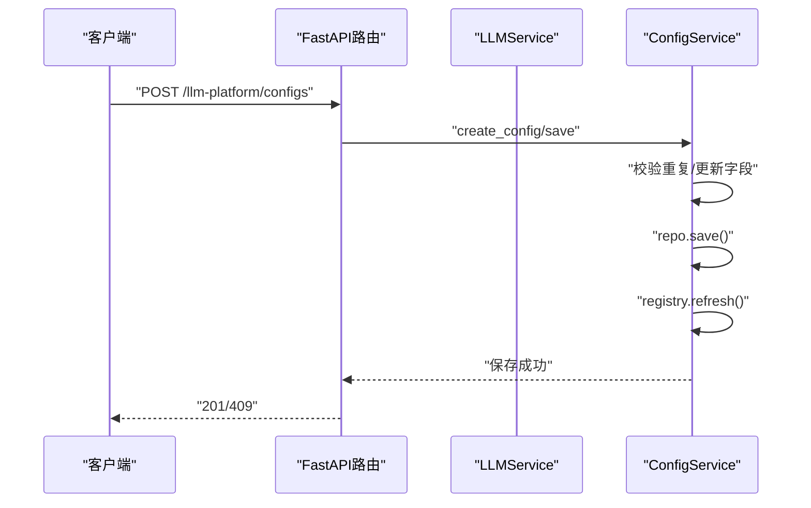
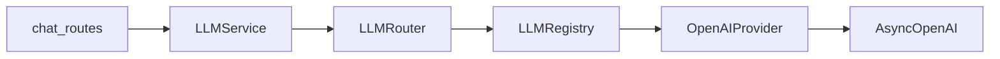

# LLM服务核心

<cite>
**本文引用的文件**
- [src/modules/llm_platform/domain/entities/llm_config.py](file://src/modules/llm_platform/domain/entities/llm_config.py)
- [src/modules/llm_platform/domain/ports/llm.py](file://src/modules/llm_platform/domain/ports/llm.py)
- [src/modules/llm_platform/infrastructure/adapters/base.py](file://src/modules/llm_platform/infrastructure/adapters/base.py)
- [src/modules/llm_platform/infrastructure/adapters/openai.py](file://src/modules/llm_platform/infrastructure/adapters/openai.py)
- [src/modules/llm_platform/infrastructure/router.py](file://src/modules/llm_platform/infrastructure/router.py)
- [src/modules/llm_platform/infrastructure/registry.py](file://src/modules/llm_platform/infrastructure/registry.py)
- [src/modules/llm_platform/domain/ports/repositories/config_repo.py](file://src/modules/llm_platform/domain/ports/repositories/config_repo.py)
- [src/modules/llm_platform/infrastructure/persistence/models/llm_config_model.py](file://src/modules/llm_platform/infrastructure/persistence/models/llm_config_model.py)
- [src/modules/llm_platform/application/services/llm_service.py](file://src/modules/llm_platform/application/services/llm_service.py)
- [src/modules/llm_platform/application/services/config_service.py](file://src/modules/llm_platform/application/services/config_service.py)
- [src/modules/llm_platform/domain/exceptions.py](file://src/modules/llm_platform/domain/exceptions.py)
- [src/modules/llm_platform/presentation/rest/chat_routes.py](file://src/modules/llm_platform/presentation/rest/chat_routes.py)
- [src/modules/llm_platform/container.py](file://src/modules/llm_platform/container.py)
- [src/modules/llm_platform/infrastructure/config.py](file://src/modules/llm_platform/infrastructure/config.py)
- [scripts/add_llm_config_template.py](file://scripts/add_llm_config_template.py)
- [scripts/test_chat_api.py](file://scripts/test_chat_api.py)
- [tests/integration/test_llm_call.py](file://tests/integration/test_llm_call.py)
</cite>

## 目录
1. [简介](#简介)
2. [项目结构](#项目结构)
3. [核心组件](#核心组件)
4. [架构总览](#架构总览)
5. [详细组件分析](#详细组件分析)
6. [依赖关系分析](#依赖关系分析)
7. [性能考虑](#性能考虑)
8. [故障排查指南](#故障排查指南)
9. [结论](#结论)
10. [附录](#附录)

## 简介
本文件面向LLM平台核心功能，系统性阐述LLMService的设计架构与实现原理，覆盖以下主题：
- 模型选择算法与路由策略
- 参数配置管理与数据模型
- 响应处理流程与异常体系
- LLM端口接口设计与实现约束
- 适配器基类的通用功能（错误处理、重试与日志）
- 使用示例（模型调用、参数传递、结果解析）
- 性能优化建议与最佳实践

## 项目结构
LLM平台采用分层与领域驱动设计（DDD）组织，核心位于src/modules/llm_platform，包含：
- domain：领域模型与端口（接口）
- application：应用服务（业务用例）
- infrastructure：基础设施（适配器、注册表、仓库、配置）
- presentation：对外REST接口
- container：依赖注入与装配根

图表来源
- [src/modules/llm_platform/domain/entities/llm_config.py](file://src/modules/llm_platform/domain/entities/llm_config.py#L1-L54)
- [src/modules/llm_platform/domain/ports/llm.py](file://src/modules/llm_platform/domain/ports/llm.py#L1-L38)
- [src/modules/llm_platform/application/services/llm_service.py](file://src/modules/llm_platform/application/services/llm_service.py#L1-L63)
- [src/modules/llm_platform/application/services/config_service.py](file://src/modules/llm_platform/application/services/config_service.py#L1-L117)
- [src/modules/llm_platform/infrastructure/adapters/base.py](file://src/modules/llm_platform/infrastructure/adapters/base.py#L1-L9)
- [src/modules/llm_platform/infrastructure/adapters/openai.py](file://src/modules/llm_platform/infrastructure/adapters/openai.py#L1-L65)
- [src/modules/llm_platform/infrastructure/registry.py](file://src/modules/llm_platform/infrastructure/registry.py#L1-L104)
- [src/modules/llm_platform/infrastructure/router.py](file://src/modules/llm_platform/infrastructure/router.py#L1-L68)
- [src/modules/llm_platform/infrastructure/persistence/models/llm_config_model.py](file://src/modules/llm_platform/infrastructure/persistence/models/llm_config_model.py#L1-L59)
- [src/modules/llm_platform/presentation/rest/chat_routes.py](file://src/modules/llm_platform/presentation/rest/chat_routes.py#L1-L69)

章节来源
- [src/modules/llm_platform/domain/entities/llm_config.py](file://src/modules/llm_platform/domain/entities/llm_config.py#L1-L54)
- [src/modules/llm_platform/application/services/llm_service.py](file://src/modules/llm_platform/application/services/llm_service.py#L1-L63)
- [src/modules/llm_platform/infrastructure/router.py](file://src/modules/llm_platform/infrastructure/router.py#L1-L68)
- [src/modules/llm_platform/infrastructure/registry.py](file://src/modules/llm_platform/infrastructure/registry.py#L1-L104)
- [src/modules/llm_platform/presentation/rest/chat_routes.py](file://src/modules/llm_platform/presentation/rest/chat_routes.py#L1-L69)

## 核心组件
- LLMConfig 实体：定义模型配置的完整元数据（别名、厂商、适配器类型、API密钥、模型名、基础URL、优先级、标签、启用状态等），并提供脱敏日志输出。
- ILLMProvider 抽象端口：定义统一的异步generate接口，向上游屏蔽具体提供商差异。
- BaseLLMProvider 适配器基类：承载模型名等通用状态，继承ILLMProvider。
- OpenAIProvider 适配器：基于AsyncOpenAI实现，负责消息构建、调用与异常映射。
- LLMRouter 路由器：根据别名或标签选择候选配置，按优先级排序并尝试调用，具备失败降级与错误聚合。
- LLMRegistry 注册表：单例管理Provider实例与配置缓存，支持从仓储刷新。
- ConfigService 应用服务：封装配置的增删改查与注册表热刷新。
- REST接口：FastAPI路由，接收请求DTO，调用LLMService并返回响应。

章节来源
- [src/modules/llm_platform/domain/entities/llm_config.py](file://src/modules/llm_platform/domain/entities/llm_config.py#L1-L54)
- [src/modules/llm_platform/domain/ports/llm.py](file://src/modules/llm_platform/domain/ports/llm.py#L1-L38)
- [src/modules/llm_platform/infrastructure/adapters/base.py](file://src/modules/llm_platform/infrastructure/adapters/base.py#L1-L9)
- [src/modules/llm_platform/infrastructure/adapters/openai.py](file://src/modules/llm_platform/infrastructure/adapters/openai.py#L1-L65)
- [src/modules/llm_platform/infrastructure/router.py](file://src/modules/llm_platform/infrastructure/router.py#L1-L68)
- [src/modules/llm_platform/infrastructure/registry.py](file://src/modules/llm_platform/infrastructure/registry.py#L1-L104)
- [src/modules/llm_platform/application/services/config_service.py](file://src/modules/llm_platform/application/services/config_service.py#L1-L117)
- [src/modules/llm_platform/presentation/rest/chat_routes.py](file://src/modules/llm_platform/presentation/rest/chat_routes.py#L1-L69)

## 架构总览
下图展示从REST接口到LLMService、路由器、注册表与适配器的完整调用链路。

图表来源
- [src/modules/llm_platform/presentation/rest/chat_routes.py](file://src/modules/llm_platform/presentation/rest/chat_routes.py#L34-L69)
- [src/modules/llm_platform/application/services/llm_service.py](file://src/modules/llm_platform/application/services/llm_service.py#L25-L63)
- [src/modules/llm_platform/infrastructure/router.py](file://src/modules/llm_platform/infrastructure/router.py#L35-L68)
- [src/modules/llm_platform/infrastructure/registry.py](file://src/modules/llm_platform/infrastructure/registry.py#L93-L104)
- [src/modules/llm_platform/infrastructure/adapters/openai.py](file://src/modules/llm_platform/infrastructure/adapters/openai.py#L22-L65)

## 详细组件分析

### LLM配置实体与数据模型
- 数据结构要点
  - 标识与元信息：alias、vendor、provider_type、model_name、description
  - 连接参数：api_key（敏感）、base_url
  - 选择与调度：priority、tags、is_active
  - 时间戳：created_at、updated_at
- 日志脱敏：__repr__对api_key进行脱敏输出，避免敏感信息泄露
- ORM映射：LLMConfigModel将JSONB字段tags持久化为数组；to_entity/from_entity完成ORM与领域实体转换

图表来源
- [src/modules/llm_platform/domain/entities/llm_config.py](file://src/modules/llm_platform/domain/entities/llm_config.py#L5-L54)
- [src/modules/llm_platform/infrastructure/persistence/models/llm_config_model.py](file://src/modules/llm_platform/infrastructure/persistence/models/llm_config_model.py#L6-L59)

章节来源
- [src/modules/llm_platform/domain/entities/llm_config.py](file://src/modules/llm_platform/domain/entities/llm_config.py#L1-L54)
- [src/modules/llm_platform/infrastructure/persistence/models/llm_config_model.py](file://src/modules/llm_platform/infrastructure/persistence/models/llm_config_model.py#L1-L59)

### LLM端口接口设计
- ILLMProvider定义generate抽象方法，约束上游仅依赖该端口，不直接耦合具体提供商
- 方法签名包含prompt、可选system_message、temperature，返回字符串文本
- 异常契约：底层API不可用或调用失败映射为LLMConnectionError

图表来源
- [src/modules/llm_platform/domain/ports/llm.py](file://src/modules/llm_platform/domain/ports/llm.py#L5-L38)
- [src/modules/llm_platform/infrastructure/adapters/base.py](file://src/modules/llm_platform/infrastructure/adapters/base.py#L6-L9)
- [src/modules/llm_platform/infrastructure/adapters/openai.py](file://src/modules/llm_platform/infrastructure/adapters/openai.py#L10-L65)

章节来源
- [src/modules/llm_platform/domain/ports/llm.py](file://src/modules/llm_platform/domain/ports/llm.py#L1-L38)
- [src/modules/llm_platform/infrastructure/adapters/base.py](file://src/modules/llm_platform/infrastructure/adapters/base.py#L1-L9)
- [src/modules/llm_platform/infrastructure/adapters/openai.py](file://src/modules/llm_platform/infrastructure/adapters/openai.py#L1-L65)

### 适配器基类与OpenAI适配器
- BaseLLMProvider：持有model字段，作为适配器基类，确保各提供商实现共享统一接口
- OpenAIProvider：
  - 构造时初始化AsyncOpenAI客户端（api_key、base_url）
  - generate：构建messages（可选system_message），调用chat.completions.create，处理APIConnectionError、RateLimitError、APIError等，统一映射为LLMConnectionError
  - 日志：记录请求摘要与响应长度/预览，便于调试

图表来源
- [src/modules/llm_platform/infrastructure/adapters/openai.py](file://src/modules/llm_platform/infrastructure/adapters/openai.py#L22-L65)

章节来源
- [src/modules/llm_platform/infrastructure/adapters/base.py](file://src/modules/llm_platform/infrastructure/adapters/base.py#L1-L9)
- [src/modules/llm_platform/infrastructure/adapters/openai.py](file://src/modules/llm_platform/infrastructure/adapters/openai.py#L1-L65)

### 路由器与模型选择算法
- 选择策略
  - 指定别名：精确匹配且is_active
  - 指定标签：必须包含全部标签（AND语义），按priority升序
  - 默认：所有is_active配置按priority升序
- 调用与降级
  - 遍历候选配置，通过LLMRegistry获取Provider实例
  - 首次成功即返回；遇到LLMConnectionError记录警告并继续下一个候选
  - 若所有候选均失败，抛出NoAvailableModelError，携带最后错误

图表来源
- [src/modules/llm_platform/infrastructure/router.py](file://src/modules/llm_platform/infrastructure/router.py#L15-L33)

章节来源
- [src/modules/llm_platform/infrastructure/router.py](file://src/modules/llm_platform/infrastructure/router.py#L1-L68)

### 注册表与配置仓储
- LLMRegistry
  - 单例：保证全局Provider与配置缓存一致性
  - refresh：从仓储获取激活配置，逐个注册Provider；异常仅记录不中断
  - _register：根据provider_type实例化对应Provider（当前支持openai）
  - get_provider/get_all_configs：提供查询能力
- ILLMConfigRepository（抽象）
  - 定义get_all、get_active_configs、get_by_alias、save、delete_by_alias
- LLMConfigModel（ORM）
  - 字段映射与to_entity/from_entity转换

图表来源
- [src/modules/llm_platform/infrastructure/registry.py](file://src/modules/llm_platform/infrastructure/registry.py#L11-L104)
- [src/modules/llm_platform/domain/ports/repositories/config_repo.py](file://src/modules/llm_platform/domain/ports/repositories/config_repo.py#L5-L68)
- [src/modules/llm_platform/infrastructure/persistence/models/llm_config_model.py](file://src/modules/llm_platform/infrastructure/persistence/models/llm_config_model.py#L23-L59)

章节来源
- [src/modules/llm_platform/infrastructure/registry.py](file://src/modules/llm_platform/infrastructure/registry.py#L1-L104)
- [src/modules/llm_platform/domain/ports/repositories/config_repo.py](file://src/modules/llm_platform/domain/ports/repositories/config_repo.py#L1-L68)
- [src/modules/llm_platform/infrastructure/persistence/models/llm_config_model.py](file://src/modules/llm_platform/infrastructure/persistence/models/llm_config_model.py#L1-L59)

### 应用服务与REST接口
- LLMService
  - 门面角色：封装路由与注册表，向上游提供统一generate接口
  - 参数：prompt、可选system_message、temperature、可选alias或tags
  - 错误：捕获异常并记录日志后重新抛出
- ConfigService
  - 提供配置的增删改查与注册表刷新，确保热更新
- REST接口chat_routes
  - ChatRequest/ChatResponse DTO定义
  - /llm-platform/chat/generate：接收alias/tags/temperature等，调用LLMService并返回response

图表来源
- [src/modules/llm_platform/application/services/llm_service.py](file://src/modules/llm_platform/application/services/llm_service.py#L9-L63)
- [src/modules/llm_platform/application/services/config_service.py](file://src/modules/llm_platform/application/services/config_service.py#L43-L62)
- [src/modules/llm_platform/presentation/rest/chat_routes.py](file://src/modules/llm_platform/presentation/rest/chat_routes.py#L34-L69)

章节来源
- [src/modules/llm_platform/application/services/llm_service.py](file://src/modules/llm_platform/application/services/llm_service.py#L1-L63)
- [src/modules/llm_platform/application/services/config_service.py](file://src/modules/llm_platform/application/services/config_service.py#L1-L117)
- [src/modules/llm_platform/presentation/rest/chat_routes.py](file://src/modules/llm_platform/presentation/rest/chat_routes.py#L1-L69)

## 依赖关系分析
- 松耦合
  - 上游仅依赖ILLMProvider端口，不感知具体提供商
  - ConfigService与LLMRegistry解耦，通过仓储刷新
- 关键依赖链
  - chat_routes -> LLMService -> LLMRouter -> LLMRegistry -> OpenAIProvider -> AsyncOpenAI
- 循环依赖检查
  - 未见循环导入；注册表与适配器通过接口交互

图表来源
- [src/modules/llm_platform/presentation/rest/chat_routes.py](file://src/modules/llm_platform/presentation/rest/chat_routes.py#L34-L69)
- [src/modules/llm_platform/application/services/llm_service.py](file://src/modules/llm_platform/application/services/llm_service.py#L22-L23)
- [src/modules/llm_platform/infrastructure/router.py](file://src/modules/llm_platform/infrastructure/router.py#L12-L13)
- [src/modules/llm_platform/infrastructure/registry.py](file://src/modules/llm_platform/infrastructure/registry.py#L76-L81)
- [src/modules/llm_platform/infrastructure/adapters/openai.py](file://src/modules/llm_platform/infrastructure/adapters/openai.py#L17-L20)

章节来源
- [src/modules/llm_platform/presentation/rest/chat_routes.py](file://src/modules/llm_platform/presentation/rest/chat_routes.py#L1-L69)
- [src/modules/llm_platform/application/services/llm_service.py](file://src/modules/llm_platform/application/services/llm_service.py#L1-L63)
- [src/modules/llm_platform/infrastructure/router.py](file://src/modules/llm_platform/infrastructure/router.py#L1-L68)
- [src/modules/llm_platform/infrastructure/registry.py](file://src/modules/llm_platform/infrastructure/registry.py#L1-L104)
- [src/modules/llm_platform/infrastructure/adapters/openai.py](file://src/modules/llm_platform/infrastructure/adapters/openai.py#L1-L65)

## 性能考虑
- 路由与选择
  - 优先级排序与标签匹配为O(n)扫描，建议合理设置标签数量与候选规模
  - 建议在高频场景下缓存常用alias对应的Provider实例
- 调用与重试
  - 当前实现为顺序尝试，失败即降级；对于高可用需求可引入并发尝试与指数退避
- 日志与可观测性
  - 响应预览与长度统计有助于快速定位问题；建议在生产环境控制日志级别
- 连接与超时
  - AsyncOpenAI默认超时策略由SDK管理；建议结合业务场景配置合理的超时与重试上限
- 数据库刷新
  - registry.refresh为全量重建，建议在配置变更时触发，避免频繁刷新

## 故障排查指南
- 常见异常与处理
  - LLMConnectionError：网络连接/速率限制/API错误，表现为503；检查API密钥、网络连通性与配额
  - NoAvailableModelError：无可用模型或全部候选失败；检查is_active、tags匹配与优先级
  - ConfigNotFoundException/DuplicateConfigException：配置不存在或重复；检查alias唯一性与仓储状态
- 日志定位
  - OpenAIProvider记录请求摘要与响应预览；LLMRouter记录路由与失败降级
  - LLMService与chat_routes分别记录入口与异常
- 快速验证
  - 使用scripts/test_chat_api.py进行端到端测试
  - 使用scripts/add_llm_config_template.py添加示例配置
  - 运行tests/integration/test_llm_call.py进行集成测试

章节来源
- [src/modules/llm_platform/domain/exceptions.py](file://src/modules/llm_platform/domain/exceptions.py#L31-L61)
- [src/modules/llm_platform/infrastructure/adapters/openai.py](file://src/modules/llm_platform/infrastructure/adapters/openai.py#L56-L64)
- [src/modules/llm_platform/infrastructure/router.py](file://src/modules/llm_platform/infrastructure/router.py#L48-L67)
- [src/modules/llm_platform/application/services/llm_service.py](file://src/modules/llm_platform/application/services/llm_service.py#L49-L62)
- [src/modules/llm_platform/presentation/rest/chat_routes.py](file://src/modules/llm_platform/presentation/rest/chat_routes.py#L54-L68)
- [scripts/test_chat_api.py](file://scripts/test_chat_api.py#L1-L37)
- [scripts/add_llm_config_template.py](file://scripts/add_llm_config_template.py#L1-L72)
- [tests/integration/test_llm_call.py](file://tests/integration/test_llm_call.py#L1-L106)

## 结论
本LLM平台通过清晰的分层与端口抽象，实现了跨提供商的统一调用与灵活路由。核心优势包括：
- 以LLMConfig为中心的配置模型与ORM映射
- 基于别名/标签的路由策略与优先级降级
- 适配器基类与OpenAI适配器的可扩展设计
- 应用服务与REST接口的简洁易用
建议在生产环境中结合日志与监控完善可观测性，并针对高可用需求引入并发与重试策略。

## 附录

### 使用示例（路径指引）
- 添加配置模板
  - 使用脚本添加示例配置：[scripts/add_llm_config_template.py](file://scripts/add_llm_config_template.py#L9-L31)
- 端到端测试
  - 使用HTTP脚本测试聊天接口：[scripts/test_chat_api.py](file://scripts/test_chat_api.py#L6-L26)
- 集成测试
  - 遍历激活模型进行真实调用：[tests/integration/test_llm_call.py](file://tests/integration/test_llm_call.py#L17-L72)
  - 标签路由测试：[tests/integration/test_llm_call.py](file://tests/integration/test_llm_call.py#L73-L106)
- 代码调用参考
  - 服务层调用入口：[src/modules/llm_platform/application/services/llm_service.py](file://src/modules/llm_platform/application/services/llm_service.py#L25-L63)
  - REST接口定义：[src/modules/llm_platform/presentation/rest/chat_routes.py](file://src/modules/llm_platform/presentation/rest/chat_routes.py#L34-L69)

### 最佳实践
- 配置管理
  - 使用ConfigService进行配置的增删改查与热刷新
  - 在容器初始化时设置仓储，确保注册表可从数据库加载
- 路由策略
  - 为不同场景（速度、成本、语言）设置标签，配合priority实现智能选择
- 错误处理
  - 统一捕获LLMConnectionError并进行降级或重试
  - 对外部API错误进行分类与告警
- 安全
  - 避免在日志中打印原始api_key；实体__repr__已做脱敏
- 可观测性
  - 记录请求摘要、响应长度与预览，便于问题定位

章节来源
- [src/modules/llm_platform/application/services/config_service.py](file://src/modules/llm_platform/application/services/config_service.py#L43-L62)
- [src/modules/llm_platform/container.py](file://src/modules/llm_platform/container.py#L30-L51)
- [src/modules/llm_platform/domain/entities/llm_config.py](file://src/modules/llm_platform/domain/entities/llm_config.py#L40-L53)
- [src/modules/llm_platform/infrastructure/adapters/openai.py](file://src/modules/llm_platform/infrastructure/adapters/openai.py#L38-L54)