# LLM适配器注册表

<cite>
**本文引用的文件**
- [src/modules/llm_platform/infrastructure/registry.py](file://src/modules/llm_platform/infrastructure/registry.py)
- [src/modules/llm_platform/infrastructure/adapters/base.py](file://src/modules/llm_platform/infrastructure/adapters/base.py)
- [src/modules/llm_platform/infrastructure/adapters/openai.py](file://src/modules/llm_platform/infrastructure/adapters/openai.py)
- [src/modules/llm_platform/domain/entities/llm_config.py](file://src/modules/llm_platform/domain/entities/llm_config.py)
- [src/modules/llm_platform/application/services/llm_service.py](file://src/modules/llm_platform/application/services/llm_service.py)
- [src/modules/llm_platform/domain/ports/llm.py](file://src/modules/llm_platform/domain/ports/llm.py)
- [src/modules/llm_platform/infrastructure/router.py](file://src/modules/llm_platform/infrastructure/router.py)
- [src/modules/llm_platform/container.py](file://src/modules/llm_platform/container.py)
- [src/modules/llm_platform/application/services/startup.py](file://src/modules/llm_platform/application/services/startup.py)
- [src/modules/llm_platform/domain/exceptions.py](file://src/modules/llm_platform/domain/exceptions.py)
- [src/modules/llm_platform/infrastructure/config.py](file://src/modules/llm_platform/infrastructure/config.py)
- [src/modules/llm_platform/presentation/rest/chat_routes.py](file://src/modules/llm_platform/presentation/rest/chat_routes.py)
- [tests/integration/test_llm_call.py](file://tests/integration/test_llm_call.py)
- [scripts/add_llm_config_template.py](file://scripts/add_llm_config_template.py)
- [src/shared/infrastructure/logging.py](file://src/shared/infrastructure/logging.py)
</cite>

## 目录
1. [引言](#引言)
2. [项目结构](#项目结构)
3. [核心组件](#核心组件)
4. [架构总览](#架构总览)
5. [详细组件分析](#详细组件分析)
6. [依赖关系分析](#依赖关系分析)
7. [性能考量](#性能考量)
8. [故障排查指南](#故障排查指南)
9. [结论](#结论)
10. [附录](#附录)

## 引言
本技术文档围绕LLM适配器注册表系统展开，系统采用“接口抽象 + 适配器 + 注册表 + 路由 + 门面服务”的分层设计，目标是：
- 统一对外的LLM调用接口，屏蔽不同模型供应商的差异；
- 支持从数据库动态加载配置并实例化适配器；
- 提供基于别名与标签的路由与降级能力；
- 通过单例注册表实现全局共享与热更新；
- 提供清晰的错误分类与可追踪的日志。

## 项目结构
LLM平台位于独立的有界上下文内，核心目录与职责如下：
- domain：领域模型与端口（接口定义）
- application：应用服务（门面、配置管理、启动逻辑）
- infrastructure：基础设施（适配器、注册表、路由器、仓储、配置）
- presentation：对外接口（REST路由）
- tests：集成测试
- scripts：配置模板脚本

图表来源
- [src/modules/llm_platform/domain/ports/llm.py](file://src/modules/llm_platform/domain/ports/llm.py#L5-L38)
- [src/modules/llm_platform/domain/entities/llm_config.py](file://src/modules/llm_platform/domain/entities/llm_config.py#L6-L54)
- [src/modules/llm_platform/application/services/llm_service.py](file://src/modules/llm_platform/application/services/llm_service.py#L9-L63)
- [src/modules/llm_platform/application/services/config_service.py](file://src/modules/llm_platform/application/services/config_service.py#L8-L117)
- [src/modules/llm_platform/application/services/startup.py](file://src/modules/llm_platform/application/services/startup.py#L11-L29)
- [src/modules/llm_platform/infrastructure/registry.py](file://src/modules/llm_platform/infrastructure/registry.py#L11-L104)
- [src/modules/llm_platform/infrastructure/router.py](file://src/modules/llm_platform/infrastructure/router.py#L11-L68)
- [src/modules/llm_platform/infrastructure/adapters/base.py](file://src/modules/llm_platform/infrastructure/adapters/base.py#L6-L9)
- [src/modules/llm_platform/infrastructure/adapters/openai.py](file://src/modules/llm_platform/infrastructure/adapters/openai.py#L10-L65)
- [src/modules/llm_platform/infrastructure/config.py](file://src/modules/llm_platform/infrastructure/config.py#L10-L27)
- [src/modules/llm_platform/presentation/rest/chat_routes.py](file://src/modules/llm_platform/presentation/rest/chat_routes.py#L1-L69)

章节来源
- [src/modules/llm_platform/infrastructure/registry.py](file://src/modules/llm_platform/infrastructure/registry.py#L11-L104)
- [src/modules/llm_platform/application/services/llm_service.py](file://src/modules/llm_platform/application/services/llm_service.py#L9-L63)
- [src/modules/llm_platform/infrastructure/router.py](file://src/modules/llm_platform/infrastructure/router.py#L11-L68)
- [src/modules/llm_platform/infrastructure/adapters/openai.py](file://src/modules/llm_platform/infrastructure/adapters/openai.py#L10-L65)
- [src/modules/llm_platform/domain/entities/llm_config.py](file://src/modules/llm_platform/domain/entities/llm_config.py#L6-L54)

## 核心组件
- 接口抽象 ILLMProvider：定义统一的异步生成接口，约束所有适配器必须实现的契约。
- 适配器基类 BaseLLMProvider：集中存放通用字段（如模型名），减少重复实现。
- OpenAI适配器 OpenAIProvider：封装AsyncOpenAI客户端，负责参数映射与响应转换，统一异常为业务异常。
- 注册表 LLMRegistry：单例管理Provider实例与配置，支持从数据库刷新。
- 路由器 LLMRouter：根据别名或标签选择候选配置，按优先级排序并执行调用，具备失败降级能力。
- 门面服务 LLMService：对外统一入口，封装注册表与路由器。
- 应用服务 ConfigService：负责配置的增删改查与注册表热刷新。
- 启动服务 LLMPlatformStartup：负责从数据库加载配置并刷新注册表。
- REST路由 chat_routes：对外暴露HTTP接口，接收请求并调用门面服务。

章节来源
- [src/modules/llm_platform/domain/ports/llm.py](file://src/modules/llm_platform/domain/ports/llm.py#L5-L38)
- [src/modules/llm_platform/infrastructure/adapters/base.py](file://src/modules/llm_platform/infrastructure/adapters/base.py#L6-L9)
- [src/modules/llm_platform/infrastructure/adapters/openai.py](file://src/modules/llm_platform/infrastructure/adapters/openai.py#L10-L65)
- [src/modules/llm_platform/infrastructure/registry.py](file://src/modules/llm_platform/infrastructure/registry.py#L11-L104)
- [src/modules/llm_platform/infrastructure/router.py](file://src/modules/llm_platform/infrastructure/router.py#L11-L68)
- [src/modules/llm_platform/application/services/llm_service.py](file://src/modules/llm_platform/application/services/llm_service.py#L9-L63)
- [src/modules/llm_platform/application/services/config_service.py](file://src/modules/llm_platform/application/services/config_service.py#L8-L117)
- [src/modules/llm_platform/application/services/startup.py](file://src/modules/llm_platform/application/services/startup.py#L11-L29)
- [src/modules/llm_platform/presentation/rest/chat_routes.py](file://src/modules/llm_platform/presentation/rest/chat_routes.py#L1-L69)

## 架构总览
系统采用“依赖倒置 + 策略模式 + 单例注册表 + 路由器 + 门面服务”的组合架构：
- 上层模块仅依赖接口ILLMProvider，不感知具体实现；
- 通过注册表集中管理Provider实例，支持动态刷新；
- 路由器负责选择与降级，保证高可用；
- 门面服务对外提供统一调用入口；
- 配置服务负责配置变更与注册表热更新；
- REST路由作为外部入口，调用门面服务完成业务闭环。

图表来源
- [src/modules/llm_platform/presentation/rest/chat_routes.py](file://src/modules/llm_platform/presentation/rest/chat_routes.py#L34-L68)
- [src/modules/llm_platform/application/services/llm_service.py](file://src/modules/llm_platform/application/services/llm_service.py#L25-L62)
- [src/modules/llm_platform/infrastructure/router.py](file://src/modules/llm_platform/infrastructure/router.py#L35-L67)
- [src/modules/llm_platform/infrastructure/registry.py](file://src/modules/llm_platform/infrastructure/registry.py#L93-L103)
- [src/modules/llm_platform/infrastructure/adapters/openai.py](file://src/modules/llm_platform/infrastructure/adapters/openai.py#L22-L64)

## 详细组件分析

### 注册表 LLMRegistry（单例与注册机制）
- 设计要点
  - 单例模式：通过重写__new__确保全局唯一实例，避免多份Provider副本造成资源浪费。
  - 动态刷新：从仓储获取激活配置，逐个实例化适配器并缓存；失败不影响现有实例。
  - 注册策略：当前仅支持OpenAI适配器类型，扩展时在_register中新增分支。
  - 查询接口：按别名获取Provider实例，导出全部配置以便路由使用。
- 线程安全与并发
  - 单例创建在解释器层面保证原子性；字典读写在单线程异步事件循环中进行，无需额外锁。
  - 若未来引入多进程或多线程，建议在刷新时加互斥锁或采用不可变快照+替换策略。
- 错误处理
  - 刷新失败记录告警但不中断流程，维持旧实例可用性。
  - 未知适配器类型记录警告并跳过，避免影响其他配置。

图表来源
- [src/modules/llm_platform/infrastructure/registry.py](file://src/modules/llm_platform/infrastructure/registry.py#L11-L104)
- [src/modules/llm_platform/domain/ports/llm.py](file://src/modules/llm_platform/domain/ports/llm.py#L5-L38)
- [src/modules/llm_platform/infrastructure/adapters/openai.py](file://src/modules/llm_platform/infrastructure/adapters/openai.py#L10-L65)

章节来源
- [src/modules/llm_platform/infrastructure/registry.py](file://src/modules/llm_platform/infrastructure/registry.py#L11-L104)

### 适配器基类 BaseLLMProvider 与 OpenAI 适配器
- 基类职责
  - 统一持有model字段，便于路由与日志输出。
- OpenAI适配器
  - 参数映射：将system_message映射为messages数组首元素；temperature透传；附加reasoning_split参数。
  - 响应转换：统一返回字符串；当API返回None时转为空字符串，满足契约要求。
  - 异常处理：将网络/限流/API错误统一包装为LLMConnectionError，便于上层捕获与降级。
  - 日志记录：记录请求摘要与响应长度/预览，便于调试与审计。

```mermaid
flowchart TD
Start(["进入 generate"]) --> BuildMsg["构建消息数组<br/>system_message(可选)+prompt"]
BuildMsg --> CallAPI["调用 AsyncOpenAI.chat.completions.create"]
CallAPI --> RespOK{"响应有效?"}
RespOK --> |否| HandleErr["捕获异常并抛出 LLMConnectionError"]
RespOK --> |是| Extract["提取 choices[0].message.content"]
Extract --> Normalize["None -> 空字符串"]
Normalize --> LogResp["记录响应摘要(长度/预览)"]
LogResp --> Done(["返回结果"])
HandleErr --> Done
```

图表来源
- [src/modules/llm_platform/infrastructure/adapters/openai.py](file://src/modules/llm_platform/infrastructure/adapters/openai.py#L22-L64)

章节来源
- [src/modules/llm_platform/infrastructure/adapters/base.py](file://src/modules/llm_platform/infrastructure/adapters/base.py#L6-L9)
- [src/modules/llm_platform/infrastructure/adapters/openai.py](file://src/modules/llm_platform/infrastructure/adapters/openai.py#L10-L65)

### 路由器 LLMRouter（选择、排序与降级）
- 选择策略
  - 指定别名：精确匹配且仅选择激活配置。
  - 指定标签：要求配置包含全部标签，按优先级升序排列。
  - 默认策略：选择所有激活配置，按优先级升序排列。
- 调用与降级
  - 遍历候选配置，尝试调用对应Provider的generate。
  - 遇到LLMConnectionError记录警告并继续下一个候选，直至成功或全部失败。
  - 全部失败时抛出NoAvailableModelError，携带最后一次错误原因。

图表来源
- [src/modules/llm_platform/infrastructure/router.py](file://src/modules/llm_platform/infrastructure/router.py#L15-L67)

章节来源
- [src/modules/llm_platform/infrastructure/router.py](file://src/modules/llm_platform/infrastructure/router.py#L11-L68)

### 门面服务 LLMService（统一入口）
- 角色定位：向上游模块提供统一的generate接口，隐藏注册表与路由器细节。
- 生命周期：在构造时注入或使用默认单例注册表，并创建路由器。
- 错误处理：捕获异常并记录，向上抛出，保持调用链清晰。

章节来源
- [src/modules/llm_platform/application/services/llm_service.py](file://src/modules/llm_platform/application/services/llm_service.py#L9-L63)

### 配置管理与启动流程
- 配置实体 LLMConfig：包含别名、供应商、适配器类型、API密钥、模型名、基础URL、优先级、标签、状态等。
- 配置服务 ConfigService：提供查询、创建、更新、删除与手动刷新注册表的能力；每次变更后自动刷新。
- 启动服务 LLMPlatformStartup：在应用启动时打开数据库会话，通过容器获取注册表并执行refresh。

图表来源
- [src/modules/llm_platform/application/services/startup.py](file://src/modules/llm_platform/application/services/startup.py#L14-L28)
- [src/modules/llm_platform/container.py](file://src/modules/llm_platform/container.py#L30-L38)
- [src/modules/llm_platform/infrastructure/registry.py](file://src/modules/llm_platform/infrastructure/registry.py#L36-L63)

章节来源
- [src/modules/llm_platform/domain/entities/llm_config.py](file://src/modules/llm_platform/domain/entities/llm_config.py#L6-L54)
- [src/modules/llm_platform/application/services/config_service.py](file://src/modules/llm_platform/application/services/config_service.py#L8-L117)
- [src/modules/llm_platform/application/services/startup.py](file://src/modules/llm_platform/application/services/startup.py#L11-L29)
- [src/modules/llm_platform/container.py](file://src/modules/llm_platform/container.py#L24-L68)

### REST接口 chat_routes（对外入口）
- 请求DTO：包含prompt、system_message、alias、tags、temperature。
- 响应DTO：包含response字段。
- 依赖注入：通过get_llm_service获取LLMService实例。
- 异常映射：捕获异常并映射为HTTP 500。

章节来源
- [src/modules/llm_platform/presentation/rest/chat_routes.py](file://src/modules/llm_platform/presentation/rest/chat_routes.py#L1-L69)

## 依赖关系分析
- 依赖倒置
  - 上层模块仅依赖接口ILLMProvider，不依赖具体适配器实现。
- 适配器扩展点
  - 新增适配器：继承BaseLLMProvider，实现generate；在注册表的_register中增加分支。
- 注册表耦合
  - 与仓储接口ILLMConfigRepository耦合，用于动态加载配置。
- 路由器耦合
  - 与注册表耦合，依赖其提供的配置与Provider实例。
- 门面服务耦合
  - 与路由器耦合，向上提供统一接口。

图表来源
- [src/modules/llm_platform/presentation/rest/chat_routes.py](file://src/modules/llm_platform/presentation/rest/chat_routes.py#L31-L32)
- [src/modules/llm_platform/application/services/llm_service.py](file://src/modules/llm_platform/application/services/llm_service.py#L15-L23)
- [src/modules/llm_platform/infrastructure/router.py](file://src/modules/llm_platform/infrastructure/router.py#L12-L13)
- [src/modules/llm_platform/infrastructure/registry.py](file://src/modules/llm_platform/infrastructure/registry.py#L27-L34)
- [src/modules/llm_platform/domain/ports/llm.py](file://src/modules/llm_platform/domain/ports/llm.py#L5-L38)

章节来源
- [src/modules/llm_platform/domain/ports/llm.py](file://src/modules/llm_platform/domain/ports/llm.py#L5-L38)
- [src/modules/llm_platform/infrastructure/registry.py](file://src/modules/llm_platform/infrastructure/registry.py#L11-L104)
- [src/modules/llm_platform/infrastructure/router.py](file://src/modules/llm_platform/infrastructure/router.py#L11-L68)
- [src/modules/llm_platform/application/services/llm_service.py](file://src/modules/llm_platform/application/services/llm_service.py#L9-L63)

## 性能考量
- 单例注册表
  - 避免重复实例化适配器，降低内存与连接开销；注意在多进程场景下的隔离。
- 字典访问
  - Provider与配置均以字典存储，查找复杂度O(1)，满足高频调用需求。
- 异步I/O
  - 适配器与路由均采用异步实现，充分利用事件循环提升吞吐。
- 热更新策略
  - refresh为全量重建，适合配置变更频率较低的场景；若配置频繁变动，可考虑增量更新或版本化快照。
- 日志成本
  - 响应预览与请求摘要有助于调试，但需关注长文本日志的性能影响，必要时按环境调整。

## 故障排查指南
- 常见异常与定位
  - LLMConnectionError：网络连接/速率限制/API错误，通常来自适配器层；检查API密钥、基础URL与网络连通性。
  - NoAvailableModelError：无可用模型或全部候选失败；检查配置是否激活、标签匹配、Provider实例是否正确注册。
  - ConfigNotFoundException/DuplicateConfigException：配置不存在或重复；检查别名与仓储一致性。
- 调试技巧
  - 启用详细日志：确认Loguru配置接管标准logging，查看请求摘要与响应长度。
  - 集成测试验证：使用集成测试覆盖真实调用路径，验证路由与降级行为。
  - 配置模板：使用脚本快速添加示例配置，便于本地联调。
- 关键日志位置
  - 适配器生成日志：记录请求摘要与响应预览。
  - 注册表刷新日志：记录加载数量与警告信息。
  - 路由器降级日志：记录失败模型与最后错误。

章节来源
- [src/modules/llm_platform/domain/exceptions.py](file://src/modules/llm_platform/domain/exceptions.py#L31-L61)
- [src/modules/llm_platform/infrastructure/adapters/openai.py](file://src/modules/llm_platform/infrastructure/adapters/openai.py#L37-L64)
- [src/modules/llm_platform/infrastructure/registry.py](file://src/modules/llm_platform/infrastructure/registry.py#L45-L63)
- [src/modules/llm_platform/infrastructure/router.py](file://src/modules/llm_platform/infrastructure/router.py#L48-L67)
- [src/shared/infrastructure/logging.py](file://src/shared/infrastructure/logging.py#L31-L74)
- [tests/integration/test_llm_call.py](file://tests/integration/test_llm_call.py#L17-L106)

## 结论
本系统通过清晰的分层与接口抽象，实现了对多模型供应商的统一接入与动态管理。注册表单例、路由器降级与门面服务共同保障了系统的稳定性与易用性。建议在扩展新供应商时遵循现有适配器模式与注册流程，确保一致的错误处理与可观测性。

## 附录

### 适配器扩展指南（新模型供应商集成步骤）
- 步骤
  - 新建适配器类：继承BaseLLMProvider，实现generate接口，处理参数映射与响应转换。
  - 注册表扩展：在LLMRegistry._register中增加对新适配器类型的分支，按配置构造实例。
  - 配置实体：在LLMConfig中补充必要的字段（如基础URL、模型名等）。
  - 异常映射：将底层异常统一映射为LLMConnectionError或其他业务异常。
  - 集成测试：编写单元/集成测试，验证调用路径与降级行为。
- 最佳实践
  - 保持generate接口语义一致，返回字符串，避免None。
  - 在日志中记录请求摘要与响应长度，便于问题定位。
  - 严格区分网络/限流与业务错误，避免误降级。
  - 遵循单例注册表与异步I/O原则，避免阻塞事件循环。

章节来源
- [src/modules/llm_platform/infrastructure/adapters/base.py](file://src/modules/llm_platform/infrastructure/adapters/base.py#L6-L9)
- [src/modules/llm_platform/infrastructure/registry.py](file://src/modules/llm_platform/infrastructure/registry.py#L64-L91)
- [src/modules/llm_platform/domain/entities/llm_config.py](file://src/modules/llm_platform/domain/entities/llm_config.py#L6-L54)
- [src/modules/llm_platform/domain/exceptions.py](file://src/modules/llm_platform/domain/exceptions.py#L31-L61)

### 测试策略与调试技巧
- 测试策略
  - 单元测试：针对适配器与路由器的关键分支进行断言（如参数映射、异常路径）。
  - 集成测试：使用数据库中的激活配置进行真实调用，验证路由与降级。
  - 性能测试：评估高并发下的响应延迟与错误率。
- 调试技巧
  - 使用脚本添加示例配置，快速验证不同供应商与标签路由。
  - 开启详细日志，关注请求摘要与响应预览。
  - 在容器中注入空仓储或Mock仓储，隔离数据库依赖。

章节来源
- [tests/integration/test_llm_call.py](file://tests/integration/test_llm_call.py#L17-L106)
- [scripts/add_llm_config_template.py](file://scripts/add_llm_config_template.py#L9-L72)
- [src/shared/infrastructure/logging.py](file://src/shared/infrastructure/logging.py#L31-L74)