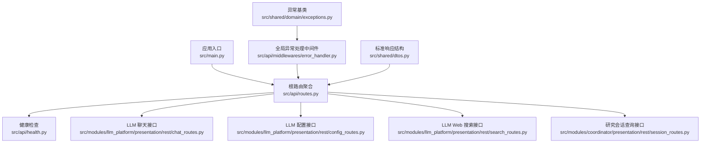
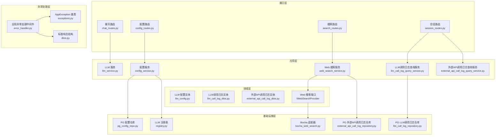
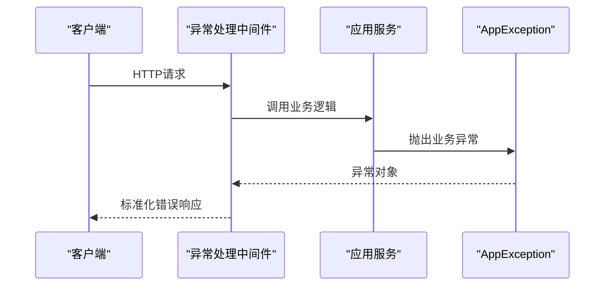
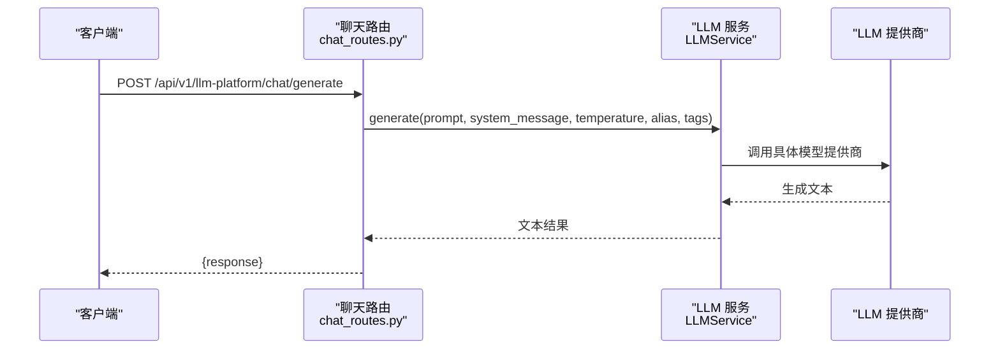
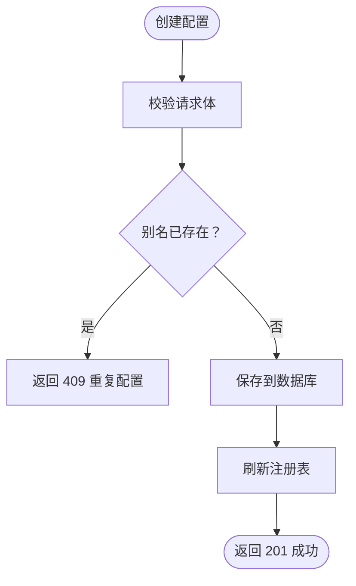
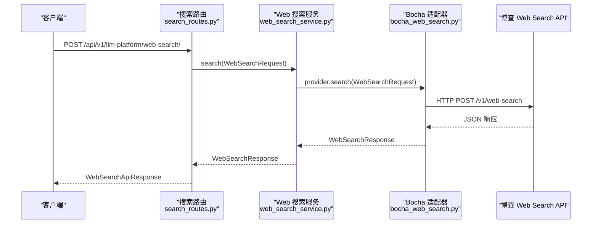
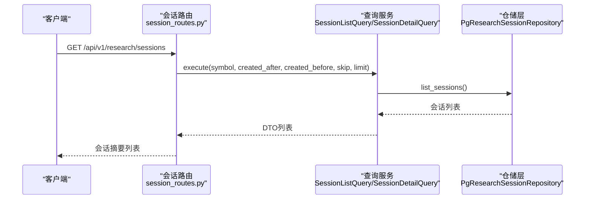
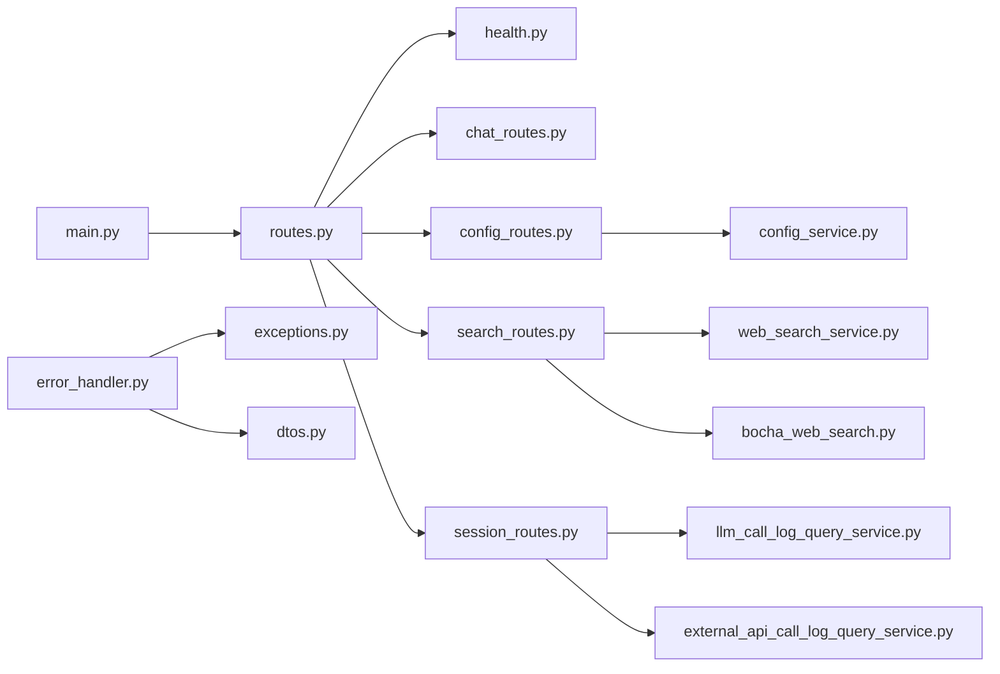

# REST API接口

<cite>
**本文档引用的文件**
- [src/main.py](file://src/main.py)
- [src/api/routes.py](file://src/api/routes.py)
- [src/api/health.py](file://src/api/health.py)
- [src/api/middlewares/error_handler.py](file://src/api/middlewares/error_handler.py)
- [src/shared/domain/exceptions.py](file://src/shared/domain/exceptions.py)
- [src/shared/dtos.py](file://src/shared/dtos.py)
- [src/modules/llm_platform/presentation/rest/chat_routes.py](file://src/modules/llm_platform/presentation/rest/chat_routes.py)
- [src/modules/llm_platform/presentation/rest/config_routes.py](file://src/modules/llm_platform/presentation/rest/config_routes.py)
- [src/modules/llm_platform/presentation/rest/search_routes.py](file://src/modules/llm_platform/presentation/rest/search_routes.py)
- [src/modules/coordinator/presentation/rest/session_routes.py](file://src/modules/coordinator/presentation/rest/session_routes.py)
- [src/modules/llm_platform/application/services/config_service.py](file://src/modules/llm_platform/application/services/config_service.py)
- [src/modules/llm_platform/application/services/web_search_service.py](file://src/modules/llm_platform/application/services/web_search_service.py)
- [src/modules/llm_platform/application/queries/llm_call_log_query_service.py](file://src/modules/llm_platform/application/queries/llm_call_log_query_service.py)
- [src/shared/application/queries/external_api_call_log_query_service.py](file://src/shared/application/queries/external_api_call_log_query_service.py)
- [src/modules/llm_platform/domain/entities/llm_config.py](file://src/modules/llm_platform/domain/entities/llm_config.py)
- [src/modules/llm_platform/infrastructure/adapters/bocha_web_search.py](file://src/modules/llm_platform/infrastructure/adapters/bocha_web_search.py)
- [src/modules/llm_platform/infrastructure/persistence/repositories/llm_call_log_repository.py](file://src/modules/llm_platform/infrastructure/persistence/repositories/llm_call_log_repository.py)
- [src/shared/infrastructure/persistence/external_api_call_log_repository.py](file://src/shared/infrastructure/persistence/external_api_call_log_repository.py)
- [src/modules/coordinator/application/dtos/session_dtos.py](file://src/modules/coordinator/application/dtos/session_dtos.py)
- [src/modules/coordinator/application/queries/session_list_query.py](file://src/modules/coordinator/application/queries/session_list_query.py)
- [src/modules/coordinator/application/queries/session_detail_query.py](file://src/modules/coordinator/application/queries/session_detail_query.py)
- [src/modules/llm_platform/infrastructure/config.py](file://src/modules/llm_platform/infrastructure/config.py)
- [src/shared/config.py](file://src/shared/config.py)
- [alembic/versions/c0ff00000003_execution_tracking_and_reports.py](file://alembic/versions/c0ff00000003_execution_tracking_and_reports.py)
- [scripts/test_chat_api.py](file://scripts/test_chat_api.py)
- [tests/llm_platform/test_web_search_routes.py](file://tests/llm_platform/test_web_search_routes.py)
- [tests/llm_platform/test_web_search.py](file://tests/llm_platform/test_web_search.py)
</cite>

## 更新摘要
**所做更改**
- 更新错误处理机制，采用统一的BadRequestException异常处理和简化的服务响应结构
- 新增全局异常处理中间件，统一处理AppException和系统异常
- 更新架构图以反映新的异常处理和响应结构
- 新增标准响应结构定义，包括BaseResponse和ErrorResponse
- 更新故障排查指南，包含新的异常处理机制

## 目录
1. [简介](#简介)
2. [项目结构](#项目结构)
3. [核心组件](#核心组件)
4. [架构总览](#架构总览)
5. [详细组件分析](#详细组件分析)
6. [依赖关系分析](#依赖关系分析)
7. [性能考虑](#性能考虑)
8. [故障排查指南](#故障排查指南)
9. [结论](#结论)
10. [附录](#附录)

## 简介
本文件为 LLM 平台的 REST API 接口文档，涵盖以下内容：
- 聊天接口：HTTP 方法、URL 模式、请求/响应格式、参数校验与错误码
- 配置管理接口：CRUD 操作的完整 API 规范与数据模型
- Web 搜索接口：实现原理、搜索参数、结果格式与错误处理
- 研究会话查询接口：会话列表、详情和关联日志查询的完整规范
- 执行追踪与报告接口：LLM调用日志和外部API调用日志的查询功能
- 异常处理机制：统一的BadRequestException错误处理和简化的服务响应结构
- 认证机制：当前实现未内置认证，需结合部署层策略
- 版本控制：基于 API 前缀 /api/v1 的版本化路径
- 速率限制与安全：当前未实现内置限流，建议结合网关或中间件
- 使用示例：请求构造、响应解析与错误处理
- 客户端集成指南与最佳实践

## 项目结构
后端采用 FastAPI，API 路由通过统一的根路由器聚合，LLM 平台相关路由位于 /api/v1/llm-platform 下，研究协调器路由位于 /api/v1/research 下，健康检查位于 /api/v1/health。新增全局异常处理中间件统一处理所有异常。

**图表来源**
- [src/main.py](file://src/main.py#L1-L75)
- [src/api/routes.py](file://src/api/routes.py#L1-L13)
- [src/api/middlewares/error_handler.py](file://src/api/middlewares/error_handler.py#L1-L46)
- [src/shared/dtos.py](file://src/shared/dtos.py#L1-L32)
- [src/shared/domain/exceptions.py](file://src/shared/domain/exceptions.py#L1-L65)

**章节来源**
- [src/main.py](file://src/main.py#L1-L75)
- [src/api/routes.py](file://src/api/routes.py#L1-L13)
- [src/api/middlewares/error_handler.py](file://src/api/middlewares/error_handler.py#L1-L46)
- [src/shared/dtos.py](file://src/shared/dtos.py#L1-L32)
- [src/shared/domain/exceptions.py](file://src/shared/domain/exceptions.py#L1-L65)

## 核心组件
- 应用入口与中间件：CORS、全局异常处理、启动/关闭事件
- 路由聚合：health、data_engineering、llm_platform、coordinator、research
- LLM 平台子模块：聊天、配置、Web 搜索三类接口
- 研究协调器子模块：会话查询、LLM调用日志、外部API调用日志查询
- 异常处理体系：统一的AppException基类和BadRequestException错误处理
- 标准响应结构：BaseResponse和ErrorResponse的标准化输出格式
- 配置体系：共享配置与模块专属配置分离
- 执行追踪系统：新增的四张表支持完整的执行追踪和报告功能

**章节来源**
- [src/main.py](file://src/main.py#L1-L75)
- [src/api/routes.py](file://src/api/routes.py#L1-L13)
- [src/api/middlewares/error_handler.py](file://src/api/middlewares/error_handler.py#L1-L46)
- [src/shared/domain/exceptions.py](file://src/shared/domain/exceptions.py#L1-L65)
- [src/shared/dtos.py](file://src/shared/dtos.py#L1-L32)
- [src/shared/config.py](file://src/shared/config.py#L1-L68)
- [src/modules/llm_platform/infrastructure/config.py](file://src/modules/llm_platform/infrastructure/config.py#L1-L27)

## 架构总览
LLM 平台接口遵循分层架构：Presentation（路由与 DTO）、Application（应用服务）、Domain（实体与端口）、Infrastructure（适配器与持久化）。新增的全局异常处理中间件统一捕获和处理所有异常，提供标准化的错误响应格式。Web 搜索通过适配器模式对接第三方服务，配置管理通过注册表热更新。

**图表来源**
- [src/modules/llm_platform/presentation/rest/chat_routes.py](file://src/modules/llm_platform/presentation/rest/chat_routes.py#L1-L69)
- [src/modules/llm_platform/presentation/rest/config_routes.py](file://src/modules/llm_platform/presentation/rest/config_routes.py#L1-L145)
- [src/modules/llm_platform/presentation/rest/search_routes.py](file://src/modules/llm_platform/presentation/rest/search_routes.py#L1-L158)
- [src/modules/coordinator/presentation/rest/session_routes.py](file://src/modules/coordinator/presentation/rest/session_routes.py#L1-L149)
- [src/modules/llm_platform/application/services/config_service.py](file://src/modules/llm_platform/application/services/config_service.py#L1-L117)
- [src/modules/llm_platform/application/services/web_search_service.py](file://src/modules/llm_platform/application/services/web_search_service.py#L1-L123)
- [src/modules/llm_platform/application/queries/llm_call_log_query_service.py](file://src/modules/llm_platform/application/queries/llm_call_log_query_service.py#L1-L21)
- [src/shared/application/queries/external_api_call_log_query_service.py](file://src/shared/application/queries/external_api_call_log_query_service.py#L1-L20)
- [src/modules/llm_platform/domain/entities/llm_config.py](file://src/modules/llm_platform/domain/entities/llm_config.py#L1-L54)
- [src/modules/llm_platform/infrastructure/adapters/bocha_web_search.py](file://src/modules/llm_platform/infrastructure/adapters/bocha_web_search.py#L1-L190)
- [src/modules/llm_platform/infrastructure/persistence/repositories/llm_call_log_repository.py](file://src/modules/llm_platform/infrastructure/persistence/repositories/llm_call_log_repository.py#L1-L76)
- [src/shared/infrastructure/persistence/external_api_call_log_repository.py](file://src/shared/infrastructure/persistence/external_api_call_log_repository.py#L47-L63)
- [src/api/middlewares/error_handler.py](file://src/api/middlewares/error_handler.py#L1-L46)
- [src/shared/domain/exceptions.py](file://src/shared/domain/exceptions.py#L1-L65)
- [src/shared/dtos.py](file://src/shared/dtos.py#L1-L32)

## 详细组件分析

### 全局异常处理机制
- 统一异常基类：AppException提供标准的消息、代码和状态码属性
- BadRequestException：专门处理400错误请求，支持详细错误信息
- 全局中间件：ErrorHandlingMiddleware统一捕获和处理所有异常
- 标准错误响应：统一的success、message、code结构，便于前端处理

**图表来源**
- [src/api/middlewares/error_handler.py](file://src/api/middlewares/error_handler.py#L1-L46)
- [src/shared/domain/exceptions.py](file://src/shared/domain/exceptions.py#L1-L65)

**章节来源**
- [src/api/middlewares/error_handler.py](file://src/api/middlewares/error_handler.py#L1-L46)
- [src/shared/domain/exceptions.py](file://src/shared/domain/exceptions.py#L1-L65)
- [src/shared/dtos.py](file://src/shared/dtos.py#L1-L32)

### 聊天接口（LLM 文本生成）
- HTTP 方法与 URL
  - POST /api/v1/llm-platform/chat/generate
- 请求体（JSON）
  - prompt: 字符串，必填
  - system_message: 字符串，可选
  - alias: 字符串，可选（按别名选择模型）
  - tags: 字符串数组，可选（按标签筛选模型）
  - temperature: 数值，范围 [0.0, 2.0]，默认 0.7
- 响应体（JSON）
  - response: 生成的文本
- 错误码
  - 500：内部服务错误（如无可用模型、调用失败）
- 参数校验
  - temperature 范围校验
  - prompt 必填
- 认证机制
  - 当前未内置认证，需结合部署层策略（如网关、反向代理）

**图表来源**
- [src/modules/llm_platform/presentation/rest/chat_routes.py](file://src/modules/llm_platform/presentation/rest/chat_routes.py#L34-L69)

**章节来源**
- [src/modules/llm_platform/presentation/rest/chat_routes.py](file://src/modules/llm_platform/presentation/rest/chat_routes.py#L1-L69)

### 配置管理接口（LLM 配置 CRUD）
- HTTP 方法与 URL
  - GET /api/v1/llm-platform/configs
  - GET /api/v1/llm-platform/configs/{alias}
  - POST /api/v1/llm-platform/configs
  - PATCH /api/v1/llm-platform/configs/{alias}
  - DELETE /api/v1/llm-platform/configs/{alias}
  - POST /api/v1/llm-platform/configs/refresh
- 请求体（JSON，除 PATCH 为部分更新）
  - alias: 字符串，必填（唯一）
  - vendor: 字符串，必填（厂商）
  - provider_type: 字符串，必填（适配器类型）
  - api_key: 字符串，必填（敏感信息，返回时脱敏显示）
  - base_url: 字符串，可选
  - model_name: 字符串，必填
  - description: 字符串，可选
  - priority: 整数，可选，默认 1
  - tags: 字符串数组，可选
  - is_active: 布尔，可选，默认 true
- 响应体（JSON）
  - id: 整数（数据库主键）
  - alias, vendor, provider_type, api_key（脱敏显示）, base_url, model_name, description, priority, tags, is_active
- 错误码
  - 404：资源不存在（读取/更新/删除）
  - 409：重复别名（创建）
  - 201：创建成功
  - 204：删除成功（无内容）
- 行为说明
  - 创建/更新/删除后自动刷新注册表，实现热更新
  - api_key 在响应中进行脱敏显示（仅保留前缀与后缀）

**图表来源**
- [src/modules/llm_platform/presentation/rest/config_routes.py](file://src/modules/llm_platform/presentation/rest/config_routes.py#L85-L102)
- [src/modules/llm_platform/application/services/config_service.py](file://src/modules/llm_platform/application/services/config_service.py#L43-L62)

**章节来源**
- [src/modules/llm_platform/presentation/rest/config_routes.py](file://src/modules/llm_platform/presentation/rest/config_routes.py#L1-L145)
- [src/modules/llm_platform/application/services/config_service.py](file://src/modules/llm_platform/application/services/config_service.py#L1-L117)
- [src/modules/llm_platform/domain/entities/llm_config.py](file://src/modules/llm_platform/domain/entities/llm_config.py#L1-L54)

### Web 搜索接口（LLM 平台 - Web Search）
- HTTP 方法与 URL
  - POST /api/v1/llm-platform/web-search/
- 请求体（JSON）
  - query: 字符串，必填
  - freshness: 字符串，可选（oneDay / oneWeek / oneMonth / oneYear / noLimit）
  - summary: 布尔，可选，默认 true
  - count: 整数，范围 [1, 50]，默认 10
- 响应体（JSON）
  - query: 查询词
  - total_matches: 匹配总数（可选）
  - results: 结果数组，每项包含
    - title: 标题
    - url: 链接
    - snippet: 摘要
    - summary: AI 摘要（可选）
    - site_name: 站点名（可选）
    - published_date: 发布日期（可选）
- 错误码
  - 422：请求参数校验失败
  - 502：上游搜索 API 错误
  - 503：服务不可用（配置缺失或网络连接失败）
  - 500：其他未预期错误
- 实现原理
  - 通过 BochaWebSearchAdapter 调用第三方 Web Search API
  - 将上游响应映射为标准 DTO，并支持摘要生成与时效过滤
- 参数校验
  - query 必填
  - count 范围校验
  - freshness 枚举值校验（由上层 DTO 描述）

**图表来源**
- [src/modules/llm_platform/presentation/rest/search_routes.py](file://src/modules/llm_platform/presentation/rest/search_routes.py#L80-L158)
- [src/modules/llm_platform/application/services/web_search_service.py](file://src/modules/llm_platform/application/services/web_search_service.py#L32-L57)
- [src/modules/llm_platform/infrastructure/adapters/bocha_web_search.py](file://src/modules/llm_platform/infrastructure/adapters/bocha_web_search.py#L51-L190)

**章节来源**
- [src/modules/llm_platform/presentation/rest/search_routes.py](file://src/modules/llm_platform/presentation/rest/search_routes.py#L1-L158)
- [src/modules/llm_platform/application/services/web_search_service.py](file://src/modules/llm_platform/application/services/web_search_service.py#L1-L123)
- [src/modules/llm_platform/infrastructure/adapters/bocha_web_search.py](file://src/modules/llm_platform/infrastructure/adapters/bocha_web_search.py#L1-L190)

### 研究会话查询接口
- HTTP 方法与 URL
  - GET /api/v1/research/sessions
  - GET /api/v1/research/sessions/{session_id}
  - GET /api/v1/research/sessions/{session_id}/llm-calls
  - GET /api/v1/research/sessions/{session_id}/api-calls
- 会话列表查询参数
  - symbol: 字符串，可选（股票代码筛选）
  - created_after: 日期时间，可选（创建时间起始）
  - created_before: 日期时间，可选（创建时间截止）
  - skip: 整数，>=0，默认 0
  - limit: 整数，范围 [1, 100]，默认 20
- 会话详情查询
  - 返回会话基本信息和所有节点执行记录
- 会话关联日志查询
  - LLM调用日志：返回精简的LLM调用记录列表
  - 外部API调用日志：返回外部API调用记录列表
- 响应体（JSON）
  - 会话摘要：id, symbol, status, created_at, completed_at, duration_ms
  - 会话详情：包含节点执行记录列表
  - LLM调用日志项：id, caller_module, caller_agent, model_name, vendor, prompt_tokens, completion_tokens, total_tokens, latency_ms, status, created_at
  - 外部API调用日志项：id, service_name, operation, status_code, latency_ms, status, created_at
- 错误码
  - 404：会话不存在（会话详情查询）
  - 200：成功（包括空列表情况）
- 实现原理
  - 通过专门的查询服务和仓储层实现
  - 支持按会话ID精确查询和按条件分页查询
  - 日志查询按创建时间升序排列

**图表来源**
- [src/modules/coordinator/presentation/rest/session_routes.py](file://src/modules/coordinator/presentation/rest/session_routes.py#L50-L71)
- [src/modules/coordinator/application/queries/session_list_query.py](file://src/modules/coordinator/application/queries/session_list_query.py#L16-L24)

**章节来源**
- [src/modules/coordinator/presentation/rest/session_routes.py](file://src/modules/coordinator/presentation/rest/session_routes.py#L1-L149)
- [src/modules/coordinator/application/queries/session_list_query.py](file://src/modules/coordinator/application/queries/session_list_query.py#L1-L44)
- [src/modules/coordinator/application/queries/session_detail_query.py](file://src/modules/coordinator/application/queries/session_detail_query.py#L1-L51)
- [src/modules/coordinator/application/dtos/session_dtos.py](file://src/modules/coordinator/application/dtos/session_dtos.py#L1-L81)

### LLM调用日志查询接口
- HTTP 方法与 URL
  - GET /api/v1/research/sessions/{session_id}/llm-calls
- 查询参数
  - session_id: UUID，路径参数（必填）
- 响应体（JSON）
  - 返回LLM调用日志项列表，按创建时间升序排列
  - 每项包含：id, caller_module, caller_agent, model_name, vendor, prompt_tokens, completion_tokens, total_tokens, latency_ms, status, created_at
- 错误码
  - 200：成功（可能返回空列表）
  - 404：会话不存在（如果查询服务返回None）
- 实现原理
  - 通过LLMCallLogQueryService按会话ID查询
  - 使用PgLLMCallLogRepository访问llm_call_logs表
  - 自动转换为LLMCallItemDTO响应模型
  - 日志按created_at升序排列

**章节来源**
- [src/modules/coordinator/presentation/rest/session_routes.py](file://src/modules/coordinator/presentation/rest/session_routes.py#L91-L120)
- [src/modules/llm_platform/application/queries/llm_call_log_query_service.py](file://src/modules/llm_platform/application/queries/llm_call_log_query_service.py#L1-L21)
- [src/modules/llm_platform/infrastructure/persistence/repositories/llm_call_log_repository.py](file://src/modules/llm_platform/infrastructure/persistence/repositories/llm_call_log_repository.py#L68-L75)

### 外部API调用日志查询接口
- HTTP 方法与 URL
  - GET /api/v1/research/sessions/{session_id}/api-calls
- 查询参数
  - session_id: UUID，路径参数（必填）
- 响应体（JSON）
  - 返回外部API调用日志项列表，按创建时间升序排列
  - 每项包含：id, service_name, operation, status_code, latency_ms, status, created_at
- 错误码
  - 200：成功（可能返回空列表）
  - 404：会话不存在（如果查询服务返回None）
- 实现原理
  - 通过ExternalAPICallLogQueryService按会话ID查询
  - 使用PgExternalAPICallLogRepository访问external_api_call_logs表
  - 自动转换为ExternalAPICallItemDTO响应模型
  - 日志按created_at升序排列

**章节来源**
- [src/modules/coordinator/presentation/rest/session_routes.py](file://src/modules/coordinator/presentation/rest/session_routes.py#L123-L148)
- [src/shared/application/queries/external_api_call_log_query_service.py](file://src/shared/application/queries/external_api_call_log_query_service.py#L1-L20)
- [src/shared/infrastructure/persistence/external_api_call_log_repository.py](file://src/shared/infrastructure/persistence/external_api_call_log_repository.py#L56-L63)

## 依赖关系分析
- 应用启动时初始化调度器与 LLM 注册表，确保配置变更即时生效
- 路由层通过依赖注入装配应用服务与仓库，保持关注点分离
- Web 搜索通过端口抽象与适配器解耦第三方实现
- 新增的全局异常处理中间件统一捕获和处理所有异常
- 标准响应结构为所有接口提供统一的输出格式
- 新增的执行追踪系统通过独立的仓储层和查询服务提供日志查询功能

**图表来源**
- [src/main.py](file://src/main.py#L1-L75)
- [src/api/routes.py](file://src/api/routes.py#L1-L13)
- [src/api/middlewares/error_handler.py](file://src/api/middlewares/error_handler.py#L1-L46)
- [src/shared/domain/exceptions.py](file://src/shared/domain/exceptions.py#L1-L65)
- [src/shared/dtos.py](file://src/shared/dtos.py#L1-L32)
- [src/modules/llm_platform/presentation/rest/config_routes.py](file://src/modules/llm_platform/presentation/rest/config_routes.py#L56-L60)
- [src/modules/llm_platform/presentation/rest/search_routes.py](file://src/modules/llm_platform/presentation/rest/search_routes.py#L66-L77)
- [src/modules/coordinator/presentation/rest/session_routes.py](file://src/modules/coordinator/presentation/rest/session_routes.py#L22-L33)

**章节来源**
- [src/main.py](file://src/main.py#L1-L75)
- [src/api/routes.py](file://src/api/routes.py#L1-L13)
- [src/api/middlewares/error_handler.py](file://src/api/middlewares/error_handler.py#L1-L46)
- [src/shared/domain/exceptions.py](file://src/shared/domain/exceptions.py#L1-L65)
- [src/shared/dtos.py](file://src/shared/dtos.py#L1-L32)

## 性能考虑
- 异步 I/O：Web 搜索使用异步 HTTP 客户端，减少阻塞
- 超时控制：适配器内置超时参数，避免长时间等待
- 日志与监控：路由与服务层均记录关键日志，便于追踪性能瓶颈
- 数据库索引优化：新增的日志表包含复合索引，支持高效的会话ID查询
- 异常处理优化：全局中间件统一处理异常，减少重复代码
- 响应结构标准化：统一的响应格式减少前端处理复杂度
- 建议
  - 对高频接口引入缓存与限流（建议在网关层或自定义中间件实现）
  - 对外部 API 调用增加重试与熔断策略
  - 对日志查询接口考虑分页和时间范围限制

## 故障排查指南
- 健康检查
  - GET /api/v1/health：检查数据库连接状态
- Web 搜索常见错误
  - 422：请求参数缺失或非法（如 query 缺失、count 超界）
  - 503：配置缺失（未设置 BOCHA_API_KEY）或网络连接失败
  - 502：上游搜索 API 返回错误
  - 500：未预期异常
- 配置管理常见问题
  - 409：别名重复
  - 404：读取/更新/删除时别名不存在
- 研究会话查询常见问题
  - 404：会话不存在（会话详情查询）
  - 200：成功（包括空列表情况）
  - 查询参数范围错误：skip必须>=0，limit必须在[1,100]范围内
- 日志查询常见问题
  - 200：成功（可能返回空列表）
  - 会话ID格式错误：必须为有效的UUID格式
  - 数据库连接问题：检查llm_call_logs和external_api_call_logs表是否存在
- 异常处理机制
  - 所有AppException都会被全局中间件捕获并转换为标准错误响应
  - BadRequestException会返回400状态码和详细错误信息
  - 未捕获的系统异常会被记录并返回通用500错误
- 数据库迁移
  - 确认四个新表已正确创建：research_sessions、node_executions、llm_call_logs、external_api_call_logs
  - 检查相应的索引是否已创建
- 测试参考
  - 端到端路由测试覆盖上述场景
  - 单元测试覆盖适配器参数传递、错误映射与防御性处理

**章节来源**
- [src/api/health.py](file://src/api/health.py#L1-L24)
- [tests/llm_platform/test_web_search_routes.py](file://tests/llm_platform/test_web_search_routes.py#L1-L135)
- [tests/llm_platform/test_web_search.py](file://tests/llm_platform/test_web_search.py#L1-L305)
- [src/api/middlewares/error_handler.py](file://src/api/middlewares/error_handler.py#L1-L46)
- [src/shared/domain/exceptions.py](file://src/shared/domain/exceptions.py#L1-L65)
- [alembic/versions/c0ff00000003_execution_tracking_and_reports.py](file://alembic/versions/c0ff00000003_execution_tracking_and_reports.py#L21-L127)

## 结论
本项目提供了完整的 LLM 平台 REST API：聊天接口支持灵活的模型选择与温度控制；配置管理接口支持完整的 CRUD 与热更新；Web 搜索接口通过适配器模式对接第三方服务并具备良好的错误处理；新增的研究会话查询接口提供了全面的执行追踪功能，包括会话管理、LLM调用日志和外部API调用日志查询。新增的全局异常处理中间件统一了错误处理机制，提供标准化的响应格式。当前未内置认证与限流，建议结合部署层策略增强安全性与稳定性。

## 附录

### API 版本控制
- 版本前缀：/api/v1
- 建议：未来新增接口统一使用相同前缀，避免破坏性变更

**章节来源**
- [src/shared/config.py](file://src/shared/config.py#L14-L14)
- [src/main.py](file://src/main.py#L14-L18)

### 异常处理与响应结构
- 异常基类：AppException提供统一的错误属性（message、code、status_code、details）
- BadRequestException：专门处理400错误请求，支持详细错误信息
- 全局中间件：ErrorHandlingMiddleware统一捕获AppException并转换为标准响应
- 标准响应：BaseResponse和ErrorResponse提供统一的响应格式
- 错误响应结构：success、message、code字段，便于前端统一处理

**章节来源**
- [src/shared/domain/exceptions.py](file://src/shared/domain/exceptions.py#L1-L65)
- [src/api/middlewares/error_handler.py](file://src/api/middlewares/error_handler.py#L1-L46)
- [src/shared/dtos.py](file://src/shared/dtos.py#L1-L32)

### 认证与安全
- 认证机制：当前未内置认证
- 建议：结合网关或中间件实现 JWT、API Key 或 OAuth
- 安全防护：对敏感字段（如 api_key）进行脱敏输出；限制请求体大小与频率

**章节来源**
- [src/modules/llm_platform/presentation/rest/config_routes.py](file://src/modules/llm_platform/presentation/rest/config_routes.py#L46-L50)

### 速率限制
- 当前未实现内置限流
- 建议：在网关层或自定义中间件中实现基于 IP/Key 的限流策略

### 数据库迁移说明
项目已通过 Alembic 迁移脚本创建了四个新的数据表，支持完整的执行追踪和报告功能：

**research_sessions 表**
- 存储研究会话的基本信息
- 字段：id(UUID)、symbol(String)、status(String)、selected_experts(JSONB)、options(JSONB)、trigger_source(String)、created_at(DateTime)、completed_at(DateTime)、duration_ms(Integer)
- 索引：ix_research_sessions_symbol_created_at(symbol, created_at)

**node_executions 表**
- 存储节点执行快照信息
- 字段：id(UUID)、session_id(UUID)、node_type(String)、status(String)、result_data(JSONB)、narrative_report(Text)、error_type(String)、error_message(Text)、started_at(DateTime)、completed_at(DateTime)、duration_ms(Integer)
- 索引：ix_node_executions_session_id(session_id)
- 外键：session_id → research_sessions.id (CASCADE)

**llm_call_logs 表**
- 存储LLM调用审计日志
- 字段：id(UUID)、session_id(UUID)、caller_module(String)、caller_agent(String)、model_name(String)、vendor(String)、prompt_text(Text)、system_message(Text)、completion_text(Text)、prompt_tokens(Integer)、completion_tokens(Integer)、total_tokens(Integer)、temperature(Float)、latency_ms(Integer)、status(String)、error_message(Text)、created_at(DateTime)
- 索引：ix_llm_call_logs_session_id_created_at(session_id, created_at)

**external_api_call_logs 表**
- 存储外部API调用日志
- 字段：id(UUID)、session_id(UUID)、service_name(String)、operation(String)、request_params(JSONB)、response_data(Text)、status_code(Integer)、latency_ms(Integer)、status(String)、error_message(Text)、created_at(DateTime)
- 索引：ix_external_api_call_logs_session_id_created_at(session_id, created_at)

**章节来源**
- [alembic/versions/c0ff00000003_execution_tracking_and_reports.py](file://alembic/versions/c0ff00000003_execution_tracking_and_reports.py#L21-L127)

### 客户端集成指南与最佳实践
- 基本流程
  - 先创建/更新配置，再调用聊天接口或搜索接口
  - 对于搜索接口，合理设置 freshness 与 count 以平衡质量与性能
  - 使用研究会话查询接口跟踪执行过程和调试问题
- 最佳实践
  - 对外暴露的客户端统一走网关，集中做鉴权、限流与审计
  - 对外部调用增加指数退避重试与熔断保护
  - 在生产环境配置正确的 CORS 与 HTTPS
  - 合理使用日志查询接口进行问题排查和性能分析
  - 对会话查询接口使用分页参数控制响应大小
  - 统一处理标准错误响应格式，提高前端开发效率

### 使用示例（请求与响应）
- 聊天接口
  - 请求：POST /api/v1/llm-platform/chat/generate
  - 示例负载：包含 prompt、可选 alias/tags/temperature
  - 响应：包含 response 字段
  - 参考脚本：scripts/test_chat_api.py
- 配置管理
  - 创建：POST /api/v1/llm-platform/configs（返回 201）
  - 读取：GET /api/v1/llm-platform/configs/{alias}
  - 更新：PATCH /api/v1/llm-platform/configs/{alias}
  - 删除：DELETE /api/v1/llm-platform/configs/{alias}（返回 204）
- Web 搜索
  - 请求：POST /api/v1/llm-platform/web-search/（包含 query/freshness/summary/count）
  - 响应：包含 query、total_matches 与 results 列表
- 研究会话查询
  - 会话列表：GET /api/v1/research/sessions（支持分页和筛选）
  - 会话详情：GET /api/v1/research/sessions/{session_id}
  - LLM调用日志：GET /api/v1/research/sessions/{session_id}/llm-calls
  - 外部API调用日志：GET /api/v1/research/sessions/{session_id}/api-calls
- 异常处理
  - 标准错误响应：包含 success、message、code 字段
  - BadRequestException：返回400状态码和详细错误信息
  - 未捕获异常：返回500状态码和通用错误信息

**章节来源**
- [scripts/test_chat_api.py](file://scripts/test_chat_api.py#L1-L37)
- [src/modules/llm_platform/presentation/rest/chat_routes.py](file://src/modules/llm_platform/presentation/rest/chat_routes.py#L34-L69)
- [src/modules/llm_platform/presentation/rest/config_routes.py](file://src/modules/llm_platform/presentation/rest/config_routes.py#L62-L136)
- [src/modules/llm_platform/presentation/rest/search_routes.py](file://src/modules/llm_platform/presentation/rest/search_routes.py#L80-L158)
- [src/modules/coordinator/presentation/rest/session_routes.py](file://src/modules/coordinator/presentation/rest/session_routes.py#L50-L148)
- [src/api/middlewares/error_handler.py](file://src/api/middlewares/error_handler.py#L1-L46)
- [src/shared/domain/exceptions.py](file://src/shared/domain/exceptions.py#L1-L65)