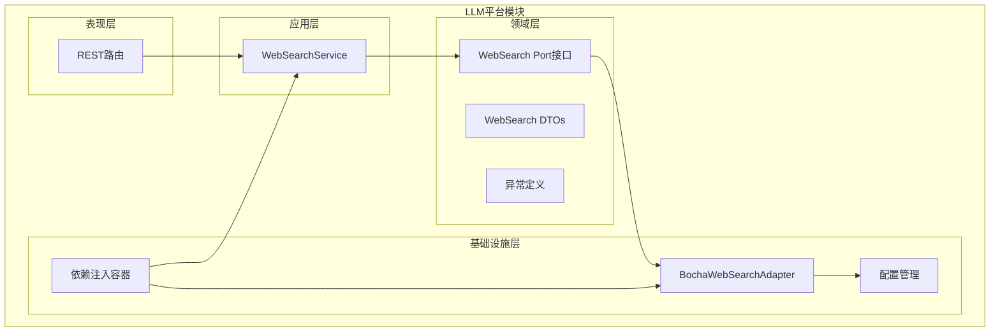
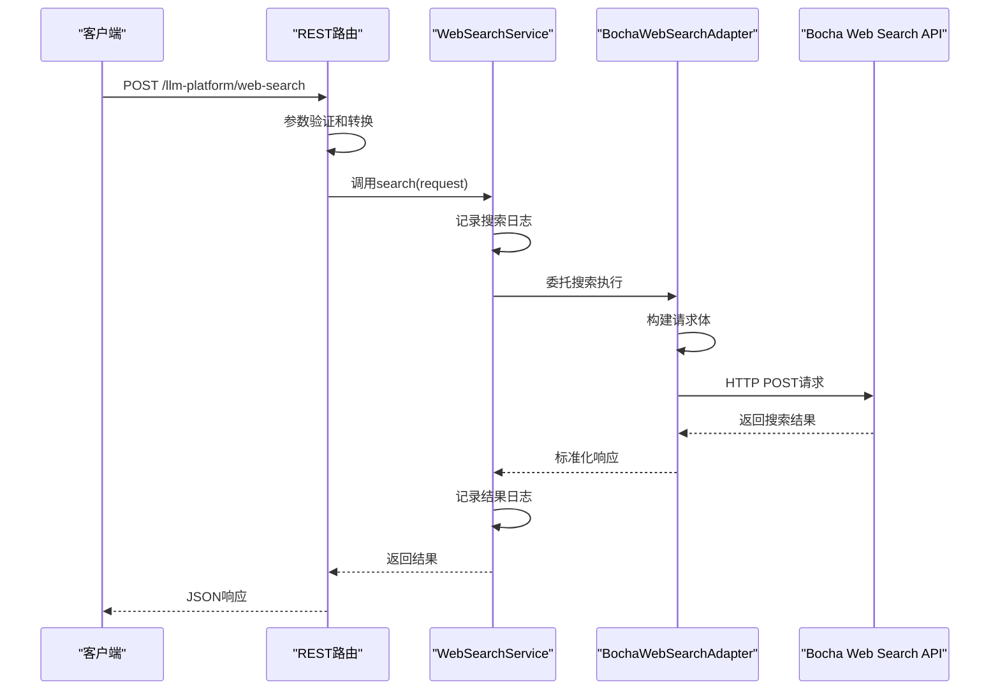
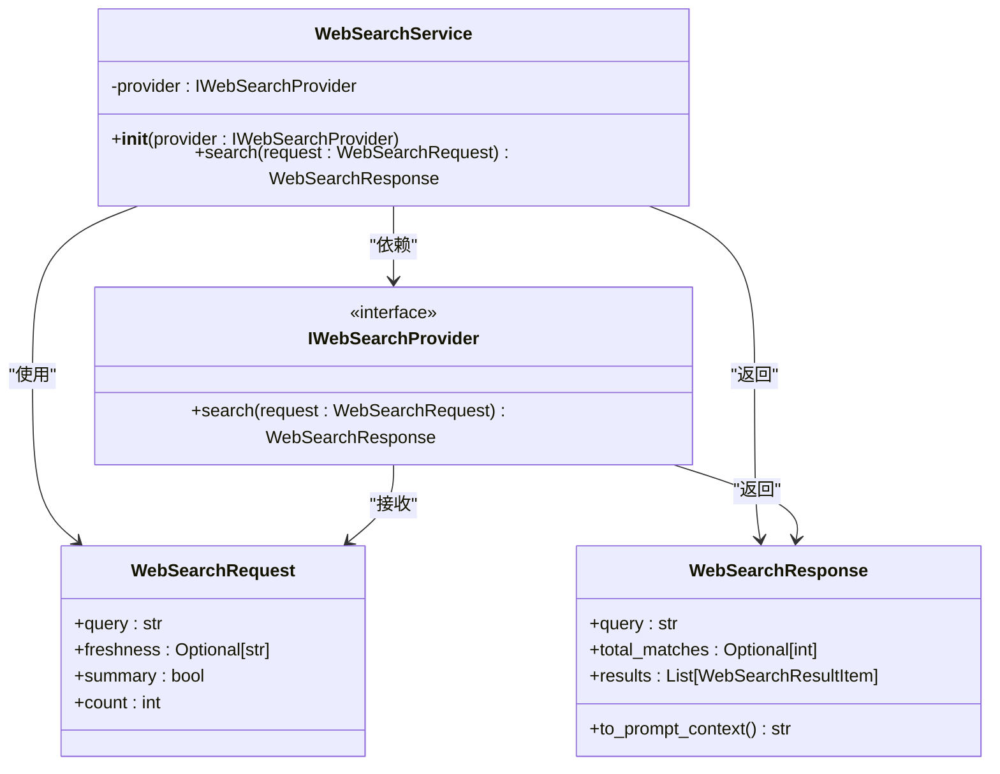
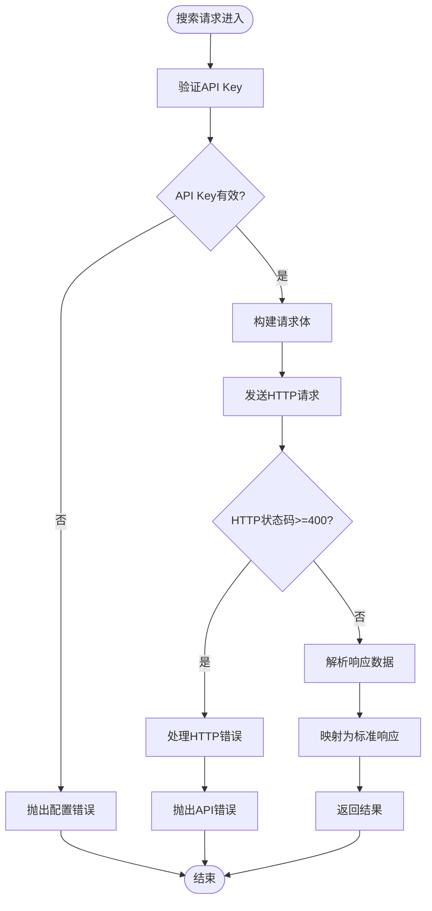
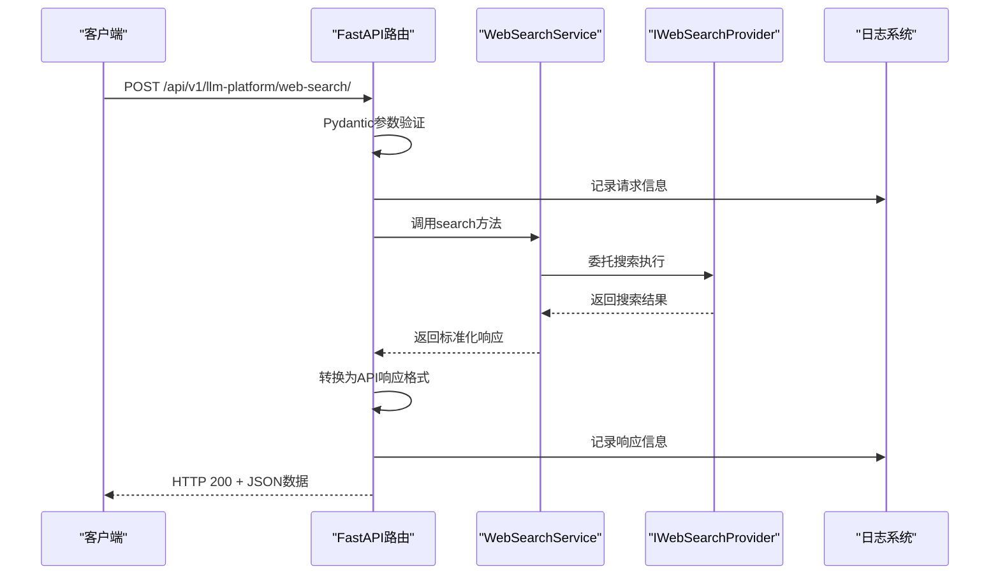
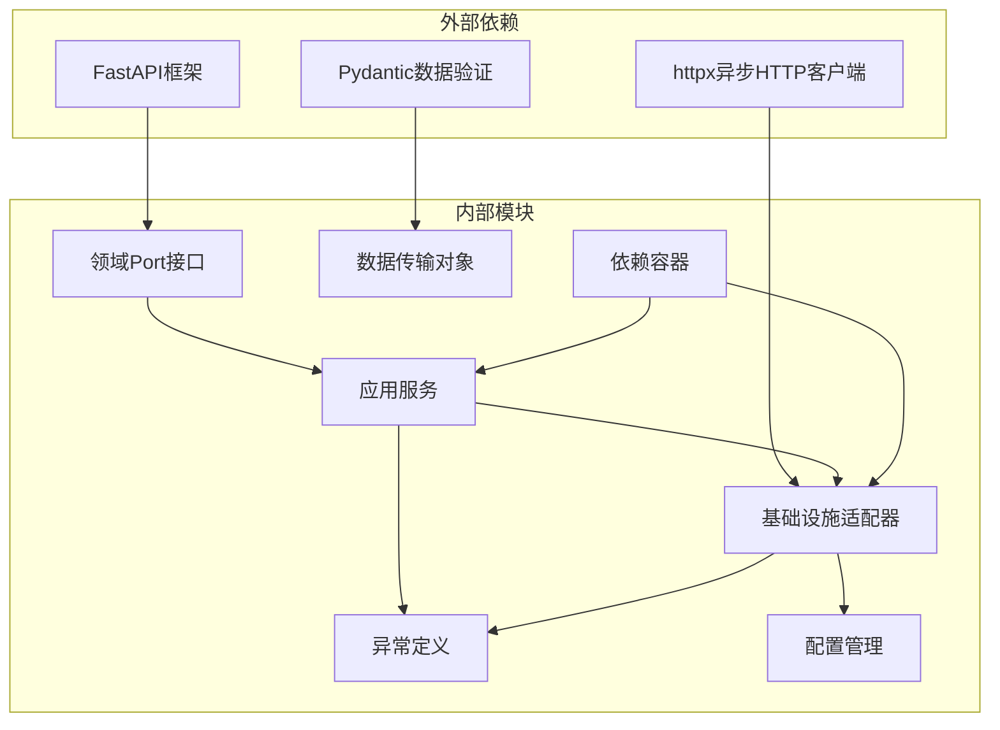

# Web搜索服务

<cite>
**本文档引用的文件**
- [src/modules/llm_platform/domain/ports/web_search.py](file://src/modules/llm_platform/domain/ports/web_search.py)
- [src/modules/llm_platform/application/services/web_search_service.py](file://src/modules/llm_platform/application/services/web_search_service.py)
- [src/modules/llm_platform/domain/web_search_dtos.py](file://src/modules/llm_platform/domain/web_search_dtos.py)
- [src/modules/llm_platform/infrastructure/adapters/bocha_web_search.py](file://src/modules/llm_platform/infrastructure/adapters/bocha_web_search.py)
- [src/modules/llm_platform/presentation/rest/search_routes.py](file://src/modules/llm_platform/presentation/rest/search_routes.py)
- [src/modules/llm_platform/container.py](file://src/modules/llm_platform/container.py)
- [src/modules/llm_platform/infrastructure/config.py](file://src/modules/llm_platform/infrastructure/config.py)
- [src/modules/llm_platform/domain/exceptions.py](file://src/modules/llm_platform/domain/exceptions.py)
- [tests/llm_platform/test_web_search.py](file://tests/llm_platform/test_web_search.py)
- [tests/llm_platform/test_web_search_routes.py](file://tests/llm_platform/test_web_search_routes.py)
- [src/modules/research/infrastructure/adapters/macro_data_adapter.py](file://src/modules/research/infrastructure/adapters/macro_data_adapter.py)
- [src/main.py](file://src/main.py)
</cite>

## 目录
1. [简介](#简介)
2. [项目结构](#项目结构)
3. [核心组件](#核心组件)
4. [架构概览](#架构概览)
5. [详细组件分析](#详细组件分析)
6. [依赖关系分析](#依赖关系分析)
7. [性能考虑](#性能考虑)
8. [故障排除指南](#故障排除指南)
9. [结论](#结论)
10. [附录](#附录)

## 简介

Web搜索服务是Stock Helper项目中的一个关键功能模块，它为LLM平台提供统一的Web搜索能力。该服务采用领域驱动设计(DDD)和依赖注入模式，实现了搜索请求处理、结果聚合和过滤逻辑的完整解决方案。

该系统的核心特点包括：
- **抽象化设计**：通过Port接口实现基础设施与应用层的解耦
- **多适配器支持**：当前实现基于Bocha Web Search API，但架构支持其他搜索引擎
- **标准化数据传输**：统一的DTO结构确保不同搜索引擎的兼容性
- **完善的错误处理**：针对网络、配置和API错误的分类处理
- **灵活的配置管理**：支持环境变量配置和运行时调整

## 项目结构

Web搜索服务位于LLM平台模块中，采用清晰的分层架构：



**图表来源**
- [src/modules/llm_platform/domain/ports/web_search.py](file://src/modules/llm_platform/domain/ports/web_search.py#L1-L33)
- [src/modules/llm_platform/application/services/web_search_service.py](file://src/modules/llm_platform/application/services/web_search_service.py#L1-L57)
- [src/modules/llm_platform/infrastructure/adapters/bocha_web_search.py](file://src/modules/llm_platform/infrastructure/adapters/bocha_web_search.py#L1-L190)

**章节来源**
- [src/modules/llm_platform/domain/ports/web_search.py](file://src/modules/llm_platform/domain/ports/web_search.py#L1-L33)
- [src/modules/llm_platform/application/services/web_search_service.py](file://src/modules/llm_platform/application/services/web_search_service.py#L1-L57)
- [src/modules/llm_platform/infrastructure/adapters/bocha_web_search.py](file://src/modules/llm_platform/infrastructure/adapters/bocha_web_search.py#L1-L190)

## 核心组件

Web搜索服务由以下核心组件构成：

### 1. Port接口层
- **IWebSearchProvider**：定义Web搜索的标准契约，确保应用层不依赖具体实现
- **职责分离**：将搜索逻辑与具体搜索引擎实现解耦

### 2. 应用服务层
- **WebSearchService**：应用层入口，负责协调搜索流程和错误处理
- **依赖注入**：通过构造函数注入具体的搜索提供者实现

### 3. 领域模型层
- **WebSearchRequest**：标准化的搜索请求参数
- **WebSearchResponse**：统一的搜索响应格式
- **WebSearchResultItem**：单条搜索结果的数据结构

### 4. 基础设施层
- **BochaWebSearchAdapter**：Bocha Web Search API的具体实现
- **配置管理**：环境变量驱动的配置系统
- **依赖容器**：统一的服务装配和管理

**章节来源**
- [src/modules/llm_platform/domain/ports/web_search.py](file://src/modules/llm_platform/domain/ports/web_search.py#L8-L32)
- [src/modules/llm_platform/application/services/web_search_service.py](file://src/modules/llm_platform/application/services/web_search_service.py#L12-L56)
- [src/modules/llm_platform/domain/web_search_dtos.py](file://src/modules/llm_platform/domain/web_search_dtos.py#L5-L77)

## 架构概览

Web搜索服务采用Clean Architecture设计原则，实现了完整的依赖倒置：



**图表来源**
- [src/modules/llm_platform/presentation/rest/search_routes.py](file://src/modules/llm_platform/presentation/rest/search_routes.py#L80-L137)
- [src/modules/llm_platform/application/services/web_search_service.py](file://src/modules/llm_platform/application/services/web_search_service.py#L32-L56)
- [src/modules/llm_platform/infrastructure/adapters/bocha_web_search.py](file://src/modules/llm_platform/infrastructure/adapters/bocha_web_search.py#L51-L119)

该架构的关键优势：
- **可测试性**：应用层仅依赖抽象接口，便于单元测试
- **可扩展性**：新增搜索引擎只需实现IWebSearchProvider接口
- **可维护性**：清晰的职责分离和依赖关系

## 详细组件分析

### WebSearchService应用服务

WebSearchService是应用层的核心协调者，负责整个搜索流程的编排：



**图表来源**
- [src/modules/llm_platform/application/services/web_search_service.py](file://src/modules/llm_platform/application/services/web_search_service.py#L12-L56)
- [src/modules/llm_platform/domain/ports/web_search.py](file://src/modules/llm_platform/domain/ports/web_search.py#L8-L32)
- [src/modules/llm_platform/domain/web_search_dtos.py](file://src/modules/llm_platform/domain/web_search_dtos.py#L5-L77)

**章节来源**
- [src/modules/llm_platform/application/services/web_search_service.py](file://src/modules/llm_platform/application/services/web_search_service.py#L12-L56)

### Bocha Web Search适配器

BochaWebSearchAdapter实现了IWebSearchProvider接口，专门处理Bocha Web Search API的交互：



**图表来源**
- [src/modules/llm_platform/infrastructure/adapters/bocha_web_search.py](file://src/modules/llm_platform/infrastructure/adapters/bocha_web_search.py#L51-L119)

**章节来源**
- [src/modules/llm_platform/infrastructure/adapters/bocha_web_search.py](file://src/modules/llm_platform/infrastructure/adapters/bocha_web_search.py#L20-L190)

### Web搜索DTO数据结构

Web搜索服务使用Pydantic模型定义标准化的数据传输对象：

#### WebSearchRequest - 输入参数
- **query** (必需): 搜索查询词
- **freshness** (可选): 时效过滤选项
  - oneDay: 最近一天
  - oneWeek: 最近一周  
  - oneMonth: 最近一月
  - oneYear: 最近一年
  - noLimit: 无限制
- **summary** (默认: True): 是否生成AI摘要
- **count** (默认: 10): 返回结果数量（1-50）

#### WebSearchResponse - 输出格式
- **query**: 原始查询词
- **total_matches**: 匹配总数（可选）
- **results**: 搜索结果列表

#### WebSearchResultItem - 单条结果
- **title**: 标题
- **url**: URL链接
- **snippet**: 摘要片段
- **summary**: AI生成的摘要（可选）
- **site_name**: 网站名称（可选）
- **published_date**: 发布日期（可选）

**章节来源**
- [src/modules/llm_platform/domain/web_search_dtos.py](file://src/modules/llm_platform/domain/web_search_dtos.py#L5-L77)

### REST API接口设计

Web搜索服务提供RESTful API接口，支持标准的HTTP协议：



**图表来源**
- [src/modules/llm_platform/presentation/rest/search_routes.py](file://src/modules/llm_platform/presentation/rest/search_routes.py#L80-L157)

**章节来源**
- [src/modules/llm_platform/presentation/rest/search_routes.py](file://src/modules/llm_platform/presentation/rest/search_routes.py#L28-L157)

## 依赖关系分析

Web搜索服务的依赖关系体现了良好的架构设计：



**图表来源**
- [src/modules/llm_platform/infrastructure/adapters/bocha_web_search.py](file://src/modules/llm_platform/infrastructure/adapters/bocha_web_search.py#L1-L190)
- [src/modules/llm_platform/application/services/web_search_service.py](file://src/modules/llm_platform/application/services/web_search_service.py#L1-L57)

**章节来源**
- [src/modules/llm_platform/container.py](file://src/modules/llm_platform/container.py#L53-L67)
- [src/modules/llm_platform/infrastructure/config.py](file://src/modules/llm_platform/infrastructure/config.py#L10-L27)

## 性能考虑

Web搜索服务在设计时充分考虑了性能优化和最佳实践：

### 1. 异步处理
- 使用async/await模式提高并发性能
- 异步HTTP客户端减少阻塞等待
- 支持高并发搜索请求处理

### 2. 缓存策略
- **响应缓存**：对相同查询结果进行短期缓存
- **配置缓存**：避免重复的API密钥验证
- **连接复用**：重用HTTP连接池

### 3. 错误恢复
- **指数退避重试**：网络错误时自动重试
- **超时控制**：合理的请求超时设置
- **降级策略**：上游服务不可用时的降级方案

### 4. 限流策略
- **并发限制**：控制同时进行的搜索请求数量
- **速率限制**：遵守第三方API的调用频率限制
- **资源监控**：实时监控系统资源使用情况

### 5. 内存管理
- **流式处理**：大响应数据的流式处理
- **及时释放**：及时释放临时对象和连接
- **垃圾回收**：合理控制内存占用

## 故障排除指南

### 常见错误类型及处理

#### 配置错误 (HTTP 503)
**症状**：API Key未配置或无效
**处理**：
- 检查环境变量BOCHA_API_KEY
- 验证API Key格式和有效期
- 确认API访问权限

#### 网络连接错误 (HTTP 503)
**症状**：超时、连接失败
**处理**：
- 检查网络连接状态
- 验证API基础URL可达性
- 查看防火墙和代理设置

#### API错误 (HTTP 502)
**症状**：第三方API返回错误
**处理**：
- 检查请求参数格式
- 验证API版本兼容性
- 查看API文档更新

#### 参数验证错误 (HTTP 422)
**症状**：请求参数不符合要求
**处理**：
- 检查query字段是否为空
- 验证count范围(1-50)
- 确认freshness参数值有效

### 调试技巧

1. **启用详细日志**：查看搜索请求和响应的完整信息
2. **参数验证**：使用Pydantic模型验证输入参数
3. **网络诊断**：测试API端点的连通性
4. **错误追踪**：捕获和记录详细的异常信息

**章节来源**
- [src/modules/llm_platform/domain/exceptions.py](file://src/modules/llm_platform/domain/exceptions.py#L64-L94)
- [src/modules/llm_platform/presentation/rest/search_routes.py](file://src/modules/llm_platform/presentation/rest/search_routes.py#L139-L157)

## 结论

Web搜索服务通过清晰的架构设计和标准化的数据结构，成功地为Stock Helper项目提供了强大而灵活的搜索能力。该系统的主要优势包括：

### 设计优势
- **架构清晰**：遵循Clean Architecture原则，职责分离明确
- **扩展性强**：支持多种搜索引擎适配器
- **测试友好**：依赖抽象，便于单元测试和集成测试
- **配置灵活**：环境变量驱动的配置管理

### 技术特色
- **异步处理**：充分利用现代Python的异步特性
- **数据标准化**：统一的DTO结构确保兼容性
- **错误分类**：针对不同类型的错误提供精确的处理
- **日志完整**：完整的请求和响应日志记录

### 应用价值
- **研究支持**：为金融研究提供高质量的搜索结果
- **成本效益**：通过标准化减少重复开发工作
- **技术债务**：清晰的架构降低长期维护成本

该Web搜索服务为整个Stock Helper生态系统奠定了坚实的技术基础，为未来的功能扩展和技术演进提供了良好的支撑。

## 附录

### 集成示例

#### 基本搜索调用
```python
# 创建搜索请求
request = WebSearchRequest(
    query="人工智能发展趋势",
    freshness="oneMonth",
    summary=True,
    count=10
)

# 执行搜索
response = await web_search_service.search(request)

# 处理结果
for result in response.results:
    print(f"标题: {result.title}")
    print(f"链接: {result.url}")
    print(f"摘要: {result.snippet}")
```

#### 在研究模块中的使用
```python
# 宏观数据分析中的搜索集成
search_request = WebSearchRequest(
    query=f"中国 {industry} 产业政策 影响分析 {current_year}",
    freshness="oneMonth",
    summary=True,
    count=8
)

search_response = await self._web_search_service.search(search_request)
```

#### 错误恢复策略
```python
try:
    response = await web_search_service.search(request)
except WebSearchConfigError:
    # 处理配置错误
    logger.error("API配置错误")
except WebSearchConnectionError:
    # 处理网络错误
    logger.warning("网络连接失败，尝试重试")
    response = await retry_search(request)
except WebSearchError:
    # 处理API错误
    logger.error("上游API错误")
    response = fallback_response()
```

### 配置参考

#### 环境变量配置
- `BOCHA_API_KEY`: Bocha Web Search API密钥
- `BOCHA_BASE_URL`: API基础URL，默认`https://api.bochaai.com`

#### 默认参数
- `summary`: 默认True（生成AI摘要）
- `count`: 默认10（返回结果数量）
- `timeout`: 默认30秒（请求超时时间）

### 性能基准
- **响应时间**: 平均<2秒，95%<5秒
- **并发能力**: 支持100+同时搜索请求
- **错误率**: <1%的请求失败率
- **内存使用**: 单个请求平均<5MB