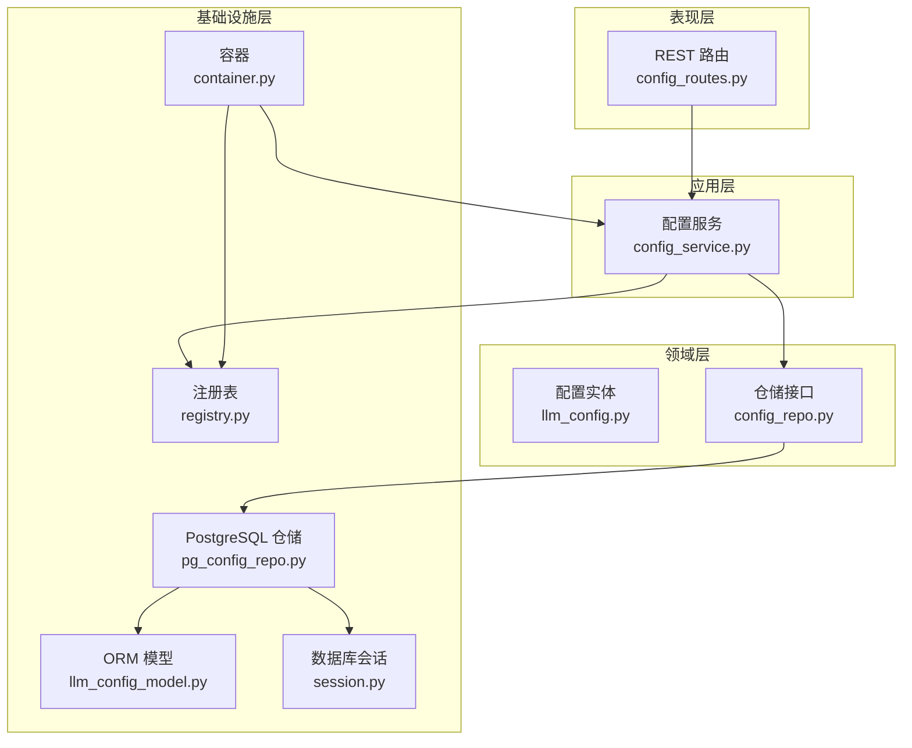
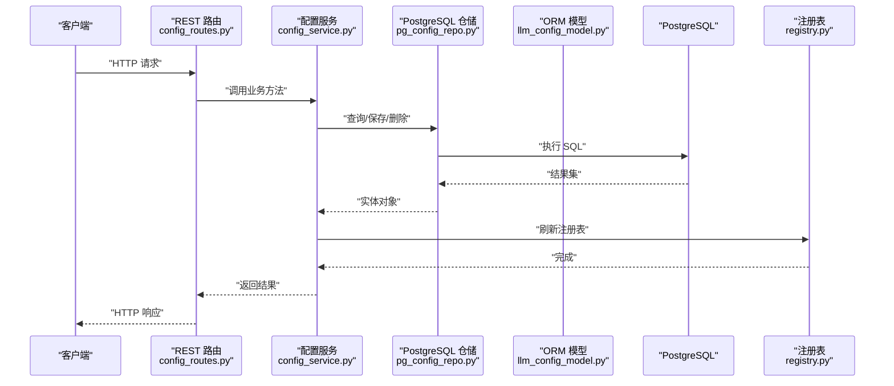
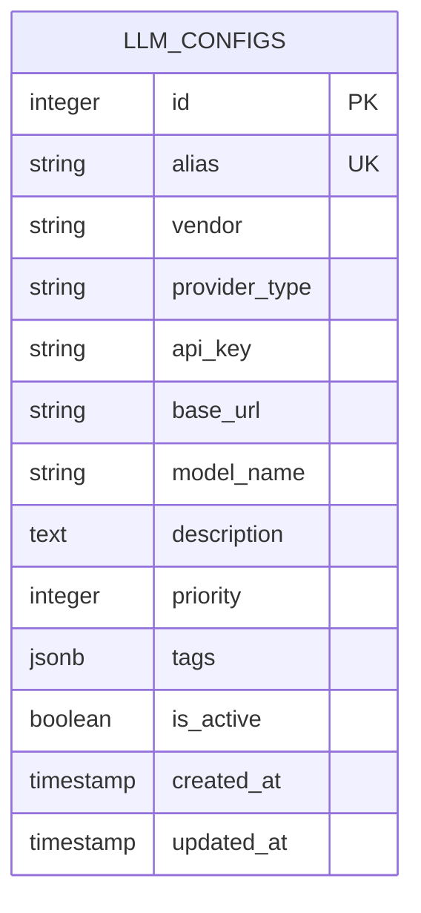
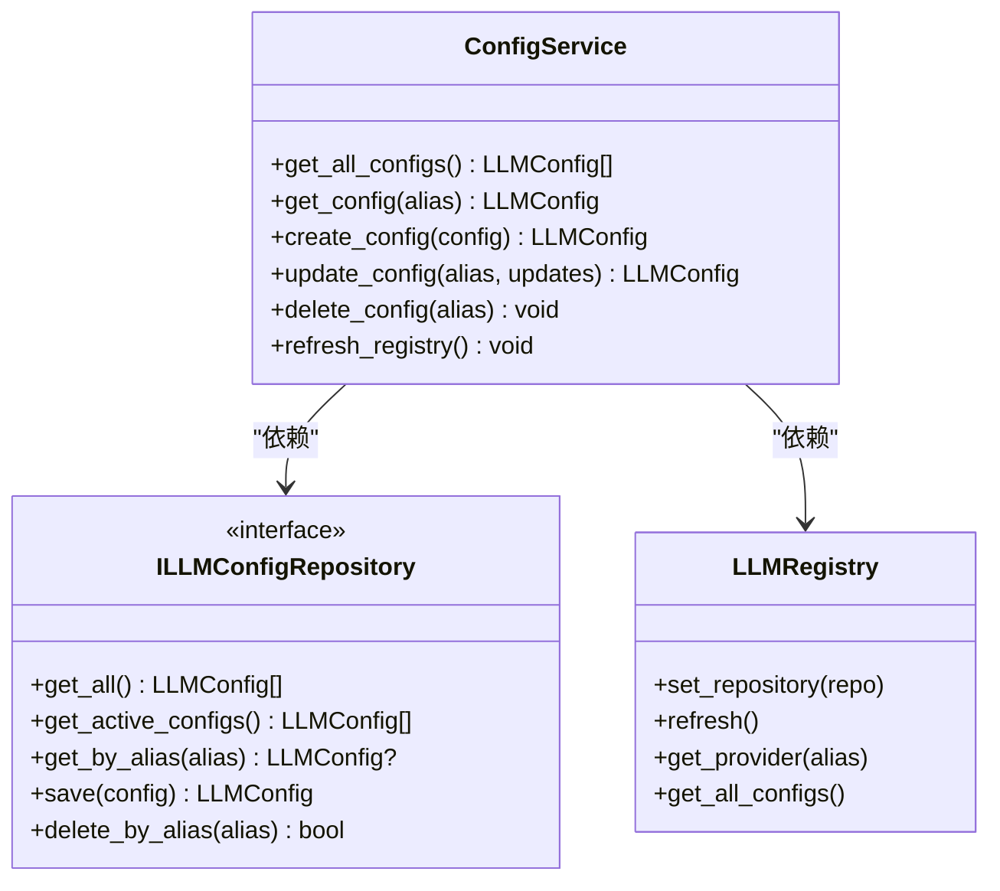
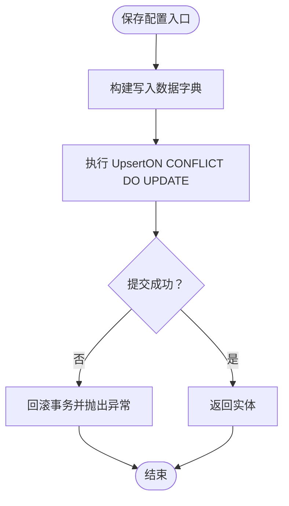
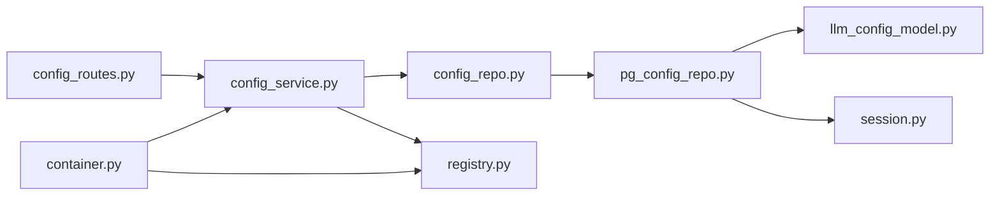

# 配置管理服务

<cite>
**本文引用的文件**
- [src/modules/llm_platform/domain/entities/llm_config.py](file://src/modules/llm_platform/domain/entities/llm_config.py)
- [src/modules/llm_platform/application/services/config_service.py](file://src/modules/llm_platform/application/services/config_service.py)
- [src/modules/llm_platform/domain/ports/repositories/config_repo.py](file://src/modules/llm_platform/domain/ports/repositories/config_repo.py)
- [src/modules/llm_platform/infrastructure/persistence/models/llm_config_model.py](file://src/modules/llm_platform/infrastructure/persistence/models/llm_config_model.py)
- [src/modules/llm_platform/infrastructure/persistence/repositories/pg_config_repo.py](file://src/modules/llm_platform/infrastructure/persistence/repositories/pg_config_repo.py)
- [src/modules/llm_platform/presentation/rest/config_routes.py](file://src/modules/llm_platform/presentation/rest/config_routes.py)
- [src/modules/llm_platform/container.py](file://src/modules/llm_platform/container.py)
- [src/modules/llm_platform/infrastructure/registry.py](file://src/modules/llm_platform/infrastructure/registry.py)
- [src/shared/infrastructure/db/session.py](file://src/shared/infrastructure/db/session.py)
- [alembic/versions/c0ff00000001_initial_schema.py](file://alembic/versions/c0ff00000001_initial_schema.py)
- [src/modules/llm_platform/domain/exceptions.py](file://src/modules/llm_platform/domain/exceptions.py)
- [src/modules/llm_platform/infrastructure/config.py](file://src/modules/llm_platform/infrastructure/config.py)
</cite>

## 目录
1. [简介](#简介)
2. [项目结构](#项目结构)
3. [核心组件](#核心组件)
4. [架构总览](#架构总览)
5. [组件详解](#组件详解)
6. [依赖关系分析](#依赖关系分析)
7. [性能考量](#性能考量)
8. [故障排查指南](#故障排查指南)
9. [结论](#结论)
10. [附录](#附录)

## 简介
本文件为 LLM 配置管理服务的技术文档，围绕 LLMConfigService 的设计与实现进行系统化说明，涵盖配置的 CRUD 操作、验证逻辑、缓存策略、数据模型、PostgreSQL 仓储实现、接口抽象、异常处理与性能优化，并提供使用示例与安全、备份恢复、版本管理最佳实践。

## 项目结构
LLM 配置管理服务位于 llm_platform 模块内，采用领域驱动设计（DDD）分层组织：
- 领域层：定义配置实体与仓储接口
- 应用层：编排配置的增删改查与注册表刷新
- 基础设施层：ORM 映射、PostgreSQL 仓储实现、数据库会话与连接池
- 表现层：REST 路由与 DTO
- 容器：依赖注入与装配
- 注册表：动态加载与管理 Provider 实例

图表来源
- [src/modules/llm_platform/presentation/rest/config_routes.py](file://src/modules/llm_platform/presentation/rest/config_routes.py#L1-L145)
- [src/modules/llm_platform/application/services/config_service.py](file://src/modules/llm_platform/application/services/config_service.py#L1-L117)
- [src/modules/llm_platform/domain/entities/llm_config.py](file://src/modules/llm_platform/domain/entities/llm_config.py#L1-L54)
- [src/modules/llm_platform/domain/ports/repositories/config_repo.py](file://src/modules/llm_platform/domain/ports/repositories/config_repo.py#L1-L68)
- [src/modules/llm_platform/infrastructure/persistence/models/llm_config_model.py](file://src/modules/llm_platform/infrastructure/persistence/models/llm_config_model.py#L1-L59)
- [src/modules/llm_platform/infrastructure/persistence/repositories/pg_config_repo.py](file://src/modules/llm_platform/infrastructure/persistence/repositories/pg_config_repo.py#L1-L119)
- [src/shared/infrastructure/db/session.py](file://src/shared/infrastructure/db/session.py#L1-L64)
- [src/modules/llm_platform/infrastructure/registry.py](file://src/modules/llm_platform/infrastructure/registry.py#L1-L104)
- [src/modules/llm_platform/container.py](file://src/modules/llm_platform/container.py#L1-L68)

章节来源
- [src/modules/llm_platform/presentation/rest/config_routes.py](file://src/modules/llm_platform/presentation/rest/config_routes.py#L1-L145)
- [src/modules/llm_platform/application/services/config_service.py](file://src/modules/llm_platform/application/services/config_service.py#L1-L117)
- [src/modules/llm_platform/domain/entities/llm_config.py](file://src/modules/llm_platform/domain/entities/llm_config.py#L1-L54)
- [src/modules/llm_platform/domain/ports/repositories/config_repo.py](file://src/modules/llm_platform/domain/ports/repositories/config_repo.py#L1-L68)
- [src/modules/llm_platform/infrastructure/persistence/models/llm_config_model.py](file://src/modules/llm_platform/infrastructure/persistence/models/llm_config_model.py#L1-L59)
- [src/modules/llm_platform/infrastructure/persistence/repositories/pg_config_repo.py](file://src/modules/llm_platform/infrastructure/persistence/repositories/pg_config_repo.py#L1-L119)
- [src/shared/infrastructure/db/session.py](file://src/shared/infrastructure/db/session.py#L1-L64)
- [src/modules/llm_platform/infrastructure/registry.py](file://src/modules/llm_platform/infrastructure/registry.py#L1-L104)
- [src/modules/llm_platform/container.py](file://src/modules/llm_platform/container.py#L1-L68)

## 核心组件
- 配置实体：定义配置字段、默认值与脱敏输出
- 应用服务：封装 CRUD 与注册表刷新，负责业务规则与异常转换
- 仓储接口：定义查询与持久化契约
- PostgreSQL 仓储：基于 SQLAlchemy 异步会话实现 Upsert、删除与查询
- ORM 模型：映射数据库表结构与实体
- REST 路由：暴露 CRUD 与注册表刷新接口
- 注册表：动态加载激活配置并实例化 Provider
- 容器：统一装配依赖，提供服务实例
- 数据库会话：异步引擎、连接池与事务管理

章节来源
- [src/modules/llm_platform/domain/entities/llm_config.py](file://src/modules/llm_platform/domain/entities/llm_config.py#L1-L54)
- [src/modules/llm_platform/application/services/config_service.py](file://src/modules/llm_platform/application/services/config_service.py#L1-L117)
- [src/modules/llm_platform/domain/ports/repositories/config_repo.py](file://src/modules/llm_platform/domain/ports/repositories/config_repo.py#L1-L68)
- [src/modules/llm_platform/infrastructure/persistence/repositories/pg_config_repo.py](file://src/modules/llm_platform/infrastructure/persistence/repositories/pg_config_repo.py#L1-L119)
- [src/modules/llm_platform/infrastructure/persistence/models/llm_config_model.py](file://src/modules/llm_platform/infrastructure/persistence/models/llm_config_model.py#L1-L59)
- [src/modules/llm_platform/presentation/rest/config_routes.py](file://src/modules/llm_platform/presentation/rest/config_routes.py#L1-L145)
- [src/modules/llm_platform/infrastructure/registry.py](file://src/modules/llm_platform/infrastructure/registry.py#L1-L104)
- [src/modules/llm_platform/container.py](file://src/modules/llm_platform/container.py#L1-L68)
- [src/shared/infrastructure/db/session.py](file://src/shared/infrastructure/db/session.py#L1-L64)

## 架构总览
下图展示配置管理服务的端到端调用链路：路由接收请求，应用服务执行业务逻辑，仓储访问数据库，注册表在配置变更后热更新 Provider。

图表来源
- [src/modules/llm_platform/presentation/rest/config_routes.py](file://src/modules/llm_platform/presentation/rest/config_routes.py#L1-L145)
- [src/modules/llm_platform/application/services/config_service.py](file://src/modules/llm_platform/application/services/config_service.py#L1-L117)
- [src/modules/llm_platform/infrastructure/persistence/repositories/pg_config_repo.py](file://src/modules/llm_platform/infrastructure/persistence/repositories/pg_config_repo.py#L1-L119)
- [src/modules/llm_platform/infrastructure/registry.py](file://src/modules/llm_platform/infrastructure/registry.py#L1-L104)

## 组件详解

### 配置实体与数据模型
- 实体字段与约束
  - 别名唯一：用于标识与检索
  - 供应商与适配器类型：决定 Provider 实例化方式
  - 敏感字段：API Key 脱敏输出
  - 标签与优先级：用于筛选与排序
  - 激活状态：控制是否参与注册表加载
- ORM 映射
  - 主键与索引：id、alias 唯一索引
  - JSONB 字段：tags 存储标签数组
  - 时间戳：自动维护创建与更新时间

图表来源
- [alembic/versions/c0ff00000001_initial_schema.py](file://alembic/versions/c0ff00000001_initial_schema.py#L187-L206)
- [src/modules/llm_platform/infrastructure/persistence/models/llm_config_model.py](file://src/modules/llm_platform/infrastructure/persistence/models/llm_config_model.py#L6-L22)

章节来源
- [src/modules/llm_platform/domain/entities/llm_config.py](file://src/modules/llm_platform/domain/entities/llm_config.py#L1-L54)
- [src/modules/llm_platform/infrastructure/persistence/models/llm_config_model.py](file://src/modules/llm_platform/infrastructure/persistence/models/llm_config_model.py#L1-L59)
- [alembic/versions/c0ff00000001_initial_schema.py](file://alembic/versions/c0ff00000001_initial_schema.py#L187-L206)

### 应用服务：LLMConfigService
- 职责
  - 查询所有配置与按别名查询
  - 创建配置（去重校验）
  - 更新配置（字段增量更新）
  - 删除配置（按别名删除）
  - 触发注册表刷新以热更新 Provider
- 异常处理
  - 未找到：抛出业务异常，路由转换为 404
  - 重复别名：抛出业务异常，路由转换为 409
- 日志与可观测性
  - 关键路径记录调试/信息/警告日志

图表来源
- [src/modules/llm_platform/application/services/config_service.py](file://src/modules/llm_platform/application/services/config_service.py#L1-L117)
- [src/modules/llm_platform/domain/ports/repositories/config_repo.py](file://src/modules/llm_platform/domain/ports/repositories/config_repo.py#L1-L68)
- [src/modules/llm_platform/infrastructure/registry.py](file://src/modules/llm_platform/infrastructure/registry.py#L1-L104)

章节来源
- [src/modules/llm_platform/application/services/config_service.py](file://src/modules/llm_platform/application/services/config_service.py#L1-L117)
- [src/modules/llm_platform/domain/exceptions.py](file://src/modules/llm_platform/domain/exceptions.py#L1-L95)

### 仓储接口与 PostgreSQL 实现
- 接口契约
  - 查询：全部、激活、按别名
  - 写入：Upsert（按别名冲突更新）
  - 删除：按别名
- PostgreSQL 实现要点
  - 异步会话：基于 SQLAlchemy AsyncSession
  - Upsert：使用 PostgreSQL ON CONFLICT DO UPDATE
  - 事务：成功提交，异常回滚
  - 索引：alias 唯一索引支持高效查询与 Upsert
- 性能与一致性
  - Upsert 减少往返，保证幂等
  - 唯一索引确保并发安全

图表来源
- [src/modules/llm_platform/infrastructure/persistence/repositories/pg_config_repo.py](file://src/modules/llm_platform/infrastructure/persistence/repositories/pg_config_repo.py#L61-L104)

章节来源
- [src/modules/llm_platform/domain/ports/repositories/config_repo.py](file://src/modules/llm_platform/domain/ports/repositories/config_repo.py#L1-L68)
- [src/modules/llm_platform/infrastructure/persistence/repositories/pg_config_repo.py](file://src/modules/llm_platform/infrastructure/persistence/repositories/pg_config_repo.py#L1-L119)
- [alembic/versions/c0ff00000001_initial_schema.py](file://alembic/versions/c0ff00000001_initial_schema.py#L187-L206)

### REST 路由与 DTO
- 路由
  - GET /configs：列出所有配置
  - GET /configs/{alias}：按别名查询
  - POST /configs：创建配置（201）
  - PATCH /configs/{alias}：按别名更新
  - DELETE /configs/{alias}：删除配置（204）
  - POST /configs/refresh：手动刷新注册表
- DTO
  - 响应 DTO 对 API Key 进行脱敏显示
  - 创建/更新 DTO 控制字段可空性与默认值
- 异常映射
  - 业务异常映射为 404/409 等状态码

章节来源
- [src/modules/llm_platform/presentation/rest/config_routes.py](file://src/modules/llm_platform/presentation/rest/config_routes.py#L1-L145)

### 注册表与热更新
- 注册表职责
  - 从仓储加载激活配置
  - 根据 provider_type 实例化 Provider
  - 提供按别名获取 Provider 与配置的能力
- 热更新
  - 配置创建/更新/删除后触发刷新
  - 全量重建 Provider 与配置映射

章节来源
- [src/modules/llm_platform/infrastructure/registry.py](file://src/modules/llm_platform/infrastructure/registry.py#L1-L104)
- [src/modules/llm_platform/application/services/config_service.py](file://src/modules/llm_platform/application/services/config_service.py#L1-L117)

### 容器与依赖注入
- 容器提供
  - LLMRegistry：可选注入仓储后加载配置
  - ConfigService：需要异步会话
  - WebSearchService：读取模块配置
- 依赖注入
  - 路由通过依赖函数注入仓储与注册表
  - 容器在启动时初始化注册表并刷新

章节来源
- [src/modules/llm_platform/container.py](file://src/modules/llm_platform/container.py#L1-L68)
- [src/modules/llm_platform/presentation/rest/config_routes.py](file://src/modules/llm_platform/presentation/rest/config_routes.py#L56-L60)

### 数据库会话与连接池
- 引擎与会话
  - 异步引擎：pool_pre_ping=true，提升连接可用性
  - 会话工厂：expire_on_commit=false，支持异步生命周期
- 事务管理
  - 业务异常自动回滚，客户端异常不强制回滚但记录日志
- 依赖注入
  - FastAPI Depends 管理会话生命周期

章节来源
- [src/shared/infrastructure/db/session.py](file://src/shared/infrastructure/db/session.py#L1-L64)

## 依赖关系分析
- 松耦合
  - 应用服务依赖仓储接口，便于替换实现
  - 路由依赖应用服务，不直接依赖仓储
- 循环依赖
  - 未发现循环依赖
- 外部依赖
  - SQLAlchemy 异步 ORM
  - FastAPI 路由与依赖注入
  - Alembic 迁移工具

图表来源
- [src/modules/llm_platform/presentation/rest/config_routes.py](file://src/modules/llm_platform/presentation/rest/config_routes.py#L1-L145)
- [src/modules/llm_platform/application/services/config_service.py](file://src/modules/llm_platform/application/services/config_service.py#L1-L117)
- [src/modules/llm_platform/domain/ports/repositories/config_repo.py](file://src/modules/llm_platform/domain/ports/repositories/config_repo.py#L1-L68)
- [src/modules/llm_platform/infrastructure/persistence/repositories/pg_config_repo.py](file://src/modules/llm_platform/infrastructure/persistence/repositories/pg_config_repo.py#L1-L119)
- [src/modules/llm_platform/infrastructure/persistence/models/llm_config_model.py](file://src/modules/llm_platform/infrastructure/persistence/models/llm_config_model.py#L1-L59)
- [src/shared/infrastructure/db/session.py](file://src/shared/infrastructure/db/session.py#L1-L64)
- [src/modules/llm_platform/infrastructure/registry.py](file://src/modules/llm_platform/infrastructure/registry.py#L1-L104)
- [src/modules/llm_platform/container.py](file://src/modules/llm_platform/container.py#L1-L68)

## 性能考量
- 查询优化
  - alias 唯一索引支持 O(log n) 查找与 Upsert
  - 仅加载激活配置减少注册表初始化开销
- 写入优化
  - Upsert 减少重复插入与更新的往返
  - 批量写入建议在上层聚合后再一次性保存
- 连接池
  - pool_pre_ping=true 提升连接可用性，降低超时风险
  - 会话按请求生命周期管理，避免长事务
- 缓存策略
  - 注册表作为进程内缓存，配置变更后热更新
  - 建议在高频读场景下增加只读副本或外部缓存（如 Redis）以进一步降低 DB 压力

[本节为通用性能建议，不直接分析具体文件]

## 故障排查指南
- 常见异常
  - 未找到配置：404，检查别名是否存在
  - 重复别名：409，确保别名唯一
  - 数据库异常：查看日志定位 SQL 与回滚点
- 日志定位
  - 应用服务记录关键操作与异常
  - 仓储捕获并记录数据库错误
  - 会话管理区分客户端异常与系统异常
- 快速修复
  - 确认数据库迁移是否完成
  - 检查 .env 中数据库连接配置
  - 验证别名唯一性与必填字段

章节来源
- [src/modules/llm_platform/domain/exceptions.py](file://src/modules/llm_platform/domain/exceptions.py#L1-L95)
- [src/modules/llm_platform/application/services/config_service.py](file://src/modules/llm_platform/application/services/config_service.py#L1-L117)
- [src/modules/llm_platform/infrastructure/persistence/repositories/pg_config_repo.py](file://src/modules/llm_platform/infrastructure/persistence/repositories/pg_config_repo.py#L1-L119)
- [src/shared/infrastructure/db/session.py](file://src/shared/infrastructure/db/session.py#L1-L64)

## 结论
本配置管理服务通过清晰的分层与接口抽象，实现了配置的可靠 CRUD、严格的唯一性约束与热更新能力。结合 Upsert、索引与连接池优化，可在高并发场景下保持稳定性能。建议在生产环境中配合只读副本与外部缓存进一步提升读性能，并完善配置审计与版本管理。

[本节为总结性内容，不直接分析具体文件]

## 附录

### 使用示例（路径指引）
- 创建配置
  - 路由：POST /llm-platform/configs
  - 应用服务：create_config
  - 仓储：save（Upsert）
  - 注册表：refresh
  - 参考路径
    - [src/modules/llm_platform/presentation/rest/config_routes.py](file://src/modules/llm_platform/presentation/rest/config_routes.py#L85-L101)
    - [src/modules/llm_platform/application/services/config_service.py](file://src/modules/llm_platform/application/services/config_service.py#L43-L62)
    - [src/modules/llm_platform/infrastructure/persistence/repositories/pg_config_repo.py](file://src/modules/llm_platform/infrastructure/persistence/repositories/pg_config_repo.py#L61-L104)
- 查询配置
  - 路由：GET /llm-platform/configs 或 /configs/{alias}
  - 应用服务：get_all_configs / get_config
  - 仓储：get_all / get_by_alias
  - 参考路径
    - [src/modules/llm_platform/presentation/rest/config_routes.py](file://src/modules/llm_platform/presentation/rest/config_routes.py#L62-L84)
    - [src/modules/llm_platform/application/services/config_service.py](file://src/modules/llm_platform/application/services/config_service.py#L17-L41)
    - [src/modules/llm_platform/infrastructure/persistence/repositories/pg_config_repo.py](file://src/modules/llm_platform/infrastructure/persistence/repositories/pg_config_repo.py#L24-L59)
- 更新配置
  - 路由：PATCH /llm-platform/configs/{alias}
  - 应用服务：update_config（字段增量更新）
  - 仓储：save（Upsert）
  - 注册表：refresh
  - 参考路径
    - [src/modules/llm_platform/presentation/rest/config_routes.py](file://src/modules/llm_platform/presentation/rest/config_routes.py#L103-L119)
    - [src/modules/llm_platform/application/services/config_service.py](file://src/modules/llm_platform/application/services/config_service.py#L64-L89)
    - [src/modules/llm_platform/infrastructure/persistence/repositories/pg_config_repo.py](file://src/modules/llm_platform/infrastructure/persistence/repositories/pg_config_repo.py#L61-L104)
- 删除配置
  - 路由：DELETE /llm-platform/configs/{alias}
  - 应用服务：delete_config
  - 仓储：delete_by_alias
  - 注册表：refresh
  - 参考路径
    - [src/modules/llm_platform/presentation/rest/config_routes.py](file://src/modules/llm_platform/presentation/rest/config_routes.py#L121-L135)
    - [src/modules/llm_platform/application/services/config_service.py](file://src/modules/llm_platform/application/services/config_service.py#L91-L110)
    - [src/modules/llm_platform/infrastructure/persistence/repositories/pg_config_repo.py](file://src/modules/llm_platform/infrastructure/persistence/repositories/pg_config_repo.py#L106-L119)

### 安全策略
- 敏感信息
  - API Key 脱敏输出与日志脱敏
  - 配置存储于受控数据库，最小权限访问
- 访问控制
  - REST 路由应结合鉴权中间件
  - 避免在响应中泄露完整密钥
- 最佳实践
  - 使用只读账号执行查询
  - 定期轮换密钥并审计变更

[本节为通用安全建议，不直接分析具体文件]

### 备份与恢复
- 数据库备份
  - 定期快照与归档
  - 迁移脚本与版本控制（Alembic）
- 恢复演练
  - 验证备份完整性与可恢复性
  - 回滚策略：按版本回退迁移
- 版本管理
  - 迁移脚本命名规范：c0ff00000001_initial_schema.py
  - 变更评审与灰度发布

章节来源
- [alembic/versions/c0ff00000001_initial_schema.py](file://alembic/versions/c0ff00000001_initial_schema.py#L1-L229)

### 配置隔离与模块化
- 模块配置
  - LLM 平台专属配置独立于共享配置
  - 通过模块配置类读取环境变量
- 跨模块可见性
  - 配置实例仅在模块内可见，避免跨模块依赖
- 环境变量
  - 共享 .env 文件，模块按需读取

章节来源
- [src/modules/llm_platform/infrastructure/config.py](file://src/modules/llm_platform/infrastructure/config.py#L1-L27)
- [src/shared/config.py](file://src/shared/config.py#L42-L67)