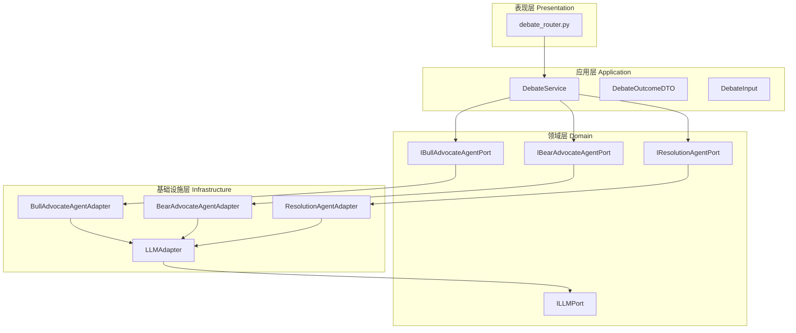
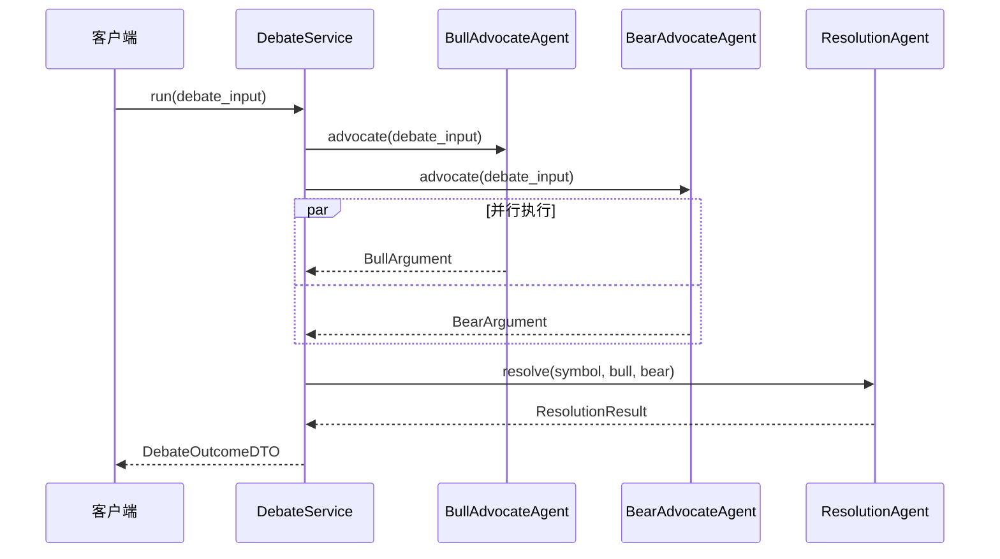
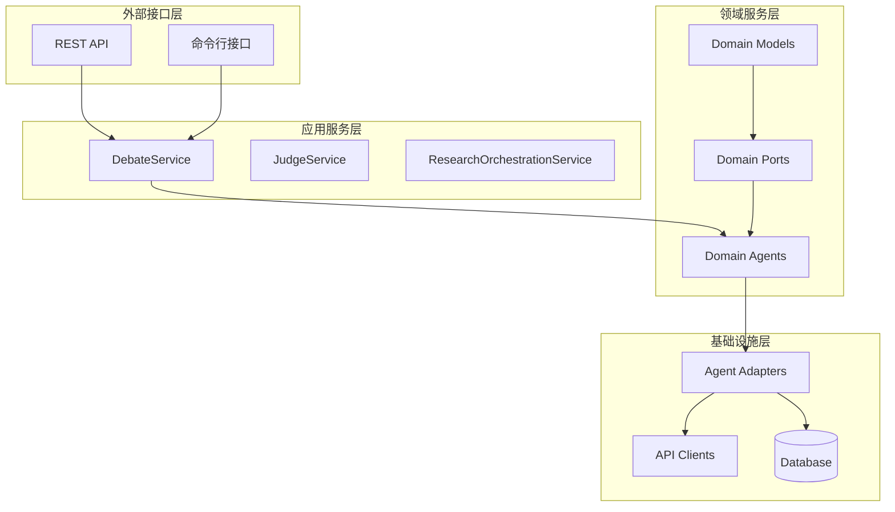
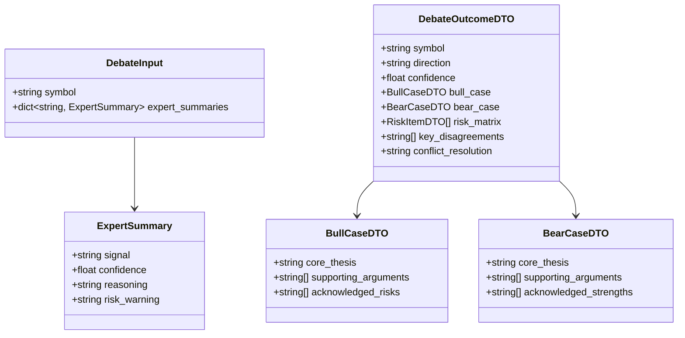
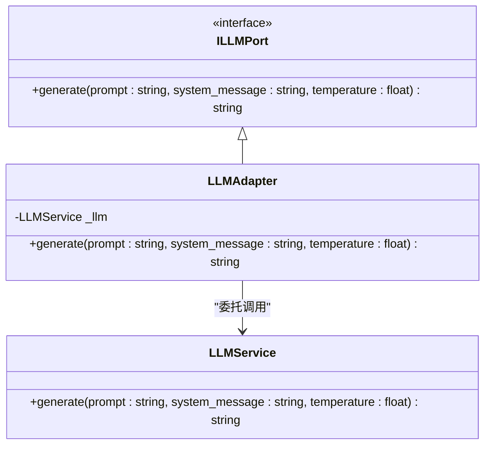
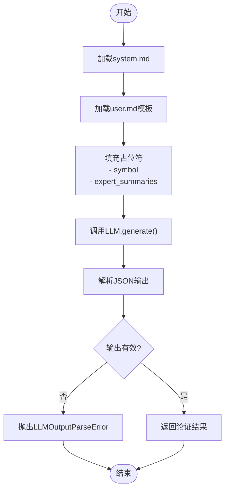
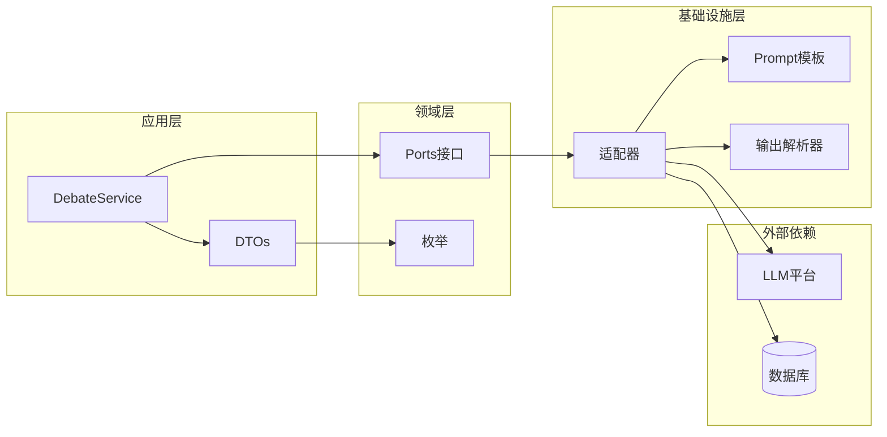
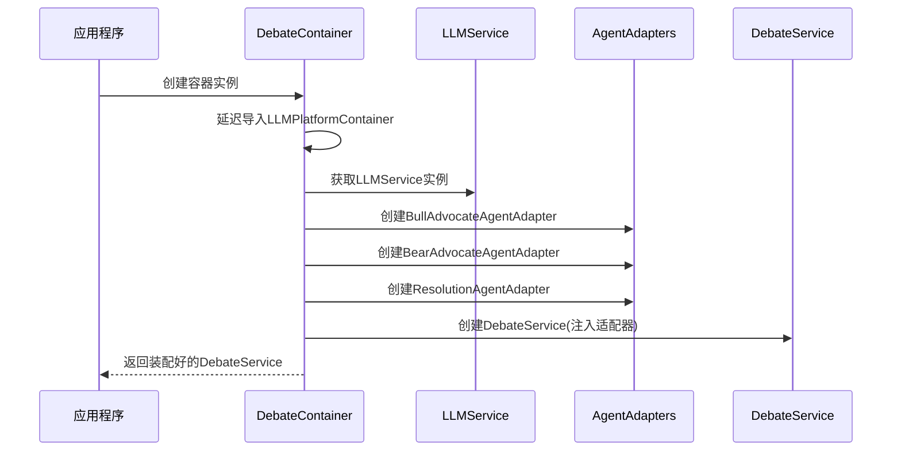
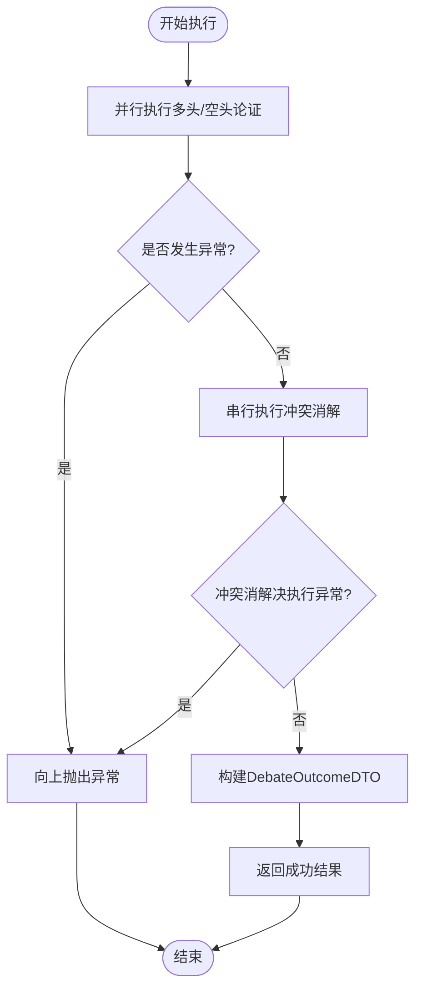

# 多空辩论引擎规范

<cite>
**本文档引用的文件**
- [README.md](file://README.md)
- [spec.md](file://openspec/specs/debate-bull-bear-engine/spec.md)
- [container.py](file://src/modules/debate/container.py)
- [debate_service.py](file://src/modules/debate/application/services/debate_service.py)
- [debate_input.py](file://src/modules/debate/domain/dtos/debate_input.py)
- [debate_outcome_dto.py](file://src/modules/debate/application/dtos/debate_outcome_dto.py)
- [bull_advocate_agent.py](file://src/modules/debate/domain/ports/bull_advocate_agent.py)
- [bear_advocate_agent.py](file://src/modules/debate/domain/ports/bear_advocate_agent.py)
- [resolution_agent.py](file://src/modules/debate/domain/ports/resolution_agent.py)
- [llm.py](file://src/modules/debate/domain/ports/llm.py)
- [llm_adapter.py](file://src/modules/debate/infrastructure/adapters/llm_adapter.py)
- [bull_advocate_agent_adapter.py](file://src/modules/debate/infrastructure/adapters/bull_advocate_agent_adapter.py)
- [bear_advocate_agent_adapter.py](file://src/modules/debate/infrastructure/adapters/bear_advocate_agent_adapter.py)
- [resolution_agent_adapter.py](file://src/modules/debate/infrastructure/adapters/resolution_agent_adapter.py)
</cite>

## 目录
1. [简介](#简介)
2. [项目结构](#项目结构)
3. [核心组件](#核心组件)
4. [架构概览](#架构概览)
5. [详细组件分析](#详细组件分析)
6. [依赖关系分析](#依赖关系分析)
7. [性能考虑](#性能考虑)
8. [故障排除指南](#故障排除指南)
9. [结论](#结论)

## 简介

多空辩论引擎是一个基于领域驱动设计（DDD）的多专家智能辩论系统，专门用于对股票投资标的进行结构化的多空观点辩论。该引擎通过LLM驱动的三阶段结构化辩论流程，整合五个专业研究专家的分析结果，输出综合的投资建议和风险评估。

### 主要特性

- **三阶段辩论流程**：多头论证 → 空头论证 → 交叉质疑与冲突消解
- **并行执行优化**：多头和空头论证并行执行，显著提升响应速度
- **结构化输出**：提供标准化的辩论结果和风险矩阵
- **模块化设计**：遵循DDD四层架构，高度可测试和可维护

## 项目结构

多空辩论引擎采用标准的领域驱动设计（DDD）四层架构：

**图表来源**
- [container.py](file://src/modules/debate/container.py#L25-L43)
- [debate_service.py](file://src/modules/debate/application/services/debate_service.py#L17-L67)

**章节来源**
- [container.py](file://src/modules/debate/container.py#L1-L43)
- [spec.md](file://openspec/specs/debate-bull-bear-engine/spec.md#L235-L260)

## 核心组件

### DebateService - 辩论编排器

DebateService是辩论模块的核心协调器，负责编排三阶段辩论流程：

**图表来源**
- [debate_service.py](file://src/modules/debate/application/services/debate_service.py#L35-L67)

### 专家适配器层

三个专家代理适配器分别负责不同类型的论证：

| 专家类型 | 角色描述 | 适配器名称 |
|---------|----------|-----------|
| 多头论证 | 支持上涨的观点 | BullAdvocateAgentAdapter |
| 空头论证 | 支持下跌的观点 | BearAdvocateAgentAdapter |
| 冲突消解 | 交叉质疑与综合判断 | ResolutionAgentAdapter |

**章节来源**
- [debate_service.py](file://src/modules/debate/application/services/debate_service.py#L1-L67)
- [bull_advocate_agent_adapter.py](file://src/modules/debate/infrastructure/adapters/bull_advocate_agent_adapter.py#L35-L72)
- [bear_advocate_agent_adapter.py](file://src/modules/debate/infrastructure/adapters/bear_advocate_agent_adapter.py#L35-L72)
- [resolution_agent_adapter.py](file://src/modules/debate/infrastructure/adapters/resolution_agent_adapter.py#L30-L67)

## 架构概览

多空辩论引擎采用分层架构设计，确保关注点分离和高内聚低耦合：

**图表来源**
- [container.py](file://src/modules/debate/container.py#L25-L43)
- [spec.md](file://openspec/specs/debate-bull-bear-engine/spec.md#L235-L260)

### 数据传输对象（DTO）

系统使用严格的DTO模式确保数据结构的清晰性和安全性：

**图表来源**
- [debate_input.py](file://src/modules/debate/domain/dtos/debate_input.py#L23-L28)
- [debate_outcome_dto.py](file://src/modules/debate/application/dtos/debate_outcome_dto.py#L27-L38)

**章节来源**
- [debate_input.py](file://src/modules/debate/domain/dtos/debate_input.py#L1-L28)
- [debate_outcome_dto.py](file://src/modules/debate/application/dtos/debate_outcome_dto.py#L1-L38)

## 详细组件分析

### LLM桥接层

LLM桥接层提供了统一的LLM调用接口，支持多个专家代理的并发调用：

**图表来源**
- [llm.py](file://src/modules/debate/domain/ports/llm.py#L10-L22)
- [llm_adapter.py](file://src/modules/debate/infrastructure/adapters/llm_adapter.py#L12-L29)

### 专家代理接口

三个专家代理接口定义了统一的调用协议：

| 接口名称 | 方法签名 | 输入参数 | 返回类型 |
|---------|----------|----------|----------|
| IBullAdvocateAgentPort | advocate(input: DebateInput) | DebateInput | BullArgument |
| IBearAdvocateAgentPort | advocate(input: DebateInput) | DebateInput | BearArgument |
| IResolutionAgentPort | resolve(symbol: str, bull: BullArgument, bear: BearArgument) | symbol, bull, bear | ResolutionResult |

**章节来源**
- [bull_advocate_agent.py](file://src/modules/debate/domain/ports/bull_advocate_agent.py#L12-L19)
- [bear_advocate_agent.py](file://src/modules/debate/domain/ports/bear_advocate_agent.py#L12-L19)
- [resolution_agent.py](file://src/modules/debate/domain/ports/resolution_agent.py#L12-L24)

### Prompt模板系统

每个专家代理都有一套完整的Prompt模板系统：

**图表来源**
- [bull_advocate_agent_adapter.py](file://src/modules/debate/infrastructure/adapters/bull_advocate_agent_adapter.py#L42-L72)
- [bear_advocate_agent_adapter.py](file://src/modules/debate/infrastructure/adapters/bear_advocate_agent_adapter.py#L42-L72)
- [resolution_agent_adapter.py](file://src/modules/debate/infrastructure/adapters/resolution_agent_adapter.py#L37-L67)

**章节来源**
- [bull_advocate_agent_adapter.py](file://src/modules/debate/infrastructure/adapters/bull_advocate_agent_adapter.py#L1-L72)
- [bear_advocate_agent_adapter.py](file://src/modules/debate/infrastructure/adapters/bear_advocate_agent_adapter.py#L1-L72)
- [resolution_agent_adapter.py](file://src/modules/debate/infrastructure/adapters/resolution_agent_adapter.py#L1-L67)

## 依赖关系分析

### 组件依赖图

**图表来源**
- [container.py](file://src/modules/debate/container.py#L25-L43)
- [debate_service.py](file://src/modules/debate/application/services/debate_service.py#L17-L34)

### 依赖注入容器

Composition Root负责管理整个依赖注入生命周期：

**图表来源**
- [container.py](file://src/modules/debate/container.py#L25-L43)

**章节来源**
- [container.py](file://src/modules/debate/container.py#L1-L43)

## 性能考虑

### 并行执行优化

系统通过异步并发执行显著提升了性能：

- **并行阶段**：多头和空头论证同时执行，总耗时接近单个代理的执行时间
- **串行阶段**：冲突消解在两个代理完成后串行执行
- **资源利用**：充分利用LLM资源，减少等待时间

### 内存管理

- **DTO设计**：使用Pydantic模型确保数据结构的内存效率
- **Prompt缓存**：Prompt模板在进程内缓存，避免重复加载
- **输出解析**：及时释放中间结果，防止内存泄漏

### 错误处理策略

**图表来源**
- [debate_service.py](file://src/modules/debate/application/services/debate_service.py#L35-L67)

## 故障排除指南

### 常见问题及解决方案

| 问题类型 | 症状描述 | 可能原因 | 解决方案 |
|---------|----------|----------|----------|
| LLM调用失败 | HTTP 500错误 | LLM服务不可用或配置错误 | 检查LLM平台连接和认证配置 |
| Prompt解析失败 | LLMOutputParseError | LLM输出格式不符合预期 | 验证Prompt模板和输出解析器 |
| 专家代理超时 | 超时错误 | 网络延迟或LLM响应慢 | 调整超时设置和重试机制 |
| 数据验证失败 | HTTP 400错误 | 输入数据格式不正确 | 检查请求参数和DTO验证规则 |

### 调试建议

1. **启用详细日志**：检查LLM调用的详细日志输出
2. **单元测试**：使用Mock代理验证业务逻辑
3. **集成测试**：验证完整的辩论流程
4. **性能监控**：监控各阶段的执行时间和资源使用

**章节来源**
- [spec.md](file://openspec/specs/debate-bull-bear-engine/spec.md#L198-L233)

## 结论

多空辩论引擎通过精心设计的架构和严格的DDD原则，实现了高性能、可扩展的智能辩论系统。其核心优势包括：

- **架构清晰**：四层架构确保了良好的关注点分离
- **性能优异**：并行执行和优化的资源利用
- **可测试性强**：完整的Mock支持和测试覆盖
- **扩展性好**：模块化设计便于功能扩展和维护

该系统为股票投资决策提供了结构化的多专家智能分析框架，通过标准化的数据流和严格的错误处理机制，确保了系统的可靠性和实用性。