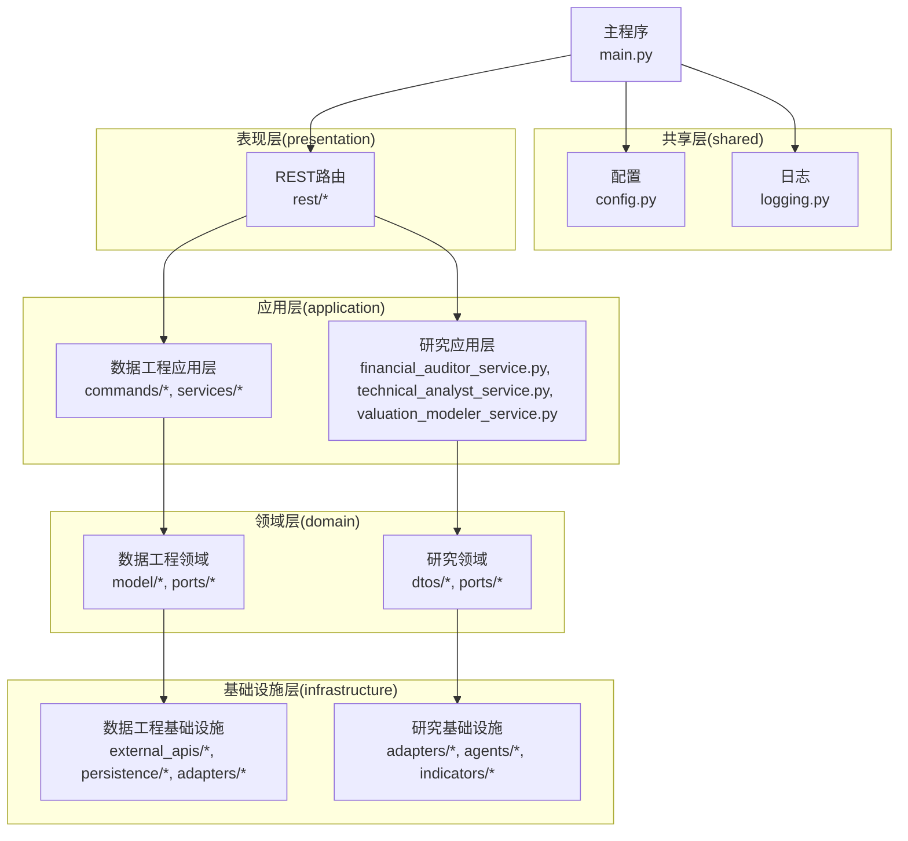
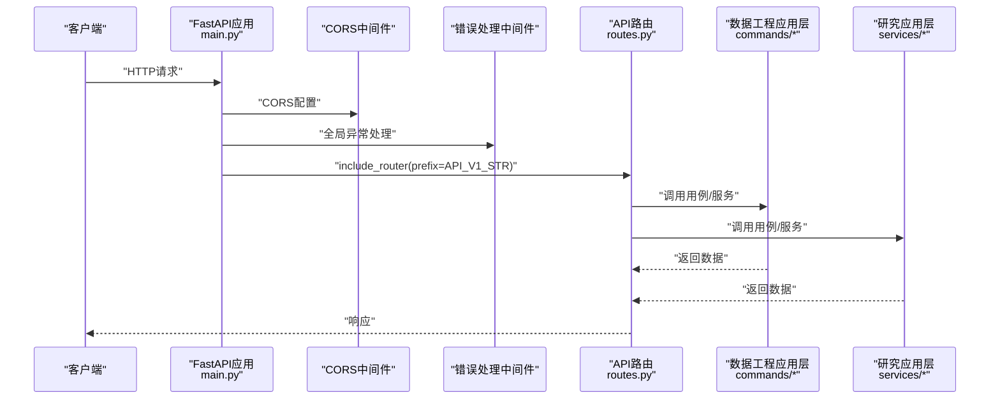
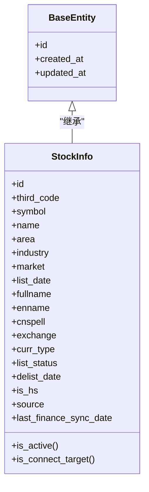
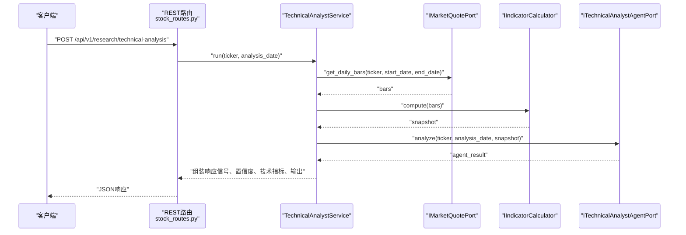
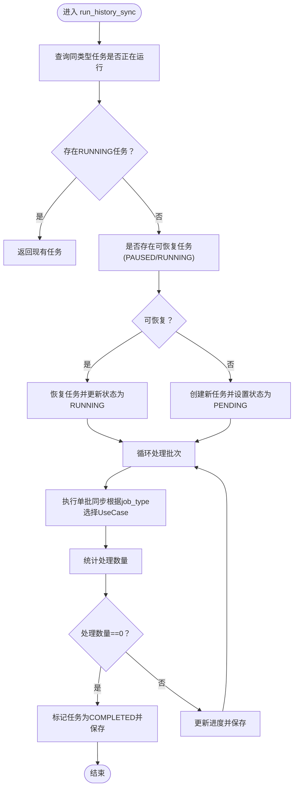
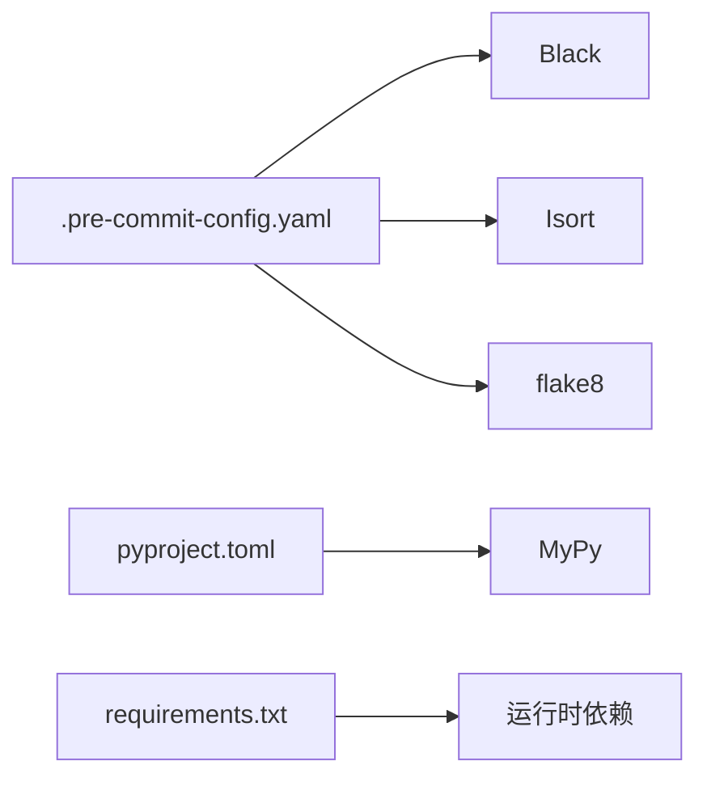

# 代码规范

<cite>
**本文引用的文件**
- [pyproject.toml](file://pyproject.toml)
- [.pre-commit-config.yaml](file://.pre-commit-config.yaml)
- [src/main.py](file://src/main.py)
- [src/shared/config.py](file://src/shared/config.py)
- [src/modules/data_engineering/domain/model/stock.py](file://src/modules/data_engineering/domain/model/stock.py)
- [src/modules/data_engineering/application/commands/sync_engine.py](file://src/modules/data_engineering/application/commands/sync_engine.py)
- [src/modules/research/application/technical_analyst_service.py](file://src/modules/research/application/technical_analyst_service.py)
- [src/modules/data_engineering/presentation/rest/stock_routes.py](file://src/modules/data_engineering/presentation/rest/stock_routes.py)
- [src/modules/data_engineering/domain/model/enums.py](file://src/modules/data_engineering/domain/model/enums.py)
- [src/shared/domain/base_entity.py](file://src/shared/domain/base_entity.py)
- [tests/conftest.py](file://tests/conftest.py)
- [pytest.ini](file://pytest.ini)
- [requirements.txt](file://requirements.txt)
- [openspec/specs/tech-standards.md](file://openspec/specs/tech-standards.md)
</cite>

## 目录
1. [引言](#引言)
2. [项目结构](#项目结构)
3. [核心组件](#核心组件)
4. [架构总览](#架构总览)
5. [详细组件分析](#详细组件分析)
6. [依赖分析](#依赖分析)
7. [性能考虑](#性能考虑)
8. [故障排查指南](#故障排查指南)
9. [结论](#结论)
10. [附录](#附录)

## 引言
本文件为“股票助手”项目的代码规范文档，面向后端与数据工程团队，聚焦Python代码风格、格式化与导入排序、注释与文档字符串、类型注解、模块组织与依赖管理等。项目采用Black格式化、Isort导入排序、MyPy静态类型检查，并通过pre-commit在提交前强制执行。本文结合仓库中的实际代码示例，给出命名约定、注释规范、类型注解最佳实践与模块划分指导，帮助团队统一风格、提升可维护性与协作效率。

## 项目结构
项目采用分层与领域驱动设计（DDD）相结合的组织方式：
- 应用层（application）：编排业务流程，封装用例与服务
- 领域层（domain）：定义实体、值对象、枚举与端口契约
- 基础设施层（infrastructure）：实现端口、外部API适配、持久化
- 表现层（presentation）：REST路由与DTO
- 共享层（shared）：通用配置、基础设施与公共异常
- 测试（tests）：单元与集成测试，使用pytest与AsyncClient

图表来源
- [src/main.py](file://src/main.py#L1-L75)
- [src/shared/config.py](file://src/shared/config.py#L1-L68)
- [src/modules/data_engineering/application/commands/sync_engine.py](file://src/modules/data_engineering/application/commands/sync_engine.py#L1-L280)
- [src/modules/research/application/technical_analyst_service.py](file://src/modules/research/application/technical_analyst_service.py#L1-L73)
- [src/modules/data_engineering/presentation/rest/stock_routes.py](file://src/modules/data_engineering/presentation/rest/stock_routes.py#L1-L106)

章节来源
- [src/main.py](file://src/main.py#L1-L75)
- [src/shared/config.py](file://src/shared/config.py#L1-L68)

## 核心组件
- Black格式化：行宽88，目标Python版本3.10，包含py/pyi文件
- Isort导入排序：使用black风格，多行输出风格为垂直排列
- MyPy静态检查：Python版本3.10，开启返回值与未使用配置告警，忽略缺失导入
- pre-commit钩子：在提交前自动执行Black、Isort、flake8与基础文件检查
- 测试框架：pytest，异步模式自动，测试路径tests

章节来源
- [pyproject.toml](file://pyproject.toml#L1-L22)
- [.pre-commit-config.yaml](file://.pre-commit-config.yaml#L1-L25)
- [pytest.ini](file://pytest.ini#L1-L5)

## 架构总览
下图展示了应用启动、CORS与中间件、路由注册以及模块间依赖关系：

图表来源
- [src/main.py](file://src/main.py#L1-L75)
- [src/api/routes.py](file://src/api/routes.py#L1-L200)

章节来源
- [src/main.py](file://src/main.py#L1-L75)

## 详细组件分析

### Python代码风格与格式化
- Black配置
  - 行宽：88
  - 目标版本：Python 3.10
  - 包含：.py与.pyi
- Isort配置
  - profile：black
  - 多行输出：垂直排列（multi_line_output=3）

建议实践
- 提交前确保通过pre-commit钩子（Black、Isort、flake8）
- 避免手动破坏Black格式化的缩进与换行
- 导入顺序遵循Isort规则，保持一致性

章节来源
- [pyproject.toml](file://pyproject.toml#L1-L22)
- [.pre-commit-config.yaml](file://.pre-commit-config.yaml#L10-L18)

### 命名约定
- 模块与包：小写下划线命名（如data_engineering、research）
- 类：帕斯卡命名（如StockInfo、SyncEngine、TechnicalAnalystService）
- 函数与方法：小写下划线命名（如run、compute、assemble_db_connection）
- 常量：全大写加下划线（如API_V1_STR、PROJECT_NAME）
- 变量：小写下划线命名（如db_session、use_case）
- 枚举：帕斯卡命名，值为字符串常量（如ListStatus、SyncJobType）
- DTO与类型别名：帕斯卡命名（如TechnicalIndicatorsSnapshot、PlaceholderValue）

章节来源
- [src/modules/data_engineering/domain/model/stock.py](file://src/modules/data_engineering/domain/model/stock.py#L1-L63)
- [src/modules/data_engineering/application/commands/sync_engine.py](file://src/modules/data_engineering/application/commands/sync_engine.py#L1-L280)
- [src/modules/research/application/technical_analyst_service.py](file://src/modules/research/application/technical_analyst_service.py#L1-L73)
- [src/modules/data_engineering/domain/model/enums.py](file://src/modules/data_engineering/domain/model/enums.py#L1-L40)
- [src/shared/domain/base_entity.py](file://src/shared/domain/base_entity.py#L1-L18)

### 注释与文档字符串
- 模块级注释：简要说明模块职责与用途（如__init__.py中的说明）
- 类注释：说明类的职责、关键行为与约束（如StockInfo、SyncEngine）
- 方法注释：说明输入、输出、异常与边界条件（如run、compute、run_history_sync）
- 函数注释：参数、返回值、异常与注意事项（如run_incremental_daily_sync）
- 文档字符串语言：中文（简体），解释“做什么、为什么这样做、关键边界条件”，标识符仍使用英文

章节来源
- [src/modules/data_engineering/domain/model/stock.py](file://src/modules/data_engineering/domain/model/stock.py#L7-L63)
- [src/modules/data_engineering/application/commands/sync_engine.py](file://src/modules/data_engineering/application/commands/sync_engine.py#L20-L129)
- [src/modules/research/application/technical_analyst_service.py](file://src/modules/research/application/technical_analyst_service.py#L14-L73)
- [openspec/specs/tech-standards.md](file://openspec/specs/tech-standards.md#L162-L166)

### 类与继承关系

图表来源
- [src/shared/domain/base_entity.py](file://src/shared/domain/base_entity.py#L8-L18)
- [src/modules/data_engineering/domain/model/stock.py](file://src/modules/data_engineering/domain/model/stock.py#L7-L63)

章节来源
- [src/shared/domain/base_entity.py](file://src/shared/domain/base_entity.py#L1-L18)
- [src/modules/data_engineering/domain/model/stock.py](file://src/modules/data_engineering/domain/model/stock.py#L1-L63)

### 类型注解规范
- 参数类型：明确标注类型（如str、Optional[date]、List[DailyBarInput]）
- 返回值类型：函数与方法应标注返回类型（如Dict[str, Any]、bool、date）
- 变量类型：复杂结构使用泛型（如Dict[str, Any]、List[date]）
- 枚举与联合类型：使用Enum与Union（如ListStatus、PlaceholderValue）
- Pydantic字段：使用Field与描述信息，配合ConfigDict与json_schema_extra

示例参考
- 配置类与字段验证：[src/shared/config.py](file://src/shared/config.py#L8-L67)
- 领域实体与字段描述：[src/modules/data_engineering/domain/model/stock.py](file://src/modules/data_engineering/domain/model/stock.py#L7-L63)
- 用例与服务方法签名：[src/modules/data_engineering/application/commands/sync_engine.py](file://src/modules/data_engineering/application/commands/sync_engine.py#L47-L129), [src/modules/research/application/technical_analyst_service.py](file://src/modules/research/application/technical_analyst_service.py#L30-L73)

章节来源
- [src/shared/config.py](file://src/shared/config.py#L1-L68)
- [src/modules/data_engineering/domain/model/stock.py](file://src/modules/data_engineering/domain/model/stock.py#L1-L63)
- [src/modules/data_engineering/application/commands/sync_engine.py](file://src/modules/data_engineering/application/commands/sync_engine.py#L1-L280)
- [src/modules/research/application/technical_analyst_service.py](file://src/modules/research/application/technical_analyst_service.py#L1-L73)

### 代码组织与模块划分
- 分层清晰：应用层负责编排，领域层定义契约与实体，基础设施层实现端口与外部交互，表现层负责路由与DTO
- 包组织：按功能域拆分（data_engineering、research、llm_platform），每个域内再按三层组织
- 依赖注入：通过FastAPI依赖与工厂函数注入仓储与提供者，降低耦合
- 路由与DTO：REST路由集中于presentation/rest，响应统一包装为BaseResponse

章节来源
- [src/modules/data_engineering/presentation/rest/stock_routes.py](file://src/modules/data_engineering/presentation/rest/stock_routes.py#L1-L106)
- [src/main.py](file://src/main.py#L1-L75)

### API工作流（技术分析师服务）

图表来源
- [src/modules/research/application/technical_analyst_service.py](file://src/modules/research/application/technical_analyst_service.py#L30-L73)
- [src/modules/data_engineering/presentation/rest/stock_routes.py](file://src/modules/data_engineering/presentation/rest/stock_routes.py#L79-L106)

章节来源
- [src/modules/research/application/technical_analyst_service.py](file://src/modules/research/application/technical_analyst_service.py#L1-L73)
- [src/modules/data_engineering/presentation/rest/stock_routes.py](file://src/modules/data_engineering/presentation/rest/stock_routes.py#L1-L106)

### 复杂逻辑流程（历史同步与断点续跑）

图表来源
- [src/modules/data_engineering/application/commands/sync_engine.py](file://src/modules/data_engineering/application/commands/sync_engine.py#L47-L129)

章节来源
- [src/modules/data_engineering/application/commands/sync_engine.py](file://src/modules/data_engineering/application/commands/sync_engine.py#L1-L280)

### 配置与启动流程
- 应用启动：初始化日志、创建FastAPI实例、注册CORS与全局异常处理中间件、注册路由
- 启停事件：startup中启动调度器与LLM平台初始化；shutdown中关闭调度器
- 配置加载：使用Pydantic Settings自动加载.env，支持CORS与数据库连接字符串组装

章节来源
- [src/main.py](file://src/main.py#L14-L48)
- [src/shared/config.py](file://src/shared/config.py#L8-L67)

## 依赖分析
- 工具链
  - Black：统一格式
  - Isort：导入排序
  - flake8：基础风格检查
  - pre-commit：提交前钩子
- 运行时依赖：FastAPI、SQLAlchemy异步、Pydantic Settings、Loguru、HTTPX、Prometheus、pandas、tushare、OpenAI、APScheduler等

图表来源
- [.pre-commit-config.yaml](file://.pre-commit-config.yaml#L1-L25)
- [pyproject.toml](file://pyproject.toml#L1-L22)
- [requirements.txt](file://requirements.txt#L1-L16)

章节来源
- [.pre-commit-config.yaml](file://.pre-commit-config.yaml#L1-L25)
- [pyproject.toml](file://pyproject.toml#L1-L22)
- [requirements.txt](file://requirements.txt#L1-L16)

## 性能考虑
- 批处理与断点续跑：同步引擎按批次处理，支持断点续跑，减少单次任务耗时与失败影响范围
- 异常隔离：单只股票或单日失败不中断整体流程，提高稳定性
- 数据库连接：使用异步SQLAlchemy与连接池预检，避免长事务与阻塞
- 日志与监控：使用Loguru与Prometheus指标，便于定位性能瓶颈

章节来源
- [src/modules/data_engineering/application/commands/sync_engine.py](file://src/modules/data_engineering/application/commands/sync_engine.py#L94-L128)
- [tests/conftest.py](file://tests/conftest.py#L22-L50)

## 故障排查指南
- 启动与路由
  - 确认CORS配置与中间件顺序
  - 检查API前缀与路由注册
- 数据同步
  - 确认日线数据已同步，否则技术分析接口可能无数据
  - 检查同步任务状态与进度，必要时重试或清理冲突任务
- 测试环境
  - 使用AsyncClient与事务回滚，避免污染数据库
  - 确保测试数据库连接可用，或在CI中准备独立测试库

章节来源
- [src/main.py](file://src/main.py#L50-L66)
- [src/modules/research/application/technical_analyst_service.py](file://src/modules/research/application/technical_analyst_service.py#L48-L54)
- [tests/conftest.py](file://tests/conftest.py#L22-L50)

## 结论
本规范以Black、Isort、MyPy与pre-commit为核心工具，结合DDD分层与依赖注入，形成统一、可维护、可扩展的Python代码风格与组织方式。建议在日常开发中严格遵循命名、注释、类型注解与模块划分规范，并通过工具链自动化保障质量。

## 附录
- 示例与反例指引
  - 命名：类使用帕斯卡命名（如TechnicalAnalystService），函数使用小写下划线（如run），常量全大写（如API_V1_STR）
  - 注释：方法注释包含参数、返回值与异常说明；模块注释说明职责与用途
  - 类型注解：函数签名与字段定义使用明确类型；复杂结构使用泛型与联合类型
  - 导入排序：遵循Isort black风格，避免手动调整破坏一致性
  - 格式化：提交前运行Black与Isort，确保符合项目配置

章节来源
- [src/modules/research/application/technical_analyst_service.py](file://src/modules/research/application/technical_analyst_service.py#L1-L73)
- [src/modules/data_engineering/application/commands/sync_engine.py](file://src/modules/data_engineering/application/commands/sync_engine.py#L1-L280)
- [pyproject.toml](file://pyproject.toml#L6-L8)
- [.pre-commit-config.yaml](file://.pre-commit-config.yaml#L15-L18)