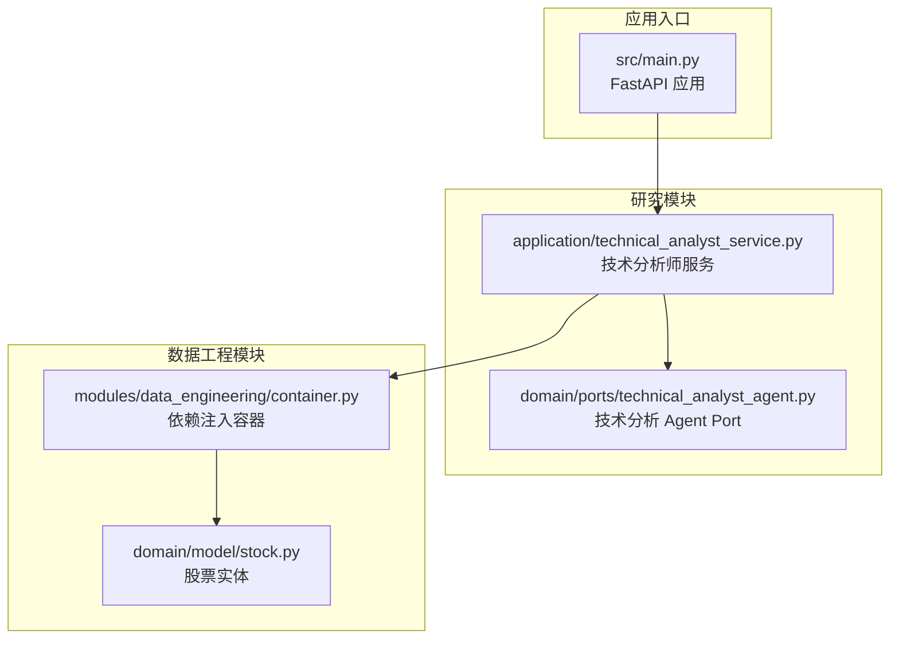
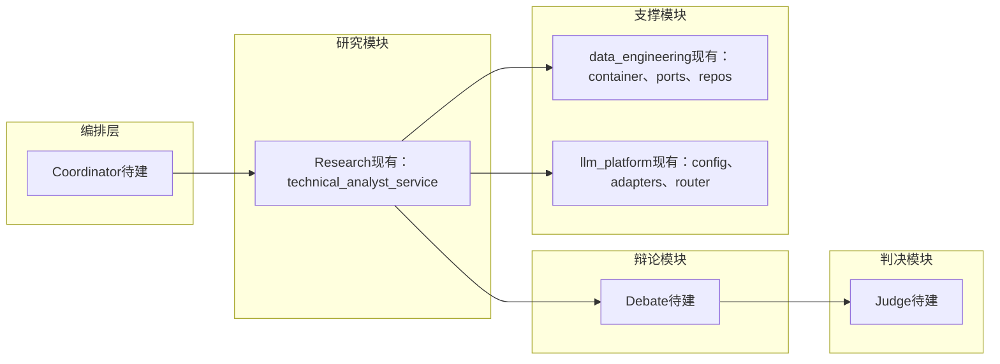
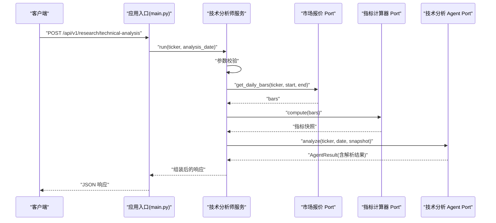
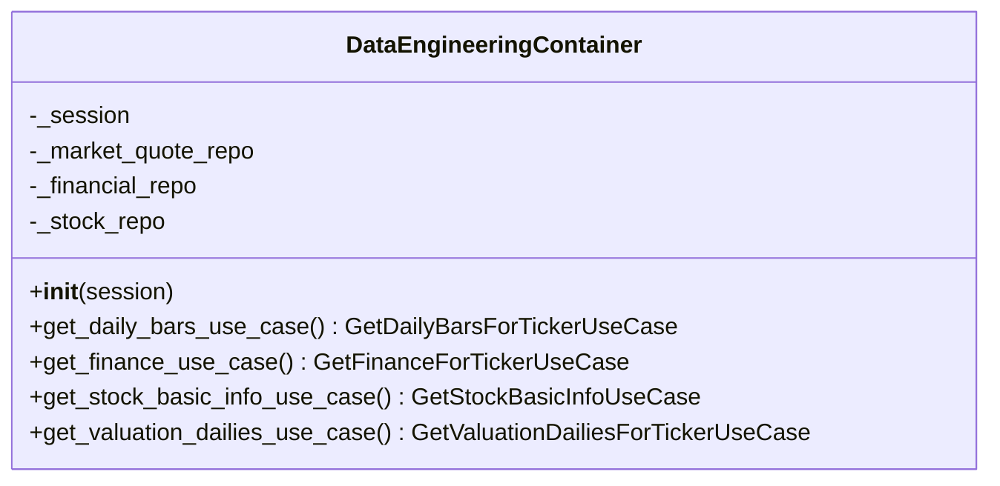
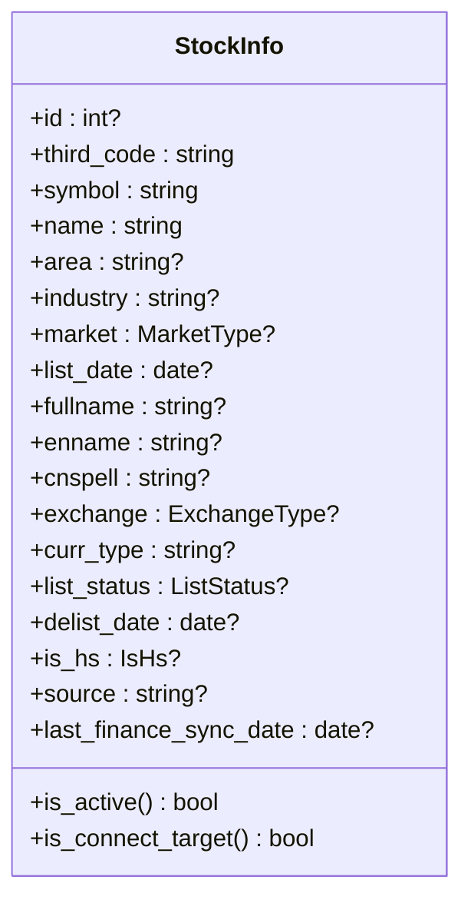
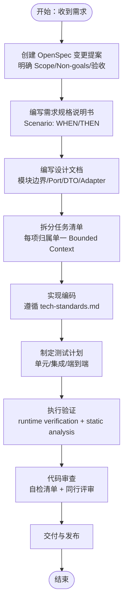
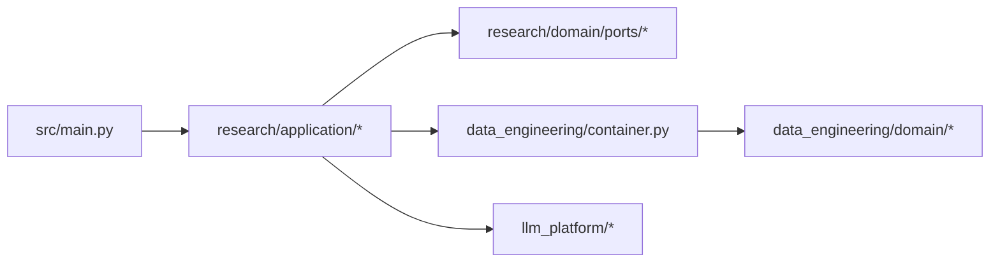

# 功能开发流程

<cite>
**本文引用的文件**
- [README.md](file://README.md)
- [vision-and-modules.md](file://openspec/specs/vision-and-modules.md)
- [tech-standards.md](file://openspec/specs/tech-standards.md)
- [config.yaml](file://openspec/config.yaml)
- [main.py](file://src/main.py)
- [container.py](file://src/modules/data_engineering/container.py)
- [technical_analyst_service.py](file://src/modules/research/application/technical_analyst_service.py)
- [technical_analyst_agent.py](file://src/modules/research/domain/ports/technical_analyst_agent.py)
- [stock.py](file://src/modules/data_engineering/domain/model/stock.py)
- [test_health.py](file://tests/test_health.py)
- [pyproject.toml](file://pyproject.toml)
- [pytest.ini](file://pytest.ini)
</cite>

## 目录
1. [引言](#引言)
2. [项目结构](#项目结构)
3. [核心组件](#核心组件)
4. [架构总览](#架构总览)
5. [详细组件分析](#详细组件分析)
6. [依赖分析](#依赖分析)
7. [性能考量](#性能考量)
8. [故障排查指南](#故障排查指南)
9. [结论](#结论)
10. [附录](#附录)

## 引言
本指南面向“股票助手”项目的新功能开发，提供从需求到交付的完整流程，涵盖 OpenSpec 规范应用、DDD 架构下的功能开发模式、模块创建与接口设计、实现与集成测试、代码审查与质量保障，以及功能测试策略。目标是帮助团队在统一的架构与规范下高效、高质量地交付功能。

## 项目结构
项目采用 DDD 分层与模块化组织，核心模块包括数据工程（data_engineering）、LLM 平台（llm_platform）、研究（research）等。应用入口通过 FastAPI 提供 REST 接口，启动时初始化调度器与 LLM 平台注册表。

**图示来源**
- [main.py](file://src/main.py#L1-L75)
- [technical_analyst_service.py](file://src/modules/research/application/technical_analyst_service.py#L1-L73)
- [technical_analyst_agent.py](file://src/modules/research/domain/ports/technical_analyst_agent.py#L1-L23)
- [container.py](file://src/modules/data_engineering/container.py#L1-L59)
- [stock.py](file://src/modules/data_engineering/domain/model/stock.py#L1-L63)

**章节来源**
- [main.py](file://src/main.py#L1-L75)
- [vision-and-modules.md](file://openspec/specs/vision-and-modules.md#L1-L99)

## 核心组件
- 应用入口与启动流程：负责日志初始化、CORS 配置、全局异常中间件、路由注册，以及启动/关闭事件中调度器与 LLM 平台的初始化。
- 研究模块服务：技术分析师服务封装了“取日线 → 计算指标 → 调用 Agent → 组装响应”的完整流程，严格通过 Port 与外部交互。
- 数据工程模块容器：统一装配 UseCase 依赖，屏蔽基础设施细节，供上层模块通过依赖注入获取能力。
- 领域实体：股票实体承载业务属性与行为（如是否上市、是否沪深港通标的），体现 DDD 的“实体需有领域行为”。

**章节来源**
- [main.py](file://src/main.py#L14-L65)
- [technical_analyst_service.py](file://src/modules/research/application/technical_analyst_service.py#L14-L73)
- [container.py](file://src/modules/data_engineering/container.py#L32-L59)
- [stock.py](file://src/modules/data_engineering/domain/model/stock.py#L7-L63)

## 架构总览
系统采用 DDD 四层结构：表现层（Presentation）、应用层（Application）、领域层（Domain）、基础设施层（Infrastructure）。模块间通过 Port 暴露能力，禁止跨模块直接依赖基础设施实现。研究流水线方向固定：编排 → 研究（可调 data_engineering、llm_platform）→ 辩论 → 判决。

**图示来源**
- [vision-and-modules.md](file://openspec/specs/vision-and-modules.md#L21-L48)

**章节来源**
- [vision-and-modules.md](file://openspec/specs/vision-and-modules.md#L17-L48)

## 详细组件分析

### 技术分析师服务（应用层）
技术分析师服务是研究模块的核心应用服务，负责：
- 参数校验与边界条件处理
- 通过市场报价 Port 获取日线数据
- 通过指标计算器 Port 计算技术指标快照
- 通过技术分析 Agent Port 调用 LLM 并解析结果
- 组装包含输入、指标、输出与结论的完整响应

**图示来源**
- [main.py](file://src/main.py#L65-L75)
- [technical_analyst_service.py](file://src/modules/research/application/technical_analyst_service.py#L30-L73)
- [technical_analyst_agent.py](file://src/modules/research/domain/ports/technical_analyst_agent.py#L12-L23)

**章节来源**
- [technical_analyst_service.py](file://src/modules/research/application/technical_analyst_service.py#L14-L73)

### 数据工程容器（基础设施适配器）
数据工程容器作为组合根，负责：
- 组装 UseCase 所需的仓储实例
- 通过构造函数注入 AsyncSession
- 提供多个 UseCase 的工厂方法，供上层模块按需获取

**图示来源**
- [container.py](file://src/modules/data_engineering/container.py#L32-L59)

**章节来源**
- [container.py](file://src/modules/data_engineering/container.py#L1-L59)

### 股票实体（领域层）
股票实体体现了 DDD 的“实体需有领域行为”，包含：
- 丰富的业务属性（如交易所、上市状态、是否沪深港通等）
- 领域行为方法（如是否上市、是否沪深港通标的）

**图示来源**
- [stock.py](file://src/modules/data_engineering/domain/model/stock.py#L7-L63)

**章节来源**
- [stock.py](file://src/modules/data_engineering/domain/model/stock.py#L1-L63)

### OpenSpec 规范应用
- OpenSpec 项目配置：在配置文件中明确项目上下文、模块边界与技术栈，确保 AI 在生成提案、设计与任务时保持 DDD 一致性。
- 规范来源：愿景与模块、技术规范作为 OpenSpec 的上下文与约束，指导变更的可验证性与实现顺序。
- 验证策略：运行时验证必须在容器内执行，静态分析可在本地执行，确保验证可靠且不受容器崩溃影响。

**图示来源**
- [config.yaml](file://openspec/config.yaml#L1-L27)
- [vision-and-modules.md](file://openspec/specs/vision-and-modules.md#L1-L99)
- [tech-standards.md](file://openspec/specs/tech-standards.md#L131-L150)

**章节来源**
- [config.yaml](file://openspec/config.yaml#L1-L27)
- [tech-standards.md](file://openspec/specs/tech-standards.md#L131-L150)

## 依赖分析
- 模块间依赖方向固定：研究模块仅通过 Port 调用数据工程与 LLM 平台，不直接依赖基础设施实现。
- 依赖注入：通过组合根容器装配仓储与 UseCase，避免上层模块感知基础设施细节。
- 异常与日志：异常分层传递，日志分级明确，确保问题可追踪。

**图示来源**
- [main.py](file://src/main.py#L1-L75)
- [container.py](file://src/modules/data_engineering/container.py#L1-L59)
- [technical_analyst_service.py](file://src/modules/research/application/technical_analyst_service.py#L1-L73)

**章节来源**
- [main.py](file://src/main.py#L1-L75)
- [container.py](file://src/modules/data_engineering/container.py#L1-L59)

## 性能考量
- 异步优先：数据采集与研究分析并行执行，减少串行阻塞。
- 证据驱动：观点必须基于硬数据或软情报，避免无效计算。
- 对抗决策：通过多空辩论引入博弈，降低决策偏见。
- 优化建议：缓存热点指标、批量查询与写入、合理设置 LLM 调用超时与重试策略。

## 故障排查指南
- 健康检查：通过健康检查端点验证服务可用性与状态信息。
- 日志规范：关键流程需包含入口/出口日志与错误日志，使用中文便于排查。
- 异常处理：遵循分层传递，Presentation 层统一捕获异常并转为 HTTP 响应。
- 运行时验证：涉及代码执行与数据库的验证必须在容器内执行，确保环境一致。

**章节来源**
- [test_health.py](file://tests/test_health.py#L1-L12)
- [tech-standards.md](file://openspec/specs/tech-standards.md#L101-L112)
- [main.py](file://src/main.py#L61-L65)

## 结论
本指南提供了基于 OpenSpec 与 DDD 的功能开发全流程：从需求到设计、从实现到测试与审查，强调模块边界、端到端验证与质量保障。遵循本文档与相关规范，可确保新功能在统一架构下稳定、可维护地交付。

## 附录

### 功能开发步骤（实践清单）
- 需求与 OpenSpec
  - 创建 OpenSpec 变更提案，明确 Scope 与验收
  - 编写需求规格说明书（Scenario: WHEN/THEN）
  - 编写设计文档（模块边界、Port、DTO、Adapter）
  - 拆分任务清单（每项归属单一 Bounded Context）
- 设计与建模
  - 领域建模：实体/值对象/枚举集中管理，实体需有领域行为
  - 应用服务：职责单一、参数校验、异常分层
  - 基础设施适配器：通过 Port 将下游 DTO 转换为本模块领域 DTO
- 实现与测试
  - 依赖注入：组合根装配 UseCase 与仓储
  - 测试策略：单元测试（Port/mocks）、集成测试（UseCase/DB）、端到端测试（API）
  - 验证策略：运行时验证在容器内执行，静态分析在本地执行
- 代码审查
  - 自检清单：是否遵循 DDD 分层与模块边界、是否使用 Port、是否具备可测性
  - 同行评审：关注架构一致性、异常处理、日志与性能
  - 质量保证：通过自动化测试覆盖关键场景，确保交付即通过

**章节来源**
- [vision-and-modules.md](file://openspec/specs/vision-and-modules.md#L92-L99)
- [tech-standards.md](file://openspec/specs/tech-standards.md#L131-L150)
- [pyproject.toml](file://pyproject.toml#L16-L22)
- [pytest.ini](file://pytest.ini#L1-L5)