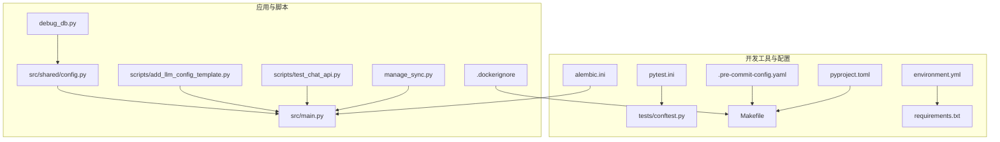
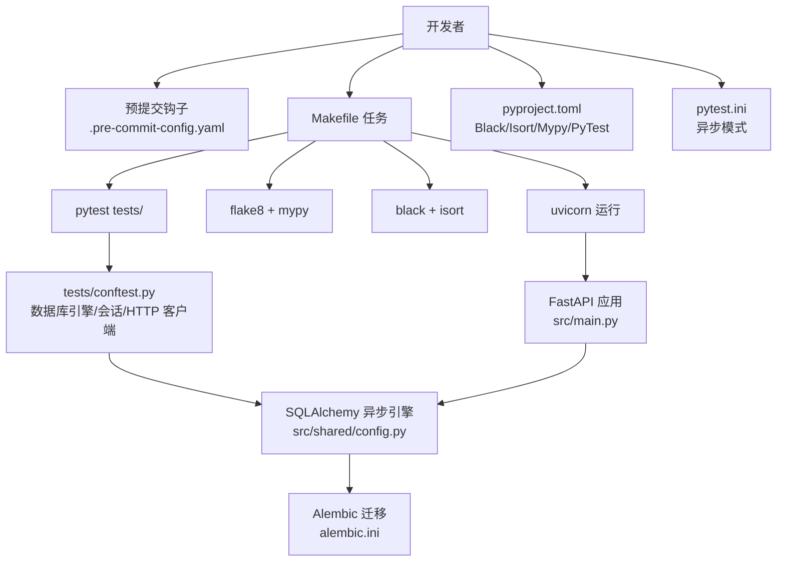
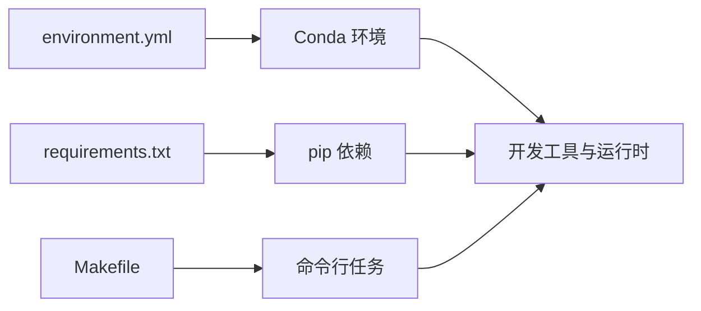

# 开发工具

<cite>
**本文引用的文件**
- [.pre-commit-config.yaml](file://.pre-commit-config.yaml)
- [pyproject.toml](file://pyproject.toml)
- [pytest.ini](file://pytest.ini)
- [tests/conftest.py](file://tests/conftest.py)
- [Makefile](file://Makefile)
- [environment.yml](file://environment.yml)
- [requirements.txt](file://requirements.txt)
- [alembic.ini](file://alembic.ini)
- [src/shared/config.py](file://src/shared/config.py)
- [src/main.py](file://src/main.py)
- [scripts/add_llm_config_template.py](file://scripts/add_llm_config_template.py)
- [scripts/test_chat_api.py](file://scripts/test_chat_api.py)
- [manage_sync.py](file://manage_sync.py)
- [debug_db.py](file://debug_db.py)
- [.dockerignore](file://.dockerignore)
</cite>

## 目录
1. [简介](#简介)
2. [项目结构](#项目结构)
3. [核心组件](#核心组件)
4. [架构总览](#架构总览)
5. [详细组件分析](#详细组件分析)
6. [依赖关系分析](#依赖关系分析)
7. [性能考虑](#性能考虑)
8. [故障排查指南](#故障排查指南)
9. [结论](#结论)
10. [附录](#附录)

## 简介
本指南面向“股票助手”项目的开发者，系统讲解开发工具链的配置与使用，涵盖以下方面：
- 代码质量与风格：Black、Isort、Flake8（作为预提交钩子）、Mypy 类型检查
- 预提交钩子：安装、配置、触发条件与错误处理
- 调试与性能：IDE 配置建议、断点调试、数据库调试脚本与同步任务调试
- 测试体系：PyTest 配置、异步测试、测试夹具与覆盖率
- 数据库工具：Alembic 迁移与连接管理
- 辅助脚本：LLM 配置模板注入、聊天接口测试、手动同步任务执行、数据库调试

## 项目结构
围绕开发工具的相关文件主要分布在如下位置：
- 工具配置与脚本：根目录下的配置文件与 Makefile、脚本目录
- 测试配置：tests/conftest.py、pytest.ini
- 数据库迁移：alembic 目录与 alembic.ini
- 环境与依赖：environment.yml、requirements.txt
- 预提交：.pre-commit-config.yaml
- 运行入口与配置：src/main.py、src/shared/config.py

图表来源
- [.pre-commit-config.yaml](file://.pre-commit-config.yaml#L1-L25)
- [pyproject.toml](file://pyproject.toml#L1-L22)
- [pytest.ini](file://pytest.ini#L1-L5)
- [tests/conftest.py](file://tests/conftest.py#L1-L56)
- [Makefile](file://Makefile#L1-L27)
- [environment.yml](file://environment.yml#L1-L29)
- [requirements.txt](file://requirements.txt#L1-L16)
- [alembic.ini](file://alembic.ini#L1-L97)
- [src/main.py](file://src/main.py#L1-L75)
- [src/shared/config.py](file://src/shared/config.py#L1-L68)
- [scripts/add_llm_config_template.py](file://scripts/add_llm_config_template.py#L1-L72)
- [scripts/test_chat_api.py](file://scripts/test_chat_api.py#L1-L37)
- [manage_sync.py](file://manage_sync.py#L1-L39)
- [debug_db.py](file://debug_db.py#L1-L21)
- [.dockerignore](file://.dockerignore#L1-L42)

章节来源
- [Makefile](file://Makefile#L1-L27)
- [environment.yml](file://environment.yml#L1-L29)
- [requirements.txt](file://requirements.txt#L1-L16)
- [.pre-commit-config.yaml](file://.pre-commit-config.yaml#L1-L25)
- [pyproject.toml](file://pyproject.toml#L1-L22)
- [pytest.ini](file://pytest.ini#L1-L5)
- [tests/conftest.py](file://tests/conftest.py#L1-L56)
- [alembic.ini](file://alembic.ini#L1-L97)
- [src/shared/config.py](file://src/shared/config.py#L1-L68)
- [src/main.py](file://src/main.py#L1-L75)
- [scripts/add_llm_config_template.py](file://scripts/add_llm_config_template.py#L1-L72)
- [scripts/test_chat_api.py](file://scripts/test_chat_api.py#L1-L37)
- [manage_sync.py](file://manage_sync.py#L1-L39)
- [debug_db.py](file://debug_db.py#L1-L21)
- [.dockerignore](file://.dockerignore#L1-L42)

## 核心组件
- Black：统一代码风格，行宽、目标版本、包含规则在 pyproject.toml 中配置
- Isort：导入排序，配合 Black 的多行输出风格
- Flake8：静态检查，作为预提交钩子之一，额外依赖 bugbear 规则集
- Mypy：类型检查，开启返回值警告、忽略缺失导入等策略
- PyTest：测试框架，支持异步测试，自动事件循环作用域
- Alembic：数据库迁移，配置脚本路径、日志级别与 SQLAlchemy URL
- 预提交钩子：trailing-whitespace、end-of-file-fixer、check-yaml、check-added-large-files、black、isort、flake8

章节来源
- [pyproject.toml](file://pyproject.toml#L1-L22)
- [.pre-commit-config.yaml](file://.pre-commit-config.yaml#L1-L25)
- [pytest.ini](file://pytest.ini#L1-L5)
- [alembic.ini](file://alembic.ini#L1-L97)

## 架构总览
下图展示开发工具链与项目的关系：工具配置文件驱动命令行与 CI；测试夹具提供数据库与 HTTP 客户端；Alembic 管理数据库演进；运行时通过配置类加载环境变量并建立数据库连接。

图表来源
- [.pre-commit-config.yaml](file://.pre-commit-config.yaml#L1-L25)
- [Makefile](file://Makefile#L1-L27)
- [pyproject.toml](file://pyproject.toml#L1-L22)
- [pytest.ini](file://pytest.ini#L1-L5)
- [tests/conftest.py](file://tests/conftest.py#L1-L56)
- [src/shared/config.py](file://src/shared/config.py#L1-L68)
- [alembic.ini](file://alembic.ini#L1-L97)
- [src/main.py](file://src/main.py#L1-L75)

## 详细组件分析

### Black 代码格式化
- 配置位置与要点
  - 行长度、目标 Python 版本、包含规则在 pyproject.toml 的 [tool.black] 下配置
- 使用方式
  - 通过 Makefile 的 format 目标批量格式化源码与测试目录
  - 在预提交钩子中自动执行
- 最佳实践
  - 与 Isort 协同，确保导入顺序与格式一致
  - 在 CI 中统一执行，避免风格分歧

章节来源
- [pyproject.toml](file://pyproject.toml#L1-L5)
- [Makefile](file://Makefile#L17-L19)
- [.pre-commit-config.yaml](file://.pre-commit-config.yaml#L10-L13)

### Isort 导入排序
- 配置位置与要点
  - profile 与多行输出风格在 pyproject.toml 的 [tool.isort] 下配置
- 使用方式
  - 通过 Makefile 的 format 目标或预提交钩子执行
- 最佳实践
  - 与 Black 配置保持一致，避免二次修改

章节来源
- [pyproject.toml](file://pyproject.toml#L6-L8)
- [Makefile](file://Makefile#L17-L19)
- [.pre-commit-config.yaml](file://.pre-commit-config.yaml#L15-L18)

### Mypy 类型检查
- 配置位置与要点
  - Python 版本、返回值警告、忽略缺失导入等在 pyproject.toml 的 [tool.mypy] 下配置
- 使用方式
  - 通过 Makefile 的 lint 目标调用
  - 可在 IDE 中集成以获得实时提示
- 最佳实践
  - 逐步减少忽略缺失导入，提升类型覆盖度

章节来源
- [pyproject.toml](file://pyproject.toml#L10-L14)
- [Makefile](file://Makefile#L15)

### Flake8 与 PyLint（作为预提交钩子）
- 配置位置与要点
  - 预提交钩子配置在 .pre-commit-config.yaml，其中包含 flake8 与额外依赖
- 使用方式
  - 通过预提交钩子自动执行；也可在本地或 CI 中单独运行
- 错误处理
  - 钩子失败会阻止提交，需修复后重试

章节来源
- [.pre-commit-config.yaml](file://.pre-commit-config.yaml#L20-L24)

### 预提交钩子设置与管理
- 安装与启用
  - 安装：pip 或 conda 安装 pre-commit 后，在仓库根目录启用
  - 启用：首次在本地运行 pre-commit install
- 钩子清单
  - 基础清理：trailing-whitespace、end-of-file-fixer、check-yaml、check-added-large-files
  - 格式化：black、isort
  - 静态检查：flake8
- 触发条件
  - 提交前自动触发；可使用 pre-commit run --all-files 手动运行全部钩子
- 错误处理
  - 钩子失败时会显示具体问题，修复后重新提交

章节来源
- [.pre-commit-config.yaml](file://.pre-commit-config.yaml#L1-L25)

### 调试工具与使用方法
- IDE 配置建议
  - 使用 VS Code 或 PyCharm，启用 Python 解释器为 Conda 环境
  - 在运行/调试配置中指向 src/main.py，设置环境变量文件为 .env
- 断点调试
  - 在需要的位置设置断点，使用 IDE 的调试功能启动应用
- 性能分析
  - 使用 Python 内置的 cProfile 或 IDE 的性能分析工具对关键函数进行分析
- 数据库调试
  - 使用 debug_db.py 快速查询数据库状态，验证数据一致性
- 同步任务调试
  - 使用 manage_sync.py 手动触发增量财务数据或日线数据同步，便于定位问题

章节来源
- [src/main.py](file://src/main.py#L1-L75)
- [src/shared/config.py](file://src/shared/config.py#L1-L68)
- [debug_db.py](file://debug_db.py#L1-L21)
- [manage_sync.py](file://manage_sync.py#L1-L39)

### 测试工具配置与使用
- PyTest 配置
  - 在 pyproject.toml 的 [tool.pytest.ini_options] 中设置最小版本、附加选项与测试路径
  - 在 pytest.ini 中启用 asyncio_mode 与默认作用域
- 异步测试处理
  - tests/conftest.py 提供异步数据库引擎与会话夹具，使用事务回滚保证测试隔离
  - 提供异步 HTTP 客户端夹具，便于集成测试
- 测试覆盖率
  - .dockerignore 中排除了覆盖率相关缓存目录，可在本地或 CI 中启用覆盖率收集（如使用 pytest-cov）

章节来源
- [pyproject.toml](file://pyproject.toml#L16-L21)
- [pytest.ini](file://pytest.ini#L1-L5)
- [tests/conftest.py](file://tests/conftest.py#L1-L56)
- [.dockerignore](file://.dockerignore#L25-L28)

### 数据库工具：Alembic 迁移与连接管理
- Alembic 配置
  - alembic.ini 指定脚本位置、路径前置、日志级别与 SQLAlchemy URL
  - 可在迁移脚本生成后自动格式化（示例注释展示了与 Black 的集成思路）
- 连接管理
  - src/shared/config.py 提供 Settings 类，自动组装 PostgreSQL 异步连接字符串
  - src/main.py 在启动时初始化调度器与 LLM 平台，并注册路由
- 迁移流程
  - 使用 alembic 命令生成/升级/降级迁移；结合 Alembic 环境与 SQLAlchemy URL 完成数据库演进

章节来源
- [alembic.ini](file://alembic.ini#L1-L97)
- [src/shared/config.py](file://src/shared/config.py#L1-L68)
- [src/main.py](file://src/main.py#L1-L75)

### 辅助脚本使用说明
- LLM 配置模板注入
  - scripts/add_llm_config_template.py：向 LLM 平台配置接口批量添加模型配置，支持 SiliconFlow 的 DeepSeek-V3 与 Qwen/Qwen3-8B
  - 使用前请替换 API Key 并确认服务地址
- 聊天接口测试
  - scripts/test_chat_api.py：调用聊天生成接口，支持按别名或标签路由，便于快速验证 LLM 平台可用性
- 手动同步任务执行
  - manage_sync.py：提供 sync_finance 与 sync_daily 子命令，支持指定日期执行增量同步，便于离线调试
- 数据库调试
  - debug_db.py：查询特定股票记录与统计总数，验证数据完整性

章节来源
- [scripts/add_llm_config_template.py](file://scripts/add_llm_config_template.py#L1-L72)
- [scripts/test_chat_api.py](file://scripts/test_chat_api.py#L1-L37)
- [manage_sync.py](file://manage_sync.py#L1-L39)
- [debug_db.py](file://debug_db.py#L1-L21)

## 依赖关系分析
- 环境与依赖
  - environment.yml 使用 Conda 管理 Python 3.10 与 pip 依赖，包含开发工具与运行所需包
  - requirements.txt 用于导出 pip 依赖，便于在不同环境中复现
- Makefile 任务
  - install：更新 Conda 环境
  - export-deps：导出环境与依赖
  - test：运行测试
  - lint：执行 flake8 与 mypy
  - format：执行 black 与 isort
  - run：启动 Uvicorn 服务
  - clean：清理缓存文件

图表来源
- [environment.yml](file://environment.yml#L1-L29)
- [requirements.txt](file://requirements.txt#L1-L16)
- [Makefile](file://Makefile#L1-L27)

章节来源
- [environment.yml](file://environment.yml#L1-L29)
- [requirements.txt](file://requirements.txt#L1-L16)
- [Makefile](file://Makefile#L1-L27)

## 性能考虑
- 代码风格与静态检查
  - Black 与 Isort 减少代码审查成本，提高一致性
  - Flake8 与 Mypy 提前发现潜在问题，降低运行期开销
- 测试效率
  - 使用事务回滚的数据库夹具避免重复建表与数据清理
  - 异步测试配置减少事件循环切换开销
- 迁移与数据库
  - Alembic 迁移脚本应尽量小而清晰，避免长事务阻塞
  - 使用连接池与预检机制（pool_pre_ping）提升稳定性

## 故障排查指南
- 预提交钩子失败
  - 检查本地是否已安装 pre-commit 与对应工具
  - 使用 pre-commit run --all-files 查看具体报错并修复
- 测试失败
  - 确认测试数据库可达且具备权限
  - 使用 tests/conftest.py 中的夹具，避免跨测试污染
- 数据库连接问题
  - 检查 .env 与 src/shared/config.py 中的连接字符串
  - 使用 debug_db.py 快速验证连接与基础查询
- 同步任务异常
  - 使用 manage_sync.py 指定日期重跑，缩小问题范围
- Alembic 迁移异常
  - 检查 alembic.ini 中的 script_location 与 sqlalchemy.url
  - 确保 Alembic 环境与数据库版本一致

章节来源
- [.pre-commit-config.yaml](file://.pre-commit-config.yaml#L1-L25)
- [tests/conftest.py](file://tests/conftest.py#L1-L56)
- [src/shared/config.py](file://src/shared/config.py#L1-L68)
- [debug_db.py](file://debug_db.py#L1-L21)
- [manage_sync.py](file://manage_sync.py#L1-L39)
- [alembic.ini](file://alembic.ini#L1-L97)

## 结论
本指南梳理了“股票助手”项目中的开发工具链：从代码风格、静态检查、类型检查到测试、数据库迁移与辅助脚本，均提供了明确的配置位置与使用路径。建议团队在本地与 CI 中统一执行这些工具，以保障代码质量与可维护性。

## 附录
- 常用命令速查
  - 安装依赖：make install
  - 导出依赖：make export-deps
  - 运行测试：make test
  - 代码检查：make lint
  - 格式化：make format
  - 启动服务：make run
  - 清理缓存：make clean
- 环境准备
  - 使用 environment.yml 创建 Conda 环境
  - 使用 requirements.txt 导出 pip 依赖
- 预提交钩子
  - 安装：pip install pre-commit
  - 启用：pre-commit install
  - 运行：pre-commit run --all-files