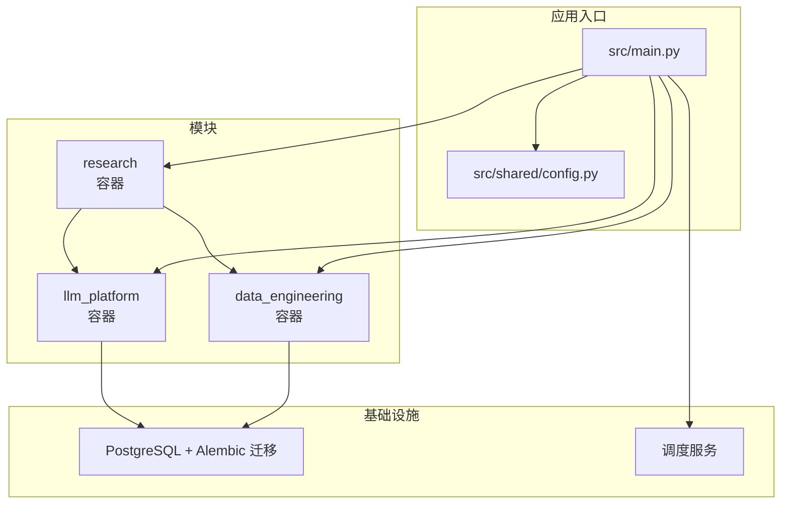
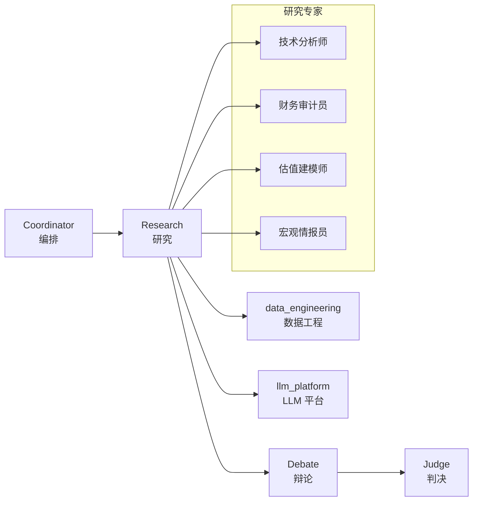
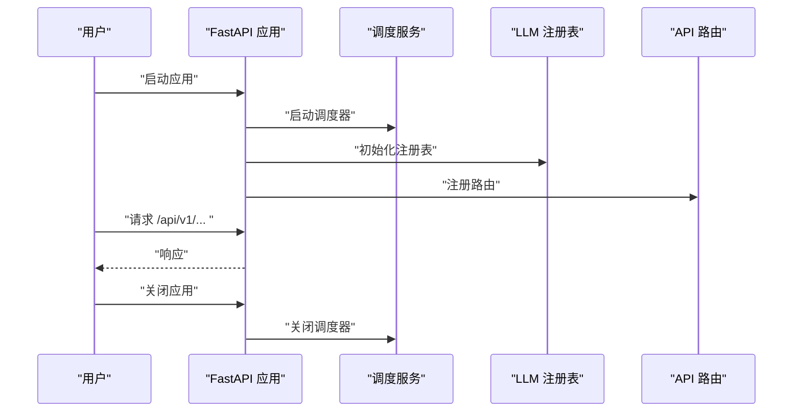
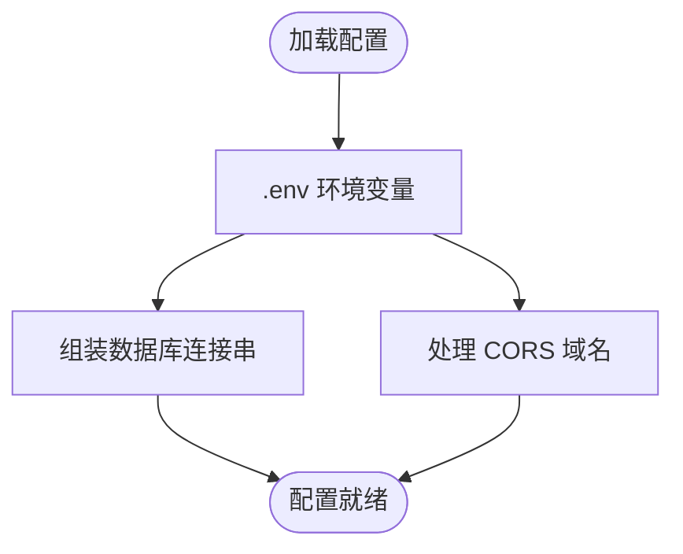
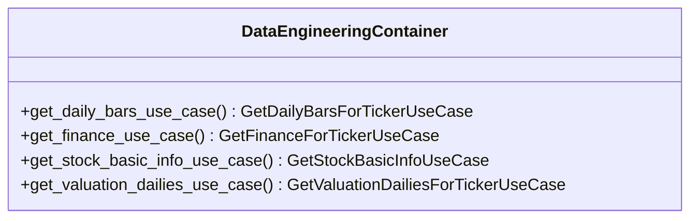
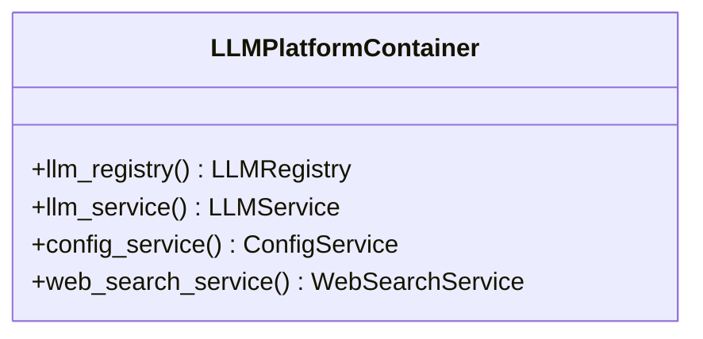
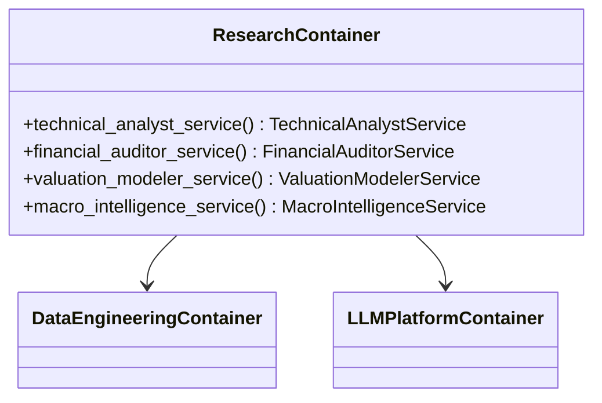
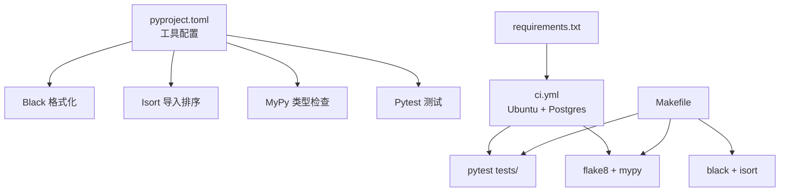

# 开发指南

<cite>
**本文引用的文件**
- [README.md](file://README.md)
- [pyproject.toml](file://pyproject.toml)
- [requirements.txt](file://requirements.txt)
- [Makefile](file://Makefile)
- [.pre-commit-config.yaml](file://.pre-commit-config.yaml)
- [pytest.ini](file://pytest.ini)
- [.github/workflows/ci.yml](file://.github/workflows/ci.yml)
- [openspec/config.yaml](file://openspec/config.yaml)
- [openspec/specs/tech-standards.md](file://openspec/specs/tech-standards.md)
- [openspec/specs/vision-and-modules.md](file://openspec/specs/vision-and-modules.md)
- [src/main.py](file://src/main.py)
- [src/shared/config.py](file://src/shared/config.py)
- [src/modules/data_engineering/container.py](file://src/modules/data_engineering/container.py)
- [src/modules/llm_platform/container.py](file://src/modules/llm_platform/container.py)
- [src/modules/research/container.py](file://src/modules/research/container.py)
- [scripts/add_llm_config_template.py](file://scripts/add_llm_config_template.py)
</cite>

## 目录
1. [简介](#简介)
2. [项目结构](#项目结构)
3. [核心组件](#核心组件)
4. [架构总览](#架构总览)
5. [详细组件分析](#详细组件分析)
6. [依赖关系分析](#依赖关系分析)
7. [性能考量](#性能考量)
8. [故障排查指南](#故障排查指南)
9. [结论](#结论)
10. [附录](#附录)

## 简介
本开发指南面向参与“股票助手”项目的开发者与贡献者，系统阐述开发规范、代码风格、提交与分支策略、OpenSpec 规范应用、代码质量工具配置与使用、新功能开发流程、调试与开发工具、以及贡献与社区参与方式。项目采用 DDD 分层架构，模块间通过 Ports 与适配器解耦，强调可测试性、可维护性与一致性。

## 项目结构
仓库采用按模块与层次划分的组织方式，核心模块包括数据工程、LLM 平台、研究（专家角色）、共享内核与基础设施。OpenSpec 变更与设计文档集中于 openspec 目录，CI 通过 GitHub Actions 在 Ubuntu 环境下执行测试与静态检查。

图表来源
- [src/main.py](file://src/main.py#L1-L75)
- [src/shared/config.py](file://src/shared/config.py#L1-L68)
- [src/modules/data_engineering/container.py](file://src/modules/data_engineering/container.py#L1-L59)
- [src/modules/llm_platform/container.py](file://src/modules/llm_platform/container.py#L1-L68)
- [src/modules/research/container.py](file://src/modules/research/container.py#L1-L139)

章节来源
- [README.md](file://README.md#L1-L42)
- [openspec/specs/vision-and-modules.md](file://openspec/specs/vision-and-modules.md#L1-L99)

## 核心组件
- 应用入口与生命周期：FastAPI 应用初始化、CORS 配置、全局异常中间件、健康检查路由、启动/关闭事件中初始化调度器与 LLM 注册表。
- 配置体系：统一使用 Pydantic Settings 加载 .env，支持数据库连接串、CORS、API 版本等。
- 模块容器：数据工程、LLM 平台、研究模块分别提供 Composition Root，封装 UseCase/服务装配，避免跨模块直接依赖基础设施。
- OpenSpec：项目上下文、模块边界、技术标准与验证策略在此落地，确保变更可验证、可追溯。

章节来源
- [src/main.py](file://src/main.py#L1-L75)
- [src/shared/config.py](file://src/shared/config.py#L1-L68)
- [src/modules/data_engineering/container.py](file://src/modules/data_engineering/container.py#L1-L59)
- [src/modules/llm_platform/container.py](file://src/modules/llm_platform/container.py#L1-L68)
- [src/modules/research/container.py](file://src/modules/research/container.py#L1-L139)
- [openspec/config.yaml](file://openspec/config.yaml#L1-L27)

## 架构总览
系统采用 DDD 分层与模块化设计，模块间通过 Ports 与适配器交互，研究流水线为编排 → 研究（可调 data_engineering、llm_platform）→ 辩论 → 判决，支撑模块仅作为被调用方。

图表来源
- [openspec/specs/vision-and-modules.md](file://openspec/specs/vision-and-modules.md#L21-L48)

章节来源
- [openspec/specs/vision-and-modules.md](file://openspec/specs/vision-and-modules.md#L1-L99)

## 详细组件分析

### 应用入口与生命周期
- 启动事件：初始化调度器、加载 LLM 注册表（通过应用层服务）。
- 关闭事件：安全关闭调度器。
- 中间件：CORS、全局异常处理。
- 路由：注册 API 路由前缀为配置的 API 版本。

图表来源
- [src/main.py](file://src/main.py#L21-L48)
- [src/shared/config.py](file://src/shared/config.py#L13-L18)

章节来源
- [src/main.py](file://src/main.py#L1-L75)
- [src/shared/config.py](file://src/shared/config.py#L1-L68)

### 配置体系
- 环境变量加载：.env 文件，支持模块专属配置（如 TUSHARE_*、SYNC_*、LLM_*、BOCHA_*）。
- 数据库连接：自动生成异步 PostgreSQL 连接串。
- CORS：支持逗号分隔或数组格式，自动清洗与校验。

图表来源
- [src/shared/config.py](file://src/shared/config.py#L42-L58)
- [src/shared/config.py](file://src/shared/config.py#L22-L32)

章节来源
- [src/shared/config.py](file://src/shared/config.py#L1-L68)

### 数据工程模块容器
- 职责：封装日线、财务、股票基础信息、估值日线等 UseCase 的装配，供上层模块通过应用层接口调用。
- 依赖：SQLAlchemy 异步会话，各 Repository 实现。

图表来源
- [src/modules/data_engineering/container.py](file://src/modules/data_engineering/container.py#L32-L59)

章节来源
- [src/modules/data_engineering/container.py](file://src/modules/data_engineering/container.py#L1-L59)

### LLM 平台模块容器
- 职责：提供 LLM 注册表、配置服务、LLM 门面服务与 Web 搜索服务的装配。
- 依赖：数据库会话（可选）用于加载配置；适配器（如博查搜索）。

图表来源
- [src/modules/llm_platform/container.py](file://src/modules/llm_platform/container.py#L24-L68)

章节来源
- [src/modules/llm_platform/container.py](file://src/modules/llm_platform/container.py#L1-L68)

### 研究模块容器
- 职责：装配五大专家服务（技术分析师、财务审计员、估值建模师、宏观情报员），通过 DataEngineeringContainer 与 LLMPlatformContainer 获取能力。
- 依赖：适配器（市场报价、财务数据、估值数据、LLM）、快照构建器、指标计算器。

图表来源
- [src/modules/research/container.py](file://src/modules/research/container.py#L44-L139)
- [src/modules/data_engineering/container.py](file://src/modules/data_engineering/container.py#L32-L59)
- [src/modules/llm_platform/container.py](file://src/modules/llm_platform/container.py#L24-L68)

章节来源
- [src/modules/research/container.py](file://src/modules/research/container.py#L1-L139)

### OpenSpec 变更与验证
- 项目上下文：明确限界上下文、模块职责与技术栈，指导变更设计与实现。
- 技术标准：文件命名、DTO 与 Port 组织、模块内部结构、异常与日志规范、响应协议与验证策略。
- 验证策略：运行时验证要求在容器内执行，静态分析可在本地执行，确保验证可靠与可解耦。

章节来源
- [openspec/config.yaml](file://openspec/config.yaml#L1-L27)
- [openspec/specs/tech-standards.md](file://openspec/specs/tech-standards.md#L1-L166)
- [openspec/specs/vision-and-modules.md](file://openspec/specs/vision-and-modules.md#L1-L99)

## 依赖关系分析
- 工具链：Black、Isort、Flake8、MyPy、Pytest 通过 pyproject.toml 与 Makefile 统一配置。
- CI：GitHub Actions 在 Ubuntu 上拉起 Postgres 服务，安装依赖后执行 flake8、mypy 与 pytest。
- 依赖清单：requirements.txt 管理第三方库，Makefile 提供导出与安装命令。

图表来源
- [pyproject.toml](file://pyproject.toml#L1-L22)
- [Makefile](file://Makefile#L10-L26)
- [.github/workflows/ci.yml](file://.github/workflows/ci.yml#L9-L59)
- [requirements.txt](file://requirements.txt#L1-L16)

章节来源
- [pyproject.toml](file://pyproject.toml#L1-L22)
- [Makefile](file://Makefile#L1-L27)
- [.github/workflows/ci.yml](file://.github/workflows/ci.yml#L1-L60)
- [requirements.txt](file://requirements.txt#L1-L16)

## 性能考量
- 异步优先：使用 SQLAlchemy asyncio 与 APScheduler，避免阻塞。
- 资源池化：数据库连接与 LLM 调用通过容器与适配器复用与隔离。
- 日志分级：合理使用 DEBUG/INFO/WARNING/ERROR，关键路径带上下文，便于定位瓶颈。
- 静态分析前置：在提交前通过 pre-commit 与 CI 执行格式化、导入排序与类型检查，减少运行时开销。

## 故障排查指南
- 启动与关闭：检查启动事件日志与关闭事件日志，确认调度器启停正常。
- 数据库：核对 .env 中数据库配置，确认连接串生成逻辑与 Postgres 服务可达。
- LLM 配置：通过脚本或 API 创建 LLM 配置模板，确认供应商、模型名与优先级设置正确。
- API 调用：参考 README 的健康检查与技术分析接口，确认同步数据与 LLM 配置就绪后再发起分析请求。

章节来源
- [src/main.py](file://src/main.py#L21-L48)
- [src/shared/config.py](file://src/shared/config.py#L34-L58)
- [scripts/add_llm_config_template.py](file://scripts/add_llm_config_template.py#L1-L72)
- [README.md](file://README.md#L19-L41)

## 结论
本指南总结了项目的开发规范、架构约束、质量工具与验证策略，以及从需求到实现再到测试的全流程建议。遵循 DDD 与 OpenSpec 的约定，结合统一的工具链与 CI，可显著提升代码质量与交付效率。

## 附录

### 开发规范与最佳实践
- 代码风格与命名：遵循 PEP 8，类型提示强制，文件名与主类名一致，DTO 语义化命名，命令与查询分离。
- 异常与日志：统一继承共享异常基类，分层传递；日志使用中文，关键流程带上下文。
- 模块结构：严格四层（表现/应用/领域/基础设施），Ports 与 DTO 明确边界，跨模块调用通过应用层接口。

章节来源
- [openspec/specs/tech-standards.md](file://openspec/specs/tech-standards.md#L31-L112)

### 提交规范与分支策略
- 分支策略：主分支受保护，功能开发在特性分支，合并前需通过 CI。
- 提交信息：建议采用“类型: 概述”的格式，配合 PR 描述变更动机、影响范围与测试策略。
- PR 审查：关注架构一致性、测试覆盖与 OpenSpec 场景验证。

### OpenSpec 应用
- 变更流程：提案 → 设计 → 任务分解 → 实现 → 验证（运行时与静态分析）→ 合并。
- 场景测试：每个 WHEN/THEN 场景需有自动化测试覆盖，实现顺序灵活但需在交付前全部通过。

章节来源
- [openspec/specs/tech-standards.md](file://openspec/specs/tech-standards.md#L131-L150)
- [openspec/specs/vision-and-modules.md](file://openspec/specs/vision-and-modules.md#L1-L99)

### 代码质量工具配置与使用
- Black：行宽、目标版本、包含规则。
- Isort：与 Black 配置一致的多行输出。
- MyPy：Python 版本、警告策略、忽略缺失导入。
- Pytest：测试路径、最小版本、异步模式。
- pre-commit：钩子包括尾随空白、文件末尾换行、YAML/大文件检查、Black、Isort、Flake8。
- Makefile：安装、导出依赖、测试、lint、格式化、运行、清理。

章节来源
- [pyproject.toml](file://pyproject.toml#L1-L22)
- [.pre-commit-config.yaml](file://.pre-commit-config.yaml#L1-L25)
- [Makefile](file://Makefile#L1-L27)
- [pytest.ini](file://pytest.ini#L1-L5)

### 新功能开发流程（从需求到测试）
- 需求分析：归属限界上下文，明确跨模块依赖与 Ports。
- 设计文档：OpenSpec 提案与设计，声明可验证性与验收场景。
- 任务分解：拆分为可验证的任务，标注模块边界与时长。
- 实现：按模块内部结构与技术标准编写代码，使用容器装配与适配器解耦。
- 测试验证：单元/集成测试覆盖场景，CI 通过 flake8、mypy 与 pytest。
- 文档与发布：更新 OpenSpec 文档与 README 示例。

章节来源
- [openspec/specs/tech-standards.md](file://openspec/specs/tech-standards.md#L131-L150)
- [openspec/specs/vision-and-modules.md](file://openspec/specs/vision-and-modules.md#L74-L99)

### 调试技巧与开发工具
- IDE 配置：启用类型提示、导入排序与格式化钩子；使用断点调试与日志分级。
- 断点调试：在应用层与适配器层设置断点，观察 DTO 输入输出与异常传播。
- 性能分析：结合日志与 Prometheus 指标，定位慢查询与阻塞点。
- LLM 配置：使用脚本或 API 创建模板，验证模型可用性与路由优先级。

章节来源
- [scripts/add_llm_config_template.py](file://scripts/add_llm_config_template.py#L1-L72)
- [src/modules/llm_platform/container.py](file://src/modules/llm_platform/container.py#L53-L67)

### 贡献指南与社区参与
- 提交前：执行格式化、导入排序与类型检查，确保测试通过。
- 提交后：等待 CI 结果与审查意见，按反馈迭代。
- 社区：遵循技术标准与响应协议，保持专业、客观、建设性的沟通。

章节来源
- [.pre-commit-config.yaml](file://.pre-commit-config.yaml#L1-L25)
- [pyproject.toml](file://pyproject.toml#L16-L21)
- [openspec/specs/tech-standards.md](file://openspec/specs/tech-standards.md#L162-L166)