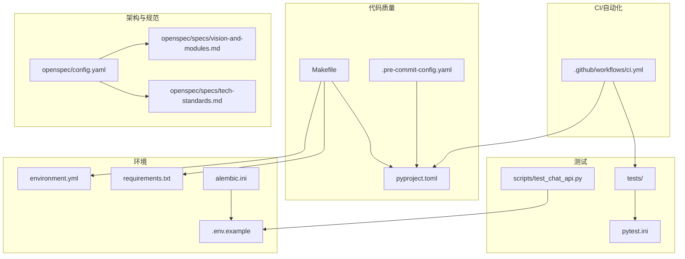
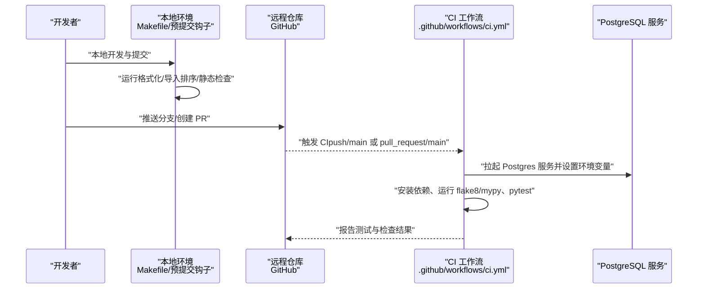
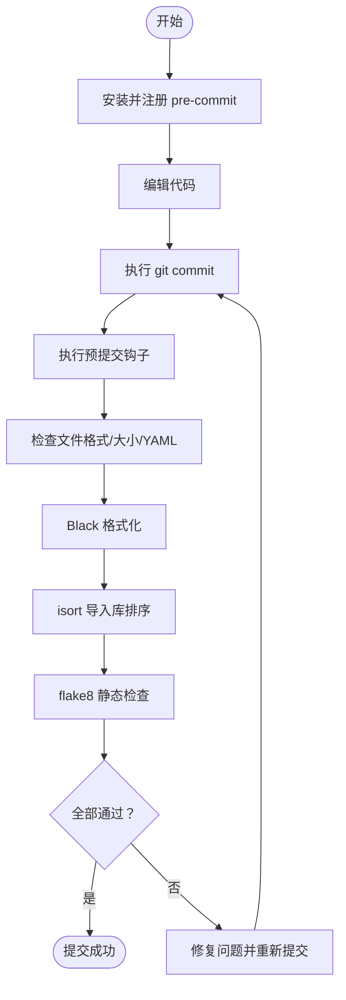
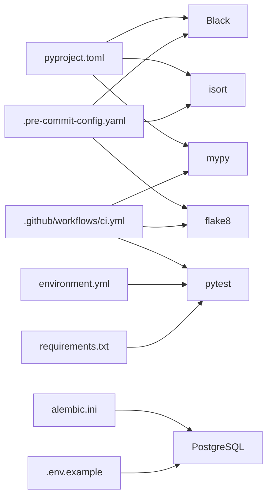

# 提交流程

<cite>
**本文引用的文件**
- [.github/workflows/ci.yml](file://.github/workflows/ci.yml)
- [.pre-commit-config.yaml](file://.pre-commit-config.yaml)
- [pyproject.toml](file://pyproject.toml)
- [Makefile](file://Makefile)
- [environment.yml](file://environment.yml)
- [requirements.txt](file://requirements.txt)
- [pytest.ini](file://pytest.ini)
- [openspec/config.yaml](file://openspec/config.yaml)
- [openspec/specs/tech-standards.md](file://openspec/specs/tech-standards.md)
- [openspec/specs/vision-and-modules.md](file://openspec/specs/vision-and-modules.md)
- [.env.example](file://.env.example)
- [alembic.ini](file://alembic.ini)
- [scripts/test_chat_api.py](file://scripts/test_chat_api.py)
</cite>

## 目录
1. [引言](#引言)
2. [项目结构](#项目结构)
3. [核心组件](#核心组件)
4. [架构总览](#架构总览)
5. [详细组件分析](#详细组件分析)
6. [依赖关系分析](#依赖关系分析)
7. [性能考量](#性能考量)
8. [故障排查指南](#故障排查指南)
9. [结论](#结论)
10. [附录](#附录)

## 引言
本指南面向“股票助手”项目团队，提供一套完整的提交流程规范，涵盖 Git 工作流与分支策略、主分支保护、功能分支创建与合并策略、提交信息规范、预提交钩子配置与使用、Pull Request 流程与审查标准、版本发布流程（标签、变更日志与版本号规则），以及常见提交问题与解决方案。目标是帮助团队建立高效、可追溯、可复现的协作开发流程。

## 项目结构
仓库采用模块化组织，核心目录与与提交流程相关的关键文件如下：
- 持续集成：.github/workflows/ci.yml
- 代码质量与格式化：.pre-commit-config.yaml、pyproject.toml、Makefile
- 测试：pytest.ini、tests/、scripts/test_chat_api.py
- 开发环境：environment.yml、requirements.txt
- 架构与规范：openspec/config.yaml、openspec/specs/vision-and-modules.md、openspec/specs/tech-standards.md
- 数据库迁移：alembic/、alembic.ini
- 示例环境：.env.example

图表来源
- [.github/workflows/ci.yml](file://.github/workflows/ci.yml#L1-L60)
- [.pre-commit-config.yaml](file://.pre-commit-config.yaml#L1-L25)
- [pyproject.toml](file://pyproject.toml#L1-L22)
- [Makefile](file://Makefile#L1-L27)
- [pytest.ini](file://pytest.ini#L1-L5)
- [environment.yml](file://environment.yml#L1-L29)
- [requirements.txt](file://requirements.txt#L1-L16)
- [alembic.ini](file://alembic.ini#L1-L97)
- [.env.example](file://.env.example#L1-L17)
- [openspec/config.yaml](file://openspec/config.yaml#L1-L27)
- [openspec/specs/vision-and-modules.md](file://openspec/specs/vision-and-modules.md#L1-L99)
- [openspec/specs/tech-standards.md](file://openspec/specs/tech-standards.md#L1-L166)
- [scripts/test_chat_api.py](file://scripts/test_chat_api.py#L1-L37)

章节来源
- [pyproject.toml](file://pyproject.toml#L1-L22)
- [Makefile](file://Makefile#L1-L27)
- [.pre-commit-config.yaml](file://.pre-commit-config.yaml#L1-L25)
- [.github/workflows/ci.yml](file://.github/workflows/ci.yml#L1-L60)
- [pytest.ini](file://pytest.ini#L1-L5)
- [environment.yml](file://environment.yml#L1-L29)
- [requirements.txt](file://requirements.txt#L1-L16)
- [openspec/config.yaml](file://openspec/config.yaml#L1-L27)
- [openspec/specs/vision-and-modules.md](file://openspec/specs/vision-and-modules.md#L1-L99)
- [openspec/specs/tech-standards.md](file://openspec/specs/tech-standards.md#L1-L166)
- [alembic.ini](file://alembic.ini#L1-L97)
- [.env.example](file://.env.example#L1-L17)
- [scripts/test_chat_api.py](file://scripts/test_chat_api.py#L1-L37)

## 核心组件
- 分支与主保护：CI 仅在推送到 main 分支与针对 main 的 PR 触发，表明 main 为主受保护分支。
- 预提交钩子：通过 pre-commit 配置统一执行尾随空白清理、文件结尾修复、YAML/大文件检查、Black 格式化、isort 导入库排序、flake8 检查。
- 本地开发与测试：Makefile 提供 install、test、lint、format、run、clean；pytest.ini 与 pyproject.toml 配置测试与静态分析工具。
- OpenSpec 规范：项目以 OpenSpec 为变更与设计的单一事实来源，强调架构一致性、可验证性与可测性。
- 数据库迁移：Alembic 配置与版本迁移文件存在，配合环境变量与 .env.example 使用。

章节来源
- [.github/workflows/ci.yml](file://.github/workflows/ci.yml#L1-L60)
- [.pre-commit-config.yaml](file://.pre-commit-config.yaml#L1-L25)
- [pyproject.toml](file://pyproject.toml#L1-L22)
- [Makefile](file://Makefile#L1-L27)
- [pytest.ini](file://pytest.ini#L1-L5)
- [openspec/config.yaml](file://openspec/config.yaml#L1-L27)
- [openspec/specs/tech-standards.md](file://openspec/specs/tech-standards.md#L1-L166)
- [openspec/specs/vision-and-modules.md](file://openspec/specs/vision-and-modules.md#L1-L99)
- [alembic.ini](file://alembic.ini#L1-L97)
- [.env.example](file://.env.example#L1-L17)

## 架构总览
下图展示从开发者本地到 CI 的整体提交与验证流程，包括本地预检、推送触发 CI、测试与静态检查、以及数据库准备。

图表来源
- [.github/workflows/ci.yml](file://.github/workflows/ci.yml#L1-L60)
- [Makefile](file://Makefile#L1-L27)
- [.pre-commit-config.yaml](file://.pre-commit-config.yaml#L1-L25)
- [pyproject.toml](file://pyproject.toml#L1-L22)
- [pytest.ini](file://pytest.ini#L1-L5)

## 详细组件分析

### Git 工作流与分支策略
- 主分支保护
  - CI 仅在 push 到 main 与 pull_request 到 main 时触发，表明 main 为受保护分支，合并前需满足 CI 条件。
- 功能分支
  - 建议以 feat/、fix/、docs/、refactor/ 等前缀命名功能分支，便于审阅与后续自动化处理。
- 合并策略
  - 建议使用 Squash Merge 或 Rebase Merge，确保提交历史整洁；合并前必须通过 CI 与代码审查。

章节来源
- [.github/workflows/ci.yml](file://.github/workflows/ci.yml#L3-L7)

### 提交信息规范
- 提交消息格式建议
  - 类型: 说明本次改动的类别（如 feat、fix、docs、style、refactor、perf、test、chore、revert）。
  - 范围: 可选，指明改动影响的模块或目录（如 data_engineering、llm_platform、research）。
  - 描述: 简洁描述改动内容，使用动宾结构。
  - 说明: 如有破坏性变更或需要额外说明，可在正文补充。
- 示例
  - feat(data_engineering): 新增增量财务数据同步命令
  - fix(research): 修正技术分析师指标计算边界条件
  - docs(specs): 更新技术规范与 OpenSpec 相关说明
- 与 OpenSpec 的结合
  - OpenSpec 变更需保证可验证，变更内容与影响范围应在提案/设计中明确通过自动化测试验证。

章节来源
- [openspec/specs/tech-standards.md](file://openspec/specs/tech-standards.md#L131-L139)
- [openspec/specs/vision-and-modules.md](file://openspec/specs/vision-and-modules.md#L1-L99)

### 预提交钩子（pre-commit）
- 配置项
  - 文件清理：尾随空白、文件结尾修复、YAML 校验、大文件检查。
  - 格式化：Black（代码风格与长度）。
  - 导入库排序：isort（与 Black 配置一致）。
  - 静态检查：flake8（含额外插件）。
- 使用流程
  - 在本地安装并启用 pre-commit，提交前自动执行上述检查；失败需修复后再提交。
- 与 Makefile 的关系
  - Makefile 提供 lint/format 命令，可作为本地批量执行的替代或补充。

图表来源
- [.pre-commit-config.yaml](file://.pre-commit-config.yaml#L1-L25)
- [pyproject.toml](file://pyproject.toml#L1-L22)
- [Makefile](file://Makefile#L13-L19)

章节来源
- [.pre-commit-config.yaml](file://.pre-commit-config.yaml#L1-L25)
- [pyproject.toml](file://pyproject.toml#L1-L22)
- [Makefile](file://Makefile#L13-L19)

### Pull Request 流程与审查标准
- PR 模板与内容
  - 标题：遵循提交信息规范的类型/范围/描述。
  - 摘要：简述改动动机、范围与影响。
  - 测试：列出新增/修改的测试用例与验证方式。
  - 依赖：说明是否引入新依赖或破坏性变更。
- 代码审查标准
  - 架构一致性：是否符合 Vision 与 Tech Standards 的模块边界与四层结构。
  - 可测试性：是否具备可验证性（OpenSpec 场景与测试）。
  - 代码质量：是否通过 pre-commit 与 CI 的静态检查与测试。
  - 文档与日志：是否更新相关文档与日志规范。
- 合并条件
  - 至少一名维护者批准。
  - CI 通过（测试与静态检查）。
  - 无未解决评论或已处理。

章节来源
- [openspec/specs/vision-and-modules.md](file://openspec/specs/vision-and-modules.md#L1-L99)
- [openspec/specs/tech-standards.md](file://openspec/specs/tech-standards.md#L131-L139)
- [.github/workflows/ci.yml](file://.github/workflows/ci.yml#L1-L60)

### 版本发布流程
- 标签管理
  - 建议使用语义化版本（SemVer），以 vMAJOR.MINOR.PATCH 命名标签。
  - 发布前在 main 分支打标签并推送。
- 变更日志维护
  - 建议维护 CHANGELOG.md，记录每个版本的主要改动、修复与已知问题。
- 版本号规则
  - MAJOR：破坏性变更
  - MINOR：新增兼容功能
  - PATCH：修复兼容问题
- 数据库迁移
  - 若涉及数据库结构变更，确保 Alembic 迁移已生成并验证；在发布前完成迁移。

章节来源
- [alembic.ini](file://alembic.ini#L1-L97)
- [openspec/specs/tech-standards.md](file://openspec/specs/tech-standards.md#L1-L166)

### 本地开发与测试
- 环境准备
  - 使用 Conda 环境文件安装依赖，或使用 requirements.txt。
  - 复制 .env.example 为 .env 并按需填写数据库与第三方 API 密钥。
- 常用命令
  - 安装：make install
  - 测试：make test
  - 代码检查：make lint
  - 格式化：make format
  - 启动应用：make run
  - 清理：make clean
- API 验证
  - 可使用 scripts/test_chat_api.py 进行聊天接口的快速验证。

章节来源
- [Makefile](file://Makefile#L1-L27)
- [environment.yml](file://environment.yml#L1-L29)
- [requirements.txt](file://requirements.txt#L1-L16)
- [.env.example](file://.env.example#L1-L17)
- [scripts/test_chat_api.py](file://scripts/test_chat_api.py#L1-L37)

## 依赖关系分析
- 工具链依赖
  - Black 与 isort 的配置在 pyproject.toml 中对齐，确保本地与 CI 行为一致。
  - flake8 与 mypy 在 CI 与本地均执行，保障静态检查一致性。
- 测试依赖
  - pytest 与 pytest-asyncio 在 environment.yml 与 requirements.txt 中均有体现，pytest.ini 与 pyproject.toml 提供配置。
- 数据库与迁移
  - alembic.ini 提供迁移配置，结合 .env.example 的数据库连接参数使用。

图表来源
- [pyproject.toml](file://pyproject.toml#L1-L22)
- [.pre-commit-config.yaml](file://.pre-commit-config.yaml#L1-L25)
- [.github/workflows/ci.yml](file://.github/workflows/ci.yml#L1-L60)
- [environment.yml](file://environment.yml#L1-L29)
- [requirements.txt](file://requirements.txt#L1-L16)
- [alembic.ini](file://alembic.ini#L1-L97)
- [.env.example](file://.env.example#L1-L17)

章节来源
- [pyproject.toml](file://pyproject.toml#L1-L22)
- [.pre-commit-config.yaml](file://.pre-commit-config.yaml#L1-L25)
- [.github/workflows/ci.yml](file://.github/workflows/ci.yml#L1-L60)
- [environment.yml](file://environment.yml#L1-L29)
- [requirements.txt](file://requirements.txt#L1-L16)
- [alembic.ini](file://alembic.ini#L1-L97)
- [.env.example](file://.env.example#L1-L17)

## 性能考量
- 预提交阶段尽早发现格式与风格问题，减少 CI 时间与失败重试成本。
- 使用 Makefile 的批量命令统一执行格式化与检查，避免遗漏。
- CI 中的 Postgres 服务为测试提供稳定环境，建议在本地也使用相同镜像版本以减少差异。

## 故障排查指南
- CI 失败
  - 检查 flake8 与 mypy 报错，修复后重新推送。
  - 确认测试通过，必要时在本地使用 pytest.ini 与 pyproject.toml 的配置运行测试。
- 本地格式化不一致
  - 确保 pre-commit 已安装并注册；或使用 make format 执行 Black 与 isort。
- 数据库连接问题
  - 检查 .env 是否正确配置，确认 Alembic 配置与数据库服务可达。
- API 调用失败
  - 使用 scripts/test_chat_api.py 快速验证接口连通性与响应。

章节来源
- [.github/workflows/ci.yml](file://.github/workflows/ci.yml#L1-L60)
- [pytest.ini](file://pytest.ini#L1-L5)
- [pyproject.toml](file://pyproject.toml#L1-L22)
- [Makefile](file://Makefile#L1-L27)
- [alembic.ini](file://alembic.ini#L1-L97)
- [.env.example](file://.env.example#L1-L17)
- [scripts/test_chat_api.py](file://scripts/test_chat_api.py#L1-L37)

## 结论
通过明确的分支策略、提交信息规范、预提交钩子与 CI 流水线、OpenSpec 的架构与可验证性要求，以及完善的本地开发与测试流程，“股票助手”项目可以形成高效、可追溯、高质量的协作开发闭环。建议团队在日常工作中持续遵循本指南，并根据项目演进适时完善流程与工具配置。

## 附录
- OpenSpec 与技术规范
  - Vision 与模块边界：确保模块间仅通过 Ports 通信，禁止跨模块直接依赖基础设施实现。
  - 技术标准：四层架构、DTO 与 Port 组织、异常处理、日志规范、响应协议与可验证性。
- 常用命令速查
  - 安装：make install
  - 测试：make test
  - 代码检查：make lint
  - 格式化：make format
  - 启动应用：make run
  - 清理：make clean

章节来源
- [openspec/specs/vision-and-modules.md](file://openspec/specs/vision-and-modules.md#L1-L99)
- [openspec/specs/tech-standards.md](file://openspec/specs/tech-standards.md#L1-L166)
- [Makefile](file://Makefile#L1-L27)