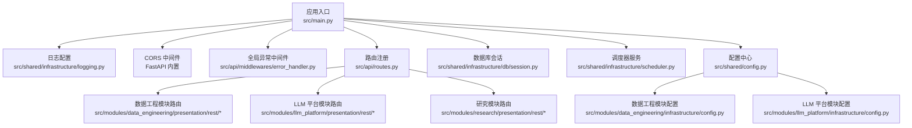
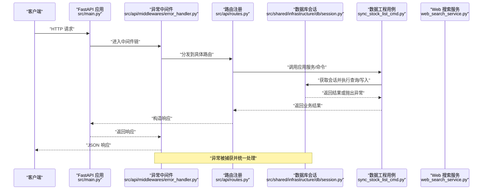
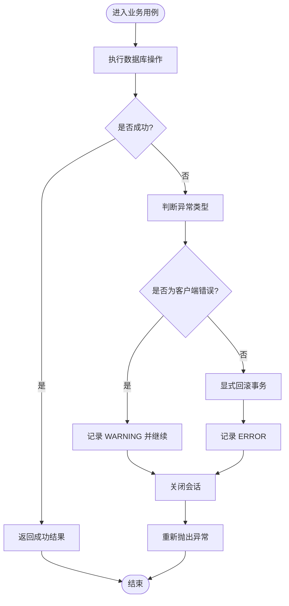
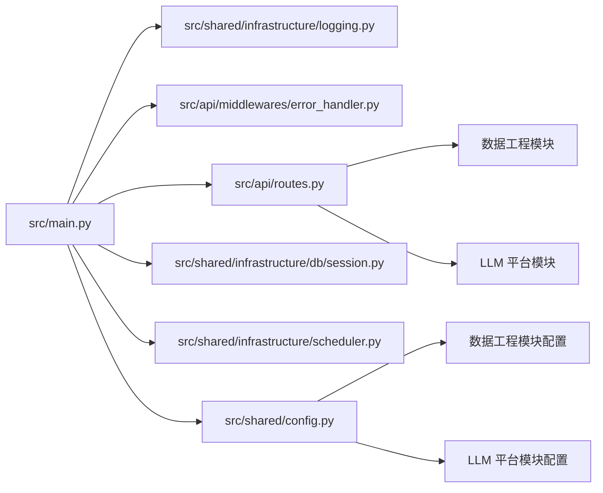

# 调试与故障排除

<cite>
**本文引用的文件**
- [src/main.py](file://src/main.py)
- [src/shared/infrastructure/logging.py](file://src/shared/infrastructure/logging.py)
- [src/api/middlewares/error_handler.py](file://src/api/middlewares/error_handler.py)
- [src/shared/infrastructure/db/session.py](file://src/shared/infrastructure/db/session.py)
- [src/shared/config.py](file://src/shared/config.py)
- [src/shared/domain/exceptions.py](file://src/shared/domain/exceptions.py)
- [src/modules/data_engineering/infrastructure/config.py](file://src/modules/data_engineering/infrastructure/config.py)
- [src/modules/llm_platform/infrastructure/config.py](file://src/modules/llm_platform/infrastructure/config.py)
- [debug_db.py](file://debug_db.py)
- [.env.example](file://.env.example)
- [src/api/routes.py](file://src/api/routes.py)
- [src/modules/data_engineering/application/commands/sync_stock_list_cmd.py](file://src/modules/data_engineering/application/commands/sync_stock_list_cmd.py)
- [src/modules/llm_platform/application/services/web_search_service.py](file://src/modules/llm_platform/application/services/web_search_service.py)
- [src/shared/infrastructure/scheduler.py](file://src/shared/infrastructure/scheduler.py)
- [pytest.ini](file://pytest.ini)
</cite>

## 目录
1. [简介](#简介)
2. [项目结构](#项目结构)
3. [核心组件](#核心组件)
4. [架构总览](#架构总览)
5. [详细组件分析](#详细组件分析)
6. [依赖关系分析](#依赖关系分析)
7. [性能考虑](#性能考虑)
8. [故障排除指南](#故障排除指南)
9. [结论](#结论)
10. [附录](#附录)

## 简介
本指南面向“股票助手”项目的开发者与运维人员，聚焦于调试与故障排除。内容涵盖日志记录配置、断点调试设置、变量检查技巧、常见问题诊断与解决、异常与错误处理最佳实践、性能分析与优化方法，以及开发与生产环境差异的处理策略。文档结合代码级分析与可视化图示，帮助快速定位并解决问题。

## 项目结构
项目采用多模块分层架构，核心入口在 FastAPI 应用中集中初始化日志、CORS、全局异常处理与路由注册；共享层提供配置、日志、数据库会话与异常基类；各功能模块（数据工程、LLM 平台、研究）分别封装应用服务、领域模型、基础设施与展示层。

图表来源
- [src/main.py](file://src/main.py#L1-L75)
- [src/shared/infrastructure/logging.py](file://src/shared/infrastructure/logging.py#L1-L74)
- [src/api/middlewares/error_handler.py](file://src/api/middlewares/error_handler.py#L1-L46)
- [src/api/routes.py](file://src/api/routes.py#L1-L13)
- [src/shared/infrastructure/db/session.py](file://src/shared/infrastructure/db/session.py#L1-L64)
- [src/shared/infrastructure/scheduler.py](file://src/shared/infrastructure/scheduler.py#L1-L60)
- [src/shared/config.py](file://src/shared/config.py#L1-L68)
- [src/modules/data_engineering/infrastructure/config.py](file://src/modules/data_engineering/infrastructure/config.py#L1-L28)
- [src/modules/llm_platform/infrastructure/config.py](file://src/modules/llm_platform/infrastructure/config.py#L1-L27)

章节来源
- [src/main.py](file://src/main.py#L1-L75)
- [src/api/routes.py](file://src/api/routes.py#L1-L13)

## 核心组件
- 应用入口与生命周期
  - 初始化日志、CORS、全局异常中间件与路由注册；在启动事件中初始化调度器与 LLM 平台启动流程。
- 日志系统
  - 统一接管 Python 标准 logging，使用 Loguru 输出；开发环境格式化输出，生产环境序列化 JSON 输出。
- 数据库会话
  - 异步 SQLAlchemy 引擎与会话工厂；依赖注入获取会话；异常分类处理（客户端错误不回滚，系统异常显式回滚）。
- 全局异常处理
  - 捕获自定义应用异常与未捕获系统异常，统一返回 JSON 错误响应。
- 配置中心
  - 全局配置与模块专属配置分离，支持环境变量与 .env 文件加载。
- 调度器服务
  - 单例封装 APScheduler，负责任务启动与优雅关闭。

章节来源
- [src/main.py](file://src/main.py#L1-L75)
- [src/shared/infrastructure/logging.py](file://src/shared/infrastructure/logging.py#L1-L74)
- [src/shared/infrastructure/db/session.py](file://src/shared/infrastructure/db/session.py#L1-L64)
- [src/api/middlewares/error_handler.py](file://src/api/middlewares/error_handler.py#L1-L46)
- [src/shared/config.py](file://src/shared/config.py#L1-L68)
- [src/shared/infrastructure/scheduler.py](file://src/shared/infrastructure/scheduler.py#L1-L60)

## 架构总览
下图展示了从请求进入应用到数据库与外部 API 的交互路径，以及异常与日志贯穿全链路的关键节点。

图表来源
- [src/main.py](file://src/main.py#L1-L75)
- [src/api/middlewares/error_handler.py](file://src/api/middlewares/error_handler.py#L1-L46)
- [src/api/routes.py](file://src/api/routes.py#L1-L13)
- [src/shared/infrastructure/db/session.py](file://src/shared/infrastructure/db/session.py#L1-L64)
- [src/modules/data_engineering/application/commands/sync_stock_list_cmd.py](file://src/modules/data_engineering/application/commands/sync_stock_list_cmd.py#L1-L49)
- [src/modules/llm_platform/application/services/web_search_service.py](file://src/modules/llm_platform/application/services/web_search_service.py#L1-L57)

## 详细组件分析

### 日志系统与调试技巧
- 日志接管与格式化
  - 通过拦截器将标准 logging 转发至 Loguru，统一输出格式；开发环境可读性强，生产环境便于日志收集系统解析。
- 调试建议
  - 在关键路径添加 info/debug/warning/error 级别日志；使用线程 ID 与模块:函数:行号定位来源。
  - 开发环境可临时开启数据库引擎 echo 以观察 SQL 语句（需谨慎）。
- 变量检查技巧
  - 在异常路径与分支处记录上下文变量，便于复盘；注意敏感信息脱敏。

章节来源
- [src/shared/infrastructure/logging.py](file://src/shared/infrastructure/logging.py#L1-L74)
- [src/shared/infrastructure/db/session.py](file://src/shared/infrastructure/db/session.py#L1-L64)

### 全局异常处理与错误响应
- 异常分类
  - 自定义应用异常：统一返回包含 code、message、details 的结构化 JSON。
  - 未捕获系统异常：记录详细堆栈，返回通用错误信息。
- 调试建议
  - 对外仅暴露结构化错误；内部保留完整异常栈以便本地排查。
  - 在中间件中记录请求方法、URL 与客户端 IP，便于定位来源。

章节来源
- [src/api/middlewares/error_handler.py](file://src/api/middlewares/error_handler.py#L1-L46)
- [src/shared/domain/exceptions.py](file://src/shared/domain/exceptions.py#L1-L67)

### 数据库会话与事务控制
- 会话生命周期
  - 依赖注入生成异步会话；异常时区分客户端错误与系统异常，客户端错误不回滚，系统异常显式回滚。
- 调试建议
  - 在业务异常与系统异常边界清晰标注；必要时开启 SQL 打印辅助定位。
  - 使用上下文管理确保会话关闭，避免连接泄漏。

图表来源
- [src/shared/infrastructure/db/session.py](file://src/shared/infrastructure/db/session.py#L1-L64)

章节来源
- [src/shared/infrastructure/db/session.py](file://src/shared/infrastructure/db/session.py#L1-L64)

### 配置管理与环境差异
- 全局配置
  - 项目名称、API 版本、CORS、数据库连接等集中管理；支持从 .env 加载。
- 模块专属配置
  - 数据工程模块与 LLM 平台模块各自维护独立配置，隔离不同上下文的参数。
- 环境差异
  - 通过 ENVIRONMENT 控制日志输出格式（开发/生产）；生产环境使用序列化输出。

章节来源
- [src/shared/config.py](file://src/shared/config.py#L1-L68)
- [src/modules/data_engineering/infrastructure/config.py](file://src/modules/data_engineering/infrastructure/config.py#L1-L28)
- [src/modules/llm_platform/infrastructure/config.py](file://src/modules/llm_platform/infrastructure/config.py#L1-L27)
- [.env.example](file://.env.example#L1-L17)

### 调度器服务与定时任务
- 单例调度器
  - 懒加载创建 AsyncIOScheduler；启动与关闭均记录日志，异常时记录错误并抛出。
- 调试建议
  - 在启动事件中初始化调度器；关注启动失败与关闭异常的日志。

章节来源
- [src/shared/infrastructure/scheduler.py](file://src/shared/infrastructure/scheduler.py#L1-L60)
- [src/main.py](file://src/main.py#L20-L48)

### 示例：数据库连通性调试脚本
- 用途
  - 快速验证数据库连接与目标表数据是否存在，便于定位连接与权限问题。
- 使用方式
  - 直接运行脚本进行异步查询，查看输出结果。

章节来源
- [debug_db.py](file://debug_db.py#L1-L21)

## 依赖关系分析
- 组件耦合与职责
  - 应用入口仅负责装配与注册，不承载业务逻辑，降低耦合。
  - 异常中间件与日志系统横切关注点，贯穿所有路由。
  - 数据库会话通过依赖注入解耦业务与基础设施。
- 外部依赖
  - FastAPI、Loguru、SQLAlchemy Async、APScheduler、Pydantic Settings。

图表来源
- [src/main.py](file://src/main.py#L1-L75)
- [src/api/routes.py](file://src/api/routes.py#L1-L13)
- [src/shared/infrastructure/logging.py](file://src/shared/infrastructure/logging.py#L1-L74)
- [src/api/middlewares/error_handler.py](file://src/api/middlewares/error_handler.py#L1-L46)
- [src/shared/infrastructure/db/session.py](file://src/shared/infrastructure/db/session.py#L1-L64)
- [src/shared/infrastructure/scheduler.py](file://src/shared/infrastructure/scheduler.py#L1-L60)
- [src/shared/config.py](file://src/shared/config.py#L1-L68)
- [src/modules/data_engineering/infrastructure/config.py](file://src/modules/data_engineering/infrastructure/config.py#L1-L28)
- [src/modules/llm_platform/infrastructure/config.py](file://src/modules/llm_platform/infrastructure/config.py#L1-L27)

## 性能考虑
- 日志性能
  - 生产环境使用序列化输出减少格式化开销；避免在高频路径中记录大对象。
- 数据库性能
  - 使用异步连接池与 pre_ping 保持连接有效性；批量写入与分页查询减少锁竞争。
- API 响应时间
  - 在路由与服务层记录请求耗时；对外暴露健康检查端点，便于快速评估服务可用性。
- 调度任务
  - 合理设置任务间隔与并发度；在启动事件中统一初始化，避免重复调度。

[本节为通用指导，无需列出章节来源]

## 故障排除指南

### 一、日志与断点调试
- 日志级别与输出
  - 开发环境：INFO/WARNING/ERROR 级别日志清晰可读；生产环境：JSON 序列化便于采集。
  - 关键路径：应用启动/关闭、路由分发、数据库会话、异常捕获。
- 断点调试设置
  - 在业务用例入口与异常分支设置断点；结合日志中的模块:函数:行号快速定位。
  - 使用测试框架的异步模式运行单测，便于在 IDE 中打断点调试。

章节来源
- [src/shared/infrastructure/logging.py](file://src/shared/infrastructure/logging.py#L1-L74)
- [pytest.ini](file://pytest.ini#L1-L5)

### 二、数据库连接问题
- 常见症状
  - 启动即报连接失败、超时或权限错误；查询无结果或计数异常。
- 诊断步骤
  - 检查数据库连接字符串与 .env 配置；确认容器网络与端口映射。
  - 使用数据库连通性脚本验证连接与表存在性。
  - 观察数据库引擎日志与连接池状态。
- 解决方案
  - 修正 .env 中的主机、端口、用户名与密码；确保数据库已初始化并具备相应权限。
  - 如为容器环境，确认服务依赖顺序与健康检查。

章节来源
- [src/shared/config.py](file://src/shared/config.py#L34-L58)
- [debug_db.py](file://debug_db.py#L1-L21)
- [src/shared/infrastructure/db/session.py](file://src/shared/infrastructure/db/session.py#L1-L64)

### 三、API 调用异常
- 常见症状
  - 4xx 客户端错误（如参数缺失、鉴权失败）；5xx 服务器内部错误。
- 诊断步骤
  - 查看全局异常中间件返回的结构化错误；结合请求方法、路径与客户端信息定位来源。
  - 在业务用例中增加输入校验与上下文日志。
- 解决方案
  - 对外统一返回 code/message/details；内部保留异常栈供本地排查。

章节来源
- [src/api/middlewares/error_handler.py](file://src/api/middlewares/error_handler.py#L1-L46)
- [src/shared/domain/exceptions.py](file://src/shared/domain/exceptions.py#L1-L67)

### 四、性能瓶颈分析
- 响应时间
  - 在路由层记录请求耗时；对慢查询与外部 API 调用进行专项观测。
- 数据库查询
  - 使用批量写入与索引优化；避免 N+1 查询；必要时开启 SQL 打印辅助定位。
- 外部 API
  - 对第三方接口进行限流与重试策略设计；记录调用耗时与成功率。

章节来源
- [src/modules/data_engineering/application/commands/sync_stock_list_cmd.py](file://src/modules/data_engineering/application/commands/sync_stock_list_cmd.py#L1-L49)
- [src/modules/llm_platform/application/services/web_search_service.py](file://src/modules/llm_platform/application/services/web_search_service.py#L1-L57)

### 五、开发与生产环境差异
- 配置管理
  - 通过 ENVIRONMENT 切换日志输出格式；模块专属配置隔离不同上下文参数。
- 日志级别与输出
  - 生产环境使用序列化 JSON 输出，便于日志平台解析；开发环境使用可读格式。
- 错误报告机制
  - 统一异常处理与结构化错误响应；生产环境避免泄露内部异常细节。

章节来源
- [src/shared/infrastructure/logging.py](file://src/shared/infrastructure/logging.py#L63-L73)
- [src/shared/config.py](file://src/shared/config.py#L16-L17)
- [src/modules/data_engineering/infrastructure/config.py](file://src/modules/data_engineering/infrastructure/config.py#L1-L28)
- [src/modules/llm_platform/infrastructure/config.py](file://src/modules/llm_platform/infrastructure/config.py#L1-L27)
- [.env.example](file://.env.example#L1-L17)

### 六、典型调试案例
- 案例一：数据库连接失败
  - 症状：启动时报错无法连接数据库。
  - 步骤：核对 .env 中数据库配置；使用连通性脚本验证；检查容器网络与端口。
  - 结果：修复配置后服务正常启动。
- 案例二：外部搜索接口超时
  - 症状：Web 搜索服务偶发超时。
  - 步骤：在服务层记录请求参数与耗时；检查网络与第三方配额限制；增加重试与熔断。
  - 结果：优化后稳定性提升。
- 案例三：定时任务未执行
  - 症状：计划任务未触发。
  - 步骤：检查调度器启动日志；确认任务注册与时间配置；观察关闭流程。
  - 结果：修复调度器初始化逻辑后恢复正常。

章节来源
- [debug_db.py](file://debug_db.py#L1-L21)
- [src/modules/llm_platform/application/services/web_search_service.py](file://src/modules/llm_platform/application/services/web_search_service.py#L1-L57)
- [src/shared/infrastructure/scheduler.py](file://src/shared/infrastructure/scheduler.py#L1-L60)

## 结论
通过统一的日志体系、严格的异常处理、清晰的配置管理与完善的调试工具链，项目能够在开发与生产环境中高效定位与解决问题。建议持续完善日志覆盖、引入性能监控指标与自动化告警，以进一步提升可观测性与稳定性。

## 附录
- 快速检查清单
  - 日志输出是否符合当前环境预期
  - 数据库连接字符串与 .env 配置是否正确
  - 全局异常中间件是否生效
  - 定时任务是否按预期启动与关闭
  - 外部 API 调用是否具备重试与降级策略

[本节为通用指导，无需列出章节来源]