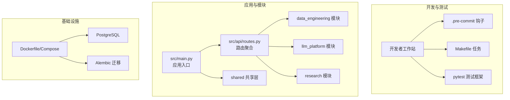
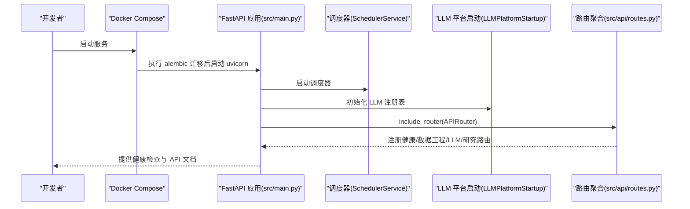
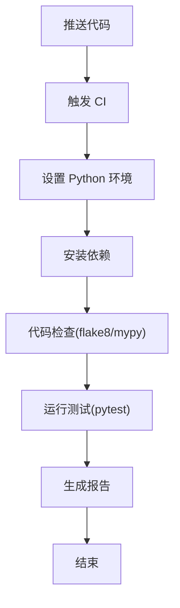
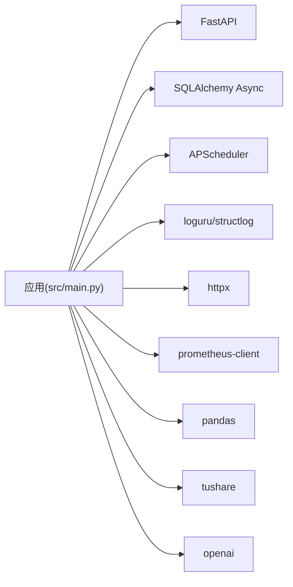

# 贡献指南

<cite>
**本文引用的文件**   
- [README.md](file://README.md)
- [pyproject.toml](file://pyproject.toml)
- [.github/workflows/ci.yml](file://.github/workflows/ci.yml)
- [Makefile](file://Makefile)
- [.pre-commit-config.yaml](file://.pre-commit-config.yaml)
- [environment.yml](file://environment.yml)
- [requirements.txt](file://requirements.txt)
- [docker-compose.yml](file://docker-compose.yml)
- [Dockerfile](file://Dockerfile)
- [src/main.py](file://src/main.py)
- [src/api/routes.py](file://src/api/routes.py)
- [src/shared/config.py](file://src/shared/config.py)
- [openspec/config.yaml](file://openspec/config.yaml)
- [pytest.ini](file://pytest.ini)
</cite>

## 目录
1. [简介](#简介)
2. [项目结构](#项目结构)
3. [核心组件](#核心组件)
4. [架构总览](#架构总览)
5. [详细组件分析](#详细组件分析)
6. [依赖分析](#依赖分析)
7. [性能考虑](#性能考虑)
8. [故障排查指南](#故障排查指南)
9. [结论](#结论)
10. [附录](#附录)

## 简介
本指南面向希望参与“股票助手”项目开源贡献的开发者，覆盖从 Fork 到 PR 的完整流程、行为准则与社区规范、治理与决策流程、不同类型的贡献方式、CI/CD 与自动化测试要求，以及贡献者认可与社区资源。项目采用 Python 3.10、FastAPI、PostgreSQL、Alembic 等技术栈，遵循领域驱动设计（DDD）分层架构，并通过 Docker 与 GitHub Actions 实现本地开发与持续集成。

## 项目结构
项目采用模块化与分层架构组织，核心目录与职责概览如下：
- .github/workflows：CI 工作流定义
- src：应用源码，按模块划分（data_engineering、llm_platform、research、shared）
- tests：单元/集成测试
- openspec：OpenSpec 规划与变更管理（spec、proposal、design、tasks 等）
- alembic：数据库迁移
- scripts：辅助脚本
- docker-compose.yml / Dockerfile：容器化部署
- pyproject.toml / Makefile / .pre-commit-config.yaml：开发工具链与质量控制
- requirements.txt / environment.yml：依赖清单与环境导出

**图示来源**
- [src/main.py](file://src/main.py#L1-L75)
- [src/api/routes.py](file://src/api/routes.py#L1-L13)
- [docker-compose.yml](file://docker-compose.yml#L1-L55)
- [Dockerfile](file://Dockerfile#L1-L52)

**章节来源**
- [README.md](file://README.md#L1-L42)
- [docker-compose.yml](file://docker-compose.yml#L1-L55)
- [Dockerfile](file://Dockerfile#L1-L52)

## 核心组件
- 应用入口与生命周期：应用在启动时初始化调度器与 LLM 注册表，在关闭时优雅退出。
- 路由聚合：统一注册健康检查、数据工程、LLM 平台、研究分析等模块路由。
- 配置系统：基于 Pydantic Settings 的集中式配置，支持 CORS、数据库连接串组装与环境变量注入。
- 开发工具链：Black、isort、flake8、mypy、pytest、pre-commit、conda/pip 环境管理。

**章节来源**
- [src/main.py](file://src/main.py#L14-L65)
- [src/api/routes.py](file://src/api/routes.py#L1-L13)
- [src/shared/config.py](file://src/shared/config.py#L8-L67)
- [pyproject.toml](file://pyproject.toml#L1-L22)
- [Makefile](file://Makefile#L1-L27)
- [.pre-commit-config.yaml](file://.pre-commit-config.yaml#L1-L25)
- [environment.yml](file://environment.yml#L1-L29)

## 架构总览
下图展示应用启动、路由注册与模块交互的关键流程：

**图示来源**
- [src/main.py](file://src/main.py#L21-L65)
- [src/api/routes.py](file://src/api/routes.py#L1-L13)
- [docker-compose.yml](file://docker-compose.yml#L17-L17)

## 详细组件分析

### 贡献流程（Fork → 分支 → PR）
- Fork 仓库到个人账号
- 创建功能/修复/文档分支（建议以 issue 编号命名，例如 feature/xxx 或 fix/xxx）
- 在本地完成开发与自测（参考“开发与测试”章节）
- 提交前确保通过 pre-commit 钩子与本地测试
- 推送分支并发起 Pull Request，填写模板化描述与关联 Issue

提示：PR 需满足以下条件：
- 通过 CI 测试（含 flake8、mypy、pytest）
- 代码风格符合 Black/isort
- 变更具备必要测试覆盖
- 描述清晰、拆分小而完整的提交

**章节来源**
- [.pre-commit-config.yaml](file://.pre-commit-config.yaml#L1-L25)
- [.github/workflows/ci.yml](file://.github/workflows/ci.yml#L1-L60)
- [Makefile](file://Makefile#L10-L11)

### 行为准则与社区规范
- 沟通礼仪：保持尊重、简洁明确；优先使用 Issue 讨论方案与问题
- 代码审查：至少一名维护者批准；关注可读性、健壮性与一致性
- 协作原则：遵循 DDD 分层与模块边界；避免跨模块直接依赖基础设施
- OpenSpec 变更：通过 proposal → design → tasks → spec 的闭环进行演进

**章节来源**
- [openspec/config.yaml](file://openspec/config.yaml#L1-L27)

### 治理结构与决策流程
- 问题讨论：在 Issue 中描述背景、现状、期望与影响
- 功能投票：通过 Issue 评论/点赞等方式收集反馈
- 版本规划：结合 OpenSpec 的 spec 与 tasks，制定迭代计划
- 决策与合并：维护者负责最终决策；PR 需满足质量门禁

**章节来源**
- [openspec/config.yaml](file://openspec/config.yaml#L1-L27)

### 不同类型贡献指导
- 代码贡献：遵循 DDD 分层与模块边界；新增/修改需配套测试
- 文档改进：更新 README、OpenSpec 文档或注释；保持与实现一致
- Bug 报告：提供复现步骤、期望/实际结果、环境信息与日志片段
- 功能建议：先开 Issue 讨论，附带场景、收益与风险评估

**章节来源**
- [README.md](file://README.md#L1-L42)
- [openspec/config.yaml](file://openspec/config.yaml#L1-L27)

### CI/CD 与自动化测试
- 触发条件：push 与 pull_request 到 main 分支
- 服务：GitHub Actions 使用 Ubuntu runner 与 Postgres 服务
- 步骤：安装依赖、运行 flake8/mypy、运行 pytest
- 本地复现：使用 Makefile 的 test/lint/format 目标；或直接调用 pytest

**图示来源**
- [.github/workflows/ci.yml](file://.github/workflows/ci.yml#L3-L59)

**章节来源**
- [.github/workflows/ci.yml](file://.github/workflows/ci.yml#L1-L60)
- [Makefile](file://Makefile#L10-L19)
- [pytest.ini](file://pytest.ini#L1-L5)

### 开发与测试工具链
- 代码格式化：Black（line-length=88，目标 Python 3.10）
- 导入排序：isort（profile=black）
- 类型检查：mypy（Python 3.10，忽略缺失导入）
- Lint：flake8（含额外插件）
- 测试：pytest（异步模式，会话作用域）
- 依赖导出：conda 环境与 pip requirements
- 本地运行：uvicorn 重载模式，端口 8000

**章节来源**
- [pyproject.toml](file://pyproject.toml#L1-L22)
- [pytest.ini](file://pytest.ini#L1-L5)
- [Makefile](file://Makefile#L1-L27)
- [environment.yml](file://environment.yml#L1-L29)
- [requirements.txt](file://requirements.txt#L1-L16)

### 容器化与部署
- Dockerfile：双阶段构建（构建期安装依赖，运行期最小化镜像）
- docker-compose：应用服务（自动迁移后启动）、数据库服务、网络与健康检查
- 健康检查：应用与数据库均配置健康检查策略
- 端口映射：应用 8000，数据库 5432

**章节来源**
- [Dockerfile](file://Dockerfile#L1-L52)
- [docker-compose.yml](file://docker-compose.yml#L1-L55)

### 配置与环境
- 环境变量：通过 .env 注入；Pydantic Settings 自动装配数据库连接串
- CORS：可配置允许的前端来源
- 运行环境：local/dev/prod 三档

**章节来源**
- [src/shared/config.py](file://src/shared/config.py#L8-L67)
- [src/main.py](file://src/main.py#L51-L59)
- [README.md](file://README.md#L8-L23)

## 依赖分析
- 运行时依赖：FastAPI、Uvicorn、SQLAlchemy Async、asyncpg、Alembic、Pydantic Settings、loguru、httpx、structlog、prometheus-client、pandas、tushare、APScheduler、openai
- 开发依赖：pytest、pytest-asyncio、black、isort、flake8、mypy、dependency-injector
- 本地/CI 环境：Python 3.10，PostgreSQL 服务

**图示来源**
- [requirements.txt](file://requirements.txt#L1-L16)
- [src/main.py](file://src/main.py#L1-L10)

**章节来源**
- [requirements.txt](file://requirements.txt#L1-L16)
- [environment.yml](file://environment.yml#L8-L28)

## 性能考虑
- 异步化：使用 SQLAlchemy asyncio 与 APScheduler，减少阻塞
- 日志与指标：结构化日志与 Prometheus 指标便于观测
- 数据库：通过 Alembic 迁移管理，避免运行时 schema 变更带来的性能与一致性问题
- 依赖精简：容器镜像采用最小化运行时，缩短启动时间

**章节来源**
- [src/main.py](file://src/main.py#L1-L10)
- [Dockerfile](file://Dockerfile#L25-L29)
- [requirements.txt](file://requirements.txt#L1-L16)

## 故障排查指南
- 本地无法访问健康检查：确认容器已启动、端口映射正常、健康检查成功
- 数据库连接失败：核对 .env 中数据库配置、容器网络与健康状态
- CI 失败：检查 flake8/mypy 报错与 pytest 失败用例，本地使用 Makefile 复现
- 代码风格问题：运行 pre-commit 或 make format

**章节来源**
- [docker-compose.yml](file://docker-compose.yml#L23-L28)
- [src/shared/config.py](file://src/shared/config.py#L34-L58)
- [.github/workflows/ci.yml](file://.github/workflows/ci.yml#L45-L59)
- [.pre-commit-config.yaml](file://.pre-commit-config.yaml#L1-L25)

## 结论
本指南提供了从入门到贡献的全链路实践路径。请优先阅读 README 与 OpenSpec 文档，遵循行为准则与 CI 要求，通过 Issue 与 PR 透明协作，共同推动项目演进。

## 附录
- 快速开始
  - 复制并编辑 .env 示例
  - 使用 Docker Compose 启动（自动迁移）
  - 访问健康检查与 API 文档
- 常用命令
  - 安装依赖：conda env update --file environment.yml --prune
  - 运行测试：make test
  - 代码检查：make lint
  - 格式化：make format
  - 本地运行：make run

**章节来源**
- [README.md](file://README.md#L8-L23)
- [Makefile](file://Makefile#L3-L22)
- [environment.yml](file://environment.yml#L1-L5)