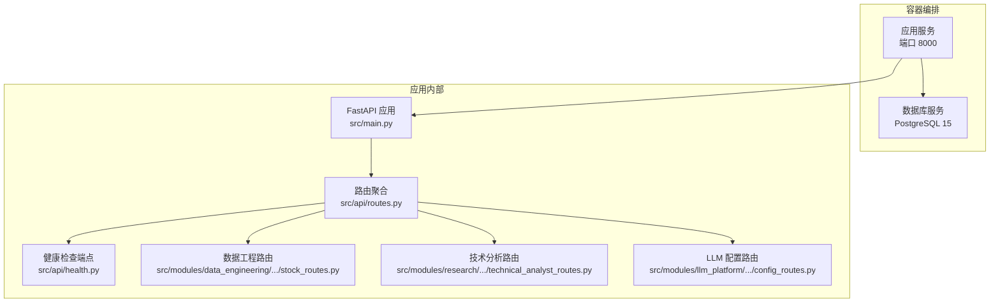
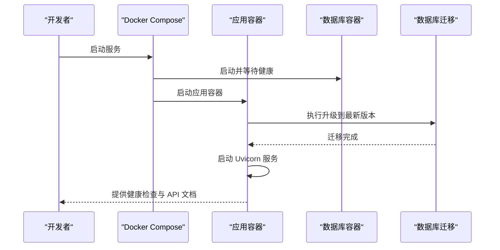
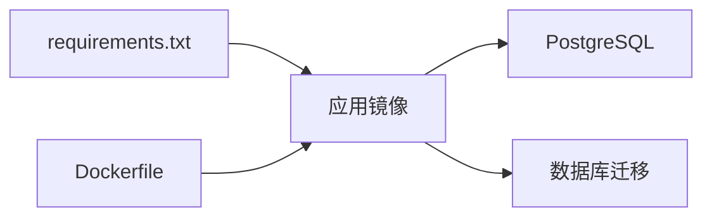

# 快速开始

<cite>
**本文引用的文件**
- [README.md](file://README.md)
- [docker-compose.yml](file://docker-compose.yml)
- [.env.example](file://.env.example)
- [Dockerfile](file://Dockerfile)
- [requirements.txt](file://requirements.txt)
- [src/main.py](file://src/main.py)
- [src/shared/config.py](file://src/shared/config.py)
- [src/api/routes.py](file://src/api/routes.py)
- [src/api/health.py](file://src/api/health.py)
- [src/modules/data_engineering/presentation/rest/stock_routes.py](file://src/modules/data_engineering/presentation/rest/stock_routes.py)
- [src/modules/research/presentation/rest/technical_analyst_routes.py](file://src/modules/research/presentation/rest/technical_analyst_routes.py)
- [src/modules/llm_platform/presentation/rest/config_routes.py](file://src/modules/llm_platform/presentation/rest/config_routes.py)
- [scripts/add_llm_config_template.py](file://scripts/add_llm_config_template.py)
- [scripts/test_chat_api.py](file://scripts/test_chat_api.py)
- [alembic/versions/c0ff00000001_initial_schema.py](file://alembic/versions/c0ff00000001_initial_schema.py)
- [alembic.ini](file://alembic.ini)
</cite>

## 目录
1. [简介](#简介)
2. [项目结构](#项目结构)
3. [核心组件](#核心组件)
4. [架构总览](#架构总览)
5. [详细组件分析](#详细组件分析)
6. [依赖关系分析](#依赖关系分析)
7. [性能注意事项](#性能注意事项)
8. [故障排查指南](#故障排查指南)
9. [结论](#结论)
10. [附录](#附录)

## 简介
本指南面向首次使用者，帮助你在约 30 分钟内完成股票助手项目的本地部署与基础验证。你将学到：
- 环境要求与前置条件（Docker 与 Docker Compose）
- 从复制环境变量到配置 LLM 与 Tushare 密钥的完整流程
- docker-compose.yml 的关键配置项说明
- 数据库初始化与迁移过程
- 健康检查与 API 文档访问方式
- 常见启动问题排查与解决方案
- 基本使用示例（技术分析接口调用）

## 项目结构
该项目采用容器化部署，后端基于 FastAPI，数据库为 PostgreSQL，使用 Alembic 进行数据库迁移。Compose 文件定义了应用与数据库两个服务，并在应用启动时自动执行迁移。

图表来源
- [docker-compose.yml](file://docker-compose.yml#L1-L55)
- [src/main.py](file://src/main.py#L1-L75)
- [src/api/routes.py](file://src/api/routes.py#L1-L18)
- [src/api/health.py](file://src/api/health.py#L1-L24)
- [src/modules/data_engineering/presentation/rest/stock_routes.py](file://src/modules/data_engineering/presentation/rest/stock_routes.py#L1-L106)
- [src/modules/research/presentation/rest/technical_analyst_routes.py](file://src/modules/research/presentation/rest/technical_analyst_routes.py#L1-L79)
- [src/modules/llm_platform/presentation/rest/config_routes.py](file://src/modules/llm_platform/presentation/rest/config_routes.py#L1-L145)

章节来源
- [docker-compose.yml](file://docker-compose.yml#L1-L55)
- [src/main.py](file://src/main.py#L1-L75)
- [src/api/routes.py](file://src/api/routes.py#L1-L18)

## 核心组件
- 应用服务（app）
  - 端口映射：宿主 8000 → 容器 8000
  - 环境变量：通过 .env 注入，包含数据库、Tushare 与 LLM 平台相关配置
  - 启动命令：先执行 Alembic 升级到最新版本，再启动 Uvicorn 服务
  - 健康检查：轮询 /api/v1/health
- 数据库服务（db）
  - 镜像：PostgreSQL 15 Alpine
  - 环境变量：用户名、密码、数据库名
  - 健康检查：pg_isready 检测
  - 数据持久化：命名卷 postgres_data

章节来源
- [docker-compose.yml](file://docker-compose.yml#L1-L55)
- [.env.example](file://.env.example#L1-L17)
- [Dockerfile](file://Dockerfile#L1-L52)

## 架构总览
下图展示了容器启动顺序、依赖关系与关键交互：

图表来源
- [docker-compose.yml](file://docker-compose.yml#L17-L28)
- [alembic/versions/c0ff00000001_initial_schema.py](file://alembic/versions/c0ff00000001_initial_schema.py#L21-L207)

## 详细组件分析

### 环境准备与安装步骤
- 前置条件
  - 已安装 Docker 与 Docker Compose
- 安装流程
  1) 复制并编辑环境变量文件
     - 复制示例文件为实际使用的 .env
     - 至少保留默认值；按需填写 TUSHARE_TOKEN、BOCHA_API_KEY 等
  2) 构建并启动
     - 使用 Compose 在后台构建并启动服务
  3) 查看日志
     - 实时查看应用日志，确认迁移与启动完成
  4) 停止与清理
     - 停止：docker compose down
     - 连数据卷一起删除：docker compose down -v

章节来源
- [README.md](file://README.md#L3-L23)
- [.env.example](file://.env.example#L1-L17)
- [docker-compose.yml](file://docker-compose.yml#L12-L17)

### docker-compose.yml 关键配置说明
- 服务 app
  - build：基于根目录 Dockerfile 构建镜像
  - ports：映射宿主 8000 到容器 8000
  - volumes：挂载当前目录到 /app，便于开发调试
  - env_file：读取 .env
  - environment：覆盖数据库连接等环境变量
  - command：先执行 Alembic 升级，再启动 Uvicorn
  - depends_on：等待 db 达到健康状态后再启动
  - healthcheck：定期探测 /api/v1/health
- 服务 db
  - image：PostgreSQL 15 Alpine
  - ports：映射宿主 5432 到容器 5432
  - environment：数据库凭据与库名
  - volumes：持久化数据卷
  - healthcheck：pg_isready 检测
- networks 与 volumes
  - 定义桥接网络与数据卷

章节来源
- [docker-compose.yml](file://docker-compose.yml#L1-L55)

### 数据库初始化与迁移
- 迁移触发
  - 应用容器启动命令中包含 alembic upgrade head，确保数据库结构与迁移脚本一致
- 初始模式
  - 迁移脚本创建以下表：
    - stock_info（股票基础信息）
    - stock_daily（日线行情）
    - stock_finance（财务指标）
    - llm_configs（LLM 配置）
- Alembic 配置
  - alembic.ini 指定脚本位置与日志级别

章节来源
- [docker-compose.yml](file://docker-compose.yml#L17-L17)
- [alembic/versions/c0ff00000001_initial_schema.py](file://alembic/versions/c0ff00000001_initial_schema.py#L21-L207)
- [alembic.ini](file://alembic.ini#L1-L97)

### 健康检查与 API 文档
- 健康检查
  - 访问路径：GET /api/v1/health
  - 作用：检查应用与数据库连接状态
- API 文档
  - 访问路径：/api/v1/docs
  - 提供交互式接口文档，便于调试与验证

章节来源
- [README.md](file://README.md#L19-L21)
- [src/api/health.py](file://src/api/health.py#L10-L23)
- [src/main.py](file://src/main.py#L14-L18)

### 配置 LLM 与 Tushare 密钥
- 环境变量
  - TUSHARE_TOKEN：Tushare 数据接口密钥
  - BOCHA_API_KEY 与 BOCHA_BASE_URL：用于 Web 搜索能力（可选）
- LLM 配置
  - 通过 /api/v1/llm-platform/configs 管理模型配置
  - 可使用脚本向本地服务添加模板配置（例如 SiliconFlow 的 DeepSeek-V3 或 Qwen 模型）
- 示例脚本
  - add_llm_config_template.py：添加示例 LLM 配置
  - test_chat_api.py：测试聊天接口

章节来源
- [.env.example](file://.env.example#L12-L17)
- [src/modules/llm_platform/presentation/rest/config_routes.py](file://src/modules/llm_platform/presentation/rest/config_routes.py#L85-L99)
- [scripts/add_llm_config_template.py](file://scripts/add_llm_config_template.py#L1-L72)
- [scripts/test_chat_api.py](file://scripts/test_chat_api.py#L1-L37)

### 基本使用示例：技术分析接口
- 接口说明
  - 路径：/api/v1/research/technical-analysis
  - 参数：
    - ticker（必填）：股票代码，如 000001.SZ
    - analysis_date（可选）：分析基准日 YYYY-MM-DD，默认当天
  - 返回：信号（BULLISH/BEARISH/NEUTRAL）、置信度、总结、关键支撑/阻力、风险提示，以及输入、技术指标快照与模型输出
- 调用前提
  - 需要先同步目标标的的日线数据（可通过 /api/v1/stocks/sync/daily 等接口）
  - 已在 LLM 平台配置可用模型，否则可能返回 422/500

章节来源
- [README.md](file://README.md#L25-L41)
- [src/modules/research/presentation/rest/technical_analyst_routes.py](file://src/modules/research/presentation/rest/technical_analyst_routes.py#L50-L79)

### 数据同步与查询接口
- 同步股票列表
  - POST /api/v1/stocks/sync
- 同步日线历史
  - POST /api/v1/stocks/sync/daily
  - 参数：limit、offset
- 查询示例
  - GET /api/v1/stocks/{ticker}/basic-info
  - GET /api/v1/stocks/{ticker}/daily?start_date=&end_date=
  - GET /api/v1/stocks/{ticker}/finance?start_date=&end_date=

章节来源
- [src/modules/data_engineering/presentation/rest/stock_routes.py](file://src/modules/data_engineering/presentation/rest/stock_routes.py#L57-L106)

## 依赖关系分析
- 应用层依赖
  - FastAPI：Web 框架与路由
  - SQLAlchemy asyncio + asyncpg：异步数据库访问
  - APScheduler：定时任务调度
  - Alembic：数据库迁移
  - tushare：Tushare 数据接口
  - openai：OpenAI 兼容接口适配
- 容器与服务依赖
  - 应用服务依赖数据库服务健康就绪
  - 应用启动前执行数据库迁移

图表来源
- [requirements.txt](file://requirements.txt#L1-L16)
- [Dockerfile](file://Dockerfile#L1-L52)
- [docker-compose.yml](file://docker-compose.yml#L17-L20)

章节来源
- [requirements.txt](file://requirements.txt#L1-L16)
- [docker-compose.yml](file://docker-compose.yml#L17-L20)

## 性能注意事项
- 数据库连接
  - 使用异步 SQLAlchemy 与 asyncpg，减少阻塞
- 定时任务
  - 通过 APScheduler 启动调度器，避免主线程阻塞
- 日志
  - 使用 loguru 结构化日志，便于定位性能瓶颈
- 容器资源
  - 建议为数据库与应用分别设置内存与 CPU 限制，避免资源争抢

## 故障排查指南
- 应用无法启动或健康检查失败
  - 检查数据库是否健康：确认 db 服务已达到健康状态
  - 查看应用日志：docker compose logs -f app
  - 确认 .env 中数据库连接参数正确
- 数据库迁移失败
  - 确认 Alembic 升级命令已执行
  - 检查迁移脚本是否与当前数据库状态匹配
- 技术分析接口返回 422/500
  - 确认已同步目标标的日线数据
  - 确认 LLM 平台已配置可用模型
- API 文档不可用
  - 确认应用已启动且 /api/v1/docs 路由正常

章节来源
- [docker-compose.yml](file://docker-compose.yml#L17-L28)
- [src/api/health.py](file://src/api/health.py#L18-L23)
- [README.md](file://README.md#L15-L16)

## 结论
按照本指南，你可以在 30 分钟内完成项目的本地部署、数据库初始化、LLM 与 Tushare 配置，并成功调用技术分析接口验证基本功能。建议后续逐步完善数据同步策略与模型配置，以获得更稳定的分析体验。

## 附录

### 环境变量与配置要点
- .env 中的关键项
  - POSTGRES_*：数据库连接参数
  - TUSHARE_TOKEN：Tushare 接口密钥
  - BOCHA_*：Web 搜索平台配置（可选）
- 应用配置加载
  - 通过 pydantic-settings 自动加载 .env
  - 支持动态组装数据库连接字符串

章节来源
- [.env.example](file://.env.example#L5-L17)
- [src/shared/config.py](file://src/shared/config.py#L8-L69)