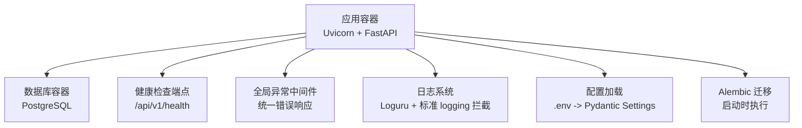
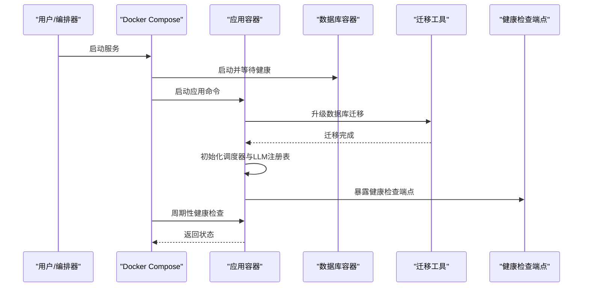
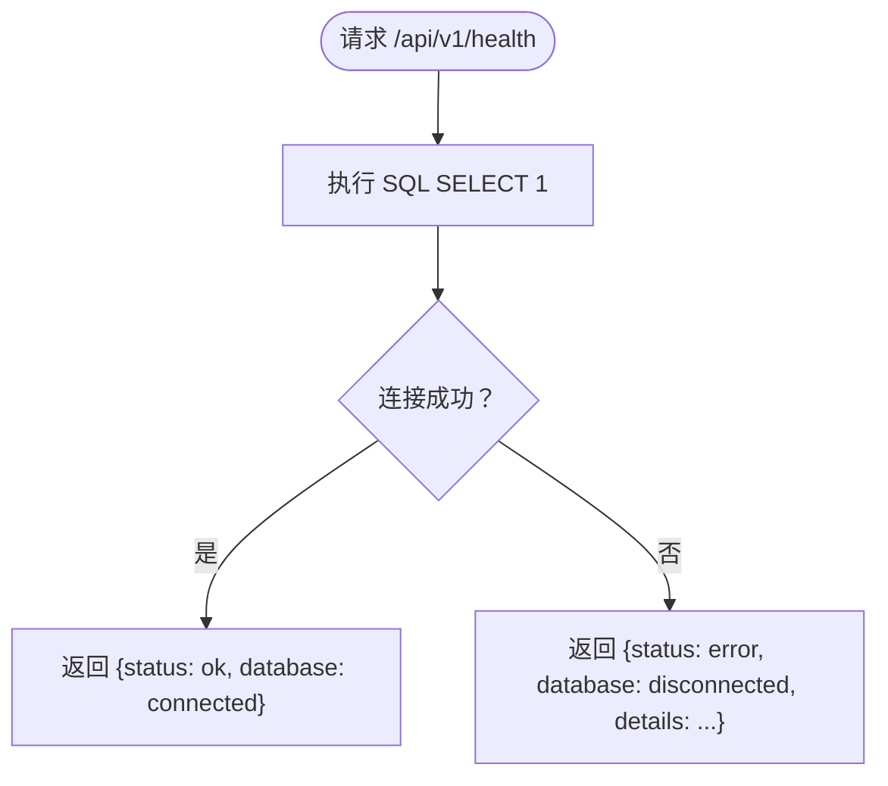
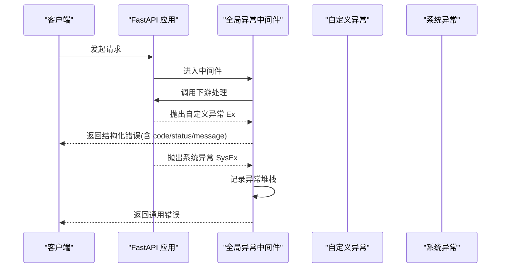
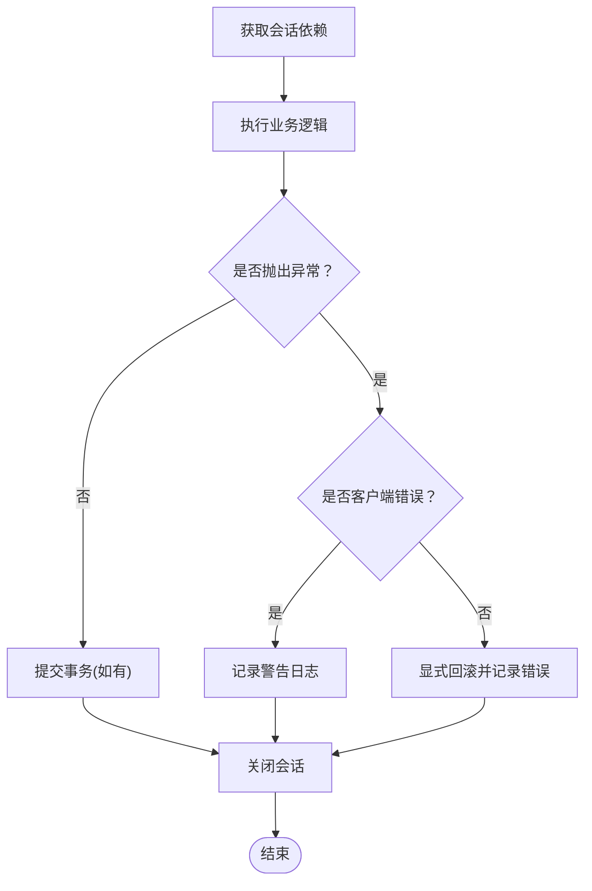
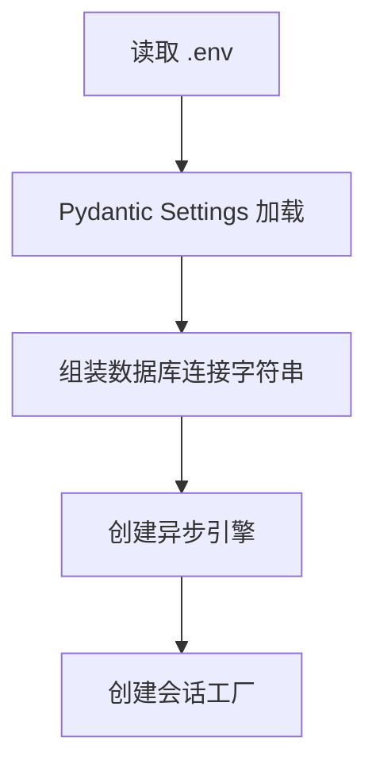
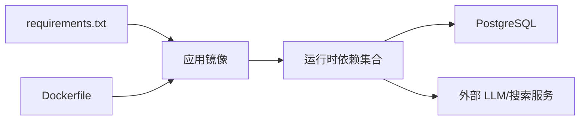

# 故障排除与FAQ

<cite>
**本文引用的文件**
- [README.md](file://README.md)
- [Dockerfile](file://Dockerfile)
- [docker-compose.yml](file://docker-compose.yml)
- [.env.example](file://.env.example)
- [requirements.txt](file://requirements.txt)
- [pyproject.toml](file://pyproject.toml)
- [src/main.py](file://src/main.py)
- [src/api/health.py](file://src/api/health.py)
- [src/api/middlewares/error_handler.py](file://src/api/middlewares/error_handler.py)
- [src/shared/config.py](file://src/shared/config.py)
- [src/shared/infrastructure/db/session.py](file://src/shared/infrastructure/db/session.py)
- [src/shared/domain/exceptions.py](file://src/shared/domain/exceptions.py)
- [src/shared/infrastructure/logging.py](file://src/shared/infrastructure/logging.py)
- [alembic/env.py](file://alembic/env.py)
- [tests/test_health.py](file://tests/test_health.py)
</cite>

## 目录
1. [简介](#简介)
2. [项目结构](#项目结构)
3. [核心组件](#核心组件)
4. [架构总览](#架构总览)
5. [详细组件分析](#详细组件分析)
6. [依赖关系分析](#依赖关系分析)
7. [性能注意事项](#性能注意事项)
8. [故障排除指南](#故障排除指南)
9. [结论](#结论)
10. [附录](#附录)

## 简介
本文件面向“股票助手”项目的运维与开发者，提供系统化的故障排除与常见问题解答。内容涵盖安装部署、Docker 配置、数据库连接、环境变量、日志与健康检查、错误处理与异常恢复、性能瓶颈定位、网络与权限问题、依赖冲突、监控告警与问题反馈渠道等。

## 项目结构
- 应用采用 FastAPI + SQLAlchemy Async + Uvicorn + Alembic 的组合，容器内通过 Docker Compose 启动应用与数据库。
- 健康检查端点与全局异常中间件确保服务可观测性与稳定性。
- 配置通过 Pydantic Settings 从 .env 加载，数据库连接字符串动态组装。

图表来源
- [docker-compose.yml](file://docker-compose.yml#L1-L55)
- [Dockerfile](file://Dockerfile#L1-L52)
- [src/main.py](file://src/main.py#L1-L75)
- [src/api/health.py](file://src/api/health.py#L1-L24)
- [src/api/middlewares/error_handler.py](file://src/api/middlewares/error_handler.py#L1-L46)
- [src/shared/infrastructure/logging.py](file://src/shared/infrastructure/logging.py#L1-L74)
- [src/shared/config.py](file://src/shared/config.py#L1-L68)
- [alembic/env.py](file://alembic/env.py#L1-L94)

章节来源
- [README.md](file://README.md#L1-L42)
- [docker-compose.yml](file://docker-compose.yml#L1-L55)
- [Dockerfile](file://Dockerfile#L1-L52)
- [src/main.py](file://src/main.py#L1-L75)

## 核心组件
- 健康检查端点：用于判断应用与数据库状态，便于编排与探活。
- 全局异常中间件：统一捕获异常并返回结构化错误响应。
- 数据库会话与连接池：异步引擎、预检、回滚与关闭流程。
- 配置系统：从 .env 动态组装数据库连接字符串。
- 日志系统：接管标准 logging，统一输出格式，支持生产 JSON 序列化。
- Alembic 迁移：应用启动时自动执行数据库迁移。

章节来源
- [src/api/health.py](file://src/api/health.py#L1-L24)
- [src/api/middlewares/error_handler.py](file://src/api/middlewares/error_handler.py#L1-L46)
- [src/shared/infrastructure/db/session.py](file://src/shared/infrastructure/db/session.py#L1-L64)
- [src/shared/config.py](file://src/shared/config.py#L1-L68)
- [src/shared/infrastructure/logging.py](file://src/shared/infrastructure/logging.py#L1-L74)
- [alembic/env.py](file://alembic/env.py#L1-L94)

## 架构总览
应用启动顺序与关键交互如下：

图表来源
- [docker-compose.yml](file://docker-compose.yml#L17-L28)
- [Dockerfile](file://Dockerfile#L42-L51)
- [src/main.py](file://src/main.py#L21-L48)
- [src/api/health.py](file://src/api/health.py#L10-L23)
- [alembic/env.py](file://alembic/env.py#L67-L94)

## 详细组件分析

### 健康检查与可观测性
- 健康端点路径与返回结构：/api/v1/health，返回状态与数据库连接状态。
- 健康检查失败时的返回结构包含错误详情，便于快速定位。
- Docker 健康检查与应用内置健康检查配合，提升容器编排可靠性。

图表来源
- [src/api/health.py](file://src/api/health.py#L10-L23)

章节来源
- [src/api/health.py](file://src/api/health.py#L1-L24)
- [tests/test_health.py](file://tests/test_health.py#L1-L11)
- [docker-compose.yml](file://docker-compose.yml#L23-L28)

### 全局异常处理与错误响应
- 中间件捕获自定义异常与未处理异常，统一返回 JSON 错误体。
- 自定义异常类包含状态码、业务码与可选详情，便于前端与监控系统识别。
- 未处理异常记录完整堆栈，利于线上问题定位。

图表来源
- [src/api/middlewares/error_handler.py](file://src/api/middlewares/error_handler.py#L8-L46)
- [src/shared/domain/exceptions.py](file://src/shared/domain/exceptions.py#L4-L67)

章节来源
- [src/api/middlewares/error_handler.py](file://src/api/middlewares/error_handler.py#L1-L46)
- [src/shared/domain/exceptions.py](file://src/shared/domain/exceptions.py#L1-L67)

### 数据库连接与会话生命周期
- 使用异步引擎与连接池，开启 pre_ping 以复用健康连接。
- 会话生成器负责异常分类：客户端错误不回滚，系统异常显式回滚并记录。
- 依赖注入确保会话在异常时也能正确关闭。

图表来源
- [src/shared/infrastructure/db/session.py](file://src/shared/infrastructure/db/session.py#L24-L64)

章节来源
- [src/shared/infrastructure/db/session.py](file://src/shared/infrastructure/db/session.py#L1-L64)
- [src/shared/config.py](file://src/shared/config.py#L34-L58)

### 配置加载与数据库连接字符串
- 配置类从 .env 加载，支持 CORS、数据库参数与扩展字段。
- 数据库连接字符串通过 PostgresDsn.build 动态组装，scheme 使用异步驱动。
- Docker 环境变量与 .env 示例保持一致，确保容器内连接正常。

图表来源
- [src/shared/config.py](file://src/shared/config.py#L8-L68)
- [docker-compose.yml](file://docker-compose.yml#L11-L17)
- [.env.example](file://.env.example#L5-L11)

章节来源
- [src/shared/config.py](file://src/shared/config.py#L1-L68)
- [.env.example](file://.env.example#L1-L17)
- [docker-compose.yml](file://docker-compose.yml#L1-L55)

### 日志系统与输出格式
- 拦截标准 logging 并转发至 Loguru，统一输出格式。
- 开发环境使用彩色格式，生产环境启用 JSON 序列化，便于日志采集系统解析。
- 通过环境变量控制输出行为，避免在容器中出现缓冲问题。

章节来源
- [src/shared/infrastructure/logging.py](file://src/shared/infrastructure/logging.py#L1-L74)
- [Dockerfile](file://Dockerfile#L34-L38)

### 启动流程与迁移
- 应用启动事件初始化调度器与 LLM 注册表。
- Docker 命令在启动前执行 Alembic 迁移，保证数据库 schema 最新。
- 迁移脚本从应用配置读取连接字符串，确保与运行时一致。

章节来源
- [src/main.py](file://src/main.py#L21-L48)
- [docker-compose.yml](file://docker-compose.yml#L17-L17)
- [alembic/env.py](file://alembic/env.py#L34-L36)

## 依赖关系分析
- 运行时依赖：FastAPI、Uvicorn、SQLAlchemy Async、asyncpg、Alembic、Prometheus 客户端、Pydantic Settings、Loguru、structlog、httpx、pandas、tushare、openai、APScheduler。
- 构建阶段依赖：Python 虚拟环境、apt 包（libpq-dev、curl）。
- Docker 健康检查依赖：curl 与应用健康端点。

图表来源
- [requirements.txt](file://requirements.txt#L1-L16)
- [Dockerfile](file://Dockerfile#L7-L29)

章节来源
- [requirements.txt](file://requirements.txt#L1-L16)
- [Dockerfile](file://Dockerfile#L1-L52)
- [pyproject.toml](file://pyproject.toml#L1-L22)

## 性能注意事项
- 数据库连接池与 pre_ping：减少无效连接，降低连接抖动。
- 异步 I/O：避免阻塞，提升并发吞吐。
- 日志输出：生产环境 JSON 序列化，减少格式化开销。
- 健康检查与探活：合理间隔与超时，避免过度探测。
- 外部服务限流与重试：对外部 API（如 tushare、Bocha）实施退避与熔断策略（建议在应用层补充）。

## 故障排除指南

### 一、安装与部署常见问题

1. **Docker 构建失败（缺少系统依赖）**
   - 现象：构建阶段 apt 安装失败或找不到依赖。
   - 排查步骤：
     - 检查 Dockerfile 中的 apt 依赖是否与目标镜像匹配。
     - 确认网络可达性与代理配置。
   - 解决方案：
     - 在本地缓存 apt 源或使用国内镜像源。
     - 确保构建上下文包含必要文件。
   章节来源
   - [Dockerfile](file://Dockerfile#L7-L29)

2. **容器启动后立即退出（健康检查失败）**
   - 现象：应用容器健康检查失败，反复重启。
   - 排查步骤：
     - 查看应用日志：docker compose logs -f app。
     - 检查数据库是否健康：docker compose logs db。
     - 确认 Alembic 迁移是否成功执行。
   - 解决方案：
     - 等待数据库完全就绪后再启动应用。
     - 检查 .env 与 docker-compose.yml 中的数据库连接参数。
   章节来源
   - [docker-compose.yml](file://docker-compose.yml#L17-L28)
   - [Dockerfile](file://Dockerfile#L42-L44)

3. **端口占用或无法访问**
   - 现象：宿主机端口被占用或无法访问 8000。
   - 排查步骤：
     - 检查宿主机端口占用情况。
     - 确认 docker-compose.yml 映射正确。
   - 解决方案：
     - 更换宿主机端口或释放占用端口。
   章节来源
   - [docker-compose.yml](file://docker-compose.yml#L5-L6)
   - [README.md](file://README.md#L19-L21)

4. **环境变量缺失导致启动失败**
   - 现象：数据库连接失败或配置异常。
   - 排查步骤：
     - 对照 .env.example 补齐关键变量（数据库、Tushare、Bocha）。
     - 确认 .env 是否被 docker-compose.env_file 正确加载。
   - 解决方案：
     - 复制 .env.example 为 .env 并按需修改。
   章节来源
   - [.env.example](file://.env.example#L1-L17)
   - [docker-compose.yml](file://docker-compose.yml#L9-L11)

### 二、数据库连接问题

1. **连接字符串错误或参数不匹配**
   - 现象：应用启动时报数据库连接错误。
   - 排查步骤：
     - 检查 settings 中的数据库参数与 .env 是否一致。
     - 确认 scheme 使用异步驱动。
   - 解决方案：
     - 使用配置类提供的组装逻辑，避免手动拼接。
   章节来源
   - [src/shared/config.py](file://src/shared/config.py#L42-L58)
   - [.env.example](file://.env.example#L5-L11)

2. **迁移失败或 schema 不一致**
   - 现象：启动时报错与表结构相关。
   - 排查步骤：
     - 查看 Alembic 迁移日志与错误信息。
     - 确认迁移脚本与模型一致。
   - 解决方案：
     - 在安全环境下执行迁移回滚与重建，或手动修正迁移。
   章节来源
   - [alembic/env.py](file://alembic/env.py#L67-L94)

3. **连接池耗尽或超时**
   - 现象：高并发下出现连接超时或队列堆积。
   - 排查步骤：
     - 观察数据库连接数与慢查询。
     - 检查应用侧并发与事务时长。
   - 解决方案：
     - 调整连接池大小与超时参数。
     - 优化查询与索引，缩短事务时间。
   章节来源
   - [src/shared/infrastructure/db/session.py](file://src/shared/infrastructure/db/session.py#L8-L22)

### 三、日志与健康检查

1. **日志格式异常或输出乱码**
   - 现象：容器日志不可读或格式不符合预期。
   - 排查步骤：
     - 检查 PYTHONUNBUFFERED 与日志配置。
     - 确认生产/开发环境变量设置。
   - 解决方案：
     - 设置 PYTHONUNBUFFERED=1，确保日志实时输出。
     - 生产环境启用 JSON 序列化。
   章节来源
   - [Dockerfile](file://Dockerfile#L34-L38)
   - [src/shared/infrastructure/logging.py](file://src/shared/infrastructure/logging.py#L63-L73)

2. **健康检查频繁失败**
   - 现象：容器健康检查失败导致重启。
   - 排查步骤：
     - 检查 /api/v1/health 的返回状态与错误详情。
     - 确认数据库连接与迁移是否完成。
   - 解决方案：
     - 延长启动准备时间，确保数据库与迁移完成。
   章节来源
   - [src/api/health.py](file://src/api/health.py#L10-L23)
   - [docker-compose.yml](file://docker-compose.yml#L17-L28)

### 四、错误处理与异常恢复

1. **API 返回 500 未知错误**
   - 现象：未捕获异常导致统一错误响应。
   - 排查步骤：
     - 查看中间件记录的异常堆栈。
     - 检查上游依赖（数据库、外部服务）状态。
   - 解决方案：
     - 将业务异常规范化为自定义异常，明确状态码与业务码。
   章节来源
   - [src/api/middlewares/error_handler.py](file://src/api/middlewares/error_handler.py#L29-L45)
   - [src/shared/domain/exceptions.py](file://src/shared/domain/exceptions.py#L4-L67)

2. **数据库异常导致事务未回滚**
   - 现象：异常后事务未回滚，造成脏读或锁等待。
   - 排查步骤：
     - 检查会话生成器中的异常分类与回滚逻辑。
   - 解决方案：
     - 确保系统异常显式回滚，客户端错误不回滚但记录警告。
   章节来源
   - [src/shared/infrastructure/db/session.py](file://src/shared/infrastructure/db/session.py#L44-L61)

### 五、性能问题排查

1. **内存泄漏或增长过快**
   - 现象：容器内存持续增长。
   - 排查步骤：
     - 结合 Prometheus 或系统监控观察内存曲线。
     - 检查长生命周期对象与未释放的连接/会话。
   - 解决方案：
     - 限制并发与连接池大小，及时关闭资源。
   章节来源
   - [requirements.txt](file://requirements.txt#L11-L11)

2. **数据库查询缓慢**
   - 现象：接口响应时间长，数据库负载高。
   - 排查步骤：
     - 分析慢查询日志与索引缺失。
     - 评估查询复杂度与分页策略。
   - 解决方案：
     - 优化 SQL 与索引，拆分复杂查询。
   章节来源
   - [src/shared/infrastructure/db/session.py](file://src/shared/infrastructure/db/session.py#L8-L13)

3. **API 响应时间长**
   - 现象：外部服务调用或计算密集型任务导致延迟。
   - 排查步骤：
     - 使用 Prometheus 指标与链路追踪定位热点。
     - 检查外部服务限流与重试策略。
   - 解决方案：
     - 实施缓存、异步处理与降级策略。
   章节来源
   - [requirements.txt](file://requirements.txt#L11-L11)

### 六、网络与权限问题

1. **外部服务访问失败（Tushare/Bocha）**
   - 现象：同步或搜索接口返回错误。
   - 排查步骤：
     - 检查 Token 与 Base URL 配置。
     - 确认网络可达性与代理设置。
   - 解决方案：
     - 更新 .env 中的密钥与地址，确保网络连通。
   章节来源
   - [.env.example](file://.env.example#L12-L17)

2. **容器权限不足**
   - 现象：应用无法写入卷或访问特定设备。
   - 排查步骤：
     - 检查 Docker 用户与权限映射。
   - 解决方案：
     - 使用非 root 用户运行，确保卷权限正确。
   章节来源
   - [Dockerfile](file://Dockerfile#L46-L48)

### 七、依赖冲突与版本问题

1. **包版本冲突或导入失败**
   - 现象：运行时报错找不到模块或版本不兼容。
   - 排查步骤：
     - 检查 requirements.txt 与 Python 版本。
     - 确认虚拟环境与 PATH 设置。
   - 解决方案：
     - 清理缓存并重新安装依赖，锁定兼容版本。
   章节来源
   - [requirements.txt](file://requirements.txt#L1-L16)
   - [Dockerfile](file://Dockerfile#L12-L18)

### 八、监控告警与故障预警

- 建议接入 Prometheus 客户端指标，结合 Grafana/Alertmanager 实现告警。
- 在应用中暴露指标端点，记录关键指标（QPS、P95/P99、错误率、数据库连接数）。
- 健康检查失败即触发告警，结合日志与链路追踪进行根因分析。

章节来源
- [requirements.txt](file://requirements.txt#L11-L11)
- [src/api/health.py](file://src/api/health.py#L10-L23)

### 九、问题反馈与社区支持

- 仓库提供 GitHub Actions CI 工作流，可用于自动化测试与质量门禁。
- 建议在 Issue 中提供：
  - 环境信息（操作系统、Docker 版本、Python 版本）
  - .env 关键配置片段
  - 容器日志与健康检查结果
  - 复现步骤与期望/实际行为

章节来源
- [.github/workflows/ci.yml](file://.github/workflows/ci.yml)
- [README.md](file://README.md#L1-L42)

## 结论
通过规范的配置管理、统一的异常处理、可观测的健康检查与日志体系，以及完善的 Docker 编排，股票助手项目具备良好的可维护性与可扩展性。建议在生产环境中进一步完善监控告警、外部服务限流与缓存策略，以应对高并发与外部依赖波动带来的挑战。

## 附录

### A. 常用命令速查
- 构建并启动：docker compose up -d --build
- 查看日志：docker compose logs -f app
- 停止服务：docker compose down
- 停止并删除卷：docker compose down -v
- 健康检查：GET /api/v1/health

章节来源
- [README.md](file://README.md#L7-L23)