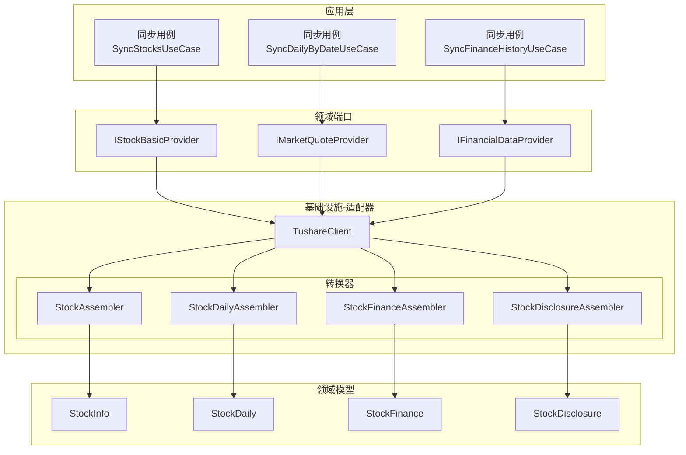
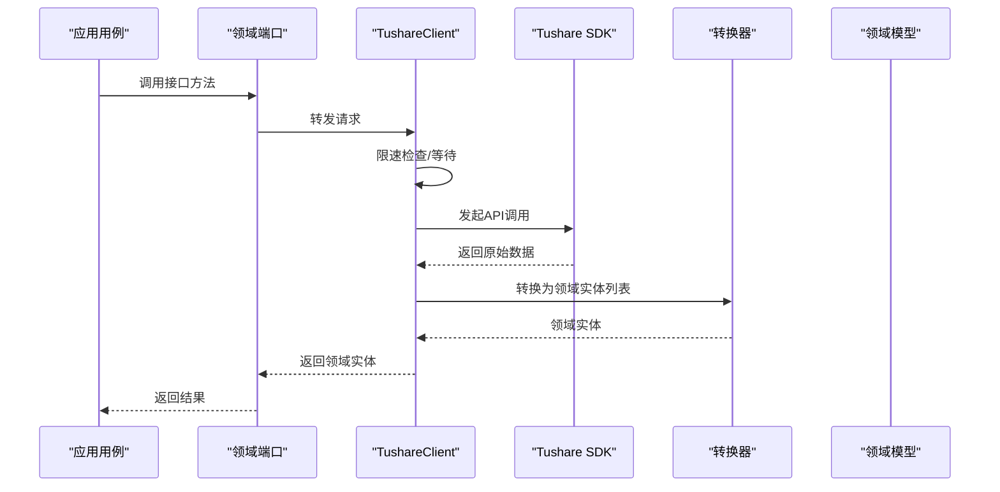
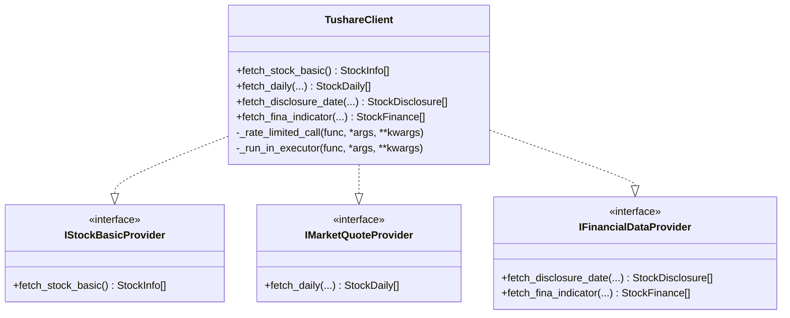
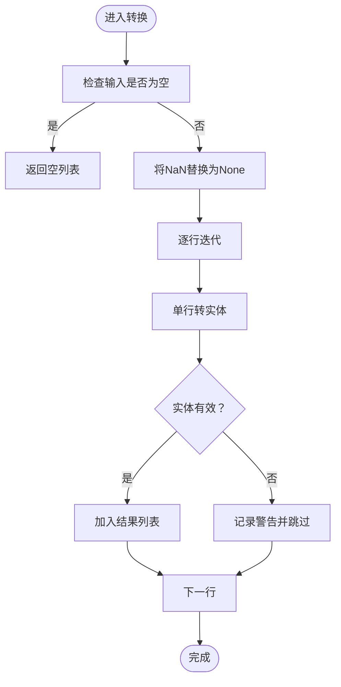
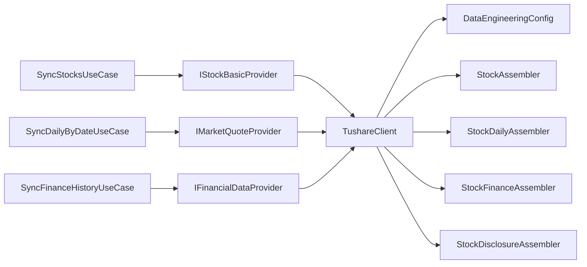

# 外部API适配器

<cite>
**本文引用的文件**
- [client.py](file://src/modules/data_engineering/infrastructure/external_apis/tushare/client.py)
- [stock_converter.py](file://src/modules/data_engineering/infrastructure/external_apis/tushare/converters/stock_converter.py)
- [quote_converter.py](file://src/modules/data_engineering/infrastructure/external_apis/tushare/converters/quote_converter.py)
- [finance_converter.py](file://src/modules/data_engineering/infrastructure/external_apis/tushare/converters/finance_converter.py)
- [stock_disclosure_assembler.py](file://src/modules/data_engineering/infrastructure/external_apis/tushare/converters/stock_disclosure_assembler.py)
- [config.py](file://src/modules/data_engineering/infrastructure/config.py)
- [financial_data_provider.py](file://src/modules/data_engineering/domain/ports/providers/financial_data_provider.py)
- [market_quote_provider.py](file://src/modules/data_engineering/domain/ports/providers/market_quote_provider.py)
- [stock_basic_provider.py](file://src/modules/data_engineering/domain/ports/providers/stock_basic_provider.py)
- [stock.py](file://src/modules/data_engineering/domain/model/stock.py)
- [stock_daily.py](file://src/modules/data_engineering/domain/model/stock_daily.py)
- [financial_report.py](file://src/modules/data_engineering/domain/model/financial_report.py)
- [disclosure.py](file://src/modules/data_engineering/domain/model/disclosure.py)
- [enums.py](file://src/modules/data_engineering/domain/model/enums.py)
- [sync_stock_list_cmd.py](file://src/modules/data_engineering/application/commands/sync_stock_list_cmd.py)
- [sync_daily_bar_cmd.py](file://src/modules/data_engineering/application/commands/sync_daily_bar_cmd.py)
- [sync_finance_cmd.py](file://src/modules/data_engineering/application/commands/sync_finance_cmd.py)
</cite>

## 目录
1. [简介](#简介)
2. [项目结构](#项目结构)
3. [核心组件](#核心组件)
4. [架构总览](#架构总览)
5. [组件详解](#组件详解)
6. [依赖关系分析](#依赖关系分析)
7. [性能与并发特性](#性能与并发特性)
8. [故障处理与重试策略](#故障处理与重试策略)
9. [扩展与自定义指南](#扩展与自定义指南)
10. [结论](#结论)

## 简介
本文件面向外部API适配器的实现与维护，聚焦于Tushare数据提供商的集成方案。内容涵盖：
- API客户端封装与配置管理
- 数据转换器设计模式（StockConverter、QuoteConverter、FinanceConverter等）
- 适配器模式在接口抽象与外部系统解耦中的应用
- 数据映射规则与验证机制
- API调用的错误处理与重试策略
- 适配器扩展与自定义实现示例

## 项目结构
围绕“数据工程”上下文，外部API适配器位于基础设施层，通过适配器模式对接领域端口，并以转换器将外部数据映射为领域实体。

图表来源
- [client.py](file://src/modules/data_engineering/infrastructure/external_apis/tushare/client.py#L33-L252)
- [stock_converter.py](file://src/modules/data_engineering/infrastructure/external_apis/tushare/converters/stock_converter.py#L7-L74)
- [quote_converter.py](file://src/modules/data_engineering/infrastructure/external_apis/tushare/converters/quote_converter.py#L6-L77)
- [finance_converter.py](file://src/modules/data_engineering/infrastructure/external_apis/tushare/converters/finance_converter.py#L6-L148)
- [stock_disclosure_assembler.py](file://src/modules/data_engineering/infrastructure/external_apis/tushare/converters/stock_disclosure_assembler.py#L6-L58)
- [stock_basic_provider.py](file://src/modules/data_engineering/domain/ports/providers/stock_basic_provider.py#L5-L10)
- [market_quote_provider.py](file://src/modules/data_engineering/domain/ports/providers/market_quote_provider.py#L5-L10)
- [financial_data_provider.py](file://src/modules/data_engineering/domain/ports/providers/financial_data_provider.py#L6-L16)
- [stock.py](file://src/modules/data_engineering/domain/model/stock.py#L7-L63)
- [stock_daily.py](file://src/modules/data_engineering/domain/model/stock_daily.py#L6-L42)
- [financial_report.py](file://src/modules/data_engineering/domain/model/financial_report.py#L6-L117)
- [disclosure.py](file://src/modules/data_engineering/domain/model/disclosure.py#L6-L16)

章节来源
- [client.py](file://src/modules/data_engineering/infrastructure/external_apis/tushare/client.py#L33-L252)
- [config.py](file://src/modules/data_engineering/infrastructure/config.py#L10-L28)

## 核心组件
- TushareClient：实现IStockBasicProvider、IMarketQuoteProvider、IFinancialDataProvider，负责与Tushare API交互、限速控制、异步执行与错误包装。
- 转换器：StockAssembler、StockDailyAssembler、StockFinanceAssembler、StockDisclosureAssembler，负责将外部DataFrame映射为领域实体，含空值处理与类型/枚举安全转换。
- 配置：DataEngineeringConfig，集中管理Tushare令牌、最小调用间隔、批量大小、失败重试等参数。
- 领域模型：StockInfo、StockDaily、StockFinance、StockDisclosure，承载业务语义与序列化配置。

章节来源
- [client.py](file://src/modules/data_engineering/infrastructure/external_apis/tushare/client.py#L33-L252)
- [stock_converter.py](file://src/modules/data_engineering/infrastructure/external_apis/tushare/converters/stock_converter.py#L7-L74)
- [quote_converter.py](file://src/modules/data_engineering/infrastructure/external_apis/tushare/converters/quote_converter.py#L6-L77)
- [finance_converter.py](file://src/modules/data_engineering/infrastructure/external_apis/tushare/converters/finance_converter.py#L6-L148)
- [stock_disclosure_assembler.py](file://src/modules/data_engineering/infrastructure/external_apis/tushare/converters/stock_disclosure_assembler.py#L6-L58)
- [config.py](file://src/modules/data_engineering/infrastructure/config.py#L10-L28)
- [stock.py](file://src/modules/data_engineering/domain/model/stock.py#L7-L63)
- [stock_daily.py](file://src/modules/data_engineering/domain/model/stock_daily.py#L6-L42)
- [financial_report.py](file://src/modules/data_engineering/domain/model/financial_report.py#L6-L117)
- [disclosure.py](file://src/modules/data_engineering/domain/model/disclosure.py#L6-L16)

## 架构总览
TushareClient作为基础设施适配器，向上暴露统一的领域端口接口；向下对接Tushare SDK，内部通过限速锁与线程池避免阻塞与超频；数据经转换器映射为领域实体，供应用层用例编排。

图表来源
- [client.py](file://src/modules/data_engineering/infrastructure/external_apis/tushare/client.py#L62-L79)
- [stock_converter.py](file://src/modules/data_engineering/infrastructure/external_apis/tushare/converters/stock_converter.py#L14-L36)
- [quote_converter.py](file://src/modules/data_engineering/infrastructure/external_apis/tushare/converters/quote_converter.py#L12-L32)
- [finance_converter.py](file://src/modules/data_engineering/infrastructure/external_apis/tushare/converters/finance_converter.py#L12-L28)

## 组件详解

### TushareClient 适配器
- 角色与职责
  - 实现三个领域端口：IStockBasicProvider、IMarketQuoteProvider、IFinancialDataProvider
  - 初始化Tushare SDK，设置令牌与Pro API实例
  - 提供限速调用与线程池执行，保证并发安全与API频率合规
  - 对外部异常进行包装，统一为应用异常，便于上层处理
- 关键流程
  - 令牌校验与初始化失败时抛出应用异常
  - 限速逻辑：全局共享锁+最小间隔控制，不足则等待
  - 异步执行：将阻塞式SDK调用放入线程池，避免事件循环阻塞
  - 数据获取：按功能拆分多个API调用，必要时合并多源数据
  - 错误处理：捕获异常并抛出应用异常，附带状态码与详情

图表来源
- [client.py](file://src/modules/data_engineering/infrastructure/external_apis/tushare/client.py#L33-L252)
- [stock_basic_provider.py](file://src/modules/data_engineering/domain/ports/providers/stock_basic_provider.py#L5-L10)
- [market_quote_provider.py](file://src/modules/data_engineering/domain/ports/providers/market_quote_provider.py#L5-L10)
- [financial_data_provider.py](file://src/modules/data_engineering/domain/ports/providers/financial_data_provider.py#L6-L16)

章节来源
- [client.py](file://src/modules/data_engineering/infrastructure/external_apis/tushare/client.py#L38-L53)
- [client.py](file://src/modules/data_engineering/infrastructure/external_apis/tushare/client.py#L55-L60)
- [client.py](file://src/modules/data_engineering/infrastructure/external_apis/tushare/client.py#L62-L79)
- [client.py](file://src/modules/data_engineering/infrastructure/external_apis/tushare/client.py#L81-L108)
- [client.py](file://src/modules/data_engineering/infrastructure/external_apis/tushare/client.py#L110-L140)
- [client.py](file://src/modules/data_engineering/infrastructure/external_apis/tushare/client.py#L142-L171)
- [client.py](file://src/modules/data_engineering/infrastructure/external_apis/tushare/client.py#L173-L251)

### 数据转换器设计模式
- 设计要点
  - 装配器模式：将外部数据结构（主要是DataFrame）转换为领域实体，屏蔽外部字段差异与类型不一致
  - 安全转换：空值替换、日期解析容错、枚举安全转换、缺失列使用get兜底
  - 单行转换失败不影响整体流程，记录警告后继续
- 转换器清单
  - StockAssembler：股票基础信息映射
  - StockDailyAssembler：日线行情与每日指标合并映射
  - StockFinanceAssembler：财务指标映射
  - StockDisclosureAssembler：财报披露计划映射

图表来源
- [stock_converter.py](file://src/modules/data_engineering/infrastructure/external_apis/tushare/converters/stock_converter.py#L14-L36)
- [quote_converter.py](file://src/modules/data_engineering/infrastructure/external_apis/tushare/converters/quote_converter.py#L12-L32)
- [finance_converter.py](file://src/modules/data_engineering/infrastructure/external_apis/tushare/converters/finance_converter.py#L12-L28)
- [stock_disclosure_assembler.py](file://src/modules/data_engineering/infrastructure/external_apis/tushare/converters/stock_disclosure_assembler.py#L13-L29)

章节来源
- [stock_converter.py](file://src/modules/data_engineering/infrastructure/external_apis/tushare/converters/stock_converter.py#L14-L36)
- [stock_converter.py](file://src/modules/data_engineering/infrastructure/external_apis/tushare/converters/stock_converter.py#L39-L73)
- [quote_converter.py](file://src/modules/data_engineering/infrastructure/external_apis/tushare/converters/quote_converter.py#L12-L32)
- [quote_converter.py](file://src/modules/data_engineering/infrastructure/external_apis/tushare/converters/quote_converter.py#L35-L76)
- [finance_converter.py](file://src/modules/data_engineering/infrastructure/external_apis/tushare/converters/finance_converter.py#L12-L28)
- [finance_converter.py](file://src/modules/data_engineering/infrastructure/external_apis/tushare/converters/finance_converter.py#L31-L147)
- [stock_disclosure_assembler.py](file://src/modules/data_engineering/infrastructure/external_apis/tushare/converters/stock_disclosure_assembler.py#L13-L29)
- [stock_disclosure_assembler.py](file://src/modules/data_engineering/infrastructure/external_apis/tushare/converters/stock_disclosure_assembler.py#L32-L57)

### 领域模型与映射规则
- StockInfo：映射第三方代码、股票代码、名称、地区、行业、市场类型、交易所、上市状态、日期等字段，并标注来源为“tushare”
- StockDaily：映射OHLCV、涨跌额、涨跌幅、成交量、成交额及复权因子、换手率、PE/PB/PS等指标
- StockFinance：映射每股指标、盈利能力、营运能力、偿债能力、现金流、财务比率等大量字段
- StockDisclosure：映射公告日、报告期、预计披露日、实际披露日

章节来源
- [stock.py](file://src/modules/data_engineering/domain/model/stock.py#L12-L32)
- [stock_daily.py](file://src/modules/data_engineering/domain/model/stock_daily.py#L11-L39)
- [financial_report.py](file://src/modules/data_engineering/domain/model/financial_report.py#L11-L114)
- [disclosure.py](file://src/modules/data_engineering/domain/model/disclosure.py#L11-L15)

### 应用用例与调用链
- 同步股票列表：调用IStockBasicProvider.fetch_stock_basic，批量保存至仓库
- 同步日线数据：调用IMarketQuoteProvider.fetch_daily，按日期批量保存
- 同步历史财务：分批遍历股票，调用IFinancialDataProvider.fetch_fina_indicator，批量保存

章节来源
- [sync_stock_list_cmd.py](file://src/modules/data_engineering/application/commands/sync_stock_list_cmd.py#L15-L48)
- [sync_daily_bar_cmd.py](file://src/modules/data_engineering/application/commands/sync_daily_bar_cmd.py#L7-L32)
- [sync_finance_cmd.py](file://src/modules/data_engineering/application/commands/sync_finance_cmd.py#L9-L55)

## 依赖关系分析
- 适配器与端口：TushareClient实现三个领域端口，向上解耦应用层对具体外部服务的依赖
- 转换器与模型：转换器严格依赖领域模型字段与类型，确保输出一致性
- 配置中心：DataEngineeringConfig集中管理令牌与限速参数，便于环境隔离与动态调整
- 用例编排：应用用例通过端口注入适配器，形成清晰的依赖方向

图表来源
- [sync_stock_list_cmd.py](file://src/modules/data_engineering/application/commands/sync_stock_list_cmd.py#L15-L22)
- [sync_daily_bar_cmd.py](file://src/modules/data_engineering/application/commands/sync_daily_bar_cmd.py#L7-L17)
- [sync_finance_cmd.py](file://src/modules/data_engineering/application/commands/sync_finance_cmd.py#L9-L21)
- [client.py](file://src/modules/data_engineering/infrastructure/external_apis/tushare/client.py#L33-L53)
- [config.py](file://src/modules/data_engineering/infrastructure/config.py#L10-L28)

章节来源
- [financial_data_provider.py](file://src/modules/data_engineering/domain/ports/providers/financial_data_provider.py#L6-L16)
- [market_quote_provider.py](file://src/modules/data_engineering/domain/ports/providers/market_quote_provider.py#L5-L10)
- [stock_basic_provider.py](file://src/modules/data_engineering/domain/ports/providers/stock_basic_provider.py#L5-L10)

## 性能与并发特性
- 限速控制
  - 全进程共享锁，确保每分钟不超过200次调用
  - 最小间隔来自配置，默认约0.35秒，不足则睡眠补齐
- 并发与阻塞规避
  - 使用线程池执行阻塞式SDK调用，避免事件循环被阻塞
- 数据合并与去重
  - 日线数据与复权因子、每日指标分别获取后按ts_code+trade_date合并
  - 合并前对关键列去重，避免重复数据导致膨胀
- 批量策略
  - 历史财务同步采用分批遍历股票，结合最小间隔控制整体吞吐

章节来源
- [client.py](file://src/modules/data_engineering/infrastructure/external_apis/tushare/client.py#L62-L79)
- [client.py](file://src/modules/data_engineering/infrastructure/external_apis/tushare/client.py#L173-L242)
- [config.py](file://src/modules/data_engineering/infrastructure/config.py#L14-L16)
- [sync_finance_cmd.py](file://src/modules/data_engineering/application/commands/sync_finance_cmd.py#L35-L55)

## 故障处理与重试策略
- 异常包装
  - 初始化失败或API调用异常统一包装为应用异常，包含状态码、错误码与详情
- 错误分类
  - 初始化错误：状态码500
  - 数据获取错误：状态码502
- 单条数据转换失败
  - 记录警告并跳过该条，保证整体流程继续
- 重试建议
  - 上层用例可基于失败记录与最大重试次数策略进行重试
  - 建议结合指数退避与幂等性设计，避免雪崩

章节来源
- [client.py](file://src/modules/data_engineering/infrastructure/external_apis/tushare/client.py#L46-L53)
- [client.py](file://src/modules/data_engineering/infrastructure/external_apis/tushare/client.py#L101-L108)
- [client.py](file://src/modules/data_engineering/infrastructure/external_apis/tushare/client.py#L133-L140)
- [client.py](file://src/modules/data_engineering/infrastructure/external_apis/tushare/client.py#L165-L171)
- [client.py](file://src/modules/data_engineering/infrastructure/external_apis/tushare/client.py#L245-L251)
- [stock_converter.py](file://src/modules/data_engineering/infrastructure/external_apis/tushare/converters/stock_converter.py#L30-L33)
- [quote_converter.py](file://src/modules/data_engineering/infrastructure/external_apis/tushare/converters/quote_converter.py#L24-L30)
- [finance_converter.py](file://src/modules/data_engineering/infrastructure/external_apis/tushare/converters/finance_converter.py#L20-L26)
- [config.py](file://src/modules/data_engineering/infrastructure/config.py#L19)

## 扩展与自定义指南
- 新增外部数据提供商
  - 步骤
    - 定义新的适配器类，实现对应领域端口接口
    - 在适配器中封装SDK调用、限速与线程池执行
    - 编写转换器，将外部DataFrame映射为领域实体
    - 在应用用例中注入新适配器，或通过DI容器注册
  - 注意事项
    - 保持与现有转换器一致的空值处理与类型安全
    - 遵循最小间隔与限速策略，避免触发外部限流
- 自定义转换器
  - 若外部字段名或类型不同，可在转换器中增加字段映射与类型转换
  - 对缺失字段使用get兜底，确保不会引发KeyError
- 配置扩展
  - 在DataEngineeringConfig中新增参数，如新提供商令牌、特殊限速阈值等
  - 通过.env文件或环境变量注入，确保按上下文隔离

章节来源
- [client.py](file://src/modules/data_engineering/infrastructure/external_apis/tushare/client.py#L33-L53)
- [stock_converter.py](file://src/modules/data_engineering/infrastructure/external_apis/tushare/converters/stock_converter.py#L14-L36)
- [quote_converter.py](file://src/modules/data_engineering/infrastructure/external_apis/tushare/converters/quote_converter.py#L12-L32)
- [finance_converter.py](file://src/modules/data_engineering/infrastructure/external_apis/tushare/converters/finance_converter.py#L12-L28)
- [config.py](file://src/modules/data_engineering/infrastructure/config.py#L10-L28)

## 结论
本适配器方案通过明确的端口-适配器-转换器三层结构，实现了与Tushare外部系统的高内聚低耦合集成。限速与线程池保障了稳定性与性能，转换器确保了数据一致性与健壮性。通过配置中心与清晰的扩展路径，系统具备良好的可维护性与可演进性。