# 持久化层实现

<cite>
**本文引用的文件**
- [src/shared/infrastructure/db/base.py](file://src/shared/infrastructure/db/base.py)
- [src/shared/infrastructure/db/session.py](file://src/shared/infrastructure/db/session.py)
- [src/shared/infrastructure/base_repository.py](file://src/shared/infrastructure/base_repository.py)
- [src/modules/data_engineering/infrastructure/persistence/models/daily_bar_model.py](file://src/modules/data_engineering/infrastructure/persistence/models/daily_bar_model.py)
- [src/modules/data_engineering/infrastructure/persistence/models/finance_model.py](file://src/modules/data_engineering/infrastructure/persistence/models/finance_model.py)
- [src/modules/data_engineering/infrastructure/persistence/models/stock_model.py](file://src/modules/data_engineering/infrastructure/persistence/models/stock_model.py)
- [src/modules/data_engineering/infrastructure/persistence/repositories/pg_quote_repo.py](file://src/modules/data_engineering/infrastructure/persistence/repositories/pg_quote_repo.py)
- [src/modules/data_engineering/infrastructure/persistence/repositories/pg_finance_repo.py](file://src/modules/data_engineering/infrastructure/persistence/repositories/pg_finance_repo.py)
- [src/modules/data_engineering/infrastructure/persistence/repositories/pg_stock_repo.py](file://src/modules/data_engineering/infrastructure/persistence/repositories/pg_stock_repo.py)
- [src/modules/data_engineering/infrastructure/persistence/repositories/pg_sync_task_repo.py](file://src/modules/data_engineering/infrastructure/persistence/repositories/pg_sync_task_repo.py)
- [src/modules/coordinator/infrastructure/persistence/research_session_model.py](file://src/modules/coordinator/infrastructure/persistence/research_session_model.py)
- [src/modules/coordinator/infrastructure/persistence/research_session_repository.py](file://src/modules/coordinator/infrastructure/persistence/research_session_repository.py)
- [src/modules/coordinator/infrastructure/persistence/node_execution_model.py](file://src/modules/coordinator/infrastructure/persistence/node_execution_model.py)
- [src/modules/llm_platform/infrastructure/persistence/models/llm_call_log_model.py](file://src/modules/llm_platform/infrastructure/persistence/models/llm_call_log_model.py)
- [src/modules/llm_platform/infrastructure/persistence/repositories/llm_call_log_repository.py](file://src/modules/llm_platform/infrastructure/persistence/repositories/llm_call_log_repository.py)
- [src/shared/infrastructure/persistence/external_api_call_log_model.py](file://src/shared/infrastructure/persistence/external_api_call_log_model.py)
- [src/shared/infrastructure/persistence/external_api_call_log_repository.py](file://src/shared/infrastructure/persistence/external_api_call_log_repository.py)
- [src/shared/config.py](file://src/shared/config.py)
- [alembic/env.py](file://alembic/env.py)
- [src/modules/data_engineering/domain/model/financial_report.py](file://src/modules/data_engineering/domain/model/financial_report.py)
- [src/modules/coordinator/domain/model/research_session.py](file://src/modules/coordinator/domain/model/research_session.py)
- [src/modules/coordinator/domain/model/node_execution.py](file://src/modules/coordinator/domain/model/node_execution.py)
- [src/modules/llm_platform/domain/dtos/llm_call_log_dtos.py](file://src/modules/llm_platform/domain/dtos/llm_call_log_dtos.py)
- [src/shared/domain/dtos/external_api_call_log_dtos.py](file://src/shared/domain/dtos/external_api_call_log_dtos.py)
</cite>

## 更新摘要
**所做更改**
- 新增协调器模块的持久化模型和仓库实现
- 新增LLM平台的日志审计模型和仓库
- 新增共享模块的外部API调用日志模型
- 更新数据模型关系图以包含新的审计和跟踪模型
- 扩展仓储类设计与职责章节以涵盖新的模型

## 目录
1. [简介](#简介)
2. [项目结构](#项目结构)
3. [核心组件](#核心组件)
4. [架构总览](#架构总览)
5. [详细组件分析](#详细组件分析)
6. [依赖分析](#依赖分析)
7. [性能考虑](#性能考虑)
8. [故障排查指南](#故障排查指南)
9. [结论](#结论)
10. [附录](#附录)

## 简介
本文件面向"持久化层实现"，系统性阐述基于 SQLAlchemy 的异步 ORM 配置与使用、仓储模式实现、数据库模型与领域模型映射、事务管理与并发控制、连接池配置与性能优化，以及仓储类的使用示例与最佳实践。重点覆盖以下仓储类：StockDailyRepositoryImpl、StockFinanceRepositoryImpl、StockRepositoryImpl、SyncTaskRepositoryImpl，以及新增的协调器会话跟踪、LLM调用审计和外部API调用日志等模型和仓库。

## 项目结构
持久化层位于 data_engineering 模块的基础设施层，采用"领域模型 + ORM 模型 + 仓储实现"的分层设计，并通过异步会话与依赖注入在应用层进行装配。新增了协调器模块的会话跟踪、LLM平台的日志审计和共享模块的外部API调用日志功能。

```mermaid
graph TB
subgraph "共享层"
CFG["配置(settings)"]
DB_BASE["ORM 基类(Base)"]
DB_SESS["异步会话(get_db_session)"]
BASE_REPO["通用仓储基类(BaseRepository)"]
end
subgraph "数据工程模块"
subgraph "领域模型"
FIN_ENTITY["StockFinance(财务指标领域实体)"]
end
subgraph "ORM 模型"
MODEL_DAILY["StockDailyModel(日线)"]
MODEL_FIN["StockFinanceModel(财务)"]
MODEL_STOCK["StockModel(股票基础)"]
end
subgraph "仓储实现"
REPO_DAILY["StockDailyRepositoryImpl"]
REPO_FIN["StockFinanceRepositoryImpl"]
REPO_STOCK["StockRepositoryImpl"]
REPO_SYNC["SyncTaskRepositoryImpl"]
end
end
subgraph "协调器模块"
subgraph "领域模型"
SESSION_ENTITY["ResearchSession(研究会话)"]
NODE_ENTITY["NodeExecution(节点执行)"]
end
subgraph "ORM 模型"
MODEL_SESSION["ResearchSessionModel"]
MODEL_NODE["NodeExecutionModel"]
end
subgraph "仓储实现"
REPO_SESSION["PgResearchSessionRepository"]
end
end
subgraph "LLM平台模块"
subgraph "DTO"
LLM_DTO["LLMCallLog(DTO)"]
end
subgraph "ORM 模型"
MODEL_LLM["LLMCallLogModel"]
end
subgraph "仓储实现"
REPO_LLM["PgLLMCallLogRepository"]
end
end
subgraph "共享模块"
subgraph "DTO"
API_DTO["ExternalAPICallLog(DTO)"]
end
subgraph "ORM 模型"
MODEL_API["ExternalAPICallLogModel"]
end
subgraph "仓储实现"
REPO_API["PgExternalAPICallLogRepository"]
end
end
CFG --> DB_SESS
DB_BASE --> MODEL_DAILY
DB_BASE --> MODEL_FIN
DB_BASE --> MODEL_STOCK
DB_BASE --> MODEL_SESSION
DB_BASE --> MODEL_NODE
DB_BASE --> MODEL_LLM
DB_BASE --> MODEL_API
BASE_REPO --> REPO_DAILY
BASE_REPO --> REPO_FIN
BASE_REPO --> REPO_STOCK
BASE_REPO --> REPO_SYNC
BASE_REPO --> REPO_SESSION
BASE_REPO --> REPO_LLM
BASE_REPO --> REPO_API
FIN_ENTITY --> REPO_FIN
MODEL_DAILY --> REPO_DAILY
MODEL_FIN --> REPO_FIN
MODEL_STOCK --> REPO_STOCK
SESSION_ENTITY --> REPO_SESSION
NODE_ENTITY --> REPO_SESSION
LLM_DTO --> REPO_LLM
API_DTO --> REPO_API
```

**图表来源**
- [src/shared/config.py](file://src/shared/config.py#L1-L68)
- [src/shared/infrastructure/db/base.py](file://src/shared/infrastructure/db/base.py#L1-L20)
- [src/shared/infrastructure/db/session.py](file://src/shared/infrastructure/db/session.py#L1-L64)
- [src/shared/infrastructure/base_repository.py](file://src/shared/infrastructure/base_repository.py#L1-L125)
- [src/modules/data_engineering/infrastructure/persistence/models/daily_bar_model.py](file://src/modules/data_engineering/infrastructure/persistence/models/daily_bar_model.py#L1-L44)
- [src/modules/data_engineering/infrastructure/persistence/models/finance_model.py](file://src/modules/data_engineering/infrastructure/persistence/models/finance_model.py#L1-L117)
- [src/modules/data_engineering/infrastructure/persistence/models/stock_model.py](file://src/modules/data_engineering/infrastructure/persistence/models/stock_model.py#L1-L36)
- [src/modules/coordinator/infrastructure/persistence/research_session_model.py](file://src/modules/coordinator/infrastructure/persistence/research_session_model.py#L1-L25)
- [src/modules/coordinator/infrastructure/persistence/node_execution_model.py](file://src/modules/coordinator/infrastructure/persistence/node_execution_model.py#L1-L33)
- [src/modules/llm_platform/infrastructure/persistence/models/llm_call_log_model.py](file://src/modules/llm_platform/infrastructure/persistence/models/llm_call_log_model.py#L1-L33)
- [src/shared/infrastructure/persistence/external_api_call_log_model.py](file://src/shared/infrastructure/persistence/external_api_call_log_model.py#L1-L29)

**章节来源**
- [src/shared/infrastructure/db/base.py](file://src/shared/infrastructure/db/base.py#L1-L20)
- [src/shared/infrastructure/db/session.py](file://src/shared/infrastructure/db/session.py#L1-L64)
- [src/shared/infrastructure/base_repository.py](file://src/shared/infrastructure/base_repository.py#L1-L125)
- [src/shared/config.py](file://src/shared/config.py#L1-L68)
- [alembic/env.py](file://alembic/env.py#L1-L94)

## 核心组件
- ORM 基类与命名约定
  - 通过声明式装饰器创建统一基类，自动推导表名为类名的小写形式，减少样板代码。
- 异步会话与依赖注入
  - 使用异步引擎与会话工厂，提供依赖注入函数以确保异常时自动回滚与关闭，支持客户端错误与系统错误的差异化处理。
- 通用仓储基类
  - 提供标准 CRUD 与批量 upsert（PostgreSQL ON CONFLICT），支持分页、批量处理与日志记录。
- 领域模型与 ORM 映射
  - 领域实体通过 Pydantic 配置支持 from_attributes，结合仓储实现完成 ORM 模型与领域模型的双向转换。
- 审计与跟踪模型
  - 新增研究会话跟踪、节点执行监控、LLM调用审计和外部API调用日志等模型，支持完整的执行链路追踪。
- Alembic 迁移集成
  - 迁移环境读取应用配置中的数据库连接，统一管理元数据与迁移执行。

**章节来源**
- [src/shared/infrastructure/db/base.py](file://src/shared/infrastructure/db/base.py#L1-L20)
- [src/shared/infrastructure/db/session.py](file://src/shared/infrastructure/db/session.py#L1-L64)
- [src/shared/infrastructure/base_repository.py](file://src/shared/infrastructure/base_repository.py#L1-L125)
- [src/modules/data_engineering/domain/model/financial_report.py](file://src/modules/data_engineering/domain/model/financial_report.py#L1-L117)
- [alembic/env.py](file://alembic/env.py#L1-L94)

## 架构总览
下图展示从应用层到仓储层再到数据库的调用链路与事务边界控制，包含新增的审计和跟踪功能。

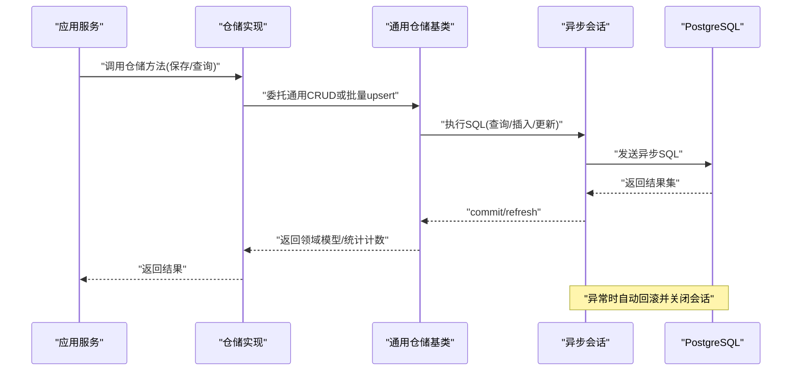

**图表来源**
- [src/shared/infrastructure/db/session.py](file://src/shared/infrastructure/db/session.py#L24-L64)
- [src/shared/infrastructure/base_repository.py](file://src/shared/infrastructure/base_repository.py#L13-L125)
- [src/modules/data_engineering/infrastructure/persistence/repositories/pg_quote_repo.py](file://src/modules/data_engineering/infrastructure/persistence/repositories/pg_quote_repo.py#L1-L173)
- [src/modules/data_engineering/infrastructure/persistence/repositories/pg_finance_repo.py](file://src/modules/data_engineering/infrastructure/persistence/repositories/pg_finance_repo.py#L1-L54)
- [src/modules/data_engineering/infrastructure/persistence/repositories/pg_stock_repo.py](file://src/modules/data_engineering/infrastructure/persistence/repositories/pg_stock_repo.py#L1-L133)
- [src/modules/data_engineering/infrastructure/persistence/repositories/pg_sync_task_repo.py](file://src/modules/data_engineering/infrastructure/persistence/repositories/pg_sync_task_repo.py#L1-L188)

## 详细组件分析

### 异步会话与事务管理
- 会话生命周期
  - 通过依赖注入函数提供异步会话，使用上下文管理确保异常时自动关闭。
  - 对系统异常进行显式回滚，对客户端错误记录警告但不强制回滚（读操作通常无需回滚）。
- 事务边界
  - 每个仓储方法内部的 SQL 执行在一个事务内；批量操作建议拆分为多个小批次以降低锁竞争与内存占用。
  - 提交后对象不过期，便于后续异步操作使用。
- 并发访问
  - 使用连接池预检测与异步 IO，避免阻塞；在高并发场景下建议配合数据库层面的索引与分区策略。

**章节来源**
- [src/shared/infrastructure/db/session.py](file://src/shared/infrastructure/db/session.py#L1-L64)

### 通用仓储基类 BaseRepository
- 能力概览
  - 标准 CRUD：按主键查询、分页列表、创建、更新、删除。
  - 批量 upsert：基于 PostgreSQL 的 ON CONFLICT，支持唯一键冲突处理与排除字段更新。
- 性能特性
  - 分批处理（默认 1000 条/批），避免单次大事务。
  - 使用 returning 或刷新策略保证返回最新数据。
- 错误处理
  - 记录调试/信息/警告日志，便于追踪问题与性能瓶颈。

**章节来源**
- [src/shared/infrastructure/base_repository.py](file://src/shared/infrastructure/base_repository.py#L1-L125)

### 数据库模型与领域模型映射
- ORM 模型
  - 股票基础信息：StockModel
  - 日线行情：StockDailyModel
  - 财务指标：StockFinanceModel
  - 研究会话：ResearchSessionModel
  - 节点执行：NodeExecutionModel
  - LLM调用日志：LLMCallLogModel
  - 外部API调用日志：ExternalAPICallLogModel
- 领域模型
  - 财务指标领域实体：StockFinance（Pydantic，from_attributes）
  - 研究会话实体：ResearchSession（状态管理）
  - 节点执行实体：NodeExecution（执行状态）
  - LLM调用日志DTO：LLMCallLog
  - 外部API调用日志DTO：ExternalAPICallLog
- 映射策略
  - 仓储实现将领域实体序列化为字典，经 ORM 模型入库；查询结果通过模型验证转换为领域实体。
  - 部分查询方法直接构造领域实体，避免额外 ORM 加载。

**章节来源**
- [src/modules/data_engineering/infrastructure/persistence/models/stock_model.py](file://src/modules/data_engineering/infrastructure/persistence/models/stock_model.py#L1-L36)
- [src/modules/data_engineering/infrastructure/persistence/models/daily_bar_model.py](file://src/modules/data_engineering/infrastructure/persistence/models/daily_bar_model.py#L1-L44)
- [src/modules/data_engineering/infrastructure/persistence/models/finance_model.py](file://src/modules/data_engineering/infrastructure/persistence/models/finance_model.py#L1-L117)
- [src/modules/coordinator/infrastructure/persistence/research_session_model.py](file://src/modules/coordinator/infrastructure/persistence/research_session_model.py#L1-L25)
- [src/modules/coordinator/infrastructure/persistence/node_execution_model.py](file://src/modules/coordinator/infrastructure/persistence/node_execution_model.py#L1-L33)
- [src/modules/llm_platform/infrastructure/persistence/models/llm_call_log_model.py](file://src/modules/llm_platform/infrastructure/persistence/models/llm_call_log_model.py#L1-L33)
- [src/shared/infrastructure/persistence/external_api_call_log_model.py](file://src/shared/infrastructure/persistence/external_api_call_log_model.py#L1-L29)
- [src/modules/data_engineering/domain/model/financial_report.py](file://src/modules/data_engineering/domain/model/financial_report.py#L1-L117)

### 仓储类设计与职责

#### StockDailyRepositoryImpl
- 职责
  - 保存日线行情（去重 + upsert），支持批量保存。
  - 按代码与日期范围查询日线，支持最新日线与最新交易日查询。
  - 提供估值分析专用查询（返回 PE/PB/PS/DV/市值等字段）。
- 关键实现要点
  - 去重策略：基于主键组合（third_code, trade_date）保留最后一条。
  - 批量 upsert：使用 PostgreSQL ON CONFLICT DO UPDATE，排除不需要更新的字段。
  - 查询优化：按主键与日期建立索引，使用 order_by asc/desc 控制排序。
- 使用建议
  - 导入时先去重再批量入库，避免重复写入。
  - 查询日期范围时尽量限定范围，配合索引提升性能。

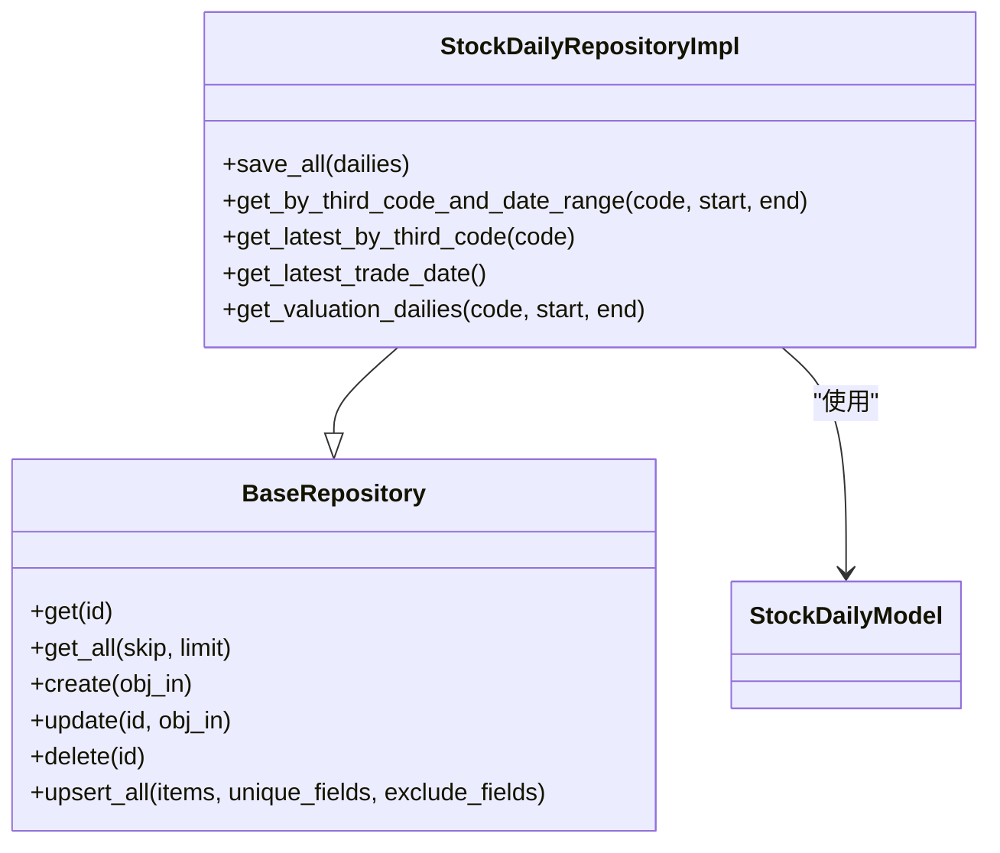

**图表来源**
- [src/shared/infrastructure/base_repository.py](file://src/shared/infrastructure/base_repository.py#L13-L125)
- [src/modules/data_engineering/infrastructure/persistence/repositories/pg_quote_repo.py](file://src/modules/data_engineering/infrastructure/persistence/repositories/pg_quote_repo.py#L1-L173)
- [src/modules/data_engineering/infrastructure/persistence/models/daily_bar_model.py](file://src/modules/data_engineering/infrastructure/persistence/models/daily_bar_model.py#L1-L44)

**章节来源**
- [src/modules/data_engineering/infrastructure/persistence/repositories/pg_quote_repo.py](file://src/modules/data_engineering/infrastructure/persistence/repositories/pg_quote_repo.py#L1-L173)

#### StockFinanceRepositoryImpl
- 职责
  - 保存财务指标（去重 + upsert），支持批量保存。
  - 按第三方代码查询最近 N 期财务记录。
- 关键实现要点
  - 去重策略：基于三元主键（third_code, ann_date, end_date）保留最后一条。
  - 批量 upsert：复用通用基类方法，简化实现。
  - 查询优化：按 end_date 降序返回，满足"最近"场景。
- 使用建议
  - 导入前先按主键去重，避免重复写入。
  - 批量导入时注意字段一致性与缺失值处理。

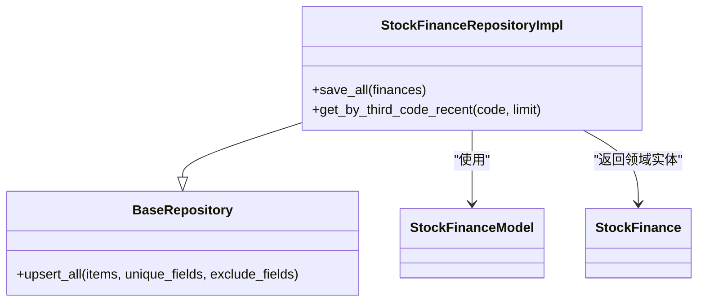

**图表来源**
- [src/shared/infrastructure/base_repository.py](file://src/shared/infrastructure/base_repository.py#L75-L125)
- [src/modules/data_engineering/infrastructure/persistence/repositories/pg_finance_repo.py](file://src/modules/data_engineering/infrastructure/persistence/repositories/pg_finance_repo.py#L1-L54)
- [src/modules/data_engineering/infrastructure/persistence/models/finance_model.py](file://src/modules/data_engineering/infrastructure/persistence/models/finance_model.py#L1-L117)
- [src/modules/data_engineering/domain/model/financial_report.py](file://src/modules/data_engineering/domain/model/financial_report.py#L1-L117)

**章节来源**
- [src/modules/data_engineering/infrastructure/persistence/repositories/pg_finance_repo.py](file://src/modules/data_engineering/infrastructure/persistence/repositories/pg_finance_repo.py#L1-L54)

#### StockRepositoryImpl
- 职责
  - 股票基础信息的保存与批量保存（Upsert）。
  - 按符号/第三方代码查询股票信息。
  - 缺失财务数据股票识别与批量更新最后同步时间。
- 关键实现要点
  - Upsert 使用 ON CONFLICT DO UPDATE，排除 id 与创建时间等字段。
  - 子查询识别缺失报告期股票，结合阈值日期与限制数量。
- 使用建议
  - 批量保存时按批次处理，避免单次过大事务。
  - 查询缺失财务数据股票时，合理设置阈值日期与限制数量。

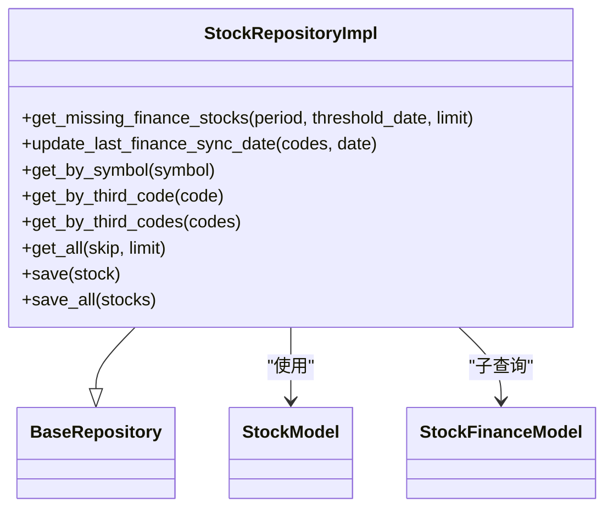

**图表来源**
- [src/shared/infrastructure/base_repository.py](file://src/shared/infrastructure/base_repository.py#L13-L125)
- [src/modules/data_engineering/infrastructure/persistence/repositories/pg_stock_repo.py](file://src/modules/data_engineering/infrastructure/persistence/repositories/pg_stock_repo.py#L1-L133)
- [src/modules/data_engineering/infrastructure/persistence/models/stock_model.py](file://src/modules/data_engineering/infrastructure/persistence/models/stock_model.py#L1-L36)
- [src/modules/data_engineering/infrastructure/persistence/models/finance_model.py](file://src/modules/data_engineering/infrastructure/persistence/models/finance_model.py#L1-L117)

**章节来源**
- [src/modules/data_engineering/infrastructure/persistence/repositories/pg_stock_repo.py](file://src/modules/data_engineering/infrastructure/persistence/repositories/pg_stock_repo.py#L1-L133)

#### SyncTaskRepositoryImpl
- 职责
  - 同步任务与失败记录的持久化，支持断点续跑与失败重试。
  - 提供任务状态查询、失败记录查询与解决标记。
- 关键实现要点
  - 将枚举值转换为存储值，查询时再转回领域实体。
  - 失败记录查询支持未解决且可重试条件过滤。
- 使用建议
  - 任务状态变更与失败记录更新需成对提交，保持一致性。
  - 解决失败记录后及时清理重试计数与时间戳。

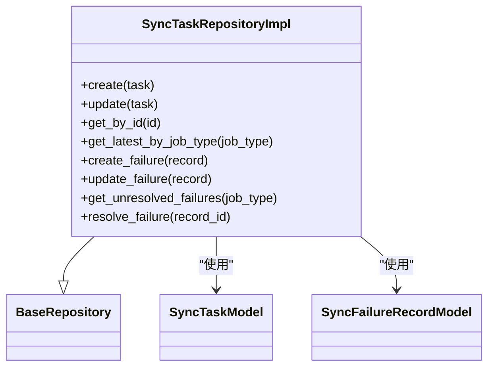

**图表来源**
- [src/shared/infrastructure/base_repository.py](file://src/shared/infrastructure/base_repository.py#L13-L125)
- [src/modules/data_engineering/infrastructure/persistence/repositories/pg_sync_task_repo.py](file://src/modules/data_engineering/infrastructure/persistence/repositories/pg_sync_task_repo.py#L1-L188)
- [src/modules/data_engineering/infrastructure/persistence/models/sync_task_model.py](file://src/modules/data_engineering/infrastructure/persistence/models/sync_task_model.py#L1-L200)
- [src/modules/data_engineering/infrastructure/persistence/models/sync_failure_model.py](file://src/modules/data_engineering/infrastructure/persistence/models/sync_failure_model.py#L1-L200)

**章节来源**
- [src/modules/data_engineering/infrastructure/persistence/repositories/pg_sync_task_repo.py](file://src/modules/data_engineering/infrastructure/persistence/repositories/pg_sync_task_repo.py#L1-L188)

#### PgResearchSessionRepository
- 职责
  - 研究会话的创建、更新与查询。
  - 节点执行记录的保存与查询。
  - 支持按股票代码、创建时间范围等条件筛选会话。
- 关键实现要点
  - 研究会话状态管理：running/completed/partial/failed。
  - 节点执行跟踪：支持成功、失败、跳过三种状态。
  - 外键约束：节点执行记录级联删除关联的会话。
- 使用建议
  - 会话状态转换需遵循业务规则，确保状态一致性。
  - 节点执行记录应包含完整的执行上下文信息。

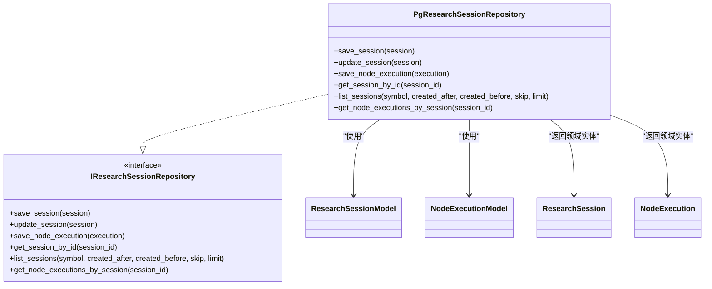

**图表来源**
- [src/modules/coordinator/infrastructure/persistence/research_session_repository.py](file://src/modules/coordinator/infrastructure/persistence/research_session_repository.py#L81-L145)
- [src/modules/coordinator/infrastructure/persistence/research_session_model.py](file://src/modules/coordinator/infrastructure/persistence/research_session_model.py#L11-L25)
- [src/modules/coordinator/infrastructure/persistence/node_execution_model.py](file://src/modules/coordinator/infrastructure/persistence/node_execution_model.py#L11-L33)

**章节来源**
- [src/modules/coordinator/infrastructure/persistence/research_session_repository.py](file://src/modules/coordinator/infrastructure/persistence/research_session_repository.py#L1-L145)

#### PgLLMCallLogRepository
- 职责
  - LLM调用日志的保存与查询。
  - 支持按会话ID查询完整的调用历史。
- 关键实现要点
  - 完整的调用审计：包含prompt、completion、token消耗、延迟等。
  - 支持会话关联：可追踪特定会话内的所有LLM交互。
  - 状态管理：区分成功和失败的调用记录。
- 使用建议
  - 调用日志应包含足够的上下文信息以便审计。
  - 对敏感信息进行脱敏处理后再记录。

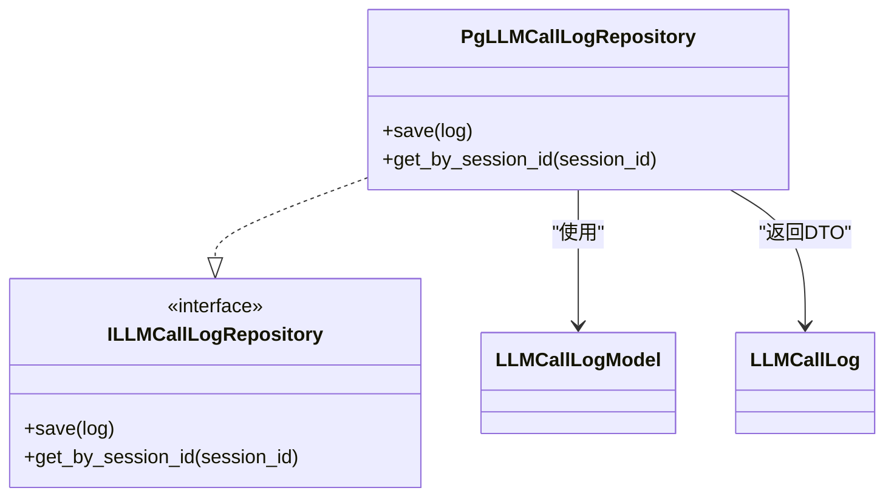

**图表来源**
- [src/modules/llm_platform/infrastructure/persistence/repositories/llm_call_log_repository.py](file://src/modules/llm_platform/infrastructure/persistence/repositories/llm_call_log_repository.py#L59-L76)
- [src/modules/llm_platform/infrastructure/persistence/models/llm_call_log_model.py](file://src/modules/llm_platform/infrastructure/persistence/models/llm_call_log_model.py#L11-L33)

**章节来源**
- [src/modules/llm_platform/infrastructure/persistence/repositories/llm_call_log_repository.py](file://src/modules/llm_platform/infrastructure/persistence/repositories/llm_call_log_repository.py#L1-L76)

#### PgExternalAPICallLogRepository
- 职责
  - 外部API调用日志的保存与查询。
  - 支持按会话ID查询完整的API调用历史。
- 关键实现要点
  - 统一的外部API调用日志格式，支持多服务集成。
  - 包含请求参数、响应数据、状态码等完整信息。
  - 支持服务名和服务操作的分类统计。
- 使用建议
  - API调用日志应标准化格式，便于跨模块复用。
  - 对敏感参数进行脱敏处理。

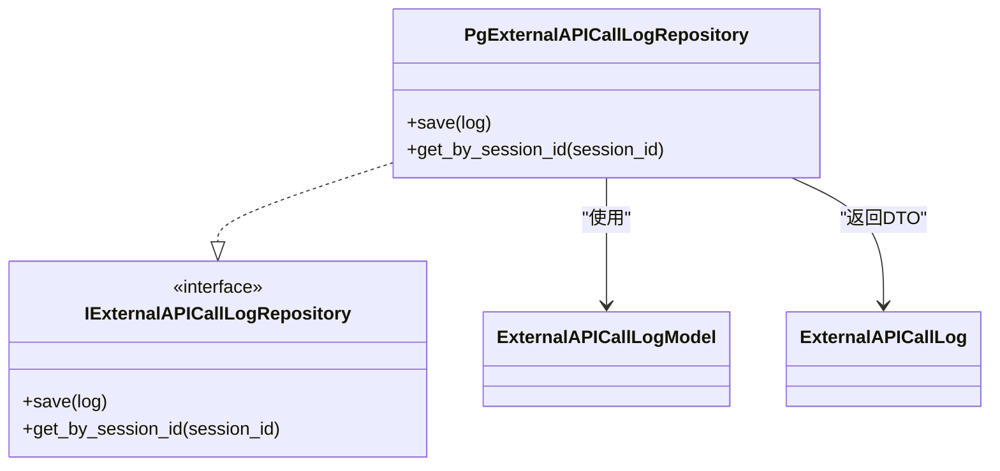

**图表来源**
- [src/shared/infrastructure/persistence/external_api_call_log_repository.py](file://src/shared/infrastructure/persistence/external_api_call_log_repository.py#L47-L64)
- [src/shared/infrastructure/persistence/external_api_call_log_model.py](file://src/shared/infrastructure/persistence/external_api_call_log_model.py#L13-L29)

**章节来源**
- [src/shared/infrastructure/persistence/external_api_call_log_repository.py](file://src/shared/infrastructure/persistence/external_api_call_log_repository.py#L1-L64)

### 查询流程与优化策略

#### 批量 Upsert 流程
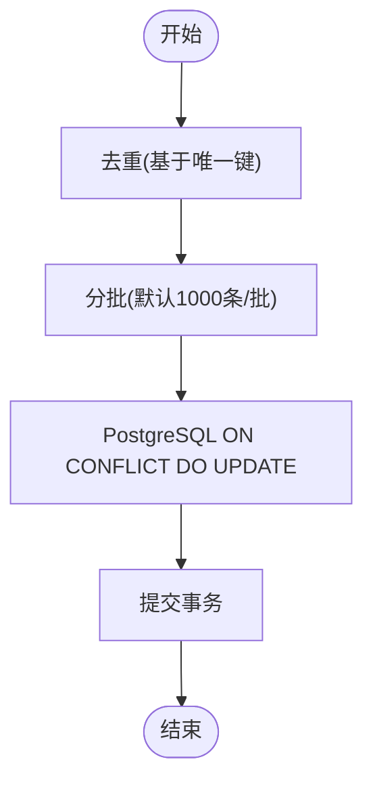

**图表来源**
- [src/shared/infrastructure/base_repository.py](file://src/shared/infrastructure/base_repository.py#L75-L125)
- [src/modules/data_engineering/infrastructure/persistence/repositories/pg_quote_repo.py](file://src/modules/data_engineering/infrastructure/persistence/repositories/pg_quote_repo.py#L15-L48)
- [src/modules/data_engineering/infrastructure/persistence/repositories/pg_finance_repo.py](file://src/modules/data_engineering/infrastructure/persistence/repositories/pg_finance_repo.py#L19-L39)
- [src/modules/data_engineering/infrastructure/persistence/repositories/pg_stock_repo.py](file://src/modules/data_engineering/infrastructure/persistence/repositories/pg_stock_repo.py#L107-L132)

#### 日期范围查询流程
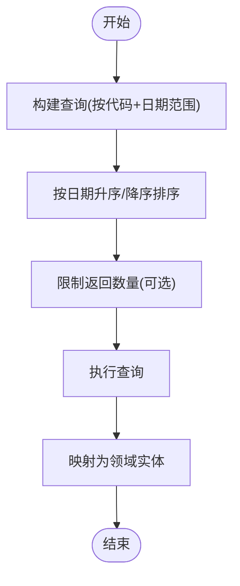

**图表来源**
- [src/modules/data_engineering/infrastructure/persistence/repositories/pg_quote_repo.py](file://src/modules/data_engineering/infrastructure/persistence/repositories/pg_quote_repo.py#L50-L82)
- [src/modules/data_engineering/infrastructure/persistence/repositories/pg_quote_repo.py](file://src/modules/data_engineering/infrastructure/persistence/repositories/pg_quote_repo.py#L121-L172)

#### 审计日志查询流程
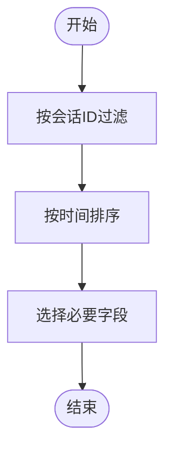

**图表来源**
- [src/modules/llm_platform/infrastructure/persistence/repositories/llm_call_log_repository.py](file://src/modules/llm_platform/infrastructure/persistence/repositories/llm_call_log_repository.py#L68-L75)
- [src/shared/infrastructure/persistence/external_api_call_log_repository.py](file://src/shared/infrastructure/persistence/external_api_call_log_repository.py#L56-L63)

## 依赖分析
- 配置与连接
  - 应用配置统一生成异步 PostgreSQL 连接字符串，Alembic 迁移读取同一配置。
- 会话与仓储
  - 仓储实现依赖通用基类与异步会话；会话工厂负责连接池与回滚/关闭。
- 模型与实体
  - 仓储实现通过 ORM 模型与领域实体双向转换，确保数据一致性。
- 审计模块依赖
  - 协调器模块依赖共享的ORM基类，LLM平台和共享模块各自维护独立的仓储实现。

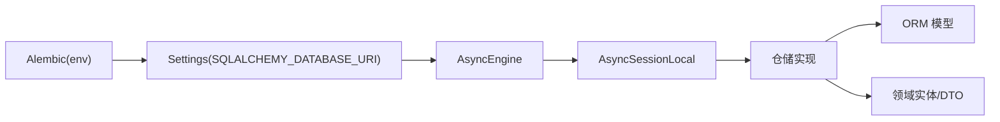

**图表来源**
- [src/shared/config.py](file://src/shared/config.py#L34-L58)
- [alembic/env.py](file://alembic/env.py#L34-L36)
- [src/shared/infrastructure/db/session.py](file://src/shared/infrastructure/db/session.py#L8-L22)
- [src/shared/infrastructure/base_repository.py](file://src/shared/infrastructure/base_repository.py#L13-L21)

**章节来源**
- [src/shared/config.py](file://src/shared/config.py#L1-L68)
- [alembic/env.py](file://alembic/env.py#L1-L94)
- [src/shared/infrastructure/db/session.py](file://src/shared/infrastructure/db/session.py#L1-L64)
- [src/shared/infrastructure/base_repository.py](file://src/shared/infrastructure/base_repository.py#L1-L125)

## 性能考虑
- 连接池与预检
  - 启用连接池预检测，降低无效连接带来的开销。
- 批量处理
  - upsert 与批量保存默认分批（1000 条/批），避免单次事务过大。
- 索引与查询
  - 主键与常用过滤字段（如 third_code、trade_date、end_date、session_id）建立索引，提升查询效率。
- 事务粒度
  - 将长事务拆分为多个短事务，减少锁竞争与内存占用。
- 日志与监控
  - 利用仓储日志定位慢查询与异常，结合数据库慢查询日志优化。
- 审计日志优化
  - 审计日志表使用JSONB存储结构化数据，支持灵活的查询和扩展。

## 故障排查指南
- 会话异常处理
  - 客户端错误（4xx）：记录警告，不强制回滚（读操作通常无需回滚）。
  - 系统异常：记录错误并显式回滚，确保会话安全关闭。
- 常见问题
  - 重复主键冲突：检查去重逻辑与唯一键组合。
  - 批量导入失败：确认字段映射与排除字段配置。
  - 查询性能差：检查索引与查询条件，必要时调整分页与排序。
  - 审计日志丢失：检查会话ID关联和外键约束。
- 排查步骤
  - 查看仓储日志与数据库慢查询日志。
  - 使用 Alembic 迁移核对表结构与索引。
  - 在测试环境中复现问题并定位具体仓储方法。

**章节来源**
- [src/shared/infrastructure/db/session.py](file://src/shared/infrastructure/db/session.py#L36-L63)

## 结论
该持久化层通过异步 ORM、通用仓储基类与清晰的领域/模型映射，实现了高效、可维护的数据访问层。新增的协调器会话跟踪、LLM调用审计和外部API调用日志等功能，进一步完善了系统的可观测性和可追溯性。结合批量 upsert、索引与事务优化策略，能够支撑高频数据同步、复杂查询场景和完整的执行链路审计。建议在实际使用中遵循分批处理、索引优化与日志监控的最佳实践，持续迭代以适配业务增长。

## 附录

### 使用示例与最佳实践
- 保存日线数据
  - 步骤：去重 → 分批 → upsert → 提交。
  - 参考路径：[保存日线实现](file://src/modules/data_engineering/infrastructure/persistence/repositories/pg_quote_repo.py#L15-L48)
- 保存财务数据
  - 步骤：去重 → upsert → 提交。
  - 参考路径：[保存财务实现](file://src/modules/data_engineering/infrastructure/persistence/repositories/pg_finance_repo.py#L19-L39)
- 批量保存股票信息
  - 步骤：分批 → upsert → 提交。
  - 参考路径：[批量保存股票实现](file://src/modules/data_engineering/infrastructure/persistence/repositories/pg_stock_repo.py#L107-L132)
- 保存研究会话
  - 步骤：创建会话 → 更新状态 → 记录节点执行。
  - 参考路径：[研究会话仓储实现](file://src/modules/coordinator/infrastructure/persistence/research_session_repository.py#L87-L102)
- 保存LLM调用日志
  - 步骤：创建日志DTO → 保存到数据库 → 查询会话历史。
  - 参考路径：[LLM调用日志仓储实现](file://src/modules/llm_platform/infrastructure/persistence/repositories/llm_call_log_repository.py#L63-L75)
- 保存外部API调用日志
  - 步骤：创建日志DTO → 保存到数据库 → 查询会话历史。
  - 参考路径：[外部API调用日志仓储实现](file://src/shared/infrastructure/persistence/external_api_call_log_repository.py#L51-L63)

### 数据模型关系图
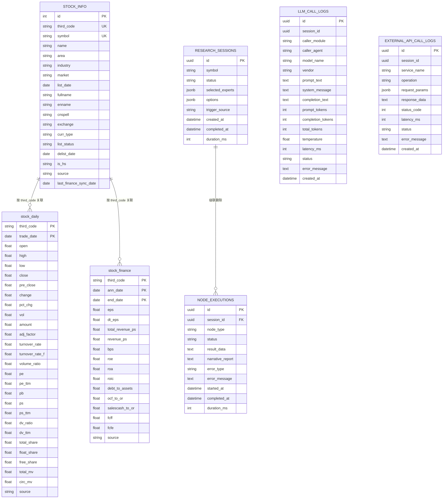

**图表来源**
- [src/modules/data_engineering/infrastructure/persistence/models/stock_model.py](file://src/modules/data_engineering/infrastructure/persistence/models/stock_model.py#L1-L36)
- [src/modules/data_engineering/infrastructure/persistence/models/daily_bar_model.py](file://src/modules/data_engineering/infrastructure/persistence/models/daily_bar_model.py#L1-L44)
- [src/modules/data_engineering/infrastructure/persistence/models/finance_model.py](file://src/modules/data_engineering/infrastructure/persistence/models/finance_model.py#L1-L117)
- [src/modules/coordinator/infrastructure/persistence/research_session_model.py](file://src/modules/coordinator/infrastructure/persistence/research_session_model.py#L11-L25)
- [src/modules/coordinator/infrastructure/persistence/node_execution_model.py](file://src/modules/coordinator/infrastructure/persistence/node_execution_model.py#L11-L33)
- [src/modules/llm_platform/infrastructure/persistence/models/llm_call_log_model.py](file://src/modules/llm_platform/infrastructure/persistence/models/llm_call_log_model.py#L11-L33)
- [src/shared/infrastructure/persistence/external_api_call_log_model.py](file://src/shared/infrastructure/persistence/external_api_call_log_model.py#L13-L29)