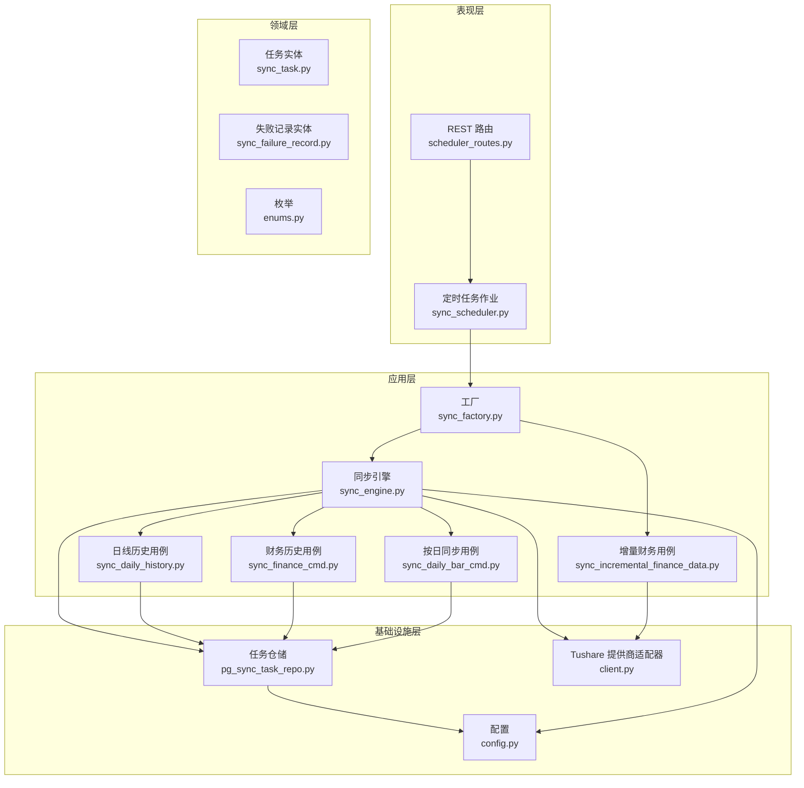
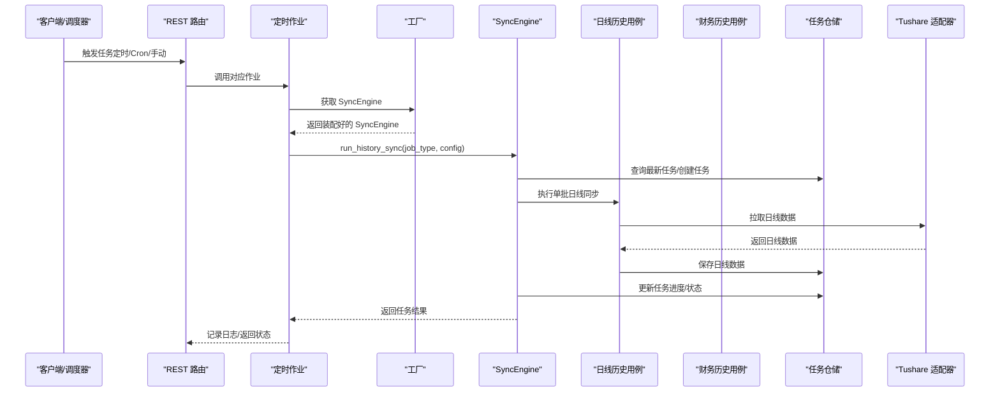
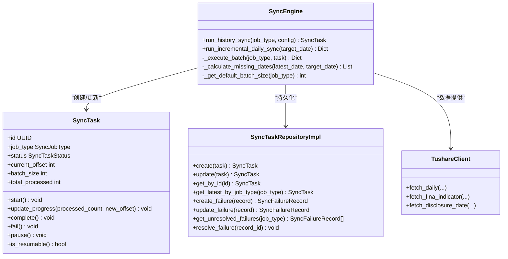
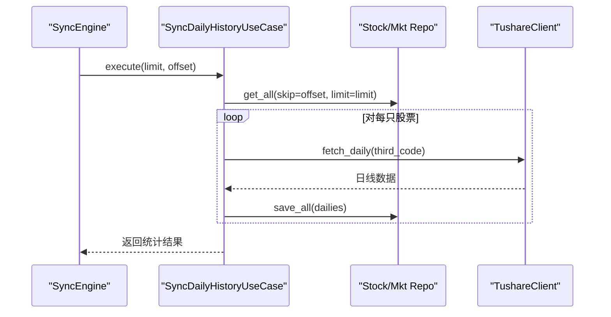
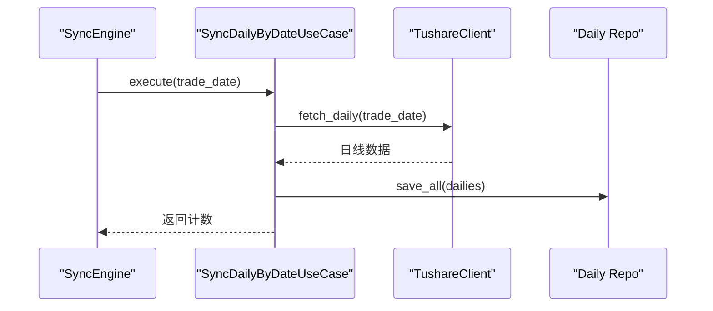
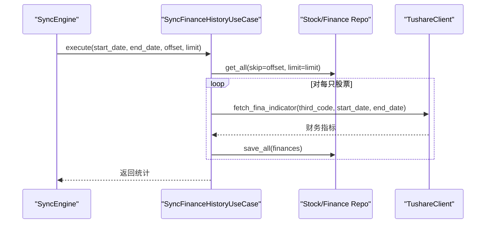
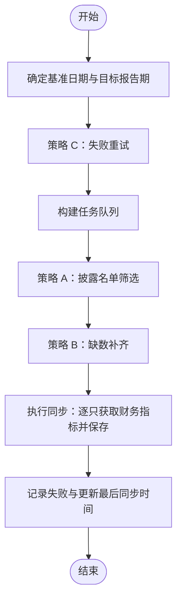
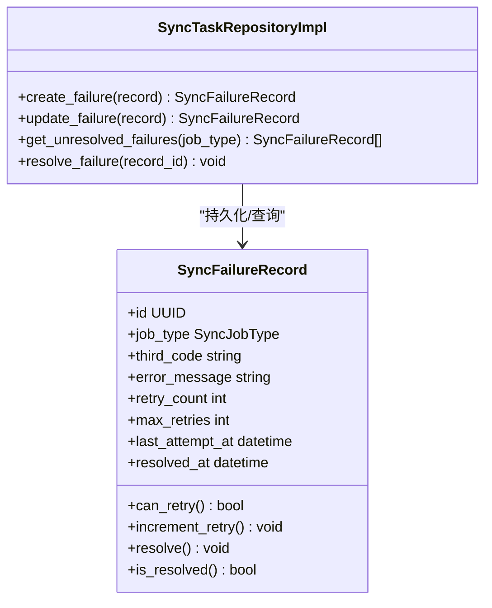
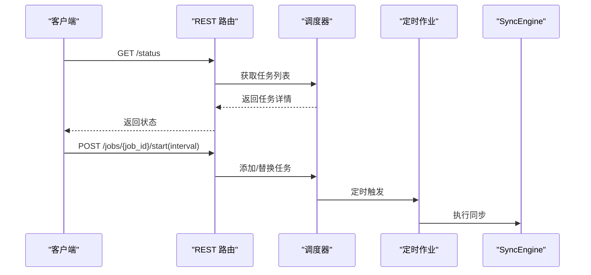
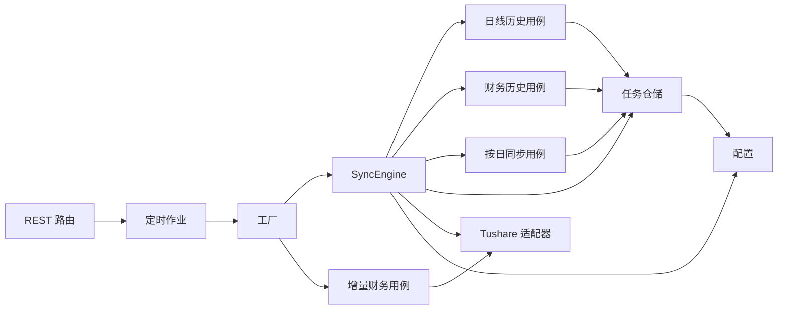

# 数据同步引擎

<cite>
**本文引用的文件**
- [src/modules/data_engineering/application/commands/sync_engine.py](file://src/modules/data_engineering/application/commands/sync_engine.py)
- [src/modules/data_engineering/application/commands/sync_daily_history.py](file://src/modules/data_engineering/application/commands/sync_daily_history.py)
- [src/modules/data_engineering/application/commands/sync_daily_bar_cmd.py](file://src/modules/data_engineering/application/commands/sync_daily_bar_cmd.py)
- [src/modules/data_engineering/application/commands/sync_finance_cmd.py](file://src/modules/data_engineering/application/commands/sync_finance_cmd.py)
- [src/modules/data_engineering/application/commands/sync_incremental_finance_data.py](file://src/modules/data_engineering/application/commands/sync_incremental_finance_data.py)
- [src/modules/data_engineering/application/factories/sync_factory.py](file://src/modules/data_engineering/application/factories/sync_factory.py)
- [src/modules/data_engineering/domain/model/sync_task.py](file://src/modules/data_engineering/domain/model/sync_task.py)
- [src/modules/data_engineering/domain/model/sync_failure_record.py](file://src/modules/data_engineering/domain/model/sync_failure_record.py)
- [src/modules/data_engineering/domain/model/enums.py](file://src/modules/data_engineering/domain/model/enums.py)
- [src/modules/data_engineering/infrastructure/config.py](file://src/modules/data_engineering/infrastructure/config.py)
- [src/modules/data_engineering/infrastructure/external_apis/tushare/client.py](file://src/modules/data_engineering/infrastructure/external_apis/tushare/client.py)
- [src/modules/data_engineering/infrastructure/persistence/repositories/pg_sync_task_repo.py](file://src/modules/data_engineering/infrastructure/persistence/repositories/pg_sync_task_repo.py)
- [src/modules/data_engineering/presentation/jobs/sync_scheduler.py](file://src/modules/data_engineering/presentation/jobs/sync_scheduler.py)
- [src/modules/data_engineering/presentation/rest/scheduler_routes.py](file://src/modules/data_engineering/presentation/rest/scheduler_routes.py)
- [tests/data_engineering/application/test_sync_engine.py](file://tests/data_engineering/application/test_sync_engine.py)
</cite>

## 目录
1. [简介](#简介)
2. [项目结构](#项目结构)
3. [核心组件](#核心组件)
4. [架构总览](#架构总览)
5. [详细组件分析](#详细组件分析)
6. [依赖关系分析](#依赖关系分析)
7. [性能考量](#性能考量)
8. [故障排查指南](#故障排查指南)
9. [结论](#结论)
10. [附录](#附录)

## 简介
本技术文档围绕数据同步引擎展开，系统性阐述 SyncEngine 的核心工作原理，包括同步任务的调度机制、并发控制与状态管理；深入解析各类同步命令的实现，涵盖日线数据同步、财务数据同步与增量财务数据同步；明确全量同步与增量同步的差异与适用场景；详述错误处理与重试机制、失败记录与恢复策略；解释任务状态跟踪与监控；并提供同步配置的最佳实践与性能优化建议。

## 项目结构
数据同步引擎位于数据工程模块（data_engineering），采用“应用层-领域层-基础设施层”的分层架构，配合工厂模式进行依赖注入与会话管理，通过 REST API 与定时任务调度器对外暴露能力。

图表来源
- [src/modules/data_engineering/presentation/rest/scheduler_routes.py](file://src/modules/data_engineering/presentation/rest/scheduler_routes.py#L1-L233)
- [src/modules/data_engineering/presentation/jobs/sync_scheduler.py](file://src/modules/data_engineering/presentation/jobs/sync_scheduler.py#L1-L128)
- [src/modules/data_engineering/application/factories/sync_factory.py](file://src/modules/data_engineering/application/factories/sync_factory.py#L1-L115)
- [src/modules/data_engineering/application/commands/sync_engine.py](file://src/modules/data_engineering/application/commands/sync_engine.py#L1-L280)
- [src/modules/data_engineering/application/commands/sync_daily_history.py](file://src/modules/data_engineering/application/commands/sync_daily_history.py#L1-L73)
- [src/modules/data_engineering/application/commands/sync_daily_bar_cmd.py](file://src/modules/data_engineering/application/commands/sync_daily_bar_cmd.py#L1-L33)
- [src/modules/data_engineering/application/commands/sync_finance_cmd.py](file://src/modules/data_engineering/application/commands/sync_finance_cmd.py#L1-L56)
- [src/modules/data_engineering/application/commands/sync_incremental_finance_data.py](file://src/modules/data_engineering/application/commands/sync_incremental_finance_data.py#L1-L205)
- [src/modules/data_engineering/infrastructure/persistence/repositories/pg_sync_task_repo.py](file://src/modules/data_engineering/infrastructure/persistence/repositories/pg_sync_task_repo.py#L1-L188)
- [src/modules/data_engineering/infrastructure/external_apis/tushare/client.py](file://src/modules/data_engineering/infrastructure/external_apis/tushare/client.py#L1-L252)
- [src/modules/data_engineering/infrastructure/config.py](file://src/modules/data_engineering/infrastructure/config.py#L1-L28)

章节来源
- [src/modules/data_engineering/presentation/rest/scheduler_routes.py](file://src/modules/data_engineering/presentation/rest/scheduler_routes.py#L1-L233)
- [src/modules/data_engineering/presentation/jobs/sync_scheduler.py](file://src/modules/data_engineering/presentation/jobs/sync_scheduler.py#L1-L128)
- [src/modules/data_engineering/application/factories/sync_factory.py](file://src/modules/data_engineering/application/factories/sync_factory.py#L1-L115)

## 核心组件
- 同步引擎（SyncEngine）：统一编排历史全量与增量同步，负责任务生命周期、进度与状态管理、批次执行与断点续跑。
- 用例（Use Cases）：封装具体同步逻辑，如日线历史、财务历史、按日同步、增量财务同步。
- 工厂（SyncUseCaseFactory）：集中装配依赖与会话管理，隔离表现层与基础设施层。
- 任务实体与失败记录：追踪任务状态、进度与失败重试。
- 配置（DataEngineeringConfig）：集中管理 Tushare 令牌、限速间隔、批大小、起始日期、缺失阈值与最大重试次数。
- Tushare 适配器：统一限速与数据拉取，保证第三方接口调用合规。
- 任务仓储：基于 PostgreSQL 的任务与失败记录持久化，支持断点续跑与失败重试。

章节来源
- [src/modules/data_engineering/application/commands/sync_engine.py](file://src/modules/data_engineering/application/commands/sync_engine.py#L1-L280)
- [src/modules/data_engineering/application/commands/sync_daily_history.py](file://src/modules/data_engineering/application/commands/sync_daily_history.py#L1-L73)
- [src/modules/data_engineering/application/commands/sync_daily_bar_cmd.py](file://src/modules/data_engineering/application/commands/sync_daily_bar_cmd.py#L1-L33)
- [src/modules/data_engineering/application/commands/sync_finance_cmd.py](file://src/modules/data_engineering/application/commands/sync_finance_cmd.py#L1-L56)
- [src/modules/data_engineering/application/commands/sync_incremental_finance_data.py](file://src/modules/data_engineering/application/commands/sync_incremental_finance_data.py#L1-L205)
- [src/modules/data_engineering/application/factories/sync_factory.py](file://src/modules/data_engineering/application/factories/sync_factory.py#L1-L115)
- [src/modules/data_engineering/domain/model/sync_task.py](file://src/modules/data_engineering/domain/model/sync_task.py#L1-L64)
- [src/modules/data_engineering/domain/model/sync_failure_record.py](file://src/modules/data_engineering/domain/model/sync_failure_record.py#L1-L42)
- [src/modules/data_engineering/infrastructure/config.py](file://src/modules/data_engineering/infrastructure/config.py#L1-L28)
- [src/modules/data_engineering/infrastructure/external_apis/tushare/client.py](file://src/modules/data_engineering/infrastructure/external_apis/tushare/client.py#L1-L252)
- [src/modules/data_engineering/infrastructure/persistence/repositories/pg_sync_task_repo.py](file://src/modules/data_engineering/infrastructure/persistence/repositories/pg_sync_task_repo.py#L1-L188)

## 架构总览
同步引擎通过工厂注入仓储与提供商，应用层用例负责业务流程，基础设施层负责数据持久化与外部接口访问。调度器与 REST 路由提供任务触发入口，支持定时与手动触发。

图表来源
- [src/modules/data_engineering/presentation/rest/scheduler_routes.py](file://src/modules/data_engineering/presentation/rest/scheduler_routes.py#L1-L233)
- [src/modules/data_engineering/presentation/jobs/sync_scheduler.py](file://src/modules/data_engineering/presentation/jobs/sync_scheduler.py#L1-L128)
- [src/modules/data_engineering/application/factories/sync_factory.py](file://src/modules/data_engineering/application/factories/sync_factory.py#L1-L115)
- [src/modules/data_engineering/application/commands/sync_engine.py](file://src/modules/data_engineering/application/commands/sync_engine.py#L1-L280)
- [src/modules/data_engineering/application/commands/sync_daily_history.py](file://src/modules/data_engineering/application/commands/sync_daily_history.py#L1-L73)
- [src/modules/data_engineering/infrastructure/external_apis/tushare/client.py](file://src/modules/data_engineering/infrastructure/external_apis/tushare/client.py#L1-L252)
- [src/modules/data_engineering/infrastructure/persistence/repositories/pg_sync_task_repo.py](file://src/modules/data_engineering/infrastructure/persistence/repositories/pg_sync_task_repo.py#L1-L188)

## 详细组件分析

### 同步引擎（SyncEngine）
- 职责
  - 历史全量同步：支持同类型任务互斥、断点续跑、自动分批循环、进度持久化。
  - 增量日线同步：检测数据库最新交易日与目标日期的缺口，逐日补偿同步，单日失败不影响整体。
  - 增量财务同步：策略 A（披露名单驱动）、策略 B（缺数补齐）、策略 C（失败重试）协同。
- 关键机制
  - 任务状态机：PENDING → RUNNING → COMPLETED/FAILED/PAUSED。
  - 批次执行：根据 batch_size 与 offset 控制分批，直至某批返回 0 结束。
  - 限速与并发：统一由 TushareClient 的限速锁与最小间隔保障，应用层不再自行加锁。
- 错误处理
  - 全局异常捕获并标记任务失败，单只股票/单日失败不中断整批。
  - 增量财务同步中对失败记录入库，支持后续重试与人工干预。

图表来源
- [src/modules/data_engineering/application/commands/sync_engine.py](file://src/modules/data_engineering/application/commands/sync_engine.py#L1-L280)
- [src/modules/data_engineering/domain/model/sync_task.py](file://src/modules/data_engineering/domain/model/sync_task.py#L1-L64)
- [src/modules/data_engineering/infrastructure/persistence/repositories/pg_sync_task_repo.py](file://src/modules/data_engineering/infrastructure/persistence/repositories/pg_sync_task_repo.py#L1-L188)
- [src/modules/data_engineering/infrastructure/external_apis/tushare/client.py](file://src/modules/data_engineering/infrastructure/external_apis/tushare/client.py#L1-L252)

章节来源
- [src/modules/data_engineering/application/commands/sync_engine.py](file://src/modules/data_engineering/application/commands/sync_engine.py#L1-L280)
- [src/modules/data_engineering/domain/model/sync_task.py](file://src/modules/data_engineering/domain/model/sync_task.py#L1-L64)
- [src/modules/data_engineering/infrastructure/persistence/repositories/pg_sync_task_repo.py](file://src/modules/data_engineering/infrastructure/persistence/repositories/pg_sync_task_repo.py#L1-L188)

### 日线历史同步（sync_daily_history）
- 流程
  - 用例按 offset/limit 获取股票集合，逐只拉取历史日线数据，保存至仓库。
  - 单只失败不中断，累计统计成功股票数与总行数。
- 并发与限速
  - 应用层串行处理，限速由 TushareClient 统一保障，避免应用层重复加锁。

图表来源
- [src/modules/data_engineering/application/commands/sync_daily_history.py](file://src/modules/data_engineering/application/commands/sync_daily_history.py#L1-L73)
- [src/modules/data_engineering/infrastructure/external_apis/tushare/client.py](file://src/modules/data_engineering/infrastructure/external_apis/tushare/client.py#L1-L252)

章节来源
- [src/modules/data_engineering/application/commands/sync_daily_history.py](file://src/modules/data_engineering/application/commands/sync_daily_history.py#L1-L73)

### 日线按日同步（sync_daily_bar_cmd）
- 流程
  - 指定 trade_date 拉取当日所有股票的日线数据，保存入库。
  - 无数据时返回空结果，不抛异常。

图表来源
- [src/modules/data_engineering/application/commands/sync_daily_bar_cmd.py](file://src/modules/data_engineering/application/commands/sync_daily_bar_cmd.py#L1-L33)
- [src/modules/data_engineering/infrastructure/external_apis/tushare/client.py](file://src/modules/data_engineering/infrastructure/external_apis/tushare/client.py#L1-L252)

章节来源
- [src/modules/data_engineering/application/commands/sync_daily_bar_cmd.py](file://src/modules/data_engineering/application/commands/sync_daily_bar_cmd.py#L1-L33)

### 财务历史同步（sync_finance_cmd）
- 流程
  - 以 start_date/end_date 为范围，按批遍历股票，拉取财务指标并保存。
  - 严格遵守 Tushare 速率限制，避免超限。
- 参数
  - offset/limit 控制分批；start_date/end_date 控制时间窗口。

图表来源
- [src/modules/data_engineering/application/commands/sync_finance_cmd.py](file://src/modules/data_engineering/application/commands/sync_finance_cmd.py#L1-L56)
- [src/modules/data_engineering/infrastructure/external_apis/tushare/client.py](file://src/modules/data_engineering/infrastructure/external_apis/tushare/client.py#L1-L252)

章节来源
- [src/modules/data_engineering/application/commands/sync_finance_cmd.py](file://src/modules/data_engineering/application/commands/sync_finance_cmd.py#L1-L56)

### 增量财务同步（sync_incremental_finance_data）
- 策略
  - 策略 C（前置）：失败重试，读取未解决失败记录并尝试重同步。
  - 策略 A（高优）：依据披露计划筛选目标报告期的股票。
  - 策略 B（低优）：缺数补齐，查询目标报告期缺失的股票。
- 重试与失败记录
  - 失败时写入失败记录，包含最大重试次数与当前重试次数；成功后标记解决。
- 目标报告期计算
  - 根据当前日期推导目标报告期末（年报/一季报/中报/三季报）。

图表来源
- [src/modules/data_engineering/application/commands/sync_incremental_finance_data.py](file://src/modules/data_engineering/application/commands/sync_incremental_finance_data.py#L1-L205)

章节来源
- [src/modules/data_engineering/application/commands/sync_incremental_finance_data.py](file://src/modules/data_engineering/application/commands/sync_incremental_finance_data.py#L1-L205)

### 同步策略设计：全量与增量
- 全量同步
  - 适用：首次导入、数据回填、修复历史。
  - 特点：按批处理，断点续跑，进度持久化，同类型任务互斥。
- 增量同步
  - 适用：日常维护、快速补齐遗漏。
  - 特点：日线按日补偿，财务按披露与缺数策略推进，失败记录与重试保障。

章节来源
- [src/modules/data_engineering/application/commands/sync_engine.py](file://src/modules/data_engineering/application/commands/sync_engine.py#L1-L280)
- [src/modules/data_engineering/application/commands/sync_daily_history.py](file://src/modules/data_engineering/application/commands/sync_daily_history.py#L1-L73)
- [src/modules/data_engineering/application/commands/sync_daily_bar_cmd.py](file://src/modules/data_engineering/application/commands/sync_daily_bar_cmd.py#L1-L33)
- [src/modules/data_engineering/application/commands/sync_finance_cmd.py](file://src/modules/data_engineering/application/commands/sync_finance_cmd.py#L1-L56)
- [src/modules/data_engineering/application/commands/sync_incremental_finance_data.py](file://src/modules/data_engineering/application/commands/sync_incremental_finance_data.py#L1-L205)

### 错误处理与重试机制
- 失败记录
  - 用例在失败时创建失败记录，包含 job_type、third_code、错误信息、重试次数与最大重试次数。
  - 仓储提供创建、更新、查询未解决失败记录与解决失败的能力。
- 重试策略
  - 增量财务同步优先执行失败重试，再执行披露与缺数策略。
  - 每次重试失败会递增重试次数，超过阈值需人工介入。
- 异常传播
  - 外部接口异常统一包装为应用异常，便于上层处理与日志记录。

图表来源
- [src/modules/data_engineering/domain/model/sync_failure_record.py](file://src/modules/data_engineering/domain/model/sync_failure_record.py#L1-L42)
- [src/modules/data_engineering/infrastructure/persistence/repositories/pg_sync_task_repo.py](file://src/modules/data_engineering/infrastructure/persistence/repositories/pg_sync_task_repo.py#L1-L188)

章节来源
- [src/modules/data_engineering/domain/model/sync_failure_record.py](file://src/modules/data_engineering/domain/model/sync_failure_record.py#L1-L42)
- [src/modules/data_engineering/infrastructure/persistence/repositories/pg_sync_task_repo.py](file://src/modules/data_engineering/infrastructure/persistence/repositories/pg_sync_task_repo.py#L1-L188)
- [src/modules/data_engineering/application/commands/sync_incremental_finance_data.py](file://src/modules/data_engineering/application/commands/sync_incremental_finance_data.py#L1-L205)

### 任务状态跟踪与监控
- 状态与进度
  - 任务实体包含状态、偏移量、批大小、总处理数、时间戳等，支持断点续跑与进度可视化。
  - 仓储提供创建、更新、查询最新任务与失败记录的能力。
- 监控入口
  - REST 路由提供调度器状态查询、任务注册、启动/停止/调度与手动触发接口。
  - 定时作业封装具体同步逻辑，统一日志输出与异常记录。

图表来源
- [src/modules/data_engineering/presentation/rest/scheduler_routes.py](file://src/modules/data_engineering/presentation/rest/scheduler_routes.py#L1-L233)
- [src/modules/data_engineering/presentation/jobs/sync_scheduler.py](file://src/modules/data_engineering/presentation/jobs/sync_scheduler.py#L1-L128)

章节来源
- [src/modules/data_engineering/presentation/rest/scheduler_routes.py](file://src/modules/data_engineering/presentation/rest/scheduler_routes.py#L1-L233)
- [src/modules/data_engineering/presentation/jobs/sync_scheduler.py](file://src/modules/data_engineering/presentation/jobs/sync_scheduler.py#L1-L128)
- [src/modules/data_engineering/domain/model/sync_task.py](file://src/modules/data_engineering/domain/model/sync_task.py#L1-L64)

## 依赖关系分析
- 应用层依赖领域层（实体与枚举），通过仓储与提供商接口解耦。
- 工厂负责装配仓储与提供商实例，并管理会话生命周期。
- 基础设施层提供配置、外部接口适配与持久化实现。
- 表现层通过路由与调度器对外暴露能力。

图表来源
- [src/modules/data_engineering/presentation/rest/scheduler_routes.py](file://src/modules/data_engineering/presentation/rest/scheduler_routes.py#L1-L233)
- [src/modules/data_engineering/presentation/jobs/sync_scheduler.py](file://src/modules/data_engineering/presentation/jobs/sync_scheduler.py#L1-L128)
- [src/modules/data_engineering/application/factories/sync_factory.py](file://src/modules/data_engineering/application/factories/sync_factory.py#L1-L115)
- [src/modules/data_engineering/application/commands/sync_engine.py](file://src/modules/data_engineering/application/commands/sync_engine.py#L1-L280)
- [src/modules/data_engineering/application/commands/sync_daily_history.py](file://src/modules/data_engineering/application/commands/sync_daily_history.py#L1-L73)
- [src/modules/data_engineering/application/commands/sync_daily_bar_cmd.py](file://src/modules/data_engineering/application/commands/sync_daily_bar_cmd.py#L1-L33)
- [src/modules/data_engineering/application/commands/sync_finance_cmd.py](file://src/modules/data_engineering/application/commands/sync_finance_cmd.py#L1-L56)
- [src/modules/data_engineering/application/commands/sync_incremental_finance_data.py](file://src/modules/data_engineering/application/commands/sync_incremental_finance_data.py#L1-L205)
- [src/modules/data_engineering/infrastructure/persistence/repositories/pg_sync_task_repo.py](file://src/modules/data_engineering/infrastructure/persistence/repositories/pg_sync_task_repo.py#L1-L188)
- [src/modules/data_engineering/infrastructure/external_apis/tushare/client.py](file://src/modules/data_engineering/infrastructure/external_apis/tushare/client.py#L1-L252)
- [src/modules/data_engineering/infrastructure/config.py](file://src/modules/data_engineering/infrastructure/config.py#L1-L28)

章节来源
- [src/modules/data_engineering/application/factories/sync_factory.py](file://src/modules/data_engineering/application/factories/sync_factory.py#L1-L115)
- [src/modules/data_engineering/infrastructure/persistence/repositories/pg_sync_task_repo.py](file://src/modules/data_engineering/infrastructure/persistence/repositories/pg_sync_task_repo.py#L1-L188)

## 性能考量
- 限速与并发
  - TushareClient 使用全局锁与最小间隔控制调用频率，避免超限。
  - 应用层不再自行加锁，降低复杂度与竞争开销。
- 批处理与断点续跑
  - 历史同步按批处理，减少单次事务压力；断点续跑避免重复工作。
- I/O 与网络
  - 通过异步执行与线程池解耦阻塞操作，提升吞吐。
- 存储与索引
  - 建议在任务与失败记录表建立必要索引，加速查询与更新。
- 配置优化
  - 合理设置批大小与最小间隔，结合目标接口限流策略调整。
  - 财务增量同步的缺失阈值应结合业务需求与资源约束设定。

章节来源
- [src/modules/data_engineering/infrastructure/external_apis/tushare/client.py](file://src/modules/data_engineering/infrastructure/external_apis/tushare/client.py#L1-L252)
- [src/modules/data_engineering/infrastructure/config.py](file://src/modules/data_engineering/infrastructure/config.py#L1-L28)
- [src/modules/data_engineering/application/commands/sync_engine.py](file://src/modules/data_engineering/application/commands/sync_engine.py#L1-L280)

## 故障排查指南
- 常见问题
  - Tushare 初始化失败：检查令牌配置与网络连通性。
  - 任务互斥：若存在 RUNNING 任务，拒绝新建同类型任务。
  - 断点续跑：确认上次任务状态为 RUNNING/PAUSED，偏移量正确。
  - 失败记录堆积：查看未解决失败记录并评估重试策略。
- 排查步骤
  - 查看调度器状态与任务列表。
  - 检查任务实体状态与进度，定位卡顿批次。
  - 核对失败记录与错误信息，确认是否达到最大重试次数。
  - 验证外部接口可用性与限速配置。
- 单元测试参考
  - 测试覆盖任务创建、互斥、断点续跑等关键路径。

章节来源
- [src/modules/data_engineering/presentation/rest/scheduler_routes.py](file://src/modules/data_engineering/presentation/rest/scheduler_routes.py#L1-L233)
- [tests/data_engineering/application/test_sync_engine.py](file://tests/data_engineering/application/test_sync_engine.py#L1-L124)
- [src/modules/data_engineering/infrastructure/persistence/repositories/pg_sync_task_repo.py](file://src/modules/data_engineering/infrastructure/persistence/repositories/pg_sync_task_repo.py#L1-L188)

## 结论
数据同步引擎通过清晰的分层与职责划分，实现了稳定、可观测、可扩展的数据同步能力。历史全量与增量同步策略互补，配合任务状态管理、失败记录与重试机制，满足生产环境的可靠性要求。依托工厂与仓储抽象，系统具备良好的可测试性与可维护性。

## 附录
- 最佳实践
  - 首次全量同步后，启用增量同步策略维持数据新鲜度。
  - 合理设置批大小与最小间隔，平衡吞吐与稳定性。
  - 定期清理与核对失败记录，避免长期堆积。
  - 通过 REST 路由与调度器统一管理任务生命周期。
- 扩展建议
  - 新增同步类型时，遵循用例模式与接口契约，保持一致性。
  - 引入更细粒度的监控指标与告警策略，提升可观测性。