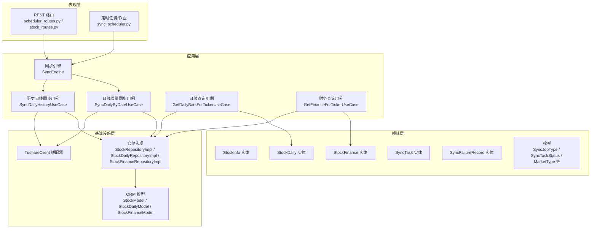
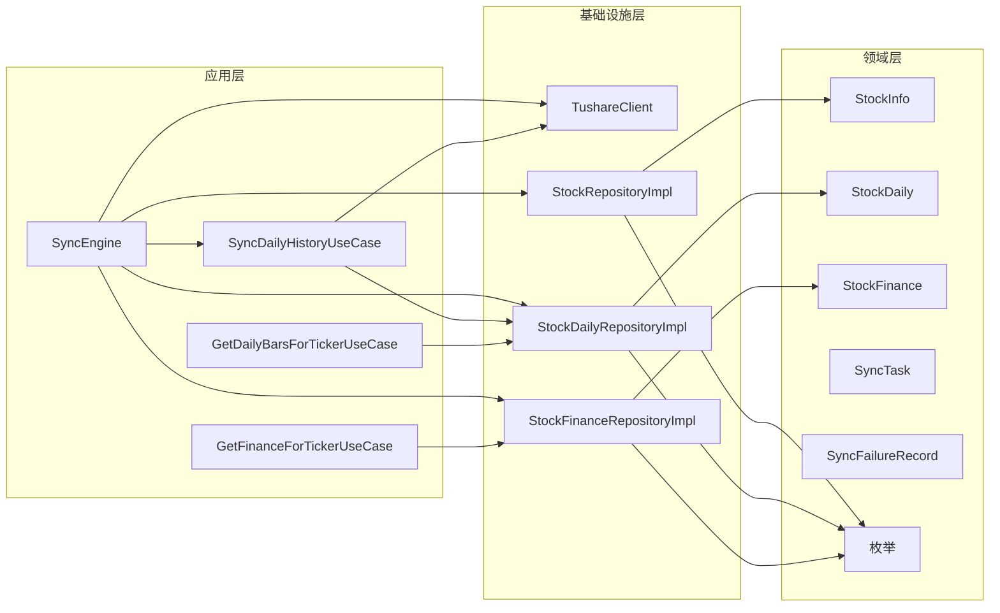
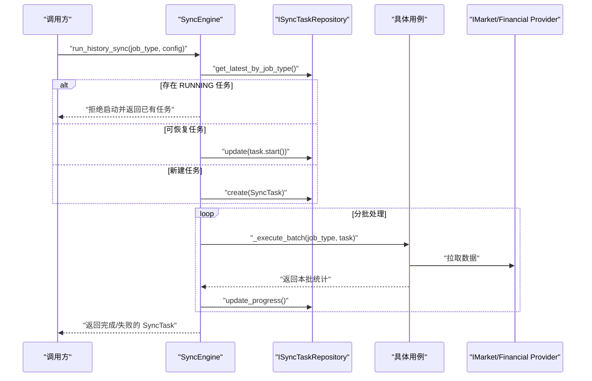
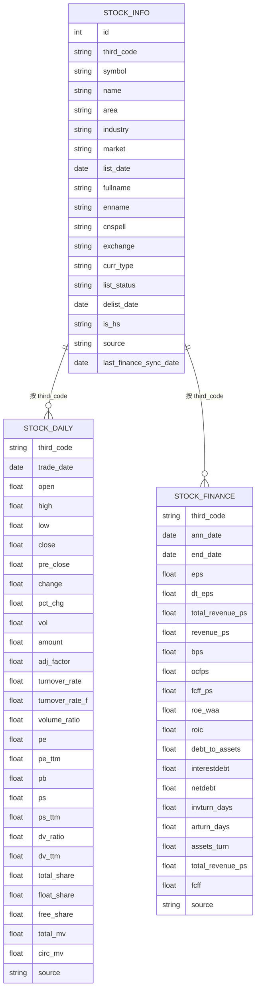
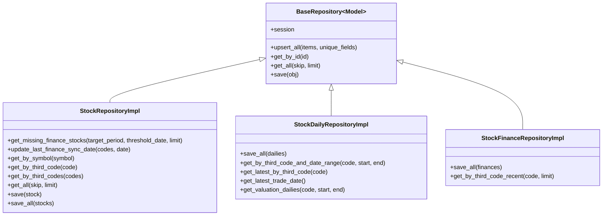
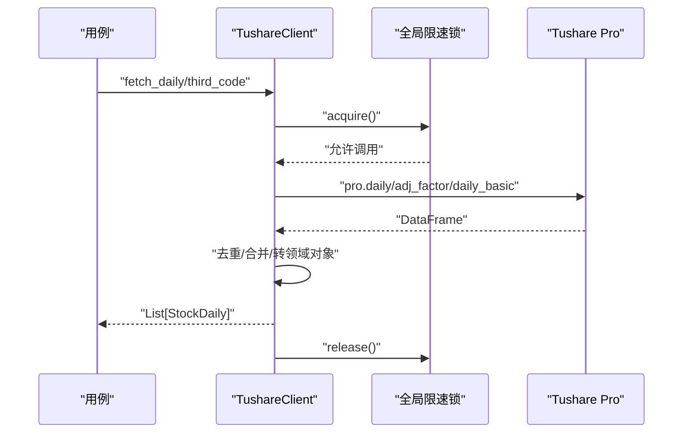
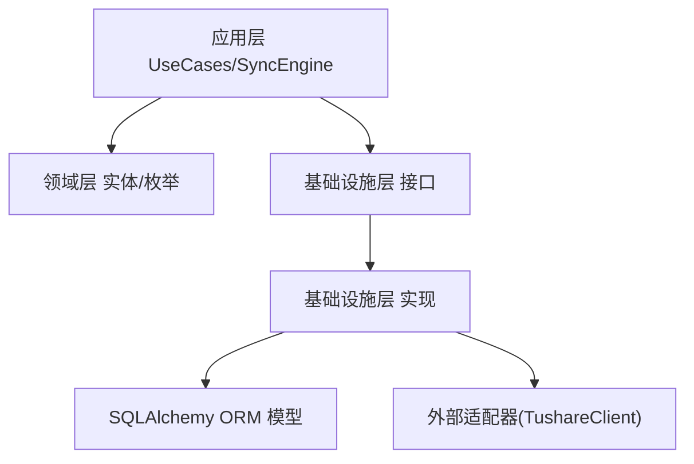

# 数据工程模块

<cite>
**本文引用的文件**
- [src/modules/data_engineering/container.py](file://src/modules/data_engineering/container.py)
- [src/modules/data_engineering/application/factories/sync_factory.py](file://src/modules/data_engineering/application/factories/sync_factory.py)
- [src/modules/data_engineering/application/commands/sync_engine.py](file://src/modules/data_engineering/application/commands/sync_engine.py)
- [src/modules/data_engineering/application/commands/sync_daily_history.py](file://src/modules/data_engineering/application/commands/sync_daily_history.py)
- [src/modules/data_engineering/application/queries/get_daily_bars_for_ticker.py](file://src/modules/data_engineering/application/queries/get_daily_bars_for_ticker.py)
- [src/modules/data_engineering/application/queries/get_finance_for_ticker.py](file://src/modules/data_engineering/application/queries/get_finance_for_ticker.py)
- [src/modules/data_engineering/domain/model/stock.py](file://src/modules/data_engineering/domain/model/stock.py)
- [src/modules/data_engineering/domain/model/stock_daily.py](file://src/modules/data_engineering/domain/model/stock_daily.py)
- [src/modules/data_engineering/domain/model/financial_report.py](file://src/modules/data_engineering/domain/model/financial_report.py)
- [src/modules/data_engineering/domain/model/enums.py](file://src/modules/data_engineering/domain/model/enums.py)
- [src/modules/data_engineering/domain/model/sync_task.py](file://src/modules/data_engineering/domain/model/sync_task.py)
- [src/modules/data_engineering/domain/model/sync_failure_record.py](file://src/modules/data_engineering/domain/model/sync_failure_record.py)
- [src/modules/data_engineering/infrastructure/external_apis/tushare/client.py](file://src/modules/data_engineering/infrastructure/external_apis/tushare/client.py)
- [src/modules/data_engineering/infrastructure/persistence/models/stock_model.py](file://src/modules/data_engineering/infrastructure/persistence/models/stock_model.py)
- [src/modules/data_engineering/infrastructure/persistence/models/daily_bar_model.py](file://src/modules/data_engineering/infrastructure/persistence/models/daily_bar_model.py)
- [src/modules/data_engineering/infrastructure/persistence/repositories/pg_stock_repo.py](file://src/modules/data_engineering/infrastructure/persistence/repositories/pg_stock_repo.py)
- [src/modules/data_engineering/infrastructure/persistence/repositories/pg_quote_repo.py](file://src/modules/data_engineering/infrastructure/persistence/repositories/pg_quote_repo.py)
- [src/modules/data_engineering/infrastructure/persistence/repositories/pg_finance_repo.py](file://src/modules/data_engineering/infrastructure/persistence/repositories/pg_finance_repo.py)
</cite>

## 目录
1. [简介](#简介)
2. [项目结构](#项目结构)
3. [核心组件](#核心组件)
4. [架构总览](#架构总览)
5. [详细组件分析](#详细组件分析)
6. [依赖关系分析](#依赖关系分析)
7. [性能考量](#性能考量)
8. [故障排查指南](#故障排查指南)
9. [结论](#结论)
10. [附录](#附录)

## 简介
本文件为“数据工程模块”的全面技术文档，覆盖数据采集、处理、存储的完整流程；同步引擎的工作原理（历史全量、增量同步、断点续跑、错误重试）；数据模型设计（Stock、StockDaily、FinancialReport 等）；仓储模式实现（SQLAlchemy ORM、连接管理、事务处理）；外部 API 适配器（Tushare 数据提供商）；数据质量保障与异常处理策略，并提供使用示例与最佳实践，帮助开发者理解与扩展该模块。

## 项目结构
数据工程模块采用分层架构与领域驱动设计（DDD）思想：
- 应用层：命令与查询用例，负责编排业务流程（如同步引擎、日线/财务查询）。
- 领域层：实体、值对象、枚举与领域服务，定义业务规则与不变量。
- 基础设施层：外部 API 适配器（Tushare）、ORM 映射与仓储实现（PostgreSQL）。
- 表现层：REST 路由与调度作业，作为入口对接上层模块（如研究模块）。

图表来源
- [src/modules/data_engineering/application/commands/sync_engine.py](file://src/modules/data_engineering/application/commands/sync_engine.py#L20-L280)
- [src/modules/data_engineering/application/commands/sync_daily_history.py](file://src/modules/data_engineering/application/commands/sync_daily_history.py#L8-L73)
- [src/modules/data_engineering/application/queries/get_daily_bars_for_ticker.py](file://src/modules/data_engineering/application/queries/get_daily_bars_for_ticker.py#L31-L68)
- [src/modules/data_engineering/application/queries/get_finance_for_ticker.py](file://src/modules/data_engineering/application/queries/get_finance_for_ticker.py#L88-L111)
- [src/modules/data_engineering/domain/model/stock.py](file://src/modules/data_engineering/domain/model/stock.py#L7-L63)
- [src/modules/data_engineering/domain/model/stock_daily.py](file://src/modules/data_engineering/domain/model/stock_daily.py#L6-L46)
- [src/modules/data_engineering/domain/model/financial_report.py](file://src/modules/data_engineering/domain/model/financial_report.py#L6-L117)
- [src/modules/data_engineering/domain/model/sync_task.py](file://src/modules/data_engineering/domain/model/sync_task.py#L9-L64)
- [src/modules/data_engineering/domain/model/sync_failure_record.py](file://src/modules/data_engineering/domain/model/sync_failure_record.py#L9-L42)
- [src/modules/data_engineering/domain/model/enums.py](file://src/modules/data_engineering/domain/model/enums.py#L26-L40)
- [src/modules/data_engineering/infrastructure/external_apis/tushare/client.py](file://src/modules/data_engineering/infrastructure/external_apis/tushare/client.py#L33-L252)
- [src/modules/data_engineering/infrastructure/persistence/repositories/pg_stock_repo.py](file://src/modules/data_engineering/infrastructure/persistence/repositories/pg_stock_repo.py#L12-L133)
- [src/modules/data_engineering/infrastructure/persistence/repositories/pg_quote_repo.py](file://src/modules/data_engineering/infrastructure/persistence/repositories/pg_quote_repo.py#L11-L173)
- [src/modules/data_engineering/infrastructure/persistence/repositories/pg_finance_repo.py](file://src/modules/data_engineering/infrastructure/persistence/repositories/pg_finance_repo.py#L15-L54)
- [src/modules/data_engineering/infrastructure/persistence/models/stock_model.py](file://src/modules/data_engineering/infrastructure/persistence/models/stock_model.py#L4-L36)
- [src/modules/data_engineering/infrastructure/persistence/models/daily_bar_model.py](file://src/modules/data_engineering/infrastructure/persistence/models/daily_bar_model.py#L4-L44)

章节来源
- [src/modules/data_engineering/container.py](file://src/modules/data_engineering/container.py#L39-L109)
- [src/modules/data_engineering/application/factories/sync_factory.py](file://src/modules/data_engineering/application/factories/sync_factory.py#L14-L115)

## 核心组件
- 同步引擎：统一编排历史全量与增量同步，支持断点续跑、互斥控制、分批处理与失败记录追踪。
- 用例层：历史日线同步、日线按日同步、日线/财务查询等。
- 领域模型：StockInfo、StockDaily、StockFinance、SyncTask、SyncFailureRecord 及枚举。
- 仓储层：基于 SQLAlchemy 的 PostgreSQL 仓储实现，支持 upsert、批量写入与去重。
- 外部适配器：TushareClient，封装限速、并发安全与数据合并（日线+复权因子+每日指标）。

章节来源
- [src/modules/data_engineering/application/commands/sync_engine.py](file://src/modules/data_engineering/application/commands/sync_engine.py#L20-L280)
- [src/modules/data_engineering/application/commands/sync_daily_history.py](file://src/modules/data_engineering/application/commands/sync_daily_history.py#L8-L73)
- [src/modules/data_engineering/application/queries/get_daily_bars_for_ticker.py](file://src/modules/data_engineering/application/queries/get_daily_bars_for_ticker.py#L31-L68)
- [src/modules/data_engineering/application/queries/get_finance_for_ticker.py](file://src/modules/data_engineering/application/queries/get_finance_for_ticker.py#L88-L111)
- [src/modules/data_engineering/domain/model/stock.py](file://src/modules/data_engineering/domain/model/stock.py#L7-L63)
- [src/modules/data_engineering/domain/model/stock_daily.py](file://src/modules/data_engineering/domain/model/stock_daily.py#L6-L46)
- [src/modules/data_engineering/domain/model/financial_report.py](file://src/modules/data_engineering/domain/model/financial_report.py#L6-L117)
- [src/modules/data_engineering/domain/model/sync_task.py](file://src/modules/data_engineering/domain/model/sync_task.py#L9-L64)
- [src/modules/data_engineering/domain/model/sync_failure_record.py](file://src/modules/data_engineering/domain/model/sync_failure_record.py#L9-L42)
- [src/modules/data_engineering/infrastructure/external_apis/tushare/client.py](file://src/modules/data_engineering/infrastructure/external_apis/tushare/client.py#L33-L252)
- [src/modules/data_engineering/infrastructure/persistence/repositories/pg_stock_repo.py](file://src/modules/data_engineering/infrastructure/persistence/repositories/pg_stock_repo.py#L12-L133)
- [src/modules/data_engineering/infrastructure/persistence/repositories/pg_quote_repo.py](file://src/modules/data_engineering/infrastructure/persistence/repositories/pg_quote_repo.py#L11-L173)
- [src/modules/data_engineering/infrastructure/persistence/repositories/pg_finance_repo.py](file://src/modules/data_engineering/infrastructure/persistence/repositories/pg_finance_repo.py#L15-L54)

## 架构总览
数据工程模块遵循“依赖倒置”原则：应用层依赖抽象（仓储接口、数据提供商接口），基础设施层实现这些接口；领域层保持纯净，仅承载业务不变量。

图表来源
- [src/modules/data_engineering/application/commands/sync_engine.py](file://src/modules/data_engineering/application/commands/sync_engine.py#L20-L280)
- [src/modules/data_engineering/application/commands/sync_daily_history.py](file://src/modules/data_engineering/application/commands/sync_daily_history.py#L8-L73)
- [src/modules/data_engineering/application/queries/get_daily_bars_for_ticker.py](file://src/modules/data_engineering/application/queries/get_daily_bars_for_ticker.py#L31-L68)
- [src/modules/data_engineering/application/queries/get_finance_for_ticker.py](file://src/modules/data_engineering/application/queries/get_finance_for_ticker.py#L88-L111)
- [src/modules/data_engineering/domain/model/stock.py](file://src/modules/data_engineering/domain/model/stock.py#L7-L63)
- [src/modules/data_engineering/domain/model/stock_daily.py](file://src/modules/data_engineering/domain/model/stock_daily.py#L6-L46)
- [src/modules/data_engineering/domain/model/financial_report.py](file://src/modules/data_engineering/domain/model/financial_report.py#L6-L117)
- [src/modules/data_engineering/domain/model/sync_task.py](file://src/modules/data_engineering/domain/model/sync_task.py#L9-L64)
- [src/modules/data_engineering/domain/model/sync_failure_record.py](file://src/modules/data_engineering/domain/model/sync_failure_record.py#L9-L42)
- [src/modules/data_engineering/domain/model/enums.py](file://src/modules/data_engineering/domain/model/enums.py#L26-L40)
- [src/modules/data_engineering/infrastructure/external_apis/tushare/client.py](file://src/modules/data_engineering/infrastructure/external_apis/tushare/client.py#L33-L252)
- [src/modules/data_engineering/infrastructure/persistence/repositories/pg_stock_repo.py](file://src/modules/data_engineering/infrastructure/persistence/repositories/pg_stock_repo.py#L12-L133)
- [src/modules/data_engineering/infrastructure/persistence/repositories/pg_quote_repo.py](file://src/modules/data_engineering/infrastructure/persistence/repositories/pg_quote_repo.py#L11-L173)
- [src/modules/data_engineering/infrastructure/persistence/repositories/pg_finance_repo.py](file://src/modules/data_engineering/infrastructure/persistence/repositories/pg_finance_repo.py#L15-L54)

## 详细组件分析

### 同步引擎（SyncEngine）
- 职责：统一编排历史全量同步与日线增量同步；支持任务互斥、断点续跑、分批处理、进度追踪与失败记录。
- 关键流程：
  - 历史全量同步：检查同类型任务互斥；若存在可恢复任务则断点续跑；否则创建新任务；循环分批执行，直至某批返回 0 条记录标记完成。
  - 日线增量同步：计算数据库最新交易日与目标日期差，补偿缺失日期后再同步目标日期；单日失败不中断。
- 依赖注入：通过工厂创建 SyncEngine，注入仓储与数据提供商。

图表来源
- [src/modules/data_engineering/application/commands/sync_engine.py](file://src/modules/data_engineering/application/commands/sync_engine.py#L47-L128)
- [src/modules/data_engineering/application/commands/sync_daily_history.py](file://src/modules/data_engineering/application/commands/sync_daily_history.py#L22-L73)

章节来源
- [src/modules/data_engineering/application/commands/sync_engine.py](file://src/modules/data_engineering/application/commands/sync_engine.py#L20-L280)

### 历史日线同步用例（SyncDailyHistoryUseCase）
- 职责：按分页获取股票列表，逐只调用 TushareClient 拉取日线数据，去重后批量写入数据库。
- 特性：串行处理，限速由适配器统一保障；单只失败不中断整批。

章节来源
- [src/modules/data_engineering/application/commands/sync_daily_history.py](file://src/modules/data_engineering/application/commands/sync_daily_history.py#L8-L73)

### 日线查询用例（GetDailyBarsForTickerUseCase）
- 职责：按标的与日期区间查询日线，返回精简 DTO（仅分析所需字段）。
- 输出：按交易日升序的日线 DTO 列表。

章节来源
- [src/modules/data_engineering/application/queries/get_daily_bars_for_ticker.py](file://src/modules/data_engineering/application/queries/get_daily_bars_for_ticker.py#L31-L68)

### 财务查询用例（GetFinanceForTickerUseCase）
- 职责：按标的查询最近 N 期财务指标，返回精简 DTO。
- 输出：按报告期降序的财务 DTO 列表。

章节来源
- [src/modules/data_engineering/application/queries/get_finance_for_ticker.py](file://src/modules/data_engineering/application/queries/get_finance_for_ticker.py#L88-L111)

### 数据模型设计
- StockInfo（股票基础信息）
  - 关键属性：third_code、symbol、name、area、industry、market、list_date、fullname、enname、cnspell、exchange、curr_type、list_status、delist_date、is_hs、source、last_finance_sync_date。
  - 行为：判断是否上市、是否沪深港通标的。
- StockDaily（日线行情）
  - 关键属性：third_code、trade_date、OHLC、pre_close、change、pct_chg、vol、amount、adj_factor、估值与每日指标等。
- StockFinance（财务指标）
  - 关键属性：third_code、ann_date、end_date、每股指标、盈利能力、营运能力、偿债能力、现金流、财务比率等。
- 枚举：ListStatus、IsHs、ExchangeType、MarketType、SyncJobType、SyncTaskStatus。

图表来源
- [src/modules/data_engineering/domain/model/stock.py](file://src/modules/data_engineering/domain/model/stock.py#L7-L63)
- [src/modules/data_engineering/domain/model/stock_daily.py](file://src/modules/data_engineering/domain/model/stock_daily.py#L6-L46)
- [src/modules/data_engineering/domain/model/financial_report.py](file://src/modules/data_engineering/domain/model/financial_report.py#L6-L117)
- [src/modules/data_engineering/infrastructure/persistence/models/stock_model.py](file://src/modules/data_engineering/infrastructure/persistence/models/stock_model.py#L4-L36)
- [src/modules/data_engineering/infrastructure/persistence/models/daily_bar_model.py](file://src/modules/data_engineering/infrastructure/persistence/models/daily_bar_model.py#L4-L44)

章节来源
- [src/modules/data_engineering/domain/model/stock.py](file://src/modules/data_engineering/domain/model/stock.py#L7-L63)
- [src/modules/data_engineering/domain/model/stock_daily.py](file://src/modules/data_engineering/domain/model/stock_daily.py#L6-L46)
- [src/modules/data_engineering/domain/model/financial_report.py](file://src/modules/data_engineering/domain/model/financial_report.py#L6-L117)
- [src/modules/data_engineering/domain/model/enums.py](file://src/modules/data_engineering/domain/model/enums.py#L3-L40)

### 仓储模式实现（SQLAlchemy ORM）
- 基类：BaseRepository 提供通用 CRUD 与 upsert_all 能力。
- 股票仓储：支持按第三方代码/股票代码查询、批量保存（on conflict do update）、按报告期缺失财务数据的筛选与批量更新最后财务同步日期。
- 日线仓储：批量保存（按主键去重，保留后者）、按标的+日期范围查询、获取最新交易日、按估值字段查询。
- 财务仓储：批量保存（按三元组主键去重，保留后者）、按标的最近 N 期查询。

图表来源
- [src/modules/data_engineering/infrastructure/persistence/repositories/pg_stock_repo.py](file://src/modules/data_engineering/infrastructure/persistence/repositories/pg_stock_repo.py#L12-L133)
- [src/modules/data_engineering/infrastructure/persistence/repositories/pg_quote_repo.py](file://src/modules/data_engineering/infrastructure/persistence/repositories/pg_quote_repo.py#L11-L173)
- [src/modules/data_engineering/infrastructure/persistence/repositories/pg_finance_repo.py](file://src/modules/data_engineering/infrastructure/persistence/repositories/pg_finance_repo.py#L15-L54)

章节来源
- [src/modules/data_engineering/infrastructure/persistence/repositories/pg_stock_repo.py](file://src/modules/data_engineering/infrastructure/persistence/repositories/pg_stock_repo.py#L12-L133)
- [src/modules/data_engineering/infrastructure/persistence/repositories/pg_quote_repo.py](file://src/modules/data_engineering/infrastructure/persistence/repositories/pg_quote_repo.py#L11-L173)
- [src/modules/data_engineering/infrastructure/persistence/repositories/pg_finance_repo.py](file://src/modules/data_engineering/infrastructure/persistence/repositories/pg_finance_repo.py#L15-L54)

### 外部 API 适配器（TushareClient）
- 职责：封装 Tushare Pro API 调用，统一限速（全局 asyncio.Lock + 间隔控制）、线程池执行、数据合并（日线+复权因子+每日指标）与异常包装。
- 能力：获取股票列表、日线行情、财务指标、财报披露计划；对空数据进行告警并返回空列表；异常统一包装为应用异常。

图表来源
- [src/modules/data_engineering/infrastructure/external_apis/tushare/client.py](file://src/modules/data_engineering/infrastructure/external_apis/tushare/client.py#L55-L252)

章节来源
- [src/modules/data_engineering/infrastructure/external_apis/tushare/client.py](file://src/modules/data_engineering/infrastructure/external_apis/tushare/client.py#L33-L252)

### 数据质量保证与异常处理
- 数据质量：
  - 日线/财务入库前去重（按主键组合），保留后者，避免重复写入。
  - 日线数据合并时对多源数据去重，防止 merge 导致膨胀。
  - 财务/日线字段缺失时以 None 存储，查询侧以 0.0 或 None 渲染。
- 异常处理：
  - TushareClient 将底层异常包装为应用异常，携带状态码与错误码。
  - 同步用例对单只股票失败进行捕获并继续处理，避免整批中断。
  - SyncEngine 对任务整体失败进行标记并持久化状态。

章节来源
- [src/modules/data_engineering/infrastructure/persistence/repositories/pg_quote_repo.py](file://src/modules/data_engineering/infrastructure/persistence/repositories/pg_quote_repo.py#L15-L48)
- [src/modules/data_engineering/infrastructure/persistence/repositories/pg_finance_repo.py](file://src/modules/data_engineering/infrastructure/persistence/repositories/pg_finance_repo.py#L19-L39)
- [src/modules/data_engineering/infrastructure/external_apis/tushare/client.py](file://src/modules/data_engineering/infrastructure/external_apis/tushare/client.py#L110-L141)
- [src/modules/data_engineering/application/commands/sync_daily_history.py](file://src/modules/data_engineering/application/commands/sync_daily_history.py#L63-L66)
- [src/modules/data_engineering/application/commands/sync_engine.py](file://src/modules/data_engineering/application/commands/sync_engine.py#L121-L125)

### 使用示例与最佳实践
- 通过容器获取查询用例（供研究模块使用）
  - 获取日线查询用例：参考路径 [src/modules/data_engineering/container.py](file://src/modules/data_engineering/container.py#L73-L80)
  - 获取财务查询用例：参考路径 [src/modules/data_engineering/container.py](file://src/modules/data_engineering/container.py#L82-L89)
  - 获取估值日线查询用例：参考路径 [src/modules/data_engineering/container.py](file://src/modules/data_engineering/container.py#L91-L98)
  - 获取股票基本信息查询用例：参考路径 [src/modules/data_engineering/container.py](file://src/modules/data_engineering/container.py#L100-L108)
- 通过工厂创建同步引擎与增量用例（供调度/路由使用）
  - 创建同步引擎：参考路径 [src/modules/data_engineering/application/factories/sync_factory.py](file://src/modules/data_engineering/application/factories/sync_factory.py#L24-L54)
  - 创建增量财务同步用例：参考路径 [src/modules/data_engineering/application/factories/sync_factory.py](file://src/modules/data_engineering/application/factories/sync_factory.py#L64-L87)
- 最佳实践
  - 限速与并发：统一在适配器层处理，应用层仅串行调用，避免重复限速。
  - 断点续跑：历史同步自动恢复上次进度，无需手动干预。
  - 失败隔离：单只股票失败不影响整批，失败记录可追踪与重试。
  - 批量入库：优先使用 upsert 批量写入，减少往返与冲突。

章节来源
- [src/modules/data_engineering/container.py](file://src/modules/data_engineering/container.py#L39-L109)
- [src/modules/data_engineering/application/factories/sync_factory.py](file://src/modules/data_engineering/application/factories/sync_factory.py#L14-L115)

## 依赖关系分析
- 应用层依赖领域层（实体/枚举）与基础设施层接口（仓储、数据提供商）。
- 基础设施层实现接口并持有 SQLAlchemy 会话，完成 ORM 映射与事务提交。
- 外部适配器封装第三方 API，屏蔽网络与限速细节。

图表来源
- [src/modules/data_engineering/application/commands/sync_engine.py](file://src/modules/data_engineering/application/commands/sync_engine.py#L31-L45)
- [src/modules/data_engineering/infrastructure/external_apis/tushare/client.py](file://src/modules/data_engineering/infrastructure/external_apis/tushare/client.py#L33-L53)
- [src/modules/data_engineering/infrastructure/persistence/repositories/pg_stock_repo.py](file://src/modules/data_engineering/infrastructure/persistence/repositories/pg_stock_repo.py#L12-L18)
- [src/modules/data_engineering/infrastructure/persistence/repositories/pg_quote_repo.py](file://src/modules/data_engineering/infrastructure/persistence/repositories/pg_quote_repo.py#L11-L13)
- [src/modules/data_engineering/infrastructure/persistence/repositories/pg_finance_repo.py](file://src/modules/data_engineering/infrastructure/persistence/repositories/pg_finance_repo.py#L15-L17)

章节来源
- [src/modules/data_engineering/application/commands/sync_engine.py](file://src/modules/data_engineering/application/commands/sync_engine.py#L20-L280)
- [src/modules/data_engineering/infrastructure/external_apis/tushare/client.py](file://src/modules/data_engineering/infrastructure/external_apis/tushare/client.py#L33-L252)
- [src/modules/data_engineering/infrastructure/persistence/repositories/pg_stock_repo.py](file://src/modules/data_engineering/infrastructure/persistence/repositories/pg_stock_repo.py#L12-L133)
- [src/modules/data_engineering/infrastructure/persistence/repositories/pg_quote_repo.py](file://src/modules/data_engineering/infrastructure/persistence/repositories/pg_quote_repo.py#L11-L173)
- [src/modules/data_engineering/infrastructure/persistence/repositories/pg_finance_repo.py](file://src/modules/data_engineering/infrastructure/persistence/repositories/pg_finance_repo.py#L15-L54)

## 性能考量
- 批量写入：仓储实现使用 on_conflict_do_update/upsert_all，减少往返与冲突。
- 去重策略：入库前按主键去重，避免重复写入与索引膨胀。
- 限速与并发：适配器层统一限速与线程池执行，避免阻塞事件循环。
- 分批处理：历史同步按批次推进，避免长事务与内存压力。
- 查询优化：仓储查询使用索引列（third_code、trade_date 等），并按需投影字段。

## 故障排查指南
- Tushare 初始化失败
  - 现象：初始化抛出应用异常，提示第三方数据服务初始化失败。
  - 排查：确认环境变量中 Tushare Token 已正确配置。
  - 参考路径：[src/modules/data_engineering/infrastructure/external_apis/tushare/client.py](file://src/modules/data_engineering/infrastructure/external_apis/tushare/client.py#L40-L53)
- API 调用失败
  - 现象：获取数据时报错，错误被包装为应用异常。
  - 排查：查看日志中的错误码与详情；确认网络与配额。
  - 参考路径：[src/modules/data_engineering/infrastructure/external_apis/tushare/client.py](file://src/modules/data_engineering/infrastructure/external_apis/tushare/client.py#L101-L108)
- 同步任务互斥
  - 现象：同类型任务已在运行，拒绝启动。
  - 排查：等待 RUNNING 任务结束或手动清理状态。
  - 参考路径：[src/modules/data_engineering/application/commands/sync_engine.py](file://src/modules/data_engineering/application/commands/sync_engine.py#L65-L69)
- 断点续跑
  - 现象：任务处于 RUNNING/PAUSED 可恢复状态，自动从上次偏移继续。
  - 排查：确认任务状态与进度是否符合预期。
  - 参考路径：[src/modules/data_engineering/application/commands/sync_engine.py](file://src/modules/data_engineering/application/commands/sync_engine.py#L71-L80)
- 单只股票失败
  - 现象：历史同步中个别股票失败但整批继续。
  - 排查：检查该股票 third_code 是否有效；查看失败记录与重试次数。
  - 参考路径：[src/modules/data_engineering/application/commands/sync_daily_history.py](file://src/modules/data_engineering/application/commands/sync_daily_history.py#L63-L66)

章节来源
- [src/modules/data_engineering/infrastructure/external_apis/tushare/client.py](file://src/modules/data_engineering/infrastructure/external_apis/tushare/client.py#L40-L53)
- [src/modules/data_engineering/application/commands/sync_engine.py](file://src/modules/data_engineering/application/commands/sync_engine.py#L65-L80)
- [src/modules/data_engineering/application/commands/sync_daily_history.py](file://src/modules/data_engineering/application/commands/sync_daily_history.py#L63-L66)

## 结论
数据工程模块通过清晰的分层与依赖倒置，实现了稳定的数据采集、处理与存储链路。同步引擎提供可靠的历史全量与增量同步能力，结合 Tushare 适配器与完善的仓储实现，满足高吞吐、低耦合与可维护性的需求。建议在生产环境中配合监控与告警，持续优化批大小与限速参数，确保稳定性与性能的平衡。

## 附录
- 任务与失败记录实体
  - SyncTask：追踪任务生命周期、进度与状态。
  - SyncFailureRecord：记录单只股票失败信息与重试策略。
- 枚举
  - SyncJobType：任务类型（历史/增量）。
  - SyncTaskStatus：任务状态（待开始/运行中/已完成/失败/已暂停）。
  - 其他枚举：ListStatus、IsHs、ExchangeType、MarketType。

章节来源
- [src/modules/data_engineering/domain/model/sync_task.py](file://src/modules/data_engineering/domain/model/sync_task.py#L9-L64)
- [src/modules/data_engineering/domain/model/sync_failure_record.py](file://src/modules/data_engineering/domain/model/sync_failure_record.py#L9-L42)
- [src/modules/data_engineering/domain/model/enums.py](file://src/modules/data_engineering/domain/model/enums.py#L26-L40)