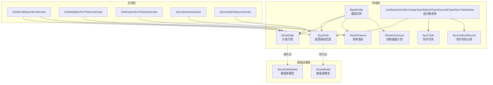
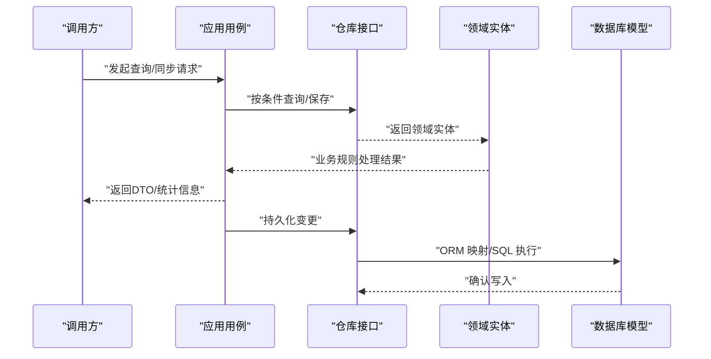
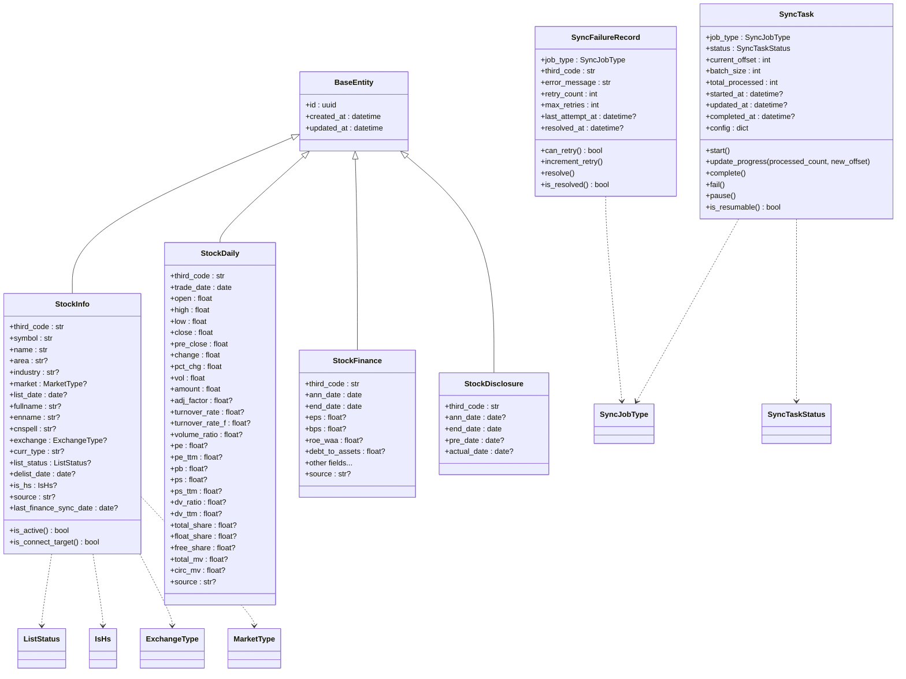

# 数据模型设计

<cite>
**本文档引用的文件**
- [src/shared/domain/base_entity.py](file://src/shared/domain/base_entity.py)
- [src/modules/data_engineering/domain/model/stock.py](file://src/modules/data_engineering/domain/model/stock.py)
- [src/modules/data_engineering/domain/model/stock_daily.py](file://src/modules/data_engineering/domain/model/stock_daily.py)
- [src/modules/data_engineering/domain/model/financial_report.py](file://src/modules/data_engineering/domain/model/financial_report.py)
- [src/modules/data_engineering/domain/model/disclosure.py](file://src/modules/data_engineering/domain/model/disclosure.py)
- [src/modules/data_engineering/domain/model/enums.py](file://src/modules/data_engineering/domain/model/enums.py)
- [src/modules/data_engineering/domain/model/sync_task.py](file://src/modules/data_engineering/domain/model/sync_task.py)
- [src/modules/data_engineering/domain/model/sync_failure_record.py](file://src/modules/data_engineering/domain/model/sync_failure_record.py)
- [src/modules/data_engineering/infrastructure/persistence/models/stock_model.py](file://src/modules/data_engineering/infrastructure/persistence/models/stock_model.py)
- [src/modules/data_engineering/infrastructure/persistence/models/daily_bar_model.py](file://src/modules/data_engineering/infrastructure/persistence/models/daily_bar_model.py)
- [src/modules/data_engineering/application/queries/get_stock_basic_info.py](file://src/modules/data_engineering/application/queries/get_stock_basic_info.py)
- [src/modules/data_engineering/application/queries/get_daily_bars_for_ticker.py](file://src/modules/data_engineering/application/queries/get_daily_bars_for_ticker.py)
- [src/modules/data_engineering/application/queries/get_finance_for_ticker.py](file://src/modules/data_engineering/application/queries/get_finance_for_ticker.py)
- [src/modules/data_engineering/application/commands/sync_stock_list_cmd.py](file://src/modules/data_engineering/application/commands/sync_stock_list_cmd.py)
- [src/modules/data_engineering/application/commands/sync_daily_history.py](file://src/modules/data_engineering/application/commands/sync_daily_history.py)
</cite>

## 目录
1. [引言](#引言)
2. [项目结构](#项目结构)
3. [核心组件](#核心组件)
4. [架构概览](#架构概览)
5. [详细组件分析](#详细组件分析)
6. [依赖关系分析](#依赖关系分析)
7. [性能考虑](#性能考虑)
8. [故障排查指南](#故障排查指南)
9. [结论](#结论)
10. [附录](#附录)

## 引言
本文件面向数据模型设计，系统性阐述领域实体与值对象的设计理念、属性定义与业务含义、实体关系映射、不变性与业务规则、验证与完整性机制，并提供创建、更新与查询的使用示例路径，帮助开发者快速理解并正确使用数据模型。

## 项目结构
围绕数据工程模块的数据模型，采用“领域模型 + 值对象 + 基类 + 应用用例 + 基础设施模型”的分层组织方式：
- 领域层：定义实体与值对象，承载业务不变性与规则
- 应用层：封装用例，协调领域与基础设施交互
- 基础设施层：持久化模型与仓库实现，负责数据存取



图表来源
- [src/shared/domain/base_entity.py](file://src/shared/domain/base_entity.py#L8-L17)
- [src/modules/data_engineering/domain/model/enums.py](file://src/modules/data_engineering/domain/model/enums.py#L3-L39)
- [src/modules/data_engineering/domain/model/stock.py](file://src/modules/data_engineering/domain/model/stock.py#L7-L62)
- [src/modules/data_engineering/domain/model/stock_daily.py](file://src/modules/data_engineering/domain/model/stock_daily.py#L6-L41)
- [src/modules/data_engineering/domain/model/financial_report.py](file://src/modules/data_engineering/domain/model/financial_report.py#L6-L116)
- [src/modules/data_engineering/domain/model/disclosure.py](file://src/modules/data_engineering/domain/model/disclosure.py#L6-L15)
- [src/modules/data_engineering/domain/model/sync_task.py](file://src/modules/data_engineering/domain/model/sync_task.py#L9-L63)
- [src/modules/data_engineering/domain/model/sync_failure_record.py](file://src/modules/data_engineering/domain/model/sync_failure_record.py#L9-L41)
- [src/modules/data_engineering/infrastructure/persistence/models/stock_model.py](file://src/modules/data_engineering/infrastructure/persistence/models/stock_model.py#L4-L35)
- [src/modules/data_engineering/infrastructure/persistence/models/daily_bar_model.py](file://src/modules/data_engineering/infrastructure/persistence/models/daily_bar_model.py#L4-L43)

章节来源
- [src/shared/domain/base_entity.py](file://src/shared/domain/base_entity.py#L8-L17)
- [src/modules/data_engineering/domain/model/stock.py](file://src/modules/data_engineering/domain/model/stock.py#L7-L62)
- [src/modules/data_engineering/domain/model/stock_daily.py](file://src/modules/data_engineering/domain/model/stock_daily.py#L6-L41)
- [src/modules/data_engineering/domain/model/financial_report.py](file://src/modules/data_engineering/domain/model/financial_report.py#L6-L116)
- [src/modules/data_engineering/domain/model/disclosure.py](file://src/modules/data_engineering/domain/model/disclosure.py#L6-L15)
- [src/modules/data_engineering/domain/model/enums.py](file://src/modules/data_engineering/domain/model/enums.py#L3-L39)
- [src/modules/data_engineering/domain/model/sync_task.py](file://src/modules/data_engineering/domain/model/sync_task.py#L9-L63)
- [src/modules/data_engineering/domain/model/sync_failure_record.py](file://src/modules/data_engineering/domain/model/sync_failure_record.py#L9-L41)
- [src/modules/data_engineering/infrastructure/persistence/models/stock_model.py](file://src/modules/data_engineering/infrastructure/persistence/models/stock_model.py#L4-L35)
- [src/modules/data_engineering/infrastructure/persistence/models/daily_bar_model.py](file://src/modules/data_engineering/infrastructure/persistence/models/daily_bar_model.py#L4-L43)

## 核心组件
本节聚焦三大核心实体及其值对象，解释属性语义、业务规则与不变性保障。

- 股票基础信息（StockInfo）
  - 关键属性：第三方代码、股票代码、名称、地区、行业、市场类型、上市日期、全称、英文名、拼音缩写、交易所、币种、上市状态、退市日期、是否沪深港通标的、来源、上次财务同步日期
  - 业务规则：
    - 是否活跃：根据上市状态判断
    - 是否互联互通标的：根据是否沪深港通标的判断
  - 不变性：继承自基础实体的统一ID、创建/更新时间；属性通过 Pydantic 字段定义默认值与可空性

- 日线行情（StockDaily）
  - 关键属性：第三方代码、交易日期、开盘/最高/最低/收盘价、昨收、涨跌额/涨跌幅、成交量/成交额、复权因子、换手率、PE/市净率/PS、股息率、股本与市值、来源
  - 业务规则：以“第三方代码+交易日期”作为唯一标识，用于去重与查询

- 财务指标（StockFinance）
  - 关键属性：第三方代码、公告日期、报告期、每股指标（EPS、每股营收、净资产等）、盈利能力（毛利率、ROE/ROA系列）、营运能力（存货/应收账款周转）、偿债能力（EBIT/EBITDA、资产负债率）、现金流（FCFF/FCFE）、财务比率（费用率、杠杆比率等）、来源
  - 业务规则：报告期与公告日期用于排序与展示；部分字段允许为空，体现财务数据的完整性差异

- 值对象（枚举）
  - 上市状态（ListStatus）：L（上市）、D（退市）、P（暂停）
  - 是否沪深港通（IsHs）：N（否）、H（沪股通）、S（深股通）
  - 交易所（ExchangeType）：上交所、深交所、北交所
  - 市场类型（MarketType）：主板、中小板、创业板、科创板、CDR、北交所
  - 同步任务类型（SyncJobType）：日线/财务历史与增量同步
  - 同步任务状态（SyncTaskStatus）：待开始、运行中、已完成、失败、已暂停

章节来源
- [src/modules/data_engineering/domain/model/stock.py](file://src/modules/data_engineering/domain/model/stock.py#L7-L62)
- [src/modules/data_engineering/domain/model/stock_daily.py](file://src/modules/data_engineering/domain/model/stock_daily.py#L6-L41)
- [src/modules/data_engineering/domain/model/financial_report.py](file://src/modules/data_engineering/domain/model/financial_report.py#L6-L116)
- [src/modules/data_engineering/domain/model/enums.py](file://src/modules/data_engineering/domain/model/enums.py#L3-L39)

## 架构概览
数据模型贯穿领域、应用与基础设施三层，遵循以下原则：
- 领域模型承载业务不变性与规则，使用 Pydantic 定义字段与校验
- 值对象以枚举形式表达离散业务语义，确保一致性
- 基础设施模型映射数据库表结构，提供持久化支持
- 应用用例通过仓库接口访问领域实体，屏蔽底层实现细节



图表来源
- [src/modules/data_engineering/application/queries/get_stock_basic_info.py](file://src/modules/data_engineering/application/queries/get_stock_basic_info.py#L24-L42)
- [src/modules/data_engineering/application/queries/get_daily_bars_for_ticker.py](file://src/modules/data_engineering/application/queries/get_daily_bars_for_ticker.py#L40-L67)
- [src/modules/data_engineering/application/queries/get_finance_for_ticker.py](file://src/modules/data_engineering/application/queries/get_finance_for_ticker.py#L97-L110)
- [src/modules/data_engineering/application/commands/sync_stock_list_cmd.py](file://src/modules/data_engineering/application/commands/sync_stock_list_cmd.py#L24-L48)
- [src/modules/data_engineering/application/commands/sync_daily_history.py](file://src/modules/data_engineering/application/commands/sync_daily_history.py#L22-L72)

## 详细组件分析

### 类图：领域实体与值对象


图表来源
- [src/shared/domain/base_entity.py](file://src/shared/domain/base_entity.py#L8-L17)
- [src/modules/data_engineering/domain/model/stock.py](file://src/modules/data_engineering/domain/model/stock.py#L7-L62)
- [src/modules/data_engineering/domain/model/stock_daily.py](file://src/modules/data_engineering/domain/model/stock_daily.py#L6-L41)
- [src/modules/data_engineering/domain/model/financial_report.py](file://src/modules/data_engineering/domain/model/financial_report.py#L6-L116)
- [src/modules/data_engineering/domain/model/disclosure.py](file://src/modules/data_engineering/domain/model/disclosure.py#L6-L15)
- [src/modules/data_engineering/domain/model/sync_task.py](file://src/modules/data_engineering/domain/model/sync_task.py#L9-L63)
- [src/modules/data_engineering/domain/model/sync_failure_record.py](file://src/modules/data_engineering/domain/model/sync_failure_record.py#L9-L41)
- [src/modules/data_engineering/domain/model/enums.py](file://src/modules/data_engineering/domain/model/enums.py#L3-L39)

### 关系映射与实体建模
- 一对多关系
  - 股票基础信息（StockInfo）与日线行情（StockDaily）：一只股票对应多个交易日的行情记录
  - 股票基础信息（StockInfo）与财务指标（StockFinance）：一只股票对应多个报告期的财务指标
- 多对多关系
  - 通过第三方代码（third_code）建立跨表关联，避免冗余存储与数据漂移
- 唯一性与主键
  - 日线行情以“第三方代码+交易日期”复合主键确保唯一性
  - 股票基础信息以第三方代码与股票代码分别建立唯一索引，便于检索

```mermaid
erDiagram
STOCK_INFO {
int id PK
string third_code UK
string symbol UK
string name
string area
string industry
string market
date list_date
string fullname
string enname
string cnspell
string exchange
string curr_type
string list_status
date delist_date
string is_hs
string source
date last_finance_sync_date
}
STOCK_DAILY {
string third_code PK
date trade_date PK
float open
float high
float low
float close
float pre_close
float change
float pct_chg
float vol
float amount
float adj_factor
float turnover_rate
float turnover_rate_f
float volume_ratio
float pe
float pe_ttm
float pb
float ps
float ps_ttm
float dv_ratio
float dv_ttm
float total_share
float float_share
float free_share
float total_mv
float circ_mv
string source
}
STOCK_FINANCE {
string third_code
date ann_date
date end_date
float eps
float bps
float roe_waa
float debt_to_assets
float other_fields...
string source
}
STOCK_INFO ||--o{ STOCK_DAILY : "拥有"
STOCK_INFO ||--o{ STOCK_FINANCE : "披露"
```

图表来源
- [src/modules/data_engineering/infrastructure/persistence/models/stock_model.py](file://src/modules/data_engineering/infrastructure/persistence/models/stock_model.py#L4-L35)
- [src/modules/data_engineering/infrastructure/persistence/models/daily_bar_model.py](file://src/modules/data_engineering/infrastructure/persistence/models/daily_bar_model.py#L4-L43)
- [src/modules/data_engineering/domain/model/stock.py](file://src/modules/data_engineering/domain/model/stock.py#L12-L35)
- [src/modules/data_engineering/domain/model/stock_daily.py](file://src/modules/data_engineering/domain/model/stock_daily.py#L11-L39)
- [src/modules/data_engineering/domain/model/financial_report.py](file://src/modules/data_engineering/domain/model/financial_report.py#L11-L114)

### 值对象设计与使用
- 枚举类型
  - 使用 Python 内置枚举，结合字符串值与类型标注，确保序列化与反序列化一致
  - 在领域实体中直接使用枚举字段，避免魔法字符串
- 设计模式要点
  - 不可变性：枚举实例不可修改
  - 语义明确：每个枚举值代表清晰的业务含义
  - 可扩展：新增枚举值时保持向后兼容

章节来源
- [src/modules/data_engineering/domain/model/enums.py](file://src/modules/data_engineering/domain/model/enums.py#L3-L39)

### 领域不变性与业务规则
- StockInfo
  - is_active：基于上市状态判断是否处于上市状态
  - is_connect_target：基于是否沪深港通标的判断是否属于互联互通标的
- StockDaily
  - 以“第三方代码+交易日期”唯一标识，避免重复与错配
- StockFinance
  - 报告期与公告日期用于排序与展示，部分财务指标允许为空，体现数据完整性差异
- SyncTask/SyncFailureRecord
  - 任务状态机：待开始→运行中→完成/失败/暂停
  - 失败重试：最大重试次数限制，超过后需人工介入

章节来源
- [src/modules/data_engineering/domain/model/stock.py](file://src/modules/data_engineering/domain/model/stock.py#L38-L44)
- [src/modules/data_engineering/domain/model/stock_daily.py](file://src/modules/data_engineering/domain/model/stock_daily.py#L11-L12)
- [src/modules/data_engineering/domain/model/financial_report.py](file://src/modules/data_engineering/domain/model/financial_report.py#L11-L13)
- [src/modules/data_engineering/domain/model/sync_task.py](file://src/modules/data_engineering/domain/model/sync_task.py#L27-L63)
- [src/modules/data_engineering/domain/model/sync_failure_record.py](file://src/modules/data_engineering/domain/model/sync_failure_record.py#L26-L41)

### 验证规则与数据完整性
- 字段级校验
  - Pydantic 字段定义必填/可空、默认值与描述
  - 使用 from_attributes=True 支持 ORM 对象到 Pydantic 模型的转换
- 枚举约束
  - 枚举值限定范围，防止非法输入
- 唯一性约束
  - 数据库层面通过唯一索引与主键约束保证唯一性
- 业务规则约束
  - 通过实体方法与应用用例逻辑保证业务一致性（如活跃状态判断）

章节来源
- [src/modules/data_engineering/domain/model/stock.py](file://src/modules/data_engineering/domain/model/stock.py#L46-L62)
- [src/modules/data_engineering/domain/model/stock_daily.py](file://src/modules/data_engineering/domain/model/stock_daily.py#L41)
- [src/modules/data_engineering/domain/model/financial_report.py](file://src/modules/data_engineering/domain/model/financial_report.py#L116)
- [src/modules/data_engineering/infrastructure/persistence/models/stock_model.py](file://src/modules/data_engineering/infrastructure/persistence/models/stock_model.py#L11-L28)
- [src/modules/data_engineering/infrastructure/persistence/models/daily_bar_model.py](file://src/modules/data_engineering/infrastructure/persistence/models/daily_bar_model.py#L11-L12)

### 创建、更新与查询示例（使用路径）
- 创建/同步
  - 同步股票列表：调用同步用例，从外部提供者获取数据并批量保存
    - 示例路径：[src/modules/data_engineering/application/commands/sync_stock_list_cmd.py](file://src/modules/data_engineering/application/commands/sync_stock_list_cmd.py#L15-L48)
  - 同步日线历史：遍历目标股票，逐只抓取并保存日线数据
    - 示例路径：[src/modules/data_engineering/application/commands/sync_daily_history.py](file://src/modules/data_engineering/application/commands/sync_daily_history.py#L8-L72)
- 更新
  - 通过应用用例更新任务状态与进度（如同步任务）
    - 示例路径：[src/modules/data_engineering/domain/model/sync_task.py](file://src/modules/data_engineering/domain/model/sync_task.py#L27-L49)
- 查询
  - 获取股票基础信息与最新日线：组合查询返回聚合 DTO
    - 示例路径：[src/modules/data_engineering/application/queries/get_stock_basic_info.py](file://src/modules/data_engineering/application/queries/get_stock_basic_info.py#L12-L42)
  - 按标的与日期区间查询日线：返回精简 DTO 列表
    - 示例路径：[src/modules/data_engineering/application/queries/get_daily_bars_for_ticker.py](file://src/modules/data_engineering/application/queries/get_daily_bars_for_ticker.py#L31-L67)
  - 按标的查询最近 N 期财务指标：返回精简 DTO 列表
    - 示例路径：[src/modules/data_engineering/application/queries/get_finance_for_ticker.py](file://src/modules/data_engineering/application/queries/get_finance_for_ticker.py#L88-L110)

章节来源
- [src/modules/data_engineering/application/commands/sync_stock_list_cmd.py](file://src/modules/data_engineering/application/commands/sync_stock_list_cmd.py#L15-L48)
- [src/modules/data_engineering/application/commands/sync_daily_history.py](file://src/modules/data_engineering/application/commands/sync_daily_history.py#L8-L72)
- [src/modules/data_engineering/domain/model/sync_task.py](file://src/modules/data_engineering/domain/model/sync_task.py#L27-L49)
- [src/modules/data_engineering/application/queries/get_stock_basic_info.py](file://src/modules/data_engineering/application/queries/get_stock_basic_info.py#L12-L42)
- [src/modules/data_engineering/application/queries/get_daily_bars_for_ticker.py](file://src/modules/data_engineering/application/queries/get_daily_bars_for_ticker.py#L31-L67)
- [src/modules/data_engineering/application/queries/get_finance_for_ticker.py](file://src/modules/data_engineering/application/queries/get_finance_for_ticker.py#L88-L110)

## 依赖关系分析
- 组件耦合
  - 领域实体依赖值对象枚举，增强类型安全
  - 应用用例依赖仓库接口，解耦领域与基础设施
  - 基础设施模型映射数据库表，提供持久化能力
- 外部依赖
  - Pydantic 提供模型定义与验证
  - SQLAlchemy 提供 ORM 映射与查询
- 潜在循环依赖
  - 通过接口（仓库、提供者）隔离，避免直接互相引用


图表来源
- [src/modules/data_engineering/domain/model/enums.py](file://src/modules/data_engineering/domain/model/enums.py#L3-L39)
- [src/modules/data_engineering/domain/model/stock.py](file://src/modules/data_engineering/domain/model/stock.py#L7-L62)
- [src/modules/data_engineering/application/queries/get_stock_basic_info.py](file://src/modules/data_engineering/application/queries/get_stock_basic_info.py#L16-L22)
- [src/modules/data_engineering/infrastructure/persistence/models/stock_model.py](file://src/modules/data_engineering/infrastructure/persistence/models/stock_model.py#L4-L35)

章节来源
- [src/modules/data_engineering/domain/model/enums.py](file://src/modules/data_engineering/domain/model/enums.py#L3-L39)
- [src/modules/data_engineering/domain/model/stock.py](file://src/modules/data_engineering/domain/model/stock.py#L7-L62)
- [src/modules/data_engineering/application/queries/get_stock_basic_info.py](file://src/modules/data_engineering/application/queries/get_stock_basic_info.py#L16-L22)
- [src/modules/data_engineering/infrastructure/persistence/models/stock_model.py](file://src/modules/data_engineering/infrastructure/persistence/models/stock_model.py#L4-L35)

## 性能考虑
- 查询优化
  - 为高频查询字段建立索引（如第三方代码、股票代码、交易日期）
  - 使用 DTO 精简返回字段，减少网络传输与序列化开销
- 写入优化
  - 批量保存策略降低数据库往返次数
  - 任务分批与断点续跑提升吞吐与稳定性
- 缓存与复用
  - 对热点数据（如股票基础信息）可引入缓存层（建议在应用层或基础设施层实现）

## 故障排查指南
- 常见问题
  - 第三方代码缺失：同步用例会跳过无 third_code 的股票
  - 数据为空：当外部提供者未返回数据时，记录警告并继续流程
  - 任务失败：失败记录实体支持重试上限与人工介入标记
- 排查步骤
  - 检查仓库接口实现与连接参数
  - 核对枚举值与数据库字段映射
  - 查看应用用例日志与错误堆栈
  - 验证 DTO 字段与模型字段一致性

章节来源
- [src/modules/data_engineering/application/commands/sync_daily_history.py](file://src/modules/data_engineering/application/commands/sync_daily_history.py#L47-L66)
- [src/modules/data_engineering/domain/model/sync_failure_record.py](file://src/modules/data_engineering/domain/model/sync_failure_record.py#L26-L41)

## 结论
该数据模型以领域驱动为核心，通过强类型的值对象、严谨的实体不变性与完善的验证机制，构建了稳定可扩展的股票数据体系。配合应用用例与基础设施模型，实现了从数据采集、清洗、持久化到查询分析的完整闭环。

## 附录
- 关键字段与业务含义参考
  - 股票基础信息：第三方代码、股票代码、名称、地区、行业、市场类型、上市状态、交易所、币种、是否沪深港通标的、来源、上次财务同步日期
  - 日线行情：第三方代码、交易日期、OHLCV、涨跌幅、复权因子、估值与流动性指标、来源
  - 财务指标：第三方代码、公告日期、报告期、每股指标、盈利能力、营运能力、偿债能力、现金流、财务比率、来源
- 值对象枚举
  - 上市状态、是否沪深港通、交易所、市场类型、同步任务类型、同步任务状态