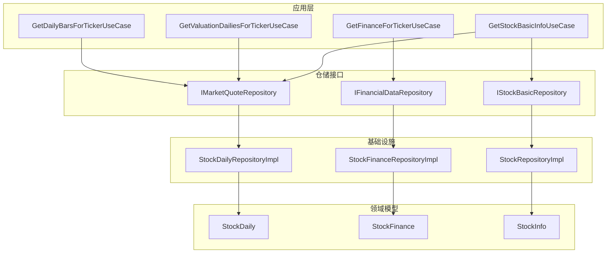
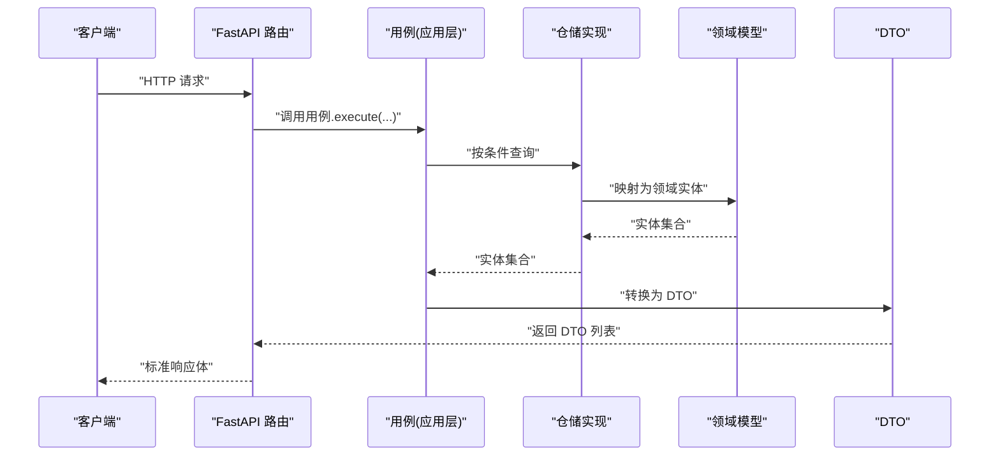
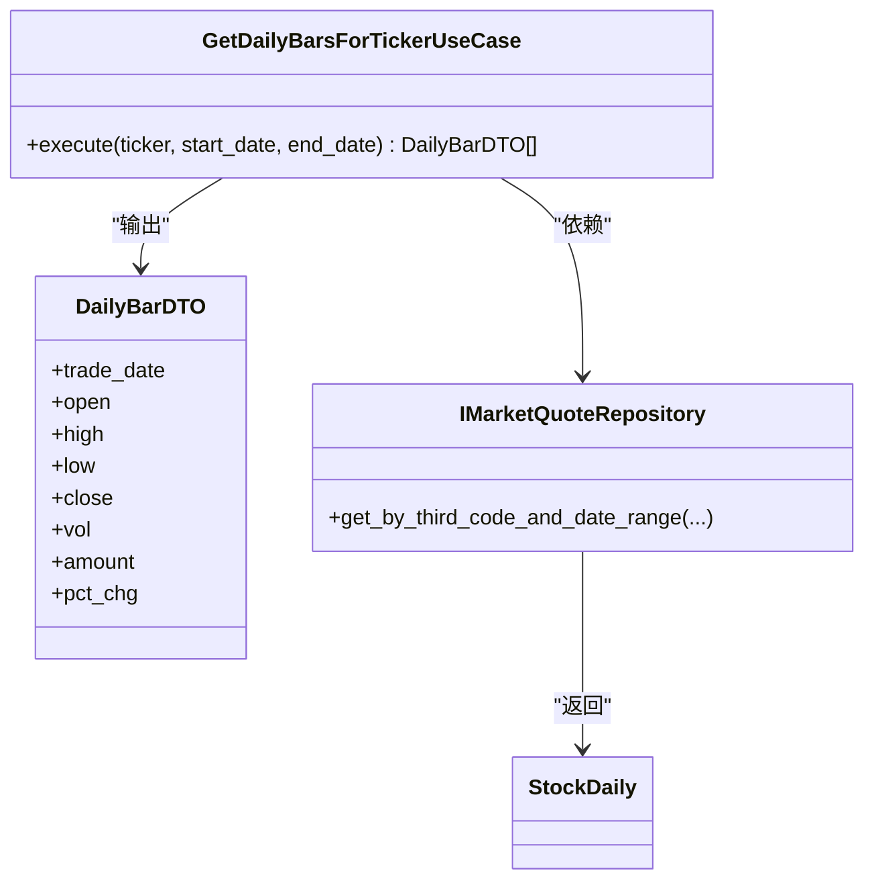
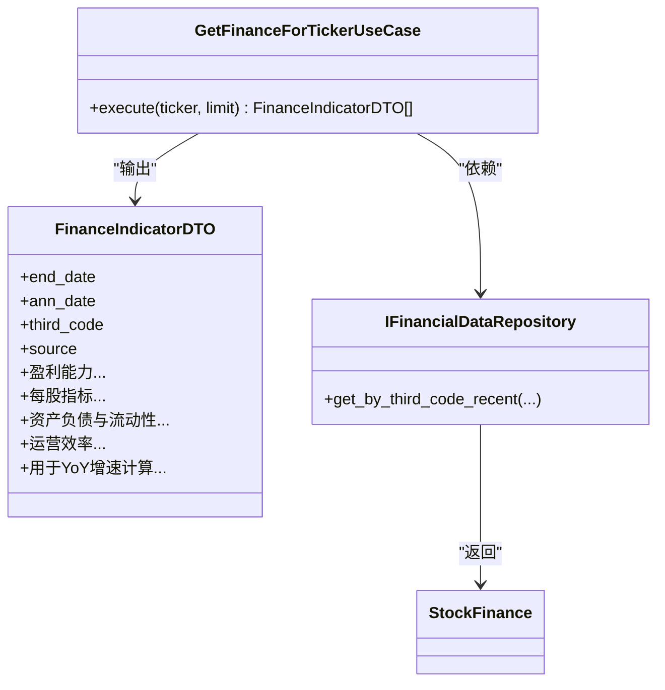
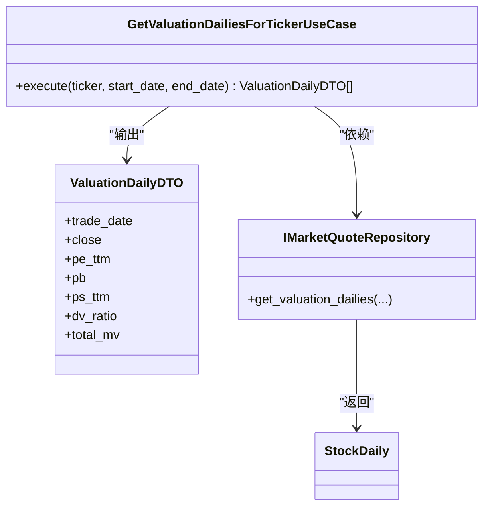
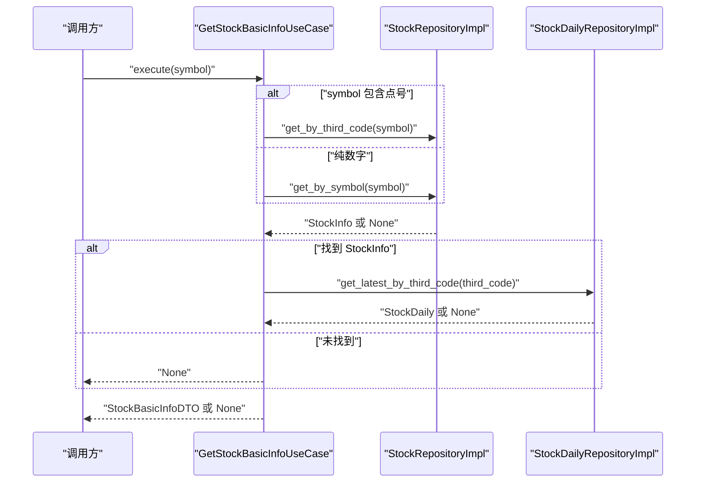
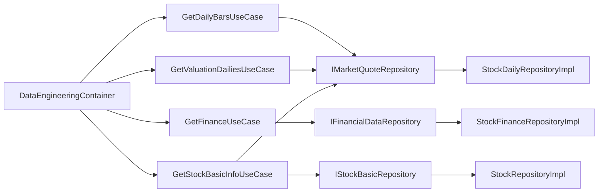
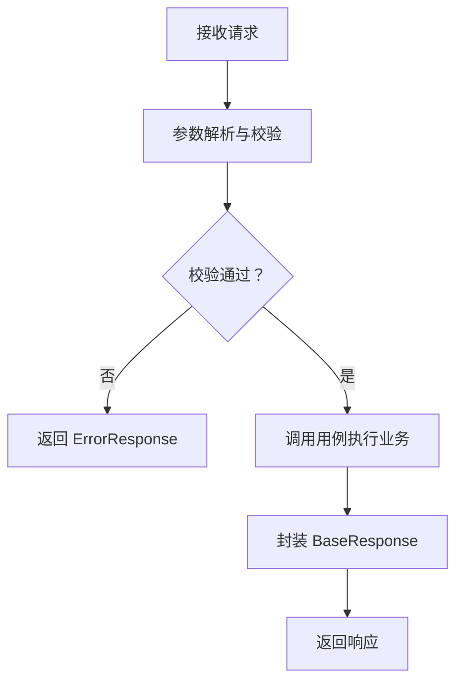

# 查询服务

<cite>
**本文引用的文件**
- [src/modules/data_engineering/application/queries/get_daily_bars_for_ticker.py](file://src/modules/data_engineering/application/queries/get_daily_bars_for_ticker.py)
- [src/modules/data_engineering/application/queries/get_finance_for_ticker.py](file://src/modules/data_engineering/application/queries/get_finance_for_ticker.py)
- [src/modules/data_engineering/application/queries/get_valuation_dailies_for_ticker.py](file://src/modules/data_engineering/application/queries/get_valuation_dailies_for_ticker.py)
- [src/modules/data_engineering/application/queries/get_stock_basic_info.py](file://src/modules/data_engineering/application/queries/get_stock_basic_info.py)
- [src/modules/data_engineering/domain/model/stock_daily.py](file://src/modules/data_engineering/domain/model/stock_daily.py)
- [src/modules/data_engineering/domain/model/financial_report.py](file://src/modules/data_engineering/domain/model/financial_report.py)
- [src/modules/data_engineering/domain/model/stock.py](file://src/modules/data_engineering/domain/model/stock.py)
- [src/modules/data_engineering/container.py](file://src/modules/data_engineering/container.py)
- [src/modules/data_engineering/infrastructure/persistence/repositories/pg_quote_repo.py](file://src/modules/data_engineering/infrastructure/persistence/repositories/pg_quote_repo.py)
- [src/shared/dtos.py](file://src/shared/dtos.py)
- [src/modules/data_engineering/presentation/rest/stock_routes.py](file://src/modules/data_engineering/presentation/rest/stock_routes.py)
- [tests/application/test_get_stock_basic_info.py](file://tests/application/test_get_stock_basic_info.py)
</cite>

## 目录
1. [简介](#简介)
2. [项目结构](#项目结构)
3. [核心组件](#核心组件)
4. [架构总览](#架构总览)
5. [详细组件分析](#详细组件分析)
6. [依赖关系分析](#依赖关系分析)
7. [性能考虑](#性能考虑)
8. [故障排查指南](#故障排查指南)
9. [结论](#结论)
10. [附录](#附录)

## 简介
本文件面向“查询服务”的技术文档，聚焦于以下用例的业务逻辑与数据处理流程：
- GetDailyBarsForTickerUseCase：按标的与日期区间返回日线数据
- GetFinanceForTickerUseCase：按标的返回最近 N 期财务指标数据
- GetValuationDailiesForTickerUseCase：按标的与日期区间返回估值日线数据
- GetStockBasicInfoUseCase：获取股票基础信息与最新行情

文档内容涵盖：
- 查询参数的校验与过滤（时间范围、股票代码）
- 查询结果的数据转换与格式化（DTO 映射）
- 查询性能优化策略（索引、缓存、分页）
- REST API 路由设计（URL 模式、HTTP 方法、响应格式）
- 使用示例与最佳实践

## 项目结构
查询服务位于数据工程模块的应用层，采用 DDD 分层与依赖注入组合根（Composition Root）进行装配。应用层用例通过仓储接口访问领域模型，最终以 DTO 形式对外输出。

图表来源
- [src/modules/data_engineering/application/queries/get_daily_bars_for_ticker.py](file://src/modules/data_engineering/application/queries/get_daily_bars_for_ticker.py#L31-L68)
- [src/modules/data_engineering/application/queries/get_finance_for_ticker.py](file://src/modules/data_engineering/application/queries/get_finance_for_ticker.py#L88-L111)
- [src/modules/data_engineering/application/queries/get_valuation_dailies_for_ticker.py](file://src/modules/data_engineering/application/queries/get_valuation_dailies_for_ticker.py#L33-L69)
- [src/modules/data_engineering/application/queries/get_stock_basic_info.py](file://src/modules/data_engineering/application/queries/get_stock_basic_info.py#L12-L43)
- [src/modules/data_engineering/domain/model/stock_daily.py](file://src/modules/data_engineering/domain/model/stock_daily.py#L6-L42)
- [src/modules/data_engineering/domain/model/financial_report.py](file://src/modules/data_engineering/domain/model/financial_report.py#L6-L117)
- [src/modules/data_engineering/domain/model/stock.py](file://src/modules/data_engineering/domain/model/stock.py#L7-L63)
- [src/modules/data_engineering/infrastructure/persistence/repositories/pg_quote_repo.py](file://src/modules/data_engineering/infrastructure/persistence/repositories/pg_quote_repo.py#L11-L173)
- [src/modules/data_engineering/container.py](file://src/modules/data_engineering/container.py#L32-L59)

章节来源
- [src/modules/data_engineering/container.py](file://src/modules/data_engineering/container.py#L1-L59)

## 核心组件
- 应用用例（UseCases）
  - 日线查询：GetDailyBarsForTickerUseCase
  - 财务查询：GetFinanceForTickerUseCase
  - 估值日线查询：GetValuationDailiesForTickerUseCase
  - 股票基础信息查询：GetStockBasicInfoUseCase
- 领域模型（Entities）
  - 日线：StockDaily
  - 财务：StockFinance
  - 股票基础：StockInfo
- 仓储接口与实现
  - 市场报价仓储接口与实现
  - 财务数据仓储接口与实现
  - 股票基础仓储接口与实现
- 组合根（Container）
  - DataEngineeringContainer：统一装配各用例所需的仓储实例
- 标准响应结构
  - BaseResponse：统一的 API 响应包装

章节来源
- [src/modules/data_engineering/application/queries/get_daily_bars_for_ticker.py](file://src/modules/data_engineering/application/queries/get_daily_bars_for_ticker.py#L31-L68)
- [src/modules/data_engineering/application/queries/get_finance_for_ticker.py](file://src/modules/data_engineering/application/queries/get_finance_for_ticker.py#L88-L111)
- [src/modules/data_engineering/application/queries/get_valuation_dailies_for_ticker.py](file://src/modules/data_engineering/application/queries/get_valuation_dailies_for_ticker.py#L33-L69)
- [src/modules/data_engineering/application/queries/get_stock_basic_info.py](file://src/modules/data_engineering/application/queries/get_stock_basic_info.py#L12-L43)
- [src/modules/data_engineering/domain/model/stock_daily.py](file://src/modules/data_engineering/domain/model/stock_daily.py#L6-L42)
- [src/modules/data_engineering/domain/model/financial_report.py](file://src/modules/data_engineering/domain/model/financial_report.py#L6-L117)
- [src/modules/data_engineering/domain/model/stock.py](file://src/modules/data_engineering/domain/model/stock.py#L7-L63)
- [src/modules/data_engineering/container.py](file://src/modules/data_engineering/container.py#L32-L59)
- [src/shared/dtos.py](file://src/shared/dtos.py#L7-L33)

## 架构总览
查询服务遵循 DDD 分层与依赖倒置原则：
- 应用层用例负责编排业务流程，不直接依赖基础设施
- 领域模型承载业务不变量
- 仓储接口隔离具体持久化实现
- 组合根集中装配依赖，供上层模块调用

图表来源
- [src/modules/data_engineering/application/queries/get_daily_bars_for_ticker.py](file://src/modules/data_engineering/application/queries/get_daily_bars_for_ticker.py#L40-L68)
- [src/modules/data_engineering/application/queries/get_finance_for_ticker.py](file://src/modules/data_engineering/application/queries/get_finance_for_ticker.py#L97-L111)
- [src/modules/data_engineering/application/queries/get_valuation_dailies_for_ticker.py](file://src/modules/data_engineering/application/queries/get_valuation_dailies_for_ticker.py#L42-L69)
- [src/modules/data_engineering/application/queries/get_stock_basic_info.py](file://src/modules/data_engineering/application/queries/get_stock_basic_info.py#L24-L43)
- [src/modules/data_engineering/infrastructure/persistence/repositories/pg_quote_repo.py](file://src/modules/data_engineering/infrastructure/persistence/repositories/pg_quote_repo.py#L50-L173)
- [src/shared/dtos.py](file://src/shared/dtos.py#L7-L33)

## 详细组件分析

### GetDailyBarsForTickerUseCase（日线查询）
- 业务职责
  - 按第三方代码与日期区间查询日线数据
  - 返回按交易日升序排列的日线 DTO 列表
- 关键输入
  - ticker：第三方代码（如 000001.SZ）
  - start_date、end_date：时间范围
- 数据转换
  - 将领域实体 StockDaily 映射为 DailyBarDTO，仅暴露分析所需字段
  - 对缺失或空值字段提供默认值
- 参数校验与过滤
  - 通过仓储查询时已按 third_code 与日期范围过滤
  - 返回结果按 trade_date 升序排序
- 性能要点
  - 仓储查询使用索引列（third_code、trade_date）
  - 结果集按日期升序返回，便于后续处理

图表来源
- [src/modules/data_engineering/application/queries/get_daily_bars_for_ticker.py](file://src/modules/data_engineering/application/queries/get_daily_bars_for_ticker.py#L31-L68)
- [src/modules/data_engineering/domain/model/stock_daily.py](file://src/modules/data_engineering/domain/model/stock_daily.py#L6-L42)
- [src/modules/data_engineering/infrastructure/persistence/repositories/pg_quote_repo.py](file://src/modules/data_engineering/infrastructure/persistence/repositories/pg_quote_repo.py#L50-L82)

章节来源
- [src/modules/data_engineering/application/queries/get_daily_bars_for_ticker.py](file://src/modules/data_engineering/application/queries/get_daily_bars_for_ticker.py#L31-L68)
- [src/modules/data_engineering/infrastructure/persistence/repositories/pg_quote_repo.py](file://src/modules/data_engineering/infrastructure/persistence/repositories/pg_quote_repo.py#L50-L82)

### GetFinanceForTickerUseCase（财务指标查询）
- 业务职责
  - 按第三方代码查询最近 N 期财务指标
  - 返回按报告期 end_date 降序的财务 DTO 列表
- 关键输入
  - ticker：第三方代码
  - limit：返回期数上限，默认 5
- 数据转换
  - 将领域实体 StockFinance 映射为 FinanceIndicatorDTO，仅暴露研究分析所需字段
- 参数校验与过滤
  - 仓储按 third_code 与 limit 进行筛选
  - 返回结果按 end_date 降序排列
- 性能要点
  - 仓储查询需覆盖 third_code 与 end_date 的复合索引
  - DTO 字段精简，减少序列化开销

图表来源
- [src/modules/data_engineering/application/queries/get_finance_for_ticker.py](file://src/modules/data_engineering/application/queries/get_finance_for_ticker.py#L88-L111)
- [src/modules/data_engineering/domain/model/financial_report.py](file://src/modules/data_engineering/domain/model/financial_report.py#L6-L117)

章节来源
- [src/modules/data_engineering/application/queries/get_finance_for_ticker.py](file://src/modules/data_engineering/application/queries/get_finance_for_ticker.py#L88-L111)

### GetValuationDailiesForTickerUseCase（估值日线查询）
- 业务职责
  - 按第三方代码与日期区间查询包含估值字段的日线
  - 返回按交易日升序排列的估值 DTO 列表
- 关键输入
  - ticker：第三方代码
  - start_date、end_date：时间范围
- 数据转换
  - 将领域实体 StockDaily 映射为 ValuationDailyDTO，包含 PE、PB、PS、股息率、总市值等估值指标
- 参数校验与过滤
  - 仓储按 third_code 与日期范围过滤，并返回完整估值字段
  - 结果按 trade_date 升序排序
- 性能要点
  - 仓储查询使用索引列（third_code、trade_date）
  - DTO 字段精简，便于估值分析与分位点计算

图表来源
- [src/modules/data_engineering/application/queries/get_valuation_dailies_for_ticker.py](file://src/modules/data_engineering/application/queries/get_valuation_dailies_for_ticker.py#L33-L69)
- [src/modules/data_engineering/domain/model/stock_daily.py](file://src/modules/data_engineering/domain/model/stock_daily.py#L6-L42)
- [src/modules/data_engineering/infrastructure/persistence/repositories/pg_quote_repo.py](file://src/modules/data_engineering/infrastructure/persistence/repositories/pg_quote_repo.py#L121-L173)

章节来源
- [src/modules/data_engineering/application/queries/get_valuation_dailies_for_ticker.py](file://src/modules/data_engineering/application/queries/get_valuation_dailies_for_ticker.py#L33-L69)
- [src/modules/data_engineering/infrastructure/persistence/repositories/pg_quote_repo.py](file://src/modules/data_engineering/infrastructure/persistence/repositories/pg_quote_repo.py#L121-L173)

### GetStockBasicInfoUseCase（股票基础信息与最新行情）
- 业务职责
  - 根据股票代码获取基础信息与最新行情
  - 支持传入 symbol 或 third_code
- 关键输入
  - symbol：股票代码（如 000001）
- 数据转换
  - 返回聚合 DTO，包含 StockInfo 与可选的最新 StockDaily
- 参数校验与过滤
  - 若包含点号则按 third_code 查询；否则按 symbol 查询
  - 未找到基础信息时不继续查询行情
- 性能要点
  - 两条查询分别命中对应索引
  - DTO 聚合减少往返次数

图表来源
- [src/modules/data_engineering/application/queries/get_stock_basic_info.py](file://src/modules/data_engineering/application/queries/get_stock_basic_info.py#L24-L43)
- [src/modules/data_engineering/domain/model/stock.py](file://src/modules/data_engineering/domain/model/stock.py#L12-L32)
- [src/modules/data_engineering/infrastructure/persistence/repositories/pg_quote_repo.py](file://src/modules/data_engineering/infrastructure/persistence/repositories/pg_quote_repo.py#L84-L112)

章节来源
- [src/modules/data_engineering/application/queries/get_stock_basic_info.py](file://src/modules/data_engineering/application/queries/get_stock_basic_info.py#L12-L43)
- [tests/application/test_get_stock_basic_info.py](file://tests/application/test_get_stock_basic_info.py#L12-L105)

## 依赖关系分析
- 组合根装配
  - DataEngineeringContainer 负责创建各用例实例并注入对应仓储
- 依赖注入链路
  - 应用用例 → 仓储接口 → 基础设施实现 → 数据库模型
- 外部依赖
  - FastAPI 路由层通过依赖注入获取用例实例
  - 标准响应结构统一包装返回数据

图表来源
- [src/modules/data_engineering/container.py](file://src/modules/data_engineering/container.py#L32-L59)
- [src/modules/data_engineering/application/queries/get_daily_bars_for_ticker.py](file://src/modules/data_engineering/application/queries/get_daily_bars_for_ticker.py#L37-L38)
- [src/modules/data_engineering/application/queries/get_finance_for_ticker.py](file://src/modules/data_engineering/application/queries/get_finance_for_ticker.py#L94-L95)
- [src/modules/data_engineering/application/queries/get_valuation_dailies_for_ticker.py](file://src/modules/data_engineering/application/queries/get_valuation_dailies_for_ticker.py#L39-L40)
- [src/modules/data_engineering/application/queries/get_stock_basic_info.py](file://src/modules/data_engineering/application/queries/get_stock_basic_info.py#L16-L22)

章节来源
- [src/modules/data_engineering/container.py](file://src/modules/data_engineering/container.py#L32-L59)

## 性能考虑
- 索引与查询优化
  - 日线查询：按 (third_code, trade_date) 过滤并排序，建议建立复合索引
  - 财务查询：按 third_code 与 end_date 降序取前 N，建议建立复合索引
  - 最新行情查询：按 third_code 降序取第一条，建议在 third_code 上建立索引
- 批量与去重
  - 保存日线时对 (third_code, trade_date) 去重并批量插入，减少冲突更新
- 缓存策略
  - 对热点标的近期行情与财务数据可引入缓存（如 Redis），降低数据库压力
- 分页与限制
  - 财务查询通过 limit 控制返回期数，避免超大数据集
  - 日线查询通过 start_date/end_date 限定时间范围
- DTO 精简
  - 仅暴露分析所需字段，减少序列化体积与网络传输

章节来源
- [src/modules/data_engineering/infrastructure/persistence/repositories/pg_quote_repo.py](file://src/modules/data_engineering/infrastructure/persistence/repositories/pg_quote_repo.py#L15-L48)
- [src/modules/data_engineering/application/queries/get_finance_for_ticker.py](file://src/modules/data_engineering/application/queries/get_finance_for_ticker.py#L97-L111)
- [src/modules/data_engineering/application/queries/get_daily_bars_for_ticker.py](file://src/modules/data_engineering/application/queries/get_daily_bars_for_ticker.py#L40-L68)
- [src/modules/data_engineering/application/queries/get_valuation_dailies_for_ticker.py](file://src/modules/data_engineering/application/queries/get_valuation_dailies_for_ticker.py#L42-L69)

## 故障排查指南
- 常见问题
  - 未找到股票：GetStockBasicInfoUseCase 在未找到基础信息时返回 None
  - 无最新行情：若未获取到最新日线，daily 字段为 None
  - 参数非法：建议在路由层增加参数校验（如日期范围合法性、股票代码格式）
- 日志与异常
  - 路由层记录请求与异常，便于定位问题
- 测试参考
  - 单元测试覆盖成功、未找到、无行情等场景

章节来源
- [tests/application/test_get_stock_basic_info.py](file://tests/application/test_get_stock_basic_info.py#L12-L105)
- [src/modules/data_engineering/presentation/rest/stock_routes.py](file://src/modules/data_engineering/presentation/rest/stock_routes.py#L57-L105)

## 结论
查询服务通过清晰的 DDD 分层与依赖注入，实现了稳定的日线、财务与估值数据查询能力。应用用例专注于业务编排，仓储接口隔离了底层实现细节，统一的 DTO 输出保证了数据格式一致性。结合索引、批量处理与 DTO 精简等优化手段，可在保证性能的同时满足研究分析需求。

## 附录

### REST API 设计（路由与响应）
- 路由与方法
  - POST /sync：同步股票基础列表
  - POST /sync/daily：同步股票日线历史数据
- 请求参数
  - /sync：无参数
  - /sync/daily：limit、offset（用于分页控制）
- 响应格式
  - 统一使用 BaseResponse 包装，data 字段承载具体业务数据
  - 错误响应使用 ErrorResponse

图表来源
- [src/modules/data_engineering/presentation/rest/stock_routes.py](file://src/modules/data_engineering/presentation/rest/stock_routes.py#L57-L105)
- [src/shared/dtos.py](file://src/shared/dtos.py#L7-L33)

章节来源
- [src/modules/data_engineering/presentation/rest/stock_routes.py](file://src/modules/data_engineering/presentation/rest/stock_routes.py#L1-L106)
- [src/shared/dtos.py](file://src/shared/dtos.py#L1-L33)

### 使用示例与最佳实践
- 获取日线数据
  - 输入：ticker（如 000001.SZ）、start_date、end_date
  - 输出：按 trade_date 升序的 DailyBarDTO 列表
  - 建议：限定合理的时间范围，避免跨多年的大查询
- 获取财务数据
  - 输入：ticker、limit（默认 5）
  - 输出：按 end_date 降序的 FinanceIndicatorDTO 列表
  - 建议：根据分析需要调整 limit，避免过多期数影响性能
- 获取估值日线
  - 输入：ticker、start_date、end_date
  - 输出：包含估值指标的 ValuationDailyDTO 列表
  - 建议：仅选择必要的估值字段，减少序列化开销
- 获取股票基础信息与最新行情
  - 输入：symbol（支持 000001 或 000001.SZ）
  - 输出：StockBasicInfoDTO（info + daily）
  - 建议：优先使用 third_code 查询，提高命中率

章节来源
- [src/modules/data_engineering/application/queries/get_daily_bars_for_ticker.py](file://src/modules/data_engineering/application/queries/get_daily_bars_for_ticker.py#L40-L68)
- [src/modules/data_engineering/application/queries/get_finance_for_ticker.py](file://src/modules/data_engineering/application/queries/get_finance_for_ticker.py#L97-L111)
- [src/modules/data_engineering/application/queries/get_valuation_dailies_for_ticker.py](file://src/modules/data_engineering/application/queries/get_valuation_dailies_for_ticker.py#L42-L69)
- [src/modules/data_engineering/application/queries/get_stock_basic_info.py](file://src/modules/data_engineering/application/queries/get_stock_basic_info.py#L24-L43)