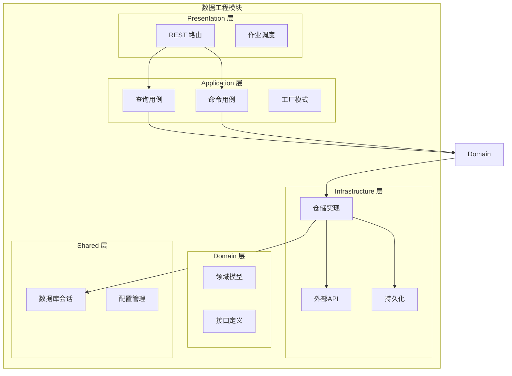
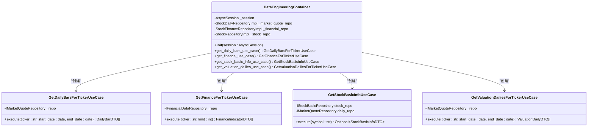
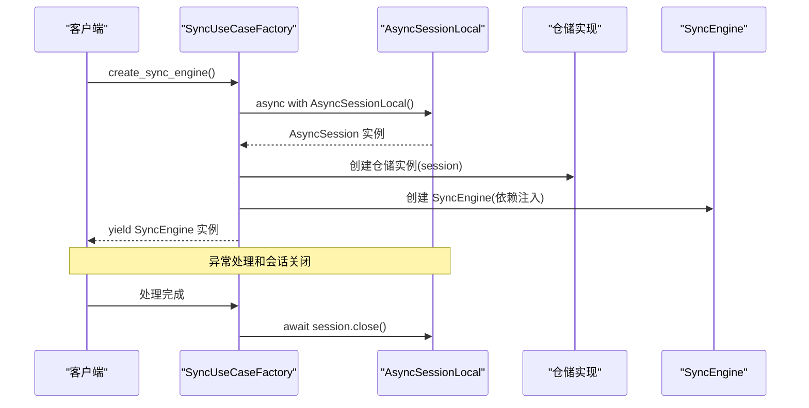
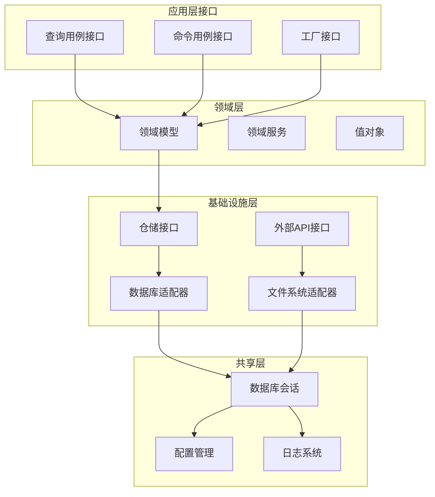
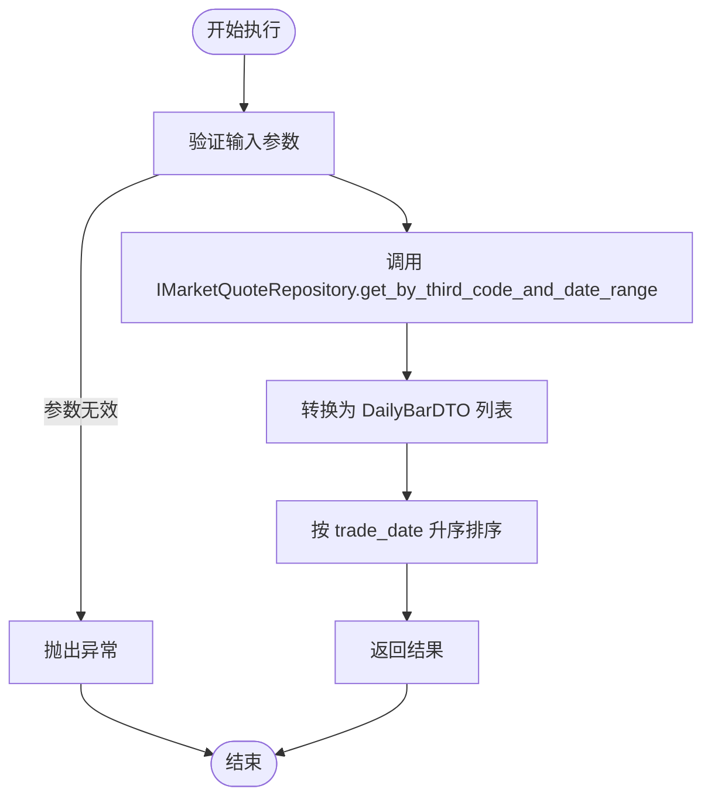
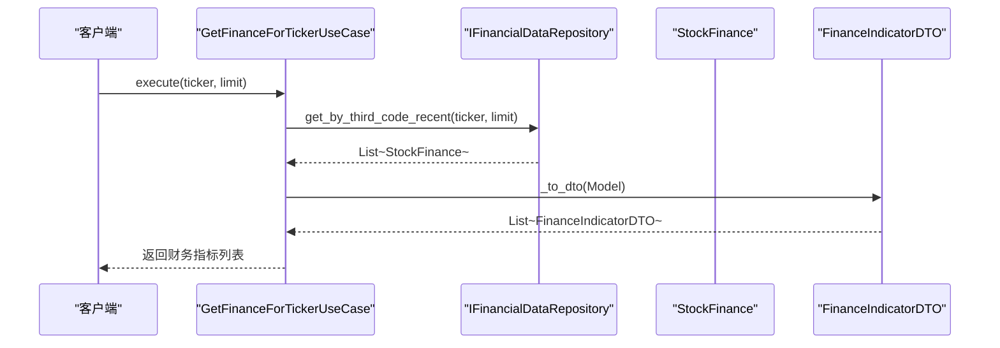
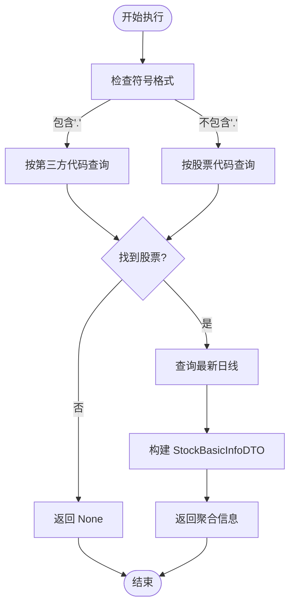
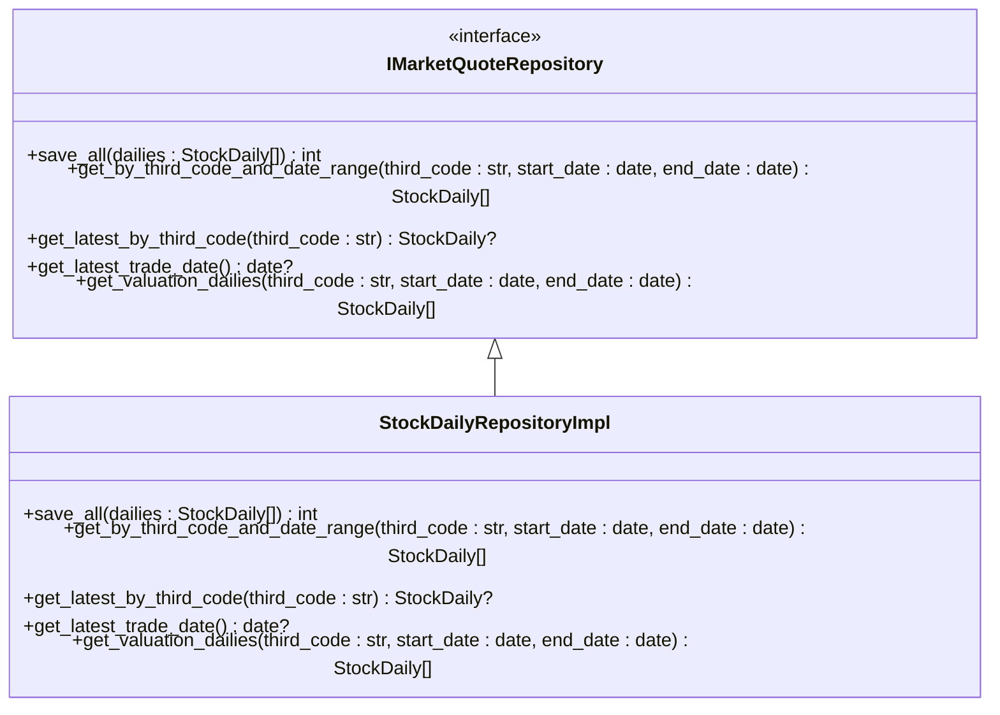
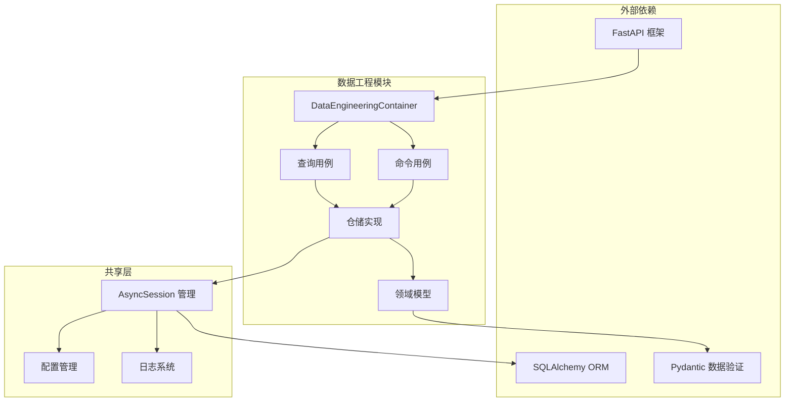

# 模块架构设计

<cite>
**本文档引用的文件**
- [src/modules/data_engineering/container.py](file://src/modules/data_engineering/container.py)
- [src/modules/data_engineering/application/factories/sync_factory.py](file://src/modules/data_engineering/application/factories/sync_factory.py)
- [src/modules/data_engineering/application/queries/get_daily_bars_for_ticker.py](file://src/modules/data_engineering/application/queries/get_daily_bars_for_ticker.py)
- [src/modules/data_engineering/application/queries/get_finance_for_ticker.py](file://src/modules/data_engineering/application/queries/get_finance_for_ticker.py)
- [src/modules/data_engineering/application/queries/get_stock_basic_info.py](file://src/modules/data_engineering/application/queries/get_stock_basic_info.py)
- [src/modules/data_engineering/application/queries/get_valuation_dailies_for_ticker.py](file://src/modules/data_engineering/application/queries/get_valuation_dailies_for_ticker.py)
- [src/modules/data_engineering/domain/ports/repositories/financial_data_repo.py](file://src/modules/data_engineering/domain/ports/repositories/financial_data_repo.py)
- [src/modules/data_engineering/domain/ports/repositories/market_quote_repo.py](file://src/modules/data_engineering/domain/ports/repositories/market_quote_repo.py)
- [src/modules/data_engineering/domain/ports/repositories/stock_basic_repo.py](file://src/modules/data_engineering/domain/ports/repositories/stock_basic_repo.py)
- [src/modules/data_engineering/infrastructure/persistence/repositories/pg_quote_repo.py](file://src/modules/data_engineering/infrastructure/persistence/repositories/pg_quote_repo.py)
- [src/modules/data_engineering/infrastructure/persistence/repositories/pg_finance_repo.py](file://src/modules/data_engineering/infrastructure/persistence/repositories/pg_finance_repo.py)
- [src/modules/data_engineering/infrastructure/persistence/repositories/pg_stock_repo.py](file://src/modules/data_engineering/infrastructure/persistence/repositories/pg_stock_repo.py)
- [src/shared/infrastructure/db/session.py](file://src/shared/infrastructure/db/session.py)
- [src/modules/data_engineering/presentation/rest/stock_routes.py](file://src/modules/data_engineering/presentation/rest/stock_routes.py)
- [src/main.py](file://src/main.py)
</cite>

## 目录
1. [引言](#引言)
2. [项目结构](#项目结构)
3. [核心组件](#核心组件)
4. [架构概览](#架构概览)
5. [详细组件分析](#详细组件分析)
6. [依赖关系分析](#依赖关系分析)
7. [性能考虑](#性能考虑)
8. [故障排除指南](#故障排除指南)
9. [结论](#结论)

## 引言

本文档深入解析数据工程模块的架构设计，重点阐述依赖注入容器（Composition Root）的设计理念与实现原理。该模块采用清晰的分层架构，通过接口隔离仓储实现，确保应用层与基础设施层的解耦。文档将详细说明DataEngineeringContainer的职责和实现机制，展示UseCase工厂模式的应用，以及AsyncSession的注入方式和生命周期管理策略。

## 项目结构

数据工程模块遵循DDD（领域驱动设计）原则，采用清晰的分层架构：

**图表来源**
- [src/modules/data_engineering/container.py](file://src/modules/data_engineering/container.py#L1-L59)
- [src/modules/data_engineering/application/factories/sync_factory.py](file://src/modules/data_engineering/application/factories/sync_factory.py#L1-L115)

**章节来源**
- [src/modules/data_engineering/container.py](file://src/modules/data_engineering/container.py#L1-L59)
- [src/modules/data_engineering/application/factories/sync_factory.py](file://src/modules/data_engineering/application/factories/sync_factory.py#L1-L115)

## 核心组件

### DataEngineeringContainer 依赖注入容器

DataEngineeringContainer是数据工程模块的Composition Root，负责统一管理所有UseCase的依赖装配：

**图表来源**
- [src/modules/data_engineering/container.py](file://src/modules/data_engineering/container.py#L32-L59)
- [src/modules/data_engineering/application/queries/get_daily_bars_for_ticker.py](file://src/modules/data_engineering/application/queries/get_daily_bars_for_ticker.py#L31-L68)
- [src/modules/data_engineering/application/queries/get_finance_for_ticker.py](file://src/modules/data_engineering/application/queries/get_finance_for_ticker.py#L88-L111)
- [src/modules/data_engineering/application/queries/get_stock_basic_info.py](file://src/modules/data_engineering/application/queries/get_stock_basic_info.py#L12-L43)
- [src/modules/data_engineering/application/queries/get_valuation_dailies_for_ticker.py](file://src/modules/data_engineering/application/queries/get_valuation_dailies_for_ticker.py#L33-L69)

DataEngineeringContainer的核心职责包括：

1. **统一依赖管理**：集中管理所有仓储实例的创建和注入
2. **UseCase工厂**：提供多种查询用例的创建方法
3. **生命周期控制**：确保仓储实例与AsyncSession的正确绑定
4. **接口隔离**：对外暴露抽象接口，隐藏具体实现细节

**章节来源**
- [src/modules/data_engineering/container.py](file://src/modules/data_engineering/container.py#L32-L59)

### AsyncSession 注入与生命周期管理

模块采用两种主要的AsyncSession管理策略：

**图表来源**
- [src/modules/data_engineering/application/factories/sync_factory.py](file://src/modules/data_engineering/application/factories/sync_factory.py#L22-L61)

**章节来源**
- [src/modules/data_engineering/application/factories/sync_factory.py](file://src/modules/data_engineering/application/factories/sync_factory.py#L1-L115)
- [src/shared/infrastructure/db/session.py](file://src/shared/infrastructure/db/session.py#L1-L64)

## 架构概览

数据工程模块采用Clean Architecture设计，通过接口隔离实现层与基础设施层的解耦：

**图表来源**
- [src/modules/data_engineering/domain/ports/repositories/market_quote_repo.py](file://src/modules/data_engineering/domain/ports/repositories/market_quote_repo.py#L7-L49)
- [src/modules/data_engineering/domain/ports/repositories/financial_data_repo.py](file://src/modules/data_engineering/domain/ports/repositories/financial_data_repo.py#L7-L18)
- [src/modules/data_engineering/domain/ports/repositories/stock_basic_repo.py](file://src/modules/data_engineering/domain/ports/repositories/stock_basic_repo.py#L6-L30)

## 详细组件分析

### 查询用例详解

#### 日线数据查询用例

GetDailyBarsForTickerUseCase专门负责按标的与日期区间查询日线数据：

**图表来源**
- [src/modules/data_engineering/application/queries/get_daily_bars_for_ticker.py](file://src/modules/data_engineering/application/queries/get_daily_bars_for_ticker.py#L40-L68)

该用例的特点：
- **参数验证**：确保ticker、start_date、end_date的有效性
- **数据转换**：将领域模型转换为DTO，暴露必要的分析字段
- **排序保证**：返回按交易日期升序排列的数据
- **异常处理**：通过容器统一管理依赖，避免直接依赖具体实现

**章节来源**
- [src/modules/data_engineering/application/queries/get_daily_bars_for_ticker.py](file://src/modules/data_engineering/application/queries/get_daily_bars_for_ticker.py#L1-L68)

#### 财务数据查询用例

GetFinanceForTickerUseCase提供按标的查询最近N期财务指标的功能：

**图表来源**
- [src/modules/data_engineering/application/queries/get_finance_for_ticker.py](file://src/modules/data_engineering/application/queries/get_finance_for_ticker.py#L88-L111)

**章节来源**
- [src/modules/data_engineering/application/queries/get_finance_for_ticker.py](file://src/modules/data_engineering/application/queries/get_finance_for_ticker.py#L1-L111)

#### 股票基础信息查询用例

GetStockBasicInfoUseCase整合股票基本信息和最新行情数据：

**图表来源**
- [src/modules/data_engineering/application/queries/get_stock_basic_info.py](file://src/modules/data_engineering/application/queries/get_stock_basic_info.py#L24-L43)

**章节来源**
- [src/modules/data_engineering/application/queries/get_stock_basic_info.py](file://src/modules/data_engineering/application/queries/get_stock_basic_info.py#L1-L43)

### 仓储接口与实现

#### 市场行情仓储接口

IMarketQuoteRepository定义了市场行情数据的访问接口：

**图表来源**
- [src/modules/data_engineering/domain/ports/repositories/market_quote_repo.py](file://src/modules/data_engineering/domain/ports/repositories/market_quote_repo.py#L7-L49)
- [src/modules/data_engineering/infrastructure/persistence/repositories/pg_quote_repo.py](file://src/modules/data_engineering/infrastructure/persistence/repositories/pg_quote_repo.py#L11-L173)

**章节来源**
- [src/modules/data_engineering/domain/ports/repositories/market_quote_repo.py](file://src/modules/data_engineering/domain/ports/repositories/market_quote_repo.py#L1-L49)
- [src/modules/data_engineering/infrastructure/persistence/repositories/pg_quote_repo.py](file://src/modules/data_engineering/infrastructure/persistence/repositories/pg_quote_repo.py#L1-L173)

#### 财务数据仓储接口

IFinancialDataRepository提供财务数据的访问能力：

**章节来源**
- [src/modules/data_engineering/domain/ports/repositories/financial_data_repo.py](file://src/modules/data_engineering/domain/ports/repositories/financial_data_repo.py#L1-L18)
- [src/modules/data_engineering/infrastructure/persistence/repositories/pg_finance_repo.py](file://src/modules/data_engineering/infrastructure/persistence/repositories/pg_finance_repo.py#L1-L54)

#### 股票基础信息仓储接口

IStockBasicRepository定义了股票基础信息的完整接口集：

**章节来源**
- [src/modules/data_engineering/domain/ports/repositories/stock_basic_repo.py](file://src/modules/data_engineering/domain/ports/repositories/stock_basic_repo.py#L1-L30)
- [src/modules/data_engineering/infrastructure/persistence/repositories/pg_stock_repo.py](file://src/modules/data_engineering/infrastructure/persistence/repositories/pg_stock_repo.py#L1-L133)

## 依赖关系分析

模块间的依赖关系体现了清晰的分层架构和依赖倒置原则：

**图表来源**
- [src/modules/data_engineering/container.py](file://src/modules/data_engineering/container.py#L1-L59)
- [src/shared/infrastructure/db/session.py](file://src/shared/infrastructure/db/session.py#L1-L64)

### 依赖注入最佳实践

模块实现了以下依赖注入最佳实践：

1. **接口隔离**：应用层仅依赖抽象接口，不直接依赖具体实现
2. **构造函数注入**：UseCase通过构造函数接收依赖，确保不可变性
3. **生命周期管理**：通过工厂类管理AsyncSession的创建和销毁
4. **异常处理**：统一的异常处理机制，区分业务异常和系统异常

**章节来源**
- [src/modules/data_engineering/application/factories/sync_factory.py](file://src/modules/data_engineering/application/factories/sync_factory.py#L1-L115)
- [src/shared/infrastructure/db/session.py](file://src/shared/infrastructure/db/session.py#L1-L64)

## 性能考虑

### 批处理优化

仓储实现采用了多种性能优化策略：

1. **批量插入**：使用批量大小为1000的分批处理
2. **去重处理**：基于主键字段进行数据去重
3. **冲突解决**：使用ON CONFLICT DO UPDATE处理重复数据
4. **索引优化**：针对常用查询条件建立适当的数据库索引

### 缓存策略

模块建议的缓存策略：
- **短期缓存**：对高频查询结果进行短期缓存
- **LRU缓存**：使用LRU算法管理缓存内存
- **失效策略**：基于TTL的自动失效机制

## 故障排除指南

### 常见问题及解决方案

#### 会话管理问题

**问题**：AsyncSession生命周期管理不当导致的连接泄漏

**解决方案**：
1. 使用工厂类的异步上下文管理器
2. 确保异常情况下会话正确关闭
3. 避免在多个地方手动管理会话

#### 查询性能问题

**问题**：大数据量查询导致的性能瓶颈

**解决方案**：
1. 使用分页查询减少单次查询数据量
2. 为常用查询字段建立数据库索引
3. 优化SQL查询语句和连接条件

#### 数据一致性问题

**问题**：并发写入导致的数据不一致

**解决方案**：
1. 使用数据库事务保证操作原子性
2. 实施适当的锁机制防止竞态条件
3. 采用乐观锁策略处理并发更新

**章节来源**
- [src/modules/data_engineering/application/factories/sync_factory.py](file://src/modules/data_engineering/application/factories/sync_factory.py#L56-L60)
- [src/shared/infrastructure/db/session.py](file://src/shared/infrastructure/db/session.py#L36-L63)

## 结论

数据工程模块的架构设计充分体现了Clean Architecture和依赖注入的最佳实践。通过DataEngineeringContainer作为Composition Root，实现了依赖的集中管理和生命周期控制。UseCase工厂模式确保了应用层与基础设施层的完全解耦，使得模块具有良好的可测试性和可维护性。

该架构的主要优势包括：

1. **清晰的分层结构**：各层职责明确，依赖关系清晰
2. **接口隔离**：通过抽象接口实现松耦合设计
3. **依赖注入**：支持灵活的依赖管理和测试替身
4. **性能优化**：批量处理、去重和索引优化
5. **异常处理**：统一的异常处理机制和日志记录

这种设计为后续功能扩展提供了良好的基础，开发者可以轻松添加新的查询用例和仓储实现，同时保持系统的稳定性和可维护性。