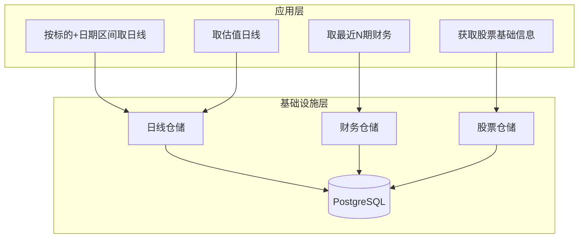
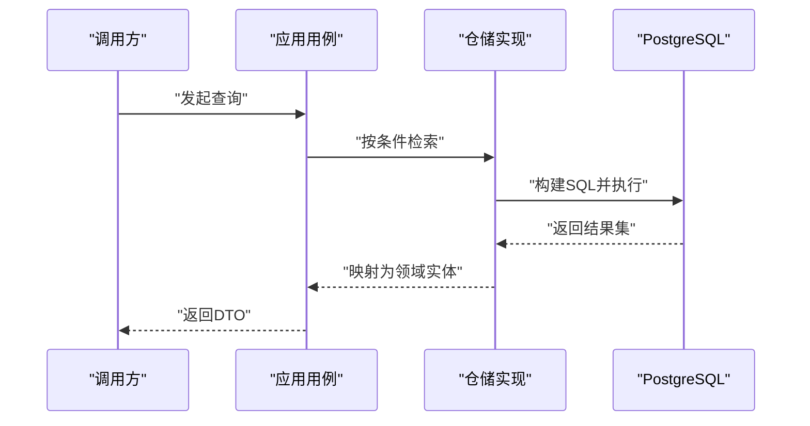
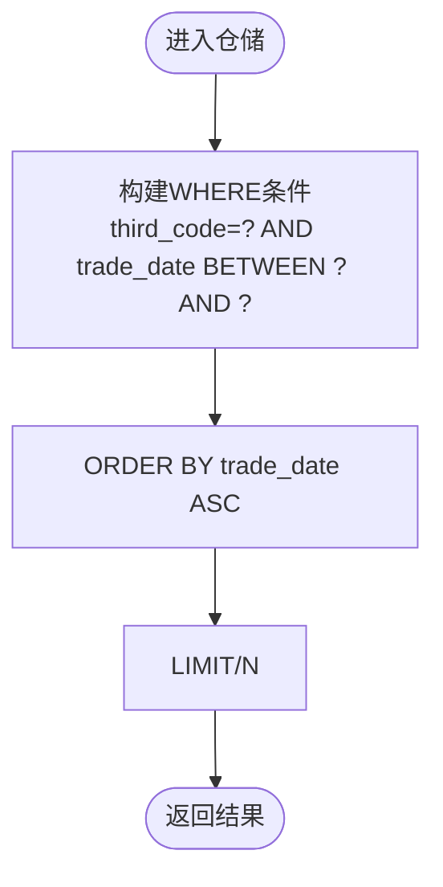
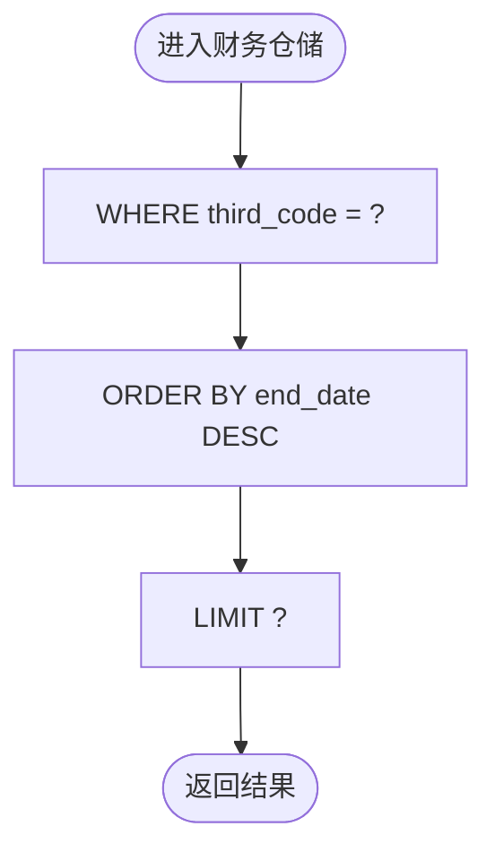
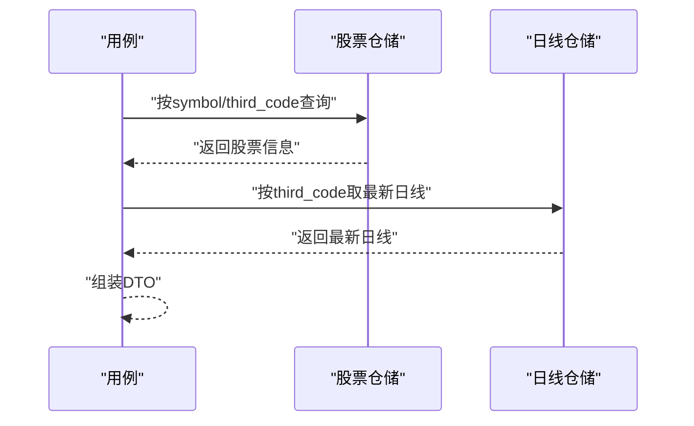
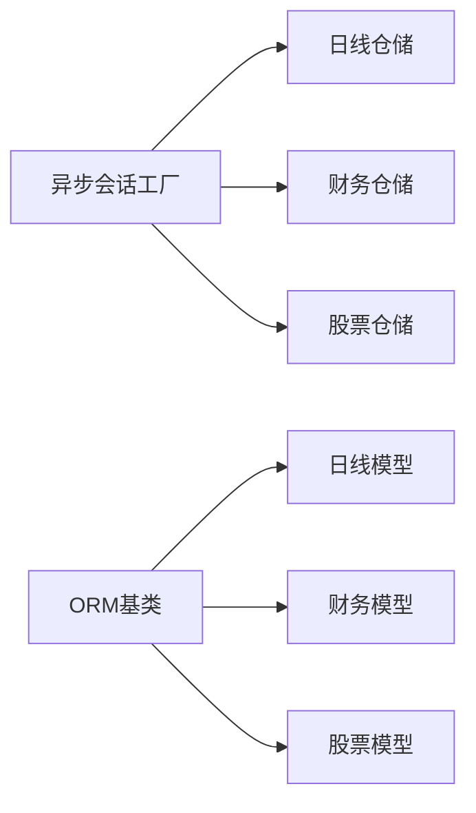

# 数据库性能优化

<cite>
**本文引用的文件**
- [src/shared/infrastructure/db/session.py](file://src/shared/infrastructure/db/session.py)
- [src/shared/infrastructure/db/base.py](file://src/shared/infrastructure/db/base.py)
- [alembic/versions/c0ff00000001_initial_schema.py](file://alembic/versions/c0ff00000001_initial_schema.py)
- [alembic/versions/c0ff00000002_add_sync_tables.py](file://alembic/versions/c0ff00000002_add_sync_tables.py)
- [src/modules/data_engineering/infrastructure/persistence/repositories/pg_quote_repo.py](file://src/modules/data_engineering/infrastructure/persistence/repositories/pg_quote_repo.py)
- [src/modules/data_engineering/infrastructure/persistence/repositories/pg_finance_repo.py](file://src/modules/data_engineering/infrastructure/persistence/repositories/pg_finance_repo.py)
- [src/modules/data_engineering/infrastructure/persistence/repositories/pg_stock_repo.py](file://src/modules/data_engineering/infrastructure/persistence/repositories/pg_stock_repo.py)
- [src/modules/data_engineering/application/queries/get_daily_bars_for_ticker.py](file://src/modules/data_engineering/application/queries/get_daily_bars_for_ticker.py)
- [src/modules/data_engineering/application/queries/get_valuation_dailies_for_ticker.py](file://src/modules/data_engineering/application/queries/get_valuation_dailies_for_ticker.py)
- [src/modules/data_engineering/application/queries/get_finance_for_ticker.py](file://src/modules/data_engineering/application/queries/get_finance_for_ticker.py)
- [src/modules/data_engineering/application/queries/get_stock_basic_info.py](file://src/modules/data_engineering/application/queries/get_stock_basic_info.py)
- [src/modules/data_engineering/domain/model/stock_daily.py](file://src/modules/data_engineering/domain/model/stock_daily.py)
- [src/modules/data_engineering/domain/model/financial_report.py](file://src/modules/data_engineering/domain/model/financial_report.py)
- [src/modules/data_engineering/domain/model/stock.py](file://src/modules/data_engineering/domain/model/stock.py)
</cite>

## 目录
1. [简介](#简介)
2. [项目结构](#项目结构)
3. [核心组件](#核心组件)
4. [架构总览](#架构总览)
5. [详细组件分析](#详细组件分析)
6. [依赖关系分析](#依赖关系分析)
7. [性能考量](#性能考量)
8. [故障排查指南](#故障排查指南)
9. [结论](#结论)
10. [附录](#附录)

## 简介
本文件面向“股票助手”项目，聚焦数据库性能优化，围绕索引设计策略、查询优化技巧、统计信息与查询计划、慢查询日志分析、分区与归档、监控指标与基准测试、容量规划以及具体SQL优化案例展开。内容基于现有数据库模式与查询实现，结合PostgreSQL特性给出可落地的优化建议。

## 项目结构
项目采用分层架构：应用层（UseCases）、领域层（Domain Entities）、基础设施层（Repositories/ORM Models）。数据库访问通过异步SQLAlchemy引擎与会话工厂统一管理，迁移脚本定义了初始表结构与索引。



图表来源
- [src/modules/data_engineering/application/queries/get_daily_bars_for_ticker.py](file://src/modules/data_engineering/application/queries/get_daily_bars_for_ticker.py#L31-L68)
- [src/modules/data_engineering/application/queries/get_valuation_dailies_for_ticker.py](file://src/modules/data_engineering/application/queries/get_valuation_dailies_for_ticker.py#L33-L69)
- [src/modules/data_engineering/application/queries/get_finance_for_ticker.py](file://src/modules/data_engineering/application/queries/get_finance_for_ticker.py#L88-L111)
- [src/modules/data_engineering/application/queries/get_stock_basic_info.py](file://src/modules/data_engineering/application/queries/get_stock_basic_info.py#L12-L43)
- [src/modules/data_engineering/infrastructure/persistence/repositories/pg_quote_repo.py](file://src/modules/data_engineering/infrastructure/persistence/repositories/pg_quote_repo.py#L11-L173)
- [src/modules/data_engineering/infrastructure/persistence/repositories/pg_finance_repo.py](file://src/modules/data_engineering/infrastructure/persistence/repositories/pg_finance_repo.py#L15-L54)
- [src/modules/data_engineering/infrastructure/persistence/repositories/pg_stock_repo.py](file://src/modules/data_engineering/infrastructure/persistence/repositories/pg_stock_repo.py#L12-L133)

章节来源
- [src/shared/infrastructure/db/session.py](file://src/shared/infrastructure/db/session.py#L1-L64)
- [src/shared/infrastructure/db/base.py](file://src/shared/infrastructure/db/base.py#L1-L20)
- [alembic/versions/c0ff00000001_initial_schema.py](file://alembic/versions/c0ff00000001_initial_schema.py#L21-L229)
- [alembic/versions/c0ff00000002_add_sync_tables.py](file://alembic/versions/c0ff00000002_add_sync_tables.py#L21-L67)

## 核心组件
- 异步数据库会话与连接池：统一的异步引擎与会话工厂，开启连接预检测，减少无效连接带来的延迟。
- ORM 基类：统一表名规则，避免硬编码表名。
- 迁移脚本：定义主键、索引与唯一约束，奠定查询优化基础。
- 仓储实现：封装SQL构建、批量写入、去重合并、分页与排序等关键路径。
- 应用用例：面向查询场景的接口，屏蔽仓储细节，保证查询一致性。

章节来源
- [src/shared/infrastructure/db/session.py](file://src/shared/infrastructure/db/session.py#L1-L64)
- [src/shared/infrastructure/db/base.py](file://src/shared/infrastructure/db/base.py#L1-L20)
- [alembic/versions/c0ff00000001_initial_schema.py](file://alembic/versions/c0ff00000001_initial_schema.py#L21-L229)
- [alembic/versions/c0ff00000002_add_sync_tables.py](file://alembic/versions/c0ff00000002_add_sync_tables.py#L21-L67)
- [src/modules/data_engineering/infrastructure/persistence/repositories/pg_quote_repo.py](file://src/modules/data_engineering/infrastructure/persistence/repositories/pg_quote_repo.py#L11-L173)
- [src/modules/data_engineering/infrastructure/persistence/repositories/pg_finance_repo.py](file://src/modules/data_engineering/infrastructure/persistence/repositories/pg_finance_repo.py#L15-L54)
- [src/modules/data_engineering/infrastructure/persistence/repositories/pg_stock_repo.py](file://src/modules/data_engineering/infrastructure/persistence/repositories/pg_stock_repo.py#L12-L133)

## 架构总览
下图展示查询路径与关键索引的对应关系，帮助定位潜在的性能瓶颈与优化机会。



图表来源
- [src/modules/data_engineering/application/queries/get_daily_bars_for_ticker.py](file://src/modules/data_engineering/application/queries/get_daily_bars_for_ticker.py#L31-L68)
- [src/modules/data_engineering/infrastructure/persistence/repositories/pg_quote_repo.py](file://src/modules/data_engineering/infrastructure/persistence/repositories/pg_quote_repo.py#L50-L82)
- [src/modules/data_engineering/application/queries/get_finance_for_ticker.py](file://src/modules/data_engineering/application/queries/get_finance_for_ticker.py#L88-L111)
- [src/modules/data_engineering/infrastructure/persistence/repositories/pg_finance_repo.py](file://src/modules/data_engineering/infrastructure/persistence/repositories/pg_finance_repo.py#L41-L53)
- [src/modules/data_engineering/application/queries/get_stock_basic_info.py](file://src/modules/data_engineering/application/queries/get_stock_basic_info.py#L24-L42)
- [src/modules/data_engineering/infrastructure/persistence/repositories/pg_stock_repo.py](file://src/modules/data_engineering/infrastructure/persistence/repositories/pg_stock_repo.py#L60-L74)

## 详细组件分析

### 日线查询路径与索引匹配
- 查询模式：按第三方代码与日期区间过滤，并按交易日升序返回。
- 现有索引：日线表对第三方代码与交易日期分别建立单列索引；主键为(第三方代码, 交易日期)。
- 优化要点：
  - WHERE条件命中主键前缀或索引覆盖时，可显著降低扫描范围。
  - 若查询常伴随“取最新一条”需求，可考虑在(第三方代码, 交易日期)上增加辅助索引以加速排序与LIMIT。
  - 对于高频范围查询，评估是否需要复合索引(第三方代码, 交易日期)，以减少排序与回表成本。



图表来源
- [src/modules/data_engineering/infrastructure/persistence/repositories/pg_quote_repo.py](file://src/modules/data_engineering/infrastructure/persistence/repositories/pg_quote_repo.py#L50-L82)
- [alembic/versions/c0ff00000001_initial_schema.py](file://alembic/versions/c0ff00000001_initial_schema.py#L52-L85)

章节来源
- [src/modules/data_engineering/infrastructure/persistence/repositories/pg_quote_repo.py](file://src/modules/data_engineering/infrastructure/persistence/repositories/pg_quote_repo.py#L50-L82)
- [alembic/versions/c0ff00000001_initial_schema.py](file://alembic/versions/c0ff00000001_initial_schema.py#L52-L85)

### 财务指标查询路径与索引匹配
- 查询模式：按第三方代码查询最近N期，按报告期(end_date)降序返回。
- 现有索引：财务表对第三方代码、公告日期、报告期分别建立单列索引。
- 优化要点：
  - 若频繁按(第三方代码, end_date)查询，可考虑复合索引以避免排序与回表。
  - LIMIT限制N，建议确保索引能高效支撑“Top-N”场景。



图表来源
- [src/modules/data_engineering/infrastructure/persistence/repositories/pg_finance_repo.py](file://src/modules/data_engineering/infrastructure/persistence/repositories/pg_finance_repo.py#L41-L53)
- [alembic/versions/c0ff00000001_initial_schema.py](file://alembic/versions/c0ff00000001_initial_schema.py#L88-L185)

章节来源
- [src/modules/data_engineering/infrastructure/persistence/repositories/pg_finance_repo.py](file://src/modules/data_engineering/infrastructure/persistence/repositories/pg_finance_repo.py#L41-L53)
- [alembic/versions/c0ff00000001_initial_schema.py](file://alembic/versions/c0ff00000001_initial_schema.py#L88-L185)

### 股票基础信息与多表聚合
- 查询模式：按symbol或third_code查询股票信息，并关联当日日线取最新行情。
- 现有索引：股票表对symbol与third_code建立唯一/非唯一索引。
- 优化要点：
  - 若按symbol查询频繁，确保索引命中；若third_code查询更频繁，优先使用third_code。
  - 聚合查询涉及两次查询，建议在仓储层合并为一次查询（例如JOIN）以减少往返。



图表来源
- [src/modules/data_engineering/application/queries/get_stock_basic_info.py](file://src/modules/data_engineering/application/queries/get_stock_basic_info.py#L24-L42)
- [src/modules/data_engineering/infrastructure/persistence/repositories/pg_stock_repo.py](file://src/modules/data_engineering/infrastructure/persistence/repositories/pg_stock_repo.py#L60-L74)
- [src/modules/data_engineering/infrastructure/persistence/repositories/pg_quote_repo.py](file://src/modules/data_engineering/infrastructure/persistence/repositories/pg_quote_repo.py#L84-L112)

章节来源
- [src/modules/data_engineering/application/queries/get_stock_basic_info.py](file://src/modules/data_engineering/application/queries/get_stock_basic_info.py#L24-L42)
- [alembic/versions/c0ff00000001_initial_schema.py](file://alembic/versions/c0ff00000001_initial_schema.py#L22-L49)

### 同步任务与失败记录查询
- 查询模式：按任务类型与状态筛选，按时间戳排序或限定时间窗口。
- 现有索引：任务表对job_type与status建立索引；失败记录表对job_type、third_code、resolved_at建立索引。
- 优化要点：
  - 对高频筛选字段(job_type/status)建立复合索引，可显著降低过滤成本。
  - 对resolved_at建立索引有利于清理与重试调度。

章节来源
- [alembic/versions/c0ff00000002_add_sync_tables.py](file://alembic/versions/c0ff00000002_add_sync_tables.py#L22-L56)

## 依赖关系分析
- 仓储依赖于SQLAlchemy异步会话，统一由会话工厂提供，确保连接复用与异常处理一致。
- ORM模型由基类统一命名，避免表名硬编码导致的维护成本。
- 查询实现集中在仓储层，应用用例仅负责编排与DTO转换，职责清晰。



图表来源
- [src/shared/infrastructure/db/session.py](file://src/shared/infrastructure/db/session.py#L16-L22)
- [src/shared/infrastructure/db/base.py](file://src/shared/infrastructure/db/base.py#L6-L19)
- [src/modules/data_engineering/infrastructure/persistence/repositories/pg_quote_repo.py](file://src/modules/data_engineering/infrastructure/persistence/repositories/pg_quote_repo.py#L11-L13)
- [src/modules/data_engineering/infrastructure/persistence/repositories/pg_finance_repo.py](file://src/modules/data_engineering/infrastructure/persistence/repositories/pg_finance_repo.py#L15-L12)
- [src/modules/data_engineering/infrastructure/persistence/repositories/pg_stock_repo.py](file://src/modules/data_engineering/infrastructure/persistence/repositories/pg_stock_repo.py#L12-L10)

章节来源
- [src/shared/infrastructure/db/session.py](file://src/shared/infrastructure/db/session.py#L1-L64)
- [src/shared/infrastructure/db/base.py](file://src/shared/infrastructure/db/base.py#L1-L20)

## 性能考量

### 索引设计策略
- 单列索引
  - 适用：高选择性的过滤字段，如股票表的symbol/third_code、日线表的third_code、财务表的third_code。
  - 建议：对高频WHERE条件字段建立单列索引，确保查询能走索引扫描。
- 复合索引
  - 适用：同时出现在WHERE与ORDER BY/LIMIT的字段组合，如日线表(third_code, trade_date)、财务表(third_code, end_date)。
  - 建议：遵循“左前缀原则”，将选择性高的列放在前面；对于“范围+排序”的组合，优先考虑覆盖索引。
- 唯一索引
  - 适用：主键、业务唯一性字段，如股票表的symbol/third_code唯一索引、日线表主键。
  - 建议：唯一索引可替代去重逻辑，减少重复数据与写入冲突。

章节来源
- [alembic/versions/c0ff00000001_initial_schema.py](file://alembic/versions/c0ff00000001_initial_schema.py#L45-L49)
- [alembic/versions/c0ff00000001_initial_schema.py](file://alembic/versions/c0ff00000001_initial_schema.py#L84-L85)
- [alembic/versions/c0ff00000001_initial_schema.py](file://alembic/versions/c0ff00000001_initial_schema.py#L183-L185)
- [alembic/versions/c0ff00000002_add_sync_tables.py](file://alembic/versions/c0ff00000002_add_sync_tables.py#L37-L38)
- [alembic/versions/c0ff00000002_add_sync_tables.py](file://alembic/versions/c0ff00000002_add_sync_tables.py#L53-L55)

### 查询优化技巧
- WHERE条件优化
  - 使用等值过滤优先于范围扫描；尽量让过滤条件命中索引。
  - 对日期范围查询，确保日期字段建立索引并避免函数包裹索引列。
- JOIN优化
  - 聚合查询建议在仓储层合并为一次查询，减少往返与临时结果。
  - 对连接键建立索引，避免笛卡尔积与全表扫描。
- LIMIT使用策略
  - 明确排序字段与方向，配合LIMIT减少结果集大小。
  - 对Top-N查询，优先使用覆盖索引避免回表。

章节来源
- [src/modules/data_engineering/application/queries/get_stock_basic_info.py](file://src/modules/data_engineering/application/queries/get_stock_basic_info.py#L24-L42)
- [src/modules/data_engineering/infrastructure/persistence/repositories/pg_quote_repo.py](file://src/modules/data_engineering/infrastructure/persistence/repositories/pg_quote_repo.py#L50-L82)
- [src/modules/data_engineering/infrastructure/persistence/repositories/pg_finance_repo.py](file://src/modules/data_engineering/infrastructure/persistence/repositories/pg_finance_repo.py#L41-L53)

### 统计信息与查询计划
- 更新统计信息
  - PostgreSQL建议定期更新表/索引统计信息，确保优化器选择最优执行计划。
- 查询计划分析
  - 使用EXPLAIN/EXPLAIN ANALYZE分析关键查询的执行路径，关注是否发生索引扫描、排序、Limit、回表等步骤。
  - 关注I/O与CPU占比，定位热点表与慢查询。

章节来源
- [src/shared/infrastructure/db/session.py](file://src/shared/infrastructure/db/session.py#L8-L13)

### 慢查询日志与瓶颈识别
- 开启慢查询日志
  - 配置慢查询阈值，捕获执行时间超过阈值的SQL。
- 分析步骤
  - 识别慢查询的SQL模板与参数绑定。
  - 结合EXPLAIN分析执行计划，检查索引使用情况与排序成本。
  - 评估是否需要添加索引、调整查询顺序或拆分查询。

章节来源
- [src/shared/infrastructure/db/session.py](file://src/shared/infrastructure/db/session.py#L8-L13)

### 分区表与数据归档
- 分区表策略
  - 按时间分区（如日线表按trade_date分区）可显著降低扫描范围，提升范围查询性能。
  - 对历史数据量巨大的表，建议采用“热/温/冷”三层存储策略：近期数据保持在线，历史数据迁移到低频存储。
- 归档方案
  - 将超过一定周期的历史数据归档到独立表或外部存储，保留查询接口不变。
  - 归档后清理索引冗余，避免维护成本过高。

章节来源
- [alembic/versions/c0ff00000001_initial_schema.py](file://alembic/versions/c0ff00000001_initial_schema.py#L52-L85)

### 监控指标与基准测试
- 监控指标
  - QPS/TPS、P95/P99延迟、连接池利用率、缓存命中率、磁盘IOPS、锁等待时间。
- 基准测试
  - 使用tpcc-like或真实业务负载进行压力测试，评估不同索引与查询模式下的性能表现。
- 容量规划
  - 基于增长趋势与峰值QPS，预留连接池与实例资源，确保在高峰期仍满足SLA。

章节来源
- [src/shared/infrastructure/db/session.py](file://src/shared/infrastructure/db/session.py#L8-L13)

### SQL优化案例与最佳实践
- 案例1：按标的+日期区间取日线
  - 现状：WHERE(third_code, trade_date范围)+ORDER BY(trade_date)+LIMIT。
  - 优化：确保(third_code, trade_date)索引覆盖，必要时添加复合索引以消除排序。
  - 参考路径：[日线仓储查询实现](file://src/modules/data_engineering/infrastructure/persistence/repositories/pg_quote_repo.py#L50-L82)
- 案例2：取最近N期财务指标
  - 现状：WHERE(third_code)+ORDER BY(end_date DESC)+LIMIT。
  - 优化：为(third_code, end_date)建立索引，或使用覆盖索引减少回表。
  - 参考路径：[财务仓储查询实现](file://src/modules/data_engineering/infrastructure/persistence/repositories/pg_finance_repo.py#L41-L53)
- 案例3：股票基础信息+最新日线聚合
  - 现状：两次查询，一次股票信息，一次最新日线。
  - 优化：改写为JOIN一次查询，减少往返与临时结果。
  - 参考路径：[股票仓储与日线仓储](file://src/modules/data_engineering/infrastructure/persistence/repositories/pg_stock_repo.py#L60-L74), [日线仓储](file://src/modules/data_engineering/infrastructure/persistence/repositories/pg_quote_repo.py#L84-L112)
- 案例4：同步任务与失败记录
  - 现状：按job_type/status筛选，按时间戳排序。
  - 优化：为(job_type, status)建立复合索引，为resolved_at建立索引，提升调度与清理效率。
  - 参考路径：[同步任务索引](file://alembic/versions/c0ff00000002_add_sync_tables.py#L37-L38), [失败记录索引](file://alembic/versions/c0ff00000002_add_sync_tables.py#L53-L55)

章节来源
- [src/modules/data_engineering/infrastructure/persistence/repositories/pg_quote_repo.py](file://src/modules/data_engineering/infrastructure/persistence/repositories/pg_quote_repo.py#L50-L82)
- [src/modules/data_engineering/infrastructure/persistence/repositories/pg_finance_repo.py](file://src/modules/data_engineering/infrastructure/persistence/repositories/pg_finance_repo.py#L41-L53)
- [src/modules/data_engineering/infrastructure/persistence/repositories/pg_stock_repo.py](file://src/modules/data_engineering/infrastructure/persistence/repositories/pg_stock_repo.py#L60-L74)
- [alembic/versions/c0ff00000002_add_sync_tables.py](file://alembic/versions/c0ff00000002_add_sync_tables.py#L37-L38)
- [alembic/versions/c0ff00000002_add_sync_tables.py](file://alembic/versions/c0ff00000002_add_sync_tables.py#L53-L55)

## 故障排查指南
- 连接池与会话异常
  - 现象：超时、连接泄漏、事务未提交。
  - 处理：启用pool_pre_ping，确保异常时自动回滚与关闭；在依赖注入中使用上下文管理器。
- 查询缓慢
  - 现象：某SQL执行时间长、锁等待。
  - 处理：使用EXPLAIN分析执行计划，检查索引使用、排序与Limit；必要时添加索引或重构查询。
- 写入冲突
  - 现象：ON CONFLICT更新失败或性能差。
  - 处理：确认唯一键与冲突字段，避免不必要的列更新；批量写入时控制批次大小。

章节来源
- [src/shared/infrastructure/db/session.py](file://src/shared/infrastructure/db/session.py#L36-L63)
- [src/modules/data_engineering/infrastructure/persistence/repositories/pg_quote_repo.py](file://src/modules/data_engineering/infrastructure/persistence/repositories/pg_quote_repo.py#L38-L47)
- [src/modules/data_engineering/infrastructure/persistence/repositories/pg_stock_repo.py](file://src/modules/data_engineering/infrastructure/persistence/repositories/pg_stock_repo.py#L97-L105)

## 结论
通过对现有索引、查询模式与仓储实现的分析，建议优先完善高频查询的复合索引与覆盖索引，合并多表查询减少往返，定期更新统计信息并使用EXPLAIN持续优化执行计划。结合分区与归档策略，可有效应对海量历史数据带来的性能挑战。

## 附录
- 数据模型概览（简化）
```mermaid
erDiagram
STOCK_INFO {
int id PK
string third_code UK
string symbol UK
string name
string industry
string market
date list_date
}
STOCK_DAILY {
string third_code
date trade_date
float open
float close
float vol
float amount
float pe_ttm
float pb
float ps_ttm
date_pkey third_code+trade_date PK
}
STOCK_FINANCE {
string third_code
date ann_date
date end_date
float roe_waa
float roic
float eps
float bps
date_pkey third_code+ann_date+end_date PK
}
STOCK_INFO ||--o{ STOCK_DAILY : "持有"
STOCK_INFO ||--o{ STOCK_FINANCE : "披露"
```

图表来源
- [alembic/versions/c0ff00000001_initial_schema.py](file://alembic/versions/c0ff00000001_initial_schema.py#L22-L49)
- [alembic/versions/c0ff00000001_initial_schema.py](file://alembic/versions/c0ff00000001_initial_schema.py#L52-L85)
- [alembic/versions/c0ff00000001_initial_schema.py](file://alembic/versions/c0ff00000001_initial_schema.py#L88-L185)