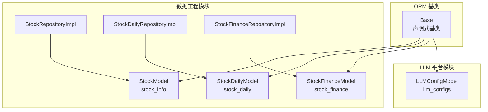
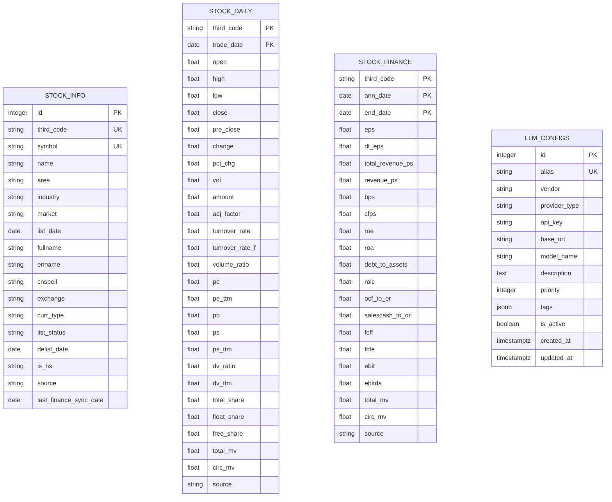
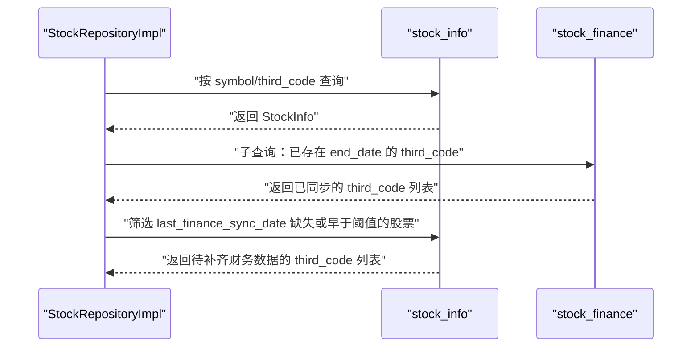
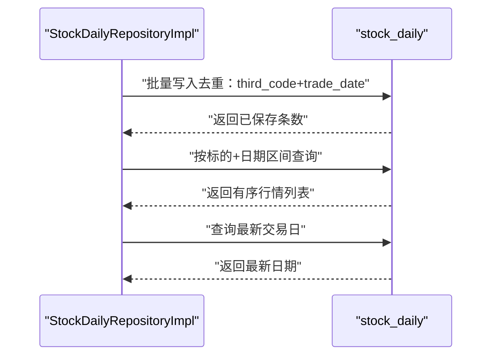
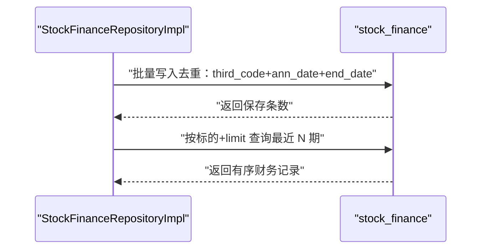
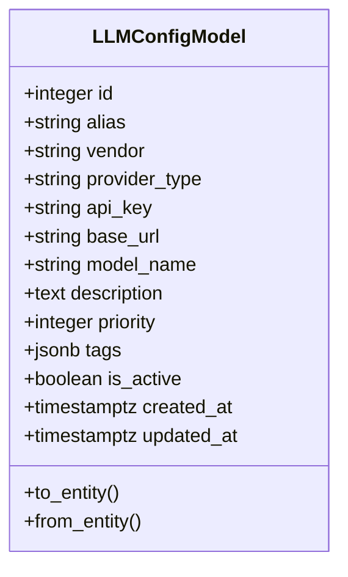
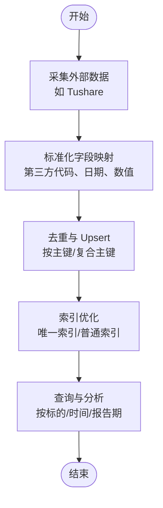

# 数据库表结构

<cite>
**本文引用的文件**
- [src/modules/data_engineering/infrastructure/persistence/models/stock_model.py](file://src/modules/data_engineering/infrastructure/persistence/models/stock_model.py)
- [src/modules/data_engineering/infrastructure/persistence/models/daily_bar_model.py](file://src/modules/data_engineering/infrastructure/persistence/models/daily_bar_model.py)
- [src/modules/data_engineering/infrastructure/persistence/models/finance_model.py](file://src/modules/data_engineering/infrastructure/persistence/models/finance_model.py)
- [src/modules/llm_platform/infrastructure/persistence/models/llm_config_model.py](file://src/modules/llm_platform/infrastructure/persistence/models/llm_config_model.py)
- [alembic/versions/c0ff00000001_initial_schema.py](file://alembic/versions/c0ff00000001_initial_schema.py)
- [alembic/versions/c0ff00000002_add_sync_tables.py](file://alembic/versions/c0ff00000002_add_sync_tables.py)
- [src/shared/infrastructure/db/base.py](file://src/shared/infrastructure/db/base.py)
- [src/modules/data_engineering/infrastructure/persistence/repositories/pg_stock_repo.py](file://src/modules/data_engineering/infrastructure/persistence/repositories/pg_stock_repo.py)
- [src/modules/data_engineering/infrastructure/persistence/repositories/pg_quote_repo.py](file://src/modules/data_engineering/infrastructure/persistence/repositories/pg_quote_repo.py)
- [src/modules/data_engineering/infrastructure/persistence/repositories/pg_finance_repo.py](file://src/modules/data_engineering/infrastructure/persistence/repositories/pg_finance_repo.py)
- [src/modules/data_engineering/domain/model/stock.py](file://src/modules/data_engineering/domain/model/stock.py)
- [src/modules/data_engineering/domain/model/stock_daily.py](file://src/modules/data_engineering/domain/model/stock_daily.py)
</cite>

## 目录
1. [简介](#简介)
2. [项目结构](#项目结构)
3. [核心组件](#核心组件)
4. [架构总览](#架构总览)
5. [详细组件分析](#详细组件分析)
6. [依赖分析](#依赖分析)
7. [性能考虑](#性能考虑)
8. [故障排查指南](#故障排查指南)
9. [结论](#结论)
10. [附录](#附录)

## 简介
本文档系统梳理股票助手项目的核心数据库表结构，重点覆盖以下四张表：
- stock_info：股票基础信息
- stock_daily：日线行情
- stock_finance：财务指标
- llm_configs：大模型配置

内容涵盖字段定义、数据类型、约束条件、注释说明、主键/复合主键设计、索引策略、业务含义、取值范围与验证规则，并结合 Alembic 迁移脚本与仓储层实现，给出表间关系与典型查询路径，帮助开发者快速理解与优化数据模型。

## 项目结构
数据库模型采用 SQLAlchemy 声明式基类统一建模，迁移脚本通过 Alembic 初始化表结构。仓储层封装了常用的数据访问模式（Upsert、去重、批量写入、分页查询等），并与领域模型保持一致的字段语义。

图表来源
- [src/shared/infrastructure/db/base.py](file://src/shared/infrastructure/db/base.py#L6-L19)
- [src/modules/data_engineering/infrastructure/persistence/models/stock_model.py](file://src/modules/data_engineering/infrastructure/persistence/models/stock_model.py#L4-L36)
- [src/modules/data_engineering/infrastructure/persistence/models/daily_bar_model.py](file://src/modules/data_engineering/infrastructure/persistence/models/daily_bar_model.py#L4-L44)
- [src/modules/data_engineering/infrastructure/persistence/models/finance_model.py](file://src/modules/data_engineering/infrastructure/persistence/models/finance_model.py#L4-L117)
- [src/modules/llm_platform/infrastructure/persistence/models/llm_config_model.py](file://src/modules/llm_platform/infrastructure/persistence/models/llm_config_model.py#L6-L59)
- [src/modules/data_engineering/infrastructure/persistence/repositories/pg_stock_repo.py](file://src/modules/data_engineering/infrastructure/persistence/repositories/pg_stock_repo.py#L12-L133)
- [src/modules/data_engineering/infrastructure/persistence/repositories/pg_quote_repo.py](file://src/modules/data_engineering/infrastructure/persistence/repositories/pg_quote_repo.py#L11-L173)
- [src/modules/data_engineering/infrastructure/persistence/repositories/pg_finance_repo.py](file://src/modules/data_engineering/infrastructure/persistence/repositories/pg_finance_repo.py#L15-L54)

章节来源
- [src/shared/infrastructure/db/base.py](file://src/shared/infrastructure/db/base.py#L6-L19)
- [alembic/versions/c0ff00000001_initial_schema.py](file://alembic/versions/c0ff00000001_initial_schema.py#L21-L207)

## 核心组件
本节对四大核心表进行字段级说明，包括字段名、数据类型、约束、注释及业务含义；随后给出主键/复合主键设计与索引策略。

- stock_info（股票基础信息）
  - 主键：id（自增整数）
  - 唯一索引：symbol、third_code
  - 关键字段与注释：third_code（第三方代码）、symbol（股票代码）、name（股票名称）、area（地域）、industry（行业）、market（市场类型）、list_date（上市日期）、fullname/enname/cnspell/exchange/curr_type/list_status/delist_date/is_hs 等扩展属性、source（数据来源）、last_finance_sync_date（上次财务数据同步时间）
  - 业务要点：third_code 与 symbol 均唯一，便于外部系统标识与内部检索；新增字段覆盖交易所、货币、上市状态等维度；source 与 last_finance_sync_date 支持数据来源追踪与财务同步治理

- stock_daily（日线行情）
  - 主键：复合主键（third_code, trade_date）
  - 索引：third_code、trade_date
  - 关键字段与注释：开盘/最高/最低/收盘价、昨收、涨跌额/涨跌幅、成交量/成交额、复权因子、换手率/量比、市盈率/市净率/市销率及其 TTM、股息率、总股本/流通股本/自由流通股本、总市值/流通市值等
  - 业务要点：以第三方代码+交易日构成唯一记录；行情字段丰富，满足技术分析与估值分析需求；source 标记数据来源

- stock_finance（财务指标）
  - 主键：复合主键（third_code, ann_date, end_date）
  - 索引：third_code、ann_date、end_date
  - 关键字段与注释：每股指标（EPS、每股营收等）、盈利能力（毛利率、ROE/ROA 系列）、营运能力（存货/应收账款周转等）、偿债能力（EBIT/利息费用等）、现金流（FCFF/FCFE 等）、财务比率（资产负债率、权益乘数等）
  - 业务要点：以第三方代码+公告日+报告期三元组唯一，确保同公司同报告期多公告场景可区分；字段体系完整覆盖财务分析常用指标

- llm_configs（LLM 配置）
  - 主键：id（自增整数）
  - 唯一索引：alias
  - 关键字段与注释：alias（别名）、vendor（厂商）、provider_type（提供商类型）、api_key、base_url、model_name、description、priority、tags（JSONB）、is_active、created_at/updated_at
  - 业务要点：JSONB 存储标签，支持灵活扩展；唯一别名便于服务路由与选择；优先级与启用状态支持动态切换

章节来源
- [src/modules/data_engineering/infrastructure/persistence/models/stock_model.py](file://src/modules/data_engineering/infrastructure/persistence/models/stock_model.py#L4-L36)
- [src/modules/data_engineering/infrastructure/persistence/models/daily_bar_model.py](file://src/modules/data_engineering/infrastructure/persistence/models/daily_bar_model.py#L4-L44)
- [src/modules/data_engineering/infrastructure/persistence/models/finance_model.py](file://src/modules/data_engineering/infrastructure/persistence/models/finance_model.py#L4-L117)
- [src/modules/llm_platform/infrastructure/persistence/models/llm_config_model.py](file://src/modules/llm_platform/infrastructure/persistence/models/llm_config_model.py#L6-L59)
- [alembic/versions/c0ff00000001_initial_schema.py](file://alembic/versions/c0ff00000001_initial_schema.py#L22-L206)

## 架构总览
下图展示四张核心表的结构与索引设计，映射到实际迁移脚本与 ORM 模型。

图表来源
- [alembic/versions/c0ff00000001_initial_schema.py](file://alembic/versions/c0ff00000001_initial_schema.py#L22-L206)
- [src/modules/data_engineering/infrastructure/persistence/models/stock_model.py](file://src/modules/data_engineering/infrastructure/persistence/models/stock_model.py#L4-L36)
- [src/modules/data_engineering/infrastructure/persistence/models/daily_bar_model.py](file://src/modules/data_engineering/infrastructure/persistence/models/daily_bar_model.py#L4-L44)
- [src/modules/data_engineering/infrastructure/persistence/models/finance_model.py](file://src/modules/data_engineering/infrastructure/persistence/models/finance_model.py#L4-L117)
- [src/modules/llm_platform/infrastructure/persistence/models/llm_config_model.py](file://src/modules/llm_platform/infrastructure/persistence/models/llm_config_model.py#L6-L59)

## 详细组件分析

### stock_info（股票基础信息）
- 设计要点
  - 主键：自增 id，适合内部业务关联与排序
  - 唯一键：third_code、symbol，保证外部标识与内部代码唯一性
  - 扩展字段：交易所、货币、上市状态、退市日期、沪深港通标识等，便于跨市场与监管规则适配
  - 溯源与治理：source 记录数据来源，last_finance_sync_date 记录财务同步状态，支撑增量同步与质量监控
- 索引策略
  - 唯一索引：third_code、symbol
  - 普通索引：industry、market，支持按行业/市场过滤
- 典型查询
  - 按 symbol/third_code 查询单只股票
  - 分页获取股票列表
  - 获取缺失财务数据的股票集合（结合 stock_finance）

图表来源
- [src/modules/data_engineering/infrastructure/persistence/repositories/pg_stock_repo.py](file://src/modules/data_engineering/infrastructure/persistence/repositories/pg_stock_repo.py#L20-L44)
- [src/modules/data_engineering/infrastructure/persistence/models/stock_model.py](file://src/modules/data_engineering/infrastructure/persistence/models/stock_model.py#L4-L36)
- [src/modules/data_engineering/infrastructure/persistence/models/finance_model.py](file://src/modules/data_engineering/infrastructure/persistence/models/finance_model.py#L4-L117)

章节来源
- [src/modules/data_engineering/infrastructure/persistence/models/stock_model.py](file://src/modules/data_engineering/infrastructure/persistence/models/stock_model.py#L4-L36)
- [src/modules/data_engineering/infrastructure/persistence/repositories/pg_stock_repo.py](file://src/modules/data_engineering/infrastructure/persistence/repositories/pg_stock_repo.py#L20-L44)

### stock_daily（日线行情）
- 设计要点
  - 复合主键：(third_code, trade_date)，确保同一标的每日行情唯一
  - 字段丰富：价格、成交量、估值指标（PE/PB/PS 及 TTM）、换手率/量比、复权因子等，满足多维分析
  - 索引：third_code、trade_date，支撑按标的范围与时间范围查询
- 写入策略
  - 批量写入时按复合主键去重，保留后写入记录
  - 支持批量 Upsert，提升导入效率
- 典型查询
  - 指定标的与日期区间的行情序列
  - 最新一条日线
  - 估值分析所需的字段集（含 PE_TTM、PB、PS_TTM、DV_RATIO、总市值等）

图表来源
- [src/modules/data_engineering/infrastructure/persistence/repositories/pg_quote_repo.py](file://src/modules/data_engineering/infrastructure/persistence/repositories/pg_quote_repo.py#L15-L119)
- [src/modules/data_engineering/infrastructure/persistence/models/daily_bar_model.py](file://src/modules/data_engineering/infrastructure/persistence/models/daily_bar_model.py#L4-L44)

章节来源
- [src/modules/data_engineering/infrastructure/persistence/models/daily_bar_model.py](file://src/modules/data_engineering/infrastructure/persistence/models/daily_bar_model.py#L4-L44)
- [src/modules/data_engineering/infrastructure/persistence/repositories/pg_quote_repo.py](file://src/modules/data_engineering/infrastructure/persistence/repositories/pg_quote_repo.py#L15-L173)

### stock_finance（财务指标）
- 设计要点
  - 复合主键：(third_code, ann_date, end_date)，精确标识“同一公司同一报告期”的不同公告
  - 字段体系：覆盖每股指标、盈利能力、营运能力、偿债能力、现金流、财务比率等，满足多场景财务分析
  - 索引：third_code、ann_date、end_date，支撑按公司、公告时间、报告期的高效检索
- 写入策略
  - 去重基于三元组主键，避免重复公告导致的数据膨胀
  - 使用通用 Upsert 封装，简化批量导入逻辑
- 典型查询
  - 指定标的最近 N 期财务记录（按 end_date 降序）
  - 结合 stock_info 的 last_finance_sync_date 与缺失财务数据的股票筛选

图表来源
- [src/modules/data_engineering/infrastructure/persistence/repositories/pg_finance_repo.py](file://src/modules/data_engineering/infrastructure/persistence/repositories/pg_finance_repo.py#L19-L53)
- [src/modules/data_engineering/infrastructure/persistence/models/finance_model.py](file://src/modules/data_engineering/infrastructure/persistence/models/finance_model.py#L4-L117)

章节来源
- [src/modules/data_engineering/infrastructure/persistence/models/finance_model.py](file://src/modules/data_engineering/infrastructure/persistence/models/finance_model.py#L4-L117)
- [src/modules/data_engineering/infrastructure/persistence/repositories/pg_finance_repo.py](file://src/modules/data_engineering/infrastructure/persistence/repositories/pg_finance_repo.py#L19-L53)

### llm_configs（LLM 配置）
- 设计要点
  - 主键：自增 id
  - 唯一键：alias，便于服务侧按别名选择与路由
  - JSONB 字段：tags 支持动态标签管理
  - 时间戳：created_at/updated_at 自动维护
- 典型用途
  - 大模型提供商配置聚合与切换
  - 通过 priority 与 is_active 控制默认与启用策略

图表来源
- [src/modules/llm_platform/infrastructure/persistence/models/llm_config_model.py](file://src/modules/llm_platform/infrastructure/persistence/models/llm_config_model.py#L6-L59)

章节来源
- [src/modules/llm_platform/infrastructure/persistence/models/llm_config_model.py](file://src/modules/llm_platform/infrastructure/persistence/models/llm_config_model.py#L6-L59)

### 概念性总览
下图为概念性流程，展示从数据采集到入库再到查询的典型路径，不绑定具体源码文件。

## 依赖分析
- 组件内聚与耦合
  - 四张核心表分别服务于“基础信息”“日线行情”“财务指标”“LLM 配置”，职责清晰，内聚度高
  - 仓储层对 ORM 模型进行封装，降低上层对 SQL 的直接依赖
- 外部依赖与集成点
  - 外部数据源（如 Tushare）通过转换器映射到领域模型，再由仓储层写入数据库
  - llm_configs 与 LLM 平台路由/适配器配合，实现多提供商切换
- 潜在循环依赖
  - 当前结构未见循环依赖；若未来引入跨模块引用，建议通过接口抽象与依赖注入控制

## 性能考虑
- 主键与索引
  - stock_info：id（主键）、third_code/symbol（唯一）、industry/market（普通索引）——适合按行业/市场过滤与去重
  - stock_daily：复合主键（third_code, trade_date），并建立 third_code、trade_date 普通索引——支撑按标的与时间范围查询
  - stock_finance：复合主键（third_code, ann_date, end_date），并建立 third_code、ann_date、end_date 普通索引——支撑按公司/公告/报告期检索
  - llm_configs：id（主键）、alias（唯一）——便于按别名快速定位
- 写入优化
  - 批量写入时先按主键去重，再执行 Upsert，减少重复写入
  - 批处理大小建议控制在千级别，兼顾内存与吞吐
- 查询优化
  - 按标的+日期范围查询日线时，确保 where 条件命中索引
  - 财务查询按 end_date 降序时，利用索引避免排序开销
- 空值与默认值
  - 数值型字段允许空值，查询侧需注意空值处理与默认填充策略

## 故障排查指南
- 常见问题与定位
  - 插入冲突：检查 third_code/symbol 是否违反唯一约束；确认 Upsert 的 index_elements 是否正确
  - 查询慢：确认 where 条件是否命中索引；避免在索引列上使用函数或隐式转换
  - 财务缺失：结合 stock_info.last_finance_sync_date 与 stock_finance 的 end_date 做交叉校验
- 排查步骤
  - 核对迁移脚本与实际表结构一致性
  - 检查仓储层 Upsert 逻辑与去重策略
  - 验证外部数据转换器字段映射是否完整
- 相关实现参考
  - Upsert 与去重策略：参见各仓储层的批量写入方法
  - 缺失财务数据筛选：参见 stock_info 与 stock_finance 的联合查询

章节来源
- [src/modules/data_engineering/infrastructure/persistence/repositories/pg_stock_repo.py](file://src/modules/data_engineering/infrastructure/persistence/repositories/pg_stock_repo.py#L20-L44)
- [src/modules/data_engineering/infrastructure/persistence/repositories/pg_quote_repo.py](file://src/modules/data_engineering/infrastructure/persistence/repositories/pg_quote_repo.py#L15-L48)
- [src/modules/data_engineering/infrastructure/persistence/repositories/pg_finance_repo.py](file://src/modules/data_engineering/infrastructure/persistence/repositories/pg_finance_repo.py#L19-L39)

## 结论
本项目数据库表结构围绕“股票基础信息、日线行情、财务指标、LLM 配置”四大主题展开，采用复合主键与合理索引设计，既满足高频查询需求，又便于外部数据源的标准化接入与 Upsert 写入。通过仓储层抽象与迁移脚本，整体具备良好的可维护性与演进空间。建议在后续扩展中继续遵循“字段语义明确、索引策略清晰、写入去重严格”的原则，持续优化查询与写入性能。

## 附录
- 字段对应关系（简要）
  - stock_info：third_code/symbol/name/area/industry/market/list_date 等
  - stock_daily：third_code/trade_date/open/high/low/close/pre_close/change/pct_chg/vol/amount/adj_factor 及估值字段
  - stock_finance：third_code/ann_date/end_date 及各类财务指标
  - llm_configs：alias/vendor/provider_type/api_key/base_url/model_name/tags/priority/is_active