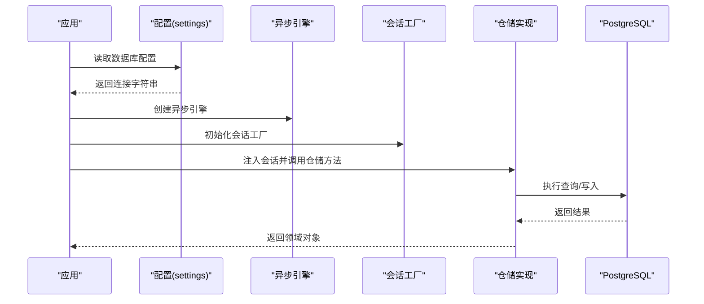
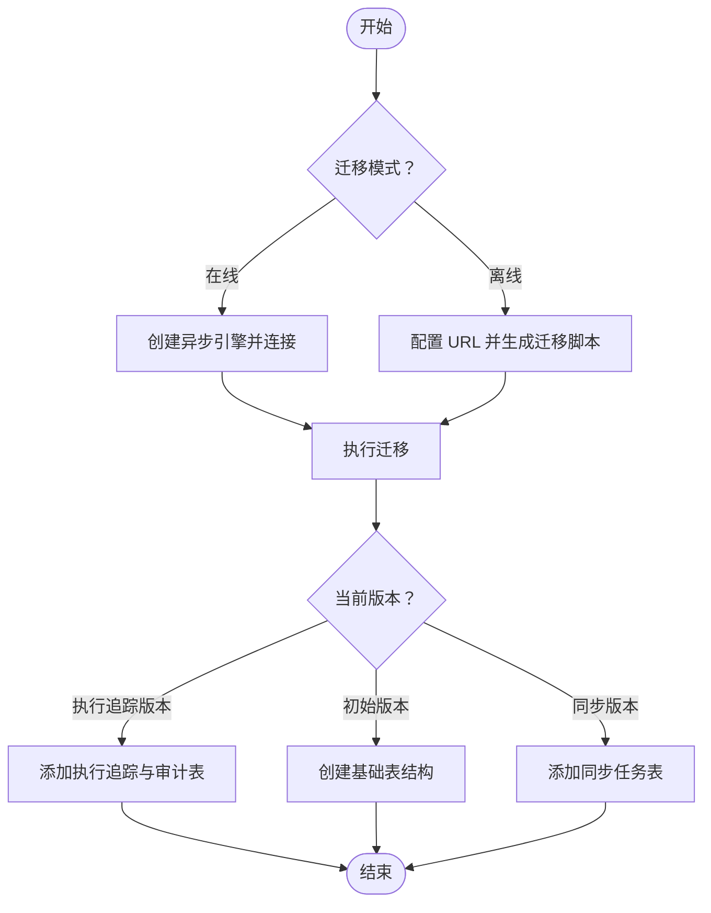
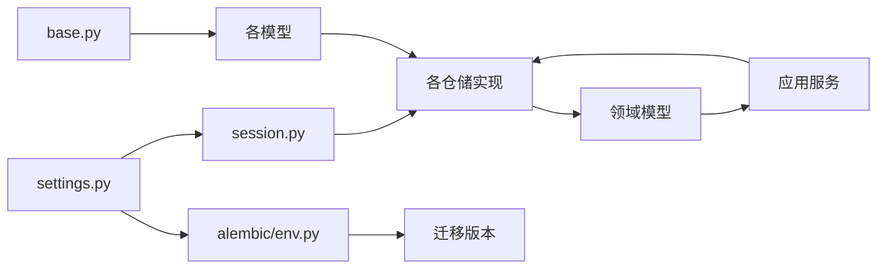

# 数据库设计

<cite>
**本文引用的文件**
- [src/shared/infrastructure/db/base.py](file://src/shared/infrastructure/db/base.py)
- [src/shared/infrastructure/db/session.py](file://src/shared/infrastructure/db/session.py)
- [src/shared/config.py](file://src/shared/config.py)
- [alembic/env.py](file://alembic/env.py)
- [alembic/script.py.mako](file://alembic/script.py.mako)
- [alembic/versions/c0ff00000001_initial_schema.py](file://alembic/versions/c0ff00000001_initial_schema.py)
- [alembic/versions/c0ff00000002_add_sync_tables.py](file://alembic/versions/c0ff00000002_add_sync_tables.py)
- [alembic/versions/c0ff00000003_execution_tracking_and_reports.py](file://alembic/versions/c0ff00000003_execution_tracking_and_reports.py)
- [src/modules/data_engineering/infrastructure/persistence/models/stock_model.py](file://src/modules/data_engineering/infrastructure/persistence/models/stock_model.py)
- [src/modules/data_engineering/infrastructure/persistence/models/daily_bar_model.py](file://src/modules/data_engineering/infrastructure/persistence/models/daily_bar_model.py)
- [src/modules/data_engineering/infrastructure/persistence/models/finance_model.py](file://src/modules/data_engineering/infrastructure/persistence/models/finance_model.py)
- [src/modules/data_engineering/infrastructure/persistence/models/sync_task_model.py](file://src/modules/data_engineering/infrastructure/persistence/models/sync_task_model.py)
- [src/modules/data_engineering/infrastructure/persistence/models/sync_failure_model.py](file://src/modules/data_engineering/infrastructure/persistence/models/sync_failure_model.py)
- [src/modules/llm_platform/infrastructure/persistence/models/llm_config_model.py](file://src/modules/llm_platform/infrastructure/persistence/models/llm_config_model.py)
- [src/modules/llm_platform/infrastructure/persistence/models/llm_call_log_model.py](file://src/modules/llm_platform/infrastructure/persistence/models/llm_call_log_model.py)
- [src/shared/infrastructure/persistence/external_api_call_log_model.py](file://src/shared/infrastructure/persistence/external_api_call_log_model.py)
- [src/modules/coordinator/infrastructure/persistence/research_session_model.py](file://src/modules/coordinator/infrastructure/persistence/research_session_model.py)
- [src/modules/coordinator/infrastructure/persistence/node_execution_model.py](file://src/modules/coordinator/infrastructure/persistence/node_execution_model.py)
- [src/modules/data_engineering/infrastructure/persistence/repositories/pg_stock_repo.py](file://src/modules/data_engineering/infrastructure/persistence/repositories/pg_stock_repo.py)
- [src/modules/data_engineering/infrastructure/persistence/repositories/pg_quote_repo.py](file://src/modules/data_engineering/infrastructure/persistence/repositories/pg_quote_repo.py)
- [src/modules/data_engineering/infrastructure/persistence/repositories/pg_finance_repo.py](file://src/modules/data_engineering/infrastructure/persistence/repositories/pg_finance_repo.py)
- [src/modules/data_engineering/infrastructure/persistence/repositories/pg_sync_task_repo.py](file://src/modules/data_engineering/infrastructure/persistence/repositories/pg_sync_task_repo.py)
- [src/modules/llm_platform/infrastructure/persistence/repositories/llm_call_log_repository.py](file://src/modules/llm_platform/infrastructure/persistence/repositories/llm_call_log_repository.py)
- [src/shared/infrastructure/persistence/external_api_call_log_repository.py](file://src/shared/infrastructure/persistence/external_api_call_log_repository.py)
- [src/modules/coordinator/infrastructure/persistence/research_session_repository.py](file://src/modules/coordinator/infrastructure/persistence/research_session_repository.py)
</cite>

## 更新摘要
**所做更改**
- 新增研究会话与节点执行跟踪表结构分析
- 新增LLM调用审计与外部API调用日志表结构分析
- 更新数据库迁移管理机制，包含执行追踪版本
- 扩展实体关系图，展示新增表之间的关联关系
- 更新索引设计策略，涵盖新增表的查询优化

## 目录
1. [简介](#简介)
2. [项目结构](#项目结构)
3. [核心组件](#核心组件)
4. [架构总览](#架构总览)
5. [详细组件分析](#详细组件分析)
6. [依赖分析](#依赖分析)
7. [性能考虑](#性能考虑)
8. [故障排查指南](#故障排查指南)
9. [结论](#结论)
10. [附录](#附录)

## 简介
本文件面向"股票助手"项目，系统化阐述数据库层的设计与实现，覆盖以下方面：
- 数据库架构与表结构：股票信息、日线行情、财务指标、同步任务、执行追踪与审计日志
- 核心数据模型关系：主键、唯一索引、复合主键与外键约束
- 迁移管理机制：Alembic 配置、版本控制与升级策略
- 连接池与事务：异步引擎、会话工厂、异常处理与回滚策略
- 索引与查询优化：索引设计、查询路径与性能建议
- 数据访问模式：仓储模式、批量写入、冲突处理与去重
- 数据一致性与并发控制：冲突更新、幂等写入、任务状态机
- 备份恢复、监控告警与故障处理最佳实践
- Schema 图与实体关系图，帮助开发者快速理解数据结构

## 项目结构
数据库相关代码主要分布在以下位置：
- 配置与连接：共享配置与异步会话工厂
- ORM 基类与模型：声明式基类与各模块模型
- 迁移：Alembic 版本脚本与运行环境
- 仓储：PostgreSQL 仓储实现，封装批量写入、冲突处理与查询

```mermaid
graph TB
subgraph "配置与连接"
CFG["配置(settings)<br/>src/shared/config.py"]
SES["异步会话工厂<br/>src/shared/infrastructure/db/session.py"]
BASE["ORM 基类<br/>src/shared/infrastructure/db/base.py"]
end
subgraph "数据工程模块"
M_STOCK["股票模型<br/>stock_model.py"]
M_DAILY["日线模型<br/>daily_bar_model.py"]
M_FIN["财务模型<br/>finance_model.py"]
M_TASK["同步任务模型<br/>sync_task_model.py"]
M_FAIL["失败记录模型<br/>sync_failure_model.py"]
R_STOCK["股票仓储<br/>pg_stock_repo.py"]
R_DAILY["日线仓储<br/>pg_quote_repo.py"]
R_FIN["财务仓储<br/>pg_finance_repo.py"]
R_TASK["同步任务仓储<br/>pg_sync_task_repo.py"]
end
subgraph "LLM 平台模块"
M_LLM["LLM 配置模型<br/>llm_config_model.py"]
M_LLM_LOG["LLM 调用日志模型<br/>llm_call_log_model.py"]
R_LLM_LOG["LLM 调用日志仓储<br/>llm_call_log_repository.py"]
end
subgraph "协调器模块"
M_SESSION["研究会话模型<br/>research_session_model.py"]
M_NODE_EXEC["节点执行模型<br/>node_execution_model.py"]
R_SESSION["研究会话仓储<br/>research_session_repository.py"]
end
subgraph "共享模块"
M_EXT_API_LOG["外部API调用日志模型<br/>external_api_call_log_model.py"]
R_EXT_API_LOG["外部API调用日志仓储<br/>external_api_call_log_repository.py"]
end
subgraph "迁移"
A_ENV["Alembic 环境<br/>alembic/env.py"]
A_VER1["初始版本<br/>c0ff00000001_initial_schema.py"]
A_VER2["新增同步表版本<br/>c0ff00000002_add_sync_tables.py"]
A_VER3["执行追踪版本<br/>c0ff00000003_execution_tracking_and_reports.py"]
end
CFG --> SES
BASE --> M_STOCK
BASE --> M_DAILY
BASE --> M_FIN
BASE --> M_TASK
BASE --> M_FAIL
BASE --> M_LLM
BASE --> M_LLM_LOG
BASE --> M_SESSION
BASE --> M_NODE_EXEC
BASE --> M_EXT_API_LOG
R_STOCK --> M_STOCK
R_DAILY --> M_DAILY
R_FIN --> M_FIN
R_TASK --> M_TASK
R_TASK --> M_FAIL
R_LLM_LOG --> M_LLM_LOG
R_SESSION --> M_SESSION
R_SESSION --> M_NODE_EXEC
R_EXT_API_LOG --> M_EXT_API_LOG
A_ENV --> A_VER1
A_ENV --> A_VER2
A_ENV --> A_VER3
```



**图表来源**
- [src/shared/config.py](file://src/shared/config.py#L34-L58)
- [src/shared/infrastructure/db/session.py](file://src/shared/infrastructure/db/session.py#L8-L22)
- [src/shared/infrastructure/db/base.py](file://src/shared/infrastructure/db/base.py#L6-L19)
- [src/modules/data_engineering/infrastructure/persistence/models/stock_model.py](file://src/modules/data_engineering/infrastructure/persistence/models/stock_model.py#L4-L36)
- [src/modules/data_engineering/infrastructure/persistence/models/daily_bar_model.py](file://src/modules/data_engineering/infrastructure/persistence/models/daily_bar_model.py#L4-L44)
- [src/modules/data_engineering/infrastructure/persistence/models/finance_model.py](file://src/modules/data_engineering/infrastructure/persistence/models/finance_model.py#L4-L117)
- [src/modules/data_engineering/infrastructure/persistence/models/sync_task_model.py](file://src/modules/data_engineering/infrastructure/persistence/models/sync_task_model.py#L8-L26)
- [src/modules/data_engineering/infrastructure/persistence/models/sync_failure_model.py](file://src/modules/data_engineering/infrastructure/persistence/models/sync_failure_model.py#L8-L24)
- [src/modules/llm_platform/infrastructure/persistence/models/llm_config_model.py](file://src/modules/llm_platform/infrastructure/persistence/models/llm_config_model.py#L6-L22)
- [src/modules/llm_platform/infrastructure/persistence/models/llm_call_log_model.py](file://src/modules/llm_platform/infrastructure/persistence/models/llm_call_log_model.py#L11-L33)
- [src/modules/coordinator/infrastructure/persistence/research_session_model.py](file://src/modules/coordinator/infrastructure/persistence/research_session_model.py#L11-L25)
- [src/modules/coordinator/infrastructure/persistence/node_execution_model.py](file://src/modules/coordinator/infrastructure/persistence/node_execution_model.py#L11-L33)
- [src/shared/infrastructure/persistence/external_api_call_log_model.py](file://src/shared/infrastructure/persistence/external_api_call_log_model.py#L13-L29)
- [alembic/env.py](file://alembic/env.py#L34-L87)
- [alembic/versions/c0ff00000001_initial_schema.py](file://alembic/versions/c0ff00000001_initial_schema.py#L22-L229)
- [alembic/versions/c0ff00000002_add_sync_tables.py](file://alembic/versions/c0ff00000002_add_sync_tables.py#L21-L67)
- [alembic/versions/c0ff00000003_execution_tracking_and_reports.py](file://alembic/versions/c0ff00000003_execution_tracking_and_reports.py#L21-L127)

**章节来源**
- [src/shared/config.py](file://src/shared/config.py#L34-L58)
- [src/shared/infrastructure/db/session.py](file://src/shared/infrastructure/db/session.py#L8-L22)
- [src/shared/infrastructure/db/base.py](file://src/shared/infrastructure/db/base.py#L6-L19)
- [alembic/env.py](file://alembic/env.py#L34-L87)

## 核心组件
本节概述数据库层的核心组成与职责：
- 配置与连接
  - 数据库连接字符串由配置模块组装，采用异步驱动
  - 异步引擎与会话工厂负责连接池与生命周期管理
  - 会话工厂开启预检与对象过期策略，确保异步场景下的稳定性
- ORM 基类
  - 统一的声明式基类，自动推导表名，减少重复代码
- 模型与迁移
  - 初始版本包含股票信息、日线行情、财务指标、LLM 配置
  - 同步版本新增同步任务与失败记录表
  - 执行追踪版本新增研究会话、节点执行、LLM调用日志和外部API调用日志表
- 仓储实现
  - 封装批量写入、冲突更新、去重与查询
  - 提供任务状态管理、执行追踪与审计日志查询

**章节来源**
- [src/shared/config.py](file://src/shared/config.py#L34-L58)
- [src/shared/infrastructure/db/session.py](file://src/shared/infrastructure/db/session.py#L8-L22)
- [src/shared/infrastructure/db/base.py](file://src/shared/infrastructure/db/base.py#L6-L19)
- [alembic/versions/c0ff00000001_initial_schema.py](file://alembic/versions/c0ff00000001_initial_schema.py#L22-L229)
- [alembic/versions/c0ff00000002_add_sync_tables.py](file://alembic/versions/c0ff00000002_add_sync_tables.py#L21-L67)
- [alembic/versions/c0ff00000003_execution_tracking_and_reports.py](file://alembic/versions/c0ff00000003_execution_tracking_and_reports.py#L21-L127)

## 架构总览
数据库层整体采用"配置-引擎-会话-仓储-模型"的分层架构，结合 Alembic 进行版本化迁移。



**图表来源**
- [src/shared/config.py](file://src/shared/config.py#L34-L58)
- [src/shared/infrastructure/db/session.py](file://src/shared/infrastructure/db/session.py#L8-L22)
- [src/modules/data_engineering/infrastructure/persistence/repositories/pg_stock_repo.py](file://src/modules/data_engineering/infrastructure/persistence/repositories/pg_stock_repo.py#L93-L105)

## 详细组件分析

### 数据库表结构与字段定义
本项目数据库包含以下核心表：

- 股票信息（stock_info）
  - 主键：id
  - 唯一索引：symbol、third_code
  - 关键字段：third_code、symbol、name、area、industry、market、list_date、list_status、delist_date、is_hs、source、last_finance_sync_date
  - 约束：非空字段覆盖关键标识与状态字段；唯一索引保障去重
- 日线行情（stock_daily）
  - 复合主键：third_code、trade_date
  - 索引：third_code、trade_date
  - 关键字段：OHLCV、adj_factor、各类估值与市值指标、source
  - 约束：主键组合确保同标的同日唯一
- 财务指标（stock_finance）
  - 复合主键：third_code、ann_date、end_date
  - 索引：third_code、ann_date、end_date
  - 关键字段：EPS、盈利能力、营运能力、偿债能力、现金流、财务比率等
  - 约束：主键组合确保同一标的同一报告期唯一
- 同步任务（sync_tasks）
  - 主键：id（UUID）
  - 索引：job_type、status
  - 关键字段：任务类型、状态、偏移量、批次大小、进度、时间戳、配置（JSON）
  - 约束：枚举化状态与类型，JSON 存储动态配置
- 同步失败记录（sync_failure_records）
  - 主键：id（UUID）
  - 索引：job_type、third_code、resolved_at
  - 关键字段：任务类型、股票代码、错误信息、重试计数、最大重试、时间戳、解决时间
  - 约束：重试上限与解决状态
- LLM 配置（llm_configs）
  - 主键：id
  - 唯一索引：alias
  - 关键字段：别名、供应商、提供商类型、API 密钥、基础地址、模型名、描述、优先级、标签（JSONB）、激活状态、时间戳
  - 约束：唯一别名，布尔与JSONB字段
- 研究会话（research_sessions）
  - 主键：id（UUID）
  - 索引：symbol、created_at（复合索引）
  - 关键字段：symbol、status、selected_experts（JSONB）、options（JSONB）、trigger_source、created_at、completed_at、duration_ms
  - 约束：状态枚举化，JSONB存储专家列表与执行选项
- 节点执行（node_executions）
  - 主键：id（UUID）
  - 索引：session_id（外键索引）
  - 关键字段：session_id（外键）、node_type、status、result_data（JSONB）、narrative_report、error_type、error_message、started_at、completed_at、duration_ms
  - 约束：外键约束级联删除，状态枚举化
- LLM 调用日志（llm_call_logs）
  - 主键：id（UUID）
  - 索引：session_id、created_at（复合索引）
  - 关键字段：session_id、caller_module、caller_agent、model_name、vendor、prompt_text、system_message、completion_text、token统计、temperature、latency_ms、status、error_message、created_at
  - 约束：可为空的session_id支持无上下文调用，JSONB存储token统计
- 外部API调用日志（external_api_call_logs）
  - 主键：id（UUID）
  - 索引：session_id、created_at（复合索引）
  - 关键字段：session_id、service_name、operation、request_params（JSONB）、response_data、status_code、latency_ms、status、error_message、created_at
  - 约束：JSONB存储请求参数，支持无session_id的全局调用

**章节来源**
- [alembic/versions/c0ff00000001_initial_schema.py](file://alembic/versions/c0ff00000001_initial_schema.py#L22-L229)
- [alembic/versions/c0ff00000002_add_sync_tables.py](file://alembic/versions/c0ff00000002_add_sync_tables.py#L21-L67)
- [alembic/versions/c0ff00000003_execution_tracking_and_reports.py](file://alembic/versions/c0ff00000003_execution_tracking_and_reports.py#L21-L127)
- [src/modules/llm_platform/infrastructure/persistence/models/llm_config_model.py](file://src/modules/llm_platform/infrastructure/persistence/models/llm_config_model.py#L6-L22)
- [src/modules/coordinator/infrastructure/persistence/research_session_model.py](file://src/modules/coordinator/infrastructure/persistence/research_session_model.py#L11-L25)
- [src/modules/coordinator/infrastructure/persistence/node_execution_model.py](file://src/modules/coordinator/infrastructure/persistence/node_execution_model.py#L11-L33)
- [src/modules/llm_platform/infrastructure/persistence/models/llm_call_log_model.py](file://src/modules/llm_platform/infrastructure/persistence/models/llm_call_log_model.py#L11-L33)
- [src/shared/infrastructure/persistence/external_api_call_log_model.py](file://src/shared/infrastructure/persistence/external_api_call_log_model.py#L13-L29)

### 数据模型类与关系
ORM 模型均继承统一基类，自动推导表名，避免重复命名。

```mermaid
classDiagram
class Base {
<<declarative_base>>
+__tablename__
}
class StockModel {
+id : Integer(PK)
+third_code : String(Unique)
+symbol : String(Unique)
+name : String
+industry : String(Index)
+market : String(Index)
+source : String
+last_finance_sync_date : Date
}
class StockDailyModel {
+third_code : String(PK, Index)
+trade_date : Date(PK, Index)
+open : Float
+close : Float
+... : ...
+source : String
}
class StockFinanceModel {
+third_code : String(PK, Index)
+ann_date : Date(PK, Index)
+end_date : Date(PK, Index)
+... : ...
+source : String
}
class SyncTaskModel {
+id : UUID(PK)
+job_type : String(Index)
+status : String(Index)
+config : JSON
}
class SyncFailureRecordModel {
+id : UUID(PK)
+job_type : String(Index)
+third_code : String(Index)
+retry_count : Integer
+max_retries : Integer
+resolved_at : DateTime(Index)
}
class LLMConfigModel {
+id : Integer(PK)
+alias : String(Unique)
+vendor : String
+tags : JSONB
+is_active : Boolean
}
class ResearchSessionModel {
+id : UUID(PK)
+symbol : String(Index)
+status : String
+selected_experts : JSONB
+options : JSONB
+trigger_source : String
+created_at : DateTime(Index)
+completed_at : DateTime
+duration_ms : Integer
}
class NodeExecutionModel {
+id : UUID(PK)
+session_id : UUID(FK)
+node_type : String
+status : String(Index)
+result_data : JSONB
+narrative_report : Text
+error_type : String
+error_message : Text
+started_at : DateTime
+completed_at : DateTime
+duration_ms : Integer
}
class LLMCallLogModel {
+id : UUID(PK)
+session_id : UUID(Index)
+caller_module : String
+caller_agent : String
+model_name : String
+vendor : String
+prompt_text : Text
+system_message : Text
+completion_text : Text
+prompt_tokens : Integer
+completion_tokens : Integer
+total_tokens : Integer
+temperature : Float
+latency_ms : Integer
+status : String
+error_message : Text
+created_at : DateTime
}
class ExternalAPICallLogModel {
+id : UUID(PK)
+session_id : UUID(Index)
+service_name : String
+operation : String
+request_params : JSONB
+response_data : Text
+status_code : Integer
+latency_ms : Integer
+status : String
+error_message : Text
+created_at : DateTime
}
Base <|-- StockModel
Base <|-- StockDailyModel
Base <|-- StockFinanceModel
Base <|-- SyncTaskModel
Base <|-- SyncFailureRecordModel
Base <|-- LLMConfigModel
Base <|-- ResearchSessionModel
Base <|-- NodeExecutionModel
Base <|-- LLMCallLogModel
Base <|-- ExternalAPICallLogModel
```



**图表来源**
- [src/shared/infrastructure/db/base.py](file://src/shared/infrastructure/db/base.py#L6-L19)
- [src/modules/data_engineering/infrastructure/persistence/models/stock_model.py](file://src/modules/data_engineering/infrastructure/persistence/models/stock_model.py#L4-L36)
- [src/modules/data_engineering/infrastructure/persistence/models/daily_bar_model.py](file://src/modules/data_engineering/infrastructure/persistence/models/daily_bar_model.py#L4-L44)
- [src/modules/data_engineering/infrastructure/persistence/models/finance_model.py](file://src/modules/data_engineering/infrastructure/persistence/models/finance_model.py#L4-L117)
- [src/modules/data_engineering/infrastructure/persistence/models/sync_task_model.py](file://src/modules/data_engineering/infrastructure/persistence/models/sync_task_model.py#L8-L26)
- [src/modules/data_engineering/infrastructure/persistence/models/sync_failure_model.py](file://src/modules/data_engineering/infrastructure/persistence/models/sync_failure_model.py#L8-L24)
- [src/modules/llm_platform/infrastructure/persistence/models/llm_config_model.py](file://src/modules/llm_platform/infrastructure/persistence/models/llm_config_model.py#L6-L22)
- [src/modules/coordinator/infrastructure/persistence/research_session_model.py](file://src/modules/coordinator/infrastructure/persistence/research_session_model.py#L11-L25)
- [src/modules/coordinator/infrastructure/persistence/node_execution_model.py](file://src/modules/coordinator/infrastructure/persistence/node_execution_model.py#L11-L33)
- [src/modules/llm_platform/infrastructure/persistence/models/llm_call_log_model.py](file://src/modules/llm_platform/infrastructure/persistence/models/llm_call_log_model.py#L11-L33)
- [src/shared/infrastructure/persistence/external_api_call_log_model.py](file://src/shared/infrastructure/persistence/external_api_call_log_model.py#L13-L29)

### 核心数据模型关系
- 股票信息与日线行情：通过 third_code 建立一对多关系（一个股票对应多个交易日）
- 股票信息与财务指标：通过 third_code 建立一对多关系（一个股票对应多个报告期）
- 同步任务与失败记录：通过 job_type 与 third_code 关联，用于追踪任务执行状态与失败明细
- LLM 配置：独立表，服务于 LLM 平台模块
- 研究会话与节点执行：通过 session_id 建立一对多关系（一个会话包含多个节点执行）
- LLM调用日志与外部API调用日志：都通过 session_id 关联到研究会话，支持执行上下文追踪

```mermaid
erDiagram
STOCK_INFO {
int id PK
string third_code UK
string symbol UK
string industry IDX
string market IDX
date list_date
string list_status
date delist_date
string is_hs
date last_finance_sync_date
}
STOCK_DAILY {
string third_code PK
date trade_date PK
float open
float close
float adj_factor
float pe_ttm
float pb
float total_mv
string source
}
STOCK_FINANCE {
string third_code PK
date ann_date PK
date end_date PK
float eps
float roe
float debt_to_assets
string source
}
SYNC_TASKS {
uuid id PK
string job_type IDX
string status IDX
int current_offset
int batch_size
int total_processed
datetime started_at
datetime updated_at
datetime completed_at
json config
}
SYNC_FAILURE_RECORDS {
uuid id PK
string job_type IDX
string third_code IDX
string error_message
int retry_count
int max_retries
datetime last_attempt_at
datetime resolved_at IDX
}
LLM_CONFIGS {
int id PK
string alias UK
string vendor
jsonb tags
boolean is_active
}
RESEARCH_SESSIONS {
uuid id PK
string symbol IDX
string status
jsonb selected_experts
jsonb options
string trigger_source
datetime created_at IDX
datetime completed_at
int duration_ms
}
NODE_EXECUTIONS {
uuid id PK
uuid session_id FK
string node_type
string status IDX
jsonb result_data
text narrative_report
string error_type
text error_message
datetime started_at
datetime completed_at
int duration_ms
}
LLM_CALL_LOGS {
uuid id PK
uuid session_id IDX
string caller_module
string caller_agent
string model_name
string vendor
text prompt_text
text system_message
text completion_text
int prompt_tokens
int completion_tokens
int total_tokens
float temperature
int latency_ms
string status
text error_message
datetime created_at
}
EXTERNAL_API_CALL_LOGS {
uuid id PK
uuid session_id IDX
string service_name
string operation
jsonb request_params
text response_data
int status_code
int latency_ms
string status
text error_message
datetime created_at
}
STOCK_INFO ||--o{ STOCK_DAILY : "third_code"
STOCK_INFO ||--o{ STOCK_FINANCE : "third_code"
SYNC_TASKS ||--o{ SYNC_FAILURE_RECORDS : "job_type/third_code"
RESEARCH_SESSIONS ||--o{ NODE_EXECUTIONS : "id/session_id"
NODE_EXECUTIONS ||--|| LLM_CALL_LOGS : "session_id"
NODE_EXECUTIONS ||--|| EXTERNAL_API_CALL_LOGS : "session_id"
```

**图表来源**
- [alembic/versions/c0ff00000001_initial_schema.py](file://alembic/versions/c0ff00000001_initial_schema.py#L22-L229)
- [alembic/versions/c0ff00000002_add_sync_tables.py](file://alembic/versions/c0ff00000002_add_sync_tables.py#L21-L67)
- [alembic/versions/c0ff00000003_execution_tracking_and_reports.py](file://alembic/versions/c0ff00000003_execution_tracking_and_reports.py#L21-L127)
- [src/modules/llm_platform/infrastructure/persistence/models/llm_config_model.py](file://src/modules/llm_platform/infrastructure/persistence/models/llm_config_model.py#L6-L22)
- [src/modules/coordinator/infrastructure/persistence/research_session_model.py](file://src/modules/coordinator/infrastructure/persistence/research_session_model.py#L11-L25)
- [src/modules/coordinator/infrastructure/persistence/node_execution_model.py](file://src/modules/coordinator/infrastructure/persistence/node_execution_model.py#L11-L33)
- [src/modules/llm_platform/infrastructure/persistence/models/llm_call_log_model.py](file://src/modules/llm_platform/infrastructure/persistence/models/llm_call_log_model.py#L11-L33)
- [src/shared/infrastructure/persistence/external_api_call_log_model.py](file://src/shared/infrastructure/persistence/external_api_call_log_model.py#L13-L29)

### 数据库迁移管理机制
- Alembic 环境
  - 从应用配置读取数据库连接 URL
  - 在线/离线两种迁移模式，支持异步引擎
  - 注册目标元数据，包含各模块模型
- 迁移版本
  - 初始版本：创建 stock_info、stock_daily、stock_finance、llm_configs 表及索引
  - 同步版本：创建 sync_tasks、sync_failure_records 表及索引
  - 执行追踪版本：创建 research_sessions、node_executions、llm_call_logs、external_api_call_logs 表及索引
- 升级策略
  - 通过版本链路顺序升级，保持向后兼容
  - 使用 ON CONFLICT DO UPDATE 实现幂等写入，避免重复迁移
  - 支持回滚到历史版本，确保数据安全



**图表来源**
- [alembic/env.py](file://alembic/env.py#L38-L93)
- [alembic/versions/c0ff00000001_initial_schema.py](file://alembic/versions/c0ff00000001_initial_schema.py#L21-L229)
- [alembic/versions/c0ff00000002_add_sync_tables.py](file://alembic/versions/c0ff00000002_add_sync_tables.py#L21-L67)
- [alembic/versions/c0ff00000003_execution_tracking_and_reports.py](file://alembic/versions/c0ff00000003_execution_tracking_and_reports.py#L21-L127)

**章节来源**
- [alembic/env.py](file://alembic/env.py#L34-L87)
- [alembic/script.py.mako](file://alembic/script.py.mako#L1-L25)
- [alembic/versions/c0ff00000001_initial_schema.py](file://alembic/versions/c0ff00000001_initial_schema.py#L21-L229)
- [alembic/versions/c0ff00000002_add_sync_tables.py](file://alembic/versions/c0ff00000002_add_sync_tables.py#L21-L67)
- [alembic/versions/c0ff00000003_execution_tracking_and_reports.py](file://alembic/versions/c0ff00000003_execution_tracking_and_reports.py#L21-L127)

### 数据库连接池配置、事务管理与并发控制
- 连接池与引擎
  - 使用异步驱动，启用连接预检，提高连接可用性
  - 会话工厂设置对象过期策略，适配异步生命周期
- 事务与异常处理
  - 会话生成器在异常时区分客户端错误与系统错误，非客户端错误显式回滚
  - 会话关闭时自动回滚未提交事务，避免资源泄漏
- 并发控制
  - 通过索引与主键约束保证唯一性
  - 批量写入采用 ON CONFLICT DO UPDATE，避免重复写入引发的并发冲突
  - 外键约束确保参照完整性，级联删除保证数据一致性

**章节来源**
- [src/shared/infrastructure/db/session.py](file://src/shared/infrastructure/db/session.py#L8-L22)
- [src/shared/infrastructure/db/session.py](file://src/shared/infrastructure/db/session.py#L36-L63)

### 索引设计策略与查询优化
- 索引策略
  - 股票信息：id、symbol、third_code（唯一）、industry、market
  - 日线行情：third_code、trade_date（复合主键）
  - 财务指标：third_code、ann_date、end_date（复合主键）
  - 同步任务：job_type、status
  - 同步失败记录：job_type、third_code、resolved_at
  - LLM 配置：id、alias（唯一）
  - 研究会话：symbol、created_at（复合索引）
  - 节点执行：session_id（外键索引）
  - LLM调用日志：session_id、created_at（复合索引）
  - 外部API调用日志：session_id、created_at（复合索引）
- 查询优化建议
  - 使用复合主键作为唯一标识，避免额外索引
  - 对高频过滤字段建立二级索引（如 stock_info.industry、stock_info.market）
  - 批量写入时先去重再插入，减少冲突与锁竞争
  - 分页查询与范围查询配合索引，避免全表扫描
  - 利用JSONB字段的索引能力进行结构化数据查询

**章节来源**
- [alembic/versions/c0ff00000001_initial_schema.py](file://alembic/versions/c0ff00000001_initial_schema.py#L45-L49)
- [alembic/versions/c0ff00000001_initial_schema.py](file://alembic/versions/c0ff00000001_initial_schema.py#L84-L85)
- [alembic/versions/c0ff00000001_initial_schema.py](file://alembic/versions/c0ff00000001_initial_schema.py#L183-L185)
- [alembic/versions/c0ff00000002_add_sync_tables.py](file://alembic/versions/c0ff00000002_add_sync_tables.py#L37-L38)
- [alembic/versions/c0ff00000002_add_sync_tables.py](file://alembic/versions/c0ff00000002_add_sync_tables.py#L53-L55)
- [alembic/versions/c0ff00000003_execution_tracking_and_reports.py](file://alembic/versions/c0ff00000003_execution_tracking_and_reports.py#L36-L41)
- [alembic/versions/c0ff00000003_execution_tracking_and_reports.py](file://alembic/versions/c0ff00000003_execution_tracking_and_reports.py#L60)
- [alembic/versions/c0ff00000003_execution_tracking_and_reports.py](file://alembic/versions/c0ff00000003_execution_tracking_and_reports.py#L84-L89)
- [alembic/versions/c0ff00000003_execution_tracking_and_reports.py](file://alembic/versions/c0ff00000003_execution_tracking_and_reports.py#L107-L112)

### 数据访问模式、缓存策略与一致性
- 数据访问模式
  - 仓储模式：每个领域模型对应仓储接口与实现，封装 CRUD 与复杂查询
  - 批量写入：使用 ON CONFLICT DO UPDATE，按批次处理，提升吞吐
  - 去重策略：基于主键组合进行去重，保留最新记录
  - 执行追踪：支持按会话ID查询节点执行历史，便于调试与审计
- 缓存策略
  - 建议在应用层引入读写缓存（如 Redis）：热点股票信息与日线行情可缓存短期命中
  - 缓存失效策略：写入成功后主动失效相关键，保证最终一致性
  - 执行日志缓存：近期的LLM调用日志可缓存，支持实时监控
- 一致性保证
  - 冲突更新与幂等写入：避免重复写入导致的数据不一致
  - 任务状态机：同步任务表维护状态流转，失败记录追踪与重试上限控制
  - 外键约束：确保研究会话与节点执行的参照完整性
  - 级联删除：节点执行随会话删除而清理，避免垃圾数据

**章节来源**
- [src/modules/data_engineering/infrastructure/persistence/repositories/pg_stock_repo.py](file://src/modules/data_engineering/infrastructure/persistence/repositories/pg_stock_repo.py#L107-L132)
- [src/modules/data_engineering/infrastructure/persistence/repositories/pg_quote_repo.py](file://src/modules/data_engineering/infrastructure/persistence/repositories/pg_quote_repo.py#L15-L48)
- [src/modules/data_engineering/infrastructure/persistence/repositories/pg_finance_repo.py](file://src/modules/data_engineering/infrastructure/persistence/repositories/pg_finance_repo.py#L19-L39)
- [src/modules/data_engineering/infrastructure/persistence/repositories/pg_sync_task_repo.py](file://src/modules/data_engineering/infrastructure/persistence/repositories/pg_sync_task_repo.py#L27-L68)
- [src/modules/coordinator/infrastructure/persistence/research_session_repository.py](file://src/modules/coordinator/infrastructure/persistence/research_session_repository.py#L81-L145)
- [src/modules/llm_platform/infrastructure/persistence/repositories/llm_call_log_repository.py](file://src/modules/llm_platform/infrastructure/persistence/repositories/llm_call_log_repository.py#L59-L76)
- [src/shared/infrastructure/persistence/external_api_call_log_repository.py](file://src/shared/infrastructure/persistence/external_api_call_log_repository.py#L47-L64)

### 数据备份恢复、监控告警与故障处理
- 备份恢复
  - 建议使用数据库原生命令进行增量/全量备份，并定期验证恢复流程
  - 迁移脚本作为"可逆的结构变更"，可用于回滚至历史版本
  - 执行追踪表支持按会话ID的数据恢复与审计
- 监控告警
  - 监控连接池使用率、慢查询、错误率与重试失败率
  - 对同步任务失败记录设置阈值告警，及时发现数据采集异常
  - 监控LLM调用日志的延迟与错误率，支持模型性能监控
  - 监控外部API调用成功率与响应时间
- 故障处理
  - 失败记录自动重试与上限控制，超过上限需人工介入
  - 会话异常自动回滚与日志记录，定位问题根因
  - 执行追踪支持节点级别的故障定位与重试
  - 审计日志支持问题溯源与合规检查

## 依赖分析
数据库层依赖关系如下：
- 配置模块提供连接字符串，被会话工厂与 Alembic 环境共同使用
- ORM 基类被所有模型继承，统一表名与元数据
- 仓储实现依赖模型与会话，向上提供领域对象
- 迁移脚本依赖 Alembic 环境与目标元数据
- 执行追踪模块依赖协调器与LLM平台模块



**图表来源**
- [src/shared/config.py](file://src/shared/config.py#L34-L58)
- [src/shared/infrastructure/db/session.py](file://src/shared/infrastructure/db/session.py#L8-L22)
- [src/shared/infrastructure/db/base.py](file://src/shared/infrastructure/db/base.py#L6-L19)
- [alembic/env.py](file://alembic/env.py#L34-L87)
- [alembic/versions/c0ff00000001_initial_schema.py](file://alembic/versions/c0ff00000001_initial_schema.py#L21-L229)
- [alembic/versions/c0ff00000003_execution_tracking_and_reports.py](file://alembic/versions/c0ff00000003_execution_tracking_and_reports.py#L21-L127)

**章节来源**
- [src/shared/config.py](file://src/shared/config.py#L34-L58)
- [src/shared/infrastructure/db/session.py](file://src/shared/infrastructure/db/session.py#L8-L22)
- [src/shared/infrastructure/db/base.py](file://src/shared/infrastructure/db/base.py#L6-L19)
- [alembic/env.py](file://alembic/env.py#L34-L87)

## 性能考虑
- 批量写入与去重
  - 使用 ON CONFLICT DO UPDATE，按批次处理，减少锁竞争
  - 写入前去重，避免重复主键冲突
- 索引与查询
  - 为高频过滤字段建立二级索引
  - 使用复合主键作为唯一标识，避免额外索引
  - 利用JSONB字段的索引能力进行结构化数据查询
- 连接池与会话
  - 启用连接预检，降低无效连接开销
  - 控制会话生命周期，避免长时间持有连接
- 任务并发
  - 同步任务表支持断点续跑与状态机，避免重复执行
  - 执行追踪支持并行节点的并发控制与状态管理
- 审计日志优化
  - LLM调用日志与外部API调用日志按时间排序，支持高效的时间范围查询
  - JSONB字段存储结构化数据，减少表连接复杂度

## 故障排查指南
- 连接与会话
  - 检查数据库连接字符串与网络连通性
  - 观察会话异常日志，区分客户端错误与系统错误
- 写入冲突
  - 确认主键与唯一索引是否正确
  - 使用 ON CONFLICT DO UPDATE 并检查冲突列
- 迁移失败
  - 查看 Alembic 环境日志与版本脚本
  - 确认目标元数据与模型注册是否完整
- 同步任务
  - 检查任务状态与失败记录，确认重试上限与解决状态
  - 核对 job_type 与 third_code 的过滤条件
- 执行追踪
  - 检查研究会话状态与节点执行历史
  - 验证外键约束是否正确设置
  - 确认级联删除行为符合预期
- 审计日志
  - 检查LLM调用日志的token统计与错误信息
  - 验证外部API调用日志的请求参数与响应数据
  - 确认session_id关联是否正确

**章节来源**
- [src/shared/infrastructure/db/session.py](file://src/shared/infrastructure/db/session.py#L36-L63)
- [src/modules/data_engineering/infrastructure/persistence/repositories/pg_stock_repo.py](file://src/modules/data_engineering/infrastructure/persistence/repositories/pg_stock_repo.py#L97-L101)
- [src/modules/data_engineering/infrastructure/persistence/repositories/pg_sync_task_repo.py](file://src/modules/data_engineering/infrastructure/persistence/repositories/pg_sync_task_repo.py#L132-L144)
- [src/modules/coordinator/infrastructure/persistence/research_session_repository.py](file://src/modules/coordinator/infrastructure/persistence/research_session_repository.py#L109-L145)
- [src/modules/llm_platform/infrastructure/persistence/repositories/llm_call_log_repository.py](file://src/modules/llm_platform/infrastructure/persistence/repositories/llm_call_log_repository.py#L68-L76)
- [src/shared/infrastructure/persistence/external_api_call_log_repository.py](file://src/shared/infrastructure/persistence/external_api_call_log_repository.py#L56-L64)

## 结论
本数据库设计围绕"高可用、可演进、易维护"的目标展开：通过 Alembic 版本化管理、统一 ORM 基类与仓储模式、完善的索引与冲突处理策略，支撑股票数据的采集、存储与分析需求。新增的研究会话与节点执行追踪、LLM调用审计与外部API调用日志表，进一步增强了系统的可观测性与可追溯性。结合会话异常处理与任务状态机，能够有效保障数据一致性与系统稳定性。建议在生产环境中进一步完善缓存策略、监控告警与备份恢复流程，持续优化查询与写入性能。

## 附录
- 迁移命令参考
  - 在线迁移：通过 Alembic 环境创建异步引擎并执行迁移
  - 离线迁移：仅生成迁移脚本，不实际连接数据库
  - 版本升级：按顺序执行 c0ff00000001 → c0ff00000002 → c0ff00000003
- 配置项说明
  - 数据库连接字符串由配置模块组装，支持异步驱动
  - 会话工厂启用连接预检与对象过期策略
- 执行追踪最佳实践
  - 研究会话表支持按股票代码与时间范围查询
  - 节点执行表支持按会话ID查询执行历史
  - 审计日志表支持按会话ID与时间范围查询
  - JSONB字段适合存储半结构化数据，但需注意索引策略

**章节来源**
- [alembic/env.py](file://alembic/env.py#L67-L93)
- [src/shared/config.py](file://src/shared/config.py#L42-L58)
- [alembic/versions/c0ff00000003_execution_tracking_and_reports.py](file://alembic/versions/c0ff00000003_execution_tracking_and_reports.py#L21-L127)