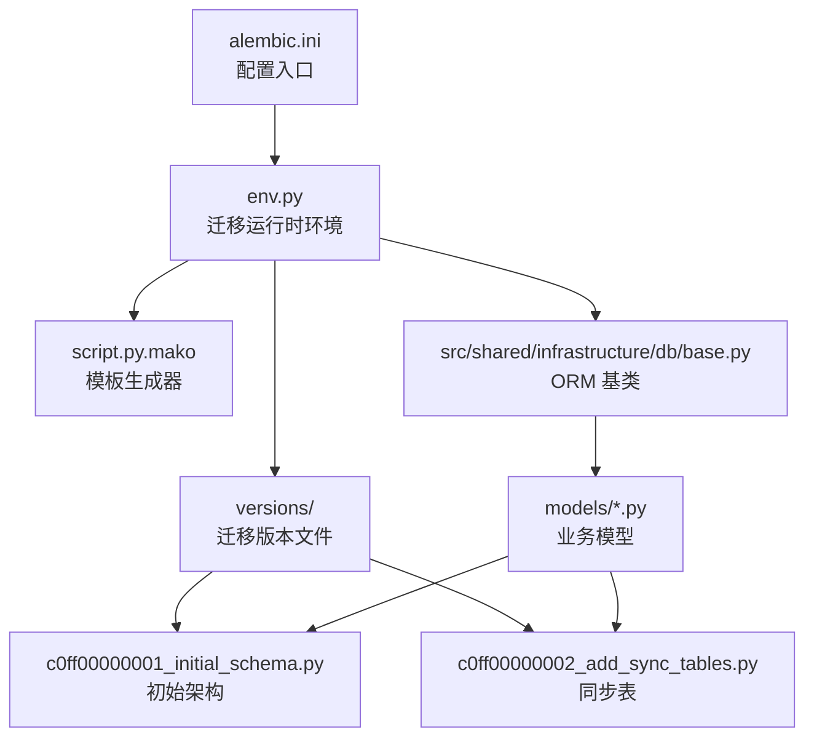
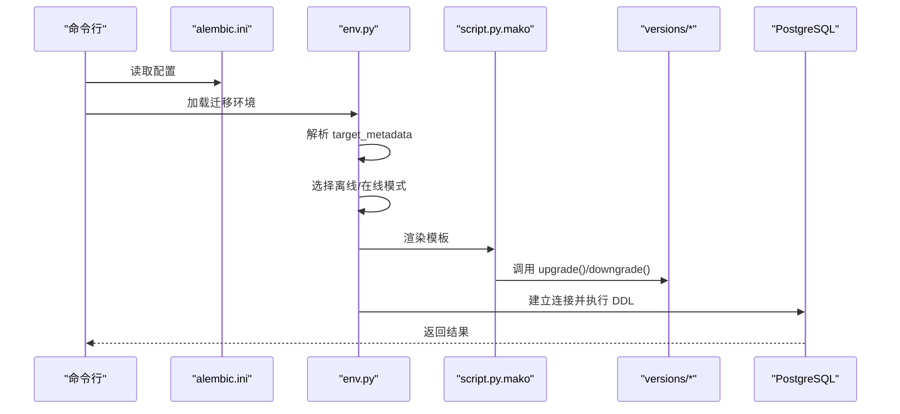
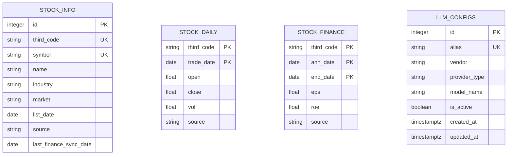
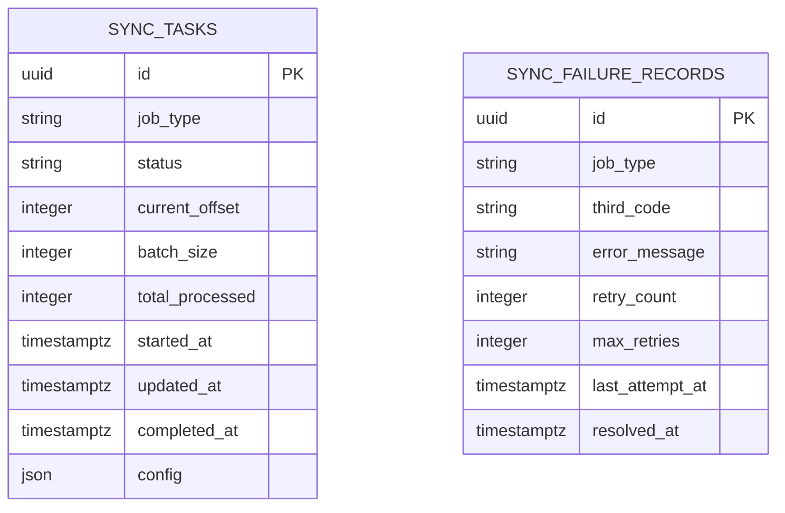
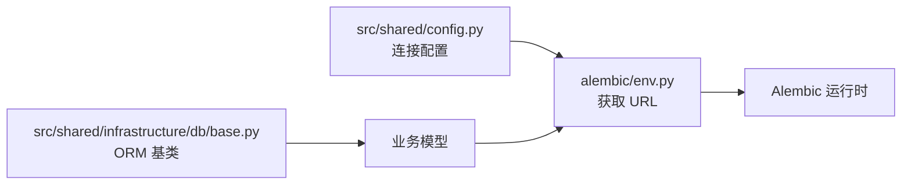

# 数据库迁移管理

<cite>
**本文档引用的文件**
- [alembic.ini](file://alembic.ini)
- [env.py](file://alembic/env.py)
- [script.py.mako](file://alembic/script.py.mako)
- [c0ff00000001_initial_schema.py](file://alembic/versions/c0ff00000001_initial_schema.py)
- [c0ff00000002_add_sync_tables.py](file://alembic/versions/c0ff00000002_add_sync_tables.py)
- [base.py](file://src/shared/infrastructure/db/base.py)
- [config.py](file://src/shared/config.py)
- [stock_model.py](file://src/modules/data_engineering/infrastructure/persistence/models/stock_model.py)
- [daily_bar_model.py](file://src/modules/data_engineering/infrastructure/persistence/models/daily_bar_model.py)
- [finance_model.py](file://src/modules/data_engineering/infrastructure/persistence/models/finance_model.py)
- [llm_config_model.py](file://src/modules/llm_platform/infrastructure/persistence/models/llm_config_model.py)
- [sync_task_model.py](file://src/modules/data_engineering/infrastructure/persistence/models/sync_task_model.py)
- [sync_failure_model.py](file://src/modules/data_engineering/infrastructure/persistence/models/sync_failure_model.py)
</cite>

## 目录
1. [简介](#简介)
2. [项目结构](#项目结构)
3. [核心组件](#核心组件)
4. [架构概览](#架构概览)
5. [详细组件分析](#详细组件分析)
6. [依赖关系分析](#依赖关系分析)
7. [性能考虑](#性能考虑)
8. [故障排除指南](#故障排除指南)
9. [结论](#结论)

## 简介
本文件系统性阐述股票助手项目的数据库迁移管理方案，基于 Alembic 框架实现。内容涵盖迁移配置、版本控制策略、升级/降级机制、初始架构创建流程、迁移脚本编写规范、执行命令与最佳实践，以及结构变更、数据迁移与回滚的处理方式和故障排除方法。

## 项目结构
项目采用标准的 Alembic 迁移目录结构，配合应用内共享的 SQLAlchemy 基类与模型定义，确保迁移元数据与 ORM 模型保持一致。

图表来源
- [alembic.ini](file://alembic.ini#L1-L97)
- [env.py](file://alembic/env.py#L1-L94)
- [script.py.mako](file://alembic/script.py.mako#L1-L25)
- [base.py](file://src/shared/infrastructure/db/base.py#L1-L20)

章节来源
- [alembic.ini](file://alembic.ini#L1-L97)
- [env.py](file://alembic/env.py#L1-L94)
- [script.py.mako](file://alembic/script.py.mako#L1-L25)
- [base.py](file://src/shared/infrastructure/db/base.py#L1-L20)

## 核心组件
- Alembic 配置与运行环境
  - 通过 [env.py](file://alembic/env.py#L1-L94) 注入目标元数据与数据库连接，支持离线与在线两种模式。
  - 连接字符串来自应用配置 [config.py](file://src/shared/config.py#L1-L68)，默认使用 PostgreSQL 异步驱动。
- 迁移版本与模板
  - 版本文件位于 [alembic/versions/](file://alembic/versions/)，命名采用十六进制修订 ID 前缀，如 c0ff00000001。
  - 模板 [script.py.mako](file://alembic/script.py.mako#L1-L25) 提供标准化的 upgrade()/downgrade() 结构。
- ORM 基类与模型
  - 共享基类 [base.py](file://src/shared/infrastructure/db/base.py#L1-L20) 统一表名生成规则。
  - 业务模型（如 [stock_model.py](file://src/modules/data_engineering/infrastructure/persistence/models/stock_model.py#L1-L36)、[daily_bar_model.py](file://src/modules/data_engineering/infrastructure/persistence/models/daily_bar_model.py#L1-L44)、[finance_model.py](file://src/modules/data_engineering/infrastructure/persistence/models/finance_model.py#L1-L117)、[llm_config_model.py](file://src/modules/llm_platform/infrastructure/persistence/models/llm_config_model.py#L1-L59)）映射至对应表，参与迁移元数据扫描。

章节来源
- [env.py](file://alembic/env.py#L1-L94)
- [config.py](file://src/shared/config.py#L1-L68)
- [script.py.mako](file://alembic/script.py.mako#L1-L25)
- [base.py](file://src/shared/infrastructure/db/base.py#L1-L20)
- [stock_model.py](file://src/modules/data_engineering/infrastructure/persistence/models/stock_model.py#L1-L36)
- [daily_bar_model.py](file://src/modules/data_engineering/infrastructure/persistence/models/daily_bar_model.py#L1-L44)
- [finance_model.py](file://src/modules/data_engineering/infrastructure/persistence/models/finance_model.py#L1-L117)
- [llm_config_model.py](file://src/modules/llm_platform/infrastructure/persistence/models/llm_config_model.py#L1-L59)

## 架构概览
下图展示 Alembic 运行时的关键交互：配置解析、元数据注入、连接建立与迁移执行。

图表来源
- [alembic.ini](file://alembic.ini#L1-L97)
- [env.py](file://alembic/env.py#L1-L94)
- [script.py.mako](file://alembic/script.py.mako#L1-L25)
- [c0ff00000001_initial_schema.py](file://alembic/versions/c0ff00000001_initial_schema.py#L1-L229)
- [c0ff00000002_add_sync_tables.py](file://alembic/versions/c0ff00000002_add_sync_tables.py#L1-L67)

## 详细组件分析

### 初始数据库架构（c0ff00000001）
该版本创建四大核心表，覆盖股票基础信息、日线行情、财务指标与 LLM 配置。

图表来源
- [c0ff00000001_initial_schema.py](file://alembic/versions/c0ff00000001_initial_schema.py#L22-L206)
- [stock_model.py](file://src/modules/data_engineering/infrastructure/persistence/models/stock_model.py#L9-L36)
- [daily_bar_model.py](file://src/modules/data_engineering/infrastructure/persistence/models/daily_bar_model.py#L9-L44)
- [finance_model.py](file://src/modules/data_engineering/infrastructure/persistence/models/finance_model.py#L9-L117)
- [llm_config_model.py](file://src/modules/llm_platform/infrastructure/persistence/models/llm_config_model.py#L7-L22)

章节来源
- [c0ff00000001_initial_schema.py](file://alembic/versions/c0ff0001_initial_schema.py#L1-L229)
- [stock_model.py](file://src/modules/data_engineering/infrastructure/persistence/models/stock_model.py#L1-L36)
- [daily_bar_model.py](file://src/modules/data_engineering/infrastructure/persistence/models/daily_bar_model.py#L1-L44)
- [finance_model.py](file://src/modules/data_engineering/infrastructure/persistence/models/finance_model.py#L1-L117)
- [llm_config_model.py](file://src/modules/llm_platform/infrastructure/persistence/models/llm_config_model.py#L1-L59)

### 同步任务与失败记录表（c0ff00000002）
该版本引入同步任务状态与失败记录表，支撑增量/历史数据同步的可观测性与可恢复性。

图表来源
- [c0ff00000002_add_sync_tables.py](file://alembic/versions/c0ff00000002_add_sync_tables.py#L22-L55)
- [sync_task_model.py](file://src/modules/data_engineering/infrastructure/persistence/models/sync_task_model.py#L8-L26)
- [sync_failure_model.py](file://src/modules/data_engineering/infrastructure/persistence/models/sync_failure_model.py#L8-L24)

章节来源
- [c0ff00000002_add_sync_tables.py](file://alembic/versions/c0ff00000002_add_sync_tables.py#L1-L67)
- [sync_task_model.py](file://src/modules/data_engineering/infrastructure/persistence/models/sync_task_model.py#L1-L26)
- [sync_failure_model.py](file://src/modules/data_engineering/infrastructure/persistence/models/sync_failure_model.py#L1-L24)

### 迁移脚本编写规范
- 命名规范
  - 版本文件采用十六进制修订 ID 前缀，如 c0ff00000001、c0ff00000002，确保唯一性与有序性。
- 升级/降级实现模式
  - 升级函数负责创建表、索引与约束；降级函数负责逆向删除，遵循“先子后父、先表后索引”的顺序。
  - 示例路径：
    - [upgrade() 实现示例](file://alembic/versions/c0ff00000001_initial_schema.py#L21-L208)
    - [downgrade() 实现示例](file://alembic/versions/c0ff00000001_initial_schema.py#L209-L229)
    - [upgrade() 实现示例](file://alembic/versions/c0ff00000002_add_sync_tables.py#L21-L56)
    - [downgrade() 实现示例](file://alembic/versions/c0ff00000002_add_sync_tables.py#L58-L67)
- 模板与生成
  - 使用 [script.py.mako](file://alembic/script.py.mako#L1-L25) 生成标准化脚本骨架，确保 revision 标识与 up/down 关系正确。

章节来源
- [script.py.mako](file://alembic/script.py.mako#L1-L25)
- [c0ff00000001_initial_schema.py](file://alembic/versions/c0ff00000001_initial_schema.py#L1-L229)
- [c0ff00000002_add_sync_tables.py](file://alembic/versions/c0ff00000002_add_sync_tables.py#L1-L67)

### 迁移执行命令与最佳实践
- 离线模式
  - 适用于无需真实连接数据库的场景（如 CI/CD 预检）。通过 [env.py](file://alembic/env.py#L38-L57) 的离线分支执行。
- 在线模式
  - 通过异步引擎连接数据库，执行 DDL。连接字符串来自 [config.py](file://src/shared/config.py#L42-L58)。
- 常用命令（基于 Alembic CLI）
  - 生成新迁移：alembic revision --autogenerate -m "描述"
  - 应用迁移：alembic upgrade +1 或指定修订 ID
  - 回退迁移：alembic downgrade -1 或指定修订 ID
  - 查看状态：alembic current / heads
- 开发与生产策略
  - 开发环境：允许本地自动生成与快速迭代，建议开启严格日志与事务保护。
  - 生产环境：禁止自动生成，所有变更需经审查与灰度验证，使用显式修订 ID 控制。

章节来源
- [env.py](file://alembic/env.py#L38-L94)
- [config.py](file://src/shared/config.py#L42-L58)

### 数据库结构变更、数据迁移与回滚
- 结构变更
  - 通过在现有表上增加列、索引或约束实现，确保 downgrade 时能安全回退。
- 数据迁移
  - 若涉及数据重排/清洗，应在 upgrade 中分批处理并记录进度，结合失败记录表进行重试。
- 回滚操作
  - 严格遵循 downgrade 顺序，必要时保留备份与快照，避免不可逆变更。

章节来源
- [c0ff00000001_initial_schema.py](file://alembic/versions/c0ff00000001_initial_schema.py#L21-L229)
- [c0ff00000002_add_sync_tables.py](file://alembic/versions/c0ff00000002_add_sync_tables.py#L21-L67)

## 依赖关系分析
迁移元数据由 env.py 注入，扫描应用内所有模型，确保版本文件与 ORM 定义一致。

图表来源
- [config.py](file://src/shared/config.py#L42-L58)
- [env.py](file://alembic/env.py#L34-L36)
- [base.py](file://src/shared/infrastructure/db/base.py#L6-L19)

章节来源
- [env.py](file://alembic/env.py#L1-L94)
- [config.py](file://src/shared/config.py#L1-L68)
- [base.py](file://src/shared/infrastructure/db/base.py#L1-L20)

## 性能考虑
- 索引设计
  - 初始版本为高频查询字段建立索引（如股票代码、交易日期等），提升查询与去重效率。
- 分批处理
  - 同步任务表支持批量大小与偏移量，降低单次事务压力。
- 连接池与异步
  - 在线迁移使用异步引擎，减少阻塞风险。

章节来源
- [c0ff00000001_initial_schema.py](file://alembic/versions/c0ff00000001_initial_schema.py#L45-L49)
- [c0ff00000001_initial_schema.py](file://alembic/versions/c0ff00000001_initial_schema.py#L84-L85)
- [c0ff00000001_initial_schema.py](file://alembic/versions/c0ff00000001_initial_schema.py#L183-L185)
- [c0ff00000002_add_sync_tables.py](file://alembic/versions/c0ff00000002_add_sync_tables.py#L37-L38)
- [c0ff00000002_add_sync_tables.py](file://alembic/versions/c0ff00000002_add_sync_tables.py#L53-L55)

## 故障排除指南
- 连接失败
  - 检查 [alembic.ini](file://alembic.ini#L49-L49) 中的 sqlalchemy.url 是否正确，或确认应用配置 [config.py](file://src/shared/config.py#L42-L58) 的环境变量。
- 迁移冲突
  - 确认版本文件命名与修订链路正确，避免重复 ID 或断层。
- 降级失败
  - 按 downgrade 逆序检查依赖（如外键、索引），确保删除顺序与模板一致。
- 日志与调试
  - 通过 [alembic.ini](file://alembic.ini#L64-L97) 配置日志级别，定位具体错误位置。

章节来源
- [alembic.ini](file://alembic.ini#L49-L49)
- [alembic.ini](file://alembic.ini#L64-L97)
- [config.py](file://src/shared/config.py#L42-L58)
- [c0ff00000001_initial_schema.py](file://alembic/versions/c0ff00000001_initial_schema.py#L209-L229)
- [c0ff00000002_add_sync_tables.py](file://alembic/versions/c0ff00000002_add_sync_tables.py#L58-L67)

## 结论
本项目以 Alembic 为核心，结合统一的 ORM 基类与模型定义，实现了清晰的版本控制与可逆的迁移机制。通过严格的命名规范、模板化脚本与明确的升级/降级顺序，确保了开发与生产环境的一致性与安全性。建议在生产环境中坚持“手动审批 + 显式修订 ID + 分阶段发布”的策略，并持续完善失败记录与重试机制，保障数据同步的可靠性。