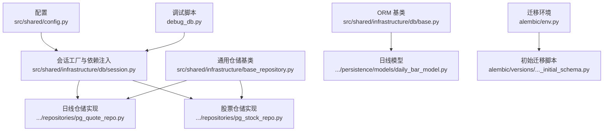
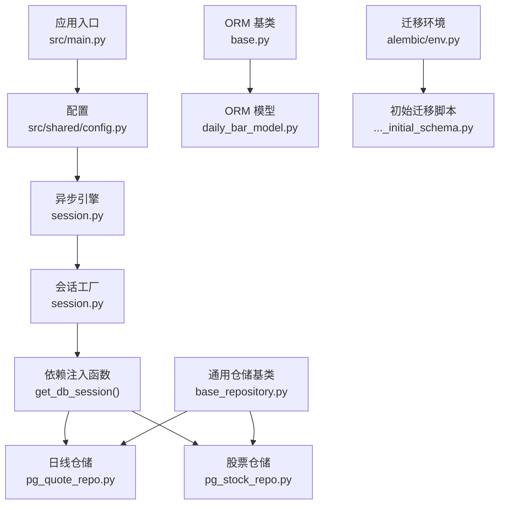
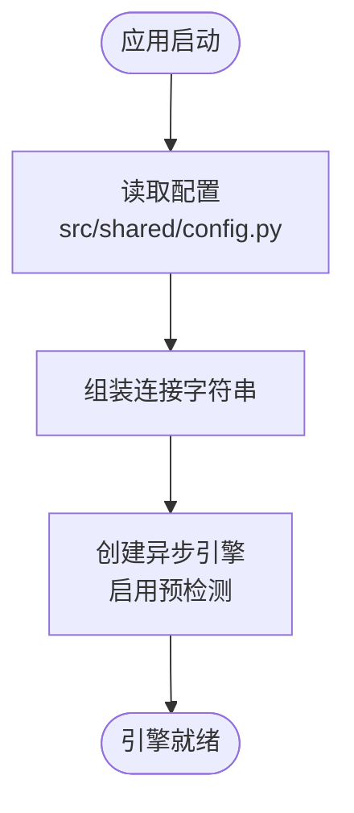
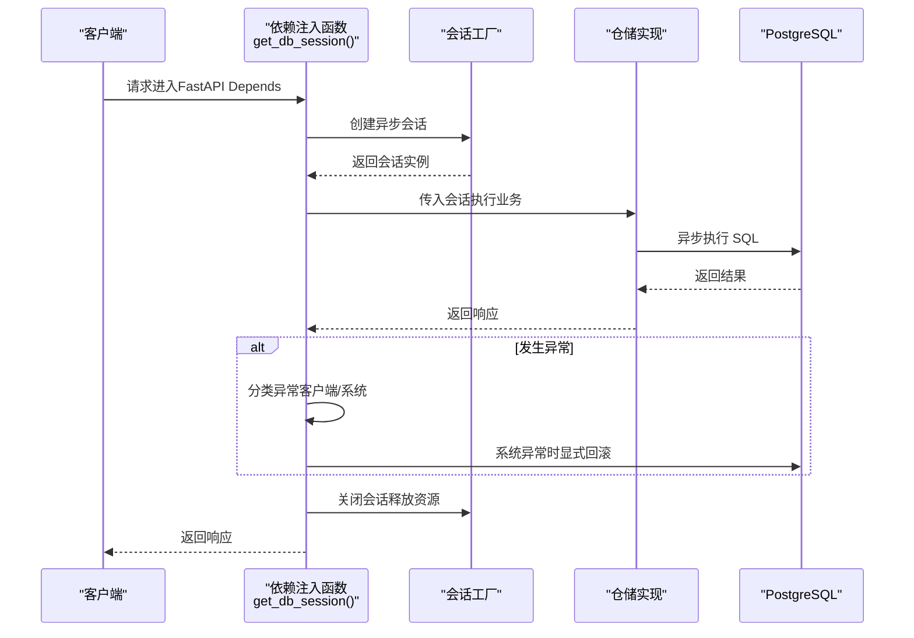
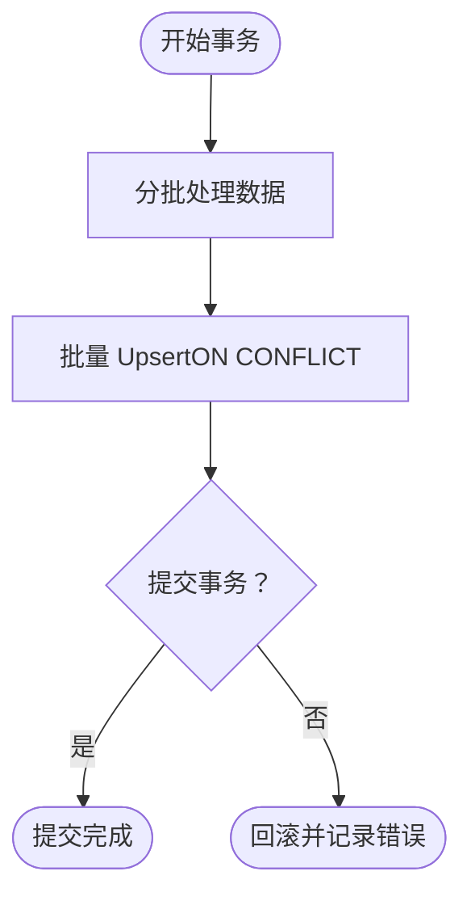
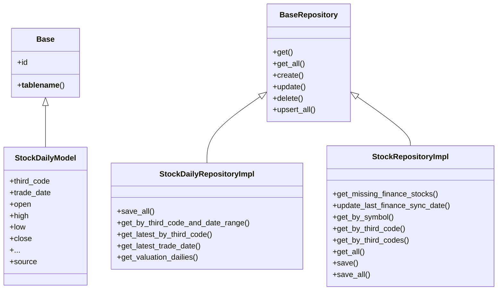
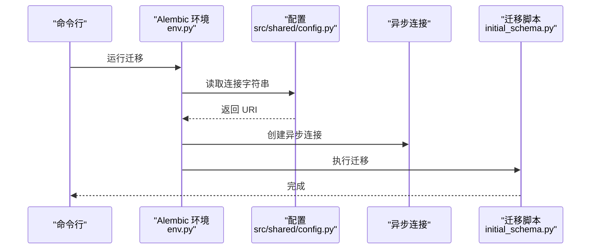
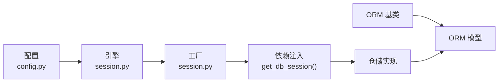

# 数据库连接管理

<cite>
**本文引用的文件**
- [src/shared/config.py](file://src/shared/config.py)
- [src/shared/infrastructure/db/session.py](file://src/shared/infrastructure/db/session.py)
- [src/shared/infrastructure/db/base.py](file://src/shared/infrastructure/db/base.py)
- [src/shared/infrastructure/base_repository.py](file://src/shared/infrastructure/base_repository.py)
- [src/modules/data_engineering/infrastructure/persistence/models/daily_bar_model.py](file://src/modules/data_engineering/infrastructure/persistence/models/daily_bar_model.py)
- [src/modules/data_engineering/infrastructure/persistence/repositories/pg_quote_repo.py](file://src/modules/data_engineering/infrastructure/persistence/repositories/pg_quote_repo.py)
- [src/modules/data_engineering/infrastructure/persistence/repositories/pg_stock_repo.py](file://src/modules/data_engineering/infrastructure/persistence/repositories/pg_stock_repo.py)
- [alembic/env.py](file://alembic/env.py)
- [alembic/versions/c0ff00000001_initial_schema.py](file://alembic/versions/c0ff00000001_initial_schema.py)
- [debug_db.py](file://debug_db.py)
- [src/main.py](file://src/main.py)
- [src/shared/infrastructure/logging.py](file://src/shared/infrastructure/logging.py)
</cite>

## 目录
1. [简介](#简介)
2. [项目结构](#项目结构)
3. [核心组件](#核心组件)
4. [架构总览](#架构总览)
5. [详细组件分析](#详细组件分析)
6. [依赖关系分析](#依赖关系分析)
7. [性能考量](#性能考量)
8. [故障排查指南](#故障排查指南)
9. [结论](#结论)
10. [附录](#附录)

## 简介
本文件面向“股票助手”项目的数据库连接管理，围绕以下主题展开：
- SQLAlchemy ORM 配置与数据库连接池设置（连接字符串、连接池大小与超时参数）
- 异步数据库连接的实现方式与性能优化策略
- 数据库会话管理机制（生命周期、事务处理、并发控制）
- 连接池监控与故障处理（连接泄漏检测、自动重连机制）
- 数据库配置最佳实践（生产环境连接优化与安全配置）
- 数据库性能监控指标与调优建议

## 项目结构
数据库相关能力主要分布在如下层次：
- 配置层：集中管理数据库连接字符串与环境变量
- 基础设施层：异步引擎与会话工厂、ORM 基类
- 仓储层：基于异步会话的通用 CRUD 与批量写入
- 模型层：ORM 映射表结构
- 迁移层：Alembic 版本化管理
- 调试与示例：独立脚本验证连接与查询

图表来源
- [src/shared/config.py](file://src/shared/config.py#L34-L58)
- [src/shared/infrastructure/db/session.py](file://src/shared/infrastructure/db/session.py#L8-L22)
- [src/shared/infrastructure/db/base.py](file://src/shared/infrastructure/db/base.py#L6-L19)
- [src/shared/infrastructure/base_repository.py](file://src/shared/infrastructure/base_repository.py#L13-L21)
- [src/modules/data_engineering/infrastructure/persistence/models/daily_bar_model.py](file://src/modules/data_engineering/infrastructure/persistence/models/daily_bar_model.py#L4-L21)
- [src/modules/data_engineering/infrastructure/persistence/repositories/pg_quote_repo.py](file://src/modules/data_engineering/infrastructure/persistence/repositories/pg_quote_repo.py#L11-L13)
- [src/modules/data_engineering/infrastructure/persistence/repositories/pg_stock_repo.py](file://src/modules/data_engineering/infrastructure/persistence/repositories/pg_stock_repo.py#L12-L18)
- [alembic/env.py](file://alembic/env.py#L34-L36)
- [alembic/versions/c0ff00000001_initial_schema.py](file://alembic/versions/c0ff00000001_initial_schema.py#L21-L83)
- [debug_db.py](file://debug_db.py#L5-L12)

章节来源
- [src/shared/config.py](file://src/shared/config.py#L34-L58)
- [src/shared/infrastructure/db/session.py](file://src/shared/infrastructure/db/session.py#L8-L22)
- [src/shared/infrastructure/db/base.py](file://src/shared/infrastructure/db/base.py#L6-L19)
- [src/shared/infrastructure/base_repository.py](file://src/shared/infrastructure/base_repository.py#L13-L21)
- [src/modules/data_engineering/infrastructure/persistence/models/daily_bar_model.py](file://src/modules/data_engineering/infrastructure/persistence/models/daily_bar_model.py#L4-L21)
- [src/modules/data_engineering/infrastructure/persistence/repositories/pg_quote_repo.py](file://src/modules/data_engineering/infrastructure/persistence/repositories/pg_quote_repo.py#L11-L13)
- [src/modules/data_engineering/infrastructure/persistence/repositories/pg_stock_repo.py](file://src/modules/data_engineering/infrastructure/persistence/repositories/pg_stock_repo.py#L12-L18)
- [alembic/env.py](file://alembic/env.py#L34-L36)
- [alembic/versions/c0ff00000001_initial_schema.py](file://alembic/versions/c0ff00000001_initial_schema.py#L21-L83)
- [debug_db.py](file://debug_db.py#L5-L12)

## 核心组件
- 全局配置与连接字符串组装
  - 通过集中配置类在运行时组装 PostgreSQL 异步连接字符串，支持从环境变量读取并可覆盖默认值。
- 异步引擎与会话工厂
  - 使用异步引擎与会话工厂，开启连接预检测，避免使用失效连接。
- 会话生命周期与异常处理
  - 依赖注入函数负责会话创建、异常分类处理、自动回滚与关闭。
- ORM 基类与模型
  - 统一的声明式基类，自动推导表名，简化模型定义。
- 通用仓储与批量写入
  - 提供通用 CRUD 与批量 Upsert，结合 PostgreSQL ON CONFLICT 实现高效写入。
- 迁移与表结构
  - 通过 Alembic 管理版本化迁移，初始脚本定义了股票基础信息、日线行情、财务指标与 LLM 配置等核心表。

章节来源
- [src/shared/config.py](file://src/shared/config.py#L34-L58)
- [src/shared/infrastructure/db/session.py](file://src/shared/infrastructure/db/session.py#L8-L22)
- [src/shared/infrastructure/db/session.py](file://src/shared/infrastructure/db/session.py#L24-L63)
- [src/shared/infrastructure/db/base.py](file://src/shared/infrastructure/db/base.py#L6-L19)
- [src/shared/infrastructure/base_repository.py](file://src/shared/infrastructure/base_repository.py#L75-L124)
- [alembic/versions/c0ff00000001_initial_schema.py](file://alembic/versions/c0ff00000001_initial_schema.py#L21-L207)

## 架构总览
下图展示了从应用到数据库的连接路径、会话管理与仓储交互：

图表来源
- [src/main.py](file://src/main.py#L14-L18)
- [src/shared/config.py](file://src/shared/config.py#L34-L58)
- [src/shared/infrastructure/db/session.py](file://src/shared/infrastructure/db/session.py#L8-L22)
- [src/shared/infrastructure/db/session.py](file://src/shared/infrastructure/db/session.py#L24-L36)
- [src/modules/data_engineering/infrastructure/persistence/repositories/pg_quote_repo.py](file://src/modules/data_engineering/infrastructure/persistence/repositories/pg_quote_repo.py#L11-L13)
- [src/modules/data_engineering/infrastructure/persistence/repositories/pg_stock_repo.py](file://src/modules/data_engineering/infrastructure/persistence/repositories/pg_stock_repo.py#L12-L18)
- [src/shared/infrastructure/base_repository.py](file://src/shared/infrastructure/base_repository.py#L13-L21)
- [src/shared/infrastructure/db/base.py](file://src/shared/infrastructure/db/base.py#L6-L19)
- [src/modules/data_engineering/infrastructure/persistence/models/daily_bar_model.py](file://src/modules/data_engineering/infrastructure/persistence/models/daily_bar_model.py#L4-L21)
- [alembic/env.py](file://alembic/env.py#L34-L36)
- [alembic/versions/c0ff00000001_initial_schema.py](file://alembic/versions/c0ff00000001_initial_schema.py#L21-L83)

## 详细组件分析

### 连接字符串与连接池配置
- 连接字符串组装
  - 当未显式提供连接字符串时，系统根据主机、用户、密码、端口与数据库名动态拼装 PostgreSQL 异步连接字符串。
- 连接池与超时参数
  - 引擎创建时启用了连接预检测，确保从池中取出的连接可用，降低无效连接导致的失败概率。
  - 当前实现未显式设置连接池大小与超时参数，意味着使用 SQLAlchemy 默认行为。

图表来源
- [src/shared/config.py](file://src/shared/config.py#L42-L58)
- [src/shared/infrastructure/db/session.py](file://src/shared/infrastructure/db/session.py#L8-L13)

章节来源
- [src/shared/config.py](file://src/shared/config.py#L34-L58)
- [src/shared/infrastructure/db/session.py](file://src/shared/infrastructure/db/session.py#L8-L13)

### 异步会话管理与生命周期
- 会话工厂
  - 使用会话工厂创建异步会话，关闭时自动清理资源；提交后对象不过期，便于后续异步操作。
- 依赖注入函数
  - 通过上下文管理器确保异常时也能正确关闭会话；区分客户端错误与系统异常，进行差异化处理与日志记录。
  - 系统异常触发显式回滚，客户端错误则按需记录但不强制回滚（读操作通常无需回滚，写操作会在关闭时自动回滚）。

图表来源
- [src/shared/infrastructure/db/session.py](file://src/shared/infrastructure/db/session.py#L24-L63)
- [src/modules/data_engineering/infrastructure/persistence/repositories/pg_quote_repo.py](file://src/modules/data_engineering/infrastructure/persistence/repositories/pg_quote_repo.py#L15-L48)
- [src/modules/data_engineering/infrastructure/persistence/repositories/pg_stock_repo.py](file://src/modules/data_engineering/infrastructure/persistence/repositories/pg_stock_repo.py#L93-L105)

章节来源
- [src/shared/infrastructure/db/session.py](file://src/shared/infrastructure/db/session.py#L16-L22)
- [src/shared/infrastructure/db/session.py](file://src/shared/infrastructure/db/session.py#L24-L63)

### 事务处理与并发控制
- 事务边界
  - 仓储方法内部在单个会话内执行多个操作后统一提交，保证原子性。
- 并发控制
  - 使用异步会话与连接池，配合预检测提升并发下的稳定性。
  - 批量写入采用分批处理，减少单次事务压力。

图表来源
- [src/shared/infrastructure/base_repository.py](file://src/shared/infrastructure/base_repository.py#L75-L124)
- [src/modules/data_engineering/infrastructure/persistence/repositories/pg_quote_repo.py](file://src/modules/data_engineering/infrastructure/persistence/repositories/pg_quote_repo.py#L15-L48)
- [src/modules/data_engineering/infrastructure/persistence/repositories/pg_stock_repo.py](file://src/modules/data_engineering/infrastructure/persistence/repositories/pg_stock_repo.py#L107-L132)

章节来源
- [src/shared/infrastructure/base_repository.py](file://src/shared/infrastructure/base_repository.py#L75-L124)
- [src/modules/data_engineering/infrastructure/persistence/repositories/pg_quote_repo.py](file://src/modules/data_engineering/infrastructure/persistence/repositories/pg_quote_repo.py#L15-L48)
- [src/modules/data_engineering/infrastructure/persistence/repositories/pg_stock_repo.py](file://src/modules/data_engineering/infrastructure/persistence/repositories/pg_stock_repo.py#L107-L132)

### ORM 模型与仓储实现
- ORM 基类
  - 统一的声明式基类，自动推导表名，简化模型定义。
- 日线模型
  - 定义了日线行情的核心字段与主键组合，适配多维指标与估值字段。
- 仓储实现
  - 日线仓储：支持批量 Upsert、范围查询、最新记录查询与最新交易日查询。
  - 股票仓储：支持缺失财务数据股票识别、批量更新同步时间、按条件查询与批量 Upsert。

图表来源
- [src/shared/infrastructure/db/base.py](file://src/shared/infrastructure/db/base.py#L6-L19)
- [src/modules/data_engineering/infrastructure/persistence/models/daily_bar_model.py](file://src/modules/data_engineering/infrastructure/persistence/models/daily_bar_model.py#L4-L44)
- [src/shared/infrastructure/base_repository.py](file://src/shared/infrastructure/base_repository.py#L13-L124)
- [src/modules/data_engineering/infrastructure/persistence/repositories/pg_quote_repo.py](file://src/modules/data_engineering/infrastructure/persistence/repositories/pg_quote_repo.py#L11-L173)
- [src/modules/data_engineering/infrastructure/persistence/repositories/pg_stock_repo.py](file://src/modules/data_engineering/infrastructure/persistence/repositories/pg_stock_repo.py#L12-L133)

章节来源
- [src/shared/infrastructure/db/base.py](file://src/shared/infrastructure/db/base.py#L6-L19)
- [src/modules/data_engineering/infrastructure/persistence/models/daily_bar_model.py](file://src/modules/data_engineering/infrastructure/persistence/models/daily_bar_model.py#L4-L44)
- [src/shared/infrastructure/base_repository.py](file://src/shared/infrastructure/base_repository.py#L13-L124)
- [src/modules/data_engineering/infrastructure/persistence/repositories/pg_quote_repo.py](file://src/modules/data_engineering/infrastructure/persistence/repositories/pg_quote_repo.py#L11-L173)
- [src/modules/data_engineering/infrastructure/persistence/repositories/pg_stock_repo.py](file://src/modules/data_engineering/infrastructure/persistence/repositories/pg_stock_repo.py#L12-L133)

### 迁移与表结构
- 迁移环境
  - 从全局配置读取连接字符串，使用异步引擎在线执行迁移。
- 初始迁移
  - 定义了股票基础信息、日线行情、财务指标与 LLM 配置等核心表，包含索引与注释。

图表来源
- [alembic/env.py](file://alembic/env.py#L34-L36)
- [alembic/env.py](file://alembic/env.py#L67-L87)
- [alembic/versions/c0ff00000001_initial_schema.py](file://alembic/versions/c0ff00000001_initial_schema.py#L21-L207)

章节来源
- [alembic/env.py](file://alembic/env.py#L34-L36)
- [alembic/env.py](file://alembic/env.py#L67-L87)
- [alembic/versions/c0ff00000001_initial_schema.py](file://alembic/versions/c0ff00000001_initial_schema.py#L21-L207)

## 依赖关系分析
- 配置到引擎
  - 全局配置提供连接字符串，被会话工厂与 Alembic 环境共同使用。
- 引擎到会话
  - 会话工厂创建异步会话，依赖注入函数负责生命周期管理。
- 会话到仓储
  - 仓储实现通过传入的会话执行数据库操作，遵循统一的事务与异常处理策略。
- 模型到仓储
  - 模型定义与仓储实现解耦，仓储通过 ORM 基类与通用基类完成数据持久化。

图表来源
- [src/shared/config.py](file://src/shared/config.py#L34-L58)
- [src/shared/infrastructure/db/session.py](file://src/shared/infrastructure/db/session.py#L8-L22)
- [src/shared/infrastructure/db/session.py](file://src/shared/infrastructure/db/session.py#L24-L36)
- [src/shared/infrastructure/db/base.py](file://src/shared/infrastructure/db/base.py#L6-L19)
- [src/modules/data_engineering/infrastructure/persistence/repositories/pg_quote_repo.py](file://src/modules/data_engineering/infrastructure/persistence/repositories/pg_quote_repo.py#L11-L13)

章节来源
- [src/shared/config.py](file://src/shared/config.py#L34-L58)
- [src/shared/infrastructure/db/session.py](file://src/shared/infrastructure/db/session.py#L8-L22)
- [src/shared/infrastructure/db/session.py](file://src/shared/infrastructure/db/session.py#L24-L36)
- [src/shared/infrastructure/db/base.py](file://src/shared/infrastructure/db/base.py#L6-L19)
- [src/modules/data_engineering/infrastructure/persistence/repositories/pg_quote_repo.py](file://src/modules/data_engineering/infrastructure/persistence/repositories/pg_quote_repo.py#L11-L13)

## 性能考量
- 连接池与超时
  - 当前实现启用连接预检测，建议在生产环境显式配置连接池大小与超时参数，以匹配并发与延迟预期。
- 批量写入
  - 仓储普遍采用分批批量写入，减少单次事务开销；建议根据表规模与硬件资源调整批次大小。
- 查询优化
  - 模型与迁移脚本定义了关键索引（如唯一索引与普通索引），建议结合实际查询模式评估是否需要额外索引。
- 异常与回滚
  - 明确区分客户端错误与系统异常，避免不必要的回滚与日志噪音，有助于降低事务失败对吞吐的影响。

章节来源
- [src/shared/infrastructure/db/session.py](file://src/shared/infrastructure/db/session.py#L12-L12)
- [src/shared/infrastructure/base_repository.py](file://src/shared/infrastructure/base_repository.py#L91-L98)
- [alembic/versions/c0ff00000001_initial_schema.py](file://alembic/versions/c0ff00000001_initial_schema.py#L45-L85)

## 故障排查指南
- 连接泄漏检测
  - 会话在 finally 中关闭，若出现长时间占用，检查是否存在未捕获的异常或长事务未提交。
- 自动重连机制
  - 引擎启用预检测，可在连接失效时避免使用；若仍出现连接失败，建议增加重试与熔断策略。
- 日志与监控
  - 使用统一日志系统输出数据库相关日志，结合异常分类与会话关闭流程定位问题。
- 迁移与版本
  - 在执行迁移前后核对连接字符串与目标数据库一致性，避免迁移失败导致的 schema 不一致。

章节来源
- [src/shared/infrastructure/db/session.py](file://src/shared/infrastructure/db/session.py#L62-L63)
- [src/shared/infrastructure/logging.py](file://src/shared/infrastructure/logging.py#L31-L74)
- [alembic/env.py](file://alembic/env.py#L67-L87)

## 结论
本项目采用 SQLAlchemy 异步 ORM，通过集中配置与依赖注入实现了清晰的数据库连接管理。当前实现具备连接预检测与完善的会话生命周期管理，适合中低并发场景。建议在生产环境中补充连接池参数、监控指标与自动重试策略，以进一步提升稳定性与性能。

## 附录
- 快速验证连接
  - 可使用独立脚本验证数据库连接与查询，确认连接字符串与权限配置正确。

章节来源
- [debug_db.py](file://debug_db.py#L5-L17)