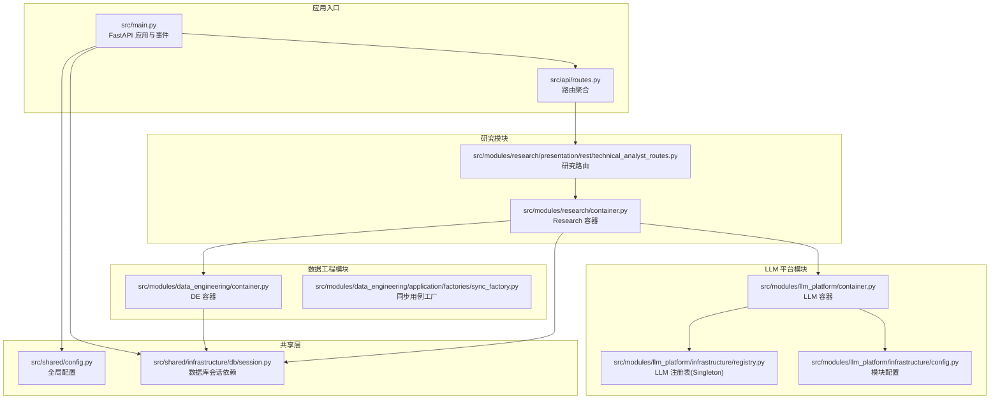
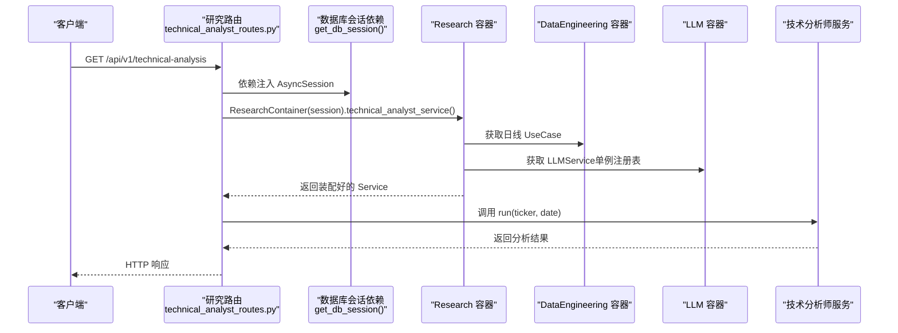
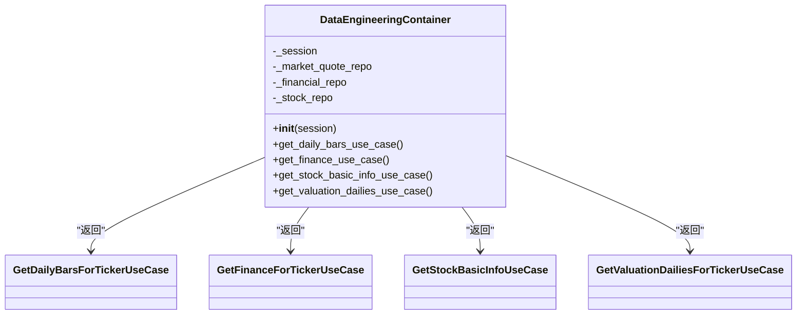
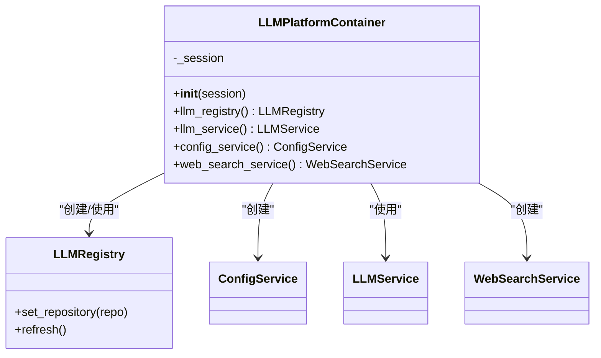
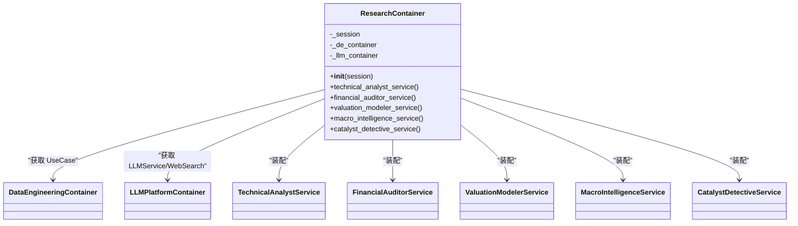
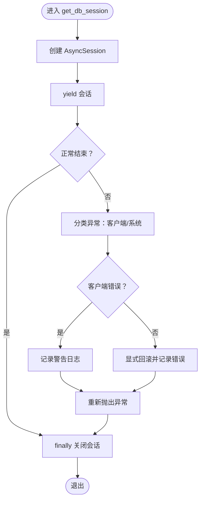
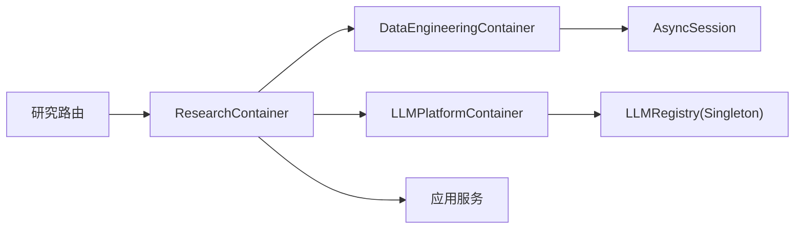
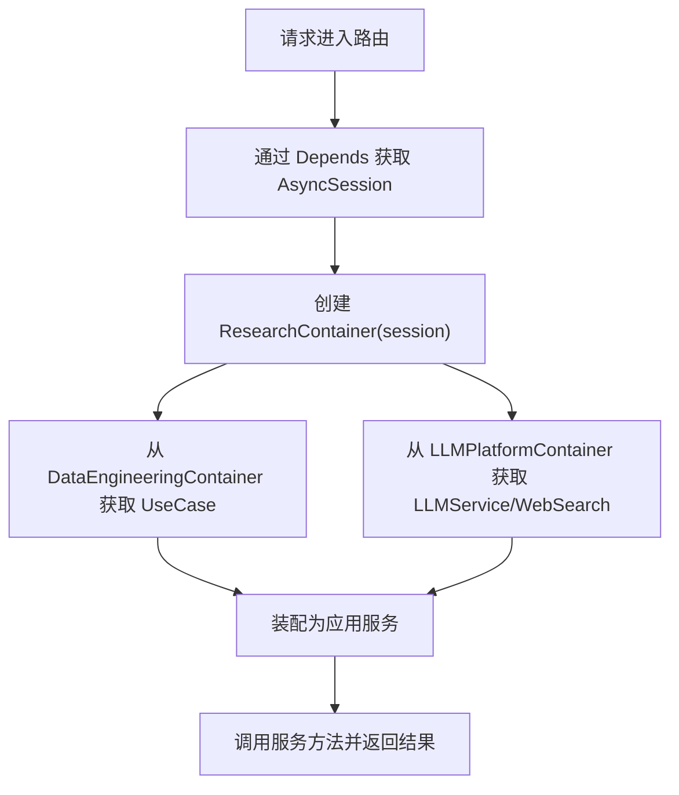

# 依赖注入与控制反转

<cite>
**本文引用的文件**
- [src/main.py](file://src/main.py)
- [src/api/routes.py](file://src/api/routes.py)
- [src/shared/infrastructure/db/session.py](file://src/shared/infrastructure/db/session.py)
- [src/shared/config.py](file://src/shared/config.py)
- [src/modules/data_engineering/container.py](file://src/modules/data_engineering/container.py)
- [src/modules/data_engineering/application/factories/sync_factory.py](file://src/modules/data_engineering/application/factories/sync_factory.py)
- [src/modules/llm_platform/container.py](file://src/modules/llm_platform/container.py)
- [src/modules/llm_platform/infrastructure/registry.py](file://src/modules/llm_platform/infrastructure/registry.py)
- [src/modules/llm_platform/infrastructure/config.py](file://src/modules/llm_platform/infrastructure/config.py)
- [src/modules/research/container.py](file://src/modules/research/container.py)
- [src/modules/research/presentation/rest/technical_analyst_routes.py](file://src/modules/research/presentation/rest/technical_analyst_routes.py)
- [tests/conftest.py](file://tests/conftest.py)
- [openspec/specs/dependency-injection-root/spec.md](file://openspec/specs/dependency-injection-root/spec.md)
- [openspec/changes/archive/2026-02-13-ddd-architecture-optimization/design.md](file://openspec/changes/archive/2026-02-13-ddd-architecture-optimization/design.md)
</cite>

## 目录
1. [引言](#引言)
2. [项目结构](#项目结构)
3. [核心组件](#核心组件)
4. [架构总览](#架构总览)
5. [详细组件分析](#详细组件分析)
6. [依赖关系分析](#依赖关系分析)
7. [性能考量](#性能考量)
8. [故障排查指南](#故障排查指南)
9. [结论](#结论)
10. [附录](#附录)

## 引言
本文件围绕“股票助手”项目的依赖注入与控制反转（IoC）容器展开，系统性阐述 Composition Root 设计模式与其实现原理，覆盖容器初始化、组件注册与服务解析机制；解释依赖注入在模块解耦中的作用，展示如何通过接口抽象实现模块间的松耦合；总结容器配置最佳实践（单例、作用域与生命周期）；说明依赖注入在测试中的优势（Mock 对象与单元测试）；并提供容器配置示例与组件注册流程图，帮助读者建立对整体架构的清晰认知。

## 项目结构
项目采用分层与模块化的 DDD 架构风格，结合 FastAPI 的依赖注入机制，形成“Presentation 层 + Application 层 + Infrastructure 层”的清晰边界。每个模块均提供独立的 Composition Root（容器），负责将基础设施实现装配为应用服务，Presentation 层仅通过容器获取所需服务，从而避免直接依赖底层实现。

图表来源
- [src/main.py](file://src/main.py#L1-L75)
- [src/api/routes.py](file://src/api/routes.py#L1-L13)
- [src/shared/config.py](file://src/shared/config.py#L1-L68)
- [src/shared/infrastructure/db/session.py](file://src/shared/infrastructure/db/session.py#L1-L64)
- [src/modules/data_engineering/container.py](file://src/modules/data_engineering/container.py#L1-L59)
- [src/modules/data_engineering/application/factories/sync_factory.py](file://src/modules/data_engineering/application/factories/sync_factory.py#L1-L115)
- [src/modules/llm_platform/container.py](file://src/modules/llm_platform/container.py#L1-L68)
- [src/modules/llm_platform/infrastructure/registry.py](file://src/modules/llm_platform/infrastructure/registry.py#L1-L43)
- [src/modules/llm_platform/infrastructure/config.py](file://src/modules/llm_platform/infrastructure/config.py#L1-L27)
- [src/modules/research/container.py](file://src/modules/research/container.py#L1-L167)
- [src/modules/research/presentation/rest/technical_analyst_routes.py](file://src/modules/research/presentation/rest/technical_analyst_routes.py#L1-L77)

章节来源
- [src/main.py](file://src/main.py#L1-L75)
- [src/api/routes.py](file://src/api/routes.py#L1-L13)
- [src/shared/config.py](file://src/shared/config.py#L1-L68)
- [src/shared/infrastructure/db/session.py](file://src/shared/infrastructure/db/session.py#L1-L64)

## 核心组件
- Composition Root（容器）：每个模块在自身目录提供一个容器类，封装基础设施到应用层的装配逻辑，Presentation 层通过容器获取服务实例，避免在路由中重复定义工厂函数。
- 会话依赖注入：通过 FastAPI 的 Depends 与 SQLAlchemy 的异步会话生成器，统一管理数据库会话生命周期。
- 单例注册表：LLM 注册表采用单例模式，集中管理 Provider 实例与配置加载。
- 跨模块依赖：Research 容器通过 DataEngineeringContainer 与 LLMPlatformContainer 获取其他模块的应用服务，实现模块间解耦。

章节来源
- [src/modules/data_engineering/container.py](file://src/modules/data_engineering/container.py#L1-L59)
- [src/modules/llm_platform/container.py](file://src/modules/llm_platform/container.py#L1-L68)
- [src/modules/research/container.py](file://src/modules/research/container.py#L1-L167)
- [src/shared/infrastructure/db/session.py](file://src/shared/infrastructure/db/session.py#L24-L64)
- [src/modules/llm_platform/infrastructure/registry.py](file://src/modules/llm_platform/infrastructure/registry.py#L11-L43)

## 架构总览
下图展示了从 HTTP 请求到应用服务的依赖注入与解析路径，体现 IoC 的核心思想：控制权反转，由容器决定对象的创建与组装，Presentation 层只依赖抽象。

图表来源
- [src/modules/research/presentation/rest/technical_analyst_routes.py](file://src/modules/research/presentation/rest/technical_analyst_routes.py#L23-L77)
- [src/shared/infrastructure/db/session.py](file://src/shared/infrastructure/db/session.py#L24-L64)
- [src/modules/research/container.py](file://src/modules/research/container.py#L66-L78)
- [src/modules/data_engineering/container.py](file://src/modules/data_engineering/container.py#L41-L43)
- [src/modules/llm_platform/container.py](file://src/modules/llm_platform/container.py#L40-L42)

## 详细组件分析

### 数据工程模块容器（DataEngineeringContainer）
职责
- 将数据库会话注入到仓库实现，再将仓库装配为查询 UseCase。
- 为上层模块提供按标的查询日线、财务、股票基础信息、估值日线等 UseCase 的便捷方法。

装配要点
- 依赖注入：容器接收 AsyncSession，在构造时即完成仓库实例化。
- 服务暴露：通过 get_*_use_case 方法返回已装配的 UseCase 实例，供上层容器复用。

图表来源
- [src/modules/data_engineering/container.py](file://src/modules/data_engineering/container.py#L32-L59)

章节来源
- [src/modules/data_engineering/container.py](file://src/modules/data_engineering/container.py#L1-L59)

### LLM 平台容器（LLMPlatformContainer）
职责
- 提供 LLM 注册表、LLM 服务、配置服务与 Web 搜索服务的装配方法。
- 通过模块配置读取外部服务密钥与地址，确保装配逻辑与配置隔离。

装配要点
- 注册表单例：LLMRegistry 为单例，支持从数据库加载配置并刷新 Provider 实例。
- 会话可选：部分服务（如配置服务）需要会话以访问配置仓储；否则抛出运行时错误。
- 适配器装配：Web 搜索服务通过模块配置构造适配器并包装为服务。

图表来源
- [src/modules/llm_platform/container.py](file://src/modules/llm_platform/container.py#L24-L68)
- [src/modules/llm_platform/infrastructure/registry.py](file://src/modules/llm_platform/infrastructure/registry.py#L11-L43)
- [src/modules/llm_platform/infrastructure/config.py](file://src/modules/llm_platform/infrastructure/config.py#L10-L27)

章节来源
- [src/modules/llm_platform/container.py](file://src/modules/llm_platform/container.py#L1-L68)
- [src/modules/llm_platform/infrastructure/registry.py](file://src/modules/llm_platform/infrastructure/registry.py#L1-L43)
- [src/modules/llm_platform/infrastructure/config.py](file://src/modules/llm_platform/infrastructure/config.py#L1-L27)

### 研究模块容器（ResearchContainer）
职责
- 组装技术分析师、财务审计员、估值建模师、宏观情报员、催化剂侦探等服务。
- 通过 DataEngineeringContainer 与 LLMPlatformContainer 获取跨模块依赖，保证 Presentation 层不直接依赖其他模块的基础设施实现。

装配要点
- 延迟导入：避免循环依赖，容器内部惰性导入其他模块容器。
- 适配器装配：将 UseCase 与 LLM 服务包装为适配器，再注入到具体服务中。
- 宏观情报与催化剂服务：同时依赖股票基础信息与 Web 搜索服务，体现跨模块组合。

图表来源
- [src/modules/research/container.py](file://src/modules/research/container.py#L48-L167)
- [src/modules/data_engineering/container.py](file://src/modules/data_engineering/container.py#L32-L59)
- [src/modules/llm_platform/container.py](file://src/modules/llm_platform/container.py#L24-L68)

章节来源
- [src/modules/research/container.py](file://src/modules/research/container.py#L1-L167)

### 数据库会话依赖注入（get_db_session）
职责
- 通过 FastAPI 的 Depends 提供 AsyncSession，统一管理会话生命周期。
- 在异常情况下区分客户端错误与系统错误，按需回滚并记录日志。

装配要点
- 上下文管理：使用异步上下文管理器确保异常时自动关闭会话。
- 错误分类：对 4xx 类业务异常不强制回滚，系统异常显式回滚并记录。

图表来源
- [src/shared/infrastructure/db/session.py](file://src/shared/infrastructure/db/session.py#L24-L64)

章节来源
- [src/shared/infrastructure/db/session.py](file://src/shared/infrastructure/db/session.py#L1-L64)

### 同步用例工厂（SyncUseCaseFactory）
职责
- 封装同步相关 UseCase 的依赖注入与会话管理，供 Presentation 层使用。
- 通过异步上下文管理器自动管理 session 生命周期，避免 Presentation 层直接依赖基础设施实现。

装配要点
- 工厂方法：提供创建 SyncEngine 与增量财务同步 UseCase 的工厂方法。
- 批处理会话：提供独立批处理会话，避免长事务带来的锁与一致性问题。

章节来源
- [src/modules/data_engineering/application/factories/sync_factory.py](file://src/modules/data_engineering/application/factories/sync_factory.py#L1-L115)

### 应用入口与路由集成
职责
- FastAPI 应用在启动时初始化调度器与 LLM 注册表；在关闭时释放资源。
- 路由通过 Depends 获取数据库会话，并通过容器获取应用服务。

装配要点
- 启停事件：在 startup 中初始化调度器与 LLM 注册表；在 shutdown 中释放资源。
- 路由简化：路由文件仅包含路由定义、请求/响应模型与一行 Depends 调用容器方法。

章节来源
- [src/main.py](file://src/main.py#L21-L48)
- [src/api/routes.py](file://src/api/routes.py#L1-L13)
- [src/modules/research/presentation/rest/technical_analyst_routes.py](file://src/modules/research/presentation/rest/technical_analyst_routes.py#L23-L27)

## 依赖关系分析
- 模块边界清晰：Presentation 层仅依赖容器提供的抽象方法；容器内部负责跨模块依赖的装配。
- 依赖方向：容器 → Application 层 UseCase/Service；Application 层 → Infrastructure 层仓储/适配器。
- 循环依赖规避：Research 容器通过延迟导入避免与其他模块容器的直接循环依赖。
- 单例与作用域：LLMRegistry 为进程级单例；数据库会话按请求作用域注入；容器实例随请求创建。

图表来源
- [src/modules/research/container.py](file://src/modules/research/container.py#L51-L64)
- [src/modules/data_engineering/container.py](file://src/modules/data_engineering/container.py#L35-L39)
- [src/modules/llm_platform/container.py](file://src/modules/llm_platform/container.py#L27-L28)
- [src/modules/llm_platform/infrastructure/registry.py](file://src/modules/llm_platform/infrastructure/registry.py#L17-L25)

章节来源
- [src/modules/research/container.py](file://src/modules/research/container.py#L51-L64)
- [src/modules/llm_platform/infrastructure/registry.py](file://src/modules/llm_platform/infrastructure/registry.py#L1-L43)

## 性能考量
- 会话生命周期：异步会话在请求结束时自动关闭，减少连接泄漏风险；批处理场景建议使用独立会话避免长事务。
- 单例注册表：LLMRegistry 作为单例，避免重复实例化 Provider，降低内存占用与初始化开销。
- 跨模块装配：容器一次性装配服务，后续请求复用已装配实例，减少重复装配成本。
- 配置隔离：模块配置下沉至各自模块，避免全局配置污染，提升部署灵活性与性能可预测性。

## 故障排查指南
常见问题与定位
- 容器缺少会话：当 LLMPlatformContainer 需要配置服务但未传入会话时会抛出运行时错误。请确认调用链路中传入了 AsyncSession。
- 注册表未设置仓储：若 LLMRegistry 未设置配置仓储，refresh 操作将记录警告并跳过加载。请在容器初始化时设置仓储。
- 会话异常回滚：若出现系统异常，会话会在 finally 中自动回滚；客户端错误不会强制回滚。请检查异常类型与日志级别。
- 路由依赖缺失：若路由中未通过 Depends 注入会话，将无法创建容器与服务。请确保路由函数签名包含会话依赖。

章节来源
- [src/modules/llm_platform/container.py](file://src/modules/llm_platform/container.py#L46-L51)
- [src/modules/llm_platform/infrastructure/registry.py](file://src/modules/llm_platform/infrastructure/registry.py#L41-L43)
- [src/shared/infrastructure/db/session.py](file://src/shared/infrastructure/db/session.py#L36-L63)
- [src/modules/research/presentation/rest/technical_analyst_routes.py](file://src/modules/research/presentation/rest/technical_analyst_routes.py#L23-L27)

## 结论
本项目通过模块级 Composition Root 与依赖注入，实现了清晰的模块边界与松耦合设计。容器承担装配职责，Presentation 层仅依赖抽象，既降低了复杂度，又提升了可测试性与可维护性。单例注册表与会话作用域管理进一步优化了性能与资源利用。未来若模块规模扩大，可平滑迁移至更成熟的 DI 框架，而现有容器 API 保持稳定。

## 附录

### 容器配置最佳实践
- 单例模式
  - LLMRegistry 采用单例，集中管理 Provider 实例与配置刷新。
  - 容器本身按请求作用域创建，避免跨请求状态污染。
- 作用域管理
  - 数据库会话：按请求作用域注入，确保生命周期可控。
  - LLM 配置：模块配置独立于全局配置，便于多环境与多模块隔离。
- 生命周期控制
  - 容器在请求开始时创建，服务在首次使用时装配；异常时自动清理。
  - 应用启停事件中初始化与释放资源，保证系统稳定性。

章节来源
- [src/modules/llm_platform/infrastructure/registry.py](file://src/modules/llm_platform/infrastructure/registry.py#L17-L25)
- [src/shared/infrastructure/db/session.py](file://src/shared/infrastructure/db/session.py#L24-L64)
- [src/main.py](file://src/main.py#L21-L48)

### 依赖注入在测试中的优势
- Mock 对象：可在测试中替换 UseCase、仓储与适配器，隔离外部依赖。
- 单元测试：通过容器方法获取服务实例，减少重复装配代码，提高测试可读性。
- 集成测试：使用独立数据库会话与事务回滚，保证测试数据隔离与可恢复。

章节来源
- [tests/conftest.py](file://tests/conftest.py#L22-L56)
- [src/modules/research/container.py](file://src/modules/research/container.py#L66-L78)

### 组件注册流程图（概念示意）

[本图为概念流程示意，不对应具体源码文件，故无图表来源]

### 规范与设计依据
- 模块级 Composition Root：每个模块在 container.py 中定义容器类，统一依赖装配，Presentation 层仅通过容器获取服务。
- 路由文件精简：路由文件仅包含路由定义、请求/响应模型与一行 Depends 调用容器方法。
- 替代方案评估：对比引入第三方 DI 框架的成本与收益，选择手写容器以满足当前复杂度需求。

章节来源
- [openspec/specs/dependency-injection-root/spec.md](file://openspec/specs/dependency-injection-root/spec.md#L1-L24)
- [openspec/changes/archive/2026-02-13-ddd-architecture-optimization/design.md](file://openspec/changes/archive/2026-02-13-ddd-architecture-optimization/design.md#L81-L87)