# 协调器模块

<cite>
**本文档引用的文件**
- [container.py](file://src/modules/coordinator/container.py)
- [research_orchestration_service.py](file://src/modules/coordinator/application/research_orchestration_service.py)
- [research_dtos.py](file://src/modules/coordinator/domain/dtos/research_dtos.py)
- [research_expert_gateway.py](file://src/modules/coordinator/domain/ports/research_expert_gateway.py)
- [research_orchestration.py](file://src/modules/coordinator/domain/ports/research_orchestration.py)
- [enums.py](file://src/modules/coordinator/domain/model/enums.py)
- [research_gateway_adapter.py](file://src/modules/coordinator/infrastructure/adapters/research_gateway_adapter.py)
- [langgraph_orchestrator.py](file://src/modules/coordinator/infrastructure/orchestration/langgraph_orchestrator.py)
- [graph_builder.py](file://src/modules/coordinator/infrastructure/orchestration/graph_builder.py)
- [graph_state.py](file://src/modules/coordinator/infrastructure/orchestration/graph_state.py)
- [reducers.py](file://src/modules/coordinator/infrastructure/orchestration/reducers.py)
- [research_routes.py](file://src/modules/coordinator/presentation/rest/research_routes.py)
- [exceptions.py](file://src/modules/coordinator/domain/exceptions.py)
- [test_research_orchestration_service.py](file://tests/coordinator/test_research_orchestration_service.py)
- [test_research_gateway_adapter.py](file://tests/coordinator/test_research_gateway_adapter.py)
</cite>

## 更新摘要
**所做更改**
- 更新了专家类型枚举的完整定义和规范要求
- 新增了REST端点的详细规范说明
- 完善了并行执行机制的技术规范
- 增强了错误处理策略的规范描述
- 补充了状态管理和Reducer函数的技术规范
- 更新了API响应格式和错误映射机制

## 目录
1. [简介](#简介)
2. [项目结构](#项目结构)
3. [核心组件](#核心组件)
4. [架构概览](#架构概览)
5. [详细组件分析](#详细组件分析)
6. [依赖关系分析](#依赖关系分析)
7. [性能考虑](#性能考虑)
8. [故障排除指南](#故障排除指南)
9. [结论](#结论)

## 简介

协调器模块是 Stock Helper 项目中的核心编排系统，负责协调多个研究专家（Technical Analyst、Financial Auditor、Valuation Modeler、Macro Intelligence、Catalyst Detective）对指定股票进行并行分析。该模块采用领域驱动设计（DDD）和依赖注入原则，通过 LangGraph 实现智能工作流编排，提供高可用、可扩展的研究分析服务。

**更新** 新增了完整的REST端点规范、专家类型枚举的标准化定义、并行执行机制的技术规范以及增强的错误处理策略。

## 项目结构

协调器模块遵循 Clean Architecture 分层结构，包含以下主要层次：

```mermaid
graph TB
subgraph "表现层 (Presentation)"
REST[REST 路由]
API[API 规范]
end
subgraph "应用层 (Application)"
Service[研究编排服务]
Validator[参数验证器]
end
subgraph "领域层 (Domain)"
DTOs[DTO 定义]
Enums[枚举定义]
Ports[端口接口]
Exceptions[领域异常]
end
subgraph "基础设施层 (Infrastructure)"
Adapter[网关适配器]
Orchestrator[编排器]
Graph[图构建器]
State[状态管理]
Reducers[Reducer 函数]
end
subgraph "外部依赖"
LangGraph[LangGraph]
SQLAlchemy[SQLAlchemy]
FastAPI[FastAPI]
Pydantic[Pydantic]
end
REST --> Service
Service --> Validator
Service --> Orchestrator
Service --> DTOs
Orchestrator --> Adapter
Orchestrator --> Graph
Adapter --> State
Graph --> Reducers
Orchestrator --> LangGraph
Adapter --> SQLAlchemy
REST --> FastAPI
API --> Pydantic
```

**图表来源**
- [container.py](file://src/modules/coordinator/container.py#L1-L36)
- [research_orchestration_service.py](file://src/modules/coordinator/application/research_orchestration_service.py#L1-L74)
- [research_gateway_adapter.py](file://src/modules/coordinator/infrastructure/adapters/research_gateway_adapter.py#L1-L98)

**章节来源**
- [container.py](file://src/modules/coordinator/container.py#L1-L36)
- [research_orchestration_service.py](file://src/modules/coordinator/application/research_orchestration_service.py#L1-L74)

## 核心组件

### 专家类型枚举规范

协调器模块定义了五种核心研究专家类型，每种专家都有特定的专业领域和分析能力。专家类型枚举严格遵循snake_case命名规范，与REST请求体中的experts列表值一一对应：

| 专家类型 | 枚举值 | 专业领域 | 主要功能 | 参数规范 |
|---------|--------|----------|----------|----------|
| 技术分析师 | `technical_analyst` | 技术分析 | 股价趋势、技术指标分析 | `analysis_date`: ISO日期字符串或date对象，默认当前日期 |
| 财务审计师 | `financial_auditor` | 财务分析 | 财务报表审计、财务健康评估 | `limit`: 整数，限制分析条目数量，默认5 |
| 估值建模师 | `valuation_modeler` | 估值分析 | 价值评估、目标价计算 | 无额外参数 |
| 宏观情报师 | `macro_intelligence` | 宏观经济 | 宏观环境分析、政策影响评估 | 无额外参数 |
| 事件侦探 | `catalyst_detective` | 事件分析 | 重大事件识别、催化剂发现 | 无额外参数 |

**更新** 新增了详细的参数规范和默认值说明，确保专家调用的一致性和可预测性。

### 研究编排服务

研究编排服务是应用层的核心组件，负责验证输入参数、构建请求对象并协调专家执行：

**图表来源**
- [research_orchestration_service.py](file://src/modules/coordinator/application/research_orchestration_service.py#L11-L74)
- [research_dtos.py](file://src/modules/coordinator/domain/dtos/research_dtos.py#L14-L37)

**章节来源**
- [research_orchestration_service.py](file://src/modules/coordinator/application/research_orchestration_service.py#L1-L74)
- [enums.py](file://src/modules/coordinator/domain/model/enums.py#L1-L17)

## 架构概览

协调器模块采用分层架构设计，实现了清晰的关注点分离和依赖管理：

**图表来源**
- [research_routes.py](file://src/modules/coordinator/presentation/rest/research_routes.py#L71-L104)
- [langgraph_orchestrator.py](file://src/modules/coordinator/infrastructure/orchestration/langgraph_orchestrator.py#L27-L75)
- [research_gateway_adapter.py](file://src/modules/coordinator/infrastructure/adapters/research_gateway_adapter.py#L56-L98)

## 详细组件分析

### 网关适配器组件

网关适配器是协调器与研究模块之间的桥梁，负责将专家调用标准化并处理并发会话问题：

**图表来源**
- [research_gateway_adapter.py](file://src/modules/coordinator/infrastructure/adapters/research_gateway_adapter.py#L17-L98)

#### 专家调度机制

网关适配器实现了智能的专家调度机制，根据不同专家类型传递相应的参数：

| 专家类型 | 参数解析 | 关键参数 | 默认值 | 类型约束 |
|---------|----------|----------|--------|----------|
| technical_analyst | 解析 analysis_date | analysis_date | 当前日期 | ISO日期字符串或date对象 |
| financial_auditor | 解析 limit | limit | 5 | 整数，>=1 |
| valuation_modeler | 直接传递 | 无额外参数 | 无 | 无 |
| macro_intelligence | 直接传递 | 无额外参数 | 无 | 无 |
| catalyst_detective | 结果归一化 | 无额外参数 | 无 | 无 |

**更新** 新增了详细的类型约束和参数验证规则，确保专家调用的安全性和一致性。

**章节来源**
- [research_gateway_adapter.py](file://src/modules/coordinator/infrastructure/adapters/research_gateway_adapter.py#L1-L98)

### LangGraph 编排器

LangGraph 编排器是协调器的核心执行引擎，基于状态图实现智能工作流编排：

**图表来源**
- [langgraph_orchestrator.py](file://src/modules/coordinator/infrastructure/orchestration/langgraph_orchestrator.py#L27-L75)
- [graph_builder.py](file://src/modules/coordinator/infrastructure/orchestration/graph_builder.py#L92-L123)

#### 图构建器组件

图构建器负责创建和配置 LangGraph 工作流：

**图表来源**
- [graph_builder.py](file://src/modules/coordinator/infrastructure/orchestration/graph_builder.py#L29-L123)
- [graph_state.py](file://src/modules/coordinator/infrastructure/orchestration/graph_state.py#L13-L28)

**更新** 新增了状态图的详细规范，包括并行执行的reducer函数和状态合并机制。

**章节来源**
- [graph_builder.py](file://src/modules/coordinator/infrastructure/orchestration/graph_builder.py#L1-L123)
- [graph_state.py](file://src/modules/coordinator/infrastructure/orchestration/graph_state.py#L1-L28)

### REST API 接口规范

REST 接口提供了标准的 HTTP API 来访问研究编排功能，严格遵循RESTful设计原则：

**API 端点规范**

| 属性 | 值 |
|------|-----|
| 方法 | POST |
| 路径 | `/research` |
| 内容类型 | `application/json` |
| 响应类型 | `ResearchOrchestrationResponse` |

**请求体规范**

| 字段 | 类型 | 必填 | 描述 | 示例 |
|------|------|------|------|------|
| symbol | string | 是 | 股票代码 | `"000001.SZ"` |
| experts | array[string] | 是 | 专家类型列表 | `["technical_analyst", "macro_intelligence"]` |
| options | object | 否 | 各专家可选参数 | `{}` |

**响应体规范**

| 字段 | 类型 | 描述 | 示例 |
|------|------|------|------|
| symbol | string | 股票代码 | `"000001.SZ"` |
| overall_status | string | 整体状态：`completed`/`partial`/`failed` | `"partial"` |
| expert_results | object | 按专家类型分组的结果 | `{}` |

**错误响应映射**

| 异常类型 | HTTP状态码 | 错误代码 | 描述 |
|----------|------------|----------|------|
| BadRequestException | 400 | BAD_REQUEST | 参数验证失败 |
| AllExpertsFailedError | 500 | ALL_EXPERTS_FAILED | 全部专家执行失败 |
| Exception | 500 | INTERNAL_ERROR | 未知服务器错误 |

**图表来源**
- [research_routes.py](file://src/modules/coordinator/presentation/rest/research_routes.py#L57-L104)

**更新** 新增了完整的REST API规范，包括端点定义、请求响应格式、错误映射等详细规范。

**章节来源**
- [research_routes.py](file://src/modules/coordinator/presentation/rest/research_routes.py#L1-L112)

## 依赖关系分析

协调器模块的依赖关系体现了清晰的分层架构和依赖倒置原则：

**图表来源**
- [container.py](file://src/modules/coordinator/container.py#L6-L17)
- [research_orchestration_service.py](file://src/modules/coordinator/application/research_orchestration_service.py#L4-L8)

### 依赖注入容器

依赖注入容器负责模块间的依赖组装和生命周期管理：

**图表来源**
- [container.py](file://src/modules/coordinator/container.py#L20-L36)

**章节来源**
- [container.py](file://src/modules/coordinator/container.py#L1-L36)

## 性能考虑

协调器模块在设计时充分考虑了性能优化和并发处理：

### 并发执行策略

1. **并行专家执行**：LangGraph 支持并行执行多个专家节点，最大化利用系统资源
2. **会话隔离**：每个专家调用使用独立的数据库会话，避免并发冲突
3. **状态合并**：使用自定义 reducer 函数高效合并并行结果

### 内存管理

1. **异步处理**：全程采用 asyncio 实现非阻塞 I/O
2. **连接池**：合理配置 SQLAlchemy 连接池参数
3. **结果缓存**：对于重复查询可考虑添加适当的缓存机制

### 错误处理机制

**更新** 新增了详细的错误处理流程图，展示了从参数验证到最终响应的完整错误处理机制。

**图表来源**
- [research_orchestration_service.py](file://src/modules/coordinator/application/research_orchestration_service.py#L42-L73)

## 故障排除指南

### 常见问题及解决方案

#### 1. 专家调用失败

**症状**：某些专家执行失败，但不影响其他专家

**原因分析**：
- 数据源不可用
- 网络连接超时
- 参数格式错误

**解决方法**：
- 检查专家服务的可用性
- 验证输入参数格式
- 查看日志中的详细错误信息

#### 2. 数据库连接问题

**症状**：出现 SQLAlchemy 并发错误

**原因分析**：多个专家节点共享同一数据库会话

**解决方法**：
- 确保使用独立会话工厂
- 检查会话生命周期管理
- 验证连接池配置

#### 3. API 响应异常

**症状**：HTTP 500 错误

**原因分析**：
- 未捕获的异常
- 服务内部错误
- 资源不足

**解决方法**：
- 检查服务日志
- 验证依赖服务状态
- 监控系统资源使用情况

**章节来源**
- [exceptions.py](file://src/modules/coordinator/domain/exceptions.py#L1-L18)
- [research_routes.py](file://src/modules/coordinator/presentation/rest/research_routes.py#L105-L112)

### 测试策略

协调器模块配备了全面的测试套件，确保系统的稳定性和可靠性：

#### 单元测试覆盖

| 测试类别 | 测试用例数量 | 覆盖范围 |
|---------|-------------|----------|
| 输入验证 | 3 个 | symbol、experts 参数验证 |
| 专家调度 | 5 个 | 各专家类型正确调度 |
| 失败处理 | 3 个 | 单专家失败、全部失败场景 |
| 成功场景 | 2 个 | 部分成功、全部成功 |

**更新** 新增了详细的测试策略，包括测试用例覆盖范围和验证场景。

**章节来源**
- [test_research_orchestration_service.py](file://tests/coordinator/test_research_orchestration_service.py#L1-L119)
- [test_research_gateway_adapter.py](file://tests/coordinator/test_research_gateway_adapter.py#L1-L135)

## 结论

协调器模块通过精心设计的架构和实现，成功地将多个研究专家整合为一个统一的分析平台。其主要优势包括：

1. **高度模块化**：清晰的分层架构和依赖注入设计
2. **强扩展性**：易于添加新的研究专家类型
3. **高性能**：并行执行和异步处理机制
4. **高可用性**：完善的错误处理和降级机制
5. **易维护性**：完整的测试覆盖和文档支持
6. **标准化**：严格的REST API规范和专家类型枚举定义

**更新** 新增了对REST API规范、专家类型枚举标准化、并行执行机制技术规范和增强错误处理策略的总结。

该模块为 Stock Helper 项目提供了强大的研究分析能力，能够满足复杂的投资决策需求，同时保持良好的性能和可维护性。通过引入标准化的规范要求，进一步提升了系统的可靠性和可扩展性。