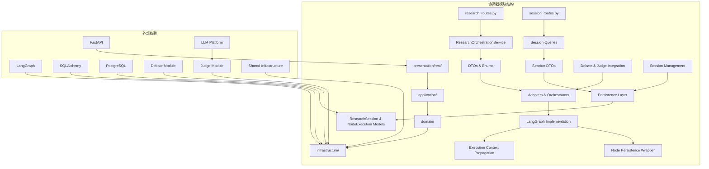
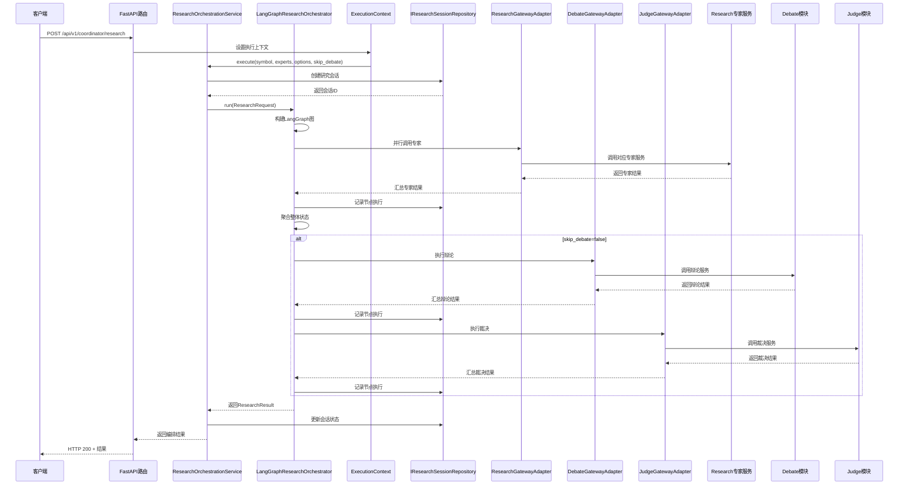
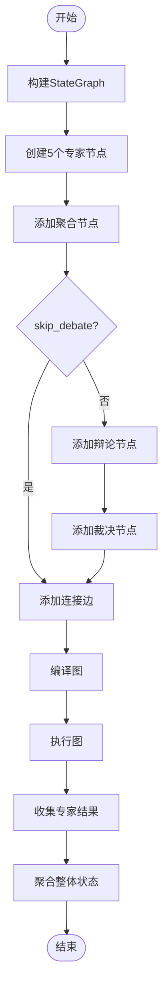
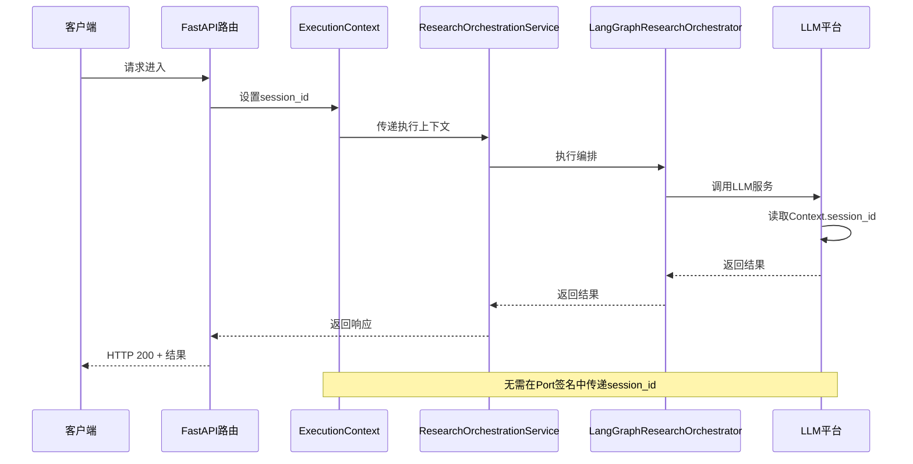
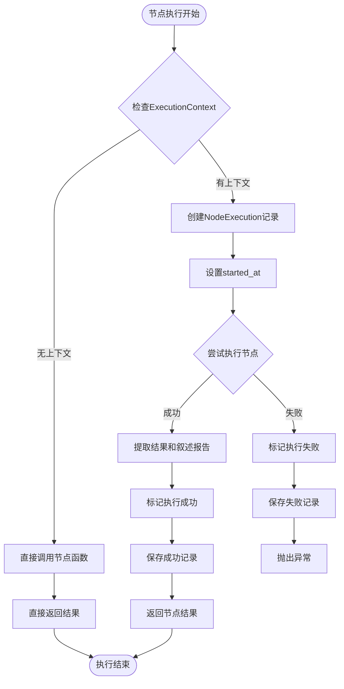
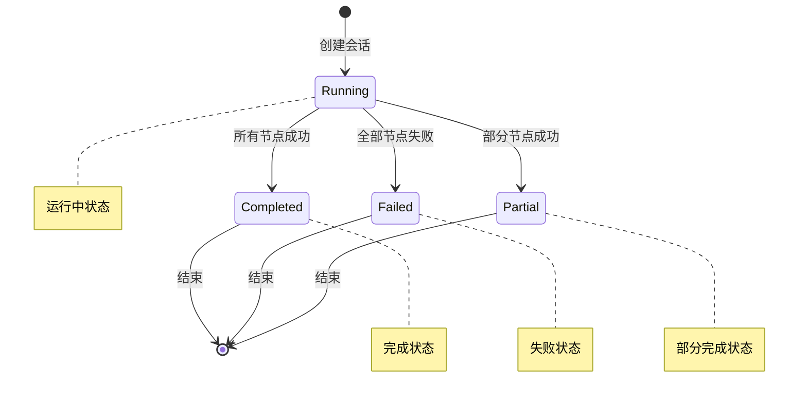
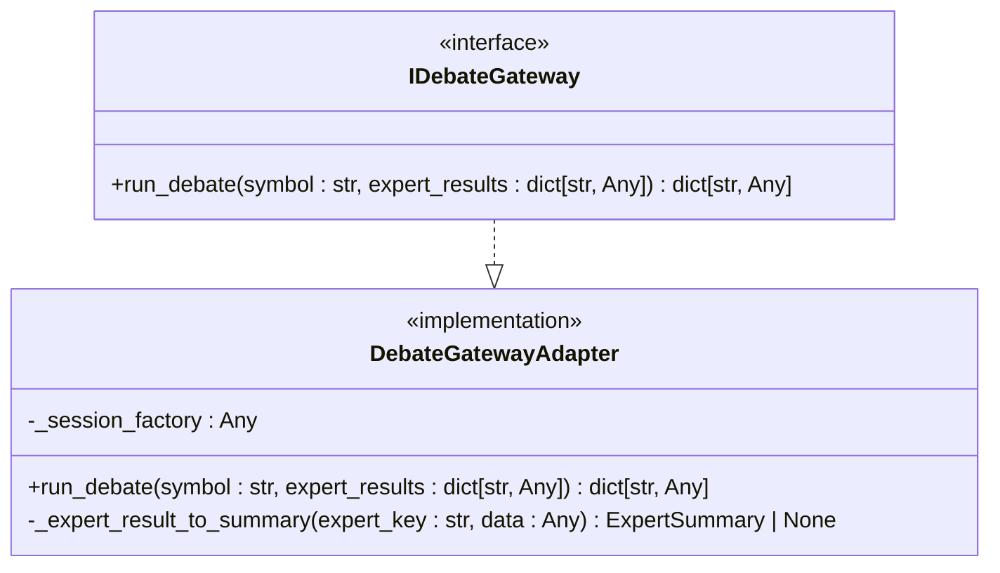
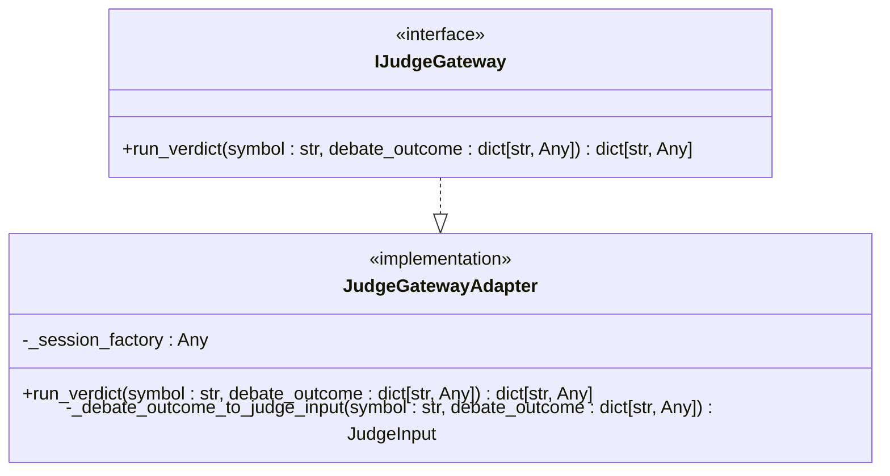
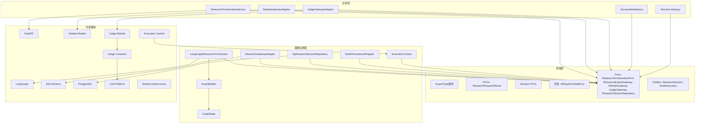

# 协调器研究编排规范

<cite>
**本文档引用的文件**
- [spec.md](file://openspec/specs/coordinator-research-orchestration/spec.md)
- [research_orchestration_service.py](file://src/modules/coordinator/application/research_orchestration_service.py)
- [research_dtos.py](file://src/modules/coordinator/domain/dtos/research_dtos.py)
- [research_expert_gateway.py](file://src/modules/coordinator/domain/ports/research_expert_gateway.py)
- [debate_gateway.py](file://src/modules/coordinator/domain/ports/debate_gateway.py)
- [judge_gateway.py](file://src/modules/coordinator/domain/ports/judge_gateway.py)
- [research_session_repository.py](file://src/modules/coordinator/domain/ports/research_session_repository.py)
- [langgraph_orchestrator.py](file://src/modules/coordinator/infrastructure/orchestration/langgraph_orchestrator.py)
- [node_persistence_wrapper.py](file://src/modules/coordinator/infrastructure/orchestration/node_persistence_wrapper.py)
- [enums.py](file://src/modules/coordinator/domain/model/enums.py)
- [research_gateway_adapter.py](file://src/modules/coordinator/infrastructure/adapters/research_gateway_adapter.py)
- [debate_gateway_adapter.py](file://src/modules/coordinator/infrastructure/adapters/debate_gateway_adapter.py)
- [judge_gateway_adapter.py](file://src/modules/coordinator/infrastructure/adapters/judge_gateway_adapter.py)
- [research_routes.py](file://src/modules/coordinator/presentation/rest/research_routes.py)
- [session_routes.py](file://src/modules/coordinator/presentation/rest/session_routes.py)
- [container.py](file://src/modules/coordinator/container.py)
- [routes.py](file://src/api/routes.py)
- [graph_builder.py](file://src/modules/coordinator/infrastructure/orchestration/graph_builder.py)
- [research_orchestration.py](file://src/modules/coordinator/domain/ports/research_orchestration.py)
- [exceptions.py](file://src/modules/coordinator/domain/exceptions.py)
- [graph_state.py](file://src/modules/coordinator/infrastructure/orchestration/graph_state.py)
- [execution_context.py](file://src/shared/infrastructure/execution_context.py)
- [research_session.py](file://src/modules/coordinator/domain/model/research_session.py)
- [node_execution.py](file://src/modules/coordinator/domain/model/node_execution.py)
- [session_dtos.py](file://src/modules/coordinator/application/dtos/session_dtos.py)
- [session_detail_query.py](file://src/modules/coordinator/application/queries/session_detail_query.py)
- [research_session_model.py](file://src/modules/coordinator/infrastructure/persistence/research_session_model.py)
- [node_execution_model.py](file://src/modules/coordinator/infrastructure/persistence/node_execution_model.py)
- [test_research_orchestration_service.py](file://tests/coordinator/test_research_orchestration_service.py)
- [test_research_gateway_adapter.py](file://tests/coordinator/test_research_gateway_adapter.py)
- [test_debate_gateway_adapter.py](file://tests/coordinator/test_debate_gateway_adapter.py)
- [test_debate_node_and_skip_debate.py](file://tests/coordinator/test_debate_node_and_skip_debate.py)
- [test_judge_gateway_adapter.py](file://tests/coordinator/test_judge_gateway_adapter.py)
- [test_judge_node_and_orchestration.py](file://tests/coordinator/test_judge_node_and_orchestration.py)
- [test_node_persistence_wrapper.py](file://tests/coordinator/infrastructure/orchestration/test_node_persistence_wrapper.py)
- [test_execution_context.py](file://tests/shared/infrastructure/test_execution_context.py)
- [judge_service.py](file://src/modules/judge/application/services/judge_service.py)
- [verdict_dto.py](file://src/modules/judge/application/dtos/verdict_dto.py)
- [judge_input.py](file://src/modules/judge/domain/dtos/judge_input.py)
- [judge_container.py](file://src/modules/judge/container.py)
</cite>

## 更新摘要
**变更内容**
- 新增执行上下文传播章节，详细说明ExecutionContext在协调器模块中的作用和实现
- 新增节点持久化包装器章节，介绍persist_node_execution的实现和容错机制
- 新增研究会话管理章节，涵盖会话生命周期管理和REST API端点
- 更新架构概览，包含执行追踪和持久化层
- 扩展核心组件分析，增加IResearchSessionRepository和相关模型
- 新增执行追踪的性能考虑和故障排除指南

## 目录
1. [简介](#简介)
2. [项目结构](#项目结构)
3. [核心组件](#核心组件)
4. [架构概览](#架构概览)
5. [详细组件分析](#详细组件分析)
6. [执行上下文传播](#执行上下文传播)
7. [节点持久化包装器](#节点持久化包装器)
8. [研究会话管理](#研究会话管理)
9. [辩论模块集成](#辩论模块集成)
10. [裁决网关集成](#裁决网关集成)
11. [依赖关系分析](#依赖关系分析)
12. [性能考虑](#性能考虑)
13. [故障排除指南](#故障排除指南)
14. [结论](#结论)

## 简介

协调器研究编排模块是Stock Helper项目中的核心功能模块，负责通过单一REST端点接收研究请求，基于LangGraph有向图按需并行调用Research模块对应的专家应用服务，汇总各专家结果后统一返回。该模块严格遵循领域驱动设计(DDD)原则，实现了清晰的分层架构和依赖注入机制。

**更新** 新增执行上下文传播、节点持久化包装器、研究会话管理等重大增强功能，提供完整的执行追踪能力，支持多空专家观点的并行评估、统一结论生成和最终投资决策制定，提供更全面的投资决策支持。

## 项目结构

协调器模块采用标准的DDD四层架构模式，现已扩展包含执行追踪和会话管理功能：

**图表来源**
- [container.py](file://src/modules/coordinator/container.py#L20-L36)
- [routes.py](file://src/api/routes.py#L1-L18)

**章节来源**
- [container.py](file://src/modules/coordinator/container.py#L1-L56)
- [routes.py](file://src/api/routes.py#L1-L18)

## 核心组件

### 专家类型枚举

协调器模块定义了五种专家类型，每种专家都有特定的研究职责：

| 专家类型 | 英文名称 | 中文描述 | 主要职责 |
|---------|----------|----------|----------|
| TECHNICAL_ANALALYST | 技术分析师 | 分析股票价格和技术指标 | 技术分析、趋势判断 |
| FINANCIAL_AUDITOR | 财务审计员 | 审核公司财务报表 | 财务数据分析、风险评估 |
| VALUATION_MODELER | 估值建模师 | 评估股票内在价值 | 估值模型、DCF分析 |
| MACRO_INTELLIGENCE | 宏观情报员 | 分析宏观经济环境 | 宏观经济影响分析 |
| CATALYST_DETECTIVE | 催化剂侦探 | 寻找股价驱动因素 | 事件驱动分析 |

### 研究编排服务

ResearchOrchestrationService是协调器模块的应用服务层核心，负责：

1. **输入验证**：校验symbol和experts参数的有效性
2. **请求构建**：将字符串专家类型转换为ExpertType枚举
3. **编排执行**：调用IResearchOrchestrationPort执行并行编排
4. **结果处理**：根据overall_status返回或抛出异常

**更新** 新增skip_debate参数支持，允许用户控制是否执行辩论和裁决阶段。

**章节来源**
- [research_orchestration_service.py](file://src/modules/coordinator/application/research_orchestration_service.py#L11-L74)
- [enums.py](file://src/modules/coordinator/domain/model/enums.py#L9-L17)

## 架构概览

协调器模块采用Clean Architecture设计模式，现已扩展包含执行追踪和会话管理功能：

**图表来源**
- [research_routes.py](file://src/modules/coordinator/presentation/rest/research_routes.py#L71-L104)
- [research_orchestration_service.py](file://src/modules/coordinator/application/research_orchestration_service.py#L21-L73)
- [langgraph_orchestrator.py](file://src/modules/coordinator/infrastructure/orchestration/langgraph_orchestrator.py#L27-L74)
- [execution_context.py](file://src/shared/infrastructure/execution_context.py#L11-L20)

## 详细组件分析

### LangGraph编排器

LangGraphResearchOrchestrator是基础设施层的核心实现，基于LangGraph框架实现动态并行编排：

```mermaid
classDiagram
class LangGraphResearchOrchestrator {
-_gateway : IResearchExpertGateway
-_debate_gateway : IDebateGateway
-_judge_gateway : IJudgeGateway
-_session_repo : IResearchSessionRepository
+run(request : ResearchRequest) ResearchResult
}
class IResearchOrchestrationPort {
<<interface>>
+run(request : ResearchRequest) ResearchResult
}
class ResearchGatewayAdapter {
-_session_factory : Any
+run_expert(expert_type : ExpertType, symbol : str, options : dict) dict
-_normalize_catalyst_result(agent_result : Any) dict
-_parse_analysis_date(value : Any) date
}
class DebateGatewayAdapter {
-_session_factory : Any
+run_debate(symbol : str, expert_results : dict[str, Any]) dict
-_expert_result_to_summary(expert_key : str, data : Any) ExpertSummary | None
}
class JudgeGatewayAdapter {
-_session_factory : Any
+run_verdict(symbol : str, debate_outcome : dict[str, Any]) dict
-_debate_outcome_to_judge_input(symbol : str, debate_outcome : dict[str, Any]) JudgeInput
}
class IResearchExpertGateway {
<<interface>>
+run_expert(expert_type : ExpertType, symbol : str, options : dict) dict
}
class IDebateGateway {
<<interface>>
+run_debate(symbol : str, expert_results : dict[str, Any]) dict
}
class IJudgeGateway {
<<interface>>
+run_verdict(symbol : str, debate_outcome : dict[str, Any]) dict
}
class IResearchSessionRepository {
<<interface>>
+save_session(session : ResearchSession) void
+update_session(session : ResearchSession) void
+save_node_execution(execution : NodeExecution) void
+get_session_by_id(id : UUID) ResearchSession
+list_sessions(filters) list[ResearchSession]
+get_node_executions_by_session(id : UUID) list[NodeExecution]
}
LangGraphResearchOrchestrator ..|> IResearchOrchestrationPort
LangGraphResearchOrchestrator --> IResearchExpertGateway
LangGraphResearchOrchestrator --> IDebateGateway
LangGraphResearchOrchestrator --> IJudgeGateway
LangGraphResearchOrchestrator --> IResearchSessionRepository
ResearchGatewayAdapter ..|> IResearchExpertGateway
DebateGatewayAdapter ..|> IDebateGateway
JudgeGatewayAdapter ..|> IJudgeGateway
```

**图表来源**
- [langgraph_orchestrator.py](file://src/modules/coordinator/infrastructure/orchestration/langgraph_orchestrator.py#L17-L26)
- [research_expert_gateway.py](file://src/modules/coordinator/domain/ports/research_expert_gateway.py#L13-L34)
- [debate_gateway.py](file://src/modules/coordinator/domain/ports/debate_gateway.py#L10-L25)
- [research_gateway_adapter.py](file://src/modules/coordinator/infrastructure/adapters/research_gateway_adapter.py#L17-L31)
- [judge_gateway.py](file://src/modules/coordinator/domain/ports/judge_gateway.py#L10-L27)
- [research_session_repository.py](file://src/modules/coordinator/domain/ports/research_session_repository.py#L14-L53)

### 图构建器

graph_builder模块负责构建LangGraph图结构，实现动态fan-out并行执行：

**图表来源**
- [graph_builder.py](file://src/modules/coordinator/infrastructure/orchestration/graph_builder.py#L92-L122)
- [graph_state.py](file://src/modules/coordinator/infrastructure/orchestration/graph_state.py#L13-L27)

### REST API路由

协调器模块提供REST API接口，支持灵活的研究编排请求和会话管理：

| 接口 | 方法 | 路径 | 功能描述 |
|------|------|------|----------|
| 研究编排 | POST | /api/v1/coordinator/research | 主要的编排接口，支持并行专家调用、辩论阶段和裁决阶段 |
| 会话列表 | GET | /api/v1/research/sessions | 分页查询研究会话列表，支持按symbol、时间范围筛选 |
| 会话详情 | GET | /api/v1/research/sessions/{id} | 查询单次研究会话详情及全部节点执行记录 |
| LLM调用日志 | GET | /api/v1/research/sessions/{id}/llm-calls | 返回该会话下所有LLM调用的审计日志 |
| 外部API调用日志 | GET | /api/v1/research/sessions/{id}/api-calls | 返回该会话下所有外部API调用的审计日志 |
| 健康检查 | GET | /api/v1/health | 服务健康状态检查 |

**更新** 新增会话管理相关的REST API端点，提供完整的执行追踪能力。

**章节来源**
- [research_routes.py](file://src/modules/coordinator/presentation/rest/research_routes.py#L65-L112)
- [session_routes.py](file://src/modules/coordinator/presentation/rest/session_routes.py#L50-L149)
- [routes.py](file://src/api/routes.py#L10-L18)

## 执行上下文传播

### ExecutionContext设计

协调器模块引入了ExecutionContext机制，通过contextvars在请求/流水线内隐式传递session_id：

**图表来源**
- [execution_context.py](file://src/shared/infrastructure/execution_context.py#L11-L20)
- [node_persistence_wrapper.py](file://src/modules/coordinator/infrastructure/orchestration/node_persistence_wrapper.py#L61-L64)

### 执行上下文实现

ExecutionContext类提供以下核心功能：

1. **会话标识**：通过session_id关联所有执行活动
2. **上下文变量**：使用contextvars.ContextVar实现线程安全的上下文传递
3. **默认值**：默认None，支持无上下文的单测和定时任务
4. **隐式传递**：下游组件通过current_execution_ctx.get()读取，无需显式参数传递

**更新** 新增执行上下文传播功能，使LLM调用和外部API适配器能够自动获取会话信息。

**章节来源**
- [execution_context.py](file://src/shared/infrastructure/execution_context.py#L1-L21)

## 节点持久化包装器

### persist_node_execution设计

节点持久化包装器为LangGraph节点函数提供自动执行追踪功能：

**图表来源**
- [node_persistence_wrapper.py](file://src/modules/coordinator/infrastructure/orchestration/node_persistence_wrapper.py#L51-L108)

### 容错机制

persist_node_execution实现了以下容错机制：

1. **非阻塞写入**：持久化失败不影响主流程执行
2. **异常降级**：记录警告日志但不中断节点执行
3. **结果完整性**：无论持久化成功与否都返回节点原始结果
4. **状态一致性**：成功和失败都会记录相应的执行状态

**更新** 新增节点持久化包装器，提供完整的执行追踪能力，支持节点级别的成功/失败记录。

**章节来源**
- [node_persistence_wrapper.py](file://src/modules/coordinator/infrastructure/orchestration/node_persistence_wrapper.py#L1-L109)

## 研究会话管理

### 会话生命周期

研究会话管理模块提供完整的会话生命周期管理：

**图表来源**
- [research_session.py](file://src/modules/coordinator/domain/model/research_session.py#L26-L42)

### 会话查询接口

协调器模块提供完整的会话查询功能：

| 接口 | 方法 | 路径 | 功能描述 |
|------|------|------|----------|
| 会话列表 | GET | /api/v1/research/sessions | 分页查询研究会话列表，支持按symbol、时间范围筛选 |
| 会话详情 | GET | /api/v1/research/sessions/{id} | 查询单次研究会话详情及全部节点执行记录 |
| LLM调用日志 | GET | /api/v1/research/sessions/{id}/llm-calls | 返回该会话下所有LLM调用的审计日志 |
| 外部API调用日志 | GET | /api/v1/research/sessions/{id}/api-calls | 返回该会话下所有外部API调用的审计日志 |

**更新** 新增完整的会话管理REST API端点，提供执行追踪和审计能力。

**章节来源**
- [session_routes.py](file://src/modules/coordinator/presentation/rest/session_routes.py#L50-L149)
- [session_dtos.py](file://src/modules/coordinator/application/dtos/session_dtos.py#L11-L81)
- [session_detail_query.py](file://src/modules/coordinator/application/queries/session_detail_query.py#L13-L51)

### 数据模型

研究会话和节点执行的数据模型设计：

#### ResearchSession实体
- **状态管理**：running/completed/partial/failed四种状态
- **元数据存储**：symbol、selected_experts、options、trigger_source
- **时间戳管理**：created_at、completed_at、duration_ms
- **生命周期方法**：complete()、fail()、mark_partial()

#### NodeExecution实体  
- **节点类型**：technical_analyst、financial_auditor、valuation_modeler、macro_intelligence、catalyst_detective、debate、judge
- **执行状态**：success/failed/skipped
- **结果存储**：result_data（结构化结果）、narrative_report（叙述性报告）
- **错误信息**：error_type、error_message
- **性能指标**：started_at、completed_at、duration_ms

**章节来源**
- [research_session.py](file://src/modules/coordinator/domain/model/research_session.py#L13-L43)
- [node_execution.py](file://src/modules/coordinator/domain/model/node_execution.py#L13-L59)

## 辩论模块集成

### IDebateGateway Port

协调器模块新增了IDebateGateway抽象接口，用于调用辩论模块：

**图表来源**
- [debate_gateway.py](file://src/modules/coordinator/domain/ports/debate_gateway.py#L10-L25)
- [debate_gateway_adapter.py](file://src/modules/coordinator/infrastructure/adapters/debate_gateway_adapter.py#L93-L122)

### DebateGatewayAdapter

DebateGatewayAdapter实现了IDebateGateway接口，负责：

1. **专家结果归一化**：将不同专家的原始结果转换为统一的ExpertSummary格式
2. **字段映射**：根据专家类型映射不同的字段名（如valuation_modeler的valuation_verdict→signal）
3. **调试字段过滤**：过滤掉input、output、indicators等调试和大体积字段
4. **会话管理**：使用独立的AsyncSession进行辩论调用
5. **结果序列化**：将DebateOutcomeDTO转换为dict返回

**章节来源**
- [debate_gateway_adapter.py](file://src/modules/coordinator/infrastructure/adapters/debate_gateway_adapter.py#L1-L123)

### 辩论节点行为

debate_node负责执行辩论阶段：

1. **状态检查**：如果overall_status为"failed"或results为空，跳过辩论
2. **并行执行**：调用IDebateGateway.run_debate获取辩论结果
3. **异常处理**：捕获并记录异常，降级为debate_outcome为空dict
4. **结果写入**：将辩论结果写入图状态的debate_outcome字段

**章节来源**
- [graph_builder.py](file://src/modules/coordinator/infrastructure/orchestration/graph_builder.py#L92-L114)

## 裁决网关集成

### IJudgeGateway Port

协调器模块新增了IJudgeGateway抽象接口，用于调用裁决模块：

**图表来源**
- [judge_gateway.py](file://src/modules/coordinator/domain/ports/judge_gateway.py#L10-L27)
- [judge_gateway_adapter.py](file://src/modules/coordinator/infrastructure/adapters/judge_gateway_adapter.py#L39-L62)

### JudgeGatewayAdapter

JudgeGatewayAdapter实现了IJudgeGateway接口，负责：

1. **辩论结果归一化**：将debate_outcome dict转换为JudgeInput，仅保留结论级字段
2. **字段提取**：从risk_matrix中提取risk因子列表，过滤probability/impact/mitigation等细节字段
3. **核心论点映射**：提取bull_case和bear_case的core_thesis作为bull_thesis和bear_thesis
4. **会话管理**：使用独立的AsyncSession进行裁决调用
5. **服务调用**：通过JudgeContainer获取JudgeService并执行裁决
6. **结果序列化**：将VerdictDTO转换为dict返回

**更新** 新增字段提取逻辑，从risk_matrix中提取风险因子列表，仅保留结论级字段。

**章节来源**
- [judge_gateway_adapter.py](file://src/modules/coordinator/infrastructure/adapters/judge_gateway_adapter.py#L1-L63)

### 裁决节点行为

judge_node负责执行裁决阶段：

1. **状态检查**：如果debate_outcome为空，跳过裁决
2. **并行执行**：调用IJudgeGateway.run_verdict获取裁决结果
3. **异常处理**：捕获并记录异常，降级为verdict为空dict
4. **结果写入**：将裁决结果写入图状态的verdict字段

**章节来源**
- [graph_builder.py](file://src/modules/coordinator/infrastructure/orchestration/graph_builder.py#L117-L138)

### JudgeService和VerdictDTO

裁决模块的核心组件：

1. **JudgeService**：接收JudgeInput，调用IJudgeVerdictAgentPort.judge()，组装VerdictDTO返回
2. **VerdictDTO**：包含symbol、action、position_percent、confidence、entry_strategy、stop_loss、take_profit、time_horizon、risk_warnings、reasoning等字段
3. **JudgeInput**：仅包含结论级字段，由JudgeGatewayAdapter从debate_outcome转换而来

**章节来源**
- [judge_service.py](file://src/modules/judge/application/services/judge_service.py#L11-L34)
- [verdict_dto.py](file://src/modules/judge/application/dtos/verdict_dto.py#L9-L21)
- [judge_input.py](file://src/modules/judge/domain/dtos/judge_input.py#L9-L22)

## 依赖关系分析

协调器模块的依赖关系遵循DDD原则，现已扩展包含执行追踪和会话管理功能：

**图表来源**
- [container.py](file://src/modules/coordinator/container.py#L26-L55)
- [research_orchestration_service.py](file://src/modules/coordinator/application/research_orchestration_service.py#L18-L19)
- [judge_container.py](file://src/modules/judge/container.py#L19-L30)

**章节来源**
- [container.py](file://src/modules/coordinator/container.py#L1-L56)
- [research_orchestration.py](file://src/modules/coordinator/domain/ports/research_orchestration.py#L14-L28)

## 性能考虑

### 并行执行优化

协调器模块通过LangGraph实现真正的并行执行，避免了传统串行调用的性能瓶颈：

1. **动态fan-out**：根据用户选择的专家数量动态创建执行节点
2. **无阻塞调用**：各专家节点独立执行，互不阻塞
3. **会话隔离**：每个专家调用使用独立的数据库会话，避免并发冲突

**更新** 新增执行追踪和会话管理的性能考虑：

1. **执行上下文开销**：contextvars的使用对性能影响极小，适合高频调用场景
2. **持久化异步化**：节点执行记录采用异步持久化，不阻塞主流程
3. **容错机制**：持久化失败仅记录warning，不影响主流程性能
4. **批量查询优化**：会话查询支持分页和条件筛选，避免大数据量查询
5. **字段选择优化**：会话详情查询仅返回必要字段，减少数据传输
6. **缓存友好**：会话ID作为主键查询，利用数据库索引提升性能
7. **跳过选项**：skip_debate参数允许用户跳过辩论和裁决阶段以节省时间
8. **字段过滤**：裁决阶段过滤掉大体积的调试字段，减少内存占用

### 内存管理

1. **状态合并**：使用Annotated reducer自动合并各专家节点的状态
2. **结果归一化**：统一专家结果格式，减少内存碎片
3. **异常隔离**：单个专家失败不影响其他专家执行
4. **调试字段过滤**：辩论和裁决阶段过滤掉大体积的调试字段，减少内存占用
5. **空结果降级**：辩论和裁决失败时返回空dict，避免内存泄漏
6. **上下文清理**：执行完成后自动清理执行上下文，避免内存泄漏

**更新** 新增执行追踪相关的内存管理考虑。

## 故障排除指南

### 常见问题及解决方案

| 问题类型 | 症状 | 可能原因 | 解决方案 |
|----------|------|----------|----------|
| 参数验证失败 | HTTP 400错误 | symbol为空或experts无效 | 检查请求参数格式和内容 |
| 全部专家失败 | HTTP 500错误 | 所有专家执行异常 | 检查专家服务可用性和配置 |
| 数据库连接错误 | 并发访问异常 | 多专家共享数据库会话 | 确保使用独立会话工厂 |
| LangGraph执行错误 | 图执行异常 | 节点状态不匹配 | 检查GraphState定义 |
| **更新** | **执行上下文丢失** | **上下文变量未正确设置** | **检查FastAPI中间件和依赖注入** |
| **更新** | **节点持久化失败** | **数据库连接异常或权限不足** | **检查数据库配置和连接池** |
| **更新** | **会话查询超时** | **缺少必要的索引或查询条件不当** | **优化查询条件和数据库索引** |
| **更新** | **辩论阶段异常** | **LLM解析错误或服务不可用** | **检查辩论模块配置和网络连接** |
| **更新** | **裁决阶段异常** | **风险因子提取失败或LLM服务异常** | **检查裁决模块配置和JudgeContainer** |
| **更新** | **skip_debate参数无效** | **请求体格式错误** | **确认skip_debate为布尔值** |

### 调试建议

1. **启用详细日志**：检查专家节点、辩论节点、裁决节点和执行追踪日志
2. **单元测试**：运行协调器模块测试套件，包括执行上下文、节点持久化和会话管理测试
3. **依赖注入验证**：确认容器正确装配所有依赖，包括IResearchSessionRepository
4. **执行上下文测试**：运行test_execution_context.py验证上下文传播功能
5. **节点持久化测试**：运行test_node_persistence_wrapper.py验证持久化包装器功能
6. **会话管理测试**：运行session相关的查询和路由测试用例
7. **完整流水线测试**：运行包含专家、辩论、裁决和执行追踪的完整编排测试

**更新** 新增执行追踪和会话管理相关的调试建议。

**章节来源**
- [research_routes.py](file://src/modules/coordinator/presentation/rest/research_routes.py#L105-L111)
- [exceptions.py](file://src/modules/coordinator/domain/exceptions.py#L9-L17)
- [test_execution_context.py](file://tests/shared/infrastructure/test_execution_context.py#L1-L82)
- [test_node_persistence_wrapper.py](file://tests/coordinator/infrastructure/orchestration/test_node_persistence_wrapper.py#L1-L33)

## 结论

协调器研究编排模块通过Clean Architecture设计和LangGraph并行执行机制，实现了高效、可扩展的研究分析编排系统。该模块严格遵循DDD原则，通过明确的分层架构和依赖注入机制，确保了系统的可维护性和可测试性。

**更新** 新增的执行上下文传播、节点持久化包装器、研究会话管理等重大增强功能为系统带来了显著提升：

### 主要优势

1. **高并发性能**：基于LangGraph的动态并行执行
2. **强类型安全**：完整的类型定义和验证机制
3. **清晰的架构**：严格的分层设计和依赖管理
4. **完善的测试**：覆盖所有关键场景的自动化测试
5. **完整的执行追踪**：通过ExecutionContext和NodeExecution实现端到端的执行监控
6. **多空观点整合**：通过辩论模块实现多空专家观点的并行评估和统一结论生成
7. **最终决策制定**：通过裁决网关实现基于综合分析的投资决策
8. **灵活的执行控制**：支持skip_debate参数，允许用户根据需要控制辩论和裁决阶段的执行
9. **审计合规**：完整的会话管理和调用日志记录，满足审计需求
10. **容错稳健**：持久化失败不影响主流程，确保系统稳定性

### 新增功能特性

1. **执行上下文传播**：通过contextvars实现session_id的隐式传递，简化下游组件开发
2. **节点持久化包装器**：自动记录节点执行状态，提供完整的执行追踪能力
3. **研究会话管理**：完整的会话生命周期管理，支持状态转换和历史查询
4. **会话查询API**：提供REST接口查询会话详情和相关调用日志
5. **审计日志集成**：自动关联LLM调用和外部API调用到相应会话
6. **容错机制**：持久化失败不阻塞主流程，确保系统可靠性
7. **性能优化**：异步持久化、批量查询、字段选择优化等性能改进
8. **内存管理**：自动清理执行上下文，避免内存泄漏

该设计为后续的功能扩展和维护奠定了坚实的基础，是Stock Helper项目中的重要基础设施组件。新增的执行追踪、会话管理和审计功能显著提升了系统的实用价值、商业价值和合规价值，为投资决策提供了更全面、更深入的分析支持和监管保障。