# 辩论网关集成规范

<cite>
**本文档引用的文件**
- [debate_gateway.py](file://src/modules/coordinator/domain/ports/debate_gateway.py)
- [debate_gateway_adapter.py](file://src/modules/coordinator/infrastructure/adapters/debate_gateway_adapter.py)
- [judge_gateway.py](file://src/modules/coordinator/domain/ports/judge_gateway.py)
- [judge_gateway_adapter.py](file://src/modules/coordinator/infrastructure/adapters/judge_gateway_adapter.py)
- [langgraph_orchestrator.py](file://src/modules/coordinator/infrastructure/orchestration/langgraph_orchestrator.py)
- [graph_builder.py](file://src/modules/coordinator/infrastructure/orchestration/graph_builder.py)
- [debate_router.py](file://src/modules/debate/presentation/rest/debate_router.py)
- [debate_service.py](file://src/modules/debate/application/services/debate_service.py)
- [bull_advocate_agent.py](file://src/modules/debate/domain/ports/bull_advocate_agent.py)
- [bear_advocate_agent.py](file://src/modules/debate/domain/ports/bear_advocate_agent.py)
- [resolution_agent.py](file://src/modules/debate/domain/ports/resolution_agent.py)
- [debate_input.py](file://src/modules/debate/domain/dtos/debate_input.py)
- [bull_bear_argument.py](file://src/modules/debate/domain/dtos/bull_bear_argument.py)
- [debate_outcome_dto.py](file://src/modules/debate/application/dtos/debate_outcome_dto.py)
- [verdict_dto.py](file://src/modules/judge/application/dtos/verdict_dto.py)
- [verdict_result.py](file://src/modules/judge/domain/dtos/verdict_result.py)
- [judge_verdict_agent_adapter.py](file://src/modules/judge/infrastructure/adapters/judge_verdict_agent_adapter.py)
- [container.py](file://src/modules/debate/container.py)
- [judge_container.py](file://src/modules/judge/container.py)
- [coordinator_container.py](file://src/modules/coordinator/container.py)
- [bull_advocate_agent_adapter.py](file://src/modules/debate/infrastructure/adapters/bull_advocate_agent_adapter.py)
- [bear_advocate_agent_adapter.py](file://src/modules/debate/infrastructure/adapters/bear_advocate_agent_adapter.py)
- [resolution_agent_adapter.py](file://src/modules/debate/infrastructure/adapters/resolution_agent_adapter.py)
- [test_debate_gateway_adapter.py](file://tests/coordinator/test_debate_gateway_adapter.py)
- [test_judge_gateway_adapter.py](file://tests/coordinator/test_judge_gateway_adapter.py)
</cite>

## 更新摘要
**所做更改**
- 扩展了协调器模块与辩论模块的集成说明，增加了裁决阶段的完整集成细节
- 新增了 JudgeGatewayAdapter 的详细实现说明和字段映射规则
- 补充了 LangGraph 编排器中裁决节点的工作流程
- 增加了裁决阶段的错误处理和降级机制说明
- 完善了从辩论结果到裁决输出的完整数据流

## 目录
1. [简介](#简介)
2. [项目结构](#项目结构)
3. [核心组件](#核心组件)
4. [架构概览](#架构概览)
5. [详细组件分析](#详细组件分析)
6. [裁决阶段集成](#裁决阶段集成)
7. [依赖关系分析](#依赖关系分析)
8. [性能考虑](#性能考虑)
9. [故障排除指南](#故障排除指南)
10. [结论](#结论)

## 简介

本规范定义了辩论网关在研究编排系统中的集成标准和接口约定。辩论网关作为协调器模块与辩论模块之间的桥梁，负责将来自各个研究专家的结果标准化并传递给辩论引擎，最终输出多空双方的论证和冲突消解结果。

**更新** 本次更新扩展了裁决阶段的集成细节，详细说明了 JudgeGatewayAdapter 如何处理辩论结果并调用裁决服务，完善了从专家结果到最终决策的完整流水线。

该规范确保了以下关键目标：
- 统一不同专家结果的数据格式
- 提供异步并行处理能力
- 标准化的错误处理机制
- 清晰的接口契约和数据流
- **新增** 完整的裁决阶段集成和降级机制

## 项目结构

研究编排系统采用分层架构设计，主要包含以下模块：

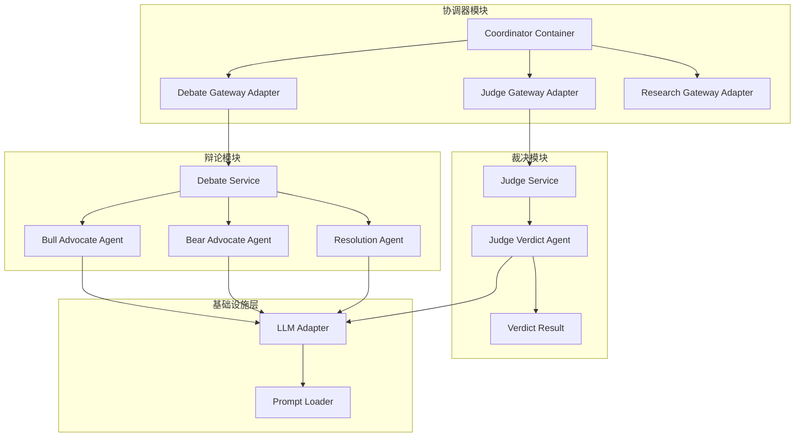

**图表来源**
- [coordinator_container.py](file://src/modules/coordinator/container.py#L27-L49)
- [container.py](file://src/modules/debate/container.py#L25-L43)
- [judge_container.py](file://src/modules/judge/container.py#L19-L31)

**章节来源**
- [coordinator_container.py](file://src/modules/coordinator/container.py#L1-L49)
- [container.py](file://src/modules/debate/container.py#L1-L43)
- [judge_container.py](file://src/modules/judge/container.py#L1-L31)

## 核心组件

### 辩论网关接口

IDebateGateway 定义了协调器调用辩论模块的标准接口：

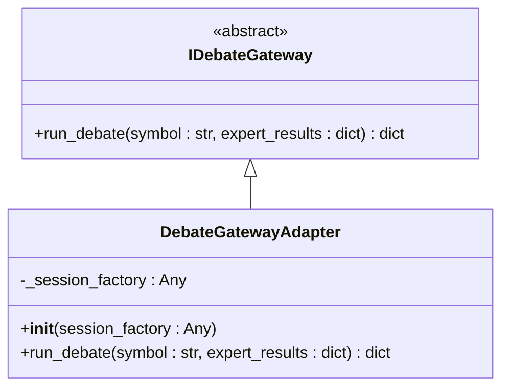

**图表来源**
- [debate_gateway.py](file://src/modules/coordinator/domain/ports/debate_gateway.py#L10-L26)
- [debate_gateway_adapter.py](file://src/modules/coordinator/infrastructure/adapters/debate_gateway_adapter.py#L93-L123)

### 裁决网关接口

IJudgeGateway 定义了协调器调用裁决模块的标准接口：

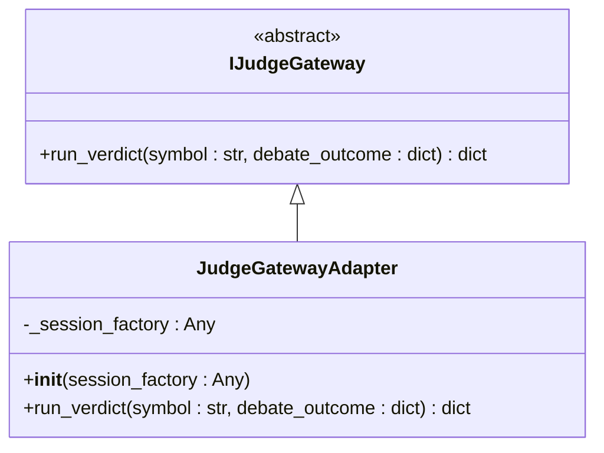

**图表来源**
- [judge_gateway.py](file://src/modules/coordinator/domain/ports/judge_gateway.py#L10-L28)
- [judge_gateway_adapter.py](file://src/modules/coordinator/infrastructure/adapters/judge_gateway_adapter.py#L39-L63)

### 专家结果标准化

DebateGatewayAdapter 负责将来自不同专家的结果标准化为统一格式：

| 专家类型 | 信号字段 | 置信度字段 | 推理摘要字段 | 风险警告字段 |
|---------|---------|-----------|-------------|-------------|
| technical_analyst | signal | confidence | summary_reasoning | risk_warning |
| financial_auditor | signal | confidence | summary_reasoning | risk_warning |
| valuation_modeler | valuation_verdict | confidence_score | reasoning_summary | risk_factors |
| macro_intelligence | macro_environment | confidence_score | macro_summary | key_risks |
| catalyst_detective | result.catalyst_assessment | result.confidence_score | result.catalyst_summary | result.negative_catalysts |

**章节来源**
- [debate_gateway_adapter.py](file://src/modules/coordinator/infrastructure/adapters/debate_gateway_adapter.py#L12-L35)
- [debate_gateway_adapter.py](file://src/modules/coordinator/infrastructure/adapters/debate_gateway_adapter.py#L67-L91)

## 架构概览

辩论网关的完整工作流程如下：

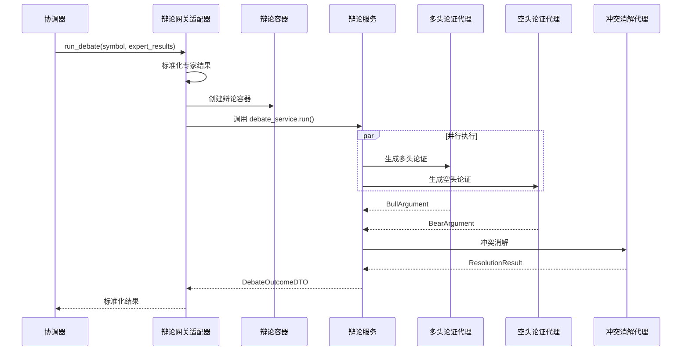

**图表来源**
- [debate_gateway_adapter.py](file://src/modules/coordinator/infrastructure/adapters/debate_gateway_adapter.py#L106-L123)
- [debate_service.py](file://src/modules/debate/application/services/debate_service.py#L35-L67)
- [container.py](file://src/modules/debate/container.py#L25-L43)

## 详细组件分析

### 专家结果映射算法

专家结果的标准化过程遵循以下算法：

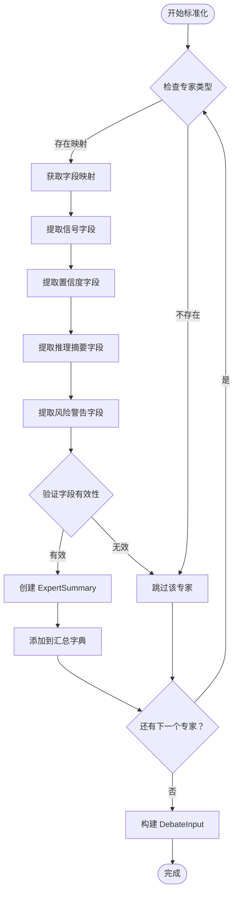

**图表来源**
- [debate_gateway_adapter.py](file://src/modules/coordinator/infrastructure/adapters/debate_gateway_adapter.py#L67-L91)
- [debate_input.py](file://src/modules/debate/domain/dtos/debate_input.py#L9-L21)

### 辩论服务执行流程

DebateService 实现了三阶段的辩论执行：

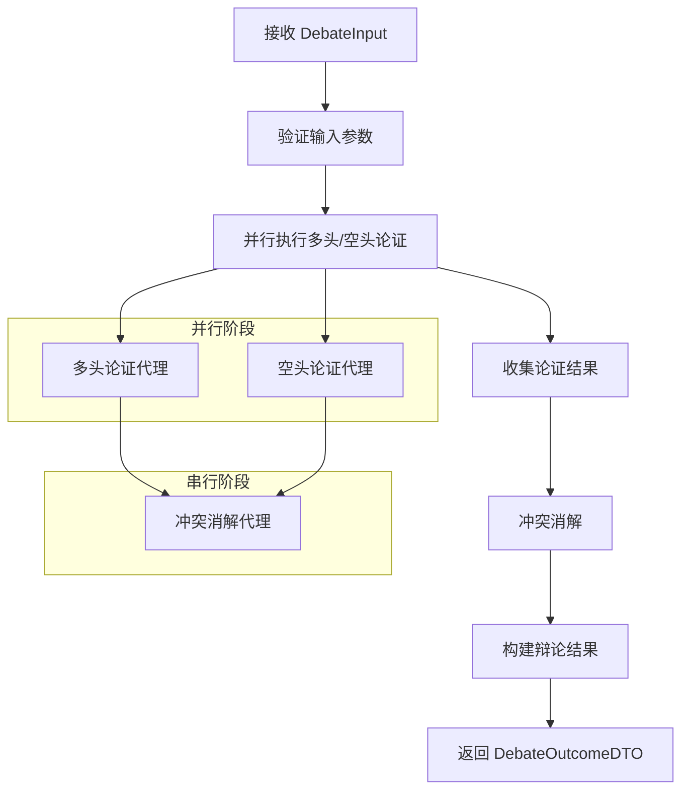

**图表来源**
- [debate_service.py](file://src/modules/debate/application/services/debate_service.py#L35-L67)

**章节来源**
- [debate_service.py](file://src/modules/debate/application/services/debate_service.py#L1-L67)

### LLM 代理适配器

三个代理适配器都遵循相同的模式：

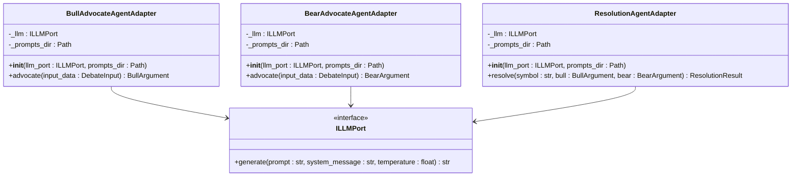

**图表来源**
- [bull_advocate_agent_adapter.py](file://src/modules/debate/infrastructure/adapters/bull_advocate_agent_adapter.py#L35-L72)
- [bear_advocate_agent_adapter.py](file://src/modules/debate/infrastructure/adapters/bear_advocate_agent_adapter.py#L35-L72)
- [resolution_agent_adapter.py](file://src/modules/debate/infrastructure/adapters/resolution_agent_adapter.py#L30-L67)

**章节来源**
- [bull_advocate_agent_adapter.py](file://src/modules/debate/infrastructure/adapters/bull_advocate_agent_adapter.py#L1-L72)
- [bear_advocate_agent_adapter.py](file://src/modules/debate/infrastructure/adapters/bear_advocate_agent_adapter.py#L1-L72)
- [resolution_agent_adapter.py](file://src/modules/debate/infrastructure/adapters/resolution_agent_adapter.py#L1-L67)

## 裁决阶段集成

### 裁决网关适配器实现

JudgeGatewayAdapter 负责将辩论结果转换为裁决输入并调用裁决服务：

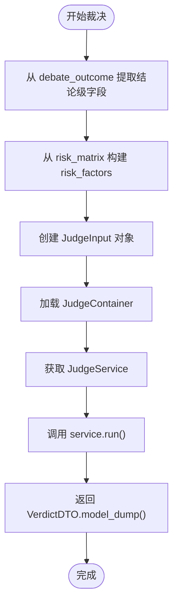

**图表来源**
- [judge_gateway_adapter.py](file://src/modules/coordinator/infrastructure/adapters/judge_gateway_adapter.py#L14-L36)
- [judge_gateway_adapter.py](file://src/modules/coordinator/infrastructure/adapters/judge_gateway_adapter.py#L52-L63)

### 字段映射规则

裁决网关将辩论结果中的结论级字段映射到 JudgeInput：

| 辩论结果字段 | JudgeInput 字段 | 映射规则 |
|-------------|----------------|----------|
| direction | direction | 直接映射为字符串 |
| confidence | confidence | 直接映射为浮点数 |
| bull_case.core_thesis | bull_thesis | 提取多头核心论点 |
| bear_case.core_thesis | bear_thesis | 提取空头核心论点 |
| risk_matrix | risk_factors | 仅提取 risk 字段，过滤概率/影响/缓解 |
| key_disagreements | key_disagreements | 直接映射为列表 |
| conflict_resolution | conflict_resolution | 直接映射为字符串 |

**章节来源**
- [judge_gateway_adapter.py](file://src/modules/coordinator/infrastructure/adapters/judge_gateway_adapter.py#L14-L36)

### 裁决服务执行流程

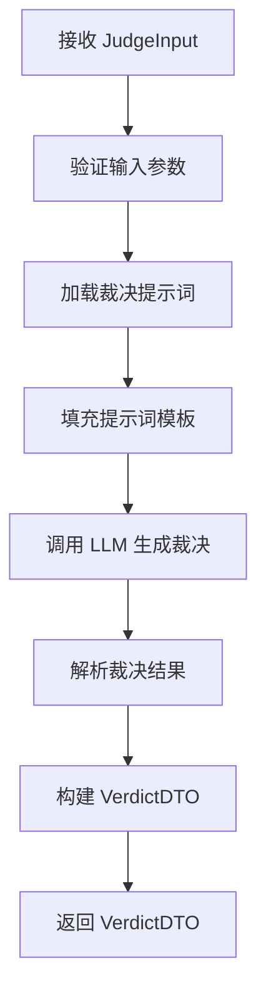

**图表来源**
- [judge_verdict_agent_adapter.py](file://src/modules/judge/infrastructure/adapters/judge_verdict_agent_adapter.py#L36-L56)

**章节来源**
- [judge_verdict_agent_adapter.py](file://src/modules/judge/infrastructure/adapters/judge_verdict_agent_adapter.py#L1-L56)

### LangGraph 编排器中的裁决节点

裁决节点在编排图中的工作流程：

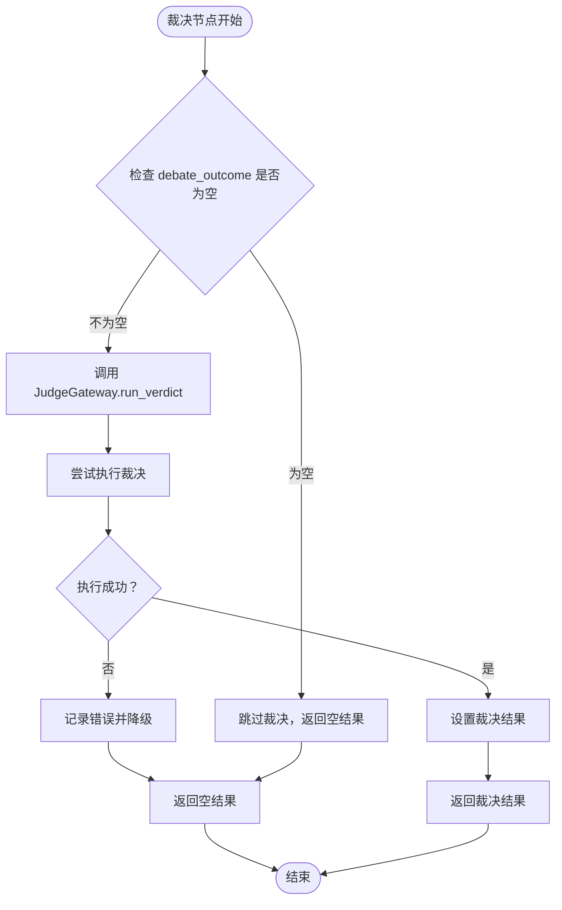

**图表来源**
- [graph_builder.py](file://src/modules/coordinator/infrastructure/orchestration/graph_builder.py#L117-L138)
- [langgraph_orchestrator.py](file://src/modules/coordinator/infrastructure/orchestration/langgraph_orchestrator.py#L37-L45)

**章节来源**
- [graph_builder.py](file://src/modules/coordinator/infrastructure/orchestration/graph_builder.py#L117-L138)
- [langgraph_orchestrator.py](file://src/modules/coordinator/infrastructure/orchestration/langgraph_orchestrator.py#L37-L45)

## 依赖关系分析

### 组件依赖图

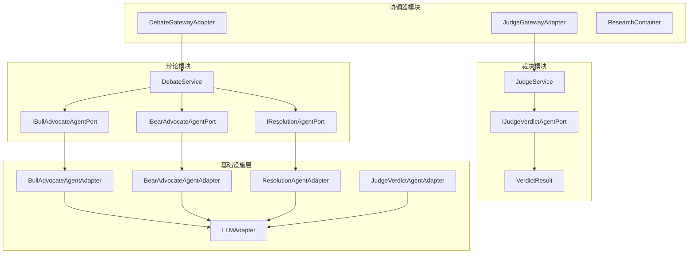

**图表来源**
- [debate_gateway_adapter.py](file://src/modules/coordinator/infrastructure/adapters/debate_gateway_adapter.py#L7-L9)
- [judge_gateway_adapter.py](file://src/modules/coordinator/infrastructure/adapters/judge_gateway_adapter.py#L8-L11)
- [container.py](file://src/modules/debate/container.py#L25-L43)
- [judge_container.py](file://src/modules/judge/container.py#L19-L31)

### 数据传输协议

专家结果在系统内的传输遵循以下协议：

| 组件 | 输入格式 | 输出格式 | 处理方式 |
|------|----------|----------|----------|
| ResearchGatewayAdapter | 专家特定结果 | 标准化字典 | 字段映射 + 数据类型转换 |
| DebateGatewayAdapter | 标准化字典 | DebateInput | 验证 + 构建模型 |
| DebateService | DebateInput | DebateOutcomeDTO | 并行执行 + 冲突消解 |
| JudgeGatewayAdapter | DebateOutcomeDTO | JudgeInput | 字段提取 + 风险因素构建 |
| JudgeService | JudgeInput | VerdictDTO | LLM 裁决 + 结果封装 |
| REST路由 | JSON请求 | DebateRunResponse/裁决结果 | 参数验证 + 异常处理 |

**章节来源**
- [debate_router.py](file://src/modules/debate/presentation/rest/debate_router.py#L25-L77)
- [debate_outcome_dto.py](file://src/modules/debate/application/dtos/debate_outcome_dto.py#L27-L38)
- [verdict_dto.py](file://src/modules/judge/application/dtos/verdict_dto.py#L9-L22)

## 性能考虑

### 异步并行处理

系统采用异步编程模型以提高性能：

1. **并行执行**：多头和空头论证代理并行运行，使用 `asyncio.gather()`
2. **会话隔离**：每个专家调用使用独立的数据库会话，避免并发冲突
3. **内存管理**：及时清理中间结果，避免内存泄漏
4. ****新增** 裁决阶段的异步处理**：JudgeGatewayAdapter 支持异步调用，不影响整体执行流程

### 缓存策略

- **LLM响应缓存**：可考虑实现 LLM 响应缓存机制
- **专家结果缓存**：对于相同输入的专家结果可进行缓存
- **Prompt模板缓存**：Prompt 文件内容可缓存到内存
- ****新增** 裁决结果缓存**：可考虑缓存常见的裁决结果以提高响应速度

### 错误处理优化

- **超时控制**：为 LLM 调用设置合理的超时时间
- **重试机制**：网络异常时自动重试
- **降级策略**：LLM 不可用时提供基础功能
- ****新增** 裁决降级机制**：裁决失败时返回空结果，不影响整体流程

## 故障排除指南

### 常见问题及解决方案

| 问题类型 | 症状 | 可能原因 | 解决方案 |
|----------|------|----------|----------|
| 字段映射失败 | 专家结果被忽略 | 字段名称不匹配 | 检查专家结果格式是否符合映射规则 |
| LLM解析错误 | 返回500状态码 | LLM输出格式不符合预期 | 验证Prompt模板和输出解析器 |
| 并发访问错误 | 数据库连接异常 | 共享会话导致并发冲突 | 确保每次调用使用独立会话 |
| 性能问题 | 响应时间过长 | LLM调用耗时 | 优化Prompt长度，启用缓存机制 |
| **新增** 裁决字段缺失 | 裁决结果为空 | debate_outcome字段不完整 | 检查辩论结果是否包含必要字段 |
| **新增** 裁决降级 | 裁决失败但流程继续 | 裁决服务异常 | 检查 JudgeGatewayAdapter 异常处理逻辑 |

### 调试建议

1. **启用详细日志**：在开发环境中启用DEBUG级别日志
2. **监控指标**：跟踪LLM调用时间和成功率
3. **单元测试**：运行完整的测试套件验证功能正确性
4. ****新增** 裁决测试**：运行 JudgeGatewayAdapter 的单元测试验证字段映射和降级机制

**章节来源**
- [test_debate_gateway_adapter.py](file://tests/coordinator/test_debate_gateway_adapter.py#L1-L177)
- [test_judge_gateway_adapter.py](file://tests/coordinator/test_judge_gateway_adapter.py#L1-L119)

## 结论

辩论网关集成规范为研究编排系统提供了清晰的接口定义和实现指导。通过标准化的专家结果映射、可靠的异步处理机制和完善的错误处理策略，系统能够高效地协调多个专家的分析结果，并输出高质量的多空辩论结论。

**更新** 本次更新扩展了裁决阶段的完整集成细节，包括：

- **完整的裁决网关实现**：详细说明了 JudgeGatewayAdapter 的字段映射规则和降级机制
- **LangGraph 编排器集成**：解释了裁决节点在编排图中的工作流程和条件路由
- **错误处理增强**：增加了裁决失败时的降级策略和异常处理机制
- **数据流完整性**：完善了从专家结果到最终决策的完整数据流说明

该规范的关键优势包括：
- **接口一致性**：统一的专家结果格式简化了系统集成
- **性能优化**：异步并行处理提高了整体效率
- **可扩展性**：模块化设计支持新专家类型的快速集成
- **可靠性**：完善的错误处理和监控机制确保系统稳定运行
- ****新增** 完整的决策链路**：从专家分析到最终裁决的全流程集成

未来可以考虑的改进方向：
- 实现更智能的缓存策略，包括裁决结果缓存
- 增强LLM调用的可观测性，特别是裁决阶段的性能监控
- 提供更多的配置选项以适应不同场景需求
- **新增** 增强裁决阶段的A/B测试能力，支持不同裁决策略的对比