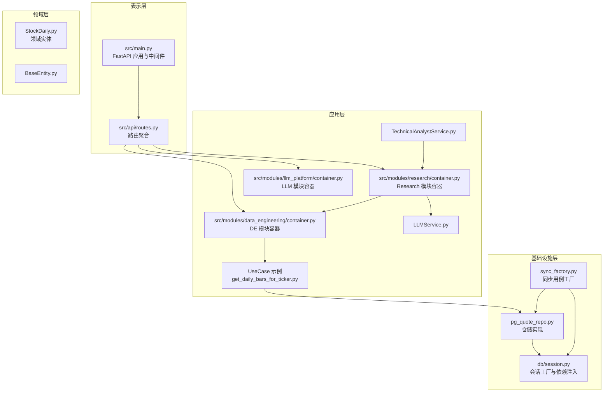
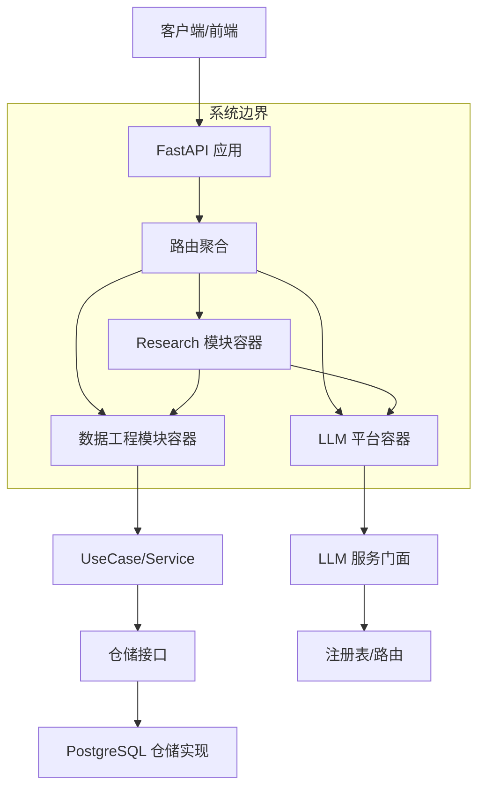
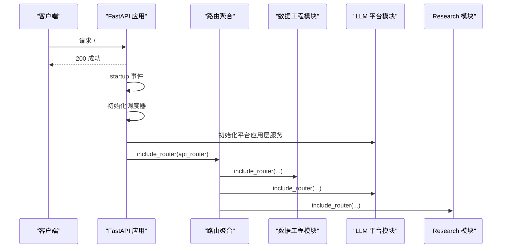
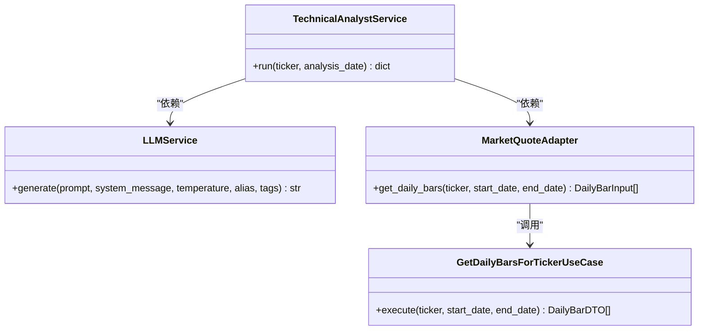
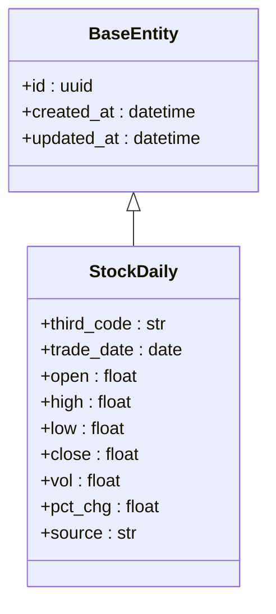
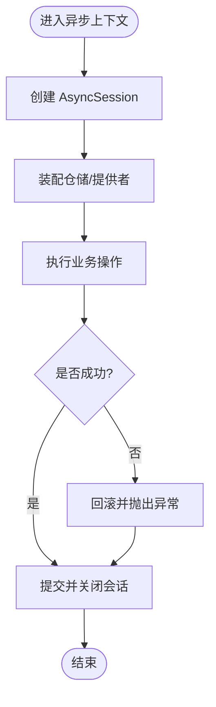
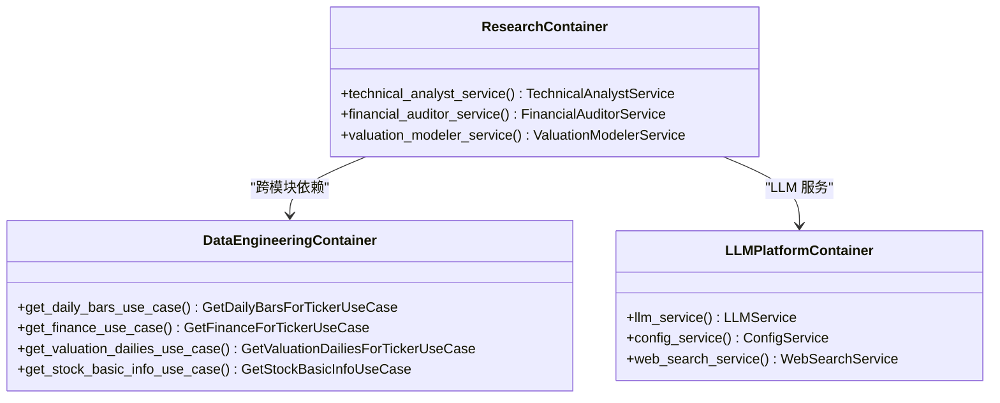
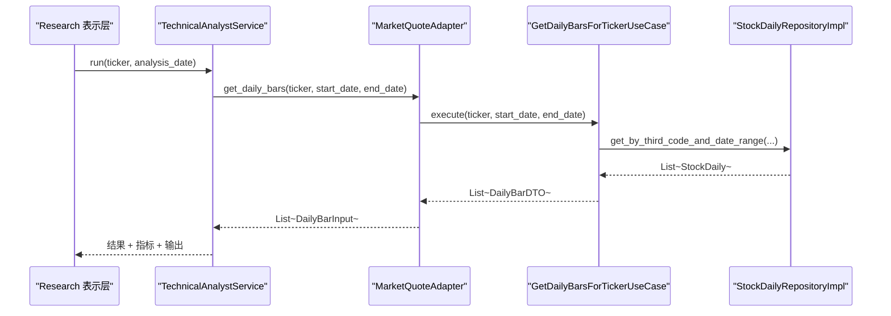
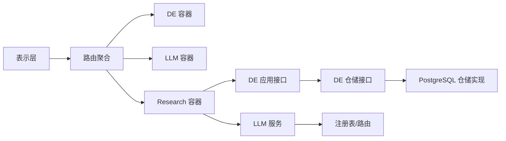

# 架构设计

<cite>
**本文引用的文件**
- [src/main.py](file://src/main.py)
- [src/api/routes.py](file://src/api/routes.py)
- [src/shared/config.py](file://src/shared/config.py)
- [src/shared/infrastructure/db/session.py](file://src/shared/infrastructure/db/session.py)
- [src/modules/data_engineering/container.py](file://src/modules/data_engineering/container.py)
- [src/modules/data_engineering/application/queries/get_daily_bars_for_ticker.py](file://src/modules/data_engineering/application/queries/get_daily_bars_for_ticker.py)
- [src/modules/data_engineering/infrastructure/persistence/repositories/pg_quote_repo.py](file://src/modules/data_engineering/infrastructure/persistence/repositories/pg_quote_repo.py)
- [src/modules/data_engineering/application/factories/sync_factory.py](file://src/modules/data_engineering/application/factories/sync_factory.py)
- [src/modules/llm_platform/container.py](file://src/modules/llm_platform/container.py)
- [src/modules/llm_platform/application/services/llm_service.py](file://src/modules/llm_platform/application/services/llm_service.py)
- [src/modules/research/container.py](file://src/modules/research/container.py)
- [src/modules/research/application/technical_analyst_service.py](file://src/modules/research/application/technical_analyst_service.py)
- [src/modules/research/infrastructure/adapters/market_quote_adapter.py](file://src/modules/research/infrastructure/adapters/market_quote_adapter.py)
- [src/shared/domain/base_entity.py](file://src/shared/domain/base_entity.py)
</cite>

## 目录
1. [引言](#引言)
2. [项目结构](#项目结构)
3. [核心组件](#核心组件)
4. [架构总览](#架构总览)
5. [详细组件分析](#详细组件分析)
6. [依赖分析](#依赖分析)
7. [性能考虑](#性能考虑)
8. [故障排查指南](#故障排查指南)
9. [结论](#结论)
10. [附录](#附录)

## 引言
本项目采用领域驱动设计（DDD）的四层架构：表示层（Presentation）、应用层（Application）、领域层（Domain）、基础设施层（Infrastructure）。通过模块化划分与清晰的边界，实现高内聚、低耦合，并以依赖注入容器（Composition Root）集中管理模块内部依赖，确保模块间解耦与可测试性。同时，项目引入适配器、门面、工厂等设计模式，提升扩展性与可维护性。

## 项目结构
- 表示层：FastAPI 应用入口与路由聚合，负责接收请求、注册中间件与模块路由。
- 应用层：各模块的 UseCase/Service，作为编排者协调领域与基础设施资源。
- 领域层：领域实体与值对象，承载核心业务规则与不变量。
- 基础设施层：数据库访问、外部 API 客户端、适配器与工具。

图表来源
- [src/main.py](file://src/main.py#L1-L75)
- [src/api/routes.py](file://src/api/routes.py#L1-L18)
- [src/modules/data_engineering/container.py](file://src/modules/data_engineering/container.py#L1-L109)
- [src/modules/research/container.py](file://src/modules/research/container.py#L1-L167)
- [src/modules/llm_platform/container.py](file://src/modules/llm_platform/container.py#L1-L78)
- [src/modules/data_engineering/application/queries/get_daily_bars_for_ticker.py](file://src/modules/data_engineering/application/queries/get_daily_bars_for_ticker.py#L1-L68)
- [src/modules/data_engineering/infrastructure/persistence/repositories/pg_quote_repo.py](file://src/modules/data_engineering/infrastructure/persistence/repositories/pg_quote_repo.py#L1-L173)
- [src/shared/infrastructure/db/session.py](file://src/shared/infrastructure/db/session.py#L1-L64)
- [src/modules/data_engineering/application/factories/sync_factory.py](file://src/modules/data_engineering/application/factories/sync_factory.py#L1-L115)

章节来源
- [src/main.py](file://src/main.py#L1-L75)
- [src/api/routes.py](file://src/api/routes.py#L1-L18)

## 核心组件
- 依赖注入与 Composition Root
  - 数据工程模块容器：集中装配仓储与 UseCase，供其他模块通过应用层接口获取。
  - LLM 平台容器：装配配置仓储、注册表与服务，提供统一的 LLM 能力门面。
  - Research 模块容器：组合 DE 与 LLM 能力，形成研究服务所需的完整依赖链。
- 应用层 UseCase/Service
  - 日线查询 UseCase：面向 Research 模块暴露稳定接口，屏蔽仓储实现细节。
  - 技术分析师服务：编排日线获取、指标计算与 Agent 分析，返回结构化结果。
  - LLM 服务：统一路由与调用底层模型，隐藏注册表与适配器细节。
- 领域层实体
  - 股票日线实体：包含行情与估值相关字段，统一建模业务不变量。
  - 基类实体：统一 ID、创建/更新时间等通用属性。
- 基础设施层
  - 数据库会话工厂：提供异步会话与异常处理策略。
  - PostgreSQL 仓储：实现批量写入、去重、冲突更新与查询。
  - 同步用例工厂：封装依赖注入与会话生命周期，避免上层直连基础设施。

章节来源
- [src/modules/data_engineering/container.py](file://src/modules/data_engineering/container.py#L1-L109)
- [src/modules/llm_platform/container.py](file://src/modules/llm_platform/container.py#L1-L78)
- [src/modules/research/container.py](file://src/modules/research/container.py#L1-L167)
- [src/modules/data_engineering/application/queries/get_daily_bars_for_ticker.py](file://src/modules/data_engineering/application/queries/get_daily_bars_for_ticker.py#L1-L68)
- [src/modules/research/application/technical_analyst_service.py](file://src/modules/research/application/technical_analyst_service.py#L1-L73)
- [src/modules/llm_platform/application/services/llm_service.py](file://src/modules/llm_platform/application/services/llm_service.py#L1-L63)
- [src/shared/domain/base_entity.py](file://src/shared/domain/base_entity.py#L1-L18)
- [src/shared/infrastructure/db/session.py](file://src/shared/infrastructure/db/session.py#L1-L64)
- [src/modules/data_engineering/infrastructure/persistence/repositories/pg_quote_repo.py](file://src/modules/data_engineering/infrastructure/persistence/repositories/pg_quote_repo.py#L1-L173)
- [src/modules/data_engineering/application/factories/sync_factory.py](file://src/modules/data_engineering/application/factories/sync_factory.py#L1-L115)

## 架构总览
系统通过 Composition Root 将模块内依赖集中装配，应用层仅暴露稳定接口，领域层保持纯净，基础设施层提供可替换实现。模块间通过应用层接口与适配器进行交互，避免直接耦合。

图表来源
- [src/main.py](file://src/main.py#L1-L75)
- [src/api/routes.py](file://src/api/routes.py#L1-L18)
- [src/modules/data_engineering/container.py](file://src/modules/data_engineering/container.py#L1-L109)
- [src/modules/llm_platform/container.py](file://src/modules/llm_platform/container.py#L1-L78)
- [src/modules/research/container.py](file://src/modules/research/container.py#L1-L167)

## 详细组件分析

### 表示层：FastAPI 应用与路由
- 应用初始化：设置标题、OpenAPI 文档路径、CORS 中间件与全局异常处理中间件。
- 生命周期事件：启动时初始化调度器与 LLM 平台；关闭时优雅停止调度器。
- 路由聚合：include 各模块统一 router，避免直接引用模块内部子路由。

图表来源
- [src/main.py](file://src/main.py#L1-L75)
- [src/api/routes.py](file://src/api/routes.py#L1-L18)

章节来源
- [src/main.py](file://src/main.py#L1-L75)
- [src/api/routes.py](file://src/api/routes.py#L1-L18)

### 应用层：UseCase 与服务编排
- 日线查询 UseCase：面向 Research 暴露稳定的查询接口，屏蔽仓储实现，返回 DTO 列表。
- 技术分析师服务：编排日线获取、指标计算与 Agent 分析，组装完整响应。
- LLM 服务：统一生成接口，支持别名与标签路由，封装底层注册表与路由。

图表来源
- [src/modules/data_engineering/application/queries/get_daily_bars_for_ticker.py](file://src/modules/data_engineering/application/queries/get_daily_bars_for_ticker.py#L1-L68)
- [src/modules/research/application/technical_analyst_service.py](file://src/modules/research/application/technical_analyst_service.py#L1-L73)
- [src/modules/llm_platform/application/services/llm_service.py](file://src/modules/llm_platform/application/services/llm_service.py#L1-L63)
- [src/modules/research/infrastructure/adapters/market_quote_adapter.py](file://src/modules/research/infrastructure/adapters/market_quote_adapter.py#L1-L41)

章节来源
- [src/modules/data_engineering/application/queries/get_daily_bars_for_ticker.py](file://src/modules/data_engineering/application/queries/get_daily_bars_for_ticker.py#L1-L68)
- [src/modules/research/application/technical_analyst_service.py](file://src/modules/research/application/technical_analyst_service.py#L1-L73)
- [src/modules/llm_platform/application/services/llm_service.py](file://src/modules/llm_platform/application/services/llm_service.py#L1-L63)
- [src/modules/research/infrastructure/adapters/market_quote_adapter.py](file://src/modules/research/infrastructure/adapters/market_quote_adapter.py#L1-L41)

### 领域层：实体与不变量
- 股票日线实体：统一建模行情与估值字段，保证业务一致性。
- 基类实体：统一 ID、创建/更新时间，简化实体定义。

图表来源
- [src/shared/domain/base_entity.py](file://src/shared/domain/base_entity.py#L1-L18)
- [src/modules/data_engineering/domain/model/stock_daily.py](file://src/modules/data_engineering/domain/model/stock_daily.py#L1-L46)

章节来源
- [src/shared/domain/base_entity.py](file://src/shared/domain/base_entity.py#L1-L18)
- [src/modules/data_engineering/domain/model/stock_daily.py](file://src/modules/data_engineering/domain/model/stock_daily.py#L1-L46)

### 基础设施层：仓储与会话管理
- 数据库会话工厂：提供异步会话与异常处理策略，区分客户端错误与系统异常，确保事务安全。
- PostgreSQL 仓储：实现批量写入、去重、冲突更新与查询，支持估值字段专用查询。
- 同步用例工厂：封装依赖注入与会话生命周期，避免上层直连基础设施。

图表来源
- [src/shared/infrastructure/db/session.py](file://src/shared/infrastructure/db/session.py#L1-L64)
- [src/modules/data_engineering/application/factories/sync_factory.py](file://src/modules/data_engineering/application/factories/sync_factory.py#L1-L115)

章节来源
- [src/shared/infrastructure/db/session.py](file://src/shared/infrastructure/db/session.py#L1-L64)
- [src/modules/data_engineering/infrastructure/persistence/repositories/pg_quote_repo.py](file://src/modules/data_engineering/infrastructure/persistence/repositories/pg_quote_repo.py#L1-L173)
- [src/modules/data_engineering/application/factories/sync_factory.py](file://src/modules/data_engineering/application/factories/sync_factory.py#L1-L115)

### 依赖注入容器与 Composition Root 设计
- 数据工程模块容器：集中装配仓储与 UseCase，供 Research 通过应用层接口获取。
- LLM 平台容器：装配配置仓储、注册表与服务，提供统一的 LLM 能力门面。
- Research 模块容器：组合 DE 与 LLM 能力，形成研究服务所需的完整依赖链。

图表来源
- [src/modules/data_engineering/container.py](file://src/modules/data_engineering/container.py#L1-L109)
- [src/modules/llm_platform/container.py](file://src/modules/llm_platform/container.py#L1-L78)
- [src/modules/research/container.py](file://src/modules/research/container.py#L1-L167)

章节来源
- [src/modules/data_engineering/container.py](file://src/modules/data_engineering/container.py#L1-L109)
- [src/modules/llm_platform/container.py](file://src/modules/llm_platform/container.py#L1-L78)
- [src/modules/research/container.py](file://src/modules/research/container.py#L1-L167)

### 模块间交互与通信机制
- 模块内：容器负责装配仓储与服务，应用层通过稳定接口消费。
- 模块间：Research 通过 DE 的应用接口获取数据，通过 LLM 服务调用大模型能力。
- 适配器模式：MarketQuoteAdapter 将 DE 的 DTO 映射为 Research 的输入结构，隔离差异。

图表来源
- [src/modules/research/application/technical_analyst_service.py](file://src/modules/research/application/technical_analyst_service.py#L1-L73)
- [src/modules/research/infrastructure/adapters/market_quote_adapter.py](file://src/modules/research/infrastructure/adapters/market_quote_adapter.py#L1-L41)
- [src/modules/data_engineering/application/queries/get_daily_bars_for_ticker.py](file://src/modules/data_engineering/application/queries/get_daily_bars_for_ticker.py#L1-L68)
- [src/modules/data_engineering/infrastructure/persistence/repositories/pg_quote_repo.py](file://src/modules/data_engineering/infrastructure/persistence/repositories/pg_quote_repo.py#L1-L173)

章节来源
- [src/modules/research/application/technical_analyst_service.py](file://src/modules/research/application/technical_analyst_service.py#L1-L73)
- [src/modules/research/infrastructure/adapters/market_quote_adapter.py](file://src/modules/research/infrastructure/adapters/market_quote_adapter.py#L1-L41)
- [src/modules/data_engineering/application/queries/get_daily_bars_for_ticker.py](file://src/modules/data_engineering/application/queries/get_daily_bars_for_ticker.py#L1-L68)
- [src/modules/data_engineering/infrastructure/persistence/repositories/pg_quote_repo.py](file://src/modules/data_engineering/infrastructure/persistence/repositories/pg_quote_repo.py#L1-L173)

### 设计模式应用
- 工厂模式：同步用例工厂封装依赖装配与会话生命周期，提供异步上下文管理器。
- 适配器模式：MarketQuoteAdapter 将 DE 的 DTO 映射为 Research 输入，隔离差异。
- 门面模式：LLMService 作为统一门面，封装注册表与路由，简化上层调用。
- 策略模式：LLMService 支持别名与标签路由，体现策略选择与扩展。

章节来源
- [src/modules/data_engineering/application/factories/sync_factory.py](file://src/modules/data_engineering/application/factories/sync_factory.py#L1-L115)
- [src/modules/research/infrastructure/adapters/market_quote_adapter.py](file://src/modules/research/infrastructure/adapters/market_quote_adapter.py#L1-L41)
- [src/modules/llm_platform/application/services/llm_service.py](file://src/modules/llm_platform/application/services/llm_service.py#L1-L63)

## 依赖分析
- 模块耦合与内聚
  - Research 依赖 DE 的应用接口与 LLM 服务，不直接依赖仓储或基础设施实现，保持高内聚与低耦合。
  - DE 与 LLM 模块各自拥有独立容器，职责清晰，便于演进与测试。
- 直接与间接依赖
  - 表示层仅依赖路由聚合，路由聚合再依赖各模块容器。
  - 应用层 UseCase 依赖仓储接口，仓储实现依赖数据库会话工厂。
- 外部依赖与集成点
  - PostgreSQL 引擎与会话工厂提供数据库访问能力。
  - LLM 注册表与路由提供模型选择与调用能力。
- 接口契约与实现细节
  - 仓储接口定义查询与持久化契约，实现类负责 SQL 细节。
  - UseCase 与 Service 仅依赖接口，便于替换实现与单元测试。

图表来源
- [src/api/routes.py](file://src/api/routes.py#L1-L18)
- [src/modules/data_engineering/container.py](file://src/modules/data_engineering/container.py#L1-L109)
- [src/modules/llm_platform/container.py](file://src/modules/llm_platform/container.py#L1-L78)
- [src/modules/research/container.py](file://src/modules/research/container.py#L1-L167)

章节来源
- [src/api/routes.py](file://src/api/routes.py#L1-L18)
- [src/modules/data_engineering/container.py](file://src/modules/data_engineering/container.py#L1-L109)
- [src/modules/llm_platform/container.py](file://src/modules/llm_platform/container.py#L1-L78)
- [src/modules/research/container.py](file://src/modules/research/container.py#L1-L167)

## 性能考虑
- 数据库写入优化
  - 批量插入与去重：PostgreSQL 仓储对重复键进行冲突更新，减少重复写入成本。
  - 批处理大小：分批处理提升吞吐，降低内存峰值。
- 查询优化
  - 按日期范围与第三方代码精确过滤，配合索引可显著提升查询效率。
  - 估值字段专用查询路径，避免不必要的字段加载。
- 异步与并发
  - 异步会话与连接池预检，提升并发场景下的稳定性与性能。
- LLM 调用
  - 门面服务统一路由与温度控制，减少重复初始化开销。
  - 标签与别名路由便于按需选择高性能模型。

## 故障排查指南
- 数据库异常处理
  - 会话生成器区分客户端错误与系统异常，记录日志并按需回滚，避免泄漏连接。
- LLM 调用异常
  - 门面服务捕获底层异常并记录错误日志，便于定位问题。
- UseCase 参数校验
  - 技术分析师服务对必填参数进行校验，返回明确的业务异常信息。
- 仓储一致性
  - 批量写入前进行去重，冲突更新保留最新数据，避免脏数据。

章节来源
- [src/shared/infrastructure/db/session.py](file://src/shared/infrastructure/db/session.py#L1-L64)
- [src/modules/llm_platform/application/services/llm_service.py](file://src/modules/llm_platform/application/services/llm_service.py#L1-L63)
- [src/modules/research/application/technical_analyst_service.py](file://src/modules/research/application/technical_analyst_service.py#L1-L73)
- [src/modules/data_engineering/infrastructure/persistence/repositories/pg_quote_repo.py](file://src/modules/data_engineering/infrastructure/persistence/repositories/pg_quote_repo.py#L1-L173)

## 结论
本项目通过 DDD 四层架构与模块化设计，实现了清晰的职责分离与高内聚低耦合。依赖注入容器集中管理模块内部依赖，模块间通过应用层接口与适配器交互，既保证了可维护性，也为未来扩展提供了良好基础。结合工厂、适配器、门面等设计模式，系统在性能、可扩展性与可测试性方面均具备良好表现。

## 附录
- 系统边界定义
  - 表示层：FastAPI 应用与路由聚合，负责请求接入与中间件。
  - 应用层：UseCase/Service，负责业务编排与接口暴露。
  - 领域层：实体与不变量，承载核心业务规则。
  - 基础设施层：数据库、外部 API、适配器与工具。
- 组件关系图与数据流向图见“架构总览”与“详细组件分析”。