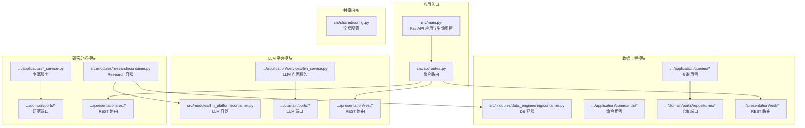
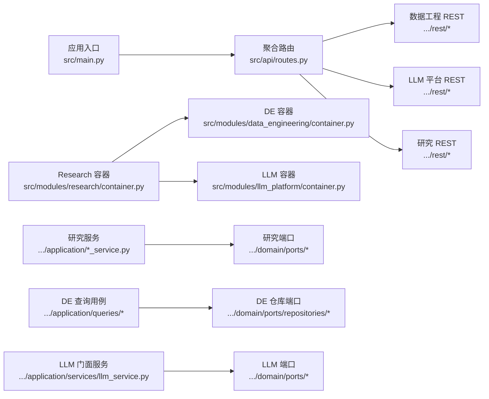
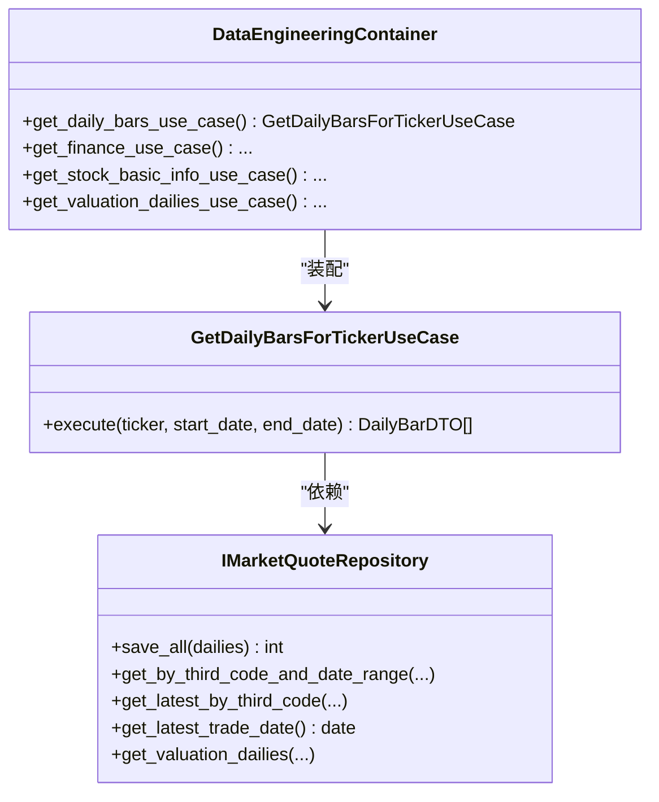
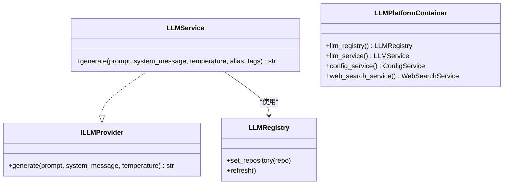
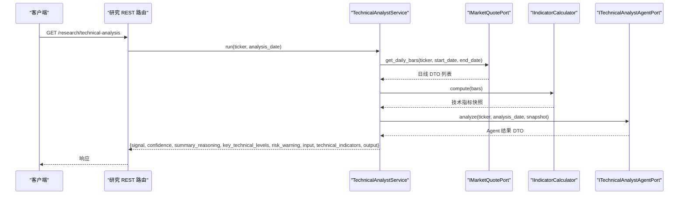
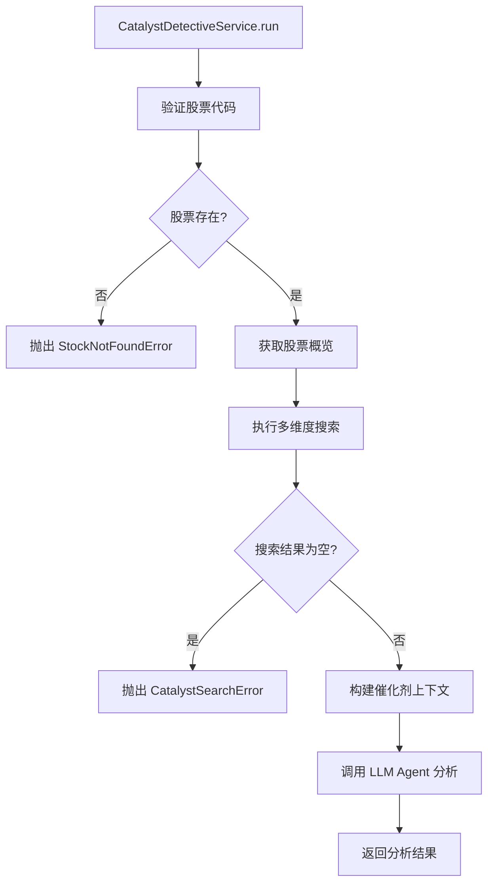
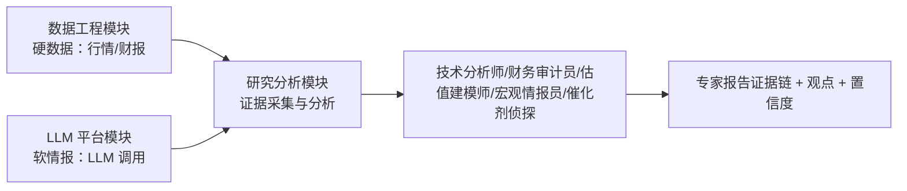
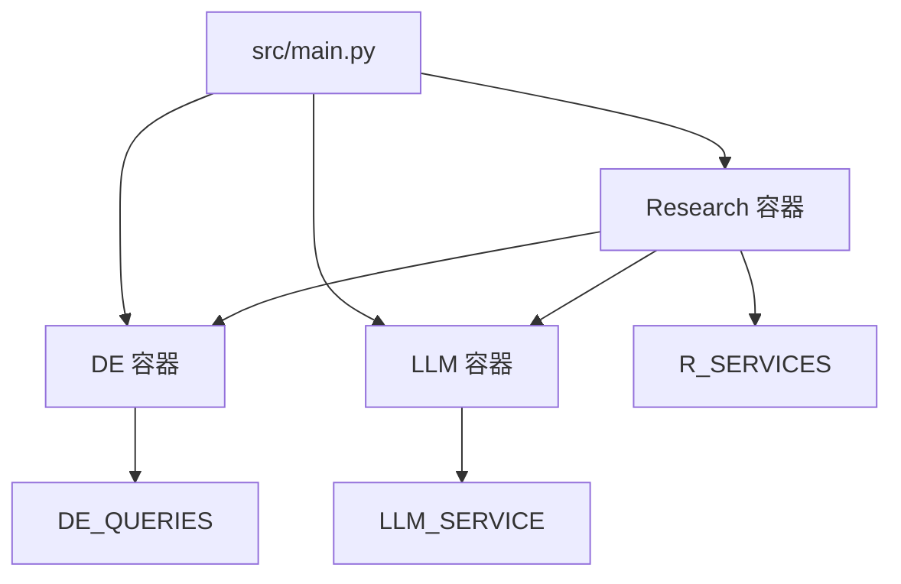

# 模块化设计

<cite>
**本文引用的文件**
- [src/main.py](file://src/main.py)
- [src/api/routes.py](file://src/api/routes.py)
- [src/shared/config.py](file://src/shared/config.py)
- [src/modules/data_engineering/container.py](file://src/modules/data_engineering/container.py)
- [src/modules/data_engineering/application/queries/get_daily_bars_for_ticker.py](file://src/modules/data_engineering/application/queries/get_daily_bars_for_ticker.py)
- [src/modules/data_engineering/application/commands/sync_daily_bar_cmd.py](file://src/modules/data_engineering/application/commands/sync_daily_bar_cmd.py)
- [src/modules/data_engineering/domain/ports/repositories/market_quote_repo.py](file://src/modules/data_engineering/domain/ports/repositories/market_quote_repo.py)
- [src/modules/data_engineering/presentation/rest/stock_routes.py](file://src/modules/data_engineering/presentation/rest/stock_routes.py)
- [src/modules/llm_platform/container.py](file://src/modules/llm_platform/container.py)
- [src/modules/llm_platform/application/services/llm_service.py](file://src/modules/llm_platform/application/services/llm_service.py)
- [src/modules/llm_platform/domain/ports/llm.py](file://src/modules/llm_platform/domain/ports/llm.py)
- [src/modules/llm_platform/presentation/rest/chat_routes.py](file://src/modules/llm_platform/presentation/rest/chat_routes.py)
- [src/modules/research/container.py](file://src/modules/research/container.py)
- [src/modules/research/application/technical_analyst_service.py](file://src/modules/research/application/technical_analyst_service.py)
- [src/modules/research/application/catalyst_detective_service.py](file://src/modules/research/application/catalyst_detective_service.py)
- [src/modules/research/domain/ports/market_quote.py](file://src/modules/research/domain/ports/market_quote.py)
- [src/modules/research/domain/ports/catalyst_detective_agent.py](file://src/modules/research/domain/ports/catalyst_detective_agent.py)
- [src/modules/research/domain/ports/catalyst_data.py](file://src/modules/research/domain/ports/catalyst_data.py)
- [src/modules/research/domain/ports/catalyst_context_builder.py](file://src/modules/research/domain/ports/catalyst_context_builder.py)
- [src/modules/research/domain/dtos/catalyst_dtos.py](file://src/modules/research/domain/dtos/catalyst_dtos.py)
- [src/modules/research/domain/dtos/catalyst_inputs.py](file://src/modules/research/domain/dtos/catalyst_inputs.py)
- [src/modules/research/domain/dtos/catalyst_context.py](file://src/modules/research/domain/dtos/catalyst_context.py)
- [src/modules/research/presentation/rest/technical_analyst_routes.py](file://src/modules/research/presentation/rest/technical_analyst_routes.py)
- [src/modules/research/presentation/rest/catalyst_detective_routes.py](file://src/modules/research/presentation/rest/catalyst_detective_routes.py)
- [openspec/specs/vision-and-modules.md](file://openspec/specs/vision-and-modules.md)
</cite>

## 更新摘要
**所做更改**
- 新增催化剂侦探服务（CatalystDetectiveService）的完整说明
- 完善研究模块的组件分析，包含五个专家角色的详细说明
- 添加催化剂相关端口、DTO和适配器的架构说明
- 更新研究模块容器的依赖注入配置
- 增加催化剂侦探服务的REST路由和异常处理说明

## 目录
1. [引言](#引言)
2. [项目结构](#项目结构)
3. [核心组件](#核心组件)
4. [架构总览](#架构总览)
5. [详细组件分析](#详细组件分析)
6. [依赖分析](#依赖分析)
7. [性能考虑](#性能考虑)
8. [故障排查指南](#故障排查指南)
9. [结论](#结论)
10. [附录](#附录)

## 引言
本设计文档围绕"股票助手"项目的模块化架构展开，重点阐述三大模块的划分原则、职责边界与接口设计，以及模块间的通信机制与依赖管理。项目采用领域驱动设计（DDD）思想，将系统划分为数据工程模块、LLM 平台模块与研究分析模块，均以"领域/应用/基础设施/表现层"的四层结构组织，模块间通过端口（Port）与适配器（Adapter）解耦，确保高内聚、低耦合与可扩展性。

**更新** 本次更新特别增加了催化剂侦探服务的完整集成，完善了研究模块的专家角色体系，使其包含技术分析师、财务审计员、估值建模师、宏观情报员和催化剂侦探五个完整的专家角色。

## 项目结构
项目采用按模块划分的目录结构，核心模块如下：
- 数据工程模块：负责行情、财务、股票基础信息等硬数据的采集、转换、存储与查询。
- LLM 平台模块：负责大模型配置管理、路由与统一调用门面，提供软情报能力。
- 研究分析模块：面向研究专家角色（技术分析师、财务审计员、估值建模师、宏观情报员、催化剂侦探），通过数据工程与 LLM 平台提供的端口完成证据驱动的研究分析。

**图表来源**
- [src/main.py](file://src/main.py#L14-L65)
- [src/api/routes.py](file://src/api/routes.py#L1-L13)
- [src/modules/data_engineering/container.py](file://src/modules/data_engineering/container.py#L32-L59)
- [src/modules/llm_platform/container.py](file://src/modules/llm_platform/container.py#L24-L68)
- [src/modules/research/container.py](file://src/modules/research/container.py#L48-L167)

**章节来源**
- [src/main.py](file://src/main.py#L1-L75)
- [src/api/routes.py](file://src/api/routes.py#L1-L13)
- [openspec/specs/vision-and-modules.md](file://openspec/specs/vision-and-modules.md#L74-L89)

## 核心组件
本节聚焦三大模块的职责边界、端口契约与典型用例，帮助读者快速把握模块能力与交互方式。

- 数据工程模块（data_engineering）
  - 职责边界：只做数据接入、转换、存储、按需查询、同步任务调度，不参与研报、辩论、决策。
  - 关键端口：IMarketQuoteRepository、IStockBasicRepository、IFinancialDataRepository 等。
  - 典型用例：按标的与日期区间查询日线、同步日线历史、同步股票基础列表等。
  - 代表文件：
    - [src/modules/data_engineering/application/queries/get_daily_bars_for_ticker.py](file://src/modules/data_engineering/application/queries/get_daily_bars_for_ticker.py)
    - [src/modules/data_engineering/application/commands/sync_daily_bar_cmd.py](file://src/modules/data_engineering/application/commands/sync_daily_bar_cmd.py)
    - [src/modules/data_engineering/domain/ports/repositories/market_quote_repo.py](file://src/modules/data_engineering/domain/ports/repositories/market_quote_repo.py)

- LLM 平台模块（llm_platform）
  - 职责边界：只做 LLM 配置管理、多厂商路由、统一 Chat/Completion 调用，不参与研报、辩论、决策。
  - 关键端口：ILLMProvider（统一生成接口）、IWebSearchProvider（网络搜索接口）。
  - 典型服务：LLMService（门面）、ConfigService（配置管理）、WebSearchService（网络搜索）。
  - 代表文件：
    - [src/modules/llm_platform/application/services/llm_service.py](file://src/modules/llm_platform/application/services/llm_service.py#L9-L63)
    - [src/modules/llm_platform/domain/ports/llm.py](file://src/modules/llm_platform/domain/ports/llm.py#L5-L38)
    - [src/modules/llm_platform/container.py](file://src/modules/llm_platform/container.py#L24-L68)

- 研究分析模块（research）
  - 职责边界：只做并行五专家分析、证据采集（调 data_engineering / llm_platform）、报告生成，不参与编排、多空对抗与最终决策。
  - 关键端口：IMarketQuotePort、ITechnicalAnalystAgentPort、IFinancialAuditorAgentPort、IValuationModelerAgentPort、IMacroIntelligenceAgentPort、ICatalystDetectiveAgentPort 等。
  - 典型服务：TechnicalAnalystService、FinancialAuditorService、ValuationModelerService、MacroIntelligenceService、CatalystDetectiveService。
  - 代表文件：
    - [src/modules/research/application/technical_analyst_service.py](file://src/modules/research/application/technical_analyst_service.py#L14-L73)
    - [src/modules/research/application/catalyst_detective_service.py](file://src/modules/research/application/catalyst_detective_service.py#L29-L88)
    - [src/modules/research/domain/ports/market_quote.py](file://src/modules/research/domain/ports/market_quote.py#L12-L20)
    - [src/modules/research/container.py](file://src/modules/research/container.py#L48-L167)

**章节来源**
- [openspec/specs/vision-and-modules.md](file://openspec/specs/vision-and-modules.md#L52-L99)
- [src/modules/data_engineering/application/queries/get_daily_bars_for_ticker.py](file://src/modules/data_engineering/application/queries/get_daily_bars_for_ticker.py)
- [src/modules/data_engineering/application/commands/sync_daily_bar_cmd.py](file://src/modules/data_engineering/application/commands/sync_daily_bar_cmd.py)
- [src/modules/llm_platform/application/services/llm_service.py](file://src/modules/llm_platform/application/services/llm_service.py#L9-L63)
- [src/modules/research/application/technical_analyst_service.py](file://src/modules/research/application/technical_analyst_service.py#L14-L73)
- [src/modules/research/application/catalyst_detective_service.py](file://src/modules/research/application/catalyst_detective_service.py#L29-L88)

## 架构总览
模块间依赖方向严格限定为"下游 → 上游"，即研究模块仅消费数据工程与 LLM 平台的端口，不反向依赖其基础设施实现。模块内通过容器（Composition Root）集中装配应用服务与适配器，保证调用方仅依赖抽象。

**图表来源**
- [src/main.py](file://src/main.py#L14-L65)
- [src/api/routes.py](file://src/api/routes.py#L1-L13)
- [src/modules/research/container.py](file://src/modules/research/container.py#L48-L167)
- [src/modules/data_engineering/container.py](file://src/modules/data_engineering/container.py#L32-L59)
- [src/modules/llm_platform/container.py](file://src/modules/llm_platform/container.py#L24-L68)

**章节来源**
- [openspec/specs/vision-and-modules.md](file://openspec/specs/vision-and-modules.md#L21-L49)

## 详细组件分析

### 数据工程模块（DE）分析
- 组织结构与职责
  - 应用层：提供查询与命令用例，屏蔽基础设施细节。
  - 领域层：定义实体与端口（仓库端口、外部数据提供端口）。
  - 基础设施层：实现仓库与外部 API 客户端。
  - 表现层：REST 路由，依赖应用层用例。
- 关键接口与用例
  - 查询用例：按标的与日期区间获取日线，返回 DTO 列表。
  - 命令用例：按日期同步日线数据，调用外部行情提供方并持久化。
  - 仓库端口：定义只读查询与保存能力，支持最新交易日查询等。
- 依赖注入与容器
  - 容器集中装配仓库实例与用例，供上层模块通过容器获取应用服务。

**图表来源**
- [src/modules/data_engineering/application/queries/get_daily_bars_for_ticker.py](file://src/modules/data_engineering/application/queries/get_daily_bars_for_ticker.py)
- [src/modules/data_engineering/domain/ports/repositories/market_quote_repo.py](file://src/modules/data_engineering/domain/ports/repositories/market_quote_repo.py)
- [src/modules/data_engineering/container.py](file://src/modules/data_engineering/container.py#L32-L59)

**章节来源**
- [src/modules/data_engineering/application/queries/get_daily_bars_for_ticker.py](file://src/modules/data_engineering/application/queries/get_daily_bars_for_ticker.py)
- [src/modules/data_engineering/application/commands/sync_daily_bar_cmd.py](file://src/modules/data_engineering/application/commands/sync_daily_bar_cmd.py)
- [src/modules/data_engineering/domain/ports/repositories/market_quote_repo.py](file://src/modules/data_engineering/domain/ports/repositories/market_quote_repo.py)
- [src/modules/data_engineering/container.py](file://src/modules/data_engineering/container.py#L32-L59)
- [src/modules/data_engineering/presentation/rest/stock_routes.py](file://src/modules/data_engineering/presentation/rest/stock_routes.py)

### LLM 平台模块（LLM）分析
- 组织结构与职责
  - 应用层：LLMService（统一生成接口）、ConfigService（配置管理）、WebSearchService（网络搜索）。
  - 领域层：ILLMProvider（统一生成接口）、IWebSearchProvider（网络搜索接口）。
  - 基础设施层：注册表（LLMRegistry）、路由器（LLMRouter）、适配器（OpenAI、Bocha 等）。
  - 表现层：REST 路由，提供统一聊天生成接口。
- 关键接口与服务
  - LLMService.generate：支持别名与标签路由，封装底层调用。
  - ConfigService：从数据库加载 LLM 配置，供注册表刷新。
  - WebSearchService：封装博查搜索适配器，提供网络搜索能力。
- 依赖注入与容器
  - 容器提供 LLMRegistry、LLMService、ConfigService、WebSearchService，启动时初始化注册表。

**图表来源**
- [src/modules/llm_platform/domain/ports/llm.py](file://src/modules/llm_platform/domain/ports/llm.py#L5-L38)
- [src/modules/llm_platform/application/services/llm_service.py](file://src/modules/llm_platform/application/services/llm_service.py#L9-L63)
- [src/modules/llm_platform/container.py](file://src/modules/llm_platform/container.py#L24-L68)

**章节来源**
- [src/modules/llm_platform/application/services/llm_service.py](file://src/modules/llm_platform/application/services/llm_service.py#L9-L63)
- [src/modules/llm_platform/domain/ports/llm.py](file://src/modules/llm_platform/domain/ports/llm.py#L5-L38)
- [src/modules/llm_platform/container.py](file://src/modules/llm_platform/container.py#L24-L68)
- [src/modules/llm_platform/presentation/rest/chat_routes.py](file://src/modules/llm_platform/presentation/rest/chat_routes.py)

### 研究分析模块（Research）分析
- 组织结构与职责
  - 应用层：专家服务（技术分析师、财务审计员、估值建模师、宏观情报员、催化剂侦探）。
  - 领域层：研究端口（市场行情端口、指标计算器端口、各类 Agent 端口）。
  - 基础设施层：适配器（行情适配器、财务适配器、估值适配器、LLM 适配器、Agent 适配器等）。
  - 表现层：REST 路由，提供专家服务的 HTTP 入口。
- 关键流程与服务
  - TechnicalAnalystService：获取日线 → 计算指标 → 调用 Agent → 返回带 input/technical_indicators/output 的完整响应。
  - MacroIntelligenceService：组合股票信息与网络搜索结果，构建上下文，交由 LLM Agent 分析。
  - CatalystDetectiveService：结合股票信息与网络搜索，构建催化剂上下文，交由 LLM Agent 分析。
- 依赖注入与容器
  - ResearchContainer 通过 DataEngineeringContainer 与 LLMPlatformContainer 获取应用服务与适配器，避免直接依赖基础设施。

**更新** 研究模块现已包含五个完整的专家角色，每个都通过专门的端口和适配器实现：

#### 技术分析师服务（TechnicalAnalystService）
- 输入：股票代码、分析日期
- 流程：获取日线 → 计算技术指标 → 调用技术分析 Agent → 返回技术分析结果
- 关键端口：IMarketQuotePort、IIndicatorCalculator、ITechnicalAnalystAgentPort

#### 财务审计员服务（FinancialAuditorService）
- 输入：股票代码
- 流程：获取财务数据 → 构建财务快照 → 调用财务审计 Agent → 返回审计报告
- 关键端口：IFinancialDataPort、IFinancialSnapshotBuilder、IFinancialAuditorAgentPort

#### 估值建模师服务（ValuationModelerService）
- 输入：股票代码
- 流程：获取估值数据 → 构建估值快照 → 调用估值建模 Agent → 返回估值结果
- 关键端口：IValuationDataPort、IValuationSnapshotBuilder、IValuationModelerAgentPort

#### 宏观情报员服务（MacroIntelligenceService）
- 输入：股票代码
- 流程：获取股票信息 + 网络搜索 → 构建宏观上下文 → 调用宏观分析 Agent → 返回宏观报告
- 关键端口：IMacroDataPort、IMacroContextBuilder、IMacroIntelligenceAgentPort

#### 催化剂侦探服务（CatalystDetectiveService）
- 输入：股票代码
- 流程：获取股票概览 → 多维度网络搜索 → 构建催化剂上下文 → 调用催化剂侦探 Agent → 返回催化剂分析结果
- 关键端口：ICatalystDataPort、ICatalystContextBuilder、ICatalystDetectiveAgentPort

**图表来源**
- [src/modules/research/presentation/rest/technical_analyst_routes.py](file://src/modules/research/presentation/rest/technical_analyst_routes.py#L48-L77)
- [src/modules/research/application/technical_analyst_service.py](file://src/modules/research/application/technical_analyst_service.py#L30-L73)
- [src/modules/research/domain/ports/market_quote.py](file://src/modules/research/domain/ports/market_quote.py#L12-L20)
- [src/modules/research/container.py](file://src/modules/research/container.py#L66-L78)

**章节来源**
- [src/modules/research/application/technical_analyst_service.py](file://src/modules/research/application/technical_analyst_service.py#L14-L73)
- [src/modules/research/application/catalyst_detective_service.py](file://src/modules/research/application/catalyst_detective_service.py#L29-L88)
- [src/modules/research/domain/ports/market_quote.py](file://src/modules/research/domain/ports/market_quote.py#L12-L20)
- [src/modules/research/container.py](file://src/modules/research/container.py#L48-L167)
- [src/modules/research/presentation/rest/technical_analyst_routes.py](file://src/modules/research/presentation/rest/technical_analyst_routes.py#L1-L77)

### 催化剂侦探服务详细分析
催化剂侦探服务是研究模块中新增的重要专家角色，专门负责识别和分析可能影响股价的催化剂事件。

#### 核心组件
- **CatalystDetectiveService**：主服务类，协调整个催化剂分析流程
- **ICatalystDataPort**：催化剂数据端口，负责获取股票概览和执行多维度搜索
- **ICatalystContextBuilder**：催化剂上下文构建器端口，负责将搜索结果格式化为LLM提示
- **ICatalystDetectiveAgentPort**：催化剂侦探Agent端口，负责调用LLM进行分析

#### 分析流程
1. **参数验证**：检查股票代码是否有效
2. **获取股票概览**：通过数据工程模块获取股票基本信息
3. **多维度搜索**：执行四个维度的网络搜索（公司事件、行业催化、市场情绪、财报预期）
4. **上下文构建**：将搜索结果格式化为结构化上下文
5. **LLM分析**：调用Agent进行催化剂分析
6. **结果返回**：返回结构化的分析结果

#### 关键DTO
- **CatalystStockOverview**：股票基础概览信息
- **CatalystSearchResult**：单维度搜索结果集合
- **CatalystContextDTO**：构建完成的催化剂上下文
- **CatalystDetectiveResultDTO**：催化剂分析结果
- **CatalystDetectiveAgentResult**：完整的Agent调用结果包装

#### REST接口
- **GET /catalyst-detective**：获取催化剂分析结果
- **响应模型**：CatalystDetectiveApiResponse，包含评估结果、置信度、维度分析等
- **异常处理**：BadRequestException、StockNotFoundError、CatalystSearchError、LLMOutputParseError

**图表来源**
- [src/modules/research/application/catalyst_detective_service.py](file://src/modules/research/application/catalyst_detective_service.py#L40-L87)
- [src/modules/research/presentation/rest/catalyst_detective_routes.py](file://src/modules/research/presentation/rest/catalyst_detective_routes.py#L56-L84)

**章节来源**
- [src/modules/research/application/catalyst_detective_service.py](file://src/modules/research/application/catalyst_detective_service.py#L29-L88)
- [src/modules/research/domain/ports/catalyst_detective_agent.py](file://src/modules/research/domain/ports/catalyst_detective_agent.py#L7-L16)
- [src/modules/research/domain/ports/catalyst_data.py](file://src/modules/research/domain/ports/catalyst_data.py#L10-L26)
- [src/modules/research/domain/ports/catalyst_context_builder.py](file://src/modules/research/domain/ports/catalyst_context_builder.py#L11-L20)
- [src/modules/research/domain/dtos/catalyst_dtos.py](file://src/modules/research/domain/dtos/catalyst_dtos.py#L7-L54)
- [src/modules/research/domain/dtos/catalyst_inputs.py](file://src/modules/research/domain/dtos/catalyst_inputs.py#L5-L36)
- [src/modules/research/domain/dtos/catalyst_context.py](file://src/modules/research/domain/dtos/catalyst_context.py#L4-L19)
- [src/modules/research/presentation/rest/catalyst_detective_routes.py](file://src/modules/research/presentation/rest/catalyst_detective_routes.py#L26-L103)

### 概念性总览
以下为概念性工作流图，展示研究流水线的方向与模块协作关系（概念示意，不绑定具体源码文件）：

**章节来源**
- [openspec/specs/vision-and-modules.md](file://openspec/specs/vision-and-modules.md)

## 依赖分析
- 模块间依赖方向
  - 研究模块仅消费数据工程与 LLM 平台的端口，不反向依赖其基础设施实现。
  - 容器（Composition Root）集中装配应用服务与适配器，调用方仅依赖抽象。
- 内部依赖与耦合
  - 模块内部保持高内聚：应用层仅编排用例与适配器；领域层定义稳定端口；基础设施层实现具体策略。
  - 通过端口隔离外部依赖，便于替换与扩展（如更换行情提供方、LLM 提供商）。

**图表来源**
- [src/main.py](file://src/main.py#L34-L36)
- [src/modules/data_engineering/container.py](file://src/modules/data_engineering/container.py#L32-L59)
- [src/modules/llm_platform/container.py](file://src/modules/llm_platform/container.py#L24-L68)
- [src/modules/research/container.py](file://src/modules/research/container.py#L48-L167)

**章节来源**
- [openspec/specs/vision-and-modules.md](file://openspec/specs/vision-and-modules.md#L45-L49)

## 性能考虑
- 异步优先：模块广泛采用异步 I/O（如 SQLAlchemy async session、异步 HTTP 客户端），减少阻塞，提升吞吐。
- 并行执行：研究模块通过并行调用不同专家服务与外部 API，缩短整体分析时延。
- 缓存与路由：LLM 平台通过注册表与路由器实现模型选择与负载均衡，避免重复初始化。
- 数据批量：数据工程模块在同步时采用批量保存与批量查询，降低数据库往返次数。

**更新** 催化剂侦探服务的性能优化：
- 多维度并行搜索：四个搜索维度并行执行，提高搜索效率
- 搜索结果缓存：对常用的搜索查询结果进行缓存
- 上下文构建优化：使用集合去重URL，避免重复引用
- 温度参数调优：使用较低温度（0.3）提高分析稳定性

## 故障排查指南
- 启动阶段
  - 应用启动时初始化调度器与 LLM 注册表；若注册表未正确加载配置，请检查容器与配置服务的依赖注入。
- 调用链路
  - 若出现"无可用模型"或"路由失败"，检查 LLMService.generate 的别名与标签参数是否匹配注册表中的配置。
  - 若技术分析报错"无日线数据"，确认是否已通过数据工程模块同步目标标的与日期区间的日线。
  - **新增** 催化剂侦探服务：若出现"股票不存在"错误，检查股票代码是否正确且已在数据工程模块中同步。
  - **新增** 催化剂侦探服务：若出现"搜索失败"错误，检查网络连接和搜索引擎配置。
- 错误处理
  - REST 层统一捕获异常并返回标准响应；对于解析失败（如 LLM 输出解析错误），返回明确的错误码与消息，便于前端与监控告警。

**更新** 催化剂侦探服务的异常处理：
- BadRequestException：参数验证失败（空股票代码）
- StockNotFoundError：股票不存在
- CatalystSearchError：所有搜索维度均无结果
- LLMOutputParseError：LLM输出解析失败

**章节来源**
- [src/main.py](file://src/main.py#L21-L48)
- [src/modules/llm_platform/application/services/llm_service.py](file://src/modules/llm_platform/application/services/llm_service.py#L49-L63)
- [src/modules/research/application/technical_analyst_service.py](file://src/modules/research/application/technical_analyst_service.py#L48-L54)
- [src/modules/research/application/catalyst_detective_service.py](file://src/modules/research/application/catalyst_detective_service.py#L51-L87)
- [src/modules/research/presentation/rest/technical_analyst_routes.py](file://src/modules/research/presentation/rest/technical_analyst_routes.py#L69-L77)
- [src/modules/research/presentation/rest/catalyst_detective_routes.py](file://src/modules/research/presentation/rest/catalyst_detective_routes.py#L86-L103)

## 结论
本项目通过 DDD 与端口适配器模式，实现了数据工程、LLM 平台与研究分析三大模块的清晰边界与松耦合。模块内以容器集中装配应用服务，模块间通过稳定端口通信，既保证了独立性与可复用性，也为未来扩展（新增专家角色、更换数据源或 LLM 提供商）奠定了坚实基础。

**更新** 本次更新特别完善了研究模块的专家角色体系，新增的催化剂侦探服务为系统提供了更全面的股票分析能力。通过标准化的端口设计和适配器模式，各专家角色可以独立演进，同时保持模块间的松耦合和高内聚。

## 附录
- 模块启动顺序与生命周期
  - 应用启动：初始化日志、注册路由、启动调度器、初始化 LLM 注册表。
  - 应用关闭：关闭调度器，释放资源。
- 接口设计最佳实践
  - 仅暴露应用层接口（服务/用例），入参与返回使用 DTO 或端口定义的抽象类型。
  - 禁止跨模块直接依赖基础设施实现类与领域模型。
  - 通过容器集中装配，避免循环依赖与分散的依赖管理。
- **新增** 催化剂侦探服务扩展指南
  - 可通过实现 ICatalystDataPort 接口扩展新的数据源
  - 可通过实现 ICatalystContextBuilder 接口自定义上下文格式
  - 可通过实现 ICatalystDetectiveAgentPort 接口集成新的分析算法
  - 支持多Agent并行分析，提高系统扩展性

**章节来源**
- [src/main.py](file://src/main.py#L21-L48)
- [openspec/specs/vision-and-modules.md](file://openspec/specs/vision-and-modules.md#L92-L99)
- [src/modules/research/container.py](file://src/modules/research/container.py#L144-L167)